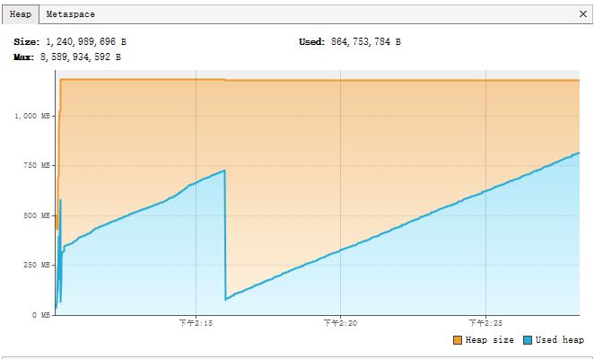
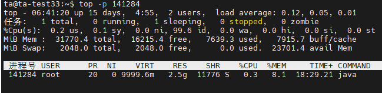
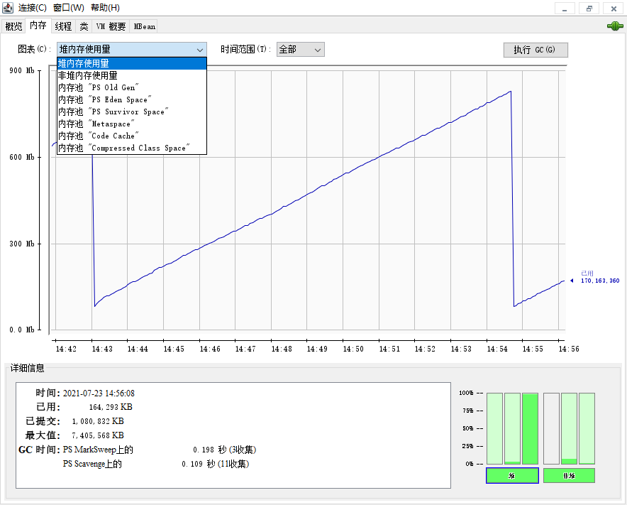
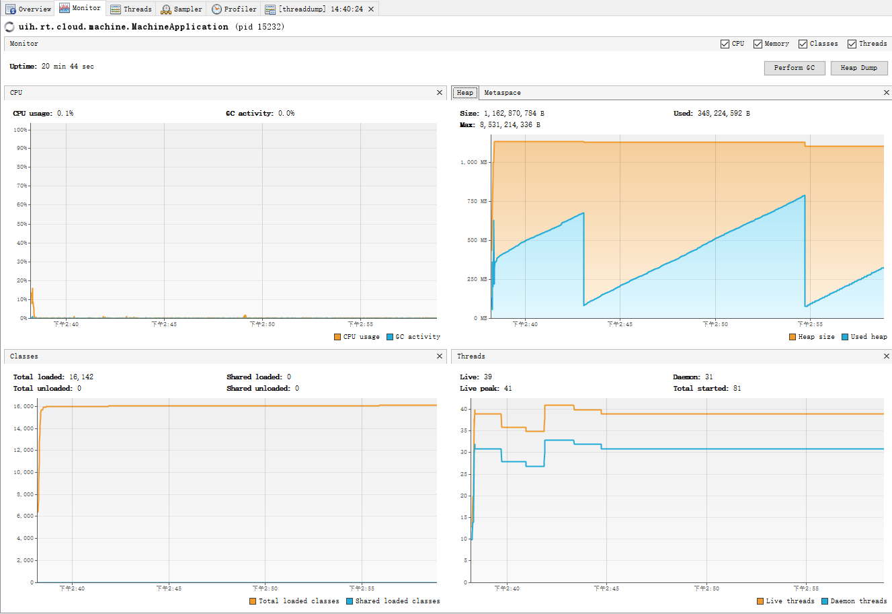
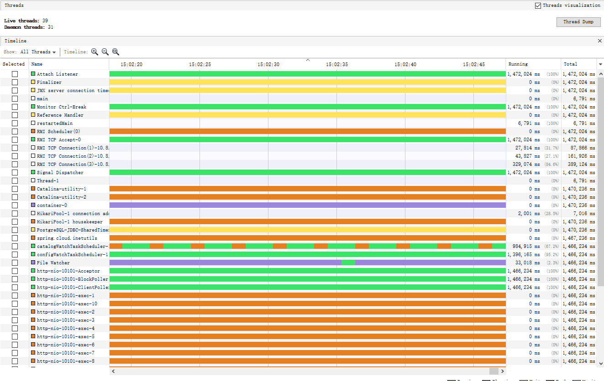

# 内存的几个概念

[Difference in Used, Committed, and Max Heap Memory | Baeldung](https://www.baeldung.com/java-heap-used-committed-max)

**RSS**

常驻内存集，为进程分配的内存大小，包括共享库的内存，不包括进入交换分区的内存，这里RSS就是实际进程占用的内存

**最大内存和自适应内存**

-Xms设定堆内存初始值 -Xmx设置堆内存最大值，如果不设定这两个参数，默认值就取决于操作系统，RAM，JVM本身


**已使用的内存**

used Heap: jvm中活动对象占用的内存，当used 接近committed的时候，heap就会grow up，-Xmx设置了Commit上限


**提交的内存大小**

Committed Size 

提交的内存大小 始终大于或等于已使用的内存，-Xmx设置了Commit上限。

表示可供java虚拟机使用的内存量，提交的内存可能会随时间的推移而变化（增加或者减少）。JVM可能会向OS释放内存，同时已提交的内存可能小于Init，已提交的内存将始终大于或等于Used Heap（ORACLE 官方文档中可以看到）。init是启动时后JVM向OS申请的内存，max是能够使用的最大边界值。注意这里说的都是虚拟内存，所以理论上整个操作系统**commited的内存为物理内存加上交换空间的大小**，换句话说如果commited超过物理内存的话，多余的部分就会被换出到磁盘。这也就是为什么jvm提交的内存可能会比实际进程占用的内存更大的原因。


## **一、认识JVM的内存**  

[JVM内存分析和优化 - 知乎 (zhihu.com)](https://zhuanlan.zhihu.com/p/59569813)

通常我们说的分析java内存，指的是分析java的**堆内存**（heap memory），稍微扩展点，还可能涉及到持久带内存（jre7以前）或者Metaspace（jre8以后）。一般的垃圾回收等参数优化，都是集中到堆内存。

除了对内存，jvm的运行还需要其他**本地内存**（native memory），包括栈内存（Thread），编译器内存，垃圾回收器内存，代码、类等静态数据内存，以及三方代码占用的内存等等。
由于分析技术和考察的内容不同，我们从两个不同的分析层面，将内存分析分为“堆内存分析”和“本地内存分析”。

内存占用是个比较复杂的概念，不能简单的理解为当前进程占用了多少内存。在系统空闲内存很多的时候，最大化利用内存可以提高性能。在一个受限容器里面，限制进程可用的最大内存是一个好主意。

**内存分析至少包含如下几个方面的任务：**

a. 如何规划和限制进程占用的最大内存。
b. 分析内存占用的原因，解决内存泄露问题。
c. 如何根据实际运行环境和应用场景，合理设置内存参数，最大化性能。

## **二、堆内存分析**

对内存的分析的资料比较多，一般比较常用。比如使用jmap和jhat将内存dump出来并分析对象实例，或者结合MemoryAnalyser等工具分析。
JVM还提供了jstat， jvisualvm等工具查看内存增长的趋势、变化情况，以及各个块的区域

设定-Xmx8192m后，windows任务管理器占用1046M内存



Size: 1,240,989,696 B=1183.5M **jvm向操作系统要了这么多内存**，当发生GC时这个会变多，也可能会变少

max:8,589,934,592=8192M 设定的**最大**堆内存，固定的，不设置时，默认为物理内存的1/4，当Size超过了这个值时，程序就会OOM，崩掉。

used:864,753,784B=824M 堆内存**已经使用**了这么多，程序放着跑不动时，这个内存周期性变化

## **三、本地内存分析**

本地内存分析比较复杂，这里只简单的介绍如何查看本地内存的使用。

通过jstat命令查看本地内存：

- Java Heap : reserved和commited一般对应-Xms128m -Xmx128m两个参数。

Class : reserved由虚拟机管理，通过一定算法计算出来。 commited一般和-XX:MaxMetaspaceSize=32m大小相关，但是可能超过-XX:MaxMetaspaceSize=32m的值。JIT运行的时候，也会导致reserved和commited的增长。

- Thread： 线程大小。和线程数量成正比。
- Code：JIT运行时用的大小。 reserved和commited分别对应-XX:InitialCodeCacheSize=16m和-XX:ReservedCodeCacheSize=16m。
- 其他： 主要是JVM相关的内容。 可以不用关心。

观察本地内存，需要在JVM启动参数里面增加如下参数：

```text
-XX:NativeMemoryTracking=summary
```

然后通过jcmd查看：

```text
     jcmd 17755 VM.native_memory summary
```

下面是命令执行结果的示例：

```text
Native Memory Tracking:
Total: reserved=1592030KB, committed=307938KB
-                 Java Heap (reserved=131072KB, committed=131072KB)
                            (mmap: reserved=131072KB, committed=131072KB)
-                     Class (reserved=1075815KB, committed=29363KB)
                            (classes #4823)
                            (malloc=615KB #6672)
                            (mmap: reserved=1075200KB, committed=28748KB)
-                    Thread (reserved=67106KB, committed=67106KB)
                            (thread #66)
                            (stack: reserved=66820KB, committed=66820KB)
                            (malloc=209KB #341)
                            (arena=77KB #131)
-                      Code (reserved=251936KB, committed=14296KB)
                            (malloc=2336KB #3508)
                            (mmap: reserved=249600KB, committed=11960KB)
-                        GC (reserved=21624KB, committed=21624KB)
                            (malloc=21192KB #206)
                            (mmap: reserved=432KB, committed=432KB)
-                  Compiler (reserved=227KB, committed=227KB)
                            (malloc=96KB #273)
                            (arena=131KB #3)
-                  Internal (reserved=2166KB, committed=2166KB)
                            (malloc=2134KB #7251)
                            (mmap: reserved=32KB, committed=32KB)
-                    Symbol (reserved=6697KB, committed=6697KB)
                            (malloc=4963KB #46864)
                            (arena=1734KB #1)
-    Native Memory Tracking (reserved=1031KB, committed=1031KB)
                            (malloc=9KB #106)
                            (tracking overhead=1022KB)
-               Arena Chunk (reserved=195KB, committed=195KB)
                            (malloc=195KB)
-                   Unknown (reserved=34160KB, committed=34160KB)
                            (mmap: reserved=34160KB, committed=34160KB)
```

## **四、内存分析和建议**

\1. JAVA内存测试主要关注堆内存， jstat命令输出为主； JAVA的本地内存以jcmd命令的输出为主(jcmd的committed比RSS大，但表示了进程可能使用的内存上限）。其他内存关注的必要性不是很大。

\2. 如果关注top命令的RES内存，建议设置如下参数然后在进行测试， 防止linux系统的内存管理机制和JVM的内存优化导致数据不准确（他们的目标都是最大化利用内存，而不是限制内存使用）

```text
   -server -Djava.compiler=none -Xms128m -Xmx128m -XX:InitialCodeCacheSize=16m -XX:ReservedCodeCacheSize=16m -XX:MetaspaceSize=64m -XX:MaxMetaspaceSize=64m -Dsun.reflect.inflationThreshold=2147483647
```

根据这个参数设置， 一个进程占用的RES最大值为： 128m（堆） + 16m（JIT）+ 128m（线程） + 64m（Class元数据）+ 64m（其他，包括Compiler/Internal/Symbol/Unknown等JVM内存） = 400m

对于实际运行参数的建议：

实际运行的参数应该尽可能利用内存，初始即分配合理的内存，允许一定的扩展，下面的参数比较可取：

```text
-server -Xms256m -Xmx512m -XX:InitialCodeCacheSize=32m -XX:ReservedCodeCacheSize=64m -XX:MetaspaceSize=64m -XX:MaxMetaspaceSize=128m -Dsun.reflect.inflationThreshold=2147483647
```

分配较大的初始内存不意味着一定需要这么多的内存才能够运行，运行环境设置较大的内存是很有意义的，特别是64位的操作系统。-Dsun.reflect.inflationThreshold=2147483647可以选择不配置，但是如果大量使用反射，

不配置可能非常多的内存，相反，配置的话会带来一定的计算性能开销，实测的结果是建议配置的。

**参考资料**

\1. Oracle 提供的内存分析工具：（包括JVM内存）

[https://docs.oracle.com/javase/8/docs/technotes/guides/troubleshoot/tooldescr007.html#BABGFCDA](https://link.zhihu.com/?target=https%3A//docs.oracle.com/javase/8/docs/technotes/guides/troubleshoot/tooldescr007.html%23BABGFCDA)

\2. 监控JVM堆和其他内存的工具jstat（主要是堆内存和Metaspace等）

[https://docs.oracle.com/javase/8/docs/technotes/tools/unix/jstat.html](https://link.zhihu.com/?target=https%3A//docs.oracle.com/javase/8/docs/technotes/tools/unix/jstat.html)

\3. 解释JVM内存占用机制和内存模型的很好参考

[http://www.ibm.com/developerworks/java/library/j-nativememory-linux/](https://link.zhihu.com/?target=http%3A//www.ibm.com/developerworks/java/library/j-nativememory-linux/)

\4. oracle jre 8的内存模型变化（Metaspace）

[http://www.infoq.com/articles/Java-PERMGEN-Removed](https://link.zhihu.com/?target=http%3A//www.infoq.com/articles/Java-PERMGEN-Removed)

[https://blogs.oracle.com/poonam/entry/about_g1_garbage_collector_permanent](https://link.zhihu.com/?target=https%3A//blogs.oracle.com/poonam/entry/about_g1_garbage_collector_permanent)

\5. jvm启动参数参考(包含GC优化参数)

[https://docs.oracle.com/javase/8/docs/technotes/tools/windows/java.html](https://link.zhihu.com/?target=https%3A//docs.oracle.com/javase/8/docs/technotes/tools/windows/java.html)

\6. 解释RES的意义和java内存的关系[http://stackoverflow.com/questions/561245/virtual-memory-usage-from-java-under-linux-too-much-memory-used](https://link.zhihu.com/?target=http%3A//stackoverflow.com/questions/561245/virtual-memory-usage-from-java-under-linux-too-much-memory-used)

\7. 解释JIT占用的内存已经相关配置参数

[https://docs.oracle.com/javase/8/embedded/develop-apps-platforms/codecache.htm](https://link.zhihu.com/?target=https%3A//docs.oracle.com/javase/8/embedded/develop-apps-platforms/codecache.htm)

\8. 了解反射带来的一些内存泄露问题

[http://stackoverflow.com/questions/6435985/getmethod-is-caching-and-cause-a-memory-leak](https://link.zhihu.com/?target=http%3A//stackoverflow.com/questions/6435985/getmethod-is-caching-and-cause-a-memory-leak)

\9. JVM committed内存和RSS内存的关系

解释为什么java committed总和大于RSS: [http://stackoverflow.com/questions/31071019/does-rss-tracks-reserved-or-commited-memory](https://link.zhihu.com/?target=http%3A//stackoverflow.com/questions/31071019/does-rss-tracks-reserved-or-commited-memory)

解释为什么java committed总和小于RSS：(J ，两种情况都会发生) [http://stackoverflow.com/questions/31173374/why-does-a-jvm-report-more-committed-memory-than-the-linux-process-resident-set](https://link.zhihu.com/?target=http%3A//stackoverflow.com/questions/31173374/why-does-a-jvm-report-more-committed-memory-than-the-linux-process-resident-set)

\10. 使用反射的时候可能存在本地内存的使用说明

[http://www-01.ibm.com/support/docview.wss?uid=swg21566549](https://link.zhihu.com/?target=http%3A//www-01.ibm.com/support/docview.wss%3Fuid%3Dswg21566549)（有点老和错误）

[https://blogs.oracle.com/buck/entry/inflation_system_properties](https://link.zhihu.com/?target=https%3A//blogs.oracle.com/buck/entry/inflation_system_properties) （Oracle JDK，测试结果这里面的是正确的）

\11. JIT相关资料

[http://www.oraclejavamagazine-digital.com/javamagazine_open/20120506#pg50](https://link.zhihu.com/?target=http%3A//www.oraclejavamagazine-digital.com/javamagazine_open/20120506%23pg50)

[http://www.oracle.com/technetwork/articles/java/architect-evans-pt1-2266278.html](https://link.zhihu.com/?target=http%3A//www.oracle.com/technetwork/articles/java/architect-evans-pt1-2266278.html)

\12. JRE8垃圾回收优化指南

[https://docs.oracle.com/javase/8/docs/technotes/guides/vm/gctuning/index.html](https://link.zhihu.com/?target=https%3A//docs.oracle.com/javase/8/docs/technotes/guides/vm/gctuning/index.html)

[https://docs.oracle.com/javase/](https://link.zhihu.com/?target=https%3A//docs.oracle.com/javase/8/docs/technotes/guides/vm/gctuning/cms.html%23concurrent_mark_sweep_cms_collector)

# JVM默认内存

https://www.cnblogs.com/guanghe/p/13558412.html

照官方的说法：“Java虚拟机具有一个堆，堆是运行时数据区域，所有类实例和数组的内存均从此处分配。堆是在Java虚拟机启动时创建的。”“在JVM中堆之外的内存称为非堆内存(Non-heapmemory)”。可以看出JVM主要管理两种类型的内存：堆和非堆。简单来说堆就是Java代码可及的内存，是留给开发人员使用的；非堆就是JVM留给自己用的，所以方法区、JVM内部处理或优化所需的内存(如JIT编译后的代码缓存)、每个类结构(如运行时常数池、字段和方法数据)以及方法和构造方法的代码都在非堆内存中。

**堆内存分配**

JVM初始分配的内存由-Xms指定，默认是物理内存的1/64；JVM最大分配的内存由-Xmx指定，默认是物理内存的1/4。默认空余堆内存小于40%时，JVM就会增大堆直到-Xmx的最大限制；空余堆内存大于70%时，JVM会减少堆直到-Xms的最小限制。因此服务器一般设置-Xms、-Xmx相等以避免在每次GC后调整堆的大小。

**非堆内存分配**

JVM使用-XX:PermSize设置非堆内存初始值，默认是物理内存的1/64；由XX:MaxPermSize设置最大非堆内存的大小，默认是物理内存的1/4。

**查看本机JVM最大堆内存大小**

java -XshowSettings:vm

在32Gwin10的机器上显示为 Max. Heap Size (Estimated): 7.06G

**查看本机最大metaspace**

在32Gwin10的机器上显示为

```
    uintx InitialBootClassLoaderMetaspaceSize       = 4194304                             {product}
    uintx MaxMetaspaceSize                          = 4294967295                          {product}
    uintx MetaspaceSize                             = 21810376                            {pd product}
```


# Java内存调优

https://blog.csdn.net/zengwende/article/details/103665545



**什么是RES和VIRT？**

什么是RES和VIRT？

**RES**：resident memory usage 常驻内存
（1）进程当前使用的内存大小，但不包括swap out

（2）包含其他进程的共享

（3）如果申请100m的内存，实际使用10m，它只增长10m，与VIRT相反

（4）关于库占用内存的情况，它只统计加载的库文件所占内存大小

RES = CODE + DATA

**VIRT**：virtual memory usage
（1）进程“需要的”虚拟内存大小，包括进程使用的库、代码、数据等

（2）假如进程申请100m的内存，但实际只使用了10m，那么它会增长100m，而不是实际的使用量

VIRT = SWAP + RES

# JVM内存总览工具

## jconsole



- 加载的类的数目、CPU占用、线程数、堆内存使用量
- JVM参数
- MBEAN
- 能够查看堆中的每个区占用内存随时间的变化，以及还可以查看非堆内存（元空间在内）的占用情况

## jvisualvm






- 可以查看内存信息，但没有jconsole详细
- JVM参数、系统信息
- 线程信息更加详细
- 可抓取CPU、内存的sample
- 

# 内存dump

https://blog.csdn.net/lidengchun/article/details/83660406

 在故障定位(尤其是out of memory)和性能分析的时候，经常会用到一些文件来帮助我们排除代码问题。这些文件记录了JVM运行期间的内存占用、线程执行等情况，这就是我们常说的dump文件。常用的有heap dump和thread dump（也叫javacore，或java dump）。我们可以这么理解：**heap dump记录内存信息的**，**thread dump是记录CPU信息**的。

## heap dump

 heap dump文件是一个二进制文件，它保存了**某一时刻JVM堆中对象使用情况**。HeapDump文件是指定时刻的Java堆栈的快照，是一种镜像文件。Heap Analyzer工具通过分析HeapDump文件，哪些对象占用了太多的堆栈空间，来发现导致内存泄露或者可能引起内存泄露的对象。

## thread dump

thread dump文件主要保存的是java应用中**各线程**在**某一时刻的运行的位置**，即执行到哪一个类的哪一个方法哪一个行上。thread dump是一个文本文件，打开后可以看到每一个线程的执行栈，以stacktrace的方式显示。通过对thread dump的分析可以得到应用是否“卡”在某一点上，即在某一点运行的时间太长，如数据库查询，长期得不到响应，最终导致系统崩溃。单个的thread dump文件一般来说是没有什么用处的，因为它只是记录了某一个绝对时间点的情况。比较有用的是，线程在一个时间段内的执行情况。

两个thread dump文件在分析时特别有效，困为它可以看出在先后两个时间点上，线程执行的位置，如果发现先后两组数据中同一线程都执行在同一位置，则说明此处可能有问题，因为程序运行是极快的，如果两次均在某一点上，说明这一点的耗时是很大的。通过对这两个文件进行分析，查出原因，进而解决问题。


## jmap获取heap dump


## jstack获取thread dump


# GC日志


例子：

```
-Xmx256m
-XX:+UseG1GC
-XX:+HeapDumpOnOutOfMemoryError
-XX:HeapDumpPath=dump
-verbose:gc
-Xloggc:machine-gc.log
-XX:+PrintGCDetails
-XX:+PrintGCTimeStamps
-XX:+PrintGCApplicationStoppedTime
-XX:+PrintReferenceGC
-Dcom.sun.management.jmxremote.authenticate=false
-Dcom.sun.management.jmxremote.ssl=false
```


https://blog.csdn.net/yinni11/article/details/102591431

```
-XX:+PrintGC 输出简要GC日志 
-XX:+PrintGCDetails 输出详细GC日志 
-Xloggc:gc.log  输出GC日志到文件
-XX:+PrintGCTimeStamps 输出GC的时间戳（以JVM启动到当期的总时长的时间戳形式） 
-XX:+PrintGCDateStamps 输出GC的时间戳（以日期的形式，如 2013-05-04T21:53:59.234+0800） 
-XX:+PrintHeapAtGC 在进行GC的前后打印出堆的信息
-verbose:gc
-XX:+PrintReferenceGC 打印年轻代各个引用的数量以及时长
```


# 监控工具


## prometheus

https://prometheus.io/docs/prometheus/latest/installation/

https://www.cnblogs.com/larrydpk/p/12563497.html

prometheus.yml:

```yaml
scrape_configs:
# 可随意指定
- job_name: 'spring'
  # 多久采集一次数据
  scrape_interval: 15s
  # 采集时的超时时间
  scrape_timeout: 10s
  # 采集的路径
  metrics_path: '/actuator/prometheus'
  # 采集服务的地址，设置成Springboot应用所在服务器的具体地址
  static_configs:
  - targets: ['localhost:10101']
```

Dockerfile

```
FROM prom/prometheus
ADD prometheus.yml /etc/prometheus/
```

build：

```
docker build -t my-prometheus .
docker run -p 9090:9090 my-prometheus
```

浏览器访问：

http://localhost:9090/targets


## Grafana

http://localhost:3000/d/MtVkFDWnz/spring-boot-2-1-statistics?orgId=1


