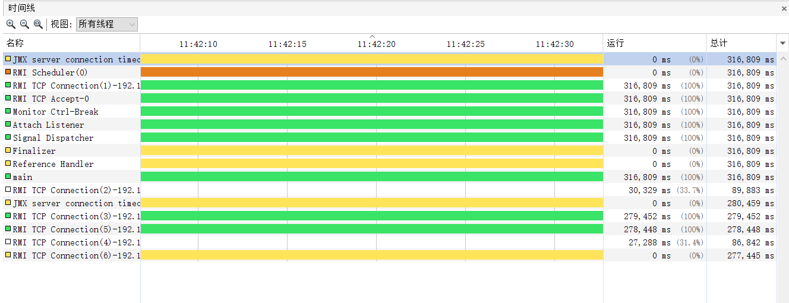
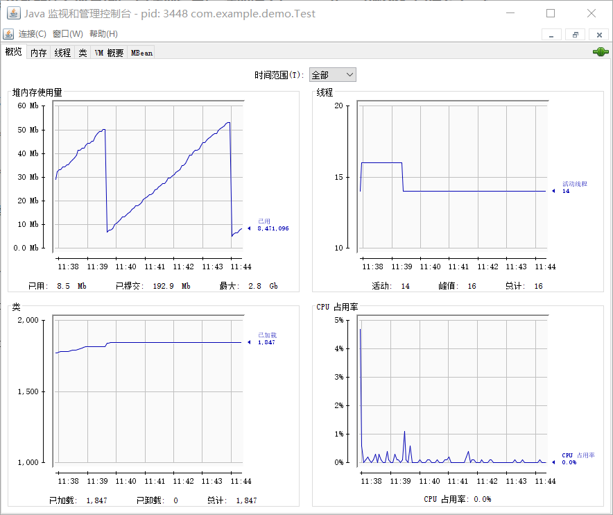
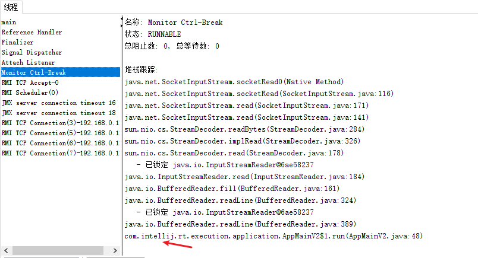

# GC

## JVM线程

随便写个main函数，为了让程序停在那里,input等待输入

```java
package com.example.demo;

import java.util.Scanner;

public class Test {
    public static void main(String[] args) {
        Scanner scanner = new Scanner(System.in);
        String s = scanner.nextLine();
        System.out.println(s);
    }
}
```

然后，有这么多线程：



young GC大概四、五分钟一次



## 线程介绍

[性能分析之-- JAVA Thread Dump 分析综述_骆骆的博客-CSDN博客](https://blog.csdn.net/rachel_luo/article/details/8920596)

**Attach Listener线程**

Attach Listener 线程是负责接收到外部的命令，而对该命令进行执行的并且吧结果返回给发送者。通常我们会用一些命令去要求jvm给我们一些反馈信息，如：java -version、jmap、jstack等等。 如果该线程在jvm启动的时候没有初始化，那么，则会在用户第一次执行jvm命令时，得到启动。

**Signal Dispatcher线程**

前面我们提到第一个Attach Listener线程的职责是接收外部jvm命令，当命令接收成功后，会交给signal dispather 线程去进行分发到各个不同的模块处理命令，并且返回处理结果。 signal dispather线程也是在第一次接收外部jvm命令时，进行初始化工作。

**Reference Handler 线程**

JVM在创建main线程后就创建Reference Handler线程，其优先级最高，为10，它主要用于处理引用对象本身（软引用、弱引用、虚引用）的垃圾回收问题 。

**Finalizer 线程**

这个线程也是在main线程之后创建的，其优先级为10，主要用于在垃圾收集前，调用对象的finalize()方法；关于Finalizer线程的几点：

1) 只有当开始一轮垃圾收集时，才会开始调用finalize()方法；因此并不是所有对象的finalize()方法都会被执行；

2) 该线程也是daemon线程，因此如果虚拟机中没有其他非daemon线程，不管该线程有没有执行完finalize()方法，JVM也会退出；

3) JVM在垃圾收集时会将失去引用的对象包装成Finalizer对象（Reference的实现），并放入ReferenceQueue，由Finalizer线程来处理；最后将该Finalizer对象的引用置为null，由垃圾收集器来回收；

4) JVM为什么要单独用一个线程来执行finalize()方法呢？如果JVM的垃圾收集线程自己来做，很有可能由于在finalize()方法中误操作导致GC线程停止或不可控，这对GC线程来说是一种灾难；

**Monitor Ctrl-Break 线程**

[Monitor Ctrl-Break线程，有点坑 - 常温的冰 - 博客园 (cnblogs.com)](https://www.cnblogs.com/hpdblogs/p/13876624.html)

有人说，Monitor Ctrl-Break线程是在**idea**中才有的 ，好像是这样的：




# 新生代调优

[JVM 调优 —— 新生代 Survivor 空间不足 - cxchanpin - 博客园 (cnblogs.com)](https://www.cnblogs.com/cxchanpin/p/7204909.html)

**规律：**增大新生代空间。 Minor GC 频率降低， Minor GC 时间上升。 降低新生代空间， Minor GC 频率上升， Minor GC 时间下降

当新生代的 Survivor 空间不足时， 那么从 Eden 存活下来的和原来在 Survivor 空间中不够老的对象占满 Survivor 后， 就会提升到老年代， 能够看到这一轮 Minor GC 后老年代由原来的 0K 占用变成了 105782K 占用， 这属于一个典型的 JVM 内存问题。 称为 "**premature promotion"(过早提升)**。


"premature promotion” 在短期看来不会有问题， 可是常常性的 "premature promotion”， 最总会导致大量短期对象被提升到老年代， 终于导致老年代空间不足， 引发还有一个 JVM 内存问题 “promotion failure”（提升失败： 即老年代空间不足以容乃 Minor GC 中提升上来的对象）。 “promotion failure” 发生就会让 JVM 进行一次 CMS 垃圾收集进而腾出空间接受新生代提升上来的对象。 CMS 垃圾收集时间比 Minor GC 长， 导致吞吐量下降、 时延上升， 将对用户体验造成影响。

**新生代调优建议**

对于上述的新生代问题， 假设server内存足够用， 建议是直接增大新生代空间(如 -Xmn)。


假设内存不够用。 则添加 Survivor 空间， 降低 Eden 空间， 可是注意降低 Eden 空间会添加 Minor GC 频率， 要考虑到应用对延迟和吞吐量的指标终于是否符合。


要增大多少 Survivor 空间？ 须要观察多次 Minor GC 过程。 看 Minor GC 后存活下来的对象大小。 终于确定 Survivor 的合适大小。 整个调优过程可能须要几次调整。 才干找到比較合适的值。调整几次后， 假设内存还是不够用， 就要须要考虑增大server内存， 或者把负载分担到很多其它的 JVM 实例上。

Survivor 空间计算公式： survivor 空间大小 = -Xmn[value] / (-XX:SurvivorRatio=\<ratio> + 2)  

