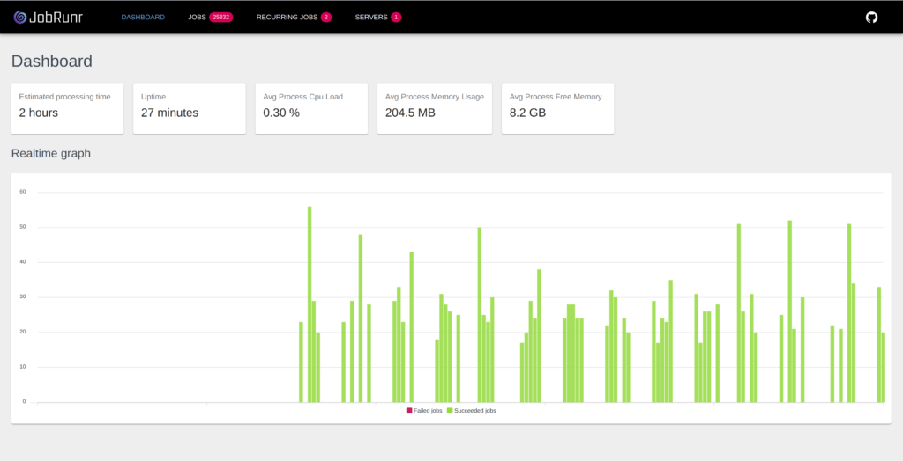

# 入门使用

依赖

```xml
<dependency>
    <groupId>org.jobrunr</groupId>
    <artifactId>jobrunr-spring-boot-starter</artifactId>
    <version>3.1.2</version>
</dependency>
```

配置

```
org.jobrunr.background-job-server.enabled=true
org.jobrunr.dashboard.enabled=true
```

持续化

```java
@Bean
public StorageProvider storageProvider(JobMapper jobMapper) {
    InMemoryStorageProvider storageProvider = new InMemoryStorageProvider();
    storageProvider.setJobMapper(jobMapper);
    return storageProvider;
}
```

注入

```java
@Inject
private JobScheduler jobScheduler;

@Inject
private SampleJobService sampleJobService;
```

使用队列的方式创建作业：缺点：会阻塞在队列中

和abp的background job很类似

```java
jobScheduler.enqueue(() -> sampleJobService.executeSampleJob());
//lambda 写法
jobScheduler.enqueue(() -> sampleJobService.executeSampleJob("some string"));
```

job的计划执行：

```
jobScheduler.schedule(LocalDateTime.now().plusHours(5), () -> sampleJobService.executeSampleJob());
```

循环执行

```
jobScheduler.scheduleRecurrently(Cron.hourly(), () -> sampleJobService.executeSampleJob());
```

在业务方法上加注解来设置job失败重试次数

```java
@Job(name = "The sample job with variable %0", retries = 2)
public void executeSampleJob(String variable) {
    ...
}
```

## 仪表板

http://localhost:8000

