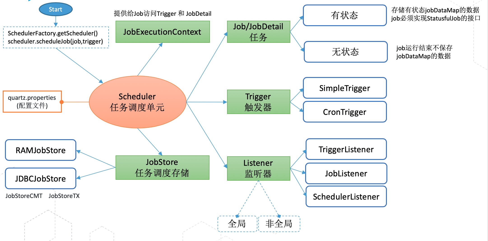
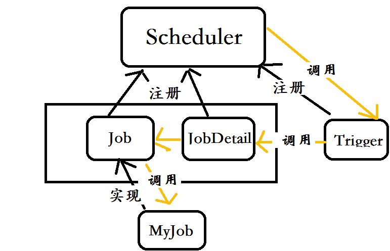
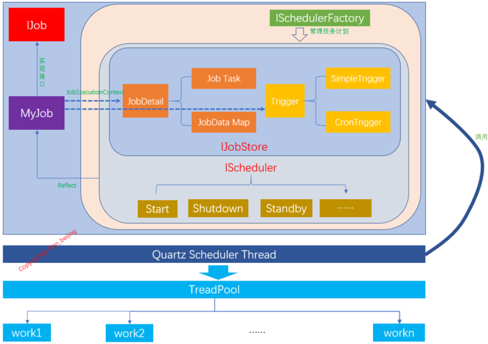
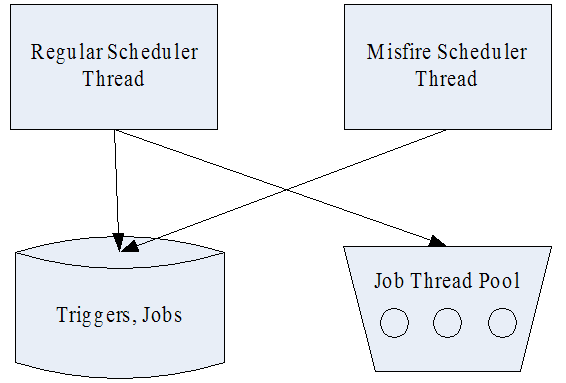
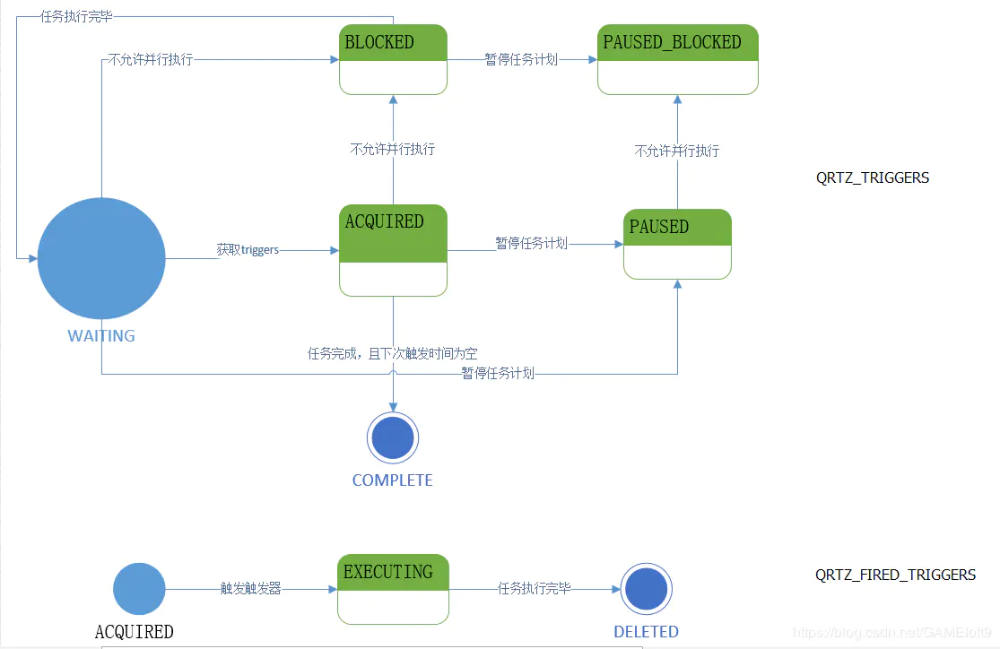
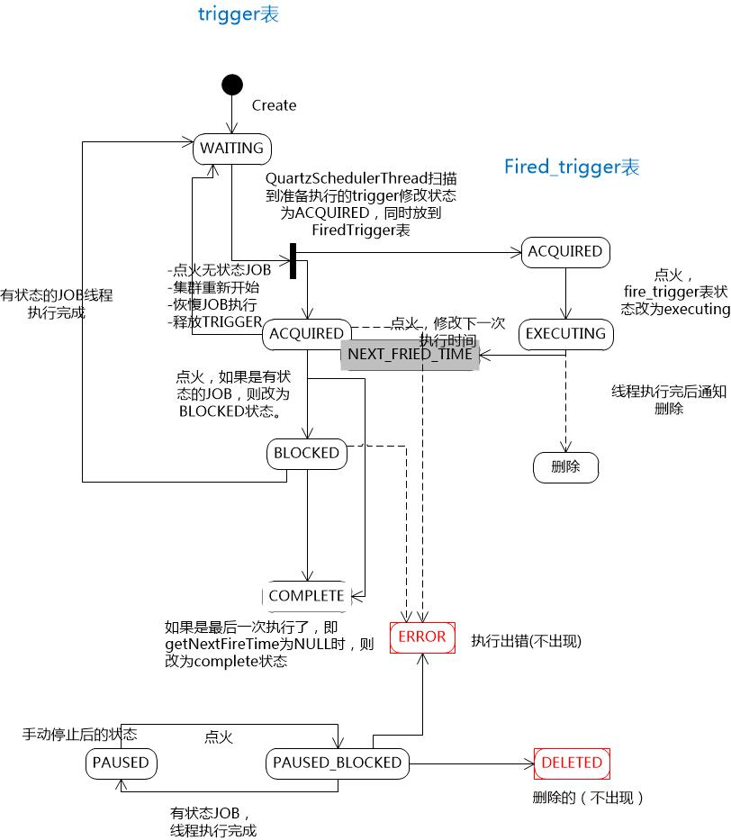
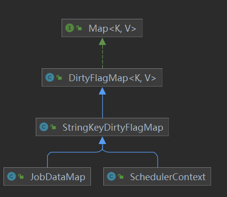

# 简介

参考来源：https://www.w3cschool.cn/quartz_doc/

作业调度框架

Quartz 是一个完全由 Java 编写的开源作业调度框架，为在 Java 应用程序中进行作业调度提供了简单却强大的机制。

Quartz 可以与[ J2EE](https://www.w3cschool.cn/java_interview_question/java_interview_question-wvr326ra.html) 与 J2SE 应用程序相结合也可以单独使用。

Quartz 允许程序开发人员根据**时间的间隔**来调度作业。

Quartz 实现了作业和**触发器**的多对多的关系，还能把多个作业与不同的触发器关联。


- Quartz 可以运行嵌入在另一个独立式应用程序。
- Quartz 可以在应用程序服务器(或 [servlet 容器](https://www.w3cschool.cn/spring_mvc_documentation_linesh_translation/spring_mvc_documentation_linesh_translation-it8y27sq.html))内被实例化，并且参与 XA 事务。
- Quartz 可以作为一个独立的程序运行(其自己的 Java 虚拟机内)，可以通过 RMI 使用。
- Quartz 可以被实例化，作为独立的项目集群(负载平衡和故障转移功能)，用于作业的执行。

**四大核心对象：Job、JobDetail、Trigger、Scheduler**

构建核心对象：JobBuilder、TriggerBuilder 、SchedulerBuilder

**传参容器：JobDataMap**

标识：**JobKey 和 TriggerKey**

Job执行上下文：JobExecutionContext

监听器：JobListener、TriggerListener、SchedulerListener

Job调度存储：JDBCJobStore(数据库存储)、RAMJobStore(内存存储)

# 组织架构

## 整体设计

来源：https://www.liangzl.com/get-article-detail-127033.html



整个调度系统简单理解就是：Scheduler（任务调度器）将Job/JobDetail(如何做)和Trigger（什么时间做与不做）打包成一个调度item进行调度，对过程中的重要事件，开放Listener钩子给业务用于实现事件处理，整个调度可以采用在内存里面(RAMJobStore)还是持久化(JDBCJobStore)运作。

## 核心对象之间的关系



图片来源：https://blog.csdn.net/ZuoAnYinXiang/article/details/78121124

下面是详细关系图：

来源：https://www.likecs.com/show-41862.html



## Quartz线程



图片来源：https://www.cnblogs.com/zhenyuyaodidiao/p/4755649.html


# Job任务

- 分为有状态和无状态
- 可以持久化或不持久化

## 无状态:Job接口

**Job** 表示一个被调度的任务，要执行的具体内容。此接口中只有一个方法，如下：

```java
public interface Job {
    void execute(JobExecutionContext var1) throws JobExecutionException;
}
```

```java
public class HelloJob implements Job {
    public void  execute(JobExecutionContext context) throws JobExecutionException{
        System.err.println("Hello!  HelloJob is executing.");
    }
}
```

**execute方法的作用**

job的一个 trigger 被触发后（稍后会讲到），execute() 方法会被 scheduler 的一个工作线程调用；传递给 execute() 方法的 JobExecutionContext 对象中保存着该 job 运行时的一些信息 ，执行 job 的 scheduler 的引用，触发 job 的 trigger 的引用，JobDetail 对象引用，以及一些其它信息。

**Job的有状态和无状态**

主要有两种类型的 job：无状态的（stateless）和有状态的（stateful）。对于同一个 trigger 来说，有状态的 job 不能被并行执行，只有上一次触发的任务被执行完之后，才能触发下一次执行。Job 主要有两种属性：volatility 和 durability，其中 volatility 表示任务是否被持久化到数据库存储，而 durability 表示在没有 trigger 关联的时候任务是否被保留。两者都是在值为 true 的时候任务被持久化或保留。一个 job 可以被多个 trigger 关联，但是一个 trigger 只能关联一个 job。


## Job实例在quartz中的生命周期

每次调度器调度`job`时，**在执行execute方法前都会创建新的job实例**，所以不用担心Job对象的线程安全问题。当调用完成后，关联的job实例会被释放，会GC回收。

## 有状态：StatefulJob接口（已过时）

继承自Job，由于在定义时添加了@PersistJobDataAfterExecution注释，所以是有状态的任务，在Schedule执行完triger之后，**会将实现了该接口的任务状态记录到数据库中，所以要是有状态的定时任务**

源码：

```java
//@deprecated use DisallowConcurrentExecution and/or PersistJobDataAfterExecution annotations instead.
@PersistJobDataAfterExecution //执行后进行持久化
@DisallowConcurrentExecution //不允许job并发
public interface StatefulJob extends Job {
}
```

正如原码中描述：use DisallowConcurrentExecution and/or PersistJobDataAfterExecution annotations instead.该接口已过时，但是可以使用@PersistJobDataAfterExecution 和/或 @DisallowConcurrentExecution 注解代替。

## 有状态和无状态的区别

啥叫状态：JobDataMap中存储的数据就叫Job的状态

- 无状态任务在执行时，拥有自己的JobDataMap拷贝，对JobData的更改不会影响下次的执行。

- 而有状态任务共享同一个JobDataMap实例，每次任务执行对JobDataMap所做的更改都会保存下来，后面的执行可以看到这个更改。也就是每次执行任务后都会对后面的执行发生影响，因此**有状态的Job不允许并发执行**，需要加上注解：**@DisallowConcurrentExecution** 。
- 这意味着如果前次的StatefulJob还没有执行完毕，下一次的任务将阻塞等待，直到前次任务执行完毕。有状态任务比无状态任务需要考虑更多的因素，程序往往拥有更高的复杂度，因此除非必要，应该尽量使用无状态的Job。

Trigger自身也可以拥有一个JobDataMap，其关联的Job可以通过JobExecutionContext#getTrigger().getJobDataMap()获取Trigger中的JobDataMap。**不管是有状态还是无状态的任务，在任务执行期间对Trigger的JobDataMap所做的更改都不会进行持久，也即不会对下次的执行产生影响。**

# JobDetail任务信息

上一小节定义了一个实现Job接口的HelloJob类，这个类仅仅表明该job需要完成什么类型的任务，除此之外，Quartz还需要知道该Job实例所包含的属性，这将由JobDetail类来完成。

JobDetail 对象是在将 job 加入 scheduler 时，由客户端程序（你的程序）创建的。它**包含 job 的各种属性设置**，以及用于存储 job 实例状态信息的 **JobDataMap**。

说白了JobDetail就是调度之前声明的Job的

```java
  // define the job and tie it to our HelloJob class
  JobDetail jobDetail = JobBuilder.newJob(HelloJob.class)
      .withIdentity("myJob", "group1") // 作业标识和分组
      .build();
```


# Trigger触发器

**Trigger** 代表一个调度参数的配置，什么时候去调，怎么去调。

Trigger 用于触发 Job 的执行。当你准备调度一个 job 时，你创建一个 Trigger 的实例，然后设置调度相关的属性。Trigger 也有一个相关联的 JobDataMap，用于给 Job 传递一些触发相关的参数。Quartz 自带了各种不同类型的 Trigger，最常用的主要是 SimpleTrigger 和 CronTrigger。

```java
// Trigger the job to run now, and then every 40 seconds
Trigger trigger = TriggerBuilder.newTrigger()
    .withIdentity("myTrigger", "group1") //Trigger标识和分组
    .startNow()  //什么时候开始执行
    .withSchedule(SimpleScheduleBuilder.simpleSchedule() ///用什么样的调度器
                  .withIntervalInSeconds(40) //执行间隔
                  .repeatForever())            //重复次数
    .build();
```

- SimpleTrigger 主要用于一次性执行的 Job（只在某个特定的时间点执行一次），，或者 Job 在特定的时间点执行，重复执行 N 次，每次执行间隔T个时间单位
- CronTrigger 在基于日历的调度上非常有用，如“每个星期五的正午”，或者“每月的第十天的上午 10:15”等。

为什么既有 Job，又有 Trigger 呢？很多任务调度器并不区分 Job 和 Trigger。有些调度器只是简单地通过一个执行时间和一些 job 标识符来定义一个 Job；其它的一些调度器将 Quartz 的 Job 和 Trigger 对象合二为一。在开发 Quartz 的时候，我们认为将调度和要调度的任务分离是合理的。在我们看来，这可以带来很多好处。

例如，Job 被创建后，可以保存在 Scheduler 中，与 Trigger 是独立的，同一个 Job可以有多个 Trigger；这种松耦合的另一个好处是，当与 Scheduler 中的 Job 关联的 trigger 都过期时，可以配置 Job 稍后被重新调度，而不用重新定义 Job；还有，可以修改或者替换 Trigger，而不用重新定义与之关联的 Job。

## Trigger状态转换

来源：https://blog.csdn.net/GAMEloft9/article/details/89454747

要通过文字讲清Trigger状态转换很难，而一张好图胜过千言万语。下面是整理的Trgger状态转换图，为了更好的突出重点，避免增加复杂度，这里仅描述了正常流程下的默认状态转换，忽略掉了集群恢复(clusterRecover)和部分手动更改任务计划（例如调用removeJob()，resumeJob()等）导致的状态转换。

建议边对照这张图边翻看源码，可以达到事半功倍的效果。







上图来源：https://blog.csdn.net/lkl_csdn/article/details/73613033

# Scheduler调度器

**Scheduler** 代表一个调度容器，一个调度容器中可以注册多个 JobDetail 和 Trigger。当 Trigger 与 JobDetail 组合，就可以被 Scheduler 容器调度了。

```java
//通过创建一个工厂Factory来获取Scheduler示例
SchedulerFactory schedFact = new StdSchedulerFactory();
Scheduler scheduler = schedFact.getScheduler();

// Tell quartz to schedule the job using our trigger
scheduler.scheduleJob(jobDetail, trigger);
scheduler.start();
```

可以看到，我们传给scheduler一个JobDetail实例，因为我们在创建JobDetail时，将要执行的job的类名传给了JobDetail，所以scheduler就知道了要执行何种类型的job；每次当scheduler执行job时，在调用其execute(…)方法之前会创建该类的一个新的实例；执行完毕，对该实例的引用就被丢弃了，实例会被垃圾回收；这种执行策略带来的一个后果是，job必须有一个无参的构造函数（当使用默认的JobFactory时）；另一个后果是，在job类中，不应该定义有状态的数据属性，因为在job的多次执行中，这些属性的值不会保留。

那么如何给job实例增加属性或配置呢？如何在job的多次执行中，跟踪job的状态呢？答案就是:JobDataMap，JobDetail对象的一部分。

## Scheduler是单例的

来源：https://blog.csdn.net/m0_45406092/article/details/105731132

注意：**Scheduler实例是全局唯一** ，每次通过 工厂的getScheduler()获取的都是同一个实例

例1，同一个工厂对象，获取2次Scheduler实例进行对比：

```java
SchedulerFactory sf = new StdSchedulerFactory();
Scheduler scheduler = sf.getScheduler();   //第一次获取
Scheduler scheduler2 = sf.getScheduler();  //第二次获取
System.out.println(scheduler == scheduler2 );   //比较地址，输出是`true`
```

例2，构建2个工厂对象，各自获取Scheduler实例进行对比：

```java
StdSchedulerFactory factory = new StdSchedulerFactory();   //构造一个新的工厂实例
StdSchedulerFactory factory2 = new StdSchedulerFactory(); //构造一个新的工厂实例

Scheduler scheduler = factory.getScheduler();
Scheduler scheduler2 = factory2.getScheduler();
System.out.println(scheduler == scheduler2);     //比较地址，输出是`true`
```

为何每个实例都相同呢，答案在于getScheduler方法，其中的SchedulerRepository是个单例模式，所有的factory都共享该实例：

```java
public Scheduler getScheduler() throws SchedulerException {
    if (cfg == null) {
        initialize();
    }
    //获取
    SchedulerRepository schedRep = SchedulerRepository.getInstance();

    Scheduler sched = schedRep.lookup(getSchedulerName());

    if (sched != null) {
        if (sched.isShutdown()) {
            schedRep.remove(getSchedulerName());
        } else {
            return sched;
        }
    }
    sched = instantiate();
    return sched;
}
```

## 管理调度器

拿到调度器实例以后，在调度的生命周期中可以做以下工作，例如：启动调度器，设置调度器为standby模式，继续或停止调度器。
（1）启动Scheduler
  当调度器初始化完成，并且Job和Trigger也注册完成，此时就可以调用scheduler.start()启动调度器了。start()方法一旦被调用，调度器就开始搜索需要执行的Job。
（2）设置standby模式
  设置Scheduler为standby模式会让调度器暂停寻找Job去执行。
  应用场景举例：当需要重启数据库时可以先将调度器设置为standby模式，待数据库启动完成后再通过start()启动调度器。
（3）停止调度器
  调用shutdown()或shutdown(boolean waitForJobsToComplete)方法停止调度器。第二个方法表示等待所有正在执行的job执行完毕后才停止调度器。shutdown方法调用后，就不可以再调用start方法了，因为shutdown方法会销毁Scheduler创建的所有资源（线程、数据库连接等）。

一般情况下，调度器启动后不需要做其他任何事情。

# JobDataMap

Job的生命周期决定了Job是无状态的，而JobDataMap的存在又让Job变成有状态的了。

JobDataMap的父类实现了Java中的Map接口，其默认初始容量是15，可以存放数据，让job使用，说白了，就是job对象需要从外界传参进来就是通过从JobDataMap中获取。

JobDetail和Trigger对象中都有JobDataMap，二者不是同一个，也就是说，我们有两种途径往Job中传数据，二者有啥不同，下面会提到。

## JobDetail中的JobDataMap

其中，usingJobData就是调用了jobDataMap.put(dataKey, value)方法，而jobDataMap对象是JobBuilder对象或TriggerBuilder中的私有非静态属性，**build()时会将JobBuilder或TriggerBuilder对象中jobDataMap传入jobDetail对象中**

```java
// define the job and tie it to our DumbJob class
JobDetail job = JobBuilder.newJob(DumbJob.class)
    .withIdentity("myJob", "group1") // name "myJob", group "group1"
    .usingJobData("jobSays", "Hello World!") 
    .usingJobData("myFloatValue", 3.141f)
    .build();
```

### 方式一：手动获取

**通过Job执行上下文对象（JobExecutionContext）来获取当前JobDetail对象，再从JobDetail对象中获取JobDataMap，然后就可以从JobDataMap获取数据了。**

```java
public class DumbJob implements Job {

    public DumbJob() {
    }

    public void execute(JobExecutionContext context)
      throws JobExecutionException
    {
      JobKey key = context.getJobDetail().getKey();

      JobDataMap dataMap = context.getJobDetail().getJobDataMap();

      String jobSays = dataMap.getString("jobSays");
      float myFloatValue = dataMap.getFloat("myFloatValue");

      System.err.println("Instance " + key + " of DumbJob says: " + jobSays + ", and val is: " + myFloatValue);
    }
  }
```

### 方式二：自动获取

如果在Job类中定义与JobDataMap中键值一致的set和get方法，那么Quartz会自动将这些属性注入。如：

```java
JobDetail job = JobBuilder.newJob(HelloJob.class)
    .withIdentity("job1", "group1")
    .usingJobData("name", "artisan")
    .usingJobData("age", 24).build();
```

```java
import org.quartz.*;
import org.slf4j.Logger;
import org.slf4j.LoggerFactory;

public class HelloJob implements Job {

    private String name;
    private int age;

    public String getName() {
        return name;
    }

    public void setName(String name) {
        this.name = name;
    }

    public int getAge() {
        return age;
    }

    public void setAge(int age) {
        this.age = age;
    }

    @Override
    public void execute(JobExecutionContext context) throws JobExecutionException {
        JobKey key = context.getJobDetail().getKey();
        System.out.println("Instance " + key + ",姓名：" + name + ",年龄：" + age);
    }
}
```

运行结果：

```
Instance group1.job1,姓名：artisan,年龄：24
```

## Trigger中的JobDataMap

```java
Trigger trigger = TriggerBuilder
    .newTrigger()
    .withIdentity("myTrigger", "group1")
    .usingJobData("jobSays", "Hello World!2") 
    .startNow()
    .withSchedule(SimpleScheduleBuilder.simpleSchedule()
                  .withIntervalInSeconds(5)
                  .withRepeatCount(0))
    .build();
```

由于jobDataMap底层还是Map，所以TriggerBuilder和JobDetail对同一个属性key赋值时，**后来的会把之前的覆盖掉。**


## 脏数据的问题

jobDataMap对于Builder来说，只有一份对象，而且这个对象还要传给多个JobDetail，这会产生脏数据问题，Quartz是怎么解决的呢？

先看看JobDataMap这个类的继承体系：



DirtyFlagMap类中有一个私有属性：dirty

```java
rivate boolean dirty = false;
```

一句话：在某些时机（自己去看源码），会根据这个dirty来调用Map的clear()方法，来清除Map中的数据。

```java
public void clear() {
    if (!map.isEmpty()) {
        dirty = true;
    }
    map.clear();
}
```

## 数据一致性问题

如果你使用的是持久化的存储机制（本教程的JobStore部分会讲到），在决定JobDataMap中存放什么数据的时候需要小心，因为JobDataMap中存储的对象都会被序列化，因此很可能会导致类的版本不一致的问题；Java的标准类型都很安全，如果你已经有了一个类的序列化后的实例，某个时候，别人修改了该类的定义，此时你需要确保对类的修改没有破坏兼容性；更多细节，参考[现实中的序列化问题](http://java.sun.com/developer/TechTips/2000/tt0229.html)。另外，你也可以配置JDBC-JobStore和JobDataMap，使得map中仅允许存储基本类型和String类型的数据，这样可以避免后续的序列化问题。

如果你在job类中，为JobDataMap中存储的数据的key增加set方法（如在上面示例中，增加setJobSays(String val)方法），那么Quartz的默认JobFactory实现在job被实例化的时候会自动调用这些set方法，这样你就不需要在execute()方法中显式地从map中取数据了。

在Job执行时，JobExecutionContext中的JobDataMap为我们提供了很多的便利。它是JobDetail中的JobDataMap和Trigger中的JobDataMap的并集，但是如果存在相同的数据，则后者会覆盖前者的值。

下面的示例，在job执行时，从JobExecutionContext中获取合并后的JobDataMap：

```java
    public class DumbJob implements Job {

        public DumbJob() {
        }

        public void execute(JobExecutionContext context)
          throws JobExecutionException
        {
            JobKey key = context.getJobDetail().getKey();

            JobDataMap dataMap = context.getMergedJobDataMap();  // Note the difference from the previous example

            String jobSays = dataMap.getString("jobSays");
            float myFloatValue = dataMap.getFloat("myFloatValue");
            ArrayList state = (ArrayList)dataMap.get("myStateData");
            state.add(new Date());

            System.err.println("Instance " + key + " of DumbJob says: " + jobSays + ", and val is: " + myFloatValue);
        }
    }
```


# JobKey 和 TriggerKey

将 Job 和 Trigger 注册到 Scheduler 时，可以为它们设置 key，配置其身份属性。 Job 和 Trigger 的 key（JobKey 和 TriggerKey）可以用于将 Job 和 Trigger 放到不同的分组（group）里，然后基于分组进行操作。同一个分组下的 Job 或 Trigger 的名称必须唯一，即一个 Job 或 Trigger 的 key 由名称（name）和分组（group）组成。

**每个JobDetail和Trigger都name和group组成的key。**

# 用到的设计模式

## Builder模式和链式调用

Quartz 提供的“builder”类，可以认为是一种领域特定语言（DSL，Domain Specific Language)。其实就是设计模式里的建造者模式。

### JobBuilder 

用于定义/构建 JobDetail对象，用于定义作业的实例。

```java
JobDetail jobDetail = JobBuilder.newJob(HelloJob.class)
    .withIdentity("myJob", "group1") // name "myJob", group "group1"
    .build();
```

### TriggerBuilder 

用于定义/构建Trigger对象。

```java
Trigger trigger = TriggerBuilder.newTrigger()
    .withIdentity("myTrigger", "group1")
    .startNow()
    .withSchedule(SimpleScheduleBuilder.simpleSchedule()
        .withIntervalInSeconds(40)
        .repeatForever())            
    .build();
```

### SchedulerBuilder

SchedulerBuilder 抽象类的各种子类，可以创建不同类型的调度计划 （schedule）对象,源码如下

```java
public abstract class ScheduleBuilder<T extends Trigger> {
    public ScheduleBuilder() {
    }

    protected abstract MutableTrigger build();
}
```

## 工厂模式


## 组合模式

# JobExecutionContext

当Scheduler调用一个job,就会将JobExecutionContext传递给Job的execution()方法,Job能通过JobExecutionContext对象访问到Quartz运行时候的环境以及Job本身的明细数据。

JobExecutionContext接口源码：

```java
public interface JobExecutionContext {
    public Scheduler getScheduler();
    public Trigger getTrigger();
    public Calendar getCalendar();//日历，和Trigger有关
    public boolean isRecovering();//是否在恢复执行
    public int getRefireCount();
    public JobDataMap getMergedJobDataMap();
    public JobDetail getJobDetail();
    public Job getJobInstance();
    public Date getFireTime();
    public Date getScheduledFireTime();
    public Date getPreviousFireTime();
    public Date getNextFireTime();
    public String getFireInstanceId();
    public Object getResult();
    public void setResult(Object result);
    public long getJobRunTime();
    public void put(Object key, Object value);
    public Object get(Object key);
}
```
# 配置

详细配置可看中文文档：https://www.w3cschool.cn/quartz_doc/quartz_doc-ml8e2d9m.html

## 线程池配置

|            Property Name             | Required |        Type         |      Default Value       |
| :----------------------------------: | :------: | :-----------------: | :----------------------: |
|     org.quartz.threadPool.class      |   yes    | string (class name) |           null           |
|  org.quartz.threadPool.threadCount   |   yes    |         int         |            -1            |
| org.quartz.threadPool.threadPriority |    no    |         int         | Thread.NORM_PRIORITY (5) |