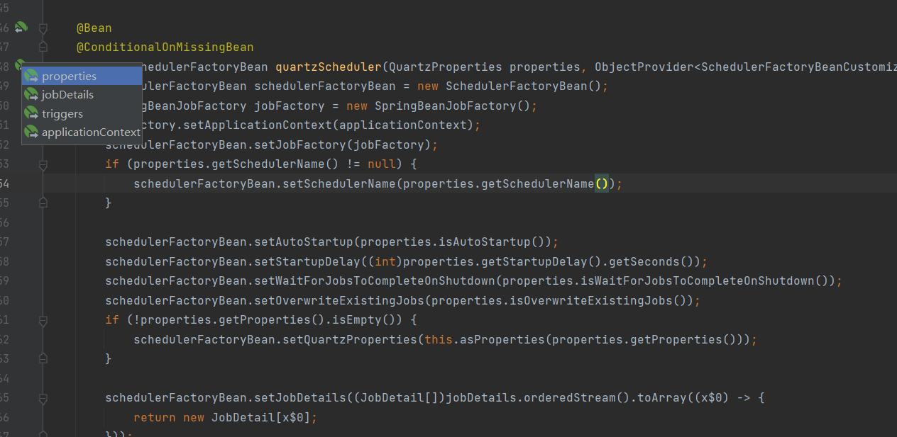

参考来源：

https://www.hangge.com/blog/cache/detail_2699.html

https://cloud.tencent.com/developer/article/1745977

文档：https://docs.spring.io/spring-framework/docs/current/reference/html/integration.html#scheduling-quartz


# SpringBoot对quartz做了啥

和之前引入quartz包(参考[Quartz文档](https://www.w3cschool.cn/quartz_doc/))不同之处在于，之前是要先定义好Job和Trigger，然后通过Scheduler去绑定他们，最后去执行start来开启定时任务。而spring-boot-starter-quartz则**省去了Job和Trigger的手动绑定**（参考链接: [SpringBoot官方文档](https://docs.spring.io/spring-boot/docs/2.2.6.RELEASE/reference/html/index.html)），也就是做好配置即可。

# 依赖

```xml
<dependency>
    <groupId>org.springframework.boot</groupId>
    <artifactId>spring-boot-starter-quartz</artifactId>
</dependency>
```

# application.yml配置

```yaml
# spring的datasource等配置未贴出
spring:
  quartz:
      # 将任务等保存化到数据库
      job-store-type: jdbc
      # 程序结束时会等待quartz相关的内容结束
      wait-for-jobs-to-complete-on-shutdown: true
      # QuartzScheduler启动时更新己存在的Job,这样就不用每次修改targetObject后删除qrtz_job_details表对应记录
      overwrite-existing-jobs: true
      # 这里居然是个map，搞得智能提示都没有，佛了
      properties:
        org:
          quartz:
              # scheduler相关
            scheduler:
              # scheduler的实例名
              instanceName: scheduler
              instanceId: AUTO
            # 持久化相关
            jobStore:
              class: org.quartz.impl.jdbcjobstore.JobStoreTX
              driverDelegateClass: org.quartz.impl.jdbcjobstore.StdJDBCDelegate
              # 表示数据库中相关表是QRTZ_开头的
              tablePrefix: QRTZ_
              useProperties: false
            # 线程池相关
            threadPool:
              class: org.quartz.simpl.SimpleThreadPool
              # 线程数
              threadCount: 10
              # 线程优先级
              threadPriority: 5
              threadsInheritContextClassLoaderOfInitializingThread: true
```

# job持久化配置

默认情况下Quartz job存储在内存中，可以如下设置，**存储在数据库中**

```properties
spring.quartz.job-store-type=jdbc
spring.quartz.jdbc.initialize-schema=always
```

声明一个 DataSource Bean，并加上注解：@Bean、@QuartzDataSource

声明TransactionManager bean，并加上注解：@Bean、@QuartzTransactionManager

默认情况下，通过配置创建的作业不会覆盖持久性作业存储中读取的已注册的作业，若要启用覆盖现有作业定义，请设置该属性。spring.quartz.overwrite-existing-jobs

其他配置，使用spring.quartz，或者创建SchedulerFactoryBeanCustomizer Bean


# 使用

主要提供三个 **Bean**：**JobDetail**、**Trigger** 以及 **SchedulerFactory**。

## Job

方式一：创建普通业务Job，无三方库依赖：

```java
@Component
public class MyFirstJob {
    public void sayHello() {
        System.out.println("MyFirstJob:sayHello:"+new Date());
    }
}
```

方式二：Job 也可以继承抽象类 QuartzJobBean。若继承自 QuartzJobBean，则要实现该类中的 executeInternal 方法，该方法在任务被调用时使用。

```java
public class MySecondJob extends QuartzJobBean {
    private String name;
 
    public void setName(String name) {
        this.name = name;
    }
 
    @Override
    protected void executeInternal(JobExecutionContext context){
        System.out.println("hello:"+name+":"+new Date());
    }
}
```


```java
@Component
public class SampleJob implements Job {

    @Autowired
    private SampleJobService jobService;

    public void execute(JobExecutionContext context) throws JobExecutionException {
        jobService.executeSampleJob();
    }
}
```

## JobDetail

配置JobDetail也有两种方式：

方式一：MethodInvokingJobDetailFactoryBea ，只需要指定 Job 的实例名和要调用的方法即可，注册这用方式无法在创建 JobDetail 时传递参数。这种方式适用于在一个特定的对象上调用job

方式二： JobDetailFactoryBean 来实现，这种方式只需要指定 JobClass 即可，然后可以通过 JobDataMap 传递参数到 Job 中，Job 中只需要提供属性名，并且提供一个相应的 set 方法即可接收到参数。

```java
@Configuration
public class QuartzConfig {
    /********** 配置两个 JobDetail **********/
    // 通过 MethodInvokingJobDetailFactoryBean 类配置 JobDetail
    @Bean
    MethodInvokingJobDetailFactoryBean jobDetail1() {
        MethodInvokingJobDetailFactoryBean bean =
                new MethodInvokingJobDetailFactoryBean();
        bean.setTargetBeanName("myFirstJob");
        bean.setTargetMethod("sayHello");
        return bean;
    }
 
    // 通过 JobDetailFactoryBean 来实现 JobDetail
    @Bean
    JobDetailFactoryBean jobDetail2() {
        JobDetailFactoryBean bean = new JobDetailFactoryBean();
        bean.setJobClass(MySecondJob.class);
        JobDataMap jobDataMap = new JobDataMap();
        jobDataMap.put("name","sang");
        bean.setJobDataMap(jobDataMap);
        bean.setDurability(true);
        return bean;
    }
}
```

方式三：原生api

```java
@Bean
public JobDetail jobDetail() {
    return JobBuilder.newJob().ofType(SampleJob.class)
      .storeDurably()
      .withIdentity("Qrtz_Job_Detail")  
      .withDescription("Invoke Sample Job service...")
      .build();
}
```


## Trigger

Trigger 有多种不同的实现，这里展示两种常用的 Trigger：SimpleTrigger 和 CronTrigger。

- **SimpleTrigger** 使用 **SimpleTriggerFactoryBean** 进行创建。在 **SimpleTriggerFactoryBean** 对象中，首先设置 **JobDetail**，接着配置任务循环次数、任务启动延迟时间、任务的时间间隔。
- **CronTrigger** 使用 **CronTriggerFactoryBean** 进行创建。在 **SimpleTriggerFactoryBean** 对象中，则主要配置 **JobDetail** 和 **Cron** 表达式。


```java
    /********** 创建两个 Trigger **********/
    // 创建一个 SimpleTrigger
    @Bean
    SimpleTriggerFactoryBean simpleTrigger() {
        SimpleTriggerFactoryBean bean = new SimpleTriggerFactoryBean();
        bean.setJobDetail(jobDetail1().getObject()); // 设置 jobDetail
        bean.setRepeatCount(3); // 任务循环次数为3（总共会执行4次）
        bean.setStartDelay(2000); // 任务启动延迟2秒执行
        bean.setRepeatInterval(2000);  // 任务的时间间隔为2秒
        return bean;
    }
 
    // 创建一个 CronTrigger
    @Bean
    CronTriggerFactoryBean cronTrigger() {
        CronTriggerFactoryBean bean = new CronTriggerFactoryBean();
        bean.setJobDetail(jobDetail2().getObject()); // 设置 jobDetail
        bean.setCronExpression("* * * * * ?"); // 设置 Cron 表达式
        return bean;
    }
```

主启动类上开启相应注解 @EnableScheduling

## Scheduler

```java
/**
 * 解决spring bean注入Job的问题
 */
@Component  
public class SpringJobFactory extends AdaptableJobFactory  {       
    @Autowired    
    private AutowireCapableBeanFactory capableBeanFactory;    
    
    @Override    
    protected Object createJobInstance(TriggerFiredBundle bundle) throws Exception {    
        // 调用父类的方法    
        Object jobInstance = super.createJobInstance(bundle);    
        // 进行注入    
        capableBeanFactory.autowireBean(jobInstance);    
        return jobInstance;    
    }    
}  
```

通过SchedulerFactoryBean,

```java
    
    @Autowired
    private SpringJobFactory springJobFactory;

    /********** 创建 SchedulerFactory **********/
    @Bean
    SchedulerFactoryBean schedulerFactory() {
        // 通过 SchedulerFactoryBean 创建 SchedulerFactor
        SchedulerFactoryBean bean = new SchedulerFactoryBean();
        // 配置两个 Trigger
        SimpleTrigger simpleTrigger = simpleTrigger().getObject();
        CronTrigger cronTrigger = cronTrigger().getObject();
        bean.setTriggers(simpleTrigger,cronTrigger);
        bean.setJobFactory(springJobFactory)
        return bean;
    }
```

## 手动触发

Controller或Service中注入：Scheduler

```java
@Autowired
private Scheduler scheduler;
```

添加job，并添加触发器

```java
scheduler.scheduleJob(jobDetail, trigger);
```

启动

```java
if (!scheduler.isShutdown()) {
  /**启动*/
  scheduler.start();
}
```

暂停Trigger

```java
scheduler.pauseTrigger(TriggerKey.triggerKey(orderNo));//orderNo:String类型的triggerKey
```

恢复Trigger

```java
scheduler.resumeTrigger(TriggerKey.triggerKey(orderNo));
```


```java
scheduler.unscheduleJob(TriggerKey.triggerKey(orderNo));//移除触发器
scheduler.deleteJob(JobKey.jobKey(orderNo));//删除Job
```

 

## @DisallowConcurrentExecution 

不允许并发执行，保证上一个任务执行完后，再去执行下一个任务，这里的任务是同一个任务


## SchedulerFactoryBean

SpringBoot自带的创建SchedulerFactoryBean源码：



会将如下对象作为依赖的Bean

- spring.quartz开头的配置(QuartzProperties对象)
- JobDetail Bean
- Trigger Bean
- Spring上下文
- SchedulerFactoryBeanCustomizer Bean
- Calendar Trigger Bean

```java
@Bean
@ConditionalOnMissingBean
public SchedulerFactoryBean quartzScheduler(QuartzProperties properties,
      ObjectProvider<SchedulerFactoryBeanCustomizer> customizers, ObjectProvider<JobDetail> jobDetails,
      Map<String, Calendar> calendars, ObjectProvider<Trigger> triggers, ApplicationContext applicationContext) {
    
   SchedulerFactoryBean schedulerFactoryBean = new SchedulerFactoryBean();
   SpringBeanJobFactory jobFactory = new SpringBeanJobFactory();
   jobFactory.setApplicationContext(applicationContext);
   schedulerFactoryBean.setJobFactory(jobFactory);
   if (properties.getSchedulerName() != null) {
      schedulerFactoryBean.setSchedulerName(properties.getSchedulerName());
   }
   //设置是否自启动
   schedulerFactoryBean.setAutoStartup(properties.isAutoStartup());
   schedulerFactoryBean.setStartupDelay((int) properties.getStartupDelay().getSeconds());
   schedulerFactoryBean.setWaitForJobsToCompleteOnShutdown(properties.isWaitForJobsToCompleteOnShutdown());
   schedulerFactoryBean.setOverwriteExistingJobs(properties.isOverwriteExistingJobs());
   if (!properties.getProperties().isEmpty()) {
      schedulerFactoryBean.setQuartzProperties(asProperties(properties.getProperties()));
   }
   schedulerFactoryBean.setJobDetails(jobDetails.orderedStream().toArray(JobDetail[]::new));
   schedulerFactoryBean.setCalendars(calendars);
   schedulerFactoryBean.setTriggers(triggers.orderedStream().toArray(Trigger[]::new));
   customizers.orderedStream().forEach((customizer) -> customizer.customize(schedulerFactoryBean));
   return schedulerFactoryBean;
}
```


也就是说我们可以不用自己创建SchedulerFactoryBean，可以直接使用

```java
@Autowired
private Scheduler scheduler;
```

但是，会有问题，默认会在程序启动时自动执行全部job


