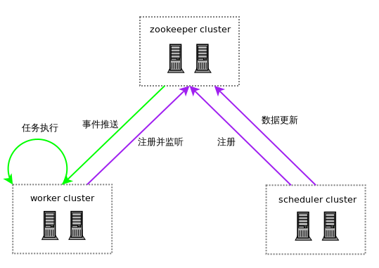
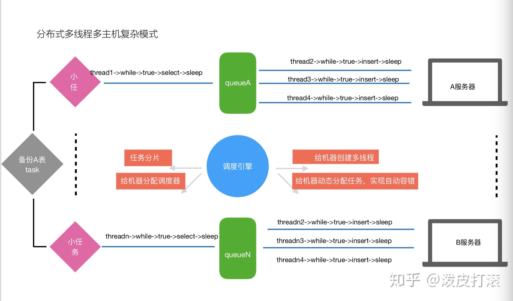
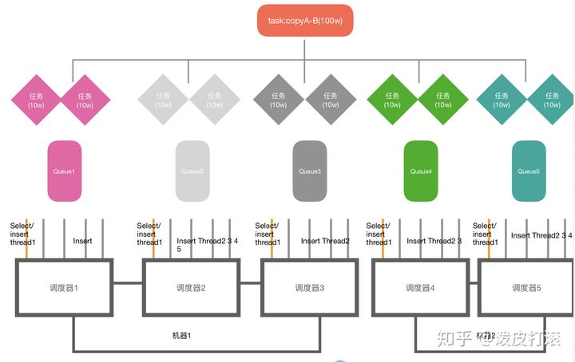

# 适用的需求

来源：[如何选型一个合适的框架-分布式任务调度框架选型 - 知乎 (zhihu.com)](https://zhuanlan.zhihu.com/p/101633064)

**任务调度：定时执行任务的场景**

定时任务是大家再开发中一个不可避免的业务，比如在一些电商系统中可能会定时给用户发送生日券，一些[对账系统](https://www.zhihu.com/search?q=对账系统&search_source=Entity&hybrid_search_source=Entity&hybrid_search_extra={"sourceType"%3A"article"%2C"sourceId"%3A101633064})中可能会定时去对账。大概再很久以前每个服务可能就一台机器，再这台机器上直接搞个Timerschedule基本上就能满足我们的业务需求，但是随着时代的变迁，单台机器已经远远不能满足我们的需要，这个时候我们可能需要10台，20台甚至更多机器来运行我们的业务，接受我们的流量，这就是我们所说的横向扩展。但是这里就有个问题，这么多台机器如果还用我们的Timerschedule去做会发生什么呢？再上面的电商系统中有可能会给某个用户发很多张生日券，对公司造成很多损失，所以我们需要一些其他方法，让定时任务在多台机器上只执行一次。
这里想问下大家在没有了解过或使用过分布式任务调度框架之前大家是如何做定时任务的呢？在Spring项目中大家肯定都知道Spring-Scheduler，只需要在Spring中的bean的对应方法上加上`@Scheduler`注解即可完成我们的定时任务，但是光是用这个注解还远远不能保证定时任务执行多次，我们需要一些其他手段的保证，一般来说方法可能不外乎下面几种（都是[基于Spring](https://www.zhihu.com/search?q=基于Spring&search_source=Entity&hybrid_search_source=Entity&hybrid_search_extra={"sourceType"%3A"article"%2C"sourceId"%3A101633064})的项目来说）：

- 一台机器，我们可以将一些不太重要的定时任务，可以使用一个专门的[服务台](https://www.zhihu.com/search?q=服务台&search_source=Entity&hybrid_search_source=Entity&hybrid_search_extra={"sourceType"%3A"article"%2C"sourceId"%3A101633064})承载，然后使用单机跑，就算挂了只要我们再可接受的时间之内将其恢复，我们的业务也不会受到影响。
- 多台机器，加分布式锁，只要我们执行任务的时候首先获取一把分布式锁，如果获取失败那么久证明有其他服务已经再运行，如果获取成功那么证明没有服务在运行定时任务，那么就可以执行。
- 多台机器，利用ZooKeeper对Leader机器执行定时任务，有很多业务已经使用了ZK，那么执行定时任务的时候判断自己是否是Leader，如果不是则不执行，如果是则执行[业务逻辑](https://www.zhihu.com/search?q=业务逻辑&search_source=Entity&hybrid_search_source=Entity&hybrid_search_extra={"sourceType"%3A"article"%2C"sourceId"%3A101633064})，这样也能达到我们的目的。

目前我们公司做定时任务也是使用的上面三种方法，在业务初期使用这些方法基本也能大体满足，但是随着时间的迁移，我们遇到的问题越来越多，这里和大家分享一下：

- 首先是单机问题，如何划分一个业务不是很重要，这一块本来就比较复杂，有可能每个人都说自己的业务都重要，其次是如果单机挂了 这个挂有可能是宕机，有可能是其他的一些情况，这个时间如何能保证我们再可接受的范围之间恢复，这些都是难点。
- 目前我们使用定时任务的时候，如果想让它马上执行一次，这个时候可能就需要额外再写一个Rest接口或者再另外写一个单独的Job。
- 还有个是我们需要更改定时任务执行时间，比如现在有个需求是从每12个小时执行一次变成每6小时执行一次，我们又得修改代码，提交pr，然后打包上线，只是修改一个时间又得花费我们很多时间。
- 无法暂停我们的定时任务，当我们的定时任务可能出现一些问题，比如一些定时报警的需求，当报警突然变得很多，这个时候需要暂停一下让其停止发送报警，这个时候可能我们可以用一些分布式配置的开关去做，再逻辑中判断定时任务开关是否打开，然后来做。这样做虽然也比较简单，但是我们这样需要新添加一些与任务无关的逻辑。
- 缺少对定时任务的监控，任务失败之后开发人员无从得知，有人说不是有Error日志吗，如果一个Error日志就一次报警那你们的服务能受得了吗，一般来说连续几次Error才会触发报警，而我们定时任务的[周期性](https://www.zhihu.com/search?q=周期性&search_source=Entity&hybrid_search_source=Entity&hybrid_search_extra={"sourceType"%3A"article"%2C"sourceId"%3A101633064})的特性是不容易触发连续的Error。

# 对比

| 框架       | 作者     | 集群                               | 持久化 | 执行策略 |
| ---------- | -------- | ---------------------------------- | ------ | -------- |
| TBSchedule | 阿里淘宝 | 基于zookeepers下搭建调度机和执行机 | 是     |          |
|            |          |                                    |        |          |
|            |          |                                    |        |          |

# TBSchedule

开源地址：http://code.taobao.org/p/tbschedule/wiki/index/

已经无法访问，年久失修

## 集群

来源：[阿里巴巴分布式调度引擎tbschedule实战三tbschedule的调度原理 - 知乎 (zhihu.com)](https://zhuanlan.zhihu.com/p/98353229)

# JobRunr

[Enqueueing jobs · JobRunr](https://www.jobrunr.io/en/documentation/background-methods/enqueueing-jobs/)

