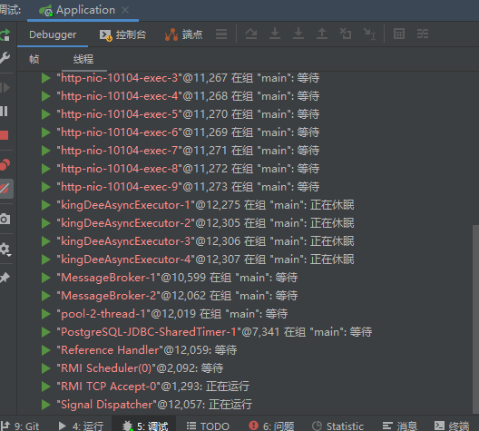

分为两部分，都采用注解的形式来使用

- 异步执行 TaskExecutor
- 定时任务 TaskScheduler

线程池回顾：假定是非常耗时的任务

- 请求进来了，开启一个线程去执行，又有请求进来了，又开启一个线程去执行，......,直到达到核心线程数：corePoolSize，corePoolSize之内的线程，开启了就不会销毁，便于后续的请求复用，防止频繁创建线程的性能损耗
- 然后又有请求进来了，但是线程数已经达到了corePoolSize，就排队等候，直到等待的线程数达到：queueCapacity
- 然后又有请求进来了，但是线程数已经达到了queueCapacity，这时不要等了，又开启线程，之前排队的，通通都有执行了
- 然后又有请求进来了，继续开启线程，直到：maxPoolSize，超过了之后，看线程拒绝策略

# TaskExecutor异步任务

https://docs.spring.io/spring-framework/docs/current/reference/html/integration.html#scheduling

## 任务执行器TaskExecutor类型

- SyncTaskExecutor  同步调用，没有多线程，执行发生在调用线程中，适合简单的测试用例

- SimpleAsyncTaskExecutor 支持并发，**但每次调用时重新开启一个新线程，底层没有用线程池**，我们**可以设置允许并发线程的上线**，默认不限制。
- ConcurrentTaskExecutor 是对java.util.concurrent.Executor的实现，官方说很少使用，**如果ThreadPoolTaskExecutor不灵活的话，就使用ConcurrentTaskExecutor** 

- **ThreadPoolTaskExecutor** 最为常用，由于它默认核心线程数为1，最大线程数和排队数位Integer.MAX_VALUE，所以需要我们配置这些参数

- WorkManagerTaskExecutor 实现了CommonJ中的WorkManager接口，是在Spring中使用CommonJ的WorkManager时的核心类。CommonJ不是Java EE标准，是BEA和IBM的应用服务器实现的共同标准。使用得更少，应用场景是WebLogic 中间件上
- DefaultManagedTaskExecutor  这个实现的目标是替代 WorkManagerTaskExecutor


类的继承体系


扩展阅读：[Springboot异步任务执行及监控 - 云+社区 - 腾讯云 (tencent.com)](https://cloud.tencent.com/developer/article/1608268)

# TaskExecutor异步任务的使用

## 开启异步

```java
@Configuration
@EnableAsync //开启异步，默认使用ThreadPoolTaskExecutor
public class MyConfig {
  
}
```


## 业务

### Controller

```java
@RestController
@RequestMapping(value = "Job")
@Slf4j
public class JobController {
    @Autowired
    JobOneService jobOneService;
    @Autowired
    JobTwoService jobTwoService;

    @PostMapping("job1")
    public void job1(){
        log.info("Job1处理请求线程");
        jobOneService.job1();
    }

    @PostMapping("job2")
    public void job2(){
        log.info("Job2处理请求线程");
        jobTwoService.job2();
    }
}
```

### Service

```java
@Async
public interface JobOneService {
    void job1();
}
```


```java
@Async
public interface JobTwoService {
    void job2();
}
```


```java
@Slf4j
@Service
public class JobOneServiceImpl implements JobOneService{
    @Override
    public void job1() {
        log.info("开始任务job1");
        for (int i = 0; i < 10; i++) {
            try { Thread.sleep(1000); } catch (InterruptedException e) { e.printStackTrace(); }
            log.info("任务job1输出："+i);
        }
        log.info("结束任务job1");
    }
}
```


```java
@Slf4j
@Service
public class JobTwoServiceImpl implements JobTwoService{
    @Override
    public void job2() {
        log.info("开始任务job2");
        for (int i = 0; i < 10; i++) {
            try { Thread.sleep(1000); } catch (InterruptedException e) { e.printStackTrace(); }
            log.info("任务job2输出："+i);
        }
        log.info("结束任务job2");
    }
}
```

### 结果日志

同时POST请求job1和job2

```
2021-12-01 14:45:39.676  INFO 190416 --- [io-10104-exec-1] uih.rt.cloud.training.web.JobController  : Job1处理请求线程
2021-12-01 14:45:39.678  INFO 190416 --- [io-10104-exec-1] .s.a.AnnotationAsyncExecutionInterceptor : More than one TaskExecutor bean found within the context, and none is named 'taskExecutor'. Mark one of them as primary or name it 'taskExecutor' (possibly as an alias) in order to use it for async processing: [clientInboundChannelExecutor, clientOutboundChannelExecutor, brokerChannelExecutor, messageBrokerTaskScheduler]
2021-12-01 14:45:39.678  INFO 190416 --- [cTaskExecutor-1] u.r.c.training.task.JobOneServiceImpl    : 开始任务job1
2021-12-01 14:45:39.680  INFO 190416 --- [io-10104-exec-1] u.r.cloud.training.config.ServiceAspect  : Call Controller：JobController.job1()，args：[]，cost time：6 ms
2021-12-01 14:45:39.790  INFO 190416 --- [io-10104-exec-2] uih.rt.cloud.training.web.JobController  : Job2处理请求线程
2021-12-01 14:45:39.790  INFO 190416 --- [io-10104-exec-2] u.r.cloud.training.config.ServiceAspect  : Call Controller：JobController.job2()，args：[]，cost time：0 ms
2021-12-01 14:45:39.790  INFO 190416 --- [cTaskExecutor-2] u.r.c.training.task.JobTwoServiceImpl    : 开始任务job2
2021-12-01 14:45:40.679  INFO 190416 --- [cTaskExecutor-1] u.r.c.training.task.JobOneServiceImpl    : 任务job1输出：0
2021-12-01 14:45:40.791  INFO 190416 --- [cTaskExecutor-2] u.r.c.training.task.JobTwoServiceImpl    : 任务job2输出：0
2021-12-01 14:45:41.679  INFO 190416 --- [cTaskExecutor-1] u.r.c.training.task.JobOneServiceImpl    : 任务job1输出：1
2021-12-01 14:45:41.791  INFO 190416 --- [cTaskExecutor-2] u.r.c.training.task.JobTwoServiceImpl    : 任务job2输出：1
2021-12-01 14:45:42.680  INFO 190416 --- [cTaskExecutor-1] u.r.c.training.task.JobOneServiceImpl    : 任务job1输出：2
2021-12-01 14:45:42.792  INFO 190416 --- [cTaskExecutor-2] u.r.c.training.task.JobTwoServiceImpl    : 任务job2输出：2
2021-12-01 14:45:43.681  INFO 190416 --- [cTaskExecutor-1] u.r.c.training.task.JobOneServiceImpl    : 任务job1输出：3
2021-12-01 14:45:43.793  INFO 190416 --- [cTaskExecutor-2] u.r.c.training.task.JobTwoServiceImpl    : 任务job2输出：3
2021-12-01 14:45:44.681  INFO 190416 --- [cTaskExecutor-1] u.r.c.training.task.JobOneServiceImpl    : 任务job1输出：4
2021-12-01 14:45:44.793  INFO 190416 --- [cTaskExecutor-2] u.r.c.training.task.JobTwoServiceImpl    : 任务job2输出：4
2021-12-01 14:45:45.681  INFO 190416 --- [cTaskExecutor-1] u.r.c.training.task.JobOneServiceImpl    : 任务job1输出：5
2021-12-01 14:45:45.793  INFO 190416 --- [cTaskExecutor-2] u.r.c.training.task.JobTwoServiceImpl    : 任务job2输出：5
2021-12-01 14:45:46.681  INFO 190416 --- [cTaskExecutor-1] u.r.c.training.task.JobOneServiceImpl    : 任务job1输出：6
2021-12-01 14:45:46.793  INFO 190416 --- [cTaskExecutor-2] u.r.c.training.task.JobTwoServiceImpl    : 任务job2输出：6
2021-12-01 14:45:47.681  INFO 190416 --- [cTaskExecutor-1] u.r.c.training.task.JobOneServiceImpl    : 任务job1输出：7
2021-12-01 14:45:47.793  INFO 190416 --- [cTaskExecutor-2] u.r.c.training.task.JobTwoServiceImpl    : 任务job2输出：7
2021-12-01 14:45:48.682  INFO 190416 --- [cTaskExecutor-1] u.r.c.training.task.JobOneServiceImpl    : 任务job1输出：8
2021-12-01 14:45:48.794  INFO 190416 --- [cTaskExecutor-2] u.r.c.training.task.JobTwoServiceImpl    : 任务job2输出：8
2021-12-01 14:45:49.683  INFO 190416 --- [cTaskExecutor-1] u.r.c.training.task.JobOneServiceImpl    : 任务job1输出：9
2021-12-01 14:45:49.683  INFO 190416 --- [cTaskExecutor-1] u.r.c.training.task.JobOneServiceImpl    : 结束任务job1
2021-12-01 14:45:49.795  INFO 190416 --- [cTaskExecutor-2] u.r.c.training.task.JobTwoServiceImpl    : 任务job2输出：9
2021-12-01 14:45:49.795  INFO 190416 --- [cTaskExecutor-2] u.r.c.training.task.JobTwoServiceImpl    : 结束任务job2
```

可以看出Controller所在的线程几毫秒就执行完了，两个Job所在的线程还在执行


### debug

再次同时送2个请求，查看线程，可以看出，@Async默认是采用SimpleAsyncTaskExecutor 线程池


## 为@Async配置线程池

### 原理

通过查看Spring源码关于@Async的默认调用规则，会优先查询源码中实现**AsyncConfigurer这个接口的类，实现这个接口的类为AsyncConfigurerSupport。但默认配置的线程池和异步处理方法均为空，所以，无论是继承或者重新实现接口，都需指定一个线程池**。且重新实现 public Executor getAsyncExecutor()方法。


 由于AsyncConfigurer的默认线程池在源码中为空，Spring通过beanFactory.getBean(TaskExecutor.class)先查看是否有线程池，未配置时，通过beanFactory.getBean(DEFAULT_TASK_EXECUTOR_BEAN_NAME, Executor.class)，又查询是否存在默认名称为TaskExecutor的线程池。所以可在项目中，定义名称为**TaskExecutor的bean生成一个默认线程池。也可不指定线程池的名称，申明一个线程池，本身底层是基于TaskExecutor.class便可**。


```java
//源码
public interface AsyncConfigurer {

   /**
    * The {@link Executor} instance to be used when processing async
    * method invocations.
    */
   @Nullable
   default Executor getAsyncExecutor() {
      return null;
   }

   /**
    * The {@link AsyncUncaughtExceptionHandler} instance to be used
    * when an exception is thrown during an asynchronous method execution
    * with {@code void} return type.
    */
   @Nullable
   default AsyncUncaughtExceptionHandler getAsyncUncaughtExceptionHandler() {
      return null;
   }

}
```

Spring自带的默认实现：都是空的，实现了个寂寞，没有指定线程池就会用SimpleAsyncTaskExecutor 

```java
public class AsyncConfigurerSupport implements AsyncConfigurer {

   @Override
   public Executor getAsyncExecutor() {
      return null;
   }

   @Override
   @Nullable
   public AsyncUncaughtExceptionHandler getAsyncUncaughtExceptionHandler() {
      return null;
   }

}
```


### 实现接口AsyncConfigurer

```java
@Configuration
@EnableAsync
@Slf4j
public class AsyncConfiguration implements AsyncConfigurer {
//    @Bean("kingAsyncExecutor")
    public ThreadPoolTaskExecutor executor() {
        ThreadPoolTaskExecutor executor = new ThreadPoolTaskExecutor();
        int corePoolSize = 4;
        executor.setCorePoolSize(corePoolSize);
        int maxPoolSize = 50;
        executor.setMaxPoolSize(maxPoolSize);
        int queueCapacity = 2;
        executor.setQueueCapacity(queueCapacity);
        executor.setRejectedExecutionHandler(new ThreadPoolExecutor.CallerRunsPolicy());
        String threadNamePrefix = "kingDeeAsyncExecutor-";
        executor.setThreadNamePrefix(threadNamePrefix);
        executor.setWaitForTasksToCompleteOnShutdown(true);
        // 使用自定义的跨线程的请求级别线程工厂类19         int awaitTerminationSeconds = 5;
//        executor.setAwaitTerminationSeconds(awaitTerminationSeconds);
        executor.initialize();
        return executor;
    }

    @Override
    public Executor getAsyncExecutor() {
        return executor();
    }

    @Override
    public AsyncUncaughtExceptionHandler getAsyncUncaughtExceptionHandler() {
        return (ex, method, params) -> log.error(String.format("执行异步任务'%s'", method), ex);
    }
}
```

### 结果


多次点请求：




再多次点：


过一会;


## @Async异步编排

```
@Async
public interface JobOneService {
    CompletableFuture<Void> jobA_1();
    CompletableFuture<Void> jobA_2();
    void jobB();
}
```


```java
@Slf4j
@Service
public class JobOneServiceImpl implements JobOneService{
    @Override
    public CompletableFuture<Void> jobA_1() {
        log.info("jobA子任务 jobA_1 执行开始");
        try { Thread.sleep(3000); } catch (InterruptedException e) { e.printStackTrace(); }
        log.info("jobA子任务 jobA_1 执行结束");
        return CompletableFuture.completedFuture(null);
    }

    @Override
    public CompletableFuture<Void> jobA_2() {
        log.info("jobA子任务 jobA_2 执行开始");
        try { Thread.sleep(3000); } catch (InterruptedException e) { e.printStackTrace(); }
        log.info("jobA子任务 jobA_2 执行结束");
        return CompletableFuture.completedFuture(null);
    }

    @Override
    public void jobB() {
        log.info("任务 jobB 开始执行");
        try { Thread.sleep(3000); } catch (InterruptedException e) { e.printStackTrace(); }
        log.info("任务 jobB 执行结束");
    }
}
```


Controller:

```java
@PostMapping("test")
public void testJob() {
    log.info("testJob Controller开始执行");
    CompletableFuture<Void> future1 = jobOneService.jobA_1();
    future1.thenRunAsync(() -> jobOneService.jobA_2());
    jobOneService.jobB();
    log.info("testJob Controller执行结束");
}
```

- jobA_1、jobA_2串行执行
- jobA和B之间并行


# TaskScheduler定时任务

可以看成轻量级的Quartz

## TaskScheduler接口

spring 3.0版本后，自带了一个定时任务工具，而且使用简单方便，不用配置文件，可以动态改变执行状态。也可以使用cron表达式设置定时任务。

接口源码：

```java
public interface TaskScheduler {

    ScheduledFuture schedule(Runnable task, Trigger trigger);

    ScheduledFuture schedule(Runnable task, Instant startTime);

    ScheduledFuture schedule(Runnable task, Date startTime);

    ScheduledFuture scheduleAtFixedRate(Runnable task, Instant startTime, Duration period);

    ScheduledFuture scheduleAtFixedRate(Runnable task, Date startTime, long period);

    ScheduledFuture scheduleAtFixedRate(Runnable task, Duration period);

    ScheduledFuture scheduleAtFixedRate(Runnable task, long period);

    ScheduledFuture scheduleWithFixedDelay(Runnable task, Instant startTime, Duration delay);

    ScheduledFuture scheduleWithFixedDelay(Runnable task, Date startTime, long delay);

    ScheduledFuture scheduleWithFixedDelay(Runnable task, Duration delay);

    ScheduledFuture scheduleWithFixedDelay(Runnable task, long delay);
}
```

- **schedule(Runnable task, Date startTime);**
  指定一个具体时间点执行定时任务，可以动态的指定时间，开启任务。只执行一次。（比Timer好用多了。早发现这接口就好了。。。）
- **scheduleAtFixedRate(Runnable task, long period);**
  立即执行，循环任务，指定一个执行周期（毫秒计时）
  PS:不管上一个周期是否执行完，到时间下个周期就开始执行
- **scheduleAtFixedRate(Runnable task, Date startTime, long period);**
  指定时间开始执行，循环任务，指定一个间隔周期（毫秒计时）
  PS:不管上一个周期是否执行完，到时间下个周期就开始执行
- **scheduleWithFixedDelay(Runnable task, long delay);**
  立即执行，循环任务，指定一个间隔周期（毫秒计时）
  PS:上一个周期执行完，等待delay时间，下个周期开始执行
- **scheduleWithFixedDelay(Runnable task, Date startTime, long delay);**
  指定时间开始执行，循环任务，指定一个间隔周期（毫秒计时）
  PS:上一个周期执行完，等待delay时间，下个周期开始执行

- **schedule(Runnable task, Trigger trigger);**
  指定一个触发器执行定时任务。可以使用CronTrigger来指定Cron表达式，执行定时任务

```java
Copy CronTrigger t = new CronTrigger("0 0 10,14,16 * * ?");
 taskScheduler.schedule(this, t);
```

## 使用

开启：

```java
@Configuration
@EnableAsync
@EnableScheduling
public class AppConfig {
}
```


```java
@Scheduled(fixedDelay = 5000)
public void doSomething() {
    // something that should run periodically
}
@Scheduled(fixedRate = 5, timeUnit = TimeUnit.SECONDS)
public void doSomething() {
    // something that should run periodically
}
@Scheduled(initialDelay = 1000, fixedRate = 5000)
public void doSomething() {
    // something that should run periodically
}
@Scheduled(cron="*/5 * * * * MON-FRI")
public void doSomething() {
    // something that should run on weekdays only
}
```

# Quartz 任务调度

依赖：版本号不用写，Springboot自带

```xml
<dependency>
    <groupId>org.springframework.boot</groupId>
    <artifactId>spring-boot-starter-quartz</artifactId>
</dependency>
<dependency>
    <groupId>org.quartz-scheduler</groupId>
    <artifactId>quartz-jobs</artifactId>
</dependency>
```

Quartz 使用`Trigger`, `Job`, 和`JobDetail`对象来实现各种任务的调度

## 创建可调度的Job

```java
import org.quartz.Job;
import org.quartz.JobExecutionContext;
import org.quartz.JobExecutionException;

public class HelloJob implements Job {
    @Override
    public void execute(JobExecutionContext context) throws JobExecutionException {
        System.out.println("这里可以执行我们的业务逻辑");
    }
}
```

