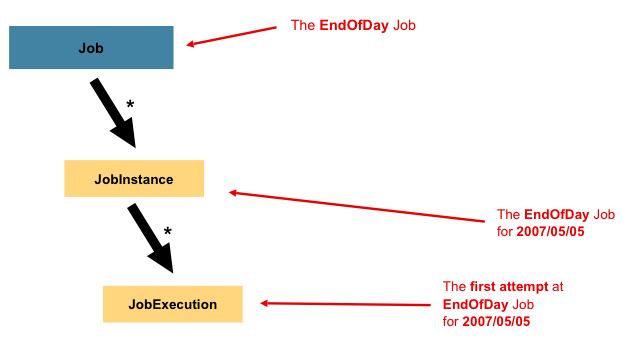

# 简介

## 参考来源和学习途径

参考：

官网：https://spring.io/batch

官网：https://spring.io/projects/spring-batch#overview

官方示例：https://github.com/spring-projects/spring-batch/tree/master/spring-batch-samples

[Spring Batch(1)——数据批处理概念 (chkui.com)](https://www.chkui.com/article/spring/spring_batch_introduction)

[Spring Batch(2)——Job配置与运行 - 云+社区 - 腾讯云 (tencent.com)](https://cloud.tencent.com/developer/article/1459420)

[Spring Batch(3)——Step控制 - 云+社区 - 腾讯云 (tencent.com)](https://cloud.tencent.com/developer/article/1459184)

[Spring Batch(4)——Item概念及使用代码 - 云+社区 - 腾讯云 (tencent.com)](https://cloud.tencent.com/developer/article/1461131)

[Spring Batch(5)——文件读写 - 云+社区 - 腾讯云 (tencent.com)](https://cloud.tencent.com/developer/article/1460745)

[Spring Batch(6)——数据库批数据读写 - 云+社区 - 腾讯云 (tencent.com)](https://cloud.tencent.com/developer/article/1461387)

参考课程：https://www.bilibili.com/video/BV1FJ411m7d5

## 是什么

 Spring Batch是个轻量级的、 完善的批处理框架,旨在帮助企业建立健壮、高效的批处理应用。Spring Batch是Spring的一个子项目,使用Java语言并基于Spring框架为基础开发,使得已经使用Spring框架的开发者或者企业更容易访问和利用企业服务。

 Spring Batch提供了大量可重用的组件,包括了日志追踪、事务、任务作业统计、任务重启、跳过、重复资源管理。对于大数据量和高性能的批处理任 务,Spring Batch同样提供了高级功能和特性来支持比如分区功能、远程功能。总之,通过Spring Batch能够支持简单的、复杂的和大数据量的批处理作业。

 Spring Batch是一个批处理应用框架,不是调度框架，但需要和调度框架合作来构建完成的批处理任务。它只关注批处理任务相关的问题,如事务、并发、监控、执行等,并不提供相应的调度功能。如果需要使用调用框架，在商业软件和开源软件中已经有很多优秀的企业级调度框架(如Quartz. Tivoli、 Control-M、 Cron等)可以使用。


**框架主要有以下功能:** Transaction management (事务管理) Chunk based processing (基于块的处理) Declarative 1/0 (声明式的输入输出) Start/Stop/Restart (启动/停止/再启动) Retry/Skip (重试/跳过)


图片来源：https://spring.io/batch

## 应用场景

- 从某个位置读取大量的记录，位置可以是数据库、文件或者外部推送队列（MQ）。
- 根据业务需要实时处理读取的数据。
- 将处理后的数据写入某个位置，可以是数据库、文件或者推送到队列。

Spring Batch为批处理提供了一个轻量化的解决方案，它根据批处理的需要迭代处理各种记录，提供事物功能。但是Spring Batch仅仅适用于"脱机"场景，在处理的过程中不能和外部进行任何交互，也不允许有任何输入。

一句话：SpringBatch处理不需要用户交互的业务逻辑，比如后台任务

## SpringBatch的生态优势

- 和SpringAPI集成，背靠Spring全家桶的生态

- 可以与SQL、NoSQL、文件进行操作
- 支持使用Kafka、RabbitMQ对数据和消息进行传递，
- 开箱即用

下图是SpringBatch自身和其他微服务组件的交互


图片来源：https://spring.io/batch

## Spring Batch的目标

- 开发人员仅关注业务逻辑，底层框架的交互交由Spring Batch去处理。
- 能够清晰分离业务与框架，框架已经限定了批处理的业务切入点，业务开发只需关注这些切入点（Read、Process、Write）。
- 提供开箱即用的通用接口。
- 快速轻松的融入Spring 框架，基于Spring Framework能够快速扩展各种功能。
- 所有现有核心服务都应易于更换或扩展，而不会对基础架构层产生任何影响。

## Spring Batch结构


如上图，通常情况下一个独立的JVM程序就是仅仅用于处理批处理，而不要和其他功能重叠。 在最后一层基础设置（Infrastructure）部分主要分为3个部分。JobLauncher、Job以及Step。每一个Step又细分为ItemReader、ItemProcessor、ItemWirte。使用Spring Batch主要就是知道每一个基础设置负责的内容，然后在对应的设施中实现对应的业务。


## Spring Batch 批处理原则与建议

当我们构建一个批处理的过程时，必须注意以下原则：

1. 通常情况下，批处理的过程对系统和架构的设计要够要求比较高，因此尽可能的使用通用架构来处理批量数据处理，降低问题发生的可能性。Spring Batch是一个是一个轻量级的框架，适用于处理一些灵活并没有到海量的数据。
2. 批处理应该尽可能的简单，尽量避免在单个批处理中去执行过于复杂的任务。我们可以将任务分成多个批处理或者多个步骤去实现。
3. 保证数据处理和物理数据紧密相连。笼统的说就是我们在处理数据的过程中有很多步骤，在某些步骤执行完时应该就写入数据，而不是等所有都处理完。
4. 尽可能减少系统资源的使用、尤其是耗费大量资源的IO以及跨服务器引用，尽量分配好数据处理的批次。
5. 定期分析系统的IO使用情况、SQL语句的执行情况等，尽可能的减少不必要的IO操作。优化的原则有：
   1. 尽量在一次事物中对同一数据进行读取或写缓存。
   2. 一次事物中，尽可能在开始就读取所有需要使用的数据。
   3. 优化索引，观察SQL的执行情况，尽量使用主键索引，尽量避免全表扫描或过多的索引扫描。
   4. SQL中的where尽可能通过主键查询。
6. 不要在批处理中对相同的数据执行2次相同的操作。
7. 对于批处理程序而言应该在批处理启动之前就分配足够的内存，以免处理的过程中去重新申请新的内存页。
8. 对数据的完整性应该从最差的角度来考虑，每一步的处理都应该建立完备的数据校验。
9. 对于数据的总量我们应该有一个和数据记录在数据结构的某个字段 上。
10. 所有的批处理系统都需要进行压力测试。
11. 如果整个批处理的过程是基于文件系统，在处理的过程中请切记完成文件的备份以及文件内容的校验。

## 批处理的通用策略

和软件开发的设计模式一样，批处理也有各种各样的现成模式可供参考。当一个开发（设计）人员开始执行批处理任务时，应该将业务逻辑拆分为一下的步骤或者板块分批执行：

1. 数据转换：某个（某些）批处理的外部数据可能来自不同的外部系统或者外部提供者，这些数据的结构千差万别。在统一进行批量数据处理之前需要对这些数据进行转换，合并为一个统一的结构。因此在数据开始真正的执行业务处理之前，先要使用其他的方法或者一些批处理任务将这些数据转换为统一的格式。
2. 数据校验：批处理是对大量数据进行处理，并且数据的来源千差万别，所以批处理的输入数据需要对数据的完整性性进行校验（比如校验字段数据是否缺失）。另外批处理输出的数据也需要进行合适的校验（例如处理了100条数据，校验100条数据是否校验成功）
3. 提取数据：批处理的工作是逐条从数据库或目标文件读取记录（records）,提取时可以通过一些规则从数据源中进行数据筛选。
4. 数据实时更新处理：根据业务要求，对实时数据进行处理。某些时候一行数据记录的处理需要绑定在一个事物之下。
5. 输出记录到标准的文档格式：数据处理完成之后需要根据格式写入到对应的外部数据系统中。

以上五个步骤是一个标准的数据批处理过程，Spring batch框架为业务实现提供了以上几个功能入口。

## 数据额外处理

某些情况需要实现对数据进行额外处理，在进入批处理之前通过其他方式将数据进行处理。主要内容有：

1. 排序：由于批处理是以独立的行数据（record）进行处理的，在处理的时候并不知道记录前后关系。因此如果需要对整体数据进行排序，最好事先使用其他方式完成。
2. 分割：数据拆分也建议使用独立的任务来完成。理由类似排序，因为批处理的过程都是以行记录为基本处理单位的，无法再对分割之后的数据进行扩展处理。
3. 合并：理由如上。

## 常规数据源

批处理的数据源通常包括：

1. 数据库驱动链接（链接到数据库）对数据进行逐条提取。
2. 文件驱动链接，对文件数据进行提取
3. 消息驱动链接，从MQ、kafka等消息系统提取数据。

## 典型的处理过程


1. 在业务停止的窗口期进行批数据处理，例如银行对账、清结算都是在12点日切到黎明之间。简称为离线处理。
2. 在线或并发批处理，但是需要对实际业务或用户的响应进行考量。
3. 并行处理多种不同的批处理作业。
4. 分区处理：将相同的数据分为不同的区块，然后按照相同的步骤分为许多独立的批处理任务对不同的区块进行处理。
5. 以上处理过程进行组合。

在执行2,3点批处理时需要注意事物隔离等级。

## 核心概念


框架一共有**4个主要角色**:

**JobLauncher**是任务启动器，通过它来启动任务，可以看做是程序的入口。

**Job**代表着一个具体的任务。

**Step**代表着一个具体的步骤，一个Job可以包含多个Step (想象把大象放进冰箱这个任务需要多少个步骤你就明白了) .

**JobRepository**是存储数据的地方，**可以看做是一个数据库的接口**，在任务执行的时候需要通过它来记录任务状态等等信息。

### Job

简单的说`Job`是封装一个批处理过程的实体，与其他的Spring项目类似，`Job`可以通过XML或Java类配置，称为“Job Configuration”。如下图`Job`是单个批处理的最顶层。



为了便于理解，可以简单的将`Job`理解为是每一步（`Step`）实例的容器。他结合了多个`Step`，为它们提供统一的服务同时也为`Step`提供个性化的服务，比如步骤重启。通常情况下`Job的配置包含以下内容`：

- Job的名称
- 定义和排序`Step`执行实例。
- 标记每个`Step`是否可以重启。

Spring Batch为Job接口提供了默认的实现——`SimpleJob`，其中实现了一些标准的批处理方法。下面的代码展示了如可注入一个`Job`。

```java
@Bean
public Job footballJob() {
    return this.jobBuilderFactory.get("footballJob") //get中命名了Job的名称
        //playerLoad、gameLoad、playerSummarization都是Step
                     .start(playerLoad())  
                     .next(gameLoad())
                     .next(playerSummarization())
                     .end()
                     .build();
}
```

#### JobInstance

`JobInstance`是指批处理作业运行的实例。例如一个批处理必须在每天执行一次，系统在2019年5月1日执行了一次我们称之为2019-05-01的实例，类似的还会有2019-05-02、2019-05-03实例。通常情况下，一个`JobInstance`对应一个`JobParameters`，对应多个`JobExecution`。（`JobParameters`、`JobExecution`见后文）。同一个`JobInstance`具有相同的上下文（`ExecutionContext`内容见后文）。

#### JobParameters

前面讨论了`JobInstance`与`Job`的区别，但是具体的区别内容都是通过`JobParameters`体现的。一个`JobParameters`对象中包含了一系列Job运行相关的参数，这些参数可以用于参考或者用于实际的业务使用。对应的关系如下图：


当我们执行2个不同的`JobInstance`时`JobParameters`中的属性都会有差异。可以简单的认为一个`JobInstance`的标识就是`Job`+`JobParameters`。

#### JobExecution

`JobExecution`可以理解为单次运行`Job`的容器。一次`JobInstance`执行的结果可能是成功、也可能是失败。但是对于Spring Batch框架而言，只有返回运行成功才会视为完成一次批处理。例如2019-05-01执行了一次`JobInstance`，但是执行的过程失败，因此第二次还会有一个“相同的”的`JobInstance`被执行。

`Job`用于定义批处理如何执行，`JobInstance`纯粹的就是一个处理对象，把所有的运行内容和信息组织在一起，主要是为了当面临问题时定义正确的重启参数。而`JobExecution`是运行时的“容器”，记录动态运行时的各种属性和上线文。他包括的信息有：

| 属性              | 说明                                                         |
| ----------------- | ------------------------------------------------------------ |
| status            | 状态类名为`BatchStatus`，它指示了执行的状态。在执行的过程中状态为`BatchStatus#STARTED`，失败：`BatchStatus#FAILED`，完成：`BatchStatus#COMPLETED` |
| startTime         | `java.util.Date`对象，标记批处理任务启动的系统时间，批处理任务未启动数据为空 |
| endTime           | `java.util.Date`对象，结束时间无论是否成功都包含该数据，如未处理完为空 |
| exitStatus        | `ExitStatus`类，记录运行结果。                               |
| createTime        | `java.util.Date`,`JobExecution`的创建时间，某些使用execution已经创建但是并未开始运行。 |
| lastUpdate        | `java.util.Date`，最后一次更新时间                           |
| executionContext  | 批处理任务执行的所有用户数据                                 |
| failureExceptions | 记录在执行Job时的异常，对于排查问题非常有用                  |

以上这些内容Spring Batch都会通过`JobRepository`进行持久化（这些信息官方文成称之为MetaData），因此在对应的数据源中可以看到下列信息：

BATCH_JOB_INSTANCE：

| JOB_INST_ID | JOB_NAME    |
| ----------- | ----------- |
| 1           | EndOfDayJob |

BATCH_JOB_EXECUTION_PARAMS：

| JOB_EXECUTION_ID | TYPE_CD | KEY_NAME      | DATE_VAL   | IDENTIFYING |
| ---------------- | ------- | ------------- | ---------- | ----------- |
| 1                | DATE    | schedule.Date | 2019-01-01 | TRUE        |

BATCH_JOB_EXECUTION：

| JOB_EXEC_ID | JOB_INST_ID | START_TIME       | END_TIME         | STATUS |
| ----------- | ----------- | ---------------- | ---------------- | ------ |
| 1           | 1           | 2019-01-01 21:00 | 2017-01-01 21:30 | FAILED |

当某个`Job`批处理任务失败之后会在对应的数据库表中路对应的状态。假设1月1号执行的任务失败，技术团队花费了大量的时间解决这个问题到了第二天21才继续执行这个任务。

BATCH_JOB_INSTANCE：

| JOB_INST_ID | JOB_NAME    |
| ----------- | ----------- |
| 1           | EndOfDayJob |
| 2           | EndOfDayJob |

BATCH_JOB_EXECUTION_PARAMS：

| JOB_EXECUTION_ID | TYPE_CD | KEY_NAME      | DATE_VAL   | IDENTIFYING |
| ---------------- | ------- | ------------- | ---------- | ----------- |
| 1                | DATE    | schedule.Date | 2019-01-01 | TRUE        |
| 2                | DATE    | schedule.Date | 2019-01-01 | TRUE        |
| 3                | DATE    | schedule.Date | 2019-01-02 | TRUE        |

BATCH_JOB_EXECUTION：

| JOB_EXEC_ID | JOB_INST_ID | START_TIME       | END_TIME         | STATUS    |
| ----------- | ----------- | ---------------- | ---------------- | --------- |
| 1           | 1           | 2019-01-01 21:00 | 2017-01-01 21:30 | FAILED    |
| 2           | 1           | 2019-01-02 21:00 | 2017-01-02 21:30 | COMPLETED |
| 3           | 2           | 2019-01-02 21:31 | 2017-01-02 22:29 | COMPLETED |

从数据上看好似`JobInstance`是一个接一个顺序执行的，但是对于Spring Batch并没有进行任何控制。不同的`JobInstance`很有可能是同时在运行（相同的`JobInstance`同时运行会抛出`JobExecutionAlreadyRunningException`异常）。

### Step

`Step`是批处理重复运行的最小单元，它按照顺序定义了一次执行的必要过程。因此每个`Job`可以视作由一个或多个多个`Step`组成。一个`Step`包含了所有所有进行批处理的必要信息，这些信息的内容是由开发人员决定的并没有统一的标准。一个`Step`可以很简单，也可以很复杂。他可以是复杂业务的组合，也有可能仅仅用于迁移数据。与`JobExecution`的概念类似，`Step`也有特定的`StepExecution`，关系结构如下：


#### StepExecution

`StepExecution`表示单次执行Step的容器，每次`Step`执行时都会有一个新的`StepExecution`被创建。与`JobExecution`不同的是，当某个`Step`执行失败后默认并不会重新执行。`StepExecution`包含以下属性：

| 属性             | 说明                                                         |
| ---------------- | ------------------------------------------------------------ |
| status           | 状态类名为`BatchStatus`，它指示了执行的状态。在执行的过程中状态为`BatchStatus#STARTED`，失败：`BatchStatus#FAILED`，完成：`BatchStatus#COMPLETED` |
| startTime        | `java.util.Date`对象，标记`StepExecution`启动的系统时间，未启动数据为空 |
| endTime          | `java.util.Date`对象，结束时间，无论是否成功都包含该数据，如未处理完为空 |
| exitStatus       | `ExitStatus`类，记录运行结果。                               |
| createTime       | `java.util.Date`,`JobExecution`的创建时间，某些使用execution已经创建但是并未开始运行。 |
| lastUpdate       | `java.util.Date`，最后一次更新时间                           |
| executionContext | 批处理任务执行的所有用户数据                                 |
| readCount        | 成功读取数据的次数                                           |
| wirteCount       | 成功写入数据的次数                                           |
| commitCount      | 成功提交数据的次数                                           |
| rollbackCount    | 回归数据的次数，有业务代码触发                               |
| readSkipCount    | 当读数据发生错误时跳过处理的次数                             |
| processSkipCount | 当处理过程发生错误，跳过处理的次数                           |
| filterCount      | 被过滤规则拦截未处理的次数                                   |
| writeSkipCount   | 写数据失败，跳过处理的次数                                   |

### ExecutionContext

前文已经多次提到`ExecutionContext`。可以简单的认为`ExecutionContext`提供了一个*Key/Value*机制，在`StepExecution`和`JobExecution`对象的任何位置都可以获取到`ExecutionContext`中的任何数据。最有价值的作用是记录数据的执行位置，以便发生重启时候从对应的位置继续执行：

```
executionContext.putLong(getKey(LINES_READ_COUNT), reader.getPosition())
```

比如在任务中有一个名为“loadData”的`Step`，他的作用是从文件中读取数据写入到数据库，当第一次执行失败后，数据库中有如下数据：

BATCH_JOB_INSTANCE：

| JOB_INST_ID | JOB_NAME    |
| ----------- | ----------- |
| 1           | EndOfDayJob |

BATCH_JOB_EXECUTION_PARAMS：

| JOB_INST_ID | TYPE_CD | KEY_NAME      | DATE_VAL   |
| ----------- | ------- | ------------- | ---------- |
| 1           | DATE    | schedule.Date | 2019-01-01 |

BATCH_JOB_EXECUTION：

| JOB_EXEC_ID | JOB_INST_ID | START_TIME       | END_TIME         | STATUS |
| ----------- | ----------- | ---------------- | ---------------- | ------ |
| 1           | 1           | 2017-01-01 21:00 | 2017-01-01 21:30 | FAILED |

BATCH_STEP_EXECUTION：

| STEP_EXEC_ID | JOB_EXEC_ID | STEP_NAME | START_TIME       | END_TIME         | STATUS |
| ------------ | ----------- | --------- | ---------------- | ---------------- | ------ |
| 1            | 1           | loadData  | 2017-01-01 21:00 | 2017-01-01 21:30 | FAILED |

BATCH_STEP_EXECUTION_CONTEXT： |STEP_EXEC_ID|SHORT_CONTEXT| |---|---| |1|{piece.count=40321}|

在上面的例子中，`Step`运行30分钟处理了40321个“pieces”，我们姑且认为“pieces”表示行间的行数（实际就是每个Step完成循环处理的个数）。这个值会在每个`commit`之前被更新记录在`ExecutionContext`中（更新需要用到`StepListener`后文会详细说明）。当我们再次重启这个`Job`时并记录在*BATCH_STEP_EXECUTION_CONTEXT*中的数据会加载到`ExecutionContext`中,这样当我们继续执行批处理任务时可以从上一次中断的位置继续处理。例如下面的代码在`ItemReader`中检查上次执行的结果，并从中断的位置继续执行：

```java
if (executionContext.containsKey(getKey(LINES_READ_COUNT))) {
    log.debug("Initializing for restart. Restart data is: " + executionContext);

    long lineCount = executionContext.getLong(getKey(LINES_READ_COUNT));

    LineReader reader = getReader();

    Object record = "";
    while (reader.getPosition() < lineCount && record != null) {
        record = readLine();
    }
}
```

`ExecutionContext`是根据`JobInstance`进行管理的，因此只要是相同的实例都会具备相同的ExecutionContext（无论是否停止）。此外通过以下方法都可以获得一个`ExecutionContext`：

```java
ExecutionContext ecStep = stepExecution.getExecutionContext();
ExecutionContext ecJob = jobExecution.getExecutionContext();
```

但是这2个`ExecutionContext`并不相同，前者是在一个`Step`中每次`Commit`数据之间共享，后者是在`Step`与`Step`之间共享。

### JobRepository

`JobRepository`是所有前面介绍的对象实例的持久化机制。他为`JobLauncher`、`Job`、`Step`的实现提供了CRUD操作。当一个`Job`第一次被启动时，一个`JobExecution`会从数据源中获取到，同时在执行的过程中`StepExecution`、`JobExecution`的实现都会记录到数据源中。使用`@EnableBatchProcessing`注解后`JobRepository`会进行自动化配置。

### JobLauncher

`JobLauncher`为`Job`的启动运行提供了一个边界的入口，在启动`Job`的同时还可以定制`JobParameters`：

```java
public interface JobLauncher {
	public JobExecution run(Job job, JobParameters jobParameters)
				throws JobExecutionAlreadyRunningException, JobRestartException,
					   JobInstanceAlreadyCompleteException, JobParametersInvalidException;
}
```

# 入门程序

来源：[Getting Started | Creating a Batch Service (spring.io)](https://spring.io/guides/gs/batch-processing/)

需求把csv文件中person数据转成大写，导入数据库中person表中

**1、准备输入**

src/main/resources/sample-data.csv：

```
Jill,Doe
Joe,Doe
Justin,Doe
Jane,Doe
John,Doe
```
**2、建表sql:**

src/main/resources/schema-all.sql

postgresql

```sql
DROP TABLE if exists people;
CREATE TABLE  IF NOT EXISTS people
(
    person_id bigserial primary key,
    first_name VARCHAR(20),
    last_name  VARCHAR(20)
);
```

**3、业务实体类**

```java
@Data
@AllArgsConstructor
@NoArgsConstructor
public class Person {

  private String lastName;
  private String firstName;
}
```

**4、创建业务逻辑**

实现ItemProcessor接口

```java
import com.potato.springbatchdemo.entity.Person;
import lombok.extern.slf4j.Slf4j;
import org.springframework.batch.item.ItemProcessor;

@Slf4j
public class PersonItemProcessor implements ItemProcessor<Person, Person> {

  @Override
  public Person process(final Person person) throws Exception {
    final String firstName = person.getFirstName().toUpperCase();
    final String lastName = person.getLastName().toUpperCase();
    final Person transformedPerson = new Person(firstName, lastName);
    log.info("Converting (" + person + ") into (" + transformedPerson + ")");
    return transformedPerson;
  }
}
```
**5、批处理配置**

BatchConfiguration.java

```java
@Configuration
@EnableBatchProcessing
public class BatchConfiguration {

  @Autowired
  public JobBuilderFactory jobBuilderFactory;

  @Autowired
  public StepBuilderFactory stepBuilderFactory;

    ...

}
```


```java
//job的数据输入
@Bean
public FlatFileItemReader<Person> reader() {
  return new FlatFileItemReaderBuilder<Person>()
    .name("personItemReader")
    .resource(new ClassPathResource("sample-data.csv"))
    .delimited()
    .names(new String[]{"firstName", "lastName"})
    .fieldSetMapper(new BeanWrapperFieldSetMapper<Person>() {{
      setTargetType(Person.class);
    }})
    .build();
}

@Bean
public PersonItemProcessor processor() {
  return new PersonItemProcessor();
}
//job的数据输出
@Bean
public JdbcBatchItemWriter<Person> writer(DataSource dataSource) {
  return new JdbcBatchItemWriterBuilder<Person>()
    .itemSqlParameterSourceProvider(new BeanPropertyItemSqlParameterSourceProvider<>())
    .sql("INSERT INTO people (first_name, last_name) VALUES (:firstName, :lastName)")
    .dataSource(dataSource)
    .build();
}
```


```java
//创建job
@Bean
public Job importUserJob(JobCompletionNotificationListener listener, Step step1) {
  return jobBuilderFactory.get("importUserJob")
    .incrementer(new RunIdIncrementer()) //z
    .listener(listener)
    .flow(step1)
    .end()
    .build();
}
//创建step
@Bean
public Step step1(JdbcBatchItemWriter<Person> writer) {
  return stepBuilderFactory.get("step1")
    .<Person, Person> chunk(10)
    .reader(reader())
    .processor(processor())
    .writer(writer)
    .build();
}
```

**6、通知**

任务执行完成后，查一下数据库

```java
/**
 * 任务执行后的通知
 * 此处是查数据库看一下
 */
@Component
@Slf4j
public class JobCompletionNotificationListener extends JobExecutionListenerSupport {
  @Autowired
  private JdbcTemplate jdbcTemplate;
  
  @Override
  public void afterJob(JobExecution jobExecution) {
    if(jobExecution.getStatus() == BatchStatus.COMPLETED) {
      log.info("!!! JOB FINISHED! Time to verify the results");

      jdbcTemplate.query("SELECT first_name, last_name FROM people",
        (rs, row) -> new Person(
          rs.getString(1),
          rs.getString(2))
      ).forEach(person -> log.info("Found <" + person + "> in the database."));
    }
  }
}
```

**7、执行结果**

```
Converting (firstName: Jill, lastName: Doe) into (firstName: JILL, lastName: DOE)
Converting (firstName: Joe, lastName: Doe) into (firstName: JOE, lastName: DOE)
Converting (firstName: Justin, lastName: Doe) into (firstName: JUSTIN, lastName: DOE)
Converting (firstName: Jane, lastName: Doe) into (firstName: JANE, lastName: DOE)
Converting (firstName: John, lastName: Doe) into (firstName: JOHN, lastName: DOE)
Found <firstName: JILL, lastName: DOE> in the database.
Found <firstName: JOE, lastName: DOE> in the database.
Found <firstName: JUSTIN, lastName: DOE> in the database.
Found <firstName: JANE, lastName: DOE> in the database.
Found <firstName: JOHN, lastName: DOE> in the database.
```


