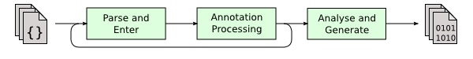
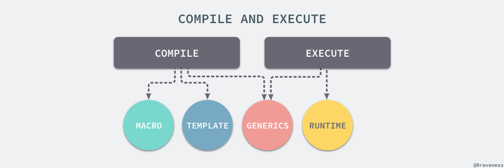
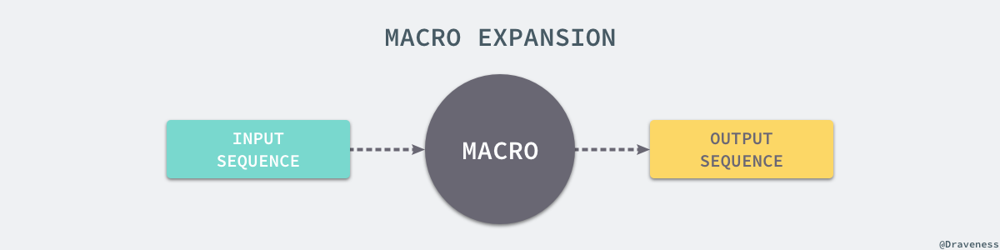

# 参考资料

[Java元编程及其应用 (youzan.com)](https://tech.youzan.com/java-metaprograming/)

[谈元编程与表达能力 - 面向信仰编程 (draveness.me)](https://draveness.me/metaprogramming/)

# 什么是元编程

[谈元编程与表达能力 - 面向信仰编程 (draveness.me)](https://draveness.me/metaprogramming/)

## 元编程是写出编写代码的代码

试想以下,如果那些原本需要我们手动编写的代码,可以自动生成,我们是不是又更多的时间来做更加有意义的事情?有些框架之所以开发效率高,其原因也是因为框架层面,把大量的需要重复编写的代码,采用元编程的方式给自动生成了.

> *甚至,我们可以大胆在想一步,如果有个更加智能的机器人,帮我们写代码,那么我们是不是又可以省掉更多的精力,来做更加有意义的事情?*

如果我们的应用框架有这样一种能力,那么可以省掉我们大部分的重复工作.

比如经常被Java程序员诟病的大段大段的setter/getter/toString/hashCode/equals方法,这些方法其实在模型字段定义好了之后,这些方法其实基本上就已经标准化了,比如常用的IDE(eclipse,IDEA)都支持自动生成这些方法,这样挺好,可以省掉我们好多精力. 但是这样做的还不够好,当我们尝试去理解一个模型的时候,视线里有大量这些的冗余方法,会增加我们对于模型理解的负担. lombok给出了一个解决方案通过注解的方法,来自动为模型生成setter/getter/toString/hashCode方法,使我们的代码精简了很多.

比如另外一个Java程序员诟病的地方,用mybatis访问数据库,即使我们的对数据库的操作仅仅是简单的增删查改,我们也需要对每一个操作的定义sql,我们需要编写

- 领域模型对象
- DAO的interface
- mybatis的mapper文件

程序员世界有个挠痒痒定理

> 当一个东西令你觉得痒了,那么很有可能,这个东西也令其他程序员痒了,而且github上面也许已经有了现成的项目可以借鉴.

比如 [mybatis generator](https://github.com/mybatis/generator)就可以根据数据库结构自动生成上面这些文件, 他大大减少了初次搭建项目的负担.

但是文件生成了,我么就得维护,我们会往里面加其它东西,比如加字段,增加其它操作. 这样当数据库的表结构有变动之后,我们就要维护所有涉及到的文件,这个工作量其实也不小. 有没有更好的方法?本文后面会提出一种解决方案.


## 元编程是将将代码看待成数据的编程

如果能够将代码看做数据，那么**代码就可以像数据一样在运行时被修改、更新和替换**；元编程赋予了编程语言更加强大的表达能力，能够让我们将一些计算过程从运行时挪到编译时、通过编译期间的展开生成代码或者允许程序在运行时改变自身的行为。

总而言之，**元编程其实是一种使用代码生成代码的方式**，无论是编译期间生成代码，还是在运行时改变代码的行为都是『**生成代码**』的一种，下面的代码其实就可以看作一种最简单的元编程技巧：

```c
int main() {
    for(int i = 0; i < 10; i++) {
        char *echo = (char*)malloc(6 * sizeof(char));
        sprintf(echo, "echo %d", i);
        system(echo);
    }
    return 0;
}
```

这里的代码其实等价于执行了以下的 shell 脚本，也可以说这里使用了 C 语言的代码生成来生成 shell 脚本：

```c
echo 0
echo 1
...
echo 9
```


# Java元编程的几种姿势

## 反射(reflection)

### 自省

我们要生成代码,我至少得知道我们现有的代码长什么样子吧?

正如,我们要化妆(给自己化妆,亦或是给别人化妆)我们至少得看得清楚我们的容貌,别人的容貌吧.

`reflection`这个名字起得真有意思,把程序的自省比喻成照镜子,对着这个镜子,程序就知道,哟,

- 这是一个`Class`
- 这个`Class`有几个`Field`
- 这个`Field`是什么类型的
- 这个`Field`是否`static`,是否是`final`的
- 这个`Class`还有几个`Method`
- 这个`Method`的返回类型是什么
- 这个`Method`的参数列表类型什么
- 每个参数有什么注解
- ...

> 参数的名字在运行时已经擦除了,获取不到

反射的API除了提供了以上的`读`能力之外,还提供了一个动态代理的功能.

### 动态代理

所谓动态代理,它的动态其实是相对于静态代理而言的.在静态代理里面,代理对象与被代理对象的类型都实现了同样的接口,这样当客户端持有一个接口对象的时候,就可以用代理的对象来替换这个真实对象,同时这个代理对象就像在扮演真实对象的秘书,很多需要真实对象处理的东西,其实都是这个代理做的.大部分场景下,他会直接把问题转给真实对象处理,同时,他还做了其它事情

- 比如记录一下日志啊
- 比如`选择性拒绝`啊(我们老板太忙,这个请求我替我们老板拒绝了)
- 甚至还可以通过请求其它服务,来伪造结果(mock)

所有的这些代理工作的实现,都是在写代码的时候,手动实现好的. 明显,这`很不元编程`

动态代理的神奇之处在于,本来`老板`是没有`秘书`的,只是突然决定要请一个`秘书`,就`临时变了一个秘书出来`,`老板`能做的事情,他都能做(`Proxy.newProxyInstance()`需要传一个接口列表,这个新生成的类,就会实现这些接口)

有了这种`变化能力`,我们不仅仅可以动态变出`AA`的代理`AAProxy`,而且还能动态变出`BB`的代理`BBProxy`,甚至更多. 看出区别了吗?

如果有10个需要代理的类,在静态代理中,我们就需要编写10个代理类;而在动态代理中,我们可以仅需要编写一个实现了`java.lang.reflect.InvocationHandler`接口的类即可.

> **我们编写的不是代码,而是生成代码的代码**

甚至更夸张的是,本来公司没`老板`(被代理类),现在决定要一个`老板`,我们描述一下这个老板需要什么能力(实现的`接口`),就能动态的变一个类似于老板的东西(`代理对象`),而这个东西,还挺像个老板的(实现了老板的接口,并且能够符合人们预期工作)

就像[retrofit](http://square.github.io/retrofit/)这个项目实现的一样,通过一个接口,以及这个接口上的注解,就能动态生成一个符合预期的,http接口的Java SDK.(代码就不贴了,有兴趣自己到官网参观).我之前,也借鉴这种模式,写了一个公司内部http接口的生成器. 这种编码方式,更加干净,更加直观.

#### 其它使用动态代理技术的项目

- Spring的基于接口的AOP
- [dubbo](http://dubbo.io/) reference对象的生成
- ......

## 字节码增强(bytecode enhancement)

我们知道,Java的类是编译成字节码存在class文件中的,类的加载,其实就是字节码被读取,生成Class类的过程.

我们是否能够通过某种途径,改变这个字节码呢?

要回答这个问题,我们可以先反问一句,我们是否有改变一个已经加载了的`Class`的需求呢?还真有,比如我们想给一个类的某些标记了`@Log`注解的方法进行打日志记录,我们想统计一个标记了`@Perf`注解的方法的执行时间. 如果我们无法改变一个类,那么我们就必须在每个类里面加类似的代码,这显然不环保. 由于这是个强需求,如果Java不允许修改意见加载的类,那么Java无疑会被实现了这些feature其它技术所淘汰,基于这个反向推理,由于Java现在还那么火,所以可以推测,Java应该支持这种feature.

### 加载时

为了实现上面这种需求,Java5就推出了`java.lang.instrument`并且在jdk6进一步加强.

要实现一个类的转换,我们需要执行如下步骤:

- 就像我们编写Java程序入口`main`方法一样,我们通过编写一个`public static void premain(String agentArgs, Instrumentation inst);`方法
- 然后再方法体里面注册一个`java.lang.instrument.ClassFileTransformer`
- 然后实现这个transformer
- 然后将整个程序打包,并且在`META-INF/MANIFEST.MF`注明实现了premain方法的类名
- 最终在程序启动的时候,`java -javaagent:myagent.jar`

JVM就会加载myagent.jar中的`META-INF/MANIFEST.MF`, 读取`Premain-Class`的值,并且加载我们的`Premain-class`类,然后在main方法执行之前,执行这个方法,由于我们在方法体中注册了transformer,这样后续一旦有类在加载之前,都会先执行我们的transformer的transform方法,进行字节码增强.

在`java.lang.instrument.ClassFileTransformer`的接口有一个方法

```java
byte[] transform(  
    ClassLoader         loader,
    String              className,
    Class<?>            classBeingRedefined,
    ProtectionDomain    protectionDomain,
    byte[]              classfileBuffer)
throws IllegalClassFormatException;
```

我们可以利用一些字节码增强的类库,对传入的字节码数组进行解析,然后修改,然后序列化成字节码,作为方法结果返回

常用的字节码增强类库

- ASM
- cglib
- javassist

其中**javassist**因为API易于使用,且项目一直活跃,所以推荐使用.

### 运行时

Java也可以在类已经加载到内存中的情况,对类进行修改,不过这个修改有个限制,只能修改方法体的实现,不能对类的结构进行修改。

类似的eclipse以及**IDEA的动态加载**,就是这个原理.

## 注解处理(Annotation Processing)

​        上一小节中提到的运行时或者加载时的字节码增强,虽然牛逼,但是其有个致命性短板,它增加的方法,**无法在编译时被代码感**知,也就是说,我们在运行时给`MyObj`类增加的方法`getSomeThing(Param param)`,无法在其它源代码中,通过`myObj.getSomeThing(param)`这种方式进行调用,而只能通过反射的方式进行调用,这无疑丑陋了很多.也许Java也是考虑到这种需求,才发明了`Annotation Processing`这种编译过程。

Java编译过程



如图所示,Java的编译过程分为三步

1. Parse & Enter: 这一步主要负责将Java的源代码解析成抽象语法树(AST)
2. Annotation Processing: 这一步就会执行用户定义的AnnotationProcessing逻辑,生成`新的代码`/资源,然后重复执行过程1,直到没有新的源代码生成
3. Analyse & Generate: 这一步才是真正的生成字节码的过程

这个编译过程中,我们可以扩展的是,第二部,我们可以自己实现一个`javax.annotation.processing.Processor`类,然后将这个类告诉编译器,然后编译器就会在编译源代码的时候,调用接口的process逻辑,我们就可以在这里生成新的源文件与资源文件!

遗憾的是,编译器并没有显示的API提供给我们,允许我们修改已有class的抽象语法树,也就是说,我们无法在通过`正规途径`在`编译时`给一个类增加成员;这里强调了`正规途径`是因为确认是存在一些非正规途径,可以让我们去修改这棵树. lombok就是[这么做](http://notatube.blogspot.com/2010/11/project-lombok-trick-explained.html)的

> lombok是做什么的?
>
> lombok允许我们通过简易的注解,来自动生成我们模型的getter,setter,constructor,toString等常用方法,可以让我们的模型代码更加干净.

了解了上述的Java的编译过程,我们其实就可以想想,是否可以通过代码生成的方式,来去掉我们平时诟病,却一直难以根除的痛?

**基于Annotation Processing的MybatisDAO & mapper文件自动生成分析**

对于一个model而已,常用的操作包括以下几种

- insert(model)
- selectByXXX(model)
- countByXXX(model)
- updateByXXXAndYYY(model)
- deleteByXXX(model)

如果仅仅提供model,是不是就足以生成对应的DAO接口申明以及对应mapper配置?

- 表名: 简单点,可以直接根据模型名来推断,也可以通过注解增加方法,来允许自定义表名
- insert/update的字段列表: 直接去模型的字段列表即可
- select/update/delete的时候,我们是需要知道我们根据什么字段进行过滤,这个信息我们是需要告诉`Processor`的,因为我们可以考虑增加一个注解`@Index`来告诉`Processor`,这些字段是索引字段,可以根据这些字段进行过滤

基于上面分析,我们有了以下大致思路

- 我们首先定义一个`@DAO`,用于标记我们的模型class

- 然后定义一个`@Index`,用于标记模型的字段

- 然后定义一个

  ```
  DAOGeneratorProcessor
  ```

  继承自

  ```
  AbstractProcessor
  ```

  ,并且申明支持

  ```
  DAO
  ```

  - process方法的实现中,我们会分析模型的语法书,提取出类名,字段列表

  - 找出标记了

    ```
    @Index
    ```

    的字段列表,然后对涉及到过滤的方法生成所有的组合,比如

    - selectByOrderAndSellerId
    - selectBySellerId
    - selectByOrderNo

  - 生成对应的接口声明,以及mapper文件

> 这种组合索引字段,生成方法名的方式比较粗暴,比如如果有N个@Index字段,对应的selectByXXX方法就会有`2**N`,大部分场景下,这个N都不会超过3个,比如订单表,就是order*no,商品表,就是item*id

由于annotation是编译器的扩展,这一点体验比较好,一旦我们定义好了模型(比如Order.class),然后编译模型,我们就可以在代码其它地方,就可以直接引用`OrderDAO`这个对象类(这个类是生成的哦),可以回顾一下Java的编译过程.

实践

实践中,虽然生成的DAO可以覆盖我们大部分的用例,但是并不能覆盖所有我们的需求场景,因此,我们推荐将生成的DAO统一叫做BasicDAO,这样有些个性化的需求,我们仍然可以同自己书写SQL的方式来自定义,这样在解决重复冗余的前提下,也能很好的适应复杂的业务场景.

## 总结

Java本身是一门静态语言,程序从源代码,到运行的程序,中间会经历很多的环节.

这些环节都可以作为我们元编程的切入点,不同的环节,可以发挥不同的威力,使用得当,可以帮助我们提供生产力的同时,也能很好优化我们的代码性能

# 元编程分类：编译时和运行时

现代的编程语言大都会为我们提供不同的元编程能力，从总体来看，根据『生成代码』的时机不同，我们将元编程能力分为两种类型，其中一种是编译期间的元编程，例如：宏和模板；另一种是运行期间的元编程，也就是运行时，它赋予了编程语言在运行期间修改行为的能力，当然也有一些特性既可以在编译期实现，也可以在运行期间实现。



不同的语言对于泛型就有不一样的实现，Java 的泛型就是在编译期间实现的，它的泛型其实是伪泛型，在编译期间所有的泛型就会被编译器擦除（type erasure），生成的 Java 字节码是不包含任何的泛型信息的，但是 C# 对于泛型就有着不同的实现了，它的泛型类型在运行时进行替换，为实例化的对象保留了泛型的类型信息。

> C++ 的模板其实与这里讨论的泛型有些类似，它会为每一个具体类型生成一份独立的代码，而 Java 的泛型只会生成一份经过类型擦除后的代码，总而言之 C++ 的模板完全是在编译期间实现的，而 Java 的泛型是编译期间和运行期间协作产生的；模板和泛型虽然非常类似，但是在这里提到的模板大都特指 C++ 的模板，而泛型这一概念其实包含了 C++ 的模板。

虽然泛型和模板为各种编程语言提供了非常强大的表达能力，但是在这篇文章中，我们会介绍另外两种元编程能力：*宏*和*运行时*，前者是在编译期间完成的，而后者是在代码运行期间才发生的。

## 宏（Macro）

宏是很多编程语言具有的特性之一，它是一个将输入的字符串映射成其他字符串的过程，这个映射的过程也被我们称作宏展开。



宏其实就是一个在编译期间中定义的展开过程，通过预先定义好的宏，我们可以使用少量的代码完成更多的逻辑和工作，能够减少应用程序中大量的重复代码。

很多编程语言，尤其是编译型语言都实现了宏这个特性，包括 C、Elixir 和 Rust，然而这些语言却使用了不同的方式来实现宏；我们在这里会介绍两种不同的宏，一种是基于文本替换的宏，另一种是基于语法的宏。


C、C++ 等语言使用基于文本替换的宏，而类似于 Elixir、Rust 等语言的宏系统其实都是基于语法树和语法元素的，它的实现会比前者复杂很多，应用也更加广泛。

在这一节的剩余部分，我们会分别介绍 C、Elixir 和 Rust 三种不同的编程语言实现的宏系统，它们的使用方法、适用范围和优缺点。

### C

作者相信很多工程师入门使用的编程语言其实都是 C 语言，而 C 语言的宏系统看起来还是相对比较简单的，虽然在实际使用时会遇到很多非常诡异的问题。C 语言的宏使用的就是文本替换的方式，所有的宏其实并不是通过编译器展开的，而是由预编译器来处理的。


编译器 GCC 根据『长相』将 C 语言中的宏分为两种，其中的一种宏与编程语言中定义变量非常类似：

```c
#define BUFFER_SIZE 1024

char *foo = (char *)malloc(BUFFER_SIZE);
char *foo = (char *)malloc(1024);
```

这些宏的定义就是一个简单的标识符，它们会在预编译的阶段被预编译器替换成定义后半部分出现的**字符**，这种宏定义其实比较类似于变量的声明，我们经常会使用这种宏定义替代一些无意义的数字，能够让程序变得更容易理解。

另一种宏定义就比较像对函数的定义了，与其他 C 语言的函数一样，这种宏在定义时也会包含一些宏的参数：

```c
#define plus(a, b) a + b
#define multiply(a, b) a * b
```

通过在宏的定义中引入参数，宏定义的内部就可以直接使用对应的标识符引入外界传入的参数，在定义之后我们就可以像使用函数一样使用它们：

```c
#define plus(a, b) a + b
#define multiply(a, b) a * b

int main(int argc, const char * argv[]) {
    printf("%d", plus(1, 2));       // => 3
    printf("%d", multiply(3, 2));   // => 6
    return 0;
}
```

上面使用宏的代码与下面的代码是完全等价的，在预编译阶段之后，上面的代码就会被替换成下面的代码，也就是编译器其实是不负责宏展开的过程：

```c
int main(int argc, const char * argv[]) {
    printf("%d", 1 + 2);    // => 3
    printf("%d", 3 * 2);    // => 6
    return 0;
}
```

宏的作用其实非常强大，基于文本替换的宏能做到很多函数无法做到的事情，比如使用宏根据传入的参数创建类并声明新的方法：

```c
#define pickerify(KLASS, PROPERTY) interface \
    KLASS (Night_ ## PROPERTY ## _Picker) \
    @property (nonatomic, copy, setter = dk_set ## PROPERTY ## Picker:) DKColorPicker dk_ ## PROPERTY ## Picker; \
    @end \
    @implementation \
    KLASS (Night_ ## PROPERTY ## _Picker) \
    - (DKColorPicker)dk_ ## PROPERTY ## Picker { \
        return objc_getAssociatedObject(self, @selector(dk_ ## PROPERTY ## Picker)); \
    } \
    - (void)dk_set ## PROPERTY ## Picker:(DKColorPicker)picker { \
        objc_setAssociatedObject(self, @selector(dk_ ## PROPERTY ## Picker), picker, OBJC_ASSOCIATION_COPY_NONATOMIC); \
        [self setValue:picker(self.dk_manager.themeVersion) forKeyPath:@keypath(self, PROPERTY)];\
        NSMutableDictionary *pickers = [self valueForKeyPath:@"pickers"];\
        [pickers setValue:[picker copy] forKey:_DKSetterWithPROPERTYerty(@#PROPERTY)]; \
    } \
    @end

@pickerify(Button, backgroundColor);
```

上面的代码是我在一个 iOS 的开源库 [DKNightVersion](https://github.com/Draveness/DKNightVersion/blob/master/DKNightVersion/DKNightVersion.h#L57-L72) 中使用的代码，通过宏的文本替换功能，我们在这里创建了类、属性并且定义了属性的 getter/setter 方法，然而使用者对此其实是一无所知的。

C 语言中的宏只是提供了一些文本替换的功能再加上一些高级的 API，虽然它非常强大，但是强大的事物都是一把双刃剑，再加上 C 语言的宏从实现原理上就有一些无法避免的缺陷，所以在使用时还是要非常小心。

由于预处理器只是对宏进行替换，并没有做任何的语法检查，所以在宏出现问题时，编译器的报错往往会让我们摸不到头脑，不知道哪里出现了问题，还需要脑内对宏进行展开分析出现错误的原因；除此之外，类似于 `multiply(1+2, 3)` 的展开问题导致人和机器对于同一段代码的理解偏差，作者相信也广为人知了；更高级一些的**分号吞噬**、**参数的重复调用**以及**递归引用时不会递归展开**等问题其实在这里也不想多谈。

```c
multiply(1+2, 3) // #=> 1+2 * 3
```

#### 卫生宏

然而 C 语言宏的实现导致的另一个问题却是非常严重的：

```c
#define inc(i) do { int a = 0; ++i; } while(0)

int main(int argc, const char * argv[]) {
    int a = 4, b = 8;
    inc(a);
    inc(b);
    printf("%d, %d\n", a, b); // => 4, 9 !!
    return 0;
}
```

这一小节与卫生宏有关的 C 语言代码取自 [Hygienic macro](https://en.wikipedia.org/wiki/Hygienic_macro) 中的代码示例。

上述代码中的 `printf` 函数理应打印出 `5, 9` 然而却打印出了 `4, 9`，我们来将上述代码中使用宏的部分展开来看一下：

```c
int main(int argc, const char * argv[]) {
    int a = 4, b = 8;
    do { int a = 0; ++a; } while(0);
    do { int a = 0; ++b; } while(0);
    printf("%d, %d\n", a, b); // => 4, 9 !!
    return 0;
}
```

这里的 `a = 0` 按照逻辑应该不发挥任何的作用，但是在这里却覆盖了上下文中 `a` 变量的值，导致父作用域中变量 `a` 的值并没有 `+1`，这其实就是因为 C 语言中实现的宏不是*卫生宏*（Hygiene macro）。

作者认为卫生宏（Hygiene macro）是一个非常让人困惑的翻译，它其实指一些**在宏展开之后不会意外捕获上下文中标识符的宏**，从定义中我们就可以看到 C 语言中的宏明显不是卫生宏，而接下来要介绍的两种语言的宏系统就实现了卫生宏。

## 运行时（Runtime）