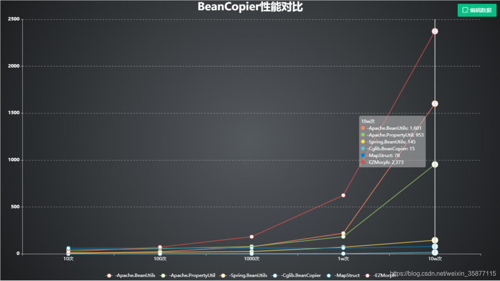

## 实体类Dto映射工具对比

https://blog.csdn.net/weixin_41205148/article/details/97272157

https://blog.csdn.net/Trend_H/article/details/107298066

https://zyc88.blog.csdn.net/article/details/109681423

| 工具                    | 实现方式    | 缺点                                                         | 说明                                                         | 效率                                                         |
| ----------------------- | ----------- | ------------------------------------------------------------ | ------------------------------------------------------------ | ------------------------------------------------------------ |
| mapstruct               | get,set方法 | 开发人员手动写每个Dto与实体类映射的接口，略繁琐              | 编译时，自动生成接口实现类，来进行get和set，同时标注了spring的@Component，可以直接注入使用 | 海量数据时最快,5倍速于Spring BeanUtils                       |
| BeanCopier（cglibCopy） | 字节码修改  | 只能拷贝名称和类型相同的属性，包装类也不行，支持自定义转换器，但效率会下降 | 基于ASM类库进行字节码修改，目标对象必须先实例化。需要手动将BeanCopier对象缓存起来，效率才高 | 很快，接近mapstruct，数据量较少时慢于Spring BeanUtils，但可以通过缓存BeanCopier对象进行优化 |
| orika                   | 字节码修改  | 首次调用耗时较久，性能适中                                   | 基于Javassist类库进行字节码修改                              | 较快，慢于BeanCopier                                         |
| Spring BeanUtils        | 反射        |                                                              | 单例模式，目标对象必须先实例化                               | 中等                                                         |
| ModelMapper             | 反射        | 反射引起的效率不高                                           | 已有一个实体类对象，生成目标对象                             | 中等                                                         |
| Apache BeanUtils        | 反射        | 反射引起的效率不高                                           | 基于现有的两个实体类属性对拷，目标对象必须先实例化           | 差                                                           |
| Apache PropertieyUtils  |             |                                                              | 已有一个实体类对象，生成目标对象                             | 差                                                           |

图片来源： https://blog.csdn.net/weixin_35877115/article/details/90483214

**结论**：

- 手动Copy >Mapstuct>= cglibCopy > springBeanUtils > apachePropertyUtils > apacheBeanUtils

- mapstruct和BeanCopier效率最高

- 建议当对象转换操作较少或者应用对性能要求较高时，尽量不采用工具，而是手写getter/setter；

- 普通的对象转换可以使用Cglib.BeanCopier，复杂的对象转换使用MapStruct。

