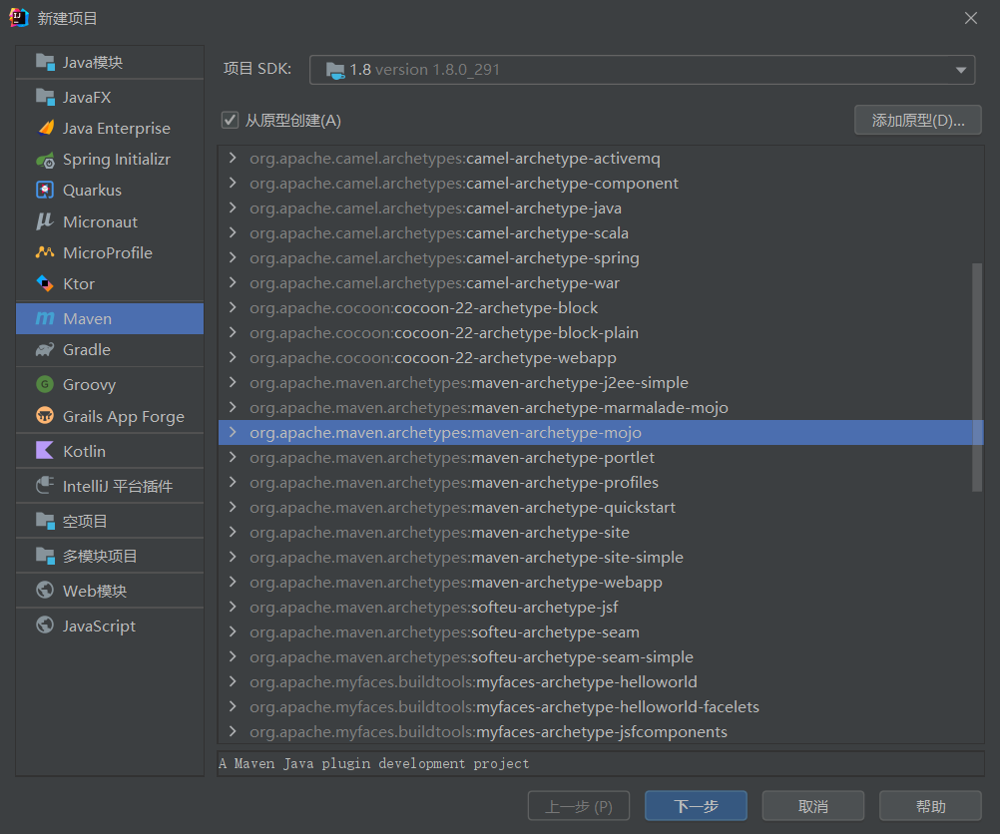

文档：https://maven.apache.org/guides/plugin/guide-java-plugin-development.html

教程：

https://blog.csdn.net/mengtianning/article/details/109081319

https://www.jianshu.com/p/9cfe599b3c5e

# 介绍

## 命名规范

在写一个项目之前，第一件事就是确定一个名称。maven 插件也不例外。它有着自己的一套命名规范。但是规范很简单，一句话就可以概括，

**官方插件命名的格式为 maven-xxx-plugin,非官方的插件命名为 xxx-maven-plugin 。**

是不是觉得很眼熟，没错，spring boot starter 的命名也有类似的规范。

好的，我们的第一个 maven 插件项目就叫 demo-maven-plugin 吧。

有两种方式：基于注释和基于注解

## HelloWorld

IDEA创建maven mojo项目：




会生成一个MyMojo类，内容如下：（基于注释）

```java
import org.apache.maven.plugin.AbstractMojo;
import org.apache.maven.plugin.MojoExecutionException;

import java.io.File;
import java.io.FileWriter;
import java.io.IOException;

/**
 * Goal which touches a timestamp file.
 *
 * @goal touch
 * @phase process-sources
 */
public class MyMojo extends AbstractMojo {
    /**
     * Location of the file.
     *
     * @parameter property="${project.build.directory}"
     * @required
     */
    private File outputDirectory;

    public void execute() throws MojoExecutionException {
        File f = outputDirectory;
        getLog().info("hello world");

        if (!f.exists()) {
            f.mkdirs();
        }

        File touch = new File(f, "touch.txt");

        FileWriter w = null;
        try {
            w = new FileWriter(touch);

            w.write("touch.txt");
        } catch (IOException e) {
            throw new MojoExecutionException("Error creating file " + touch, e);
        } finally {
            if (w != null) {
                try {
                    w.close();
                } catch (IOException e) {
                    // ignore
                }
            }
        }
    }
}
```