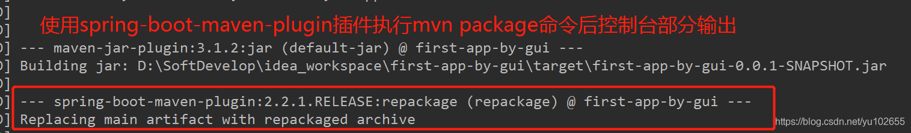
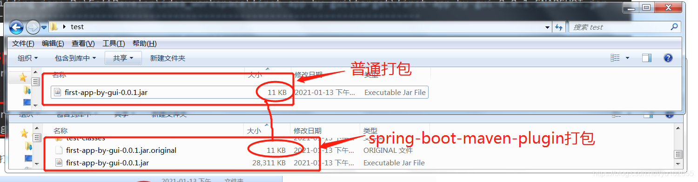

## spring-boot:repackage和Maven package区别

https://www.baeldung.com/spring-boot-repackage-vs-mvn-package

[spring-boot-maven插件repackage（goal）的那些事_yu102655的专栏-CSDN博客](https://blog.csdn.net/yu102655/article/details/112490962)

以下两张图的文字描述和控制台输出可以得出：运行mvn package命令时，使用spring-boot-maven插件的打包过程比没有使用spring-boot-maven插件多了一次repackage过程，下面简单记录下repackage到底干了哪些工作？

一、首先对比下打包的成果物：

可以发现使用spring-boot-maven-plugin插件的比没有使用的场景，多了一个以.original结尾的文件，且该文件的大小与没使用spring-boot-maven插件打包的jar文件大小一样。下面对这两个大小一样的文件解压缩，解压后内容如下，可以看到解压后的内容无论是大小还是目录结构以及目录下的内容都一样。

对此我们可以得出第一个结论：spring-boot-maven-plugin的package（goal）将Maven的package命令默认实现（jar:jar)打包的重命名为XXX.jar.original

二、下面开始分析由spring-boot-maven插件打包的jar包结构如下：

BOOT-INF目录下有两个子目录：classes和lib目录。lib目录存放的是应用依赖的jar包，具体参照Maven的pom.xml中的依赖内容。classes目录下存放的是项目CLASS_PATH下的内容，包括应用代码和配置文件（比如application.yml等），可以理解为repackage将原始Maven打包的jar文件中的除META-INF以外的内容放置到该目录下打包。

META-INF目录下存放的是应用相关的元信息，比如JAR包的必要配置文件MANIFEST.MF和Maven的配置文件等。

org目录下放置的与springboot应用jar加载和启动相关的类，后期会有博客专门讲解springboot应用的启动过程，会重点分析spring-boot-loader的。

根据以上控制台日志输出以及有无spring-boot-maven插件下打包形成的jar包组成可以推断，spring-boot-maven插件的repackage（goal）有如下两个作用：

**1、在原始Maven打包形成的jar包基础上，进行重新打包，新形成的jar包不但包含应用类文件和配置文件，而且还会包含应用所依赖的jar包以及Springboot启动相关类（loader等），以此来满足Springboot独立应用的特性；**

**2、将原始Maven打包的jar重命名为XXX.jar.original作为原始文件；**

