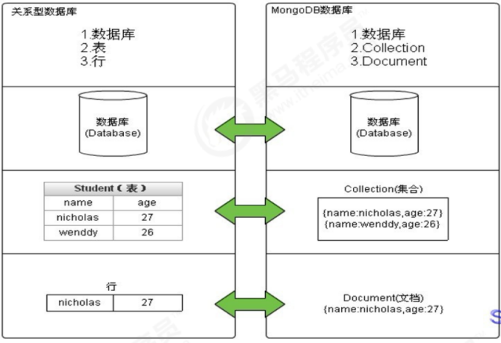

https://www.bilibili.com/video/BV1bJ411x7mq?p=7

# MongoDB快速上手

MongoDB用起来・快速上手&集群和安全系列

课程目标:

- 理解 ONGODBE的业务场景、熟恶 Mongodb的简介、特点和体系结构、数据类型等。

- 能够在 Windows和 Linux下安装和启动 MongoDB、图形化管理界面 Compass的安装使用
- 学握 MongoDB基本常用命令实现数据的CRUD
- 掌握 MongoDB的素引类埋、素引管理、执行计划
- 使用 Spring Data MongoDB完成文章评论业务的开发

# 第1章 MongoDB相关概念

## 1.1 业务应用场景

传统的关系型数据库（如MySQL），在数据操作的“三高”需求以及应对Web2.0的网站需求面前，显得力不从心。
解释：“三高”需求：
• High performance - 对数据库高并发读写的需求。
• Huge Storage - 对海量数据的高效率存储和访问的需求。
• High Scalability && High Availability- 对数据库的高可扩展性和高可用性的需求。
而**MongoDB可应对“三高”需求。**

具体的应用场景如：
1）社交场景，使用 MongoDB 存储存储用户信息，以及用户发表的朋友圈信息，通过地理位置索引实现附近的人、地点等功能。
2）游戏场景，使用 MongoDB 存储游戏用户信息，用户的装备、积分等直接以内嵌文档的形式存储，方便查询、高效率存储和访问。
3）物流场景，使用 MongoDB 存储订单信息，订单状态在运送过程中会不断更新，以 MongoDB 内嵌数组的形式来存储，一次查询就能将
订单所有的变更读取出来。
4）物联网场景，使用 MongoDB 存储所有接入的智能设备信息，以及设备汇报的日志信息，并对这些信息进行多维度的分析。
5）视频直播，使用 MongoDB 存储用户信息、点赞互动信息等。

这些应用场景中，数据操作方面的共同特点是：
**（1）数据量大**
**（2）写入操作频繁（读写都很频繁）**
**（3）价值较低的数据，对事务性要求不高**
对于这样的数据，我们更适合使用MongoDB来实现数据的存储。

**什么时候选择MongoDB**
在架构选型上，除了上述的三个特点外，如果你还犹豫是否要选择它？可以考虑以下的一些问题：
应用不需要事务及复杂 join 支持
新应用，需求会变，数据模型无法确定，想快速迭代开发
应用需要2000-3000以上的读写QPS（更高也可以）
应用需要TB甚至 PB 级别数据存储
应用发展迅速，需要能快速水平扩展
应用要求存储的数据不丢失
应用需要99.999%高可用
应用需要大量的地理位置查询、文本查询
如果上述有1个符合，可以考虑 MongoDB，2个及以上的符合，选择 MongoDB 绝不会后悔。

思考：如果用MySQL呢？
答：相对MySQL，可以以更低的成本解决问题（包括学习、开发、运维等成本）

## 1.2 MongoDB简介

MongoDB是一个开源、高性能、无模式的文档型数据库，当初的设计就是用于简化开发和方便扩展，是NoSQL数据库产品中的一种。是最像关系型数据库（MySQL）的非关系型数据库。

它支持的数据结构非常松散，是一种**类似于 JSON 的 格式叫BSON**，所以它既可以存储比较复杂的数据类型，又相当的灵活。

MongoDB中的记录是一个**文档**，它是一个由**字段和值对（field:value）组成的数据结构。**MongoDB文档类似于JSON对象，即一个文档认为就是一个对象。字段的数据类型是字符型，它的值除了使用基本的一些类型外，还可以包括其他文档、普通数组和文档数组。

## 1.3 体系结构

MySQL和MongoDB对比



| SQL术语/概念 | MongoDB术语/概念 | 解释/说明                           |
| ------------ | ---------------- | ----------------------------------- |
| database     | database         | 数据库                              |
| table        | collection       | 数据库表/集合                       |
| row          | document         | 数据记录行/文档                     |
| column       | fifield          | 数据字段/域                         |
| index        | index            | 索引                                |
| table joins  |                  | 表连接,MongoDB不支持                |
|              | 嵌入文档         | MongoDB通过嵌入式文档来替代多表连接 |
| primary key  | primary key      | 主键,MongoDB自动将_id字段设置为主键 |

## 1.4 数据模型

MongoDB的最小存储单位就是文档(document)对象。文档(document)对象对应于关系型数据库的行。数据在MongoDB中以BSON（Binary-JSON）文档的格式存储在磁盘上。

BSON（Binary Serialized Document Format）是一种类json的一种二进制形式的存储格式，简称Binary JSON。BSON和JSON一样，支持内嵌的文档对象和数组对象，但是BSON有JSON没有的一些数据类型，如Date和BinData类型。

BSON采用了类似于 C 语言结构体的名称、对表示方法，支持内嵌的文档对象和数组对象，具有轻量性、可遍历性、高效性的三个特点，可以有效描述非结构化数据和结构化数据。这种格式的优点是灵活性高，但它的缺点是空间利用率不是很理想。

Bson中，除了基本的JSON类型：string,integer,boolean,double,null,array和object，mongo还使用了特殊的数据类型。这些类型包括date,object id,binary data,regular expression 和code。每一个驱动都以特定语言的方式实现了这些类型，查看你的驱动的文档来获取详细信息。

BSON数据类型参考列表：

| 数据类型      | 描述                                                         | 举例                                                 |
| ------------- | ------------------------------------------------------------ | ---------------------------------------------------- |
| 字符串        | UTF-8字符串都可表示为字符串类型的数据                        | {"x" : "foobar"}                                     |
| 对象id        | 对象id是文档的12字节的唯一 ID                                | {"X" :ObjectId() }                                   |
| 布尔值        | 真或者假：true或者false                                      | {"x":true}+                                          |
| 数组          | 值的集合或者列表可以表示成数组 {"x" ： ["a", "b", "c"]}      | {"x" ： ["a", "b", "c"]}                             |
| 32位整数      | 类型不可用。JavaScript仅支持64位浮点数，所以32位整数会被自动转换。 | shell是不支持该类型的，shell中默认会转换成64位浮点数 |
| 64位整数      | 不支持这个类型。shell会使用一个特殊的内嵌文档来显示64位整数  | shell是不支持该类型的，shell中默认会转换成64位浮点数 |
| 64位浮点数    | shell中的数字就是这一种类型                                  | {"x"：3.14159，"y"：3}                               |
| null          | 表示空值或者未定义的对象                                     | {"x":null}                                           |
| undefifined   | 文档中也可以使用未定义类型                                   | {"x":undefined}                                      |
| 符号          | shell不支持，shell会将数据库中的符号类型的数据自动转换成字符串 |                                                      |
| 正则表达式    | 文档中可以包含正则表达式，采用JavaScript的正则表达式语法     | {"x" ： /foobar/i}                                   |
| 代码          | 文档中还可以包含JavaScript代码                               | {"x" ： function() { /* …… */ }}                     |
| 二进制数据    | 二进制数据可以由任意字节的串组成，不过shell中无法使用        |                                                      |
| 最大值/最小值 | BSON包括一个特殊类型，表示可能的最大值。shell中没有这个类型。 |                                                      |

提示：
shell默认使用64位浮点型数值。{“x”：3.14}或{“x”：3}。对于整型值，可以使用NumberInt（4字节符号整数）或NumberLong（8字节符号整数），{“x”:NumberInt(“3”)}{“x”:NumberLong(“3”)}

## 1.5 MongoDB的特点

MongoDB主要有如下特点：
（1）高性能：
MongoDB提供高性能的数据持久性。特别是,
对嵌入式数据模型的支持减少了数据库系统上的I/O活动。
索引支持更快的查询，并且可以包含来自嵌入式文档和数组的键。（文本索引解决搜索的需求、TTL索引解决历史数据自动过期的需求、地
理位置索引可用于构建各种 O2O 应用）
mmapv1、wiredtiger、mongorocks（rocksdb）、in-memory 等多引擎支持满足各种场景需求。
Gridfs解决文件存储的需求。
（2）高可用性：
MongoDB的复制工具称为副本集（replica set），它可提供自动故障转移和数据冗余。
（3）高扩展性：
MongoDB提供了水平可扩展性作为其核心功能的一部分。
分片将数据分布在一组集群的机器上。（海量数据存储，服务能力水平扩展）
从3.4开始，MongoDB支持基于片键创建数据区域。在一个平衡的集群中，MongoDB将一个区域所覆盖的读写只定向到该区域内的那些
片。
（4）丰富的查询支持：
MongoDB支持丰富的查询语言，支持读和写操作(CRUD)，比如数据聚合、文本搜索和地理空间查询等。
（5）其他特点：如**无模式**（动态模式）、**灵活的文档模型**、

# 第2章 单机部署

## 2.1 Windows系统中的安装启动

### 第一步：下载安装包

MongoDB 提供了可用于 32 位和 64 位系统的预编译二进制包，你可以从MongoDB官网下载安装，MongoDB 预编译二进制包下载地址：
https://www.mongodb.com/download-center#community

提示：版本的选择：
MongoDB的版本命名规范如：x.y.z；
y为奇数时表示当前版本为开发版，如：1.5.2、4.1.13；
y为偶数时表示当前版本为稳定版，如：1.6.3、4.0.10；
z是修正版本号，数字越大越好。
详情：http://docs.mongodb.org/manual/release-notes/#release-version-numbers

### 第二步：解压安装启动

将压缩包解压到一个目录中。
在解压目录中，手动建立一个目录用于存放数据文件，如 data/db

方式1：命令行参数方式

启动服务在 bin 目录中打开命令行提示符，输入如下命令：我们在启动信息中可以看到，mongoDB的默认端口是27017为了方便我们每次启动，可以将安装目录的bin目录设置mongo 客户端连接服务用的。

在bin的同级目录下创建data/db目录

```bash
mongod --dbpath=..\data\db
```

我们在启动信息中可以看到，mongoDB的默认端口是27017，如果我们想改变默认的启动端口，可以通过--port来指定端口。

为了方便我们每次启动，可以将安装目录的bin目录设置到环境变量的path中， bin 目录下是一些常用命令，


方式2：配置文件方式启动服务
在解压目录中新建 config 文件夹，该文件夹中新建配置文件 mongod.conf ，内如参考如下：比如 mongod 启动服务用的，mongo 客户端连接服务用的。

```properties
storage:
#The directory where the mongod instance stores its data.Default Value is "\data\db" on Windows.
dbPath: F:\ShangGuiGuJavaEE\Environment\mongodb-win32-x86_64-windows-4.4.2\data\db
```

详细配置项内容可以参考官方文档：https://docs.mongodb.com/manual/reference/configuration-options/
【注意】
1）配置文件中如果使用双引号，比如路径地址，自动会将双引号的内容转义。如果不转义，则会报错：

```
error-parsing-yaml-config-file-yaml-cpp-error-at-line-3-column-15-unknown-escape-character-d
```

解决：
a. 对 \ 换成 / 或 \\\
b. 如果路径中没有空格，则无需加引号。


2）配置文件中不能以Tab分割字段

解决：将其转换成空格。

启动方式：

```bash
mongod -f ../config/mongod.conf
或
mongod --config ../config/mongod.conf
```

更多参数配置：

```yaml
systemLog:
	destination: file
#The path of the log file to which mongod or mongos should send all diagnostic logging information
	path: "D:/02_Server/DBServer/mongodb-win32-x86_64-2008plus-ssl-4.0.1/log/mongod.log"
	logAppend: true
storage:
    journal:
    	enabled: true
#The directory where the mongod instance stores its data.Default Value is "/data/db".
	dbPath: "D:/02_Server/DBServer/mongodb-win32-x86_64-2008plus-ssl-4.0.1/data"
net:
	#bindIp: 127.0.0.1
	port: 27017
setParameter:
	enableLocalhostAuthBypass: false
```

## 2.2 Shell连接(mongo命令)

在命令提示符输入以下shell命令即可完成登陆

```shell
mongo
或
mongo --host=127.0.0.1 --port=27017
```

查看已经有的数据库

```sh
>show databases
```

退出mongodb

```sh
exit
```

更多参数可以通过帮助查看：

```sh
mongo --help
```

提示：
MongoDB javascript shell是一个基于javascript的解释器，故是支持js程序的

## 2.3 Compass-图形化界面客户端

到MongoDB官网下载MongoDB Compass，
地址：https://www.mongodb.com/download-center/v2/compass?initial=true
如果是下载安装版，则按照步骤安装；如果是下载加压缩版，直接解压，执行里面的 MongoDBCompassCommunity.exe 文件即可。
在打开的界面中，输入主机地址、端口等相关信息，点击连接：

## 2.4 Linux系统中的安装启动和连接

目标：在Linux中部署一个单机的MongoDB，作为生产环境下使用。
提示：和Windows下操作差不多。
步骤如下：

（1）先到官网下载压缩包 mongod-linux-x86_64-4.0.10.tgz 。

（2）上传压缩包到Linux中，解压到当前目录：

```bash
tar -xvf mongodb-linux-x86_64-4.0.10.tgz
```

（3）移动解压后的文件夹到指定的目录中：

```bash
mv mongodb-linux-x86_64-4.0.10 /usr/local/mongodb
```

（4）新建几个目录，分别用来存储数据和日志：

```bash
#数据存储目录
mkdir -p /mongodb/single/data/db
#日志存储目录
mkdir -p /mongodb/single/log
```

（5）新建并修改配置文件

```bash
vi /mongodb/single/mongod.conf
```

配置文件的内容如下：

注意文件是yaml格式，注意缩进为2个空格

```yaml
systemLog:
  # MongoDB发送所有日志输出的目标指定为文件
  # The path of the log file to which mongod or mongos should send all diagnostic logging information
  destination: file
  # mongod或mongos应向其发送所有诊断日志记录信息的日志文件的路径
  path: "/mongodb/single/log/mongod.log"
  # 当mongos或mongod实例重新启动时，mongos或mongod会将新条目附加到现有日志文件的末尾。
  logAppend: true
storage:
  # mongod实例存储其数据的目录。storage.dbPath设置仅适用于mongod。
  # The directory where the mongod instance stores its data.Default Value is "/data/db".
  dbPath: "/mongodb/single/data/db"
  journal:
    # 启用或禁用持久性日志以确保数据文件保持有效和可恢复。
    enabled: true
processManagement:
 # 启用在后台运行mongos或mongod进程的守护进程模式。
 fork: true
net:
  # 服务实例绑定的IP(服务器的局域网ip)，默认是localhost
  bindIp: localhost,192.168.1.136
  port: 27017
```


（6）启动MongoDB服务s

```bash
[root@bobohost single]# /usr/local/mongodb/bin/mongod -f /mongodb/single/mongod.conf
about to fork child process, waiting until server is ready for connections.
forked process: 3579
child process started successfully, parent exiting
```

注意：
如果启动后不是 successfully ，则是启动失败了。原因基本上就是配置文件有问题。
通过进程来查看服务是否启动了：

```bash
[root@bobohost single]# ps -ef |grep mongod
root 90384 1 0 8月26 ? 00:02:13 /usr/local/mongdb/bin/mongod -f /mongodb/single/mongod.conf
```

（7）分别使用mongo命令和compass工具来连接测试。
提示：如果远程连接不上，需要配置防火墙放行，或直接关闭linux防火墙

```bash
#查看防火墙状态
systemctl status firewalld
#临时关闭防火墙
systemctl stop firewalld
#开机禁止启动防火墙
systemctl disable firewalld
```

（8）停止关闭服务
停止服务的方式有两种：快速关闭和标准关闭，下面依次说明：
（一）快速关闭方法（快速，简单，数据可能会出错）
目标：通过系统的kill命令直接杀死进程：
杀完要检查一下，避免有的没有杀掉。

```bash
#通过进程编号关闭节点
kill -2 54410
```

【补充】
如果一旦是因为数据损坏，则需要进行如下操作（了解）：
1）删除lock文件：

```bash
rm -f /mongodb/single/data/db/*.lock
```

2）修复数据：

```bash
/usr/local/mongdb/bin/mongod --repair --dbpath=/mongodb/single/data/db
```

（二）标准的关闭方法（数据不容易出错，但麻烦）：
目标：通过mongo客户端中的shutdownServer命令来关闭服务
主要的操作步骤参考如下：

```bash
//客户端登录服务，注意，这里通过localhost登录，如果需要远程登录，必须先登录认证才行。
mongo --port 27017
//#切换到admin库
use admin
//关闭服务
db.shutdownServer()
```

# 第3章 基本常用命令

## 3.1案例要求

存放文章评论的数据存放到MongoDB中，数据结构参考如下：

数据库：articledb

| 专栏文章评论   | comment        |                  |                           |
| -------------- | -------------- | ---------------- | ------------------------- |
| 字段名称       | 字段含义       | 字段类型         | 备注                      |
| _id            | ID             | ObjectId或String | Mongo的主键的字段         |
| articleid      | 文章ID String  | String           |                           |
| content        | 评论内容 Strin | String           |                           |
| userid         | 评论人ID       | String           |                           |
| nickname       | 评论人昵称     | String           |                           |
| createdatetime | 评论的日期时间 | Date             |                           |
| likenum        | 点赞数         | Int32            |                           |
| replynum       | 回复数         | Int32            | 0：不可见；1：可见；      |
| state          | 状态           | String           |                           |
| parentid       | 上级ID         | String           | 如果为0表示文章的顶级评论 |

## 3.2数据库操作

### 3.2.1 选择和创建数据库

选择和创建数据库的语法格式：

```sql
use 数据库名称
```

如果数据库不存在则自动创建，例如，以下语句创建 spitdb 数据库：

```
use articledb
```

查看有权限查看的所有的数据库命令

```
show dbs
或
show databases
```

注意: 在 MongoDB 中，集合只有在内容插入后才会创建! 就是说，创建集合(数据表)后要再插入一个文档(记录)，集合才会真正创建。

查看当前正在使用的数据库命令

```
db
```

MongoDB 中默认的数据库为 test，如果你没有选择数据库，集合将存放在 test 数据库中。

另外：数据库名可以是满足以下条件的任意UTF-8字符串。

- 不能是空字符串（"")。
- 不得含有' '（空格)、.、$、/、\和\0 (空字符)。
- 应全部小写。
- 最多64字节。

有一些数据库名是保留的，可以直接访问这些有特殊作用的数据库。

- admin： 从权限的角度来看，这是"root"数据库。要是将一个用户添加到这个数据库，这个用户自动继承所有数据库的权限。一些特定的服务器端命令也只能从这个数据库运行，比如列出所有的数据库或者关闭服务器。
- local: 这个数据永远不会被复制，可以用来存储限于本地单台服务器的任意集合
- config: 当Mongo用于分片设置时，config数据库在内部使用，用于保存分片的相关信息。

### 3.2.2数据库的删除

MongoDB 删除数据库的语法格式如下：

```
db.dropDatabase()
```

提示：主要用来删除已经持久化的数据库

## 3.3 集合操作

集合，类似关系型数据库中的表。
可以显示的创建，也可以隐式的创建。

### 3.3.1 集合的显式创建（了解

基本语法格式：

```
db.createCollection(name)
```

参数说明：

- name: 要创建的集合名称

```
db.createCollection("mycollection")
```

查看当前库中的表：show tables命令

```
show collections
或
show tables
```

集合的命名规范：

- 集合名不能是空字符串""。
- 集合名不能含有\0字符（空字符)，这个字符表示集合名的结尾。
- 集合名不能以"system."开头，这是为系统集合保留的前缀。
- 用户创建的集合名字不能含有保留字符。有些驱动程序的确支持在集合名里面包含，这是因为某些系统生成的集合中包含该字符。除非你要访问这种系统创建的集合，否则千万不要在名字里出现$。

### 3.3.2 集合的隐式创建

当向一个集合中插入一个文档的时候，如果集合不存在，则会自动创建集合。
详见  文档的插入 章节。
提示：通常我们使用隐式创建文档即可。


### 3.3.3 集合的删除

集合删除语法格式如下：

```
db.collection.drop()
或
db.集合.drop()
```

**返回值**

如果成功删除选定集合，则 drop() 方法返回 true，否则返回 false。
例如：要删除mycollection集合

```
db.mycollection.drop()
```

