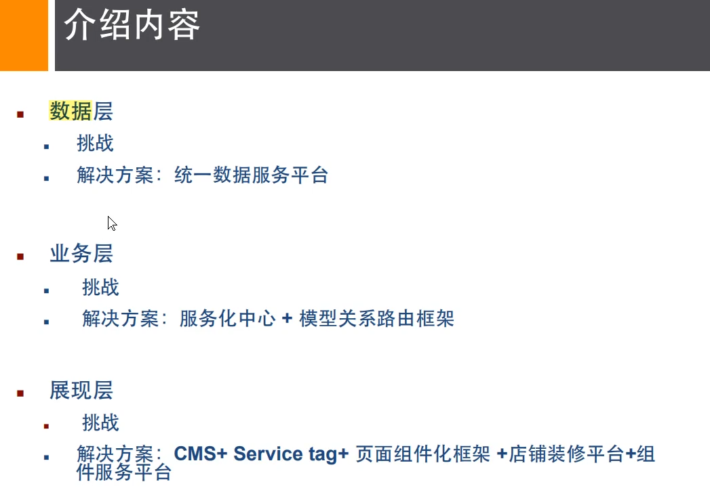
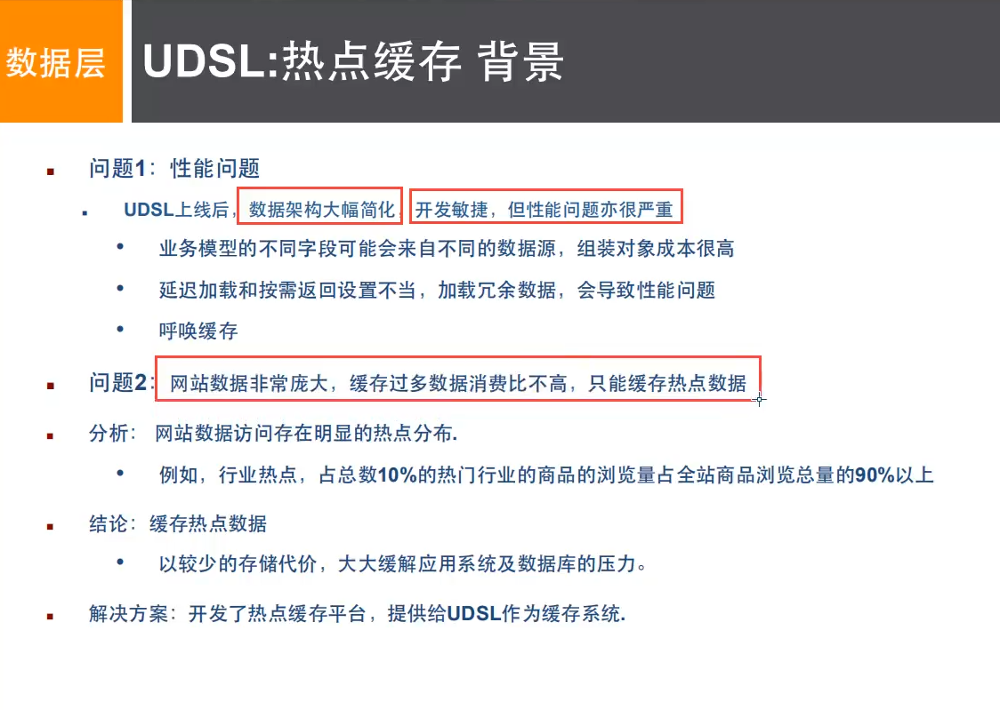
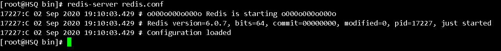
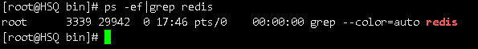
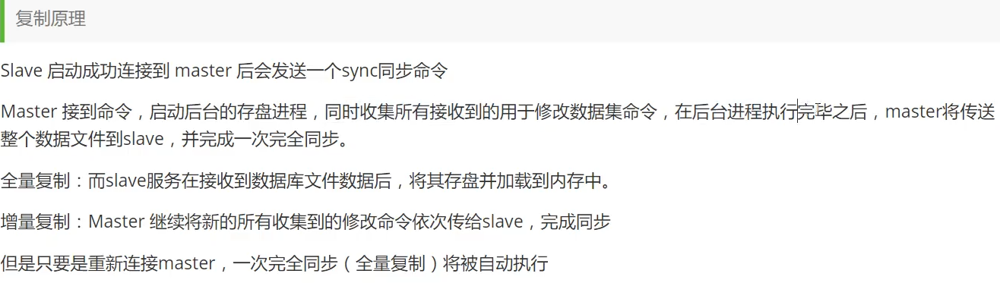
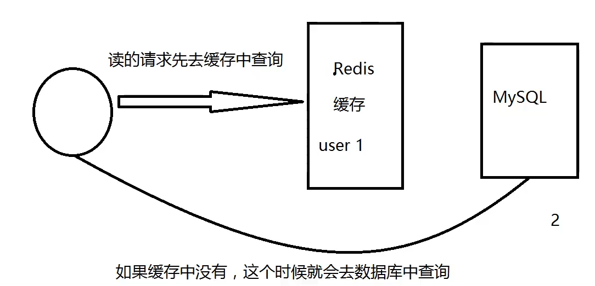

https://www.bilibili.com/video/BV1S54y1R7SB

# 1.Nosql概述

## **单机Mysql时代**

APP-->DAL-->Mysql

90年代，单个数据库足够。那个时候更多的使用静态网站，服务器没有太大压力。

这种情况下，整个网站的瓶颈是什么？

1.数据量太大一台机器放不下了

2.数据的索引（B+Tree)，一个机器内存放不下了

3.访问量（读写混合），一个服务器承受不了

只要有三种情况之一，就必须晋级

## Memcached（缓存）+Mysql+垂直拆分（读写分离）

80%情况都是在读，每次都要去查询数据库的话就十分麻烦，所以使用缓存减轻压力

优化数据库索引和缓存-->文件缓存IO-->Memcached(当时最热的技术)


## 分库分表+水平拆分+Mysql集群

技术和业务发展的同时，对人的要求越来越高了

==本质：数据库（读、写）==

早年MyISAM:表锁，影响效率，高并发下出现严重问题

早年InnoDB：行锁

慢慢的就开始使用分库分表来解决写的压力，Mysql在那个年代退出了表分区，并没有多少公司去使用。Mysql的集群，很好满足了那个年代的所有需求


## 最近的年代

2010-2020十年时间，世界发生了翻天覆地的变化

Mysql等关系型数据库就不够用了，数据量很多，变化很快

mysql有的人使用它存储大的文件，博客，图片，数据库表很大，效率就很低了。如果有一种数据库专门来处理这种数据，mysql压力就变得十分小了（如何处理问题）大数据的IO压力下，表几乎没法更改。

灰度发布目前一个基本互联网项目


## 为什么要用NoSQL

用户的个人信息，社交网络，地理位置。用户自己产生的数据，用户日志等爆发式增长。

这时候我们就需要使用Nosql，Nosql可以很好处理以上情况

什么是Nosql

Not Only SQL不仅仅是SQL

关系型数据库：表格，行，列（POI）

泛指非关系型数据库，随着web2.0互联网诞生，传统的关系型数据库很难对付web2.0时代，尤其是超大规模的高并发的社区。暴露出很多问题NoSQL在当今大数据环境下发展的十分迅速。Redis是发展最快的，而且是我们当下必须要掌握的的一个技术。

很多的数据类型用户个人信息，社交网络，地理位置。这些数据类型的存储不需要一个固定的格式，不需要多余的操作就可以横向扩展了。

Map<String,Object>

## NoSQL特点

1.方便扩展，数据之间没有关系

2.大数据量，高性能（Redis一秒可以写8万次，读取11万次，NoSQL的缓存记录，是一种细粒度的缓存）

3.数据类型是多样型的（不需要事先设计数据库，随取随用，如果是数据量十分大的表，很多人就无法设计了）

4.传统RDBMS和NoSQL

传统的RDBMS

- 结构化组织
- SQL
- 数据和关系都存在单独的表中 row col
- 操作，数据库定义语言
- 严格一致性
- 基础的事务

NoSQL

- 不仅仅是数据没有固定的查询语言
- 键值对存储，列存储，文档存储，图形数据库（社交关系）
- 最终一致性
- CAP定理和BASE  （异地多活）初级架构师    
- 高并发，高可扩，高性能

3V+3高

大数据时代3V：主要是描述问题的

1.海量Volume

2.多样Variety

3.实时Velocity

大数据时代3高：主要是解决问题的

高并发，高可扩（随时水平拆分），高性能（保证用户体验和性能）

实践NoSQL+关系型数据库  一起使用才是最强的

## 阿里巴巴演进分析

这么多的东西，难道都是在一个数据库中的吗




任何一家互联网公司，都不可能只是简简单单让用户能用就好了

大量公司做的都是相同的业务，（竞品协议）

随着这样的竞争，业务是越来越完善，对于开发着的要求也是越来越高


没有什么是加一层是解决不了的

```bash
# 1.商品基本信息
  名称，价格，商家信息
  关系型数据库就可以解决了MySQL/Oracle（淘宝早年就去IOE了-王坚：阿里云的这群疯子
  淘宝内部的MySQL，不是大家用的MySQL
#2.商品描述，评论
   文档型数据库中，MongoDB
#3.图片
	分布式文件系统 FastDFs
	淘宝自己的TFS
	Gooale的GFS
	Hadoop  HDFS
	阿里云 oss
#4商品关键字（搜索）
	搜索引擎 solr elasticsearch
	ISerach:多隆
	所有牛逼的人都有一段苦逼的岁月，但是你只要像SB一样的去坚持，终将牛逼
#5.商品热门的波段信息
	内存数据库
	Redis Tair Memache...
#6.商品的交易，外部的支付接口
	三方应用
```

要知道，一个简单的网页背后的技术一定不是大家所想的那么简单

大型互联网应用问题

- 数据类型太多了
- 数据源太多了
- 经常重构
- 数据要改造，大面积

解决问题





## NoSQL四大分类

### KV键值对

- 新浪 Redis
- 美团Redis+Tair
- 阿里、百度：Redis+memecache

### 文档型数据库（bson格式和json一样）

- MongoDB（一般必须掌握）
  - MongoDB是一个基于分布式文件存储的数据库，C++编写，主要用来处理大量的文档
  - MongoDB是一个介于关系型数据库和非关系型数据库中中间的产品，MongoDB是非关系型数据库中功能最丰富，最像关系型数据库的
- ConthDB

### 列存储数据库

- HBase
- 分布式文件系统

### 图片关系数据库

存关系的，不是存图片的。比如朋友圈社交网络，广告推荐

Neo4j，InfoGird


敬畏之心可以使人进步

## Redis是什么

Redis（==Re==mote ==Di==ctionary ==S==erver )，即远程字典服务，是一个开源的使用ANSI [C语言](https://baike.baidu.com/item/C语言)编写、支持网络、可基于内存亦可持久化的日志型、Key-Value[数据库](https://baike.baidu.com/item/数据库/103728)，并提供多种语言的API。

免费和开源，是当下最热门的NoSQL技术之一，结构化数据库

redis会周期性的把更新的数据写入磁盘或者把修改操作写入追加的记录文件，并且在此基础上实现了master-slave(主从)同步。


### 能干嘛？

1.内存存储，持久化，内存是断电即失，所以说持久化很重要（rdb,aof）

2.效率高，用于高速缓存

3.发布订阅系统

4.地图信息分析

5.计时器，计数器（浏览量）

6.。。。

### 特性

1.多样的数据类型

2.持久化

3.集群

4.事务

。。。。

官网https://redis.io/

中文网http://www.redis.cn/

下载地址：

注意：windows在github上下载（停更很久了）

Redis推荐都是Linux服务器上搭建了

# 2.入门

## windows安装

1.下载安装包https://github.com/microsoftarchive/redis/releases

Redis-x64-3.2.100.zip只有5M

2.解压到环境目录

3.开启redis，双击运行服务即可


4.使用redis客户端连接redis


记住：windows下确实简单，但是推荐使用Linux去开发使用

## linux下安装

1.下载压缩包

`redis-6.0.7.tar.gz`

2.解压安装包

```bash
mv redis-6.0.7.tar.gz /opt
tar -zxvf redis-6.0.7.tar.gz
```

3.进入解压后的文件，可以看到：


4.基本环境安装


```bash
yum install gcc-c++
make      #编译
make install #进行确认
```

5.redis默认安装路径`/usr/local/bin`

宝塔安装路径：

/www/server/redis


6.将配置文件复制到我们安装目录下


redis默认不是后台启动的，修改配置文件


7.启动redis服务

cd /usr/local/bin或者

cd /www/server/redis（宝塔）

```bash
redis-server redis.conf #通过指定的配置文件启动服务
```



8.使用redis-li进行连接测试

```bash
redis-cli -p 6379
```


9.查看redis的进程是否开启


10.如何关闭redis服务呢


11.再次查看进程是否存在



12.后面我们会使用单机多redis启动集群测试

## 测试性能

redis-benchmark是一个压力测试工具

官方自带的性能测试工具

redis-benchmark命令参数

| 序号 | 选项      | 描述                                       | 默认值    |
| :--- | :-------- | :----------------------------------------- | :-------- |
| 1    | **-h**    | 指定服务器主机名                           | 127.0.0.1 |
| 2    | **-p**    | 指定服务器端口                             | 6379      |
| 3    | **-s**    | 指定服务器 socket                          |           |
| 4    | **-c**    | 指定并发连接数                             | 50        |
| 5    | **-n**    | 指定请求数                                 | 10000     |
| 6    | **-d**    | 以字节的形式指定 SET/GET 值的数据大小      | 2         |
| 7    | **-k**    | 1=keep alive 0=reconnect                   | 1         |
| 8    | **-r**    | SET/GET/INCR 使用随机 key, SADD 使用随机值 |           |
| 9    | **-P**    | 通过管道传输 <numreq> 请求                 | 1         |
| 10   | **-q**    | 强制退出 redis。仅显示 query/sec 值        |           |
| 11   | **--csv** | 以 CSV 格式输出                            |           |
| 12   | **-l**    | 生成循环，永久执行测试                     |           |
| 13   | **-t**    | 仅运行以逗号分隔的测试命令列表。           |           |
| 14   | **-I**    | Idle 模式。仅打开 N 个 idle 连接并等待。   |           |

简单测试下

```bash
# 测试100个并发连接 10万请求
redis-benchmark -h localhost -p 6379 -c 100 -n 100000
```

查看这些分析？

例如查看set

**set**

10万个请求


## 基础知识

### 切换数据库select和查看大小DBSIZE

redis默认有16个数据库,默认使用第0个


可以使用select进行切换

```bash
select 3
```


查看数据库大小

```bash
[root@HSQ ~]# redis-cli -p 6379
127.0.0.1:6379> DBSIZE #查看数据库大小
(integer) 4
127.0.0.1:6379> 
```


### 查看所有的键keys *

```bash
127.0.0.1:6379> keys * #查看数据库所有的key
1) "name"
2) "mylist:{tag}"
3) "counter:{tag}:__rand_int__"
4) "myhash:{tag}"
5) "key:{tag}:__rand_int__"
127.0.0.1:6379> 
```

### 清除当前数据库flushdb

```bash
127.0.0.1:6379> flushdb #清除当前数据库
OK
127.0.0.1:6379> keys *
(empty array)
```

### 清除所有数据库flushall

```bash
127.0.0.1:6379> flushall
OK
```


思考：为什么是6379端口号https://www.zhihu.com/question/20084750

### redis是单线程的/redis6支持多线程

redis是很快的，redis是基于内存操作的，CPU不是Ｒｅｄｉｓ性能瓶颈，Ｒｅｄｉｓ性能瓶颈是根据机器的内存和网络带宽，既然可以使用单线程来实现，就使用了单线程

Redis为什么单线程还这么快

Redis是C语言写的，官方提供的数据为100000+的QPS，完全不比Memecache（同样是使用key-value）差

误区：高性能的服务器一定是多线程的？

误区2：多线程一定比单线程效率高（CPU上下文会切换，这是一个耗时的操作）

核心：ｒｅｄｉｓ将所有的数据全部放在内存中的，所以说使用单线程去操作效率就是最高的，对于内存系统来说，如果没有上下文切换效率就是最高的。多次读写都是在一个ｃｐｕ的，所以在内存情况下，这个就是最佳的方案。

# 3.五大数据类型

文档


## Redis-Key

### 是否存在某个key  EXISTS

```bash
EXISTS 键
```


### 移动key到目标数据库

```bash
move 键 目标数据库
```

```bash
127.0.0.1:6379> move name 1
(integer) 1
127.0.0.1:6379> SELECT 1
OK
127.0.0.1:6379[1]> keys *
1) "name"
```

### 获取key对于的value

```bash
get 键
```

```bash
127.0.0.1:6379[1]> get name
"hang"
```

### 过期时间

应用:单点登录

```bash
expire 键 秒数
ttl 键 #查看剩余时间
```

```bash
127.0.0.1:6379[1]> expire name 10
(integer) 1
127.0.0.1:6379[1]> ttl name
(integer) 6
127.0.0.1:6379[1]> ttl name
(integer) 2
127.0.0.1:6379[1]> ttl name
(integer) -2
127.0.0.1:6379[1]> get name
(nil)
```

### 查看类型

```bash
127.0.0.1:6379> type age#查看当前key的类型
string
```

遇到不会的命令,可以查看官网文档

http://www.redis.cn/commands.html

## String

90%的人只会使用String?

```bash
127.0.0.1:6379> set key1 v1#设置值
OK
127.0.0.1:6379> append key1 "hello"
(integer) 7
127.0.0.1:6379> get key1#获得值
"v1hello"
127.0.0.1:6379> append key1 ,hang#追加字符串,若key不存在,就相当于set key
(integer) 12
127.0.0.1:6379> strlen key1#获取字符串长度
(integer) 12
###################################
i++
步长
127.0.0.1:6379> set views 0#初始浏览量为0
OK
127.0.0.1:6379> get views
"0"
127.0.0.1:6379> incr views
(integer) 1
127.0.0.1:6379> get views
"1"
127.0.0.1:6379> incr views#自增1
(integer) 2
127.0.0.1:6379> decr views#自减1
(integer) 1
127.0.0.1:6379> incrby views 10#可以设置步长,指定增量
(integer) 11
127.0.0.1:6379> decrby views 5#可以设置步长,指定减量
(integer) 6
127.0.0.1:6379> 
###################################
字符串范围range
127.0.0.1:6379> set key1 hello,kang
OK
127.0.0.1:6379> getrange key1 0 3#截取字符串[0,3]
"hell"
127.0.0.1:6379> getrange key1 0 -1#获取全部字符串,和get key是一样的
"hello,kang"
####################################
127.0.0.1:6379> set key2 abcdefg
OK
127.0.0.1:6379> get key2
"abcdefg"
127.0.0.1:6379> setrange key2 1 xx#替换指定位置开始的字符串
(integer) 7
127.0.0.1:6379> get key2
"axxdefg"
####################################
# setex(set with expire) 设置过期时间
# setnx(set if not exist)不存在再设置,在分布式锁中会常常使用
127.0.0.1:6379> setex key3 30 hello#设置key3的值为hello,30秒后过期
OK
127.0.0.1:6379> ttl key3
(integer) 25
127.0.0.1:6379> get key3
"hello"
127.0.0.1:6379> setnx mykey redis#如果mykey不存在则创建
(integer) 1
127.0.0.1:6379> keys *
1) "key2"
2) "mykey"
3) "key1"
127.0.0.1:6379> ttl key3
(integer) -2
127.0.0.1:6379> setnx mykey mongodb#如果mykey存在则创建失败
(integer) 0
127.0.0.1:6379> get mykey
"redis"
127.0.0.1:6379> 
####################################
mset #一次设置多个值
mget #获取多个值
127.0.0.1:6379> mset key1 v1 key2 v2 key3 v3#一次设置多个值
OK
127.0.0.1:6379> keys *
1) "key3"
2) "key2"
3) "key1"
127.0.0.1:6379> mget key1 key2 key3#获取多个值
1) "v1"
2) "v2"
3) "v3"
127.0.0.1:6379> msetnx key1 v11 key4 v4#是一个原子性操作,要么一起成功,要么都失败
(integer) 0
127.0.0.1:6379> get key1
"v1"
127.0.0.1:6379> get key4
(nil)
#对象
set user:1{name:zhangsan,age:3}#设置一个user:1对象,值为json字符串,来保存一个对象
#这里的key是一个巧妙的设计:
#user:{id}:{filed},如此设计在redis是完全可以的
127.0.0.1:6379> mset user:1:name zhangsan user:1:age 2
OK
127.0.0.1:6379> mget user:1:name
1) "zhangsan"
127.0.0.1:6379> mget user:1:age
1) "2"
127.0.0.1:6379> mget user:1:name user:1:age
1) "zhangsan"
2) "2"
###############################################
getset#先get,再set
127.0.0.1:6379> getset db redis#如果不存在,则返回nil
(nil)
127.0.0.1:6379> get db
"redis"
127.0.0.1:6379> getset db  mongodb#如果存在值,获取原来的值,并设置新的值
"redis"

```

数据结构是相通的,未来的话,学Jedis

String类型的使用场景:value除了是字符串还可以是数字

- 计数器
- 统计多单位数量

## List

列表


在redis里面,我们可以把list玩成栈\队列\阻塞队列

所有的list命令都是以l开头的,redis命令不区分大小写

```bash
127.0.0.1:6379> lpush list one#将一个值或者多个值插入到列表头部
(integer) 1
127.0.0.1:6379> lpush list two
(integer) 2
127.0.0.1:6379> lpush list three
(integer) 3
127.0.0.1:6379> lrange list 0 -1#获取list的值
1) "three"
2) "two"
3) "one"
127.0.0.1:6379> lrange list 0 1
1) "three"
2) "two"
127.0.0.1:6379> rpush list 4#将一个值或者多个值插入到列表尾部
(integer) 4
127.0.0.1:6379> lrange list 0 -1
1) "three"
2) "two"
3) "one"
4) "4"
###########################
LPOP
RPOP
127.0.0.1:6379> LRANGE list 0 -1
1) "three"
2) "two"
3) "one"
4) "4"
127.0.0.1:6379> LPOP list#移除列表第一个元素
"three"
127.0.0.1:6379> Rpop list#移除列表最后一个元素
"4"
127.0.0.1:6379> LRANGE list 0 -1
1) "two"
2) "one"
###########################
Lindex
127.0.0.1:6379> Lindex list 1
"one"
127.0.0.1:6379> Lindex list 0#通过下标获得某一个值
"two"
###########################
Llen
127.0.0.1:6379> Lpush list one
(integer) 1
127.0.0.1:6379> Lpush list two
(integer) 2
127.0.0.1:6379> Lpush list three
(integer) 3
127.0.0.1:6379> Llen list #返回列表长度
(integer) 3
###########################
移除指定的值
Lrem
127.0.0.1:6379> lpush list three
(integer) 4
127.0.0.1:6379> lrange lisy 0 -1
(empty array)
127.0.0.1:6379> lrange list 0 -1
1) "three"
2) "three"
3) "two"
4) "one"
127.0.0.1:6379> lrem list 1 one#移除list集合中指定个数的value,精确匹配
(integer) 1
127.0.0.1:6379> lrange list 0 -1
1) "three"
2) "three"
3) "two"
127.0.0.1:6379> lrem list 2 three
(integer) 2
127.0.0.1:6379> lrange list 0 -1
1) "two"
127.0.0.1:6379> 
###########################
trim截取
127.0.0.1:6379> rpush mylist hello
(integer) 1
127.0.0.1:6379> rpush mylist hello1
(integer) 2
127.0.0.1:6379> rpush mylist hello2
(integer) 3
127.0.0.1:6379> rpush mylist hello3
(integer) 4
127.0.0.1:6379> ltrim mylist 1 2#通过下标,截取指定的长度,这个list已经被改变了,只剩下截取的元素
OK
127.0.0.1:6379> lrange mylist 0 -1
1) "hello1"
2) "hello2"
###########################
rpoplpush#移除列表的最后一个元素,将他移动到新的列表中
127.0.0.1:6379> rpush mylist hello
(integer) 1
127.0.0.1:6379> rpush mylist hello1
(integer) 2
127.0.0.1:6379> rpush mylist hello2
(integer) 3
127.0.0.1:6379> rpoplpush mylist myotherlist
"hello2"
127.0.0.1:6379> lrange mylist  0 -1#查看原来的列表
1) "hello"
2) "hello1"
127.0.0.1:6379> lrange myotherlist 0 -1#查看目标列表中确实存在该值
1) "hello2"
######################################
Lset#将列表中指定下标的值替换为另外的值,更新操作
127.0.0.1:6379> EXISTS list#判断这个列表是否存在
(integer) 0
127.0.0.1:6379> lset list 0 item#如果不存在列表,我们去更新就会报错
(error) ERR no such key
127.0.0.1:6379> lpush list value1
(integer) 1
127.0.0.1:6379> lrange list 0 0
1) "value1"
127.0.0.1:6379> lset list 0 item#如果存在,更新当前下标的值
OK
127.0.0.1:6379> lrange list 0 0
1) "item"
######################################
Linsert#将某个具体的值插入到列表中某个元素的前面或者后面
127.0.0.1:6379> Rpush mylist hello world
(integer) 2
127.0.0.1:6379> lrange mylist 0 -1
1) "hello"
2) "world"
127.0.0.1:6379> linsert mylist before world other
(integer) 3
127.0.0.1:6379> lrange mylist 0 -1
1) "hello"
2) "other"
3) "world"
127.0.0.1:6379> linsert mylist after world new
(integer) 4
127.0.0.1:6379> lrange mylist 0 -1
1) "hello"
2) "other"
3) "world"
4) "new"

```

小结

- list实际上是一个链表,before,after,left right都可以插入值
- 如果key不存在,创建新的链表
- 如果key存在,新增内容
- 如果移除了所有值,空链表,也代表不存在
- 在两边插入或改动值效率最高.中间元素,相对来说效率会低一点

消息排队,消息队列Lpush Rpop

栈Lpush Lpop

## Set(集合)

set中的值不能重复

```bash
######################################
127.0.0.1:6379> sadd myset hello#set集合中添加元素
(integer) 1
127.0.0.1:6379> sadd myset hang
(integer) 1
127.0.0.1:6379> sadd myset hang2
(integer) 1
127.0.0.1:6379> SMEMBERS myset#查看指定set的所有值
1) "hello"
2) "hang2"
3) "hang"
127.0.0.1:6379> SISMEMBER myset hello#判断某个值是不是在set中
(integer) 1
127.0.0.1:6379> SISMEMBER myset world
(integer) 0 #没有这个值就返回0
######################################
127.0.0.1:6379> scard myset#获取set中元素个数
(integer) 3
127.0.0.1:6379> sadd myset hang2
(integer) 0  #添加重复的值失败，返回0
127.0.0.1:6379> scard myset
(integer) 3
127.0.0.1:6379> 
######################################
127.0.0.1:6379> srem myset hello#移除set中的指定元素
(integer) 1
127.0.0.1:6379> scard myset
(integer) 2
127.0.0.1:6379> SMEMBERS myset
1) "hang2"
2) "hang"
######################################
set 无序不重复集合，抽随机
127.0.0.1:6379> SRANDMEMBER myset#随机抽选出一个元素
"hang"
127.0.0.1:6379> SRANDMEMBER myset
"hang"
127.0.0.1:6379> SRANDMEMBER myset
"hang2"
127.0.0.1:6379> SRANDMEMBER myset 2#随机抽选出指定个数的元素
1) "hang2"
2) "hang"
######################################
删除指定的key，随机删除一个key
127.0.0.1:6379> SMEMBERS myset
1) "hang3"
2) "hang2"
3) "hang5"
4) "hang"
5) "hang4"
127.0.0.1:6379> spop myset#随机删除set集合中一个元素
"hang"
127.0.0.1:6379> SMEMBERS myset
1) "hang2"
2) "hang4"
3) "hang3"
4) "hang5"
######################################
将一个指定的值移动到指定的set集合中
127.0.0.1:6379> sadd myset hello
(integer) 1
127.0.0.1:6379> sadd myset world
(integer) 1
127.0.0.1:6379> sadd myset hang
(integer) 1
127.0.0.1:6379> sadd myset2 set2
(integer) 1
127.0.0.1:6379> smove myset myset2 hang#将一个指定的值移动到指定的set集合中
(integer) 1
127.0.0.1:6379> SMEMBERS myset2
1) "set2"
2) "hang"
######################################
微博，B站，共同关注，交集
数字集合类
  差集
  交集
  并集
127.0.0.1:6379> sadd key1 a
(integer) 1
127.0.0.1:6379> sadd key1 b
(integer) 1
127.0.0.1:6379> sadd key1 c
(integer) 1
127.0.0.1:6379> sadd key2 c
(integer) 1
127.0.0.1:6379> sadd key2 d
(integer) 1
127.0.0.1:6379> sadd key2 e
(integer) 1
127.0.0.1:6379> SDIFF key1 key2#差集
1) "b"
2) "a"
127.0.0.1:6379> SINTER key1 key2#交集，共同好友可以这样实现
1) "c"
127.0.0.1:6379> SUNION key1 key2#并集
1) "c"
2) "e"
3) "b"
4) "a"
5) "d"

```

微博，A用户将所有关注的人放在一个set集合中，将它的粉丝也放在一个集合中

共同关注，二度好友，推荐好友

## Hash（哈希）

Map集合，key-\<key-value>,key-map，这个值是map集合.本质和String没有太大区别，还是一个简单的key-value

hset myhash filed hang

```bash
127.0.0.1:6379> hset myhash filed1 hang #set一个具体的key-value
(integer) 1
127.0.0.1:6379> hget myhash filed1#获取一个值
"hang"
127.0.0.1:6379> hmset myhash filed1 hello field2 world#set多个的key-value
OK
127.0.0.1:6379> hmget myhash filed1  field2#获取多个字段值
1) "hello"
2) "world"
127.0.0.1:6379> hgetall myhash#获取全部数据
1) "filed1"
2) "hello"
3) "field2"
4) "world"
#################################################
127.0.0.1:6379> hdel myhash filed1#删除hash指定的key字段，对应的value也消失了
(integer) 1
127.0.0.1:6379> hgetall myhash
1) "field2"
2) "world"
#################################################
Hlen
127.0.0.1:6379> hmset myhash field1 hello field2 world
OK
127.0.0.1:6379> HGETALL myhash
1) "field2"
2) "world"
3) "field1"
4) "hello"
127.0.0.1:6379> hlen myhash#获取hash表的字段数量
(integer) 2
#################################################
127.0.0.1:6379> HEXISTS myhash field1#判断hash中指定字段是否存在
(integer) 1
127.0.0.1:6379> HEXISTS myhash field3
(integer) 0
#################################################
#获取所有field
#获取所有的value
127.0.0.1:6379> hkeys myhash#获取所有field
1) "field2"
2) "field1"
127.0.0.1:6379> hvals myhash#获取所有的value
1) "world"
2) "hello"
#################################################
incr decr
127.0.0.1:6379> hset myhash field3 5
(integer) 1
127.0.0.1:6379> HINCRBY myhash field3 1#指定增量
(integer) 6
127.0.0.1:6379> HINCRBY myhash field3 -1
(integer) 5
127.0.0.1:6379> hsetnx myhash field4 hello#如果不存在则可以设置
(integer) 1
127.0.0.1:6379> hsetnx myhash field4 world#如果存在则不能设置
(integer) 0

```

hash：变更数据 user name age

尤其是用户信息，经常变动的信息，hash更加适合存储对象，String更适合字符串存储

## Zset（有序集合）

在set的基础上增加了一个值，set key1 v1 zset k1 score1 v1

```bash
127.0.0.1:6379> zadd myset 1 one#添加一个值
(integer) 1
127.0.0.1:6379> zadd myset 2 two 3 three#添加多个值
(integer) 2
127.0.0.1:6379> ZRANGE myset 0 -1#遍历
1) "one"
2) "two"
3) "three"
#################################################
排序如何实现
#ZRANGEBYSCORE key min max
127.0.0.1:6379> zadd salary 2500 xiaohong#添加三个用户
(integer) 1
127.0.0.1:6379> zadd salary 5000 zhangsan
(integer) 1
127.0.0.1:6379> zadd salary 500 kuang
(integer) 1
127.0.0.1:6379> ZRANGEBYSCORE salary -inf +inf#从小到大排序，不显示成绩
1) "kuang"
2) "xiaohong"
3) "zhangsan"
127.0.0.1:6379> ZRANGEBYSCORE salary -inf 2500 withscores#返回带成绩的，且小于2500的
1) "kuang"
2) "500"
3) "xiaohong"
4) "2500"
127.0.0.1:6379> ZREVRANGE salary 0 -1#从大到小排序
1) "zhangsan"
2) "kuang"
#################################################
移除元素
zrem
127.0.0.1:6379> ZRANGE salary 0 -1
1) "kuang"
2) "xiaohong"
3) "zhangsan"
127.0.0.1:6379> zrem salary xiaohong#移除有序集合中的指定元素
(integer) 1
127.0.0.1:6379> ZRANGE salary 0 -1
1) "kuang"
2) "zhangsan"
127.0.0.1:6379> ZCARD salary#获取有序集合中的个数
(integer) 2
#################################################
127.0.0.1:6379> zadd myset 1 hello
(integer) 1
127.0.0.1:6379> zadd myset 2 world 3 hang
(integer) 2
127.0.0.1:6379> zcount myset 1 3#获取指定区间的元素数量
(integer) 3
127.0.0.1:6379> zcount myset 1 2
(integer) 2

```

其余的API，通过学习，剩下的如果工作中有需要，可以去查看官方文档

set  排序  存储排序班级成绩表，工资表排序

普通消息1 重要消息2 带权重进行

排行榜应用实现

# 4.三种特殊数据类型

## geospatial地理位置

朋友的定位，附近的人，打车距离计算

Redis的Geo在redis3.2版本就推出了,可以推算出地理位置信息，两地之间的距离，方圆几里的人

可以查询一些测试数据http://www.jsons.cn/lngcode/

只有6个命令

### geoadd添加地理位置

添加地理位置

```bash
#geoadd添加地理位置
#规则：地球两极无法添加，我们一般会下载城市数据，直接通过java程序一次性导入
#参数 key 值（经度 纬度 名称） 不能瞎写，超出范围会报错
#经度 -180到180
#纬度 -85.05112878到85.05112878
127.0.0.1:6379> geoadd china:city  116.40 39.90 beijing
(integer) 1
127.0.0.1:6379> geoadd china:city  121.47 31.23 shanghai
(integer) 1
127.0.0.1:6379> geoadd china:city  160.50 29.53 chongqin  114.08  22.55 shenzhen
(integer) 2
127.0.0.1:6379> geoadd china:city 30.29 120.15  shangzhou 108.96  34.26 xian
(integer) 2

```

## geopos获得当前定位

```bash
#获得当前定位
127.0.0.1:6379> GEOPOS china:city beijing#获取指定城市的纬度和经度
1) 1) "116.39999896287918091"
   2) "39.90000009167092543"
127.0.0.1:6379> GEOPOS china:city beijing chongqin
1) 1) "116.39999896287918091"
   2) "39.90000009167092543"
2) 1) "160.49999982118606567"
   2) "29.52999957900659211"
```

## geodist查看直线距离

距离

单位：

- m
- km
- mi英里
- ft英寸

```bash
127.0.0.1:6379> GEODIST china:city beijing shanghai km#查看北京到上海的距离
"1067.3788"
127.0.0.1:6379> GEODIST china:city beijing chongqin km
"4148.3285"

```

### georadius以给定的经度纬度为中心，找某一半径元素

附近的人？通过半径来查询

```bash
127.0.0.1:6379> georadius china:city 110 30 2000 km#获取110 30为中心寻找方圆2000 km内的城市，前提：所有的数据应该都录入
1) "xian"
2) "shenzhen"
3) "shangzhou"
4) "shanghai"
5) "beijing"
127.0.0.1:6379> georadius china:city 110 30 500 km
1) "xian"
127.0.0.1:6379> georadius china:city 110 30 500 km withdist#显示到中心位置的距离
1) 1) "xian"
   2) "483.8340"
127.0.0.1:6379> georadius china:city 110 30 500 km withcoord#显示经度纬度
1) 1) "xian"
   2) 1) "108.96000176668167114"
      2) "34.25999964418929977"
127.0.0.1:6379> georadius china:city 110 30 500 km withdist withcoord count 1#筛选个数
1) 1) "xian"
   2) "483.8340"
   3) 1) "108.96000176668167114"
      2) "34.25999964418929977"

```

## GEORADIUSBYMEMBER指定元素周围的其他元素

```bash
127.0.0.1:6379> GEORADIUSBYMEMBER china:city beijing 1000 km
1) "beijing"
2) "xian"
127.0.0.1:6379> GEORADIUSBYMEMBER china:city shanghai 4000 km
1) "xian"
2) "shenzhen"
3) "shangzhou"
4) "shanghai"
5) "beijing"
6) "chongqin"
```

## geohash返回元素的hash

该命令返回11个字符的Geohash字符串

```bash
#将二维的经度度转化为一维的字符串，如果两个字符串越接近，距离越接近
127.0.0.1:6379> geohash china:city beijing chongqin
1) "wx4fbxxfke0"
2) "xt4purb89n0"
```

GEO底层原理：Zset

可以使用Zset命令来操作geo

```bash
127.0.0.1:6379> ZRANGE china:city 0 -1#查看地图中全部元素
1) "xian"
2) "shenzhen"
3) "shangzhou"
4) "shanghai"
5) "beijing"
6) "chongqin"
127.0.0.1:6379> zrem china:city beijing#移除指定元素
(integer) 1
127.0.0.1:6379> ZRANGE china:city 0 -1
1) "xian"
2) "shenzhen"
3) "shangzhou"
4) "shanghai"
5) "chongqin"
```

## Hyperloglog

### 什么是基数

A{1，3，5，7，8，7}

B{1，3，5，7，8}

基数（不重复的元素）=5，可以接受无参

### 简介

redis2.8.9就有了hyperloglog

基数统计的算法

网页的UV（一个人访问一个网站多次，但是还是算作一个人）

传统的方式，set保存用户的id，然后就可以统计set中的元素数量作为标准判断

这个方式如果保存大量的用户id,就会比较麻烦，我们的目的是为了计数，而不是保存用户id

优点：

占用的内存是固定的，2^64不用的元素的技术，只需要12KB内存，如果要从内存角度来比较的话Hyperloglog首选

0.81%错误率，统计UV任务，可以忽略不记的

测试使用：

```bash
127.0.0.1:6379> PFadd mykey a b c d e f g h i j#创建第一组Hyperloglog元素
(integer) 1
127.0.0.1:6379> PFCOUNT mykey#统计元素基数数量
(integer) 10
127.0.0.1:6379> pfadd mykey2 i j z x c v b n m#创建第二组
(integer) 1
127.0.0.1:6379> PFCOUNT mykey2#统计元素基数数量
(integer) 9
127.0.0.1:6379> PFMERGE mykey3 mykey mykey2#合并两组到mykey3
OK
127.0.0.1:6379> PFCOUNT mykey3#统计元素基数数量
(integer) 15
```

如果允许容错，那么就一定可以使用Hyperloglog

不允许容错，就使用set或自己的数据结构

## bitmaps

### 位存储

0 1 0 1 0

统计用户信息。登录 未登录 打卡 两个状态的，都可以使用bitmaps

bitmaps位图，数据结构，都是操作二进制来进行记录，就只有0和1两个状态

**测试**


使用bitmaps记录周一到周日的打卡

```bash
127.0.0.1:6379> setbit sign 0 1
(integer) 0
127.0.0.1:6379> setbit sign 1 0
(integer) 0
127.0.0.1:6379> setbit sign 2 0
(integer) 0
127.0.0.1:6379> setbit sign 3 1
(integer) 0
127.0.0.1:6379> setbit sign 4 1
(integer) 0
127.0.0.1:6379> setbit sign 5 0
(integer) 0
127.0.0.1:6379> setbit sign 6 0
(integer) 0
127.0.0.1:6379> getbit sign 3#查看某一天是否有打开
(integer) 1
127.0.0.1:6379> getbit sign 6
(integer) 0
#统计打卡的天数
127.0.0.1:6379> bitcount sign#统计全部记录
(integer) 3

```

# 事务

mysql  ACID

要么同时成功，要么同时失败，原子性

==redis单条命令是保证原子性的，但是事务不保证原子性==

==redis事务没有隔离级别的概念==

所有的命令在事务中并没有被直接执行，只有在发起执行命令的时候才会执行，Exec

redis事务本质：一组命令的集合，一个事务中的所有命令都会被序列化，在事务执行过程中会按照顺序执行，**一次性，顺序性,排他性**

```bash
----全部执行
set
set
set
----
```

- 开启事务Multi
- 命令入队 ...
- 执行事务exec

锁：redis可以实现乐观锁

**正常执行事务**

```bash
127.0.0.1:6379> MULTI #开启事务
OK
127.0.0.1:6379> set key1 v1#命令入队
QUEUED
127.0.0.1:6379> set key2 v2#命令入队
QUEUED
127.0.0.1:6379> get key2#命令入队
QUEUED
127.0.0.1:6379> set key3 v3#命令入队
QUEUED
127.0.0.1:6379> exec#执行事务
1) OK
2) OK
3) "v2"
4) OK

```

**放弃事务**

```bash
127.0.0.1:6379> MULTI#开启事务
OK
127.0.0.1:6379> set k1 v1
QUEUED
127.0.0.1:6379> set k2 v2
QUEUED
127.0.0.1:6379> set k4 v4
QUEUED
127.0.0.1:6379> discard#取消事务
OK
127.0.0.1:6379> get k4#事务队列中的魅力都没有执行
(nil)

```

编译型异常，事务中所有的命令都不会被执行

```bash
127.0.0.1:6379> MULTI
OK
127.0.0.1:6379> set k1 v1
QUEUED
127.0.0.1:6379> set k2 v2
QUEUED
127.0.0.1:6379> set k3 v3
QUEUED
127.0.0.1:6379> getset k3#错误的命令
(error) ERR wrong number of arguments for 'getset' command
127.0.0.1:6379> set k4 v4
QUEUED
127.0.0.1:6379> set k5 v5
QUEUED
127.0.0.1:6379> exec#执行事务也是报错
(error) EXECABORT Transaction discarded because of previous errors.
127.0.0.1:6379> get k1#所有的命令都不会被执行
(nil)

```


运行时异常，如果队列中存在，那么执行命令的时候，其他命令可以执行，错误命令会抛异常

```bash
127.0.0.1:6379> MULTI
OK
127.0.0.1:6379> INCR k1
QUEUED
127.0.0.1:6379> set k1 v1
QUEUED
127.0.0.1:6379> incr k1#运行会出异常
QUEUED
127.0.0.1:6379> set k2 v2
QUEUED
127.0.0.1:6379> set k3 v3
QUEUED
127.0.0.1:6379> get k3
QUEUED
127.0.0.1:6379> exec
1) (integer) 1
2) OK
3) (error) ERR value is not an integer or out of range
4) OK#依旧正常执行成功了
5) OK
6) "v3"
127.0.0.1:6379> get k2
"v2"

```

### 监控watch

**悲观锁**：很悲观，认为什么时候都会出问题，无论做什么都会加锁

**乐观锁**：很乐观，认为什么时候都不会出问题，所以不会上锁，更新数据的时候判断一下，再次期间，是否有人修改过这个数据

- 获取version
- 更新的时候比较version

**redis的监视测试**

正常执行成功

```bash
127.0.0.1:6379> set money 100
OK
127.0.0.1:6379> set out 0
OK
127.0.0.1:6379> watch money #监视money对象
OK
127.0.0.1:6379> MULTI#事务正常结束，数据期间没有发生变动，正常执行成功
OK
127.0.0.1:6379> DECRBY money 20
QUEUED
127.0.0.1:6379> INCRBY out 20
QUEUED
127.0.0.1:6379> exec
1) (integer) 80
2) (integer) 20

```


测试多线程修改值，监视失败，相对于乐观锁

```bash
127.0.0.1:6379> watch money#监视
OK
127.0.0.1:6379> MULTI
OK
127.0.0.1:6379> DECRBY money 10
QUEUED
127.0.0.1:6379> INCRBY out 10
QUEUED
127.0.0.1:6379> exec#执行之前，另外一个线程修改了，导致事务执行失败
(nil)

127.0.0.1:6379> UNWATCH#如果事务执行失败，就放弃监视
OK
127.0.0.1:6379> watch money#再去监视
OK
。。。。
127.0.0.1:6379> exec#比对监视的值，没有变换，就执行成功，反之失败
```


# Jedis

使用Java操作Redis

## 是什么

是redis官方推荐的Java连接开发工具，使用Java操作redis中间件。

## 使用

1. 导入依赖

```xml
<dependency>
    <groupId>redis.clients</groupId>
    <artifactId>jedis</artifactId>
    <version>3.3.0</version>
</dependency>
<dependency>
    <groupId>com.alibaba</groupId>
    <artifactId>fastjson</artifactId>
    <version>1.2.62</version>
</dependency>
```

2. 编码测试
   - 连接数据库
   - 操作命令
   - 断开连接

```java
import redis.clients.jedis.Jedis;

public class TestPing {
    public static void main(String[] args) {
        //1.new一个jedis对象
        Jedis jedis = new Jedis("127.0.0.1",6379);
        //jedis 所有的命令就是之前学的所有指令,一个个的方法
        System.out.println(jedis.ping());//PONG

    }
}
```


```java
public class TestPassword {
    public static void main(String[] args) {
        Jedis jedis = new Jedis("127.0.0.1", 6379);

        //验证密码，如果没有设置密码这段代码省略
//        jedis.auth("password");

        jedis.connect(); //连接
        jedis.disconnect(); //断开连接

        jedis.flushAll(); //清空所有的key
    }
}
```


## 常用API

所有的API都是上面学的对应的指令

### key

```java
public class TestKey {
    public static void main(String[] args) {
        Jedis jedis = new Jedis("127.0.0.1", 6379);

        System.out.println("清空数据："+jedis.flushDB());
        System.out.println("判断某个键是否存在："+jedis.exists("username"));
        System.out.println("新增<'username','kuangshen'>的键值对："+jedis.set("username", "kuangshen"));
        System.out.println("新增<'password','password'>的键值对："+jedis.set("password", "password"));
        System.out.print("系统中所有的键如下：");
        Set<String> keys = jedis.keys("*");
        System.out.println(keys);
        System.out.println("删除键password:"+jedis.del("password"));
        System.out.println("判断键password是否存在："+jedis.exists("password"));
        System.out.println("查看键username所存储的值的类型："+jedis.type("username"));
        System.out.println("随机返回key空间的一个："+jedis.randomKey());
        System.out.println("重命名key："+jedis.rename("username","name"));
        System.out.println("取出改后的name："+jedis.get("name"));
        System.out.println("按索引查询："+jedis.select(0));
        System.out.println("删除当前选择数据库中的所有key："+jedis.flushDB());
        System.out.println("返回当前数据库中key的数目："+jedis.dbSize());
        System.out.println("删除所有数据库中的所有key："+jedis.flushAll());
    }
}
```

结果：

```java
清空数据：OK
判断某个键是否存在：false
新增<'username','kuangshen'>的键值对：OK
新增<'password','password'>的键值对：OK
系统中所有的键如下：[password, username]
删除键password:1
判断键password是否存在：false
查看键username所存储的值的类型：string
随机返回key空间的一个：username
重命名key：OK
取出改后的name：kuangshen
按索引查询：OK
删除当前选择数据库中的所有key：OK
返回当前数据库中key的数目：0
删除所有数据库中的所有key：OK
```

### String

```java
public class TestString {
    public static void main(String[] args) {
        Jedis jedis = new Jedis("127.0.0.1", 6379);

        jedis.flushDB();
        System.out.println("===========增加数据===========");
        System.out.println(jedis.set("key1","value1"));
        System.out.println(jedis.set("key2","value2"));
        System.out.println(jedis.set("key3", "value3"));
        System.out.println("删除键key2:"+jedis.del("key2"));
        System.out.println("获取键key2:"+jedis.get("key2"));
        System.out.println("修改key1:"+jedis.set("key1", "value1Changed"));
        System.out.println("获取key1的值："+jedis.get("key1"));
        System.out.println("在key3后面加入值："+jedis.append("key3", "End"));
        System.out.println("key3的值："+jedis.get("key3"));
        System.out.println("增加多个键值对："+jedis.mset("key01","value01","key02","value02","key03","value03"));
        System.out.println("获取多个键值对："+jedis.mget("key01","key02","key03"));
        System.out.println("获取多个键值对："+jedis.mget("key01","key02","key03","key04"));
        System.out.println("删除多个键值对："+jedis.del("key01","key02"));
        System.out.println("获取多个键值对："+jedis.mget("key01","key02","key03"));

        jedis.flushDB();
        System.out.println("===========新增键值对防止覆盖原先值==============");
        System.out.println(jedis.setnx("key1", "value1"));
        System.out.println(jedis.setnx("key2", "value2"));
        System.out.println(jedis.setnx("key2", "value2-new"));
        System.out.println(jedis.get("key1"));
        System.out.println(jedis.get("key2"));

        System.out.println("===========新增键值对并设置有效时间=============");
        System.out.println(jedis.setex("key3", 2, "value3"));
        System.out.println(jedis.get("key3"));
        try {
            TimeUnit.SECONDS.sleep(3);
        } catch (InterruptedException e) {
            e.printStackTrace();
        }
        System.out.println(jedis.get("key3"));

        System.out.println("===========获取原值，更新为新值==========");
        System.out.println(jedis.getSet("key2", "key2GetSet"));
        System.out.println(jedis.get("key2"));

        System.out.println("获得key2的值的字串："+jedis.getrange("key2", 2, 4));
    }
}
```

结果：

```
===========增加数据===========
OK
OK
OK
删除键key2:1
获取键key2:null
修改key1:OK
获取key1的值：value1Changed
在key3后面加入值：9
key3的值：value3End
增加多个键值对：OK
获取多个键值对：[value01, value02, value03]
获取多个键值对：[value01, value02, value03, null]
删除多个键值对：2
获取多个键值对：[null, null, value03]
===========新增键值对防止覆盖原先值==============
1
1
0
value1
value2
===========新增键值对并设置有效时间=============
OK
value3
null
===========获取原值，更新为新值==========
value2
key2GetSet
获得key2的值的字串：y2G
```

### List

```java

import redis.clients.jedis.Jedis;

public class TestList {
    public static void main(String[] args) {
        Jedis jedis = new Jedis("127.0.0.1", 6379);
        jedis.flushDB();
        System.out.println("===========添加一个list===========");
        jedis.lpush("collections", "ArrayList", "Vector", "Stack", "HashMap", "WeakHashMap", "LinkedHashMap");
        jedis.lpush("collections", "HashSet");
        jedis.lpush("collections", "TreeSet");
        jedis.lpush("collections", "TreeMap");
        System.out.println("collections的内容："+jedis.lrange("collections", 0, -1));//-1代表倒数第一个元素，-2代表倒数第二个元素,end为-1表示查询全部
        System.out.println("collections区间0-3的元素："+jedis.lrange("collections",0,3));
        System.out.println("===============================");
        // 删除列表指定的值 ，第二个参数为删除的个数（有重复时），后add进去的值先被删，类似于出栈
        System.out.println("删除指定元素个数："+jedis.lrem("collections", 2, "HashMap"));
        System.out.println("collections的内容："+jedis.lrange("collections", 0, -1));
        System.out.println("删除下表0-3区间之外的元素："+jedis.ltrim("collections", 0, 3));
        System.out.println("collections的内容："+jedis.lrange("collections", 0, -1));
        System.out.println("collections列表出栈（左端）："+jedis.lpop("collections"));
        System.out.println("collections的内容："+jedis.lrange("collections", 0, -1));
        System.out.println("collections添加元素，从列表右端，与lpush相对应："+jedis.rpush("collections", "EnumMap"));
        System.out.println("collections的内容："+jedis.lrange("collections", 0, -1));
        System.out.println("collections列表出栈（右端）："+jedis.rpop("collections"));
        System.out.println("collections的内容："+jedis.lrange("collections", 0, -1));
        System.out.println("修改collections指定下标1的内容："+jedis.lset("collections", 1, "LinkedArrayList"));
        System.out.println("collections的内容："+jedis.lrange("collections", 0, -1));
        System.out.println("===============================");
        System.out.println("collections的长度："+jedis.llen("collections"));
        System.out.println("获取collections下标为2的元素："+jedis.lindex("collections", 2));
        System.out.println("===============================");
        jedis.lpush("sortedList", "3","6","2","0","7","4");
        System.out.println("sortedList排序前："+jedis.lrange("sortedList", 0, -1));
        System.out.println(jedis.sort("sortedList"));
        System.out.println("sortedList排序后："+jedis.lrange("sortedList", 0, -1));
    }
}

```

结果：

```
===========添加一个list===========
collections的内容：[TreeMap, TreeSet, HashSet, LinkedHashMap, WeakHashMap, HashMap, Stack, Vector, ArrayList]
collections区间0-3的元素：[TreeMap, TreeSet, HashSet, LinkedHashMap]
===============================
删除指定元素个数：1
collections的内容：[TreeMap, TreeSet, HashSet, LinkedHashMap, WeakHashMap, Stack, Vector, ArrayList]
删除下表0-3区间之外的元素：OK
collections的内容：[TreeMap, TreeSet, HashSet, LinkedHashMap]
collections列表出栈（左端）：TreeMap
collections的内容：[TreeSet, HashSet, LinkedHashMap]
collections添加元素，从列表右端，与lpush相对应：4
collections的内容：[TreeSet, HashSet, LinkedHashMap, EnumMap]
collections列表出栈（右端）：EnumMap
collections的内容：[TreeSet, HashSet, LinkedHashMap]
修改collections指定下标1的内容：OK
collections的内容：[TreeSet, LinkedArrayList, LinkedHashMap]
===============================
collections的长度：3
获取collections下标为2的元素：LinkedHashMap
===============================
sortedList排序前：[4, 7, 0, 2, 6, 3]
[0, 2, 3, 4, 6, 7]
sortedList排序后：[4, 7, 0, 2, 6, 3]
```

### Set

```java
    public static void main(String[] args) {
        Jedis jedis = new Jedis("127.0.0.1", 6379);
        jedis.flushDB();
        System.out.println("============向集合中添加元素（不重复）============");
        System.out.println(jedis.sadd("eleSet", "e1","e2","e4","e3","e0","e8","e7","e5"));
        System.out.println(jedis.sadd("eleSet", "e6"));
        System.out.println(jedis.sadd("eleSet", "e6"));
        System.out.println("eleSet的所有元素为："+jedis.smembers("eleSet"));
        System.out.println("删除一个元素e0："+jedis.srem("eleSet", "e0"));
        System.out.println("eleSet的所有元素为："+jedis.smembers("eleSet"));
        System.out.println("删除两个元素e7和e6："+jedis.srem("eleSet", "e7","e6"));
        System.out.println("eleSet的所有元素为："+jedis.smembers("eleSet"));
        System.out.println("随机的移除集合中的一个元素："+jedis.spop("eleSet"));
        System.out.println("随机的移除集合中的一个元素："+jedis.spop("eleSet"));
        System.out.println("eleSet的所有元素为："+jedis.smembers("eleSet"));
        System.out.println("eleSet中包含元素的个数："+jedis.scard("eleSet"));
        System.out.println("e3是否在eleSet中："+jedis.sismember("eleSet", "e3"));
        System.out.println("e1是否在eleSet中："+jedis.sismember("eleSet", "e1"));
        System.out.println("e1是否在eleSet中："+jedis.sismember("eleSet", "e5"));
        System.out.println("=================================");
        System.out.println(jedis.sadd("eleSet1", "e1","e2","e4","e3","e0","e8","e7","e5"));
        System.out.println(jedis.sadd("eleSet2", "e1","e2","e4","e3","e0","e8"));
        System.out.println("将eleSet1中删除e1并存入eleSet3中："+jedis.smove("eleSet1", "eleSet3", "e1"));//移到集合元素
        System.out.println("将eleSet1中删除e2并存入eleSet3中："+jedis.smove("eleSet1", "eleSet3", "e2"));
        System.out.println("eleSet1中的元素："+jedis.smembers("eleSet1"));
        System.out.println("eleSet3中的元素："+jedis.smembers("eleSet3"));
        System.out.println("============集合运算=================");
        System.out.println("eleSet1中的元素："+jedis.smembers("eleSet1"));
        System.out.println("eleSet2中的元素："+jedis.smembers("eleSet2"));
        System.out.println("eleSet1和eleSet2的交集:"+jedis.sinter("eleSet1","eleSet2"));
        System.out.println("eleSet1和eleSet2的并集:"+jedis.sunion("eleSet1","eleSet2"));
        System.out.println("eleSet1和eleSet2的差集:"+jedis.sdiff("eleSet1","eleSet2"));//eleSet1中有，eleSet2中没有
        jedis.sinterstore("eleSet4","eleSet1","eleSet2");//求交集并将交集保存到dstkey的集合
        System.out.println("eleSet4中的元素："+jedis.smembers("eleSet4"));
    }
```

结果：

```
============向集合中添加元素（不重复）============
8
1
0
eleSet的所有元素为：[e3, e7, e2, e8, e0, e1, e4, e6, e5]
删除一个元素e0：1
eleSet的所有元素为：[e2, e8, e1, e4, e7, e6, e5, e3]
删除两个元素e7和e6：2
eleSet的所有元素为：[e1, e4, e2, e8, e5, e3]
随机的移除集合中的一个元素：e4
随机的移除集合中的一个元素：e1
eleSet的所有元素为：[e2, e8, e5, e3]
eleSet中包含元素的个数：4
e3是否在eleSet中：true
e1是否在eleSet中：false
e1是否在eleSet中：true
=================================
8
6
将eleSet1中删除e1并存入eleSet3中：1
将eleSet1中删除e2并存入eleSet3中：1
eleSet1中的元素：[e5, e3, e7, e8, e0, e4]
eleSet3中的元素：[e2, e1]
============集合运算=================
eleSet1中的元素：[e5, e3, e7, e8, e0, e4]
eleSet2中的元素：[e1, e3, e4, e2, e8, e0]
eleSet1和eleSet2的交集:[e3, e4, e8, e0]
eleSet1和eleSet2的并集:[e3, e7, e2, e8, e0, e1, e4, e5]
eleSet1和eleSet2的差集:[e5, e7]
eleSet4中的元素：[e0, e8, e4, e3]
```

### Hash

```java

import redis.clients.jedis.Jedis;

import java.util.HashMap;
import java.util.Map;

public class TestHash {
    public static void main(String[] args) {
        Jedis jedis = new Jedis("127.0.0.1", 6379);
        jedis.flushDB();
        Map<String,String> map = new HashMap<String,String>();
        map.put("key1","value1");
        map.put("key2","value2");
        map.put("key3","value3");
        map.put("key4","value4");
        //添加名称为hash（key）的hash元素
        jedis.hmset("hash",map);
        //向名称为hash的hash中添加key为key5，value为value5元素
        jedis.hset("hash", "key5", "value5");
        System.out.println("散列hash的所有键值对为："+jedis.hgetAll("hash"));//return Map<String,String>
        System.out.println("散列hash的所有键为："+jedis.hkeys("hash"));//return Set<String>
        System.out.println("散列hash的所有值为："+jedis.hvals("hash"));//return List<String>
        System.out.println("将key6保存的值加上一个整数，如果key6不存在则添加key6："+jedis.hincrBy("hash", "key6", 6));
        System.out.println("散列hash的所有键值对为："+jedis.hgetAll("hash"));
        System.out.println("将key6保存的值加上一个整数，如果key6不存在则添加key6："+jedis.hincrBy("hash", "key6", 3));
        System.out.println("散列hash的所有键值对为："+jedis.hgetAll("hash"));
        System.out.println("删除一个或者多个键值对："+jedis.hdel("hash", "key2"));
        System.out.println("散列hash的所有键值对为："+jedis.hgetAll("hash"));
        System.out.println("散列hash中键值对的个数："+jedis.hlen("hash"));
        System.out.println("判断hash中是否存在key2："+jedis.hexists("hash","key2"));
        System.out.println("判断hash中是否存在key3："+jedis.hexists("hash","key3"));
        System.out.println("获取hash中的值："+jedis.hmget("hash","key3"));
        System.out.println("获取hash中的值："+jedis.hmget("hash","key3","key4"));
    }
}

```

结果：

```
散列hash的所有键值对为：{key1=value1, key2=value2, key5=value5, key3=value3, key4=value4}
散列hash的所有键为：[key1, key2, key5, key3, key4]
散列hash的所有值为：[value3, value4, value1, value2, value5]
将key6保存的值加上一个整数，如果key6不存在则添加key6：6
散列hash的所有键值对为：{key1=value1, key2=value2, key5=value5, key6=6, key3=value3, key4=value4}
将key6保存的值加上一个整数，如果key6不存在则添加key6：9
散列hash的所有键值对为：{key1=value1, key2=value2, key5=value5, key6=9, key3=value3, key4=value4}
删除一个或者多个键值对：1
散列hash的所有键值对为：{key1=value1, key5=value5, key6=9, key3=value3, key4=value4}
散列hash中键值对的个数：5
判断hash中是否存在key2：false
判断hash中是否存在key3：true
获取hash中的值：[value3]
获取hash中的值：[value3, value4]
```

## 事务

```java
import com.alibaba.fastjson.JSONObject;
import redis.clients.jedis.Jedis;
import redis.clients.jedis.Transaction;

public class TestMulti {
    public static void main(String[] args) {
        //创建客户端连接服务端，redis服务端需要被开启
        Jedis jedis = new Jedis("127.0.0.1", 6379);
        jedis.flushDB();

        JSONObject jsonObject = new JSONObject();
        jsonObject.put("hello", "world");
        jsonObject.put("name", "java");

        //开启事务
        Transaction multi = jedis.multi();
        String result = jsonObject.toJSONString();
        //jedis.watch(result)
        try{
            //向redis存入一条数据
            multi.set("json", result);
            //再存入一条数据
            multi.set("json2", result);
            //这里引发了异常，用0作为被除数
//            int i = 100/0;
            //如果没有引发异常，执行进入队列的命令
            multi.exec();
        }catch(Exception e){
            e.printStackTrace();
            //如果出现异常，回滚
            multi.discard();
        }finally{
            System.out.println(jedis.get("json"));
            System.out.println(jedis.get("json2"));

            jedis.close(); //最终关闭客户端
        }
    }
}

```

正常执行：

```
{"name":"java","hello":"world"}
{"name":"java","hello":"world"}
```

事务执行失败：

```
java.lang.ArithmeticException: / by zero
	at com.kuang.TestMulti.main(TestMulti.java:26)
null
null
```

# SpringBoot整合Redis

springboot操作数据：spring-data jpa jdbc mongodb redis

spring-data是和springboot齐名的项目

新建springboot项目

勾选


说明：

在springboot2.x之后，原来使用的jedis被替换了lettuce

jedis:底层采用的是直连，多线程操作不安全，避免不安全，使用jedis pool连接池，更像BIO

lettuce:底层采用netty，实例可以在多个线程中进行共享，不存在线程不安全的情况，可以减少线程数量，更像NIO


源码分析：

```properties
# springboot所有的配置类都有一个自动配置类，RedisAutoConfiguration
# 自动配置类都会绑定一个配置文件 RedisProperties
```

RedisAutoConfiguration类：

```java
@Configuration(proxyBeanMethods = false)
@ConditionalOnClass(RedisOperations.class)
@EnableConfigurationProperties(RedisProperties.class)
@Import({ LettuceConnectionConfiguration.class, JedisConnectionConfiguration.class })
public class RedisAutoConfiguration {

	@Bean
	@ConditionalOnMissingBean(name = "redisTemplate")
    //可以自定义一个RedisTemplate来替换这个默认的
	public RedisTemplate<Object, Object> redisTemplate(RedisConnectionFactory redisConnectionFactory)
			throws UnknownHostException {
        //默认的RedisTemplate没有过多的设置，redis对象保存都是需要序列化
        //两个泛型都是Object，我们后面使用需要强制转换<String, Object>
		RedisTemplate<Object, Object> template = new RedisTemplate<>();
		template.setConnectionFactory(redisConnectionFactory);
		return template;
	}

	@Bean
	@ConditionalOnMissingBean
    //String是redis中最常用的类型，所以单独提出来了一个bean
	public StringRedisTemplate stringRedisTemplate(RedisConnectionFactory redisConnectionFactory)
			throws UnknownHostException {
		StringRedisTemplate template = new StringRedisTemplate();
		template.setConnectionFactory(redisConnectionFactory);
		return template;
	}

}

```

1. 导入依赖

```xml
<dependency>
    <groupId>org.springframework.boot</groupId>
    <artifactId>spring-boot-starter-data-redis</artifactId>
</dependency>
```


2. 配置连接

```properties
#配置redis
#下面这两条是默认的，可以不用写，改成远程的需要写
spring.redis.host=127.0.0.1
spring.redis.port=6379
```

3.测试

```java

@SpringBootTest
class Redis02SpringbootApplicationTests {
    @Autowired
    private RedisTemplate redisTemplate;
    @Test
    void contextLoads() {
        //redisTemplate 操纵不同的数据类型，api和指令是一样的
        //opsForValue 操作字符串的 类似redis中的String
        //opsForList 操作List
        //opsForSet 操作Set
        //opsForZSet 操作ZSet
        //opsForHash 操作Hash
        //opsForGeo 操作Geo
        //opsForHyperLogLog 操作HyperLogLog

        //除了基本的操作，常用的方法都可以直接redisTemplate来操作，比如事务和基本CRUD
        //获取redis连接对象
/*        RedisConnection connection = redisTemplate.getConnectionFactory().getConnection();
        connection.flushDb();
        connection.flushAll();*/
        redisTemplate.opsForValue().set("mykey","狂神说Java");
        System.out.println(redisTemplate.opsForValue().get("mykey"));
    }

}

```


```java
@Test
    void test2() throws JsonProcessingException {
        //一般使用json传递对象
        User user = new User("狂神", 3);
        String jsonUser = new ObjectMapper().writeValueAsString(user);
        redisTemplate.opsForValue().set("user",jsonUser);
        System.out.println(redisTemplate.opsForValue().get("user"));
    }
```

直接传入对象试试

```java
@Test
    void test2() throws JsonProcessingException {
        //一般使用json传递对象
        User user = new User("狂神", 3);
//        String jsonUser = new ObjectMapper().writeValueAsString(user);
        redisTemplate.opsForValue().set("user",user);
        System.out.println(redisTemplate.opsForValue().get("user"));
    }
```

所有的对象需要序列化


```java

import com.fasterxml.jackson.annotation.JsonAutoDetect;
import com.fasterxml.jackson.annotation.PropertyAccessor;
import com.fasterxml.jackson.databind.ObjectMapper;
import org.springframework.context.annotation.Bean;
import org.springframework.context.annotation.Configuration;
import org.springframework.data.redis.connection.RedisConnectionFactory;
import org.springframework.data.redis.core.RedisTemplate;
import org.springframework.data.redis.serializer.Jackson2JsonRedisSerializer;
import org.springframework.data.redis.serializer.StringRedisSerializer;

import java.net.UnknownHostException;

@Configuration
public class RedisConfig {
    //编写RedisTemplate
    //自己定义了RedisTemplate 固定模板
    @Bean
    public RedisTemplate<String, Object> redisTemplate(RedisConnectionFactory redisConnectionFactory)
            throws UnknownHostException {
        //我们为了自己开发方便，一般直接使用<String, Object>
        RedisTemplate<String, Object> template = new RedisTemplate<String, Object>();
        template.setConnectionFactory(redisConnectionFactory);
        //序列化配置
        Jackson2JsonRedisSerializer jackson2JsonRedisSerializer = new Jackson2JsonRedisSerializer(Object.class);
        ObjectMapper om = new ObjectMapper();
        om.setVisibility(PropertyAccessor.ALL, JsonAutoDetect.Visibility.ANY);
        om.enableDefaultTyping(ObjectMapper.DefaultTyping.NON_FINAL);
        jackson2JsonRedisSerializer.setObjectMapper(om);
        //String序列化
        StringRedisSerializer stringRedisSerializer = new StringRedisSerializer();
        // key采用String的序列化方式
        template.setKeySerializer(stringRedisSerializer);
        // hash的key也采用String的序列化方式
        template.setHashKeySerializer(stringRedisSerializer);
        // value序列化方式采用jackson
        template.setValueSerializer(jackson2JsonRedisSerializer);
        // hash的value序列化方式采用jackson
        template.setHashValueSerializer(jackson2JsonRedisSerializer);
        template.afterPropertiesSet();
        return template;
    }
}

```

工具类：封装好的原生类

```java

import org.springframework.beans.factory.annotation.Autowired;
import org.springframework.data.redis.core.RedisTemplate;
import org.springframework.stereotype.Component;
import org.springframework.util.CollectionUtils;

import java.util.List;
import java.util.Map;
import java.util.Set;
import java.util.concurrent.TimeUnit;

@Component
public final class RedisUtil {

    @Autowired
    private RedisTemplate<String, Object> redisTemplate;

    // =============================common============================
    /**
     * 指定缓存失效时间
     * @param key  键
     * @param time 时间(秒)
     */
    public boolean expire(String key, long time) {
        try {
            if (time > 0) {
                redisTemplate.expire(key, time, TimeUnit.SECONDS);
            }
            return true;
        } catch (Exception e) {
            e.printStackTrace();
            return false;
        }
    }

    /**
     * 根据key 获取过期时间
     * @param key 键 不能为null
     * @return 时间(秒) 返回0代表为永久有效
     */
    public long getExpire(String key) {
        return redisTemplate.getExpire(key, TimeUnit.SECONDS);
    }


    /**
     * 判断key是否存在
     * @param key 键
     * @return true 存在 false不存在
     */
    public boolean hasKey(String key) {
        try {
            return redisTemplate.hasKey(key);
        } catch (Exception e) {
            e.printStackTrace();
            return false;
        }
    }


    /**
     * 删除缓存
     * @param key 可以传一个值 或多个
     */
    @SuppressWarnings("unchecked")
    public void del(String... key) {
        if (key != null && key.length > 0) {
            if (key.length == 1) {
                redisTemplate.delete(key[0]);
            } else {
                redisTemplate.delete(CollectionUtils.arrayToList(key));
            }
        }
    }


    // ============================String=============================

    /**
     * 普通缓存获取
     * @param key 键
     * @return 值
     */
    public Object get(String key) {
        return key == null ? null : redisTemplate.opsForValue().get(key);
    }

    /**
     * 普通缓存放入
     * @param key   键
     * @param value 值
     * @return true成功 false失败
     */

    public boolean set(String key, Object value) {
        try {
            redisTemplate.opsForValue().set(key, value);
            return true;
        } catch (Exception e) {
            e.printStackTrace();
            return false;
        }
    }


    /**
     * 普通缓存放入并设置时间
     * @param key   键
     * @param value 值
     * @param time  时间(秒) time要大于0 如果time小于等于0 将设置无限期
     * @return true成功 false 失败
     */

    public boolean set(String key, Object value, long time) {
        try {
            if (time > 0) {
                redisTemplate.opsForValue().set(key, value, time, TimeUnit.SECONDS);
            } else {
                set(key, value);
            }
            return true;
        } catch (Exception e) {
            e.printStackTrace();
            return false;
        }
    }


    /**
     * 递增
     * @param key   键
     * @param delta 要增加几(大于0)
     */
    public long incr(String key, long delta) {
        if (delta < 0) {
            throw new RuntimeException("递增因子必须大于0");
        }
        return redisTemplate.opsForValue().increment(key, delta);
    }


    /**
     * 递减
     * @param key   键
     * @param delta 要减少几(小于0)
     */
    public long decr(String key, long delta) {
        if (delta < 0) {
            throw new RuntimeException("递减因子必须大于0");
        }
        return redisTemplate.opsForValue().increment(key, -delta);
    }


    // ================================Map=================================

    /**
     * HashGet
     * @param key  键 不能为null
     * @param item 项 不能为null
     */
    public Object hget(String key, String item) {
        return redisTemplate.opsForHash().get(key, item);
    }

    /**
     * 获取hashKey对应的所有键值
     * @param key 键
     * @return 对应的多个键值
     */
    public Map<Object, Object> hmget(String key) {
        return redisTemplate.opsForHash().entries(key);
    }

    /**
     * HashSet
     * @param key 键
     * @param map 对应多个键值
     */
    public boolean hmset(String key, Map<String, Object> map) {
        try {
            redisTemplate.opsForHash().putAll(key, map);
            return true;
        } catch (Exception e) {
            e.printStackTrace();
            return false;
        }
    }


    /**
     * HashSet 并设置时间
     * @param key  键
     * @param map  对应多个键值
     * @param time 时间(秒)
     * @return true成功 false失败
     */
    public boolean hmset(String key, Map<String, Object> map, long time) {
        try {
            redisTemplate.opsForHash().putAll(key, map);
            if (time > 0) {
                expire(key, time);
            }
            return true;
        } catch (Exception e) {
            e.printStackTrace();
            return false;
        }
    }


    /**
     * 向一张hash表中放入数据,如果不存在将创建
     *
     * @param key   键
     * @param item  项
     * @param value 值
     * @return true 成功 false失败
     */
    public boolean hset(String key, String item, Object value) {
        try {
            redisTemplate.opsForHash().put(key, item, value);
            return true;
        } catch (Exception e) {
            e.printStackTrace();
            return false;
        }
    }

    /**
     * 向一张hash表中放入数据,如果不存在将创建
     *
     * @param key   键
     * @param item  项
     * @param value 值
     * @param time  时间(秒) 注意:如果已存在的hash表有时间,这里将会替换原有的时间
     * @return true 成功 false失败
     */
    public boolean hset(String key, String item, Object value, long time) {
        try {
            redisTemplate.opsForHash().put(key, item, value);
            if (time > 0) {
                expire(key, time);
            }
            return true;
        } catch (Exception e) {
            e.printStackTrace();
            return false;
        }
    }


    /**
     * 删除hash表中的值
     *
     * @param key  键 不能为null
     * @param item 项 可以使多个 不能为null
     */
    public void hdel(String key, Object... item) {
        redisTemplate.opsForHash().delete(key, item);
    }


    /**
     * 判断hash表中是否有该项的值
     *
     * @param key  键 不能为null
     * @param item 项 不能为null
     * @return true 存在 false不存在
     */
    public boolean hHasKey(String key, String item) {
        return redisTemplate.opsForHash().hasKey(key, item);
    }


    /**
     * hash递增 如果不存在,就会创建一个 并把新增后的值返回
     *
     * @param key  键
     * @param item 项
     * @param by   要增加几(大于0)
     */
    public double hincr(String key, String item, double by) {
        return redisTemplate.opsForHash().increment(key, item, by);
    }


    /**
     * hash递减
     *
     * @param key  键
     * @param item 项
     * @param by   要减少记(小于0)
     */
    public double hdecr(String key, String item, double by) {
        return redisTemplate.opsForHash().increment(key, item, -by);
    }


    // ============================set=============================

    /**
     * 根据key获取Set中的所有值
     * @param key 键
     */
    public Set<Object> sGet(String key) {
        try {
            return redisTemplate.opsForSet().members(key);
        } catch (Exception e) {
            e.printStackTrace();
            return null;
        }
    }


    /**
     * 根据value从一个set中查询,是否存在
     *
     * @param key   键
     * @param value 值
     * @return true 存在 false不存在
     */
    public boolean sHasKey(String key, Object value) {
        try {
            return redisTemplate.opsForSet().isMember(key, value);
        } catch (Exception e) {
            e.printStackTrace();
            return false;
        }
    }


    /**
     * 将数据放入set缓存
     *
     * @param key    键
     * @param values 值 可以是多个
     * @return 成功个数
     */
    public long sSet(String key, Object... values) {
        try {
            return redisTemplate.opsForSet().add(key, values);
        } catch (Exception e) {
            e.printStackTrace();
            return 0;
        }
    }


    /**
     * 将set数据放入缓存
     *
     * @param key    键
     * @param time   时间(秒)
     * @param values 值 可以是多个
     * @return 成功个数
     */
    public long sSetAndTime(String key, long time, Object... values) {
        try {
            Long count = redisTemplate.opsForSet().add(key, values);
            if (time > 0)
                expire(key, time);
            return count;
        } catch (Exception e) {
            e.printStackTrace();
            return 0;
        }
    }


    /**
     * 获取set缓存的长度
     *
     * @param key 键
     */
    public long sGetSetSize(String key) {
        try {
            return redisTemplate.opsForSet().size(key);
        } catch (Exception e) {
            e.printStackTrace();
            return 0;
        }
    }


    /**
     * 移除值为value的
     *
     * @param key    键
     * @param values 值 可以是多个
     * @return 移除的个数
     */

    public long setRemove(String key, Object... values) {
        try {
            Long count = redisTemplate.opsForSet().remove(key, values);
            return count;
        } catch (Exception e) {
            e.printStackTrace();
            return 0;
        }
    }

    // ===============================list=================================

    /**
     * 获取list缓存的内容
     *
     * @param key   键
     * @param start 开始
     * @param end   结束 0 到 -1代表所有值
     */
    public List<Object> lGet(String key, long start, long end) {
        try {
            return redisTemplate.opsForList().range(key, start, end);
        } catch (Exception e) {
            e.printStackTrace();
            return null;
        }
    }


    /**
     * 获取list缓存的长度
     *
     * @param key 键
     */
    public long lGetListSize(String key) {
        try {
            return redisTemplate.opsForList().size(key);
        } catch (Exception e) {
            e.printStackTrace();
            return 0;
        }
    }


    /**
     * 通过索引 获取list中的值
     *
     * @param key   键
     * @param index 索引 index>=0时， 0 表头，1 第二个元素，依次类推；index<0时，-1，表尾，-2倒数第二个元素，依次类推
     */
    public Object lGetIndex(String key, long index) {
        try {
            return redisTemplate.opsForList().index(key, index);
        } catch (Exception e) {
            e.printStackTrace();
            return null;
        }
    }


    /**
     * 将list放入缓存
     *
     * @param key   键
     * @param value 值
     */
    public boolean lSet(String key, Object value) {
        try {
            redisTemplate.opsForList().rightPush(key, value);
            return true;
        } catch (Exception e) {
            e.printStackTrace();
            return false;
        }
    }


    /**
     * 将list放入缓存
     * @param key   键
     * @param value 值
     * @param time  时间(秒)
     */
    public boolean lSet(String key, Object value, long time) {
        try {
            redisTemplate.opsForList().rightPush(key, value);
            if (time > 0)
                expire(key, time);
            return true;
        } catch (Exception e) {
            e.printStackTrace();
            return false;
        }

    }


    /**
     * 将list放入缓存
     *
     * @param key   键
     * @param value 值
     * @return
     */
    public boolean lSet(String key, List<Object> value) {
        try {
            redisTemplate.opsForList().rightPushAll(key, value);
            return true;
        } catch (Exception e) {
            e.printStackTrace();
            return false;
        }

    }


    /**
     * 将list放入缓存
     *
     * @param key   键
     * @param value 值
     * @param time  时间(秒)
     * @return
     */
    public boolean lSet(String key, List<Object> value, long time) {
        try {
            redisTemplate.opsForList().rightPushAll(key, value);
            if (time > 0)
                expire(key, time);
            return true;
        } catch (Exception e) {
            e.printStackTrace();
            return false;
        }
    }


    /**
     * 根据索引修改list中的某条数据
     *
     * @param key   键
     * @param index 索引
     * @param value 值
     * @return
     */

    public boolean lUpdateIndex(String key, long index, Object value) {
        try {
            redisTemplate.opsForList().set(key, index, value);
            return true;
        } catch (Exception e) {
            e.printStackTrace();
            return false;
        }
    }


    /**
     * 移除N个值为value
     *
     * @param key   键
     * @param count 移除多少个
     * @param value 值
     * @return 移除的个数
     */

    public long lRemove(String key, long count, Object value) {
        try {
            Long remove = redisTemplate.opsForList().remove(key, count, value);
            return remove;
        } catch (Exception e) {
            e.printStackTrace();
            return 0;
        }

    }

}
```

# Redis.conf详解

启动的时候，通过配置文件启动

## 单位


对大小写不敏感

## 包含


可包含其他配置文件

## 网络

默认只能在本机访问

```bash
bind 127.0.0.1#绑定ip
protected-mode yes#保护模式
port 6379#端口
```


## 通用

```bash
daemonize yes  #以守护进行方式开启，后台方式
pidfile /var/run/redis_6379.pid#如果后台方式运行，就需要指定一个pid进程文件

# Specify the server verbosity level.
# This can be one of:
# debug (a lot of information, useful for development/testing)
# verbose (many rarely useful info, but not a mess like the debug level)
# notice (moderately verbose, what you want in production probably)
# warning (only very important / critical messages are logged)
loglevel notice#日志级别
logfile ""#日志文件位置
databases 16#默认16个数据库数量
always-show-logo yes#是否显示redis logo

```

## SNAPSHOTTING快照

持久化，在规定的时间内执行了多少次操作，则会持久化文件.rdb .aof

内存数据库，没有持久化断电后就没了

``` bash
save 900 1   #900秒内至少修改了一次，就进行持久化
save 300 10  #300秒内至少修改了10次，就进行持久化
save 60 10000#60秒内至少修改了10000次，就进行持久化
#后面会自己定义

stop-writes-on-bgsave-error yes#持久化出错了，是否继续工作
rdbcompression yes#是否压缩送rdb文件，需要CPU资源
rdbchecksum yes#保存rdb文件时,进行错误校验
dir ./#rdb文件保存的目录,默认是当前目录


```

## REPLICATION复制

主从复制


## SECURITY安全

设置密码,默认没有密码

``` 
requirepass 123456
```


## 客户端限制

```bash
 maxclients 10000#默认最多1万个客户端同时连接
maxmemory <bytes>#redis配置的最大内存容量
maxmemory-policy noeviction#内存到达上限的处理测量
#移除过期的key  报错  
1、volatile-lru：只对设置了过期时间的key进行LRU（默认值） 

2、allkeys-lru ： 删除lru算法的key   

3、volatile-random：随机删除即将过期key   

4、allkeys-random：随机删除   

5、volatile-ttl ： 删除即将过期的   

6、noeviction ： 永不过期，返回错误
```

## APPEND ONLY MODE 

AOF配置

```bash
appendonly no#默认不开启,使用rdb,够用了
appendfilename "appendonly.aof"#持久化文件的名字

# appendfsync always#每次修改都会同步,速度比较慢
appendfsync everysec#每秒执行一次同步,可能会丢失这1秒数据
# appendfsync no#不执行同步,操作系统自己同步,速度最快

```

# Redis持久化

## RDB(Redis DataBase)


在指定的时间间隔内将内存中的数据集快照写入磁盘,也就是Snapshot快照,恢复时将快照文件直接读到内存里

Redis都会单独创建(fork)一个子进程来进行持久化,会先将数据写入一个临时文件中,待持久化进程都结束了,再用这个临时文件替代上次持久化好的文件.整个过程中,主进程是不进行如何IO操作的,这就保证了极高的性能.如果需要进行大规模数据的恢复,且对于数据恢复的完整性不是非常敏感,那RDB方式就比AOF方式更加的高效.RDB唯一的缺点是**最后一次持久化的数据可能丢失**,我们默认的就是RDB,一般不需要修改.

==dump.rdb==

### 触发机制

1.save的规则满足

2.执行flushall命令

3.退出redis

备份就会自动生成rdb文件

### 如何恢复

rdb文件放在redis启动目录就可以,启动时自动检查dump.rdb文件,恢复数据

/usr/local/bin

几乎默认的配置就够用了

**优点:**

适合大规模数据恢复

如果对数据完整性要求不高

**缺点:**

需要一定的时间间隔操作,如果redis意外宕机了,这个最后一次修改数据就没有了

fork进程的时候,会占用一定的内存空间

## AOF(Append Only File)

### 是什么

将所有命令都记录下来,恢复的时候就把这个文件全部执行一遍


以日志的形式记录每个操作,将redis执行过程中的所有指令记录下来(读写操作不记录),只许追加但不可以改写文件,redis启动之初会读取该文件重构数据,换言之,redis重新启动的话就根据日志文件的内容将写指令从前到后执行一次完成数据的恢复工作

==appendonly.aof==

### 配置


默认不开启的

如果aof有错误,自带修复工具

```bash
redis-check-aof --fix
```


==直接把错误的命令删除了==

```
appendonly no#默认不开启,使用rdb,够用了
appendfilename "appendonly.aof"#持久化文件的名字

# appendfsync always#每次修改都会同步,速度比较慢
appendfsync everysec#每秒执行一次同步,可能会丢失这1秒数据
# appendfsync no#不执行同步,操作系统自己同步,速度最快
```

重写规则

追加,会越来越大


如果aof文件大于64M,fork一个新的进程来将文件进行重写

**优点**

每一次都修改同步,文件的完整性会更加的好

每秒同步一次,可能会丢失1秒数据

从不同步,效率最高

**缺点**

相对于数据文件来说,aof远远大于rdb,修复的速度比rdb慢

aof运行效率比rdb慢


# Redis发布订阅

进程通信 队列 发送者	订阅者

redis发布订阅(pub/sub)是一种消息通信模式:发送者pub发送消息,订阅者sub接收消息

redis客户端可以订阅任意数量的频道


**命令**


订阅端:

```bash
127.0.0.1:6379> SUBSCRIBE hang#订阅一个频道
Reading messages... (press Ctrl-C to quit)
1) "subscribe"
2) "hang"
3) (integer) 1#等待读取推送信息
1) "message"#消息
2) "hang"#哪个频道的消息
3) "hello"#消息的具体内容
1) "message"
2) "hang"
3) "helle,redis"

```

发送端:

```bash
127.0.0.1:6379> PUBLISH hang hello#发布者发布消息到频道
(integer) 1
127.0.0.1:6379> hello,redis
127.0.0.1:6379> PUBLISH hang helle,redis#发布者发布消息到频道
(integer) 1

```

原理


# Redis主从复制

## 概念

主从复制,是指将一台 Redis服务器的数据,复制到其他的 Redis服务器。前者称为主节点( master/leader),后者称为从节点slave/ follower);数据的复制是单向的,只能由主节点到从节点。 Master以写为主, Slave以读为主.

默认情况下,每台 Redis:服务器都是主节点;且一个主节点可以有多个从节点(或没有从节点),但一个从节点只能有一个主节点

主从复制的作用主要包括:

- 数据冗余:主从复制实现了数据的热备份,是持久化之外的一种数据冗余方式
- 故障恢复:当主节点出现问题时,可以由从节点提供服务,实现快速的故障恢复;实际上是一种服务的冗余。
- 负载均衡:在主从复制的基础上,配合读写分离,可以由主节点提供写服务,由从节点提供读服务(即写 Redis?数据时应用连接主节点,读 Redis?数据时应用连接从节点),分担服务器负载;尤其是在写少读多的场景下,通过多个从节点分担读负载,可以大大提高 Redish服务器的并发量。
- 高可用基石:除了上述作用以外,主从复制还是哨兵和集群能够实施的基础,因此说主从复制是 Redist高可用的基础。

一般来说,要将 Redis运用于工程项目中,只使用一台 Redis是万万不能的,原因如下

1、从结构上,单个 Redis服务器会发生单点故障,并且一台服务器需要处理所有的请求负载,压力较大;

2、从容量上,单个 Redis服务器内存容量有限,就算一台 Redis服务器内存容量为256G,也不能将所有内存用作 Redis存储内存一般来说,==单台Reds最大使用内存不应该超过20G==。

电商网站上的商品,一般都是一次上传,无数次浏览的,说专业点也就是"多读少写


主从复制,读写分离,80%情况下都是读操作,减缓服务器的压力,架构中经常使用,一主二从.

## 环境配置

只配置从库,不配置主库

```bash
127.0.0.1:6379> info replication#查看当前库的信息
# Replication
role:master#角色
connected_slaves:0#没有从机
master_replid:350c22f8ac68cd8659044e3a64577608d64bd6b2
master_replid2:0000000000000000000000000000000000000000
master_repl_offset:0
second_repl_offset:-1
repl_backlog_active:0
repl_backlog_size:1048576
repl_backlog_first_byte_offset:0
repl_backlog_histlen:0
```

复制配置文件:

```bash
[root@HSQ bin]# cp redis.conf redis79.conf
[root@HSQ bin]# cp redis.conf redis80.conf
[root@HSQ bin]# cp redis.conf redis81.conf
```

修改配置文件:

```bash
#redis79.conf
port 6379
pidfile /var/run/redis_6379.pid
dbfilename dump6379.rdb

#redis80.conf
port 6380
pidfile /var/run/redis_6380.pid
dbfilename dump6380.rdb

#redis81.conf
port 6381
pidfile /var/run/redis_6381.pid
dbfilename dump6381.rdb
```

查看进程是否存在

```bash
ps -ef|grep redis
```

开三个连接端


启动三个redis服务

```bash
redis-server /usr/local/bin/redis79.conf  
redis-server /usr/local/bin/redis80.conf 
redis-server /usr/local/bin/redis81.conf 
```


## 一主二从

默认都是主机,所以配置一下从机就行

info replication

主79  从80  从81

```bash
SLAVEOF 127.0.0.1 6379
```

在主机中查看

```bash
127.0.0.1:6379> info replication
# Replication
role:master
connected_slaves:2#多了从机
slave0:ip=127.0.0.1,port=6380,state=online,offset=84,lag=0#多了从机
slave1:ip=127.0.0.1,port=6381,state=online,offset=70,lag=1#多了从机
master_replid:61f574159528a78f2262552b831d0aa59f83d92d
master_replid2:0000000000000000000000000000000000000000
master_repl_offset:84
second_repl_offset:-1
repl_backlog_active:1
repl_backlog_size:1048576
repl_backlog_first_byte_offset:1
repl_backlog_histlen:84
```

在从机上查看

```bash
127.0.0.1:6380> info replication
# Replication
role:slave
master_host:127.0.0.1
master_port:6379
master_link_status:up
master_last_io_seconds_ago:2
master_sync_in_progress:0
slave_repl_offset:0
slave_priority:100
slave_read_only:1
connected_slaves:0
master_replid:61f574159528a78f2262552b831d0aa59f83d92d
master_replid2:0000000000000000000000000000000000000000
master_repl_offset:0
second_repl_offset:-1
repl_backlog_active:1
repl_backlog_size:1048576
repl_backlog_first_byte_offset:1
repl_backlog_histlen:0
```

在配置文件中配置主从,这样就是永久的


细节

主机可以写,从机不能写只能读,主机中的所有信息都会自动被从机保存

```bash
127.0.0.1:6380> set k2 v2
(error) READONLY You can't write against a read only replica.
```

主机断开后,从机依旧连接到主机的,但是没有写操作了.

主机如果回来了,从机依旧可以获取主机写进去的信息

如果是使用命令行配置的从机,如果重启了从机就会变回主机,这时再变成从机,还是能拿到主机的数据



## 层层链路


```bash
127.0.0.1:6380> info replication
# Replication
role:slave#中间这个依旧是从节点,无法写入
master_host:127.0.0.1
master_port:6379
master_link_status:up
master_last_io_seconds_ago:5
master_sync_in_progress:0
slave_repl_offset:1914
slave_priority:100
slave_read_only:1
connected_slaves:1
slave0:ip=127.0.0.1,port=6381,state=online,offset=1914,lag=1
master_replid:61f574159528a78f2262552b831d0aa59f83d92d
master_replid2:0000000000000000000000000000000000000000
master_repl_offset:1914
second_repl_offset:-1
repl_backlog_active:1
repl_backlog_size:1048576
repl_backlog_first_byte_offset:1
repl_backlog_histlen:1914
```

主机断开了,中间的能不能出来当老大呢?只能手动来


以上两种,如果主机断开了,可以使用如下命令,变成主机,其他的节点再手动设置

```bash
SLAVEOF no one
```

然后,原来的主机再回来后,也没有用了.

所以不写在配置文件中反而方便些

==以上两种方式工作中都不会使用==

# 哨兵模式

自动选举老大的模型

## 概述


投票算法?


## 配置文件

sentinel.conf

可以从安装目录/opt/redis复制到配置文件目录/usr/local/bin

```bash
sentinel monitor mymaster 127.0.0.1 6379 2
#                 被监控的名称  主机地址 端口
#最后一个数字2代表当有2个哨兵认为主机挂了时才真正认为主机挂了
```

启动哨兵

```bash
redis-sentinel sentinel.conf
```


主机断开后,这时哨兵会自动在从机中随机选一个服务器作为主机,这里面有一个投票算法

**failover 故障转移**

如果原来的主机回来了,那也没用了,它会自动变成从机

这就是哨兵模式的规则

**优点:**

1.哨兵集群,基于主从复制模式,所有的主从配置的优点,它都有

2.主从可以切换,故障可以转移,系统的可用性会更好

3.哨兵模式就是主从模式的升级,手动到自动,更加健壮

**缺点**

1.redis不好在线扩容,集群容量一旦到达上限,在线扩容十分麻烦

2.实现哨兵模式配置是很麻烦的,很多选择

多个哨兵还要配置端口,工作目录,默认主机节点

密码,默认延时操作(默认30秒)

出现故障后可以执行通知脚本notify.sh

一般由运维配置

# Redis缓存穿透和雪崩(面试高频,工作常用)

如果对数据的一致性要求高,就不能使用缓存

## 缓存穿透(查不到)

### 概念

用户想要查询一个数据,发现redis内存数据中没有,也就是缓存没有命中,于是向持久层数据库查询,发现也没有,于是本次查询失败,当用户很多的时候,缓存都没有命中,于是都去了持久层数据库,这会给持久层数据库造成很大的压力,这时候就相对于出现了缓存穿透.



### 解决方案

**布隆过滤器**
布隆过滤器是一种数据结构,对所有可能查询的参数以hash形式存储,在控制层先进行校验,不符合则丢弃,从而避免了对底层存储系统的查询压力


**缓存空对象**

当存储层不命中后,即使返回的空对象也将其缓存起来,同时会设置一个过期时间,之后再访问这个数据将会从缓存中获取,保护了后端数据源


但是这种方法会存在两个问题

1.如果空值能够被缓存起来,这就意味着缓存需要更多的空间存储更多的键,因为这当中可能会有很多的空值的键

2.即使空值设置了过期时间,还是会存在缓存层和存储层的数据会有一段时间窗口的不一致,这对于需要保持一致性的业务会有影响

## 缓存击穿(查的量太大,缓存过期)

是值一个key非常热点,在不停的扛着大并发,大并发集中对这一个点进行访问,当这个key在失效的瞬间,持续的大并发就穿破缓存,直接请求数据库,就像在屏障上凿开了一个洞

当某个key在过期的瞬间,有大量的请求并发访问,这类数据一般是热点数据,由于缓存过期,会同时访问数据库查询最新数据,并且回写缓存,会导致数据库瞬间压力过大

解决方案

**设置热点数据永不过期**

从缓存层面看,没有设置过期时间,所以不会出现热点key过期后产生的问题

**加互斥锁**

使用分布式锁,保证对于每个key同时只有一个线程去查询后端服务,其他线程没有获得分布式锁的权限,因此只需要等待即可.这种方式将高并发的压力转移到了分布式锁,因此对分布式锁的考验很大

**缓存雪崩**

在某一个时间段,缓存集中过期失效,或者redis宕机


解决方案


