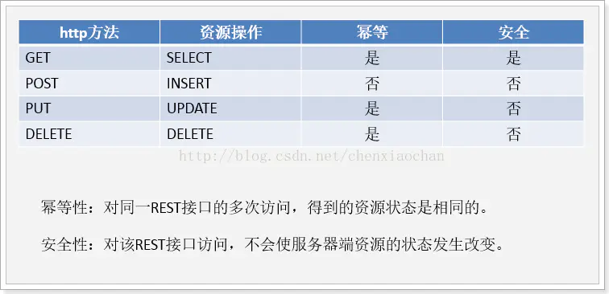

# RESTful接口详解

来源：[RESTful接口详解 - 简书 (jianshu.com)](https://www.jianshu.com/p/7893169a7c93)

REST是英文representational state transfer(表象性状态转变)或者表述性状态转移;Rest是web服务的一种架构风格;使用HTTP,URI,XML,JSON,HTML等广泛流行的标准和协议;轻量级,跨平台,跨语言的架构设计;它是一种设计风格,不是一种标准,是一种思想

Rest架构的主要原则：

1.网络上的所有事物都被抽象为资源
2.每个资源都有一个唯一的资源标识符
3.同一个资源具有多种表现形式(xml,json等)
4.对资源的各种操作不会改变资源标识符
5.**所有的操作都是无状态的**

符合REST原则的架构方式即可称为RESTful

什么是Restful:
对应的中文是rest式的;Restful web service是一种常见的rest的应用,是遵守了rest风格的web服务;rest式的web服务是一种ROA(The Resource-Oriented Architecture)(面向资源的架构).

为什么会出现Restful

在Restful之前的操作：
http://127.0.0.1/user/query/1 GET 根据用户id查询用户数据
http://127.0.0.1/user/save POST 新增用户
http://127.0.0.1/user/update POST 修改用户信息
http://127.0.0.1/user/delete/1 GET/POST 删除用户信息

RESTful用法：
http://127.0.0.1/user/1 GET 根据用户id查询用户数据
http://127.0.0.1/user POST 新增用户
http://127.0.0.1/user PUT 修改用户信息
http://127.0.0.1/user DELETE 删除用户信息

之前的操作是没有问题的,大神认为是有问题的,有什么问题呢?你每次请求的接口或者地址,都在做描述,例如查询的时候用了query,新增的时候用了save,其实完全没有这个必要,我使用了get请求,就是查询.使用post请求,就是新增的请求,我的意图很明显,完全没有必要做描述,这就是为什么有了restful.

如何使用:

SpringMVC实现restful服务:

SpringMVC原生态的支持了REST风格的架构设计

所涉及到的注解:

---@RequestMapping
---@PathVariable
---@ResponseBody

