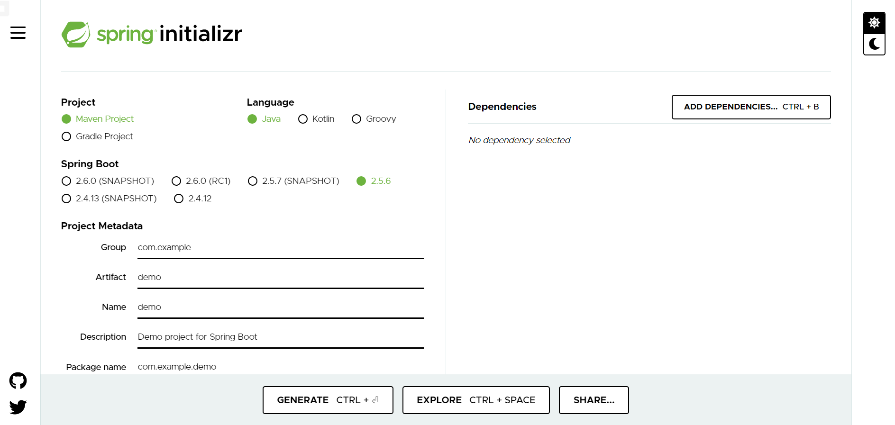
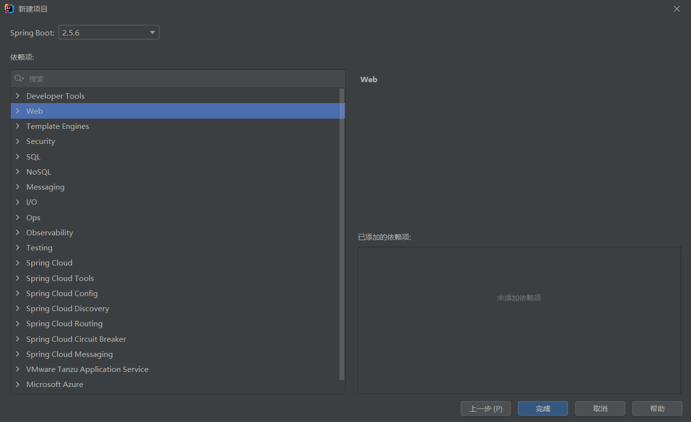
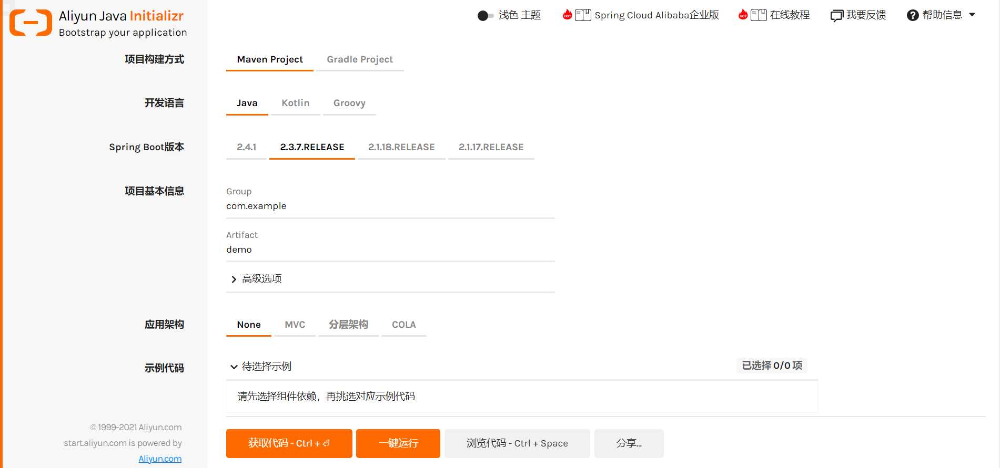

# SpringInitialzr是什么

创建Spring项目用的脚手架

[Spring Initializr](https://start.spring.io/)

可以在网页端访问

也可以在IDEA里访问

# 为什么要定制SpringInitialzr

先看看阿里的SpringInitialzr：[Aliyun Java Initializr](https://start.aliyun.com/bootstrap.html)

公司需要实现自定义的功能，比如加入公司内部的库、框架等，以此来达到快速创建Java项目的目的，减少重复性工作。

# 准备工作

文档：[Spring Initializr Reference Guide](https://docs.spring.io/initializr/docs/current/reference/html/)

[spring-io/start.spring.io: https://start.spring.io (github.com)](https://github.com/spring-io/start.spring.io)

[spring-io/initializr: A quickstart generator for Spring projects (github.com)](https://github.com/spring-io/initializr)

网友教程：

[自己搭建SpringBoot initializer 服务器 - it610.com](https://www.it610.com/article/1287747651856543744.htm)

[定制 Spring Initializr_困难是否磨灭你的自信-CSDN博客](https://blog.csdn.net/sinat_34200786/article/details/102616131)

