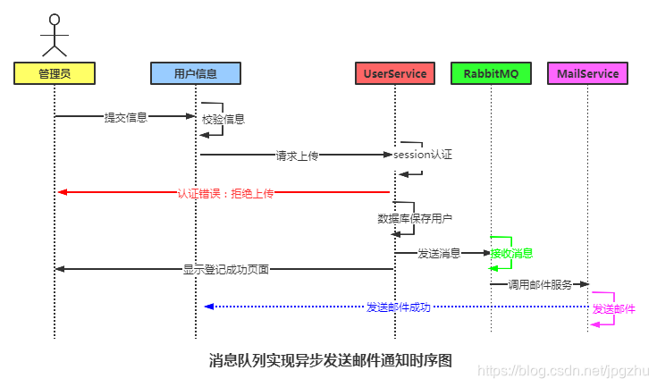
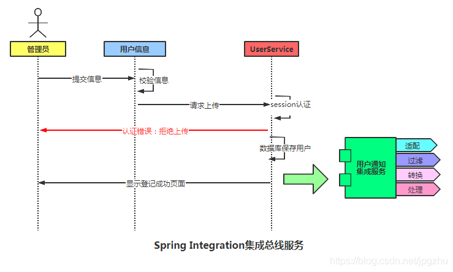

# 简介

来源：https://blog.csdn.net/jpgzhu/article/details/107362237

在企业级开发中，某个应用程序或模块往往需要完成读取消息、通过路由与外部API交互、生成日志文件、消息异步处理等一系列任务；我们会把这一系列任务组成一个或多个管道流，并定义为ESB（Enterprise Service Bus ）企业服务总线（总线方式把点对点、多对多的连接方式变成一对一的方式）：

## Spring Integration的几个重要概念

1. 消息(Message)：在Spring Integration中，消息是任何Java对象的通用包装。
2. 网关（gateway）：通过接口将数据传递到集成流中，即总线入口。
3. 通道（channel）：将消息从一个元素传递到另一个元素。
4. 过滤器（filter）：基于某些判断，条件化地允许某些消息通过流。
5. 转换器（transformer）：改变消息的值和/或将消息载荷从一种类型转换成另一种类型。

在Spring集成RabbitMQ实现异步消息处理的案例中，UseService与RabbitMQ发送消息服务直接点对点对接，如果我们对这个通知过程再加入根据邮箱地址信息过滤发送，记录日志信息等模块 ，则用户服务类需要同步扩充。

显然，我们希望把《通知用户处理模块》这个流程进行集成，UseService只与这个流程的入口进行单点连接，屏蔽在这个流程中的复杂处理单元，更有利于流程的扩展。

