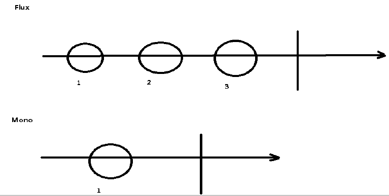
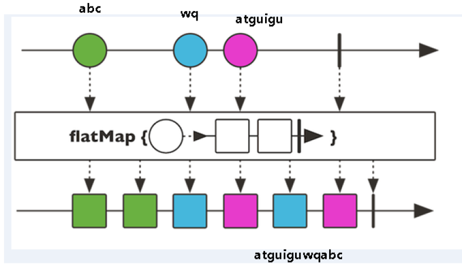

视频地址：https://www.bilibili.com/video/BV1Vf4y127N5

# Spring5特性

## 自带了通用的日志封装

log4j2

## @Nullable注解

（1）@Nullable注解可以使用在方法上面，属性上面，参数上面，表示方法返回可以为空，属性值可以为空，参数值可以为空

（2）注解用在方法上面，方法返回值可以为空

```java
@Nullable
String getId();
```


（3）注解使用在方法参数里面，方法参数可以为空

```java
public <T> void registerBean(@Nullable String beanName,...){}
```


（4）注解使用在属性上面，属性值可以为空

```cmd
@Nullable
privat String bookkName;
```

## 支持函数式风格

GenericApplicationContext

```java
//函数式风格创建对象，交给spring进行管理 
@Test 
public void testGenericApplicationContext() { 
    //1 创建GenericApplicationContext对象 
    GenericApplicationContext context = new GenericApplicationContext();
    //2 调用context的方法对象注册 
    context.refresh(); context.registerBean("user1",User.class,() -> new User()); 
    //3 获取在spring注册的对象 
    // User user =(User)context.getBean("com.atguigu.spring5.test.User"); 
    User user = (User)context.getBean("user1"); 
    System.out.println(user);

}
```

下一个新特性就是webflux，本节的重点内容

# Webflux

## 介绍

webflux 是Spring5添加新的模块，用于web开发的，功能和SpringMVC类似的，Webflux使用当前一种比较流程响应式编程出现的框架。

使用传统web框架，比如SpringMVC，这些基于Servlet容器，Webflux是一种**异步非阻塞**的框架，异步非阻塞的框架在Servlet3.1以后才支持，核心是基于**Reactor**的相关API实现的。

异步和同步

非阻塞和阻塞

上面都是针对对象不一样

**异步和同步针对调用者**，调用者发送请求，如果等着对方回应之后才去做其他事情就是同步，如果发送请求之后不等着对方回应就去做其他事情就是异步

**阻塞和非阻塞针对被调用者**，被调用者受到请求之后，做完请求任务之后才给出反馈就是阻塞，受到请求之后马上给出反馈然后再去做事情就是非阻塞

Webflux特点：

第一 非阻塞式：在有限资源下，提高系统吞吐量和伸缩性，以Reactor为基础实现响应式编程

第二 函数式编程：Spring5框架基于java8，Webflux使用Java8函数式编程方式实现路由请求比较SpringMVC和Spring Webflux

SpringMVC采用**命令式编程**，Webflux采用**异步响应式编程**

命令式：一行一行写代码

响应式：


## 响应式编程（Java实现）

响应式编程是一种面向数据流和变化传播的编程范式。这意味着可以在编程语言中很方便地表达静态或动态的**数据流**，而相关的计算模型会自动将变化的值通过数据流进行传播。 电子表格程序就是响应式编程的一个例子。单元格可以包含字面值或类似"=B1+C1"的公式，而包含公式的单元格的值会依据其他单元格的值的变化而变化。

java8及其之前版本

**观察者模式**

提供的观察者模式两个类Observer和Observable

```java
import java.util.Observable;

public class ObserverDemo extends Observable {
    public static void main(String[] args) { 
        ObserverDemo observer = new ObserverDemo(); 
        //添加观察者 
        observer.addObserver((o,arg)->{ System.out.println("发生变化"); }); 
        observer.addObserver((o,arg)->{ System.out.println("手动被观察者通知，准备改变"); });
        observer.setChanged(); 
        //数据变化 
        observer.notifyObservers();
        //通知 
    } 
}
```

Java9 的新增Flux接口

发布、订阅

````java
public final class Flow {

    private Flow() {}
    @FunctionalInterface
    public static interface Publisher<T> {
        public void subscribe(Subscriber<? super T> subscriber);
    }

    public static interface Subscriber<T> {
        public void onSubscribe(Subscription subscription);
        public void onNext(T item);
        public void onError(Throwable throwable);
        public void onComplete();
    }

    public static interface Subscription {
        public void request(long n);
        public void cancel();
    }
    public static interface Processor<T,R> extends Subscriber<T>, Publisher<R> {
    }
    static final int DEFAULT_BUFFER_SIZE = 256;
    public static int defaultBufferSize() {
        return DEFAULT_BUFFER_SIZE;
    }
}

````


```java
import java.util.concurrent.Flow;
public class Main {
    public static void main(String[] args) {
        Flow.Publisher<String> publisher = subscriber -> {
            subscriber.onNext("1"); // 1
            subscriber.onNext("2");
            subscriber.onError(new RuntimeException("出错")); // 2
            //  subscriber.onComplete();
        };
        publisher.subscribe(new Flow.Subscriber<>() {
            @Override
            public void onSubscribe(Flow.Subscription subscription) {
                subscription.cancel();
            }
            @Override
            public void onNext(String item) {
                System.out.println(item);
            }
            @Override
            public void onError(Throwable throwable) {
                System.out.println("出错了");
            }
            @Override
            public void onComplete() {
                System.out.println("publish complete");
            }
        });
    }
}
```


## 响应式编程（Reactor实现）

（1）响应式编程操作中，**Reactor是满足Reactive规范框架**

（2）Reactor有两个核心类，**Mono和Flux**，这两个类实现接口Publisher，提供丰富操作符。Flux对象实现发布者，返回N个元素；Mono实现发布者，返回0或者1个元素 

（3）Flux和Mono都是数据流的发布者，使用Flux和Mono都可以发出三种数据信号： 元素值，错误信号，完成信号，错误信号和完成信号都代表终止信号，终止信号用于告诉订阅者数据流结束了，错误信号终止数据流同时把错误信息传递给订阅者



（4）代码演示 Flux和Mono

依赖：

```xml
<dependency> 
    <groupId>io.projectreactor</groupId> 
    <artifactId>reactor-core</artifactId> 
    <version>3.1.5.RELEASE</version> 
</dependency>
```


```java
public static void main(String[] args) { 
    //just方法直接声明 
    Flux.just(1,2,3,4); 
    Mono.just(1); 
    //其他的方法 
    Integer[] array = {1,2,3,4}; 
    Flux.fromArray(array); 
    List<Integer> list = Arrays.asList(array); 
    Flux.fromIterable(list); 
    Stream<Integer> stream = list.stream(); 
    Flux.fromStream(stream); 
}
```

（5）三种信号特点
* 错误信号和完成信号都是终止信号，不能共存的
* 如果没有发送任何元素值，而是直接发送错误或者完成信号，表示是空数据流

- 如果没有错误信号，没有完成信号，表示是无限数据流

（6）调用just或者其他方法只是声明数据流，数据流并没有发出，只有进行订阅之后才会触发数据流，不订阅什么都不会发生的

```java
Flux.just(1,2,3,4).subscribe(System.out::print); //订阅
Mono.just(1).subscribe(System.out::print); //订阅
```

（7）操作符
* 对数据流进行一道道操作，成为操作符，比如工厂流水线

第一 map 元素映射为新元素


第二 flatMap 元素映射为流

- 把每个元素转换流，把转换之后多个流合并大的流



## SpringWebflux执行流程和核心API

spring-boot-starter改为spring-boot-starter-webflux

```xml
<dependency>
    <groupId>org.springframework.boot</groupId>
    <artifactId>spring-boot-starter-webflux</artifactId>
</dependency>
```

SpringWebflux基于Reactor，默认使用容器是Netty，Netty是高性能的NIO框架，同步非阻塞的框架

（1）Netty

BIO


NIO


（2）SpringWebflux执行过程和SpringMVC相似的
* SpringWebflux核心控制器 **DispatchHandler**，实现接口**WebHandler**
* 接口**WebHandler**有一个方法

```java
public Mono<Void> handle(ServerWebExchange exchange) {//放http请求响应信息
    return this.handlerMappings == null ? this.createNotFoundError() : Flux.fromIterable(this.handlerMappings).concatMap((mapping) -> {
        return mapping.getHandler(exchange);//根据请求地址获取对应的mapping
    }).next().switchIfEmpty(this.createNotFoundError()).flatMap((handler) -> {
        return this.invokeHandler(exchange, handler);//调用具体的业务方法
    }).flatMap((result) -> {
        return this.handleResult(exchange, result);//处理结果返回
    });
}
```

（3）SpringWebflux里面DispatcherHandler，负责请求的处理
* HandlerMapping：**请求查询到处理的方法**
* HandlerAdapter：**真正负责请求处理**
* HandlerResultHandler：**响应结果处理**

（4）SpringWebflux实现函数式编程，两个接口：RouterFunction（路由处理）和HandlerFunction（处理函数）

## SpringWebflux（基于注解编程模型）⭐

```xml
<dependency>
    <groupId>org.springframework.boot</groupId>
    <artifactId>spring-boot-starter-webflux</artifactId>
</dependency>
<dependency>
    <groupId>io.projectreactor</groupId>
    <artifactId>reactor-test</artifactId>
    <scope>test</scope>
</dependency>
```

SpringWebflux实现方式有两种：注解编程模型和函数式编程模型

使用注解编程模型方式，和之前**SpringMVC使用相似**的，只需要把相关依赖配置到项目中，SpringBoot自动配置相关运行容器，默认情况下使用**Netty**服务器

application.properties:

```properties
server.port=8081
```

实体类

```java
@Data
public class User {
    private String name;
    private String gender;
    private Integer age;
}
```

创建接口定义操作的方法

```java
//用户操作接口 
public interface UserService { 
    //根据id查询用户 
    Mono<User> getUserById(int id); 
    //查询所有用户 
    Flux<User> getAllUser(); 
    //添加用户 
    Mono<Void> saveUserInfo(Mono<User> user);
}
```

接口实现类

```java
import com.potato.webflux.entity.User;
import reactor.core.publisher.Flux;
import reactor.core.publisher.Mono;

import java.util.HashMap;
import java.util.Map;

public class UserServiceImpl implements UserService {
    //创建map集合存储数据，模拟从数据库查询到的数据
    private final Map<Integer,User> users = new HashMap<>();
    public UserServiceImpl() {
        this.users.put(1,new User("lucy","nan",20));
        this.users.put(2,new User("mary","nv",30));
        this.users.put(3,new User("jack","nv",50));
    }

    //根据id查询
    @Override
    public Mono<User> getUserById(int id) {
        return Mono.justOrEmpty(this.users.get(id));
    }

    //查询所有用户
    @Override
    public Flux<User> getAllUser() {
        return Flux.fromIterable(this.users.values());
    }

    @Override
    public Mono<Void> saveUserInfo(Mono<User> userMono) {
        return userMono.doOnNext(person -> {
            //向map集合里面放值
            int id = users.size()+1; users.put(id,person);
        }).thenEmpty(Mono.empty());//终止信号
    }
}
```

创建controller

```java
import com.potato.webflux.entity.User;
import com.potato.webflux.service.UserService;
import org.springframework.beans.factory.annotation.Autowired;
import org.springframework.web.bind.annotation.*;
import reactor.core.publisher.Flux;
import reactor.core.publisher.Mono;

@RestController
public class UserController {
    //注入service
    @Autowired
    private UserService userService;

    //id查询
    @GetMapping("/user/{id}")
    public Mono<User> geetUserId(@PathVariable int id) {
        return userService.getUserById(id);
    }

    //查询所有 
    @GetMapping("/user")
    public Flux<User> getUsers() {
        return userService.getAllUser();
    }

    //添加 
    @PostMapping("/saveuser")
    public Mono<Void> saveUser(@RequestBody User user) {
        Mono<User> userMono = Mono.just(user);
        return userService.saveUserInfo(userMono);
    }
}
```

说明
SpringMVC方式实现，同步阻塞的方式，基于SpringMVC+Servlet+Tomcat
SpringWebflux方式实现，异步非阻塞 方式，基于SpringWebflux+Reactor+Netty

## SpringWebflux（基于函数式编程模型）

（1）在使用函数式编程模型操作时候，需要自己初始化服务器

（2）基于函数式编程模型时候，有两个核心接口：RouterFunction（实现路由功能，请求转发给对应的handler）和HandlerFunction（处理请求生成响应的函数）。核心任务定义两个函数式接口的实现并且启动需要的服务器。

（3）SpringWebflux请求和响应不再是ServletRequest和ServletResponse，而是**ServerRequest和ServerResponse**

第一步 把注解编程模型工程复制一份 ，去掉controller，保留entity和service内容

第二步 创建Handler（具体实现方法）

```java
package com.potato.webflux.handler;

import com.potato.webflux.entity.User;
import com.potato.webflux.service.UserService;
import org.springframework.http.MediaType;
import org.springframework.web.reactive.function.server.ServerRequest;
import org.springframework.web.reactive.function.server.ServerResponse;
import reactor.core.publisher.Flux;
import reactor.core.publisher.Mono;

import static org.springframework.web.reactive.function.BodyInserters.fromValue;

public class UserHandler {
    private final UserService userService;
    public UserHandler(UserService userService){
        this.userService = userService;
    }
    //根据id查询
    public Mono<ServerResponse> getUserById(ServerRequest request){
        int userId= Integer.parseInt(request.pathVariable("id"));
        //空值处理
        Mono<ServerResponse> notFound = ServerResponse.notFound().build();
        Mono<User> userMono = this.userService.getUserById(userId);
        //把userMono进行转换返回
        //reactor操作符flatMap
        return userMono.flatMap(person->ServerResponse.ok()
                .contentType(MediaType.APPLICATION_JSON)
                .body(fromValue(person)))
                .switchIfEmpty(notFound);
    }
    //查询所有
    public Mono<ServerResponse> getAllUser(){
        //调用service得到结果
        Flux<User> users = this.userService.getAllUser();
        return ServerResponse.ok().contentType(MediaType.APPLICATION_JSON)
                .body(users,User.class);
    }
    //添加
    public Mono<ServerResponse> saveUser(ServerRequest request){
        //得到user对象
        Mono<User> userMono = request.bodyToMono(User.class);
        return ServerResponse.ok().build(this.userService.saveUserInfo(userMono));
    }
}
```

第三步 初始化服务器，编写Router，相当于SpringMVC的controller


```java
package com.potato.webflux;

import com.potato.webflux.handler.UserHandler;
import com.potato.webflux.service.UserService;
import com.potato.webflux.service.UserServiceImpl;
import org.springframework.http.server.reactive.HttpHandler;
import org.springframework.http.server.reactive.ReactorHttpHandlerAdapter;
import org.springframework.web.reactive.function.server.RouterFunction;
import org.springframework.web.reactive.function.server.RouterFunctions;
import org.springframework.web.reactive.function.server.ServerResponse;
import reactor.netty.http.server.HttpServer;

import java.io.IOException;

import static org.springframework.http.MediaType.APPLICATION_JSON;
import static org.springframework.web.reactive.function.server.RequestPredicates.GET;
import static org.springframework.web.reactive.function.server.RequestPredicates.accept;
import static org.springframework.web.reactive.function.server.RouterFunctions.toHttpHandler;

public class Server {
    //3.调用服务
    public static void main(String[] args) {
        Server server = new Server();
        server.createReactorServer();
        System.out.println("enter to exit");
        try {
            System.in.read();
        } catch (IOException e) {
            e.printStackTrace();
        }
    }
    //1.创建Router路由
    public RouterFunction<ServerResponse> routingFunction() {
        //创建hanler对象
        UserService userService = new UserServiceImpl();
        UserHandler handler = new UserHandler(userService);
        //设置路由
        return RouterFunctions
                .route( GET("/users/{id}").and(accept(APPLICATION_JSON)),handler::getUserById)
                .andRoute(GET("/users").and(accept(APPLICATION_JSON)),handler::getAllUser);
    }
    //2.创建服务器完成适配
    public void createReactorServer() {
        //路由和handler适配
        RouterFunction<ServerResponse> route = routingFunction();
        HttpHandler httpHandler = toHttpHandler(route);
        ReactorHttpHandlerAdapter adapter = new ReactorHttpHandlerAdapter(httpHandler);
        //创建服务器
        HttpServer httpServer = HttpServer.create();
        httpServer.handle(adapter).bindNow();
    }
}

```

启动main方法后，因为我们没有指定端口号，在打印的日志里能看到生成的随机端口号，这里是59519

访问

```
http://localhost:59519/users/1
http://localhost:59519/users
```

（4）使用WebClient调用

```java
public class Client {
    public static void main(String[] args) { 
        //调用服务器地址 
        WebClient webClient = WebClient.create("http://127.0.0.1:59519");//和server地址、端口对应
        //根据id查询 
        String id = "1"; 
        User userresult = webClient
                .get().uri("/users/{id}", id) 
                .accept(MediaType.APPLICATION_JSON)
                .retrieve()
                .bodyToMono(User.class) 
                .block();
        System.out.println(userresult.getName()); 
        //查询所有 
        Flux<User> results = webClient
                .get().uri("/users") 
                .accept(MediaType.APPLICATION_JSON)
                .retrieve()
                .bodyToFlux(User.class); 
        results.map(stu -> stu.getName()) 
                .buffer()
                .doOnNext(System.out::println)
                .blockFirst();
    } 
}
```

