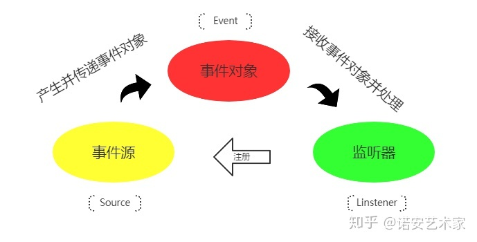

# Java事件

参考：

https://www.cnblogs.com/minisculestep/p/5059321.html

java的事件机制一般包括三个部分：EventObject，EventListener和Source。

`java`的事件机制其实是一个观察者模式，我们也可以自己实现一个

**EventObject**

java.util.EventObject是事件状态对象的基类，它封装了事件源对象以及和事件相关的信息。所有java的事件类都需要继承该类。EventObject对象不提供默认构造器，需要外部传递source参数，即用于记录并跟踪事件的来源；

**EventListener**

java.util.EventListener是一个标记接口，就是说该接口内是没有任何方法的。所有事件监听器都需要实现该接口。事件监听器注册在事件源上，当事件源的属性或状态改变的时候，**调用相应监听器内的回调方法**。

**Source**

事件源**不需要实现或继承任何接口或类**，它是事件最初发生的地方。因为事件源需要注册事件监听器，所以**事件源内需要有相应的盛放事件监听器的容器**。

下面给个例子

## 事件对象

定义一个事件

```java
import java.util.EventObject;

public class MyEvent extends EventObject {

    private static final long serialVersionUID = 1L;
    private int sourceState;

    public MyEvent(Object source) {
        super(source);
        sourceState = ((Source)source).getFlag();
    }

    public int getSourceState() {
        return sourceState;
    }

}
```

## 事件监听器

定义若干监听器

```java
import java.util.EventListener;

public class StateChangeListener implements EventListener {

    public void handleEvent(MyEvent event) {
        System.out.println("触发状态改变事件。。。");
        System.out.println("当前事件源状态为：" + event.getSourceState());
        System.out.println("。。。。。。。。。。。。。。。。。。。。。。。");
    }
}
```


```java
import java.util.EventListener;

public class StateChangeToOneListener implements EventListener {

    public void handleEvent(MyEvent event) {
        System.out.println("触发状态变为1的事件。。。");
        System.out.println("当前事件源状态为：" + event.getSourceState());
        System.out.println("。。。。。。。。。。。。。。。。。。。。。。。");
    }

}
```

## 事件源

顾名思义，事件源就是产生事件的地方

```java
import java.util.EventListener;
import java.util.HashSet;
import java.util.Set;

public class Source {
    private int flag = 0;
    Set<EventListener> listeners = new HashSet<EventListener>();

    //注册事件监听器
    public void addStateChangeListener(StateChangeListener listener) {
        listeners.add(listener);
    }
    //注册事件监听器
    public void addStateChangeToOneListener(StateChangeToOneListener listener) {
        listeners.add(listener);
    }
    //当事件发生时，通知注册在事件源上的所有事件做出相应的反映
    public void notifyListener() {
        for (EventListener listener : listeners) {
            try {
                ((StateChangeListener)listener).handleEvent(new MyEvent(this));
            } catch (Exception e) {
                if (flag == 1) {
                    ((StateChangeToOneListener)listener).handleEvent(new MyEvent(this));
                }
            }
        }
    }
    //改变状态
    public void changeFlag() {
        flag = (flag == 0 ? 1 : 0);
        notifyListener();
    }

    public int getFlag() {
        return flag;
    }
}
```

## 测试类

```java
public class Test {

    public static void main(String[] args) {

        Source source = new Source();
        source.addStateChangeListener(new StateChangeListener());
        source.addStateChangeToOneListener(new StateChangeToOneListener());

        source.changeFlag();
        System.out.println("!!!!!!!!!!!!!!!!!!!!!!!!!!!!!!!!!!!!!!!!!!!");
        source.changeFlag();
        System.out.println("!!!!!!!!!!!!!!!!!!!!!!!!!!!!!!!!!!!!!!!!!!!");
        source.changeFlag();
    }

}
```


# Spring事件

参考来源：

https://zhuanlan.zhihu.com/p/145927110

https://www.cnblogs.com/okong/p/springboot-thirty-two.html




## 事件相关的对象

`ApplicationEvent`以及`Listener`是`Spring`为我们提供的一个事件监听、订阅的实现，内部实现原理是观察者设计模式，设计初衷也是为了系统业务逻辑之间的解耦，提高可扩展性以及可维护性。

- `ApplicationEvent`事件接口
- `ApplicationListener`事件监听器接口，所有的监听器都实现该接口
- `ApplicationEventPublisher`  事件发布接口，`ApplicationContext`实现了该接口
- `ApplicationEventMulticaster` 是`Spring`事件机制中的事件广播器，默认实现`SimpleApplicationEventMulticaster`

其执行的流程大致为：

> 当一个事件源产生事件时，它通过事件发布器`ApplicationEventPublisher`发布事件，然后事件广播器`ApplicationEventMulticaster`会去事件注册表`ApplicationContext`中找到事件监听器`ApplicationListnener`，并且逐个执行监听器的`onApplicationEvent`方法，从而完成事件监听器的逻辑。

Spring事件对象为**ApplicationEvent**，继承EventObject，源码如下：

```java
package org.springframework.context;

import java.util.EventObject;

public abstract class ApplicationEvent extends EventObject {
    private static final long serialVersionUID = 7099057708183571937L;
    private final long timestamp = System.currentTimeMillis();

    public ApplicationEvent(Object source) {
        super(source);
    }

    public final long getTimestamp() {
        return this.timestamp;
    }
}
```

Spring事件监听器为**ApplicationListener**，继承EventListener， 源码如下：

```java
public interface ApplicationListener<E extends ApplicationEvent> extends EventListener {
    void onApplicationEvent(E var1);
}
```

实现Spring事件监听有两种方式：

- 面向接口编程，实现ApplicationListener接口；
- 基于注解驱动，@EventListener（Spring自定义的注解）

## 事件发布与监听(订阅)

**定义事件**

继承：ApplicationEvent接口

```java
@Getter
@Setter
public class DemoEvent extends ApplicationEvent {
    private Long id;
    private String message;

    public DemoEvent(Object source, Long id, String message) {
        super(source);
        this.id = id;
        this.message = message;
    }
}
```

**监听事件方式一：实现接口**

```java
/**
 * 监听器方式一：实现ApplicationListener
 */
@Component
public class DemoListener implements ApplicationListener<DemoEvent> {
    //参数为需要监听的事件类型
    @Override
    public void onApplicationEvent(DemoEvent demoEvent) {
        System.out.println(">>>>>>>>>DemoListener>>>>>>>>>>>>>>>>>>>>>>>>>>>>");
        System.out.println("DemoListener 收到了：" + demoEvent.getSource() + "消息;时间：" + demoEvent.getTimestamp());
        System.out.println("消息：" + demoEvent.getId() + ":" + demoEvent.getMessage());
    }
}
```

**监听事件二：使用注解**

```java
/**
 * 监听器方式二: @EventListener
 */
@Component
public class DemoListener2 {

    @EventListener
    public void onApplicationEvent(DemoEvent demoEvent) {
        System.out.println(">>>>>>>>>DemoListener2>>>>>>>>>>>>>>>>>>>>>>>>>>>>");
        System.out.println("DemoListener2 收到了：" + demoEvent.getSource() + "消息;时间：" + demoEvent.getTimestamp());
        System.out.println("消息：" + demoEvent.getId() + ":" + demoEvent.getMessage());
    }
}
```

**发布事件**

```java
/**
 * 消息发布者
 */
@Component
public class DemoPublisher {
    @Autowired //发布事件到Spring容器
    private ApplicationContext applicationContext;

    public void publish(long id, String message) {
        applicationContext.publishEvent(new DemoEvent(this, id, message));
    }

}
```

测试一下：

```java
@SpringBootTest
public class EventTest {
    @Autowired
    DemoPublisher publisher;

    @Test
    void publisherTest() {
        publisher.publish(1L, "成功了");
    }
}
```

结果：

```
>>>>>>>>>DemoListener2>>>>>>>>>>>>>>>>>>>>>>>>>>>>
DemoListener2 收到了：com.potato.eventspring.DemoPublisher@7c75db8b消息;时间：1639301381435
消息：1:成功了
>>>>>>>>>DemoListener>>>>>>>>>>>>>>>>>>>>>>>>>>>>
DemoListener 收到了：com.potato.eventspring.DemoPublisher@7c75db8b消息;时间：1639301381435
消息：1:成功了
2021-12-12 17:29:41.466  INFO 12196 --- [extShutdownHook] o.s.s.concurrent.ThreadPoolTaskExecutor  : Shutting down ExecutorService 'applicationTaskExecutor'

```

## 异步事件

`Spring` 中的事件默认情况下是同步的，发布者线程会进入阻塞状态，直到所有的监听器处理完事件。如果想让事件监听异步执行，需要在监听器上添加`@Async`, 同时主启动类上添加`@EnableAsync`注解

```java
@Slf4j
@Component
public class AsycDemoListener {
    @Async
    @EventListener
    public void asyncListener(DemoEvent demoEvent) {
        log.info("异步事件监听,当前线程:{},消息为:{}", Thread.currentThread().getName(), demoEvent.getMessage());
    }
}
```

## 事务与事件

**@TransactionalEventListener注解**

从命名中就可以直接看出，它就是个`EventListener`，能够 控制 在事务的时候Event事件的处理方式，即**事件的发送时机可以和事务绑定**。注解的可选属性如下：

- TransactionPhase.BEFORE_COMMIT 在提交前

- TransactionPhase.AFTER_COMMIT  在提交后

- TransactionPhase.AFTER_ROLLBACK  在回滚后

- TransactionPhase.AFTER_COMPLETION  在事务完成后

默认 TransactionPhase.AFTER_COMMIT。

指定发布时机避免的情况就是，比如注册用户，包含了一些耗时的操作，而这些操作中有异步非阻塞的， 当执行到了发布事件的方法时。用户可能还没有创建完成，此时如果事件发布了，在监听器那边执行时，可能获取用户失败。 而如果在事务提交后执行，就不会出现这种情况。

这个注解 **不是** 说发布事件的方法和监听器响应方法之间有什么事务关系。他们之间还是没有事务的。无法保证原子性，一致性。

如果要实现事务也不是没有办法，可以先保证 事件的发布方执行完毕，事务提交完成。然后订阅方遵循幂等性规则， 如果订阅方失败，进入重试机制。有点像RocketMQ分段提交，事务回查与重试机制。可以按照这个思想实现。

### 需求现状

来源：https://www.jianshu.com/p/6f9cc1384cdf

在项目中，往往需要执行数据库操作后，发送消息或事件来异步调用其他组件执行相应的操作，例如：
用户注册后发送激活码；
配置修改后发送更新事件等。
但是，数据库的操作如果还未完成，此时异步调用的方法查询数据库发现没有数据，这就会出现问题。伪代码如下：

```java
void saveUser(User u) {
    //保存用户信息
    userDao.save(u);
    //触发保存用户事件
    applicationContext.publishEvent(new SaveUserEvent(u.getId()));
}

@EventListener
void onSaveUserEvent(SaveUserEvent event) {
    //获取事件中的信息（用户id）
    Integer id = event.getEventData();
    //查询数据库，获取用户（此时如果用户还未插入数据库，则返回空）
    User u = userDao.getUserById(id);
    //这里可能报空指针异常！
    String phone = u.getPhoneNumber();
    MessageUtils.sendMessage(phone);
}
```

### 使用@TransactionalEventListener

为了解决上述问题，Spring为我们提供了两种方式：
(1) `@TransactionalEventListener`注解
(2) 事务同步管理器`TransactionSynchronizationManager`

途径一：@TransactionalEventListener

仍旧是上述给用户发短信的例子，代码如下：

```java
@TransactionalEventListener(phase = TransactionPhase.AFTER_COMMIT)
void onSaveUserEvent(SaveUserEvent event) {
    Integer id = event.getEventData();
    User u = userDao.getUserById(id);
    String phone = u.getPhoneNumber();
    MessageUtils.sendMessage(phone);
}
```

这样，只有当前事务提交之后，才会执行事件监听器的方法。

**值得注意的是，如果发射事件的地方没有事务，这里需要在注解中加一个参数：**

```java
@TransactionalEventListener(fallbackExecution = true)
```

途径二：TransactionSynchronizationManager方法

仍旧是上述案例，代码如下：

```java
@EventListener
void onSaveUserEvent(SaveUserEvent event) {
    TransactionSynchronizationManager.registerSynchronization(new TransactionSynchronizationAdapter() {
        @Override
        public void afterCommit() {
            Integer id = event.getEventData();
            User u = userDao.getUserById(id);
            String phone = u.getPhoneNumber();
            MessageUtils.sendMessage(phone);
        }
    });
}
```

稍微繁琐，建议使用@TransactionalEventListener

