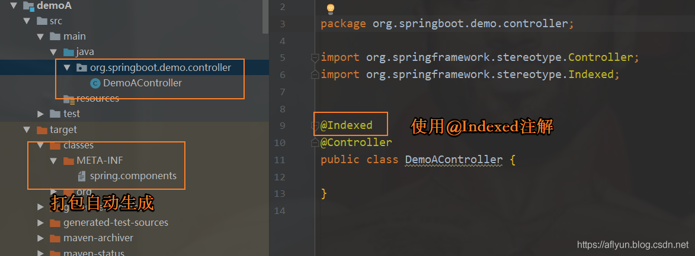
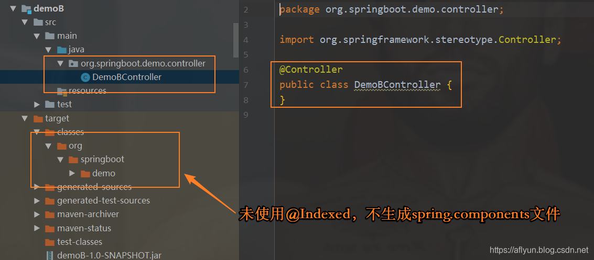

# spring-context

org.springframework.stereotype包下有注解：@Component、@Controller、@Indexed、@Repository、@Service

## @Index 加快bean扫描速度

[@Indexed 注解-博客园 (cnblogs.com)](https://www.cnblogs.com/54chensongxia/p/14389134.html)

[Spring 5 启动性能优化之 @Indexed-CSDN博客](https://blog.csdn.net/zzuhkp/article/details/108257764)

[官网文档(spring.io)](https://docs.spring.io/spring-framework/docs/5.2.6.RELEASE/spring-framework-reference/core.html#beans-scanning-index)

需包含如下依赖（引入SpringBoot后，底层都会有这个依赖）

```xml
<dependencies>
    <dependency>
        <groupId>org.springframework</groupId>
        <artifactId>spring-context-indexer</artifactId>
        <optional>true</optional>
    </dependency>
</dependencies>
```

### 使用

**作用**  用于提高spring中的类扫描的速度

**使用场景**  在应用中使用`@ComponentScan`扫描 package 时，如果 package 中包含很多的类，那么 Spring 启动的时候就会变慢。

提升性能的一个方案就是提供一个 Component 的候选列表，可以理解为类似于sql中给创建索引，Spring 启动时直接扫描注入这些列表就行了，而不需要一个个类去扫描，再筛选出候选 Component。

需要注意的是：**在这种模式下，所有组件扫描的目标模块都必须使用这种机制——大白话将就所有的 Component 组件都必须生成到列表文件中去。**

在代码中，对于使用了模式注解的类上加上`@Indexed`注解即可。如下：

```java
@Indexed
@Controller
public class HelloController {

}
```

加了上面的依赖后，项目就会自动使用索引的方式启动Spring。

模式注解(Stereotype Annotations):@Component, @Service,@Controller,@Repository，只要在相应的类上标注这些注解，就能成为 Spring 中组件(Bean)。

### 原理说明

简单说明一下：在项目中使用了`@Indexed`之后，编译打包的时候会在项目中自动生成`META-INT/spring.components`文件。

当Spring应用上下文执行`ComponentScan`扫描时，`META-INT/spring.components`将会被`CandidateComponentsIndexLoader` 读取并加载，转换为`CandidateComponentsIndex`对象，这样的话`@ComponentScan`不在扫描指定的package，而是读取`CandidateComponentsIndex`对象，从而达到提升性能的目的。

知道上面的原理，可以看一下`org.springframework.context.index.CandidateComponentsIndexLoader`的源码。

```java
public final class CandidateComponentsIndexLoader {

	public static final String COMPONENTS_RESOURCE_LOCATION = "META-INF/spring.components";

    public static final String IGNORE_INDEX = "spring.index.ignore";


	private static final boolean shouldIgnoreIndex = SpringProperties.getFlag(IGNORE_INDEX);

	private static final Log logger = LogFactory.getLog(CandidateComponentsIndexLoader.class);

	private static final ConcurrentMap<ClassLoader, CandidateComponentsIndex> cache =
			new ConcurrentReferenceHashMap<>();


	private CandidateComponentsIndexLoader() {
	}

    @Nullable
	public static CandidateComponentsIndex loadIndex(@Nullable ClassLoader classLoader) {
		ClassLoader classLoaderToUse = classLoader;
		if (classLoaderToUse == null) {
			classLoaderToUse = CandidateComponentsIndexLoader.class.getClassLoader();
		}
		return cache.computeIfAbsent(classLoaderToUse, CandidateComponentsIndexLoader::doLoadIndex);
	}

	@Nullable
	private static CandidateComponentsIndex doLoadIndex(ClassLoader classLoader) {
		if (shouldIgnoreIndex) {
			return null;
		}

		try {
			Enumeration<URL> urls = classLoader.getResources(COMPONENTS_RESOURCE_LOCATION);
			if (!urls.hasMoreElements()) {
				return null;
			}
			List<Properties> result = new ArrayList<>();
			while (urls.hasMoreElements()) {
				URL url = urls.nextElement();
				Properties properties = PropertiesLoaderUtils.loadProperties(new UrlResource(url));
				result.add(properties);
			}
			if (logger.isDebugEnabled()) {
				logger.debug("Loaded " + result.size() + "] index(es)");
			}
			int totalCount = result.stream().mapToInt(Properties::size).sum();
			return (totalCount > 0 ? new CandidateComponentsIndex(result) : null);
		}
		catch (IOException ex) {
			throw new IllegalStateException("Unable to load indexes from location [" +
					COMPONENTS_RESOURCE_LOCATION + "]", ex);
		}
	}

}
```

### 使用注意点

虽然这个`@Indexed`注解能提升性能，但是在使用的时候也需要注意下。

假设Spring应用中存在一个包含`META-INT/spring.components`资源的a.jar，但是 b.jar 仅存在**模式注解**，那么使用`@ComponentScan`扫描这两个JAR中的package时，b.jar 中的模式注解不会被识别，请务必注意这样的问题。

举个列子说明下，能够更好的理解。

- DemoA项目（使用`@Indexed注解`）



- DemoB项目(不使用`@Indexed注解`)

  

- SpringBootDemo项目
  在此项目中引入`DemoA.jar` 和 `DemoB.jar` 。然后进行如下测试，测试代码如下：

配置类，扫描模式注解

```java
@Configuration
@ComponentScan(basePackages = "org.springboot.demo")
public class SpringIndexedConfiguration {
}
```

测试类：

```java
@Test
public void testIndexedAnnotation(){

    AnnotationConfigApplicationContext context = new AnnotationConfigApplicationContext(SpringIndexedConfiguration.class);

    System.out.println("获取DemoA Jar中【org.springboot.demo.controller.DemoAController】");
    DemoAController demoAController = context.getBean(DemoAController.class);
    System.out.println("DemoAController = " + demoAController.getClass());

    System.out.println("获取DemoB Jar中【org.springboot.demo.controller.DemoBController】");
    DemoBController demoBController = context.getBean(DemoBController.class);
    System.out.println("DemoBController = " + demoBController.getClass());
}
```

结果：

```
beanDefinitionName = demoAController
获取DemoA Jar中【org.springboot.demo.controller.DemoAController】
DemoAController = class org.springboot.demo.controller.DemoAController
获取DemoB Jar中【org.springboot.demo.controller.DemoBController】

org.springframework.beans.factory.NoSuchBeanDefinitionException: No qualifying bean of type 'org.springboot.demo.controller.DemoBController' available
```

找不到 `DemoBController` 。

通过这样一个简单的Demo，验证了上面提到的使用注意点。

对于这种情况，Spring 官网提示了配置相关属性，不再使用index方式启动。要是这样的话，我们完全可以不添加spring-context-indexer 依赖，这样整体就不会使用index模式了。

@Indexed 并非可以任意使用。在没有其他模块依赖或者所依赖的模块都生成了 spring.components 文件时不会存在问题，然而如果依赖的模块只有**部分模块存在 spring.components 文件，则其他模块的 bean 也不会被扫描，为避免这种问题，需要在类路径下 spring.properties 文件中或系统属性中的 spring.index.ignore 参数设置为 true，这样就会跳过 spring.components 文件的扫描，而转为重新扫描类路径下的 bean** 。

### 总结

在企业实际项目中，不要使用这个注解，因为一旦有一个地方使用了@Index，而其他地方没有使用，会出现bean不会进入Spring容器中的情况。比较鸡肋吧，这个注解

