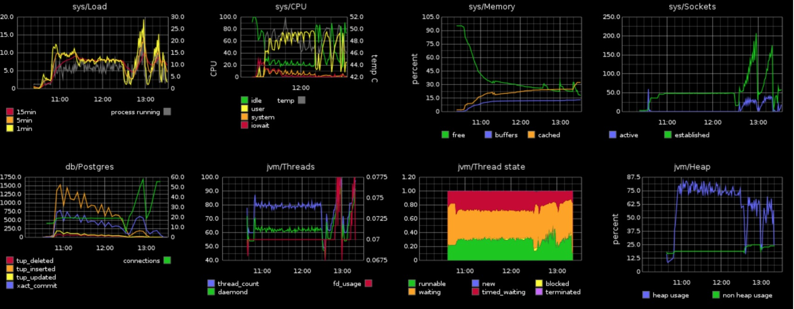

# Springboot2.5

[Spring Boot 2.5 Release Notes · spring-projects/spring-boot Wiki (github.com)](https://github.com/spring-projects/spring-boot/wiki/Spring-Boot-2.5-Release-Notes)

[SpringBoot 2.5 版本功能前瞻 - 冷冷zz - 博客园 (cnblogs.com)](https://www.cnblogs.com/leng-leng/p/14707903.html)

##  运行端点变更

1、Secure info endpoint（安全的 info 端点）
默认情况下/info端点不再对 web 公开。此外，如果引用了 Spring Security，则默认情况下端点需要经过身份验证才能访问。

2、优雅关机支持 GET 请求

我们流量请求到此接口执行业务逻辑的时候，若服务端此时执行关机 （kill），Spring boot 默认情况会直接关闭容器（tomcat 等），导致此业务逻辑执行失败。在一些业务场景下：会出现数据不一致的情况，事务逻辑不会回滚。在 spring boot 2.3 版本，支持优雅停机功能。关于优雅停机可以参考笔者这篇文章[Spring Boot 2.3 新特性优雅停机详解](https://my.oschina.net/giegie/blog/4282378)

3、记录停机日志

通过以下属性我们可以在 JVM 退出时候，记录资源释放日志等。

logging.register-shutdown-hook

4、新增 Quartz 的 Actuator Endpoint

Actuator 中新增了一个 `/quartz`端点。它提供了有关`Quartz`作业和触发器的详细信息。

- 访问 `/actuator/quartz`

```
$ curl 'http://localhost:8080/actuator/quartz' -i -X GET
```

- 返回应用配置的任务信息

```json
{
  "jobs" : {
    "groups" : [ "samples", "tests" ]
  },
  "triggers" : {
    "groups" : [ "samples", "DEFAULT" ]
  }
}
```

## 增强容器化功能

**1、War 包支持分层**

Spring Boot 的**Maven**和**Gradle**插件现在都允许您创建用于 Docker 的分层`WARs`。分层`WARs`的工作方式与 springboot 早期版本中提供的分层`JAR`支持类似。查看 Gradle 和 Maven 参考文档了解更多详细信息。

具体使用可以参考笔者的这篇文章[「Spring Boot 2.3 新特性」分层 JAR](https://my.oschina.net/giegie/blog/4289643)

**2、Buildpack 支持配置自定义**

Spring Boot 2.4[2]基于 Buildpack 推出了自己的 docker 构建工具 整合在原有的`spring-boot-maven-plugin`中，只需要配置对应目标仓库和主机信息即可完成镜像构建。具体使用可以参考笔者的这篇文章[「Spring Boot 2.4 新特性」一键构建 Docker 镜像](https://juejin.cn/post/6897007109813043207)。

spring boot 2.5 提供了更多的自定义能力，距离完全抛弃 Dockerfile 的日子更近了。

```
mvn spring-boot:build-image
```

## Environment 前缀

spring boot 可以为系统环境变量指定前缀，以便可以在同一环境中运行多个不同的 Spring 引导应用程序。使用`SpringApplication.setEnvironmentPrefix(…)`设置绑定属性时要使用的前缀。

例如，下面将添加`myapp`前缀：

```java
SpringApplication application = new SpringApplication(MyApp.class);
application.setEnvironmentPrefix("myapp");
application.run(args);
```

现在，所有属性都需要一个前缀版本。例如，要更改服务器端口

```plain
server.port=8080  --> myapp.server.port=8080
```

## Metrics 增强

- Metrics for Spring Data Repositories

- @Timed Metrics with WebFlux
- MongoDB Metrics

mica 2.4.5 发布在即，全网唯一支持 druid 和 undertow 的 Metrics 指标。

[Metrics介绍_ruthy的博客-CSDN博客_metrics](https://blog.csdn.net/ruthywei/article/details/80967063)

[Metrics](http://metrics.codahale.com/)可以为代码的运行提供无与伦比的洞察力。作为一款监控指标的度量类库，它提供了很多模块可以为第三方库或者应用提供辅助统计信息， 比如Jetty, Logback, Log4j, Apache HttpClient, Ehcache, JDBI, Jersey, 它还可以将度量数据发送给Ganglia和Graphite以提供图形化的监控。

Metrics提供了Gauge、Counter、Meter、Histogram、Timer等度量工具类以及Health Check功能。



## HTTP/2 over TCP (h2c)

现在，Spring boot 支持的四个嵌入式 Web 容器都已经支持基于 TCP（h2c）的 HTTP / 2 协议，无需进行任何手动自定义。如果要开启 h2c，只需将 server.http2.enabled 设置为 true，并将 server.ssl.enabled 设置为 false（默认 false）。

当然，微服务全栈 h2c 还需要打通 feign 和 RestTemplate 这种 http 客户端，h2c 我们 19 年就开始实践，详见：[spring-cloud-java11](https://gitee.com/596392912/spring-cloud-java11)

目前 Spring cloud gateway 的 client 也已经支持了 h2c 详见：

[reactor-netty/issues/639](https://github.com/reactor/reactor-netty/issues/639)

[spring-cloud-gateway/issues/7](https://github.com/spring-cloud/spring-cloud-gateway/issues/7)

## 数据源相关增强

**多数据源监控状态检测支持**

`AbstractRoutingDataSource`主要作用于 Spring 多数据源，`health`端点现在显示目标数据源的运行状况。每个目标数据源都使用其路由 key 命名。与前面一样，要忽略运行状况端点中的路由数据源

```properties
management.health.db.ignore-routing-data-sources=true
```

**数据源初始化脚本属性变更**

低版本的 spring.datasource.init 现在统一变更为 spring.sql.init 。

```
 spring.datasource.init --> spring.sql.init
```

当然此属性也可以适用 R2DBC 数据初始化。

**数据初始化重构**

为了支持`schema.sql`以及`data.sql`初始化，SpringBoot2.5 中进行了重新设计。

如果在同一个应用程序中同时使用 JPA 和 springboot 的 SQL 脚本初始化，您可能会发现 Springboot2.5 存在一个排序问题。默认情况下，我们先运行`schema.sql`以及`data.sql`然后再进行 JPA 初始化。如果希望在 JPA 初始化之后再运行脚本，你可以添加下面的配置。

```properties
spring.datasource.initialization-order=after-jpa
```

# Springboot2.4

[重磅：spring boot 2.4正式发布，重大调整！！！_penggerhe的博客-CSDN博客](https://blog.csdn.net/penggerhe/article/details/109701660)

## 配置改进

[抢先目睹：SpringBoot2.4配置文件加载机制大变化_Mr_Flouxetin的博客-CSDN博客](https://blog.csdn.net/Mr_Flouxetin/article/details/108146927)

### 改进配置文件的处理方式

Spring Boot 2.4 改进了处理 application.properties 和 application.yml 配置文件的方式。更新后的逻辑旨在简化和合理化外部配置的加载方式，但有些参数的组合形式却得到了限制，升级请谨慎。

如果你的应用工程只有一个简单的 application.properties 或 application.yml 文件，则可以进行无缝升级到 Spring Boot 2.4.0。

但是，如果你的配置较为复杂，比如说有指定 profile 的参数，或者有基于 profile 激活的参数，要使用新功能就需要进行一些更改。

更多细节可参考：

> https://github.com/spring-projects/spring-boot/wiki/Spring-Boot-Config-Data-Migration-Guide

如果你想继续使用 Spring Boot 2.3 的配置逻辑，也可以通过在 application.properties 或者 application.yml 配置文件中添加以下参数：

> spring.config.use-legacy-processing = true

### 配置加载顺序

从 Spring Boot 2.4 开始，加载 Properties 和 YAML 文件时候会遵循， **在文档中声明排序靠前的属性将被靠后的属性覆盖** 。

这点与 .properties 的排序规则相同。我们可以想一想，每次将一个 Value 放入 Map ，具有相同 key 的新值放入时，将替换已经存在的 Value。

同理对 Multi-document 的 YAML 文件，较低的排序也将被较高的覆盖：

```properties
test: "value"
---
test: "overridden-value"
```


### 导入配置参数改进

通过配置参数 spring.config.location 和 spring.config.import 来指定或者导入配置文件时，如果配置文件不存在，现在不是只能默默地失败了，可以通过添加 `optional:` 前缀来标识它是可选的。

比如我们从 /etc/config/application.properties 指定配置文件，如果这个文件不存在，系统就会跳过它。

> spring.config.location=optional:/etc/config/application.properties

如果你想将所有指定的配置文件都默认为可选的，可以通过 SpringApplication.setDefaultProperties(…) 来设置

spring.config.on-location-not-found=ignore 这个参数，或者将它设置在系统环境变量中。

### 支持导入配置树

新版本的 spring.config.import 属性还可以用于导入配置树，通过与 Kubernetes 一起使用，配置树是提供键/值对的另一种方法，每一个键值/对都在其自己的文件中声明，文件名是键，文件内容就是值。

另外，从配置树导入的参数默认会带一个换行符。

详细的参考：

> https://docs.spring.io/spring-boot/docs/2.4.0/reference/html/spring-boot-features.html#boot-features-external-config-files-configtree

具体的配置上的细节暂时没有时间详细研究了，后面有机会再详细介绍一篇，关注公众号Java技术栈第一时间推送。

