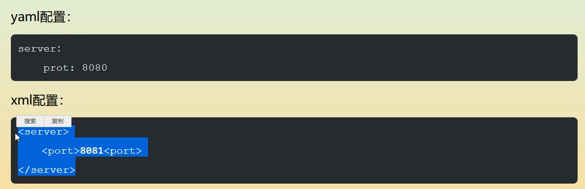

# 1.SpringBoot简介

## 1.1微服务阶段

javase:oop

mysql:持久化

html+css+js+jquery+框架：视图

javaweb：独立开发mvc三层架构的网站：原始

ssm:框架，简化开发流程，配置开始较为复杂

war包：tomcat运行


spring再简化：SpringBoot ：jar包：内嵌tomcat；微服务架构

服务越来越多：springcloud;

springboot出生名门

程序=数据结构+算法（集合框架）  程序猿

程序=面向对象+框架  码农

约定大于配置：maven  spring  springmvc  springboot

微服务架构

业务service:userservice===》模块

springmvc controller-->提高接口

all in one

高内聚，低耦合


## 1.2回顾什么是Spring

Spring是一个开源框架，2003 年兴起的一个轻量级的Java 开发框架，作者：Rod Johnson  。

**Spring是为了解决企业级应用开发的复杂性而创建的，简化开发。**

## 1.3Spring是如何简化Java开发的

为了降低Java开发的复杂性，Spring采用了以下4种关键策略：

1、基于POJO的轻量级和最小侵入性编程，所有东西都是bean；

2、通过IOC，依赖注入（DI）和面向接口实现松耦合；

3、基于切面（AOP）和惯例进行声明式编程；

4、通过切面和模版减少样式代码，RedisTemplate，xxxTemplate；

## 1.4什么是SpringBoot

学过javaweb的同学就知道，开发一个web应用，从最初开始接触Servlet结合Tomcat, 跑出一个Hello Wolrld程序，是要经历特别多的步骤；后来就用了框架Struts，再后来是SpringMVC，到了现在的SpringBoot，过一两年又会有其他web框架出现；你们有经历过框架不断的演进，然后自己开发项目所有的技术也在不断的变化、改造吗？建议都可以去经历一遍；

言归正传，什么是SpringBoot呢，就是一个javaweb的开发框架，和SpringMVC类似，对比其他javaweb框架的好处，官方说是简化开发，约定大于配置，  you can "just run"，能迅速的开发web应用，几行代码开发一个http接口。

所有的技术框架的发展似乎都遵循了一条主线规律：从一个复杂应用场景 衍生 一种规范框架，人们只需要进行各种配置而不需要自己去实现它，这时候强大的配置功能成了优点；发展到一定程度之后，人们根据实际生产应用情况，选取其中实用功能和设计精华，重构出一些轻量级的框架；之后为了提高开发效率，嫌弃原先的各类配置过于麻烦，于是开始提倡“约定大于配置”，进而衍生出一些一站式的解决方案。

是的这就是Java企业级应用->J2EE->spring->springboot的过程。

随着 Spring 不断的发展，涉及的领域越来越多，项目整合开发需要配合各种各样的文件，慢慢变得不那么易用简单，违背了最初的理念，甚至人称配置地狱。Spring Boot 正是在这样的一个背景下被抽象出来的开发框架，目的为了让大家更容易的使用 Spring 、更容易的集成各种常用的中间件、开源软件；

Spring Boot 基于 Spring 开发，Spirng Boot 本身并不提供 Spring 框架的核心特性以及扩展功能，只是用于快速、敏捷地开发新一代基于 Spring 框架的应用程序。也就是说，它并不是用来替代 Spring 的解决方案，而是和 Spring 框架紧密结合用于提升 Spring 开发者体验的工具。Spring Boot 以**约定大于配置的核心思想**，默认帮我们进行了很多设置，多数 Spring Boot 应用只需要很少的 Spring 配置。同时它集成了大量常用的第三方库配置（例如 Redis、MongoDB、Jpa、RabbitMQ、Quartz 等等），Spring Boot 应用中这些第三方库几乎可以零配置的开箱即用。

简单来说就是SpringBoot其实不是什么新的框架，它默认配置了很多框架的使用方式，就像maven整合了所有的jar包，spring boot整合了所有的框架 。

Spring Boot 出生名门，从一开始就站在一个比较高的起点，又经过这几年的发展，生态足够完善，Spring Boot 已经当之无愧成为 Java 领域最热门的技术。

**Spring Boot的主要优点：**

- 为所有Spring开发者更快的入门
- **开箱即用**，提供各种默认配置来简化项目配置
- 内嵌式容器简化Web项目
- 没有冗余代码生成和XML配置的要求

真的很爽，我们快速去体验开发个接口的感觉吧！

# 2.第一个SpringBoot程序

## 2.1准备工作

环境准备

- java version "1.8.0_181"
- Maven-3.6.1
- SpringBoot 2.x 最新版

开发工具：

- IDEA

## 2.2创建基础项目说明

Spring官方提供了非常方便的工具让我们快速构建应用

Spring Initializr：https://start.spring.io/

**项目创建方式一：**使用Spring Initializr 的 Web页面创建项目

1、打开  https://start.spring.io/

2、填写项目信息

3、点击”Generate Project“按钮生成项目；下载此项目

4、解压项目包，并用IDEA以Maven项目导入，一路下一步即可，直到项目导入完毕。

5、如果是第一次使用，可能速度会比较慢，包比较多、需要耐心等待一切就绪。

**项目创建方式二：**使用 IDEA 直接创建项目

1、创建一个新项目

2、选择spring initalizr ， 可以看到默认就是去官网的快速构建工具那里实现

3、填写项目信息

4、选择初始化的组件（初学勾选 Web 即可）

5、填写项目路径

6、等待项目构建成功


可以热部署

**项目结构分析：**

通过上面步骤完成了基础项目的创建。就会自动生成以下文件。

1、程序的主启动类

2、一个 application.properties 配置文件

3、一个 测试类

4、一个 pom.xml

## 2.3pom.xml 分析

pom.xml，看看Spring Boot项目的依赖：

```xml
<!-- 父依赖 -->
<parent>
    <groupId>org.springframework.boot</groupId>
    <artifactId>spring-boot-starter-parent</artifactId>
    <version>2.2.5.RELEASE</version>
    <relativePath/>
</parent>

<dependencies>
    <!-- web场景启动器 -->
    <dependency>
        <groupId>org.springframework.boot</groupId>
        <artifactId>spring-boot-starter-web</artifactId>
    </dependency>
    <!-- springboot单元测试 -->
    <dependency>
        <groupId>org.springframework.boot</groupId>
        <artifactId>spring-boot-starter-test</artifactId>
        <scope>test</scope>
        <!-- 剔除依赖 -->
        <exclusions>
            <exclusion>
                <groupId>org.junit.vintage</groupId>
                <artifactId>junit-vintage-engine</artifactId>
            </exclusion>
        </exclusions>
    </dependency>
</dependencies>

<build>
    <plugins>
        <!-- 打包插件 -->
        <plugin>
            <groupId>org.springframework.boot</groupId>
            <artifactId>spring-boot-maven-plugin</artifactId>
        </plugin>
    </plugins>
</build>
```

## 2.4编写一个http接口

1、在主程序的同级目录下，新建一个controller包，一定要在同级目录下，否则识别不到

2、在包中新建一个HelloController类

```java
@RestController
public class HelloController {

    @RequestMapping("/hello")
    public String hello() {
        return "Hello World";
    }
    
}
```

3、编写完毕后，从主程序启动项目，浏览器发起请求，看页面返回；控制台输出了 Tomcat 访问的端口号！


简单几步，就完成了一个web接口的开发，SpringBoot就是这么简单。所以我们常用它来建立我们的微服务项目！

## 2.5项目打包

将项目打成jar包，点击 maven的 package


如果遇到以上错误，可以配置打包时 跳过项目运行测试用例

```xml
<!--
    在工作中,很多情况下我们打包是不想执行测试用例的
    可能是测试用例不完事,或是测试用例会影响数据库数据
    跳过测试用例执
    -->
<plugin>
    <groupId>org.apache.maven.plugins</groupId>
    <artifactId>maven-surefire-plugin</artifactId>
    <configuration>
        <!--跳过项目运行测试用例-->
        <skipTests>true</skipTests>
    </configuration>
</plugin>
```

如果打包成功，则会在target目录下生成一个 jar 包


打成了jar包后，就可以在任何地方运行了！OK

## 2.6启动banner

如何更改启动时显示的字符拼成的字母，SpringBoot呢？也就是 banner 图案；

只需一步：到项目下的 resources 目录下新建一个banner.txt 即可。

图案可以到：https://www.bootschool.net/ascii 这个网站生成，然后拷贝到文件中即可！


# 3.原理初探

## 3.1pom.xml

### 3.1.1父依赖

其中它主要是依赖一个父项目，主要是管理项目的资源过滤及插件！

```xml
<parent>
    <groupId>org.springframework.boot</groupId>
    <artifactId>spring-boot-starter-parent</artifactId>
    <version>2.3.3.RELEASE</version>
    <relativePath/> <!-- lookup parent from repository -->
</parent>
```

点进去，发现还有一个父依赖

```xml
<parent>
    <groupId>org.springframework.boot</groupId>
    <artifactId>spring-boot-dependencies</artifactId>
    <version>2.3.3.RELEASE</version>
    <relativePath>../../spring-boot-dependencies</relativePath>
</parent>
```

这里才是真正管理SpringBoot应用里面所有依赖版本的地方，SpringBoot的版本控制中心；

**以后我们导入依赖默认是不需要写版本；但是如果导入的包没有在依赖中管理着就需要手动配置版本了；**

### 3.1.2启动器 spring-boot-starter

```xml
<dependency>
    <groupId>org.springframework.boot</groupId>
    <artifactId>spring-boot-starter-web</artifactId>
</dependency>
```

**springboot-boot-starter-xxx**：就是spring-boot的场景启动器

**spring-boot-starter-web**：帮我们导入了web模块正常运行所依赖的组件；

SpringBoot将所有的功能场景都抽取出来，做成一个个的starter （启动器），只需要在项目中引入这些starter即可，所有相关的依赖都会导入进来 ， 我们要用什么功能就导入什么样的场景启动器即可 ；我们未来也可以自己自定义 starter；

## 3.2主启动类

分析完了 pom.xml 来看看这个启动类

### 3.2.1默认的主启动类

```java
//@SpringBootApplication 来标注一个主程序类
//说明这是一个Spring Boot应用
@SpringBootApplication
public class SpringbootApplication {

   public static void main(String[] args) {
     //以为是启动了一个方法，没想到启动了一个服务
      SpringApplication.run(SpringbootApplication.class, args);
   }

}
```

但是**一个简单的启动类并不简单！**我们来分析一下这些注解都干了什么

**@SpringBootApplication**

作用：标注在某个类上说明这个类是SpringBoot的主配置类 ， SpringBoot就应该运行这个类的main方法来启动SpringBoot应用；

进入这个注解：可以看到上面还有很多其他注解！

```java
@SpringBootConfiguration
@EnableAutoConfiguration
@ComponentScan(
    excludeFilters = {@Filter(
    type = FilterType.CUSTOM,
    classes = {TypeExcludeFilter.class}
), @Filter(
    type = FilterType.CUSTOM,
    classes = {AutoConfigurationExcludeFilter.class}
)}
)
public @interface SpringBootApplication {
    // ......
}
```

**@ComponentScan**

这个注解在Spring中很重要 ,它对应XML配置中的元素。

作用：自动扫描并加载符合条件的组件或者bean ， 将这个bean定义加载到IOC容器中

**@SpringBootConfiguration**

作用：SpringBoot的配置类 ，标注在某个类上 ， 表示这是一个SpringBoot的配置类；

我们继续进去这个注解查看

```java
// 点进去得到下面的 @Component
@Configuration
public @interface SpringBootConfiguration {}

@Component
public @interface Configuration {}
```

这里的 @Configuration，说明这是一个配置类 ，配置类就是对应Spring的xml 配置文件；

里面的 @Component 这就说明，启动类本身也是Spring中的一个组件而已，负责启动应用！

我们回到 SpringBootApplication 注解中继续看。

**@EnableAutoConfiguration**

**@EnableAutoConfiguration ：开启自动配置功能**

以前我们需要自己配置的东西，而现在SpringBoot可以自动帮我们配置 ；@EnableAutoConfiguration告诉SpringBoot开启自动配置功能，这样自动配置才能生效；

点进注解接续查看：

**@AutoConfigurationPackage ：自动配置包**

```java
@Import({Registrar.class})
public @interface AutoConfigurationPackage {
}
```

**@import** ：Spring底层注解@import ， 给容器中导入一个组件

Registrar.class 作用：将主启动类的所在包及包下面所有子包里面的所有组件扫描到Spring容器 ；

这个分析完了，退到上一步，继续看

**@Import({AutoConfigurationImportSelector.class}) ：给容器导入组件 ；**

AutoConfigurationImportSelector ：自动配置导入选择器，那么它会导入哪些组件的选择器呢？我们点击去这个类看源码：

1、这个类中有一个这样的方法

```java

// 获得候选的配置
protected List<String> getCandidateConfigurations(AnnotationMetadata metadata, AnnotationAttributes attributes) {
    //这里的getSpringFactoriesLoaderFactoryClass（）方法
    //返回的就是我们最开始看的启动自动导入配置文件的注解类；EnableAutoConfiguration
    List<String> configurations = SpringFactoriesLoader.loadFactoryNames(this.getSpringFactoriesLoaderFactoryClass(), this.getBeanClassLoader());
    Assert.notEmpty(configurations, "No auto configuration classes found in META-INF/spring.factories. If you are using a custom packaging, make sure that file is correct.");
    return configurations;
}
```

2、这个方法又调用了  SpringFactoriesLoader 类的静态方法！我们进入SpringFactoriesLoader类loadFactoryNames() 方法

```java
public static List<String> loadFactoryNames(Class<?> factoryClass, @Nullable ClassLoader classLoader) {
    String factoryClassName = factoryClass.getName();
    //这里它又调用了 loadSpringFactories 方法
    return (List)loadSpringFactories(classLoader).getOrDefault(factoryClassName, Collections.emptyList());
}
```

3、我们继续点击查看 loadSpringFactories 方法

 ```java
private static Map<String, List<String>> loadSpringFactories(@Nullable ClassLoader classLoader) {
    //获得classLoader ， 我们返回可以看到这里得到的就是EnableAutoConfiguration标注的类本身
    MultiValueMap<String, String> result = (MultiValueMap)cache.get(classLoader);
    if (result != null) {
        return result;
    } else {
        try {
            //去获取一个资源 "META-INF/spring.factories"
            Enumeration<URL> urls = classLoader != null ? classLoader.getResources("META-INF/spring.factories") : ClassLoader.getSystemResources("META-INF/spring.factories");
            LinkedMultiValueMap result = new LinkedMultiValueMap();

            //将读取到的资源遍历，封装成为一个Properties
            while(urls.hasMoreElements()) {
                URL url = (URL)urls.nextElement();
                UrlResource resource = new UrlResource(url);
                Properties properties = PropertiesLoaderUtils.loadProperties(resource);
                Iterator var6 = properties.entrySet().iterator();

                while(var6.hasNext()) {
                    Entry<?, ?> entry = (Entry)var6.next();
                    String factoryClassName = ((String)entry.getKey()).trim();
                    String[] var9 = StringUtils.commaDelimitedListToStringArray((String)entry.getValue());
                    int var10 = var9.length;

                    for(int var11 = 0; var11 < var10; ++var11) {
                        String factoryName = var9[var11];
                        result.add(factoryClassName, factoryName.trim());
                    }
                }
            }

            cache.put(classLoader, result);
            return result;
        } catch (IOException var13) {
            throw new IllegalArgumentException("Unable to load factories from location [META-INF/spring.factories]", var13);
        }
    }
}
 ```

4、发现一个多次出现的文件：spring.factories，全局搜索它

**spring.factories**

我们根据源头打开spring.factories ， 看到了很多自动配置的文件；这就是自动配置根源所在！


**WebMvcAutoConfiguration**

我们在上面的自动配置类随便找一个打开看看，比如 ：WebMvcAutoConfiguration


可以看到这些一个个的都是JavaConfig配置类，而且都注入了一些Bean，可以找一些自己认识的类，看着熟悉一下！

所以，自动配置真正实现是从classpath中搜寻所有的META-INF/spring.factories配置文件 ，并将其中对应的 org.springframework.boot.autoconfigure. 包下的配置项，通过反射实例化为对应标注了 @Configuration的JavaConfig形式的IOC容器配置类 ， 然后将这些都汇总成为一个实例并加载到IOC容器中。

**结论：**

1. SpringBoot在启动的时候从类路径下的META-INF/spring.factories中获取EnableAutoConfiguration指定的值
2. 将这些值作为自动配置类导入容器 ， 自动配置类就生效 ， 帮我们进行自动配置工作；
3. 整个J2EE的整体解决方案和自动配置都在springboot-autoconfigure的jar包中；
4. 它会给容器中导入非常多的自动配置类 （xxxAutoConfiguration）, 就是给容器中导入这个场景需要的所有组件 ， 并配置好这些组件 ；
5. 有了自动配置类 ， 免去了我们手动编写配置注入功能组件等的工作；

**现在大家应该大概的了解了下，SpringBoot的运行原理，后面我们还会深化一次！**

**SpringApplication**

## 不简单的方法

我最初以为就是运行了一个main方法，没想到却开启了一个服务；

```java
@SpringBootApplicationpublic class SpringbootApplication {    
    public static void main(String[] args) {        
        SpringApplication.run(SpringbootApplication.class, args);    
    }
}
```


**SpringApplication.run分析**

分析该方法主要分两部分，一部分是SpringApplication的实例化，二是run方法的执行；

## SpringApplication

**这个类主要做了以下四件事情：**

1、推断应用的类型是普通的项目还是Web项目

2、查找并加载所有可用初始化器 ， 设置到initializers属性中

3、找出所有的应用程序监听器，设置到listeners属性中

4、推断并设置main方法的定义类，找到运行的主类

查看构造器：

```java
public SpringApplication(ResourceLoader resourceLoader, Class... primarySources) {
    // ......
    this.webApplicationType = WebApplicationType.deduceFromClasspath();
    this.setInitializers(this.getSpringFactoriesInstances();
    this.setListeners(this.getSpringFactoriesInstances(ApplicationListener.class));
    this.mainApplicationClass = this.deduceMainApplicationClass();
}
```


## run方法流程分析


跟着源码和这幅图就可以一探究竟了！


**自动配置**

pom.xml

- spring-boot-dependencies：核心依赖，在父工程中
- 我们在写或引入springboot依赖时候，不需要指定版本，就因为有这些版本仓库

**启动器**

- 说白了就是springboot的启动场景

```xml
<dependency>
    <groupId>org.springframework.boot</groupId>
    <artifactId>spring-boot-starter</artifactId>
</dependency>
```

- 比如spring-boot-starter-web,它就会帮我们自动导入web环境所有的依赖

```xml
<dependency>
    <groupId>org.springframework.boot</groupId>
    <artifactId>spring-boot-starter-web</artifactId>
</dependency>
```

- springboot会将所有的功能场景，变成一个个的启动器，如果我们要使用什么功能，就只需要找到对应的启动器就可以了starter

**主程序**

```java
package com.kuang;

import org.springframework.boot.SpringApplication;
import org.springframework.boot.autoconfigure.SpringBootApplication;
//SpringBootApplication标注这个类是一个springboot的应用
@SpringBootApplication
public class Springboot01HelloworldApplication {

    public static void main(String[] args) {
        //将springboot应用启动
        SpringApplication.run(Springboot01HelloworldApplication.class, args);
    }

}
```

- 注解

  ```java
  @SpringBootConfiguration //springboot的配置
  	@Configuration    //spring配置类
  	@Component	//说明这也是一个spring的组件
  @EnableAutoConfiguration	//自动配置
  	@AutoConfigurationPackage	//自动配置包
  		@Import(AutoConfigurationPackages.Registrar.class)	//自动配置 包注册
  	@Import(AutoConfigurationImportSelector.class)//自动配置导入选择
  //获取所有的配置
  List<String> configurations = getCandidateConfigurations(annotationMetadata, attributes);
  ```

获取候选的配置

```java
protected List<String> getCandidateConfigurations(AnnotationMetadata metadata, AnnotationAttributes attributes) {
		List<String> configurations = SpringFactoriesLoader.loadFactoryNames(getSpringFactoriesLoaderFactoryClass(),
				getBeanClassLoader());
		Assert.notEmpty(configurations, "No auto configuration classes found in META-INF/spring.factories. If you "
				+ "are using a custom packaging, make sure that file is correct.");
		return configurations;
	}
```

META-INF/spring.factories:自动配置的核心文件


```java
Properties properties = PropertiesLoaderUtils.loadProperties(resource);
所有资源加载到配置类中
```

结论：SpringBoot所有的自动配置都在启动的时候被扫描并加载 `spring.factories`所有的自动配置类都在这里面，但是不一定生效，要判断条件是否成立，只要导入了对应的start，就有对于的启动器了，有了启动器，我们自动装配就会生效，然后就配置成功了。

1. springboot在启动的时候，从类路径下/META-INF/spring.factories 获取指定的值

2. 将这些自动配置的类导入容器，自动配置类就会生效，帮我们进行自动配置

3. 以前我们需要自动配置的东西，现在springboot帮我们做了

4. 整合Java EE，解决方法和自动配置的东西都在这个包下：spring-boot-autoconfigure-2.3.3.RELEASE.jar

5. 它会把所有需要导入的组件，以类名的方式返回，这些组件就会被添加到容器

6. 容器中也会存在非常多的xxxAutoConfiguration的文件，就是这些类给容器导入了这个场景需要的所有组件，并自动配置@Configuration  JavaConfig

7. 有了自动配置类，免去了我们手动配置文件的工作了

   

SpringApplication类 主要做了以下四件事情

1.推断应用的类型是普通的项目还是Web项目

2.查找并加载所有可用初始化,设置到 initializers属性中

3.找出所有的应用程序监听器,设置到 listeners属性中

4.推断并设置main方法的定义类,找到运行的主类


JavaConfig


关于SpringBoot，谈谈你的理解

- 自动装配
- run()

全面接管SpringMVC的配置！实操

# 4.yaml配置注入

## 4.1配置文件

SpringBoot使用一个全局的配置文件 ， 配置文件名称是固定的

- application.properties

- - 语法结构 ：key=value

- application.yml

- - 语法结构 ：key：空格 value

**配置文件的作用 ：**修改SpringBoot自动配置的默认值，因为SpringBoot在底层都给我们自动配置好了；

比如我们可以在配置文件中修改Tomcat 默认启动的端口号！测试一下！

server.port=8081

## 4.2yaml概述

YAML是 "YAML Ain't a Markup Language" （YAML不是一种标记语言）的递归缩写。在开发的这种语言时，YAML 的意思其实是："Yet Another Markup Language"（仍是一种标记语言）

**这种语言以数据作为中心，而不是以标记语言为重点！**

以前的配置文件，大多数都是使用xml来配置；比如一个简单的端口配置，我们来对比下yaml和xml

传统xml配置：

```xml
<server>
    <port>8081<port>
</server>
```

yaml配置：

```yaml
server：
  prot: 8080
```

## 4.3yaml基础语法

说明：语法要求严格！

1、空格不能省略

2、以缩进来控制层级关系，只要是左边对齐的一列数据都是同一个层级的。

3、属性和值的大小写都是十分敏感的。

**字面量：普通的值  [ 数字，布尔值，字符串  ]**

字面量直接写在后面就可以 ， 字符串默认不用加上双引号或者单引号；

```yaml
k: v
```

注意：

- “ ” 双引号，不会转义字符串里面的特殊字符 ， 特殊字符会作为本身想表示的意思；

  比如 ：name: "kuang \n shen"  输出 ：kuang  换行  shen

- '' 单引号，会转义特殊字符 ， 特殊字符最终会变成和普通字符一样输出

  比如 ：name: ‘kuang \n shen’  输出 ：kuang  \n  shen

**对象、Map（键值对）**

```yaml
#对象、Map格式
k: 
    v1:
    v2:
```

在下一行来写对象的属性和值得关系，注意缩进；比如：

```yaml
student:
    name: qinjiang
    age: 3
```

行内写法

```yaml
student: {name: qinjiang,age: 3}
```

**数组（ List、set ）**

用 - 值表示数组中的一个元素,比如：

```yaml
pets:
 - cat
 - dog
 - pig
```

行内写法

```yaml
pets: [cat,dog,pig]
```

**修改SpringBoot的默认端口号**

配置文件中添加，端口号的参数，就可以切换端口；

```yaml
server:
  port: 8082
```

## 4.4注入配置文件

yaml文件更强大的地方在于，他可以给我们的实体类直接注入匹配值！

1、在springboot项目中的resources目录下新建一个文件 application.yml

2、编写一个实体类 Dog；

```java
package com.kuang.springboot.pojo;

@Component  //注册bean到容器中
public class Dog {
    private String name;
    private Integer age;
    
    //有参无参构造、get、set方法、toString()方法  
}
```

3、思考，我们原来是如何给bean注入属性值的！@Value，给狗狗类测试一下：

```java
@Component //注册bean
public class Dog {
    @Value("阿黄")
    private String name;
    @Value("18")
    private Integer age;
}
```

4、在SpringBoot的测试类下注入狗狗输出一下；

```java

@SpringBootTest
class DemoApplicationTests {

    @Autowired //将狗狗自动注入进来
    Dog dog;

    @Test
    public void contextLoads() {
        System.out.println(dog); //打印看下狗狗对象
    }

}
```

结果成功输出，@Value注入成功，这是我们原来的办法对吧。


5、我们在编写一个复杂一点的实体类：Person 类

```java
@Component //注册bean到容器中
public class Person {
    private String name;
    private Integer age;
    private Boolean happy;
    private Date birth;
    private Map<String,Object> maps;
    private List<Object> lists;
    private Dog dog;
    
    //有参无参构造、get、set方法、toString()方法  
}
```

6、我们来使用yaml配置的方式进行注入，大家写的时候注意区别和优势，我们编写一个yaml配置！

```yaml
person:
  name: qinjiang
  age: 3
  happy: false
  birth: 2000/01/01
  maps: {k1: v1,k2: v2}
  lists:
   - code
   - girl
   - music
  dog:
    name: 旺财
    age: 1
```

7、我们刚才已经把person这个对象的所有值都写好了，我们现在来注入到我们的类中！

```java
/*
@ConfigurationProperties作用：
将配置文件中配置的每一个属性的值，映射到这个组件中；
告诉SpringBoot将本类中的所有属性和配置文件中相关的配置进行绑定
参数 prefix = “person” : 将配置文件中的person下面的所有属性一一对应
*/
@Component //注册bean
@ConfigurationProperties(prefix = "person")
public class Person {
    private String name;
    private Integer age;
    private Boolean happy;
    private Date birth;
    private Map<String,Object> maps;
    private List<Object> lists;
    private Dog dog;
}
```

8、IDEA 提示，springboot配置注解处理器没有找到，让我们看文档，我们可以查看文档，找到一个依赖！


```xml
<!-- 导入配置文件处理器，配置文件进行绑定就会有提示，需要重启 -->
<dependency>
  <groupId>org.springframework.boot</groupId>
  <artifactId>spring-boot-configuration-processor</artifactId>
  <optional>true</optional>
</dependency>
```

9、确认以上配置都OK之后，我们去测试类中测试一下：

```java
@SpringBootTest
class DemoApplicationTests {

    @Autowired
    Person person; //将person自动注入进来

    @Test
    public void contextLoads() {
        System.out.println(person); //打印person信息
    }

}
```

结果：所有值全部注入成功！


**yaml配置注入到实体类完全OK！**

课堂测试：

1、将配置文件的key 值 和 属性的值设置为不一样，则结果输出为null，注入失败

2、在配置一个person2，然后将 @ConfigurationProperties(prefix = "person2") 指向我们的person2；

## 4.5加载指定的配置文件

**@PropertySource ：**加载指定的配置文件；

**@configurationProperties**：默认从全局配置文件中获取值；

1、我们去在resources目录下新建一个**person.properties**文件

```properties
name=kuangshen
```

2、然后在我们的代码中指定加载person.properties文件

```java
@PropertySource(value = "classpath:person.properties")
@Component //注册bean
public class Person {

    @Value("${name}")
    private String name;

    ......  
}
```

3、再次输出测试一下：指定配置文件绑定成功！


## 4.6配置文件占位符

配置文件还可以编写占位符生成随机数

```yaml
person:
    name: qinjiang${random.uuid} # 随机uuid
    age: ${random.int}  # 随机int
    happy: false
    birth: 2000/01/01
    maps: {k1: v1,k2: v2}
    lists:
      - code
      - girl
      - music
    dog:
      name: ${person.hello:other}_旺财
      age: 1
```

## 4.7回顾properties配置

我们上面采用的yaml方法都是最简单的方式，开发中最常用的；也是springboot所推荐的！那我们来唠唠其他的实现方式，道理都是相同的；写还是那样写；配置文件除了yml还有我们之前常用的properties ， 我们没有讲，我们来唠唠！

【注意】properties配置文件在写中文的时候，会有乱码 ， 我们需要去IDEA中设置编码格式为UTF-8；

settings-->FileEncodings 中配置；


**测试步骤：**

1、新建一个实体类User

```java
@Component //注册bean
public class User {
    private String name;
    private int age;
    private String sex;
}
```

2、编辑配置文件 user.properties

```properties
user1.name=kuangshen
user1.age=18
user1.sex=男
```

3、我们在User类上使用@Value来进行注入！

```java
@Component //注册bean
@PropertySource(value = "classpath:user.properties")
public class User {
    //直接使用@value
    @Value("${user.name}") //从配置文件中取值
    private String name;
    @Value("#{9*2}")  // #{SPEL} Spring表达式
    private int age;
    @Value("男")  // 字面量
    private String sex;
}
```

4、Springboot测试

```java

@SpringBootTest
class DemoApplicationTests {

    @Autowired
    User user;

    @Test
    public void contextLoads() {
        System.out.println(user);
    }

}
```

结果正常输出：


## 4.8对比小结

@Value这个使用起来并不友好！我们需要为每个属性单独注解赋值，比较麻烦；我们来看个功能对比图


1、@ConfigurationProperties只需要写一次即可 ， @Value则需要每个字段都添加

2、松散绑定：这个什么意思呢? 比如我的yml中写的last-name，这个和lastName是一样的， - 后面跟着的字母默认是大写的。这就是松散绑定。可以测试一下

3、JSR303数据校验 ， 这个就是我们可以在字段是增加一层过滤器验证 ， 可以保证数据的合法性

4、复杂类型封装，yml中可以封装对象 ， 使用value就不支持

**结论：**

配置yml和配置properties都可以获取到值 ， 强烈推荐 yml；

如果我们在某个业务中，只需要获取配置文件中的某个值，可以使用一下 @value；

如果说，我们专门编写了一个JavaBean来和配置文件进行一一映射，就直接@configurationProperties，不要犹豫！



```properties
# springboot这个配置文件中到底可以配置哪些东西呢
#
#官方的配置太多了
#
#了解原理：一通百通
```

先删掉application.properties

创建application.yaml

```yaml
# k=v
# 普通的key-value
#对空格的要求十分高

#注入到我们的配置类中
name: qinjiang
# 对象
student:
  name: qinjiang
  age: 3

#行内写法
student2: {name: qinjiang,age: 3}

#数组
pets:
  - cat
  - dog
  - pig

pets2: [cat,dao,pig]
```

```properties
# k=v
#只能保存键值对
name=qinjiang
student.name=qiniang
student.age=3
```

yaml可以直接给实体类赋值


pom.xml配置以下依赖就不爆红了


```xml

```


qinjiang.properties：

```properties
name=kuangshen
```

# 5.JSR303数据校验

## 5.1如何使用

Springboot中可以用@validated来校验数据，如果数据异常则会统一抛出异常，方便异常中心统一处理。我们这里来写个注解让我们的name只能支持Email格式；

```java
@Component //注册bean
@ConfigurationProperties(prefix = "person")
@Validated  //数据校验
public class Person {

    @Email(message="邮箱格式错误") //name必须是邮箱格式
    private String name;
}
```

运行结果 ：default message [不是一个合法的电子邮件地址];


**使用数据校验，可以保证数据的正确性；** 

## 5.2常见参数

```java
@NotNull(message="名字不能为空")
private String userName;
@Max(value=120,message="年龄最大不能查过120")
private int age;
@Email(message="邮箱格式错误")
private String email;
空检查
@Null       验证对象是否为null
@NotNull    验证对象是否不为null, 无法查检长度为0的字符串
@NotBlank   检查约束字符串是不是Null还有被Trim的长度是否大于0,只对字符串,且会去掉前后空格.
@NotEmpty   检查约束元素是否为NULL或者是EMPTY.
    
Booelan检查
@AssertTrue     验证 Boolean 对象是否为 true  
@AssertFalse    验证 Boolean 对象是否为 false  
    
长度检查
@Size(min=, max=) 验证对象（Array,Collection,Map,String）长度是否在给定的范围之内  
@Length(min=, max=) string is between min and max included.

日期检查
@Past       验证 Date 和 Calendar 对象是否在当前时间之前  
@Future     验证 Date 和 Calendar 对象是否在当前时间之后  
@Pattern    验证 String 对象是否符合正则表达式的规则

.......等等
除此以外，我们还可以自定义一些数据校验规则
 

//完整参数

空检查
@Null       验证对象是否为null
@NotNull    验证对象是否不为null, 无法查检长度为0的字符串
@NotBlank 检查约束字符串是不是Null还有被Trim的长度是否大于0,只对字符串,且会去掉前后空格.
@NotEmpty 检查约束元素是否为NULL或者是EMPTY.

Booelan检查
@AssertTrue     验证 Boolean 对象是否为 true
@AssertFalse    验证 Boolean 对象是否为 false

长度检查
@Size(min=, max=) 验证对象（Array,Collection,Map,String）长度是否在给定的范围之内
@Length(min=, max=) Validates that the annotated string is between min and max included.

日期检查
@Past           验证 Date 和 Calendar 对象是否在当前时间之前
@Future     验证 Date 和 Calendar 对象是否在当前时间之后
@Pattern    验证 String 对象是否符合正则表达式的规则

数值检查，建议使用在Stirng,Integer类型，不建议使用在int类型上，因为表单值为“”时无法转换为int，但可以转换为Stirng为"",Integer为null
@Min            验证 Number 和 String 对象是否大等于指定的值
@Max            验证 Number 和 String 对象是否小等于指定的值
@DecimalMax 被标注的值必须不大于约束中指定的最大值. 这个约束的参数是一个通过BigDecimal定义的最大值的字符串表示.小数存在精度
@DecimalMin 被标注的值必须不小于约束中指定的最小值. 这个约束的参数是一个通过BigDecimal定义的最小值的字符串表示.小数存在精度
@Digits     验证 Number 和 String 的构成是否合法
@Digits(integer=,fraction=) 验证字符串是否是符合指定格式的数字，interger指定整数精度，fraction指定小数精度。

@Range(min=, max=) 检查数字是否介于min和max之间.
@Range(min=10000,max=50000,message="range.bean.wage")
private BigDecimal wage;

@Valid 递归的对关联对象进行校验, 如果关联对象是个集合或者数组,那么对其中的元素进行递归校验,如果是一个map,则对其中的值部分进行校验.(是否进行递归验证)
@CreditCardNumber信用卡验证
@Email  验证是否是邮件地址，如果为null,不进行验证，算通过验证。
@ScriptAssert(lang= ,script=, alias=)
@URL(protocol=,host=, port=,regexp=, flags=)
```

# 6.多环境切换

profile是Spring对不同环境提供不同配置功能的支持，可以通过激活不同的环境版本，实现快速切换环境；

## 6.1多配置文件

我们在主配置文件编写的时候，文件名可以是 application-{profile}.properties/yml , 用来指定多个环境版本；

**例如：**

application-test.properties 代表测试环境配置

application-dev.properties 代表开发环境配置

但是Springboot并不会直接启动这些配置文件，它**默认使用application.properties主配置文件**；

我们需要通过一个配置来选择需要激活的环境：

```properties

#比如在配置文件中指定使用dev环境，我们可以通过设置不同的端口号进行测试；
#我们启动SpringBoot，就可以看到已经切换到dev下的配置了；
spring.profiles.active=dev
```

## 6.2yaml的多文档块

和properties配置文件中一样，但是使用yml去实现不需要创建多个配置文件，更加方便了 !

```yaml
server:
  port: 8081
#选择要激活那个环境块
spring:
  profiles:
    active: prod

---
server:
  port: 8083
spring:
  profiles: dev #配置环境的名称


---

server:
  port: 8084
spring:
  profiles: prod  #配置环境的名称
```

**注意：如果yml和properties同时都配置了端口，并且没有激活其他环境 ， 默认会使用properties配置文件的！**

## 6.3配置文件加载位置

**外部加载配置文件的方式十分多，我们选择最常用的即可，在开发的资源文件中进行配置！**

官方外部配置文件说明参考文档


springboot 启动会扫描以下位置的application.properties或者application.yml文件作为Spring boot的默认配置文件：

```txt

优先级1：项目路径下的config文件夹配置文件
优先级2：项目路径下配置文件
优先级3：资源路径下的config文件夹配置文件
优先级4：资源路径下配置文件
```

优先级由高到底，高优先级的配置会覆盖低优先级的配置；

**SpringBoot会从这四个位置全部加载主配置文件；互补配置；**

我们在最低级的配置文件中设置一个项目访问路径的配置来测试互补问题；

```properties

#配置项目的访问路径
server.servlet.context-path=/kuang
```

## 6.4拓展，运维小技巧

指定位置加载配置文件

我们还可以通过spring.config.location来改变默认的配置文件位置

项目打包好以后，我们可以使用命令行参数的形式，启动项目的时候来指定配置文件的新位置；这种情况，一般是后期运维做的多，相同配置，外部指定的配置文件优先级最高

 ```txt
java -jar spring-boot-config.jar --spring.config.location=F:/application.properties
 ```

# 7.自动配置原理再理解

```yaml
# 配置文件到底能写什么？==联系==spring.factories
# 在这个配置文件中能配置的东西，都存在一个固有的规律
# xxxAutoConfiguration：默认值 xxxProperties  和配置文件绑定，我们就可以使用自定义配置了
#debug: true来查看哪些自动配置类生效了，哪些没有生效
debug: true
```

配置文件到底能写什么？怎么写？

SpringBoot官方文档中有大量的配置，我们无法全部记住


## 7.1分析自动配置原理

我们以**HttpEncodingAutoConfiguration（Http编码自动配置）**为例解释自动配置原理；

```java
//表示这是一个配置类，和以前编写的配置文件一样，也可以给容器中添加组件；
@Configuration 

//启动指定类的ConfigurationProperties功能；
  //进入这个HttpProperties查看，将配置文件中对应的值和HttpProperties绑定起来；
  //并把HttpProperties加入到ioc容器中
@EnableConfigurationProperties({HttpProperties.class}) 

//Spring底层@Conditional注解
  //根据不同的条件判断，如果满足指定的条件，整个配置类里面的配置就会生效；
  //这里的意思就是判断当前应用是否是web应用，如果是，当前配置类生效
@ConditionalOnWebApplication(
    type = Type.SERVLET
)

//判断当前项目有没有这个类CharacterEncodingFilter；SpringMVC中进行乱码解决的过滤器；
@ConditionalOnClass({CharacterEncodingFilter.class})

//判断配置文件中是否存在某个配置：spring.http.encoding.enabled；
  //如果不存在，判断也是成立的
  //即使我们配置文件中不配置pring.http.encoding.enabled=true，也是默认生效的；
@ConditionalOnProperty(
    prefix = "spring.http.encoding",
    value = {"enabled"},
    matchIfMissing = true
)

public class HttpEncodingAutoConfiguration {
    //他已经和SpringBoot的配置文件映射了
    private final Encoding properties;
    //只有一个有参构造器的情况下，参数的值就会从容器中拿
    public HttpEncodingAutoConfiguration(HttpProperties properties) {
        this.properties = properties.getEncoding();
    }
    
    //给容器中添加一个组件，这个组件的某些值需要从properties中获取
    @Bean
    @ConditionalOnMissingBean //判断容器没有这个组件？
    public CharacterEncodingFilter characterEncodingFilter() {
        CharacterEncodingFilter filter = new OrderedCharacterEncodingFilter();
        filter.setEncoding(this.properties.getCharset().name());
        filter.setForceRequestEncoding(this.properties.shouldForce(org.springframework.boot.autoconfigure.http.HttpProperties.Encoding.Type.REQUEST));
        filter.setForceResponseEncoding(this.properties.shouldForce(org.springframework.boot.autoconfigure.http.HttpProperties.Encoding.Type.RESPONSE));
        return filter;
    }
    //。。。。。。。
}
```

**一句话总结 ：根据当前不同的条件判断，决定这个配置类是否生效！**

- 一但这个配置类生效；这个配置类就会给容器中添加各种组件；
- 这些组件的属性是从对应的properties类中获取的，这些类里面的每一个属性又是和配置文件绑定的；
- 所有在配置文件中能配置的属性都是在xxxxProperties类中封装着；
- 配置文件能配置什么就可以参照某个功能对应的这个属性类

```java

//从配置文件中获取指定的值和bean的属性进行绑定
@ConfigurationProperties(prefix = "spring.http") 
public class HttpProperties {
    // .....
}
```

我们去配置文件里面试试前缀，看提示！


**这就是自动装配的原理！**

## 7.2精髓

1、SpringBoot启动会加载大量的自动配置类

2、我们看我们需要的功能有没有在SpringBoot默认写好的自动配置类当中；

3、我们再来看这个自动配置类中到底配置了哪些组件；（只要我们要用的组件存在在其中，我们就不需要再手动配置了）

4、给容器中自动配置类添加组件的时候，会从properties类中获取某些属性。我们只需要在配置文件中指定这些属性的值即可；

**xxxxAutoConfigurartion：自动配置类；**给容器中添加组件

**xxxxProperties:封装配置文件中相关属性；**

## 7.3了解：@Conditional

了解完自动装配的原理后，我们来关注一个细节问题，**自动配置类必须在一定的条件下才能生效；**

**@Conditional派生注解（Spring注解版原生的@Conditional作用）**

作用：必须是@Conditional指定的条件成立，才给容器中添加组件，配置配里面的所有内容才生效；


**那么多的自动配置类，必须在一定的条件下才能生效；也就是说，我们加载了这么多的配置类，但不是所有的都生效了。**

我们怎么知道哪些自动配置类生效？

**我们可以通过启用 debug=true属性；来让控制台打印自动配置报告，这样我们就可以很方便的知道哪些自动配置类生效；**

```properties
#开启springboot的调试类
debug=true
```

**Positive matches:（自动配置类启用的：正匹配）**

**Negative matches:（没有启动，没有匹配成功的自动配置类：负匹配）**

**Unconditional classes: （没有条件的类）**

【演示：查看输出的日志】

掌握吸收理解原理，即可以不变应万变！

# 8.SptingBoot Web开发

jar webapp

自动装配

springboot到底帮我们配置了什么，我们能不能修改，能修改哪些东西，能不能扩展

- xxxAutoCOnfiguration 向容器中自动配置组件
- xxxProperties  自动配置类，装配配置文件中自定义的一些内容

要解决的问题：

- 导入静态资源
- 首页
- jsp，模板引擎Thymeleaf
- 装配扩展SpringMVC
- 增删改查
- 拦截器国际化

## 静态资源

什么是wenjars


总结：

1. 在springboot中，可以使用一下几种方式处理静态资源
   - webjars `localhost:8080/webjars`
   - public,static,/**,resources        localhost:8080/

2. 优先级 ：resources>static(默认)>public

## 首页和图标定制

将favicon.ico复制到static目录下

index.html里添加

```html
<link rel="icon" href="/favicon.ico" >
```

## thymeleaf

导入thymeleaf(Springboot2.3.3的thymeleaf版本是3.x的，我们实际是基于3.x开发的)

```xml
<dependency>
    <groupId>org.springframework.boot</groupId>
    <artifactId>spring-boot-starter-thymeleaf</artifactId>
</dependency>
```

我们将html页面放在templates目录下

源码中有这样写


## SpringMVC配置原理


在springboot中，有非常多的xxxConfigutation会帮助我们扩展配置

页面国际化

前端

- 模板：别人写好的，我们拿过来改改
- 框架：组件：自己手动组合拼凑 Bootstrap     Layui    semantic-ui
  - 栅格系统
  - 导航栏
  - 侧边栏
  - 表单

1. 前端 页面张什么样子
2. 设计数据库（数据库设计难点）
3. 前端让他能够自动运行 ，独立化工程
4. 数据接口如何对接   json
5. 前后端联调测试

1.有一套自己熟悉的后台模板：工作需要 x-admin

2.前端界面，至少自己能够通过前端框架，组合出来一个网站页面

​	index  about  blog   post   user

3.让这个网站能够独立运行

一个月

# 9.整合JDBC

- JDBC
- **Mybatis**
- **Druid**
- **Shiro**
- **Spring Security**
- 异步任务，邮件发送，定时任务
- Swagger
- Dubbo+Zookeeper

# 10.整合Druid

# 11.整合Mybatis

mybatis-spring-boot-starter

1.导入包

2.配置文件

3.mybatis配置

4.编写sql

5.业务层调用dao层

6.controller层调用service层

# 12.SpringSecurity安全

web开发中,安全第一位,过滤器,拦截器

安全属于非功能性需求

做网站:安全应该在什么时候考虑?设计之初!

漏洞,隐私泄露,

架构一旦确定,就不太好加安全了

- shiro
- springSecurity

很像,除了类不一样,名字不一样

认证,授权(vip1,vip2,vip3)

- 功能权限  管理员 普通 游客
- 访问权限
- 菜单权限
- 拦截器,过滤器:大量原生代码~冗余,繁琐

框架思想

# 13.shiro

## 简介

和SpringSecurity类似

https://shiro.apache.org/10-minute-tutorial.html


架构（外部）


架构（内部）


## 快速开始

1.导入依赖

```xml
<?xml version="1.0" encoding="UTF-8"?>
<project xmlns="http://maven.apache.org/POM/4.0.0"
         xmlns:xsi="http://www.w3.org/2001/XMLSchema-instance"
         xsi:schemaLocation="http://maven.apache.org/POM/4.0.0 http://maven.apache.org/xsd/maven-4.0.0.xsd">
    <parent>
        <artifactId>springboot-08-shiro</artifactId>
        <groupId>com.kuang</groupId>
        <version>1.0-SNAPSHOT</version>
    </parent>
    <modelVersion>4.0.0</modelVersion>

    <artifactId>hello-shiro</artifactId>
    <dependencies>
        <dependency>
            <groupId>org.apache.shiro</groupId>
            <artifactId>shiro-core</artifactId>

        </dependency>

        <!-- configure logging -->
        <!-- https://mvnrepository.com/artifact/org.apache.shiro/shiro-core -->
        <dependency>
            <groupId>org.apache.shiro</groupId>
            <artifactId>shiro-core</artifactId>
            <version>1.6.0</version>
        </dependency>

        <dependency>
            <groupId>org.slf4j</groupId>
            <artifactId>jcl-over-slf4j</artifactId>
            <version>1.7.21</version>
        </dependency>

        <dependency>
            <groupId>org.slf4j</groupId>
            <artifactId>slf4j-log4j12</artifactId>
            <version>1.7.21</version>
        </dependency>
        <dependency>
            <groupId>log4j</groupId>
            <artifactId>log4j</artifactId>
            <version>1.2.17</version>
        </dependency>
        <dependency>
            <groupId>commons-logging</groupId>
            <artifactId>commons-logging</artifactId>
            <version>1.2</version>
        </dependency>
    </dependencies>

</project>
```


2.配置

```ini
# =============================================================================
# Tutorial INI configuration
#
# Usernames/passwords are based on the classic Mel Brooks' film "Spaceballs" :)
# =============================================================================

# -----------------------------------------------------------------------------
# Users and their (optional) assigned roles
# username = password, role1, role2, ..., roleN
# -----------------------------------------------------------------------------
[users]
root = secret, admin
guest = guest, guest
presidentskroob = 12345, president
darkhelmet = ludicrousspeed, darklord, schwartz
lonestarr = vespa, goodguy, schwartz

# -----------------------------------------------------------------------------
# Roles with assigned permissions
# roleName = perm1, perm2, ..., permN
# -----------------------------------------------------------------------------
[roles]
admin = *
schwartz = lightsaber:*
goodguy = winnebago:drive:eagle5
```

3.Heeloworld

SPring-Security都有，只是名字变了

```java
//获取当前的用户对象
Subject currentUser = SecurityUtils.getSubject();
 //通过当前用户拿到session
Session session = currentUser.getSession();

//判断当前的用户是否被认证
currentUser.isAuthenticated()
    
//获得当前用户的认证
currentUser.getPrincipal()
    
//这个用户是否拥有什么角色
currentUser.hasRole("schwartz")

//用户权限
currentUser.isPermitted("lightsaber:wield")
    
//注销
currentUser.logout();
//结束
System.exit(0);
```

## springboot中集成

shiro三大对象

subject 用户

SecurityManager 管理所有用户

Realm 连接数据

shiro整合mybatis

# 14.Swagger

学习目标

- 了解作用和概念
- 了解前后端分离
- springboot集成Swagger
- 掌握在项目中集成Swagger自动生成API文档

## Swagger简介

**前后端分离**

Vue+SpringBoot

后端时代：前端只用管理静态页面：html==>后端。模板引擎 JSP 后端是主力

前后端分离时代：

- 后端：后端控制层  服务层  数据访问层【后端团队】
- 前端：前端控制层  试图层【前端团队】
  - 伪造后端数据，json，已经存在了，不需要后端，前端工程依旧能跑起来
- 前后端如何交互==>API
- 前后端相对独立，松耦合
- 前后端可以部署在不同的服务器上

产生一个问题：

- 前后端集成联调，前端人员和后端人员无法做到“即时协商，尽早解决”，最后导致问题集中爆发

解决方案：

- 首先指定schema[计划的提纲]，实时更新最新的API，降低集成风险
- 早些年：制定word计划文档；
- 前后端分离：
  - 前端测试后端接口：postman
  - 后端提高接口，需要实时更新最新的消息及改动

**Swagger**

- 号称世界上最流行的API框架
- RestFul风格的API   文档在线自动生成工具==>**API文档与API定义同步更新**
- 直接运行，可以在线测试API接口
- 支持多种语言（Java PHP。。。）
- 官网：https://swagger.io/

在项目中使用Swagger需要springfox

- Swagger2
- ui

## Springboot集成Swagger

1.新建一个springboot-web项目

2.导入依赖

springfox-swagger2

springfox-swagger-ui

```xml
<!-- https://mvnrepository.com/artifact/io.springfox/springfox-swagger2 -->
<dependency>
    <groupId>io.springfox</groupId>
    <artifactId>springfox-swagger2</artifactId>
    <version>2.9.2</version>
</dependency>
<!-- https://mvnrepository.com/artifact/io.springfox/springfox-swagger-ui -->
<dependency>
    <groupId>io.springfox</groupId>
    <artifactId>springfox-swagger-ui</artifactId>
    <version>2.9.2</version>
</dependency>

```


3.编写一个HelloController，测试确保运行成功！

```java
package com.kuang.swaggerdemo.controller;

import org.springframework.web.bind.annotation.RequestMapping;
import org.springframework.web.bind.annotation.RestController;

@RestController
public class HelloController {
    @RequestMapping(value = "/hello")
    public String hello(){
        return "hello";
    }
}

```


4.要使用Swagger，我们需要编写一个配置类-SwaggerConfig来配置 Swagger

```java
package com.kuang.swaggerdemo.config;

import org.springframework.context.annotation.Configuration;
import springfox.documentation.swagger2.annotations.EnableSwagger2;

@Configuration
@EnableSwagger2//开启Swagger2
public class SwaggerConfig {

}

```

5.测试运行http://localhost:8080/swagger-ui.html

注：3.0版本的访问这个页面404，降低到2.9.2


## 配置Swagger

(写在SwaggerConfigle配置类中)

1、Swagger实例Bean是Docket，所以通过配置Docket实例来配置Swaggger。

```java
@Bean //配置docket以配置Swagger具体参数
public Docket docket() {
   return new Docket(DocumentationType.SWAGGER_2);
}
```

2、可以通过apiInfo()属性配置文档信息

```java
//配置文档信息
private ApiInfo apiInfo() {
   Contact contact = new Contact("联系人名字", "http://xxx.xxx.com/联系人访问链接", "联系人邮箱");
   return new ApiInfo(
           "Swagger学习", // 标题
           "学习演示如何配置Swagger", // 描述
           "v1.0", // 版本
           "http://terms.service.url/组织链接", // 组织链接
           contact, // 联系人信息
           "Apach 2.0 许可", // 许可
           "许可链接", // 许可连接
           new ArrayList<>()// 扩展
  );
}
```

3、Docket 实例关联上 apiInfo()

```java
@Bean
public Docket docket() {
   return new Docket(DocumentationType.SWAGGER_2).apiInfo(apiInfo());
}
```

4、重启项目，访问测试 http://localhost:8080/swagger-ui.html  看下效果；

## Swagger配置扫描的接口

1、构建Docket时通过select()方法配置怎么扫描接口。

```java
@Bean
public Docket docket() {
   return new Docket(DocumentationType.SWAGGER_2)
      .apiInfo(apiInfo())
      .select()// 通过.select()方法，去配置扫描接口,RequestHandlerSelectors配置如何扫描接口
      .apis(RequestHandlerSelectors.basePackage("com.kuang.swagger.controller"))
      .build();
}
```

2、重启项目测试，由于我们配置根据包的路径扫描接口，所以我们只能看到一个类

3、除了通过包路径配置扫描接口外，还可以通过配置其他方式扫描接口，这里注释一下所有的配置方式：

```java
any() // 扫描所有，项目中的所有接口都会被扫描到
none() // 不扫描接口
// 通过方法上的注解扫描，如withMethodAnnotation(GetMapping.class)只扫描get请求
withMethodAnnotation(final Class<? extends Annotation> annotation)
// 通过类上的注解扫描，如.withClassAnnotation(Controller.class)只扫描有controller注解的类中的接口
withClassAnnotation(final Class<? extends Annotation> annotation)
basePackage(final String basePackage) // 根据包路径扫描接口
```

4、除此之外，我们还可以配置接口扫描过滤：

```java
@Bean
public Docket docket() {
   return new Docket(DocumentationType.SWAGGER_2)
      .apiInfo(apiInfo())
      .select()// 通过.select()方法，去配置扫描接口,RequestHandlerSelectors配置如何扫描接口
      .apis(RequestHandlerSelectors.basePackage("com.kuang.swagger.controller"))
       // 配置如何通过path过滤,即这里只扫描请求以/kuang开头的接口
      .paths(PathSelectors.ant("/kuang/**"))
      .build();
}
```

5、这里的可选值还有

```java
any() // 任何请求都扫描
none() // 任何请求都不扫描
regex(final String pathRegex) // 通过正则表达式控制
ant(final String antPattern) // 通过ant()控制
```

## 配置是否启动swagger

1、通过enable()方法配置是否启用swagger，如果是false，swagger将不能在浏览器中访问了

```java
@Bean
public Docket docket() {
   return new Docket(DocumentationType.SWAGGER_2)
      .apiInfo(apiInfo())
      .enable(false) //配置是否启用Swagger，如果是false，在浏览器将无法访问
      .select()// 通过.select()方法，去配置扫描接口,RequestHandlerSelectors配置如何扫描接口
      .apis(RequestHandlerSelectors.basePackage("com.kuang.swagger.controller"))
       // 配置如何通过path过滤,即这里只扫描请求以/kuang开头的接口
      .paths(PathSelectors.ant("/kuang/**"))
      .build();
}
```

2、如何动态配置当项目处于test、dev环境时显示swagger，处于prod时不显示？

- 判断是不是生存环境 flag=false
- 注入 enable(flag)

```java
@Bean
public Docket docket(Environment environment) {
   // 设置要显示swagger的环境
   Profiles of = Profiles.of("dev", "test");
   // 判断当前是否处于该环境
   // 通过 enable() 接收此参数判断是否要显示
   boolean b = environment.acceptsProfiles(of);
   
   return new Docket(DocumentationType.SWAGGER_2)
      .apiInfo(apiInfo())
      .enable(b) //配置是否启用Swagger，如果是false，在浏览器将无法访问
      .select()// 通过.select()方法，去配置扫描接口,RequestHandlerSelectors配置如何扫描接口
      .apis(RequestHandlerSelectors.basePackage("com.kuang.swagger.controller"))
       // 配置如何通过path过滤,即这里只扫描请求以/kuang开头的接口
      .paths(PathSelectors.ant("/kuang/**"))
      .build();
}
```

3、可以在项目中增加一个dev的配置文件查看效果！

application.properties

```properties
spring.profiles.active=dev
```

application-dev.properties

```properties
server.port=8080
```

application-prod.properties

```properties
server.port=8081
```


## 配置API分组

如何配置多个分组?

每个组的API可由团队里不同的去用


1、如果没有配置分组，默认是default。通过groupName()方法即可配置分组：

```java
@Bean
public Docket docket(Environment environment) {
   return new Docket(DocumentationType.SWAGGER_2).apiInfo(apiInfo())
      .groupName("hello") // 配置分组
       // 省略配置....
}
```

2、重启项目查看分组

3、如何配置多个分组？配置多个分组只需要配置多个docket即可：

```java
@Bean
public Docket docket1(){
   return new Docket(DocumentationType.SWAGGER_2).groupName("group1");
}
@Bean
public Docket docket2(){
   return new Docket(DocumentationType.SWAGGER_2).groupName("group2");
}
@Bean
public Docket docket3(){
   return new Docket(DocumentationType.SWAGGER_2).groupName("group3");
}
```

4、重启项目查看即可

## 实体类配置

1、新建一个实体类

```java
@ApiModel("用户实体")
public class User {
   @ApiModelProperty("用户名")
   public String username;
   @ApiModelProperty("密码")
   public String password;
}
```

2、只要这个实体在**请求接口**的返回值上（即使是泛型），都能映射到实体项中：

```java
@RequestMapping("/getUser")
public User getUser(){
   return new User();
}
```

3、重启查看测试


注：并不是因为@ApiModel这个注解让实体显示在这里了，而是只要出现在接口方法的返回值上的实体都会显示在这里，而@ApiModel和@ApiModelProperty这两个注解只是为实体添加注释的。

@ApiModel为类添加注释

@ApiModelProperty为类属性添加注释

总结：

1.我们可以通过Swagger给一些比较难理解的属性或接口，增加注释信息

2.接口文档实时更新

3.可以在线测试

Swagger是一个优秀的工具

【注意点】在正式分布的时候，关闭Swagger！！出于安全考虑，还可以节省内存

## 常用注解

Swagger的所有注解定义在io.swagger.annotations包下

下面列一些经常用到的，未列举出来的可以另行查阅说明：

| Swagger注解                                            | 简单说明                                             |
| ------------------------------------------------------ | ---------------------------------------------------- |
| @Api(tags = "xxx模块说明")                             | 作用在模块类上                                       |
| @ApiOperation("xxx接口说明")                           | 作用在接口方法上                                     |
| @ApiModel("xxxPOJO说明")                               | 作用在模型类上：如VO、BO                             |
| @ApiModelProperty(value = "xxx属性说明",hidden = true) | 作用在类方法和属性上，hidden设置为true可以隐藏该属性 |
| @ApiParam("xxx参数说明")                               | 作用在参数、方法和字段上，类似@ApiModelProperty      |

我们也可以给请求的接口配置一些注释

```java
@ApiOperation("狂神的接口")
@PostMapping("/kuang")
@ResponseBody
public String kuang(@ApiParam("这个名字会被返回")String username){
   return username;
}
```

这样的话，可以给一些比较难理解的属性或者接口，增加一些配置信息，让人更容易阅读！

相较于传统的Postman或Curl方式测试接口，使用swagger简直就是傻瓜式操作，不需要额外说明文档(写得好本身就是文档)而且更不容易出错，只需要录入数据然后点击Execute，如果再配合自动化框架，可以说基本就不需要人为操作了。

Swagger是个优秀的工具，现在国内已经有很多的中小型互联网公司都在使用它，相较于传统的要先出Word接口文档再测试的方式，显然这样也更符合现在的快速迭代开发行情。当然了，提醒下大家在正式环境要记得关闭Swagger，一来出于安全考虑二来也可以节省运行时内存。

## 拓展：其他皮肤

我们可以导入不同的包实现不同的皮肤定义：

1、默认的  **访问 http://localhost:8080/swagger-ui.html**

```xml
<dependency>
   <groupId>io.springfox</groupId>
   <artifactId>springfox-swagger-ui</artifactId>
   <version>2.9.2</version>
</dependency>

```


2、bootstrap-ui  **访问 http://localhost:8080/doc.html**

```xml
<!-- 引入swagger-bootstrap-ui包 /doc.html-->
<dependency>
   <groupId>com.github.xiaoymin</groupId>
   <artifactId>swagger-bootstrap-ui</artifactId>
   <version>1.9.1</version>
</dependency>
```


3、Layui-ui  **访问 http://localhost:8080/docs.html**

```xml
<!-- 引入swagger-ui-layer包 /docs.html-->
<dependency>
   <groupId>com.github.caspar-chen</groupId>
   <artifactId>swagger-ui-layer</artifactId>
   <version>1.1.3</version>
</dependency>
```


4、mg-ui  **访问 http://localhost:8080/document.html**

```xml
<!-- 引入swagger-ui-layer包 /document.html-->
<dependency>
   <groupId>com.zyplayer</groupId>
   <artifactId>swagger-mg-ui</artifactId>
   <version>1.0.6</version>
</dependency>
```


# 15.任务

在我们的工作中，常常会用到异步处理任务，比如我们在网站上发送邮件，后台会去发送邮件，此时前台会造成响应不动，直到邮件发送完毕，响应才会成功，所以我们一般会采用多线程的方式去处理这些任务。还有一些定时任务，比如需要在每天凌晨的时候，分析一次前一天的日志信息。还有就是邮件的发送，微信的前身也是邮件服务呢？这些东西都是怎么实现的呢？其实SpringBoot都给我们提供了对应的支持，我们上手使用十分的简单，只需要开启一些注解支持，配置一些配置文件即可！

## 异步任务

1、创建一个service包

2、创建一个类AsyncService

异步处理还是非常常用的，比如我们在网站上发送邮件，后台会去发送邮件，此时前台会造成响应不动，直到邮件发送完毕，响应才会成功，所以我们一般会采用多线程的方式去处理这些任务。

编写方法，假装正在处理数据，使用线程设置一些延时，模拟同步等待的情况；

```java
@Service
public class AsyncService {

   public void hello(){
       try {
           Thread.sleep(3000);
      } catch (InterruptedException e) {
           e.printStackTrace();
      }
       System.out.println("业务进行中....");
  }
}
```

3、编写controller包

4、编写AsyncController类

我们去写一个Controller测试一下

```java
@RestController
public class AsyncController {

   @Autowired
   AsyncService asyncService;

   @GetMapping("/hello")
   public String hello(){
       asyncService.hello();
       return "success";
  }

}
```

5、访问http://localhost:8080/hello进行测试，3秒后出现success，这是同步等待的情况。

问题：我们如果想让用户直接得到消息，就在后台使用多线程的方式进行处理即可，但是每次都需要自己手动去编写多线程的实现的话，太麻烦了，我们只需要用一个简单的办法，在我们的方法上加一个简单的注解即可，如下：

6、给hello方法添加@Async注解；

```java
//告诉Spring这是一个异步方法
@Async
public void hello(){
   try {
       Thread.sleep(3000);
  } catch (InterruptedException e) {
       e.printStackTrace();
  }
   System.out.println("业务进行中....");
}
```

SpringBoot就会自己开一个线程池，进行调用！但是要让这个注解生效，我们还需要在主程序上添加一个注解@EnableAsync ，开启异步注解功能；

```java
@EnableAsync //开启异步注解功能
@SpringBootApplication
public class SpringbootTaskApplication {

   public static void main(String[] args) {
       SpringApplication.run(SpringbootTaskApplication.class, args);
  }

}
```

7、重启测试，网页瞬间响应，后台代码依旧执行！

## 定时任务

项目开发中经常需要执行一些定时任务，比如需要在每天凌晨的时候，分析一次前一天的日志信息，Spring为我们提供了异步执行任务调度的方式，提供了两个接口。

- TaskExecutor  任务调度者
- TaskSchedule  任务执行者

两个注解：

- @EnableScheduling//开启定时任务功能的注解
- @Scheduled  //什么时候执行

**cron表达式：**


**测试步骤：**

1、创建一个ScheduledService

我们里面存在一个hello方法，他需要定时执行，怎么处理呢？

```java
@Service
public class ScheduledService {
   
   //秒   分   时     日   月   周几
   //0 * * * * MON-FRI
   //注意cron表达式的用法；
   @Scheduled(cron = "0 * * * * 0-7")
   public void hello(){
       System.out.println("hello.....");
  }
}
```

2、这里写完定时任务之后，我们需要在主程序上增加@EnableScheduling 开启定时任务功能

```java
@EnableAsync //开启异步注解功能
@EnableScheduling //开启基于注解的定时任务
@SpringBootApplication
public class SpringbootTaskApplication {

   public static void main(String[] args) {
       SpringApplication.run(SpringbootTaskApplication.class, args);
  }

}
```

3、我们来详细了解下cron表达式；

http://www.bejson.com/othertools/cron/

4、常用的表达式

```text
（1）0/2 * * * * ?   表示每2秒 执行任务
（1）0 0/2 * * * ?   表示每2分钟 执行任务
（1）0 0 2 1 * ?   表示在每月的1日的凌晨2点调整任务
（2）0 15 10 ? * MON-FRI   表示周一到周五每天上午10:15执行作业
（3）0 15 10 ? 6L 2002-2006   表示2002-2006年的每个月的最后一个星期五上午10:15执行作
（4）0 0 10,14,16 * * ?   每天上午10点，下午2点，4点
（5）0 0/30 9-17 * * ?   朝九晚五工作时间内每半小时
（6）0 0 12 ? * WED   表示每个星期三中午12点
（7）0 0 12 * * ?   每天中午12点触发
（8）0 15 10 ? * *   每天上午10:15触发
（9）0 15 10 * * ?     每天上午10:15触发
（10）0 15 10 * * ?   每天上午10:15触发
（11）0 15 10 * * ? 2005   2005年的每天上午10:15触发
（12）0 * 14 * * ?     在每天下午2点到下午2:59期间的每1分钟触发
（13）0 0/5 14 * * ?   在每天下午2点到下午2:55期间的每5分钟触发
（14）0 0/5 14,18 * * ?     在每天下午2点到2:55期间和下午6点到6:55期间的每5分钟触发
（15）0 0-5 14 * * ?   在每天下午2点到下午2:05期间的每1分钟触发
（16）0 10,44 14 ? 3 WED   每年三月的星期三的下午2:10和2:44触发
（17）0 15 10 ? * MON-FRI   周一至周五的上午10:15触发
（18）0 15 10 15 * ?   每月15日上午10:15触发
（19）0 15 10 L * ?   每月最后一日的上午10:15触发
（20）0 15 10 ? * 6L   每月的最后一个星期五上午10:15触发
（21）0 15 10 ? * 6L 2002-2005   2002年至2005年的每月的最后一个星期五上午10:15触发
（22）0 15 10 ? * 6#3   每月的第三个星期五上午10:15触发
```

在线Corn表达式生成器  https://cron.qqe2.com/

## 邮件发送

邮件发送，在我们的日常开发中，也非常的多，Springboot也帮我们做了支持

- 邮件发送需要引入spring-boot-start-mail
- SpringBoot 自动配置MailSenderAutoConfiguration
- 定义MailProperties内容，配置在application.yml中
- 自动装配JavaMailSender
- 测试邮件发送

**测试：**

1、引入pom依赖

```xml
<dependency>
   <groupId>org.springframework.boot</groupId>
   <artifactId>spring-boot-starter-mail</artifactId>
</dependency>
```

看它引入的依赖，可以看到 jakarta.mail

```xml
<dependency>
   <groupId>com.sun.mail</groupId>
   <artifactId>jakarta.mail</artifactId>
   <version>1.6.4</version>
   <scope>compile</scope>
</dependency>
```

2、查看自动配置类：MailSenderAutoConfiguration


这个类中存在bean，JavaMailSenderImpl


然后我们去看下配置文件

```java
@ConfigurationProperties(
   prefix = "spring.mail"
)
public class MailProperties {
   private static final Charset DEFAULT_CHARSET;
   private String host;
   private Integer port;
   private String username;
   private String password;
   private String protocol = "smtp";
   private Charset defaultEncoding;
   private Map<String, String> properties;
   private String jndiName;
}
```

3、配置文件：

```properties
spring.mail.username=24736743@qq.com
spring.mail.password=你的qq授权码
spring.mail.host=smtp.qq.com
# qq需要配置ssl
spring.mail.properties.mail.smtp.ssl.enable=true
```

获取授权码：在QQ邮箱中的设置->账户->开启pop3和smtp服务

4、Spring单元测试

```java
@Autowired
JavaMailSenderImpl mailSender;

@Test
public void contextLoads() {
   //邮件设置1：一个简单的邮件
   SimpleMailMessage message = new SimpleMailMessage();
   message.setSubject("通知-明天来狂神这听课");
   message.setText("今晚7:30开会");

   message.setTo("24736743@qq.com");
   message.setFrom("24736743@qq.com");
   mailSender.send(message);
}

@Test
public void contextLoads2() throws MessagingException {
   //邮件设置2：一个复杂的邮件
   MimeMessage mimeMessage = mailSender.createMimeMessage();
   MimeMessageHelper helper = new MimeMessageHelper(mimeMessage, true);

   helper.setSubject("通知-明天来狂神这听课");
   helper.setText("<b style='color:red'>今天 7:30来开会</b>",true);

   //发送附件
   helper.addAttachment("1.jpg",new File(""));
   helper.addAttachment("2.jpg",new File(""));

   helper.setTo("24736743@qq.com");
   helper.setFrom("24736743@qq.com");

   mailSender.send(mimeMessage);
}
```

查看邮箱，邮件接收成功！

我们只需要使用Thymeleaf进行前后端结合即可开发自己网站邮件收发功能了！

# 16.分布式Dubbo+Zookeeper+SpringBoot

## 什么是分布式系统？

在《分布式系统原理与范型》一书中有如下定义：“分布式系统是若干独立计算机的集合，这些计算机对于用户来说就像单个相关系统”；

分布式系统是由一组通过网络进行通信、为了完成共同的任务而协调工作的计算机节点组成的系统。分布式系统的出现是为了用廉价的、普通的机器完成单个计算机无法完成的计算、存储任务。其目的是**利用更多的机器，处理更多的数据**。

分布式系统（distributed system）是建立在网络之上的软件系统。

首先需要明确的是，只有当单个节点的处理能力无法满足日益增长的计算、存储任务的时候，且硬件的提升（加内存、加磁盘、使用更好的CPU）高昂到得不偿失的时候，应用程序也不能进一步优化的时候，我们才需要考虑分布式系统。因为，分布式系统要解决的问题本身就是和单机系统一样的，而由于分布式系统多节点、通过网络通信的拓扑结构，会引入很多单机系统没有的问题，为了解决这些问题又会引入更多的机制、协议，带来更多的问题。。。

### Dubbo文档

随着互联网的发展，网站应用的规模不断扩大，常规的垂直应用架构已无法应对，分布式服务架构以及流动计算架构势在必行，急需**一个治理系统**确保架构有条不紊的演进。

在Dubbo的官网文档有这样一张图


### 单一应用架构

当网站流量很小时，只需一个应用，将所有功能都部署在一起，以减少部署节点和成本。此时，用于简化增删改查工作量的数据访问框架(ORM)是关键。


适用于小型网站，小型管理系统，将所有功能都部署到一个功能里，简单易用。

**缺点：**

1、性能扩展比较难

2、协同开发问题

3、不利于升级维护

### 垂直应用架构

当访问量逐渐增大，单一应用增加机器带来的加速度越来越小，将应用拆成互不相干的几个应用，以提升效率。此时，用于加速前端页面开发的Web框架(MVC)是关键。


通过切分业务来实现各个模块独立部署，降低了维护和部署的难度，团队各司其职更易管理，性能扩展也更方便，更有针对性。

缺点：公用模块无法重复利用，开发性的浪费

### 分布式服务架构

当垂直应用越来越多，应用之间交互不可避免，将核心业务抽取出来，作为独立的服务，逐渐形成稳定的服务中心，使前端应用能更快速的响应多变的市场需求。此时，用于提高业务复用及整合的**分布式服务框架(RPC)**是关键。


### 流动计算架构

当服务越来越多，容量的评估，小服务资源的浪费等问题逐渐显现，此时需增加一个调度中心基于访问压力实时管理集群容量，提高集群利用率。此时，用于**提高机器利用率的资源调度和治理中心**(SOA)[ Service Oriented Architecture]是关键。


## 什么是RPC

RPC【Remote Procedure Call】是指远程过程调用，是一种进程间通信方式，他是一种技术的思想，而不是规范。它允许程序调用另一个地址空间（通常是共享网络的另一台机器上）的过程或函数，而不用程序员显式编码这个远程调用的细节。即程序员无论是调用本地的还是远程的函数，本质上编写的调用代码基本相同。

也就是说两台服务器A，B，一个应用部署在A服务器上，想要调用B服务器上应用提供的函数/方法，由于不在一个内存空间，不能直接调用，需要通过网络来表达调用的语义和传达调用的数据。为什么要用RPC呢？就是无法在一个进程内，甚至一个计算机内通过本地调用的方式完成的需求，比如不同的系统间的通讯，甚至不同的组织间的通讯，由于计算能力需要横向扩展，需要在多台机器组成的集群上部署应用。RPC就是要像调用本地的函数一样去调远程函数；

推荐阅读文章：https://www.jianshu.com/p/2accc2840a1b

**RPC基本原理**


**步骤解析：**


**RPC两个核心模块：通讯，序列化。**

序列化：数据传输需要转换


## Dubbo概念

Apache Dubbo |ˈdʌbəʊ| 是一款高性能、轻量级的开源Java RPC框架，它提供了三大核心能力：面向接口的远程方法调用，智能容错和负载均衡，以及服务自动注册和发现。

dubbo官网 http://dubbo.apache.org/zh-cn/index.html

1.了解Dubbo的特性

2.查看官方文档

**dubbo基本概念**


**服务提供者**（Provider）：暴露服务的服务提供方，服务提供者在启动时，向注册中心注册自己提供的服务。

**服务消费者**（Consumer）：调用远程服务的服务消费方，服务消费者在启动时，向注册中心订阅自己所需的服务，服务消费者，从提供者地址列表中，基于软负载均衡算法，选一台提供者进行调用，如果调用失败，再选另一台调用。

**注册中心**（Registry）：注册中心返回服务提供者地址列表给消费者，如果有变更，注册中心将基于长连接推送变更数据给消费者

**监控中心**（Monitor）：服务消费者和提供者，在内存中累计调用次数和调用时间，定时每分钟发送一次统计数据到监控中心

**调用关系说明**

l 服务容器负责启动，加载，运行服务提供者。

l 服务提供者在启动时，向注册中心注册自己提供的服务。

l 服务消费者在启动时，向注册中心订阅自己所需的服务。

l 注册中心返回服务提供者地址列表给消费者，如果有变更，注册中心将基于长连接推送变更数据给消费者。

l 服务消费者，从提供者地址列表中，基于软负载均衡算法，选一台提供者进行调用，如果调用失败，再选另一台调用。

l 服务消费者和提供者，在内存中累计调用次数和调用时间，定时每分钟发送一次统计数据到监控中心。

## Dubbo环境搭建

点进dubbo官方文档，推荐我们使用Zookeeper 注册中心

什么是zookeeper呢？可以查看官方文档

### **Window下安装zookeeper**

1、下载zookeeper ：地址， 我们下载3.4.14 ， 最新版！解压zookeeper

2、运行/bin/zkServer.cmd ，初次运行会报错，没有zoo.cfg配置文件；

可能遇到问题：闪退 !

解决方案：编辑zkServer.cmd文件末尾添加pause 。这样运行出错就不会退出，会提示错误信息，方便找到原因。


3、修改zoo.cfg配置文件

将conf文件夹下面的zoo_sample.cfg复制一份改名为zoo.cfg即可。

注意几个重要位置：

dataDir=./  临时数据存储的目录（可写相对路径）

clientPort=2181  zookeeper的端口号

修改完成后再次启动zookeeper


4、使用zkCli.cmd测试

ls /：列出zookeeper根下保存的所有节点

```
[zk: 127.0.0.1:2181(CONNECTED) 4] ls /
[zookeeper]
```

create –e /kuangshen 123：创建一个kuangshen节点，值为123

get /kuangshen：获取/kuangshen节点的值


我们再来查看一下节点


### **window下安装dubbo-admin**

dubbo本身并不是一个服务软件。它其实就是一个jar包，能够帮你的java程序连接到zookeeper，并利用zookeeper消费、提供服务。

但是为了让用户更好的管理监控众多的dubbo服务，官方提供了一个可视化的监控程序dubbo-admin，不过**这个监控即使不装也不影响使用**。

我们这里来安装一下：

**1、下载dubbo-admin**

地址 ：https://github.com/apache/dubbo-admin/tree/master

**2、解压进入目录**

修改 dubbo-admin\src\main\resources \application.properties 指定zookeeper地址

```properties
server.port=7001
spring.velocity.cache=false
spring.velocity.charset=UTF-8
spring.velocity.layout-url=/templates/default.vm
spring.messages.fallback-to-system-locale=false
spring.messages.basename=i18n/message
spring.root.password=root
spring.guest.password=guest

dubbo.registry.address=zookeeper://127.0.0.1:2181
```

**3、在项目目录下**打包dubbo-admin

```
mvn clean package -Dmaven.test.skip=true
```

**第一次打包的过程有点慢，需要耐心等待！直到成功！**


4、执行 dubbo-admin\target 下的dubbo-admin-0.0.1-SNAPSHOT.jar

```
java -jar dubbo-admin-0.0.1-SNAPSHOT.jar
```

【注意：zookeeper的服务一定要打开！】

执行完毕，我们去访问一下 http://localhost:7001/ ， 这时候我们需要输入登录账户和密码，我们都是默认的root-root；

登录成功后，查看界面


安装完成！

## SpringBoot + Dubbo + zookeeper

前提：zookeeper服务已开启

### **框架搭建**

**1. 启动zookeeper ！**

**2. IDEA创建一个空项目；**

**3.创建一个模块，实现服务提供者：provider-server ， 选择web依赖即可**

**4.项目创建完毕，我们写一个服务，比如卖票的服务；**

编写接口

```java
package com.kuang.provider.service;

public interface TicketService {
   public String getTicket();
}
```

编写实现类

```java
package com.kuang.provider.service;

public class TicketServiceImpl implements TicketService {
   @Override
   public String getTicket() {
       return "《狂神说Java》";
  }
}
```

**5.创建一个模块，实现服务消费者：consumer-server ， 选择web依赖即可**

**6.项目创建完毕，我们写一个服务，比如用户的服务；**

编写service

```java
package com.kuang.consumer.service;

public class UserService {
   //我们需要去拿去注册中心的服务
}
```

**需求：现在我们的用户想使用买票的服务，这要怎么弄呢 ？**

### 服务提供者

**1、将服务提供者注册到注册中心，我们需要整合Dubbo和zookeeper，所以需要导包**

**我们从dubbo官网进入github，看下方的帮助文档，找到dubbo-springboot，找到依赖包**

```xml
<!-- Dubbo Spring Boot Starter -->
<dependency>
   <groupId>org.apache.dubbo</groupId>
   <artifactId>dubbo-spring-boot-starter</artifactId>
   <version>2.7.3</version>
</dependency>    
```

**zookeeper的包我们去maven仓库下载，zkclient；**

```xml
<!-- https://mvnrepository.com/artifact/com.github.sgroschupf/zkclient -->
<dependency>
   <groupId>com.github.sgroschupf</groupId>
   <artifactId>zkclient</artifactId>
   <version>0.1</version>
</dependency>
```

**【新版的坑】zookeeper及其依赖包，解决日志冲突，还需要剔除日志依赖；**

```xml
<!-- 引入zookeeper -->
<dependency>
   <groupId>org.apache.curator</groupId>
   <artifactId>curator-framework</artifactId>
   <version>2.12.0</version>
</dependency>
<dependency>
   <groupId>org.apache.curator</groupId>
   <artifactId>curator-recipes</artifactId>
   <version>2.12.0</version>
</dependency>
<dependency>
   <groupId>org.apache.zookeeper</groupId>
   <artifactId>zookeeper</artifactId>
   <version>3.4.14</version>
   <!--排除这个slf4j-log4j12-->
   <exclusions>
       <exclusion>
           <groupId>org.slf4j</groupId>
           <artifactId>slf4j-log4j12</artifactId>
       </exclusion>
   </exclusions>
</dependency>
```

**2、在springboot配置文件中配置dubbo相关属性！**

```properties
#当前应用名字
dubbo.application.name=provider-server
#注册中心地址
dubbo.registry.address=zookeeper://127.0.0.1:2181
#扫描指定包下服务
dubbo.scan.base-packages=com.kuang.provider.service
```

**3、在service的实现类中配置服务注解，发布服务！注意导包问题**

```java
import org.apache.dubbo.config.annotation.Service;
import org.springframework.stereotype.Component;

@Service //将服务发布出去
@Component //放在容器中
public class TicketServiceImpl implements TicketService {
   @Override
   public String getTicket() {
       return "《狂神说Java》";
  }
}
```

**逻辑理解 ：应用启动起来，dubbo就会扫描指定的包下带有@component注解的服务，将它发布在指定的注册中心中！**

### 服务消费者

**1、导入依赖，和之前的依赖一样；**

```xml
<!--dubbo-->
<!-- Dubbo Spring Boot Starter -->
<dependency>
   <groupId>org.apache.dubbo</groupId>
   <artifactId>dubbo-spring-boot-starter</artifactId>
   <version>2.7.3</version>
</dependency>
<!--zookeeper-->
<!-- https://mvnrepository.com/artifact/com.github.sgroschupf/zkclient -->
<dependency>
   <groupId>com.github.sgroschupf</groupId>
   <artifactId>zkclient</artifactId>
   <version>0.1</version>
</dependency>
<!-- 引入zookeeper -->
<dependency>
   <groupId>org.apache.curator</groupId>
   <artifactId>curator-framework</artifactId>
   <version>2.12.0</version>
</dependency>
<dependency>
   <groupId>org.apache.curator</groupId>
   <artifactId>curator-recipes</artifactId>
   <version>2.12.0</version>
</dependency>
<dependency>
   <groupId>org.apache.zookeeper</groupId>
   <artifactId>zookeeper</artifactId>
   <version>3.4.14</version>
   <!--排除这个slf4j-log4j12-->
   <exclusions>
       <exclusion>
           <groupId>org.slf4j</groupId>
           <artifactId>slf4j-log4j12</artifactId>
       </exclusion>
   </exclusions>
</dependency>
```

2、**配置参数**

```properties
#当前应用名字
dubbo.application.name=consumer-server
#注册中心地址
dubbo.registry.address=zookeeper://127.0.0.1:2181
```

**3. 本来正常步骤是需要将服务提供者的接口打包，然后用pom文件导入，我们这里使用简单的方式，直接将服务的接口拿过来，路径必须保证正确，即和服务提供者相同；**


**4. 完善消费者的服务类**

```java
package com.kuang.consumer.service;

import com.kuang.provider.service.TicketService;
import org.apache.dubbo.config.annotation.Reference;
import org.springframework.stereotype.Service;

@Service //注入到容器中
public class UserService {

   @Reference //远程引用指定的服务，他会按照全类名进行匹配，看谁给注册中心注册了这个全类名
   TicketService ticketService;

   public void bugTicket(){
       String ticket = ticketService.getTicket();
       System.out.println("在注册中心买到"+ticket);
  }

}
```

**5. 测试类编写；**

```java
@RunWith(SpringRunner.class)
@SpringBootTest
public class ConsumerServerApplicationTests {

   @Autowired
   UserService userService;

   @Test
   public void contextLoads() {

       userService.bugTicket();

  }

}
```

### 启动测试

**1. 开启zookeeper**

**2. 打开dubbo-admin实现监控【可以不用做】**

**3. 开启服务者**

**4. 消费者消费测试，结果：**


**监控中心 ：**


**ok , 这就是SpingBoot + dubbo + zookeeper实现分布式开发的应用，其实就是一个服务拆分的思想；**

# 17.聊聊现在和未来

## 回顾架构

```txt
三层架构  +MVC
框架   --->解耦

开发框架
	Spring
		IOC  AOP
			IOC：控制反转
				约泡：
					泡温泉，泡茶....，泡友
					去附近的人，打招呼，加微信，聊天，还不一定能约到，天天聊，---->约泡
				浴场（容器）：温泉，茶庄，泡友
					直接进温泉，就有人和你一起了！
					
				原来我们都是自己一步步操作，现在都交给容器了，我们需要什么就去拿就可以了
			AOP：切面（本质，动态代理）
				为了解决什么？不影响业务本来的情况下，实现动态增加功能，大量应用在日志，事务等方面
		Spring是一个轻量级的Java开源框架，容器
		目的：解决企业开发的复杂性问题
		Spring是春天，觉得它是春天，但也十分复杂，配置文件
		
    SpringBoot
    	SpringBoot并不是新东西，就是Spring的升级版
    	新一代JavaEE的开发标准，开箱即用，拿过来就能用
    	它自动帮我们配置了非常多的东西，我们拿来即用
    	特性：约定大于配置
随着公司体系越来越大，用户越来越多！
微服务架构---->新架构
	模块化，功能化
	用户，支付，签到，娱乐
	人多：一台服务器解决不了，再增加服务器，横向
	假设A服务器占用98%资源，B服务器只占用了10%，--负载均衡
	将原来的整体项目，分成模块化，用户就是一个单独的项目，签到也是一个单独的项目，项目和项目之间需要传递信息，如何通信？
	万一，用户非常多，而签到十分少！给用户多一点服务器，给签到少一点服务器
微服务架构问题？
	四个核心问题？
	1.这么多服务，客户端如何去访问？
	2.这么多服务，服务之间如何进行通信
	3.这么多服务，如何治理？
	4.服务挂了，怎么办
解决方案：
	SpringCloud，是一套生态，就是来解决上面分布式架构的4个问题
	想使用SpringCloud，必须要掌握SpringBoot，因为SpringCloud是基于SpringBoot；
	
	1.SpringCloud  NetFlix,出来了一套解决方案！一站式解决方案，我们都可以直接去这里拿？
		API网关 ，zuul组件
		Feign-->HttpClient-->HTTP的通信方式，同步并阻塞
		服务注册与发现，Eureka
		熔断机制，Hystrix
		2018年低，NetFlix宣布无限期停止维护，原因没人知道。生态不再维护，就会脱节
	2.Apache Dubbo zookeeper，第二套解决系统
		API：没有，要么找第三方组件，要么自己实现
		Dubbo是一个高性能的基于Java实现的RPC通信框架 2.6.x
		服务注册与发现，zookeeper：动物园管理者 （Hadoop，Hive）
		没有熔断机制，借助了Hystrix
		
		不完善，Dubbo3.0  当前的Dubbo3.0将提供具备当代特性（如响应式编程）的相关支持，同时汲取阿里内部HSF的设计长处来实现两者的融合，当前预览版的很多地方还在探讨中，希望大家能够积极反馈，我们都会虚心学习并参考
	
	3.SpringCloud Alibaba 一站式解决方案！
	
目前，又提出了一种方案：
	服务网格：下一代微服务标准，Server Mesh
	代表解决方案：istio(未来可能需要掌握)
	
万变不离其宗
	1.API网关，服务路由
	2.HTTP，RPC框架，异步调用
	3.服务注册与发现，高可用
	4.熔断机制，服务降级
	
	如果可以基于这4个问题，开发一套解决方案，也叫SpringCloud
	
为什么要解决这个问题？本质：网络是不可靠的

不要停下学习的脚步！！！
```


