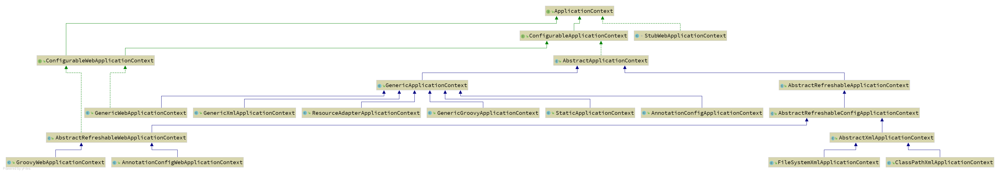

# 生命周期


**生命周期初始化回调Lifecycle Initalization Callbacks**

**@PostConstruct**

加在方法上

[官网文档](https://docs.spring.io/spring-framework/docs/current/reference/html/core.html#beans-factory-lifecycle)

bean放在单例池中，单例池在Spring容器中 (是个map)

map.getBean(XXX.class) 就是从单例池中获取bean

## bean创建流程总览

每一个步骤的前后都做了很多事情，这里只列举出主要的关键点

**1.实例化spring容器**

ApplicationContext 对象

**2.扫描符合spring bean规则的类，放到一个集合中**

**3.遍历这个集合中的类---封装为bd(beanDefinition )对象，put beanDefinitionMap**

**4.遍历beanDefinitionMap,得到bd对象**

**5.解析 ，验证**

**6.通过 由bd得到class对象**

**7.得到所有的构造方法--通过算法推断出合理的构造方法**

**8.通过这个合理的构造方法反射实例化一个对象，这是还不是bean**

**9.合并bd**

**10.提前保留工厂--循环依赖**

**11.注入属性--判断是否需要完成属性填充（即使是加了@Autowired）--自动注入**

**12.执行部分的aware接口**

​	是这三个aware:BeanNameAware
  BeanClassLoaderAware
  BeanFactoryAware

**13.执行部分的aware接口 Lifecycle callback annn(生命周期回调 注解版)**

**14.Lifecycle callback interface(生命周期回调 接口版)**

**15.aop 事件（如果有的话）**

**16.put singletonObjects  放到单例池中**

## 1.Spring容器

在Java代码层面来看就是一些类，这些类的共同父接口为ApplicationContext

实例化容器的几种方式：其中配置类这种最常用

```java
//配置类的方式构建Spring容器
AnnotationConfigApplicationContext ac1 = new AnnotationConfigApplicationContext(MainConfig.class);

//xml的方式
ClassPathXmlApplicationContext ac2 = new ClassPathXmlApplicationContext("xxx.xml");

//xml文件可以在任意路径
FileSystemXmlApplicationContext ac3 = new FileSystemXmlApplicationContext("xxx.xml");

//还有其他的方式
```




## 2.扫描

扫描符合spring bean规则的类，放到一个集合中


```java
public AnnotationConfigApplicationContext(Class<?>... componentClasses) {
    this();
    register(componentClasses);
    refresh();
}
```


执行完this()方法后：有5个Spring内置的bd对象 


执行完register(componentClasses);后：多出来配置类：


## 3.beanDefinition 


## 

BeanDefinition——**spring bean的建模对象**


