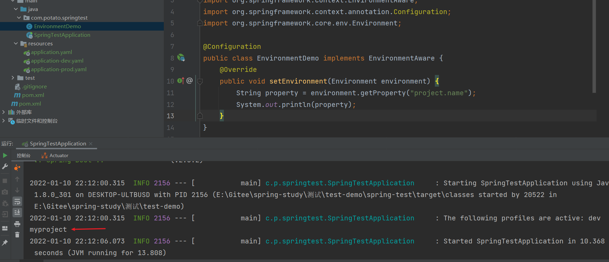
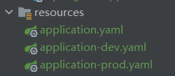

参考：

[Spring--Environment类 - 简书 (jianshu.com)](https://www.jianshu.com/p/5f10192eb958)

[Spring Environment（一）API 介绍 - binarylei - 博客园 (cnblogs.com)](https://www.cnblogs.com/binarylei/p/10280374.html)

# 简介

## Environment接口

spring-core jar包中的Environment接口，源码如下：

```java
public interface Environment extends PropertyResolver {
  
   String[] getActiveProfiles();

   String[] getDefaultProfiles();

   @Deprecated //弃用，用下面的方法代替，acceptsProfiles(Profiles profiles)
   boolean acceptsProfiles(String... profiles);

   boolean acceptsProfiles(Profiles profiles);

}
```

**Environment用来表示整个Spring应用运行时的环境**，为了更形象地理解Environment，你可以把Spring应用的运行时简单地想象成两个部分：**一个是Spring应用本身，一个是Spring应用所处的环境**。

Environment在容器中是一个抽象的集合，是指应用环境的2个方面：profiles和properties，从Environment接口中可以看出，里面的方法都和profiles有关。

PropertyResolver接口是占位符解析，具体可以看这篇文章：[Spring PropertyResolver 占位符解析（一）API 介绍 - binarylei - 博客园 (cnblogs.com)](https://www.cnblogs.com/binarylei/p/10284826.html)

### 具体使用

方式一：可以通过 @Autowired注入Environment

```java
@Autowired
private Environment environment;
```

方式二：还可以通过实现 implements EnvironmentAware 然后实现接口中的方法

```java
@Configuration
public class EnvironmentDemo implements EnvironmentAware {
    @Override
    public void setEnvironment(Environment environment) {
        String property = environment.getProperty("project.name");
        System.out.println(property);
    }
}
```

application.yaml:

```yaml
project:
  name: myproject
```


启动程序时，会执行里面的setEnviroment方法：



实际项目中常见的用法：在自定义多数据源时，可以通过从yaml文件中获取datasource信息

```java
@Autowired
private Environment environment;

@Bean
public DataSource druidDataSource() throws Exception {
  Properties props = new Properties();
  props.put("driverClassName", environment.getProperty("datasource.driverClassName"));
  props.put("url", environment.getProperty("datasource.url"));
  props.put("username", environment.getProperty("datasource.username"));
  props.put("password", environment.getProperty("datasource.password"));
  return DruidDataSourceFactory.createDataSource(props);
}
```

另外，关于acceptsProfiles方法的用法：

```java
获取是否使用profile的
public boolean isDev(){
    boolean devFlag = environment.acceptsProfiles("dev");
    return  devFlag;
}
```

## Profile

Profile：意为**配置文件**，只有激活的配置文件的组件/配置才会注册到 Spring 容器，类似于 maven 中 profile。

### profile的激活方式

默认方式：默认的：通过 "spring.profiles.default" 属性获取，如果没有配置默认值是 "default"

方式一：在Spring的xml

```xml
<context-param>
  <param-name>spring.profiles.active</param-name>
  <param-value>dev</param-value>
</context-param>
```


```xml
<beans>  
  <beans profile="dev">  
    <bean id="dataSource" class="...">  
    </bean>              
  </beans>  
  <beans profile="test">  
    <bean id="dataSource" class="...">  
    </bean>  
  </beans>   
</beans>  
```


方式二：**注解：@ActiveProfiles("dev")**

```java
@ActiveProfiles("produce")
public class TestActiveProfile {

    @Autowired
    private HelloService hs;
    
    @Test
    public void testProfile() throws Exception {
        String value = hs.sayHello();
        System.out.println(value);
    }
}
```


方式三：**application.yaml**或application.properties

```yaml
spring:
  profiles:
    active: dev
```

方式四：**指定JVM启动参数**

```
-Dspring.profiles.active=dev
```

方式五：通过Environmental中的API激活

这种方式一般用于复杂的逻辑中，或者在单元测试中

```java
AnnotationConfigApplicationContext context = new AnnotationConfigApplicationContext();
context.getEnvironment().setActiveProfiles("dev");
```

方式六：@ActiveProfiles("dev") ,这个注解是spring-test包下的，用于单元测试中

### Bean与指定的profile绑定

- 如果类级别上使用了@Profile("dev")，那么该类中的所有bean都会在profile为dev时创建。
- @Profile还可以与@Bean一起使用，标注在方法上面。

场景：想在不同的环境下，注册不同的Bean，比如可以按照环境分别创建数据库配置

```java
@Configuration
@Profile("dev")
public class DevDataSourceConfig {
  @Bean
  public DataSource devDataSource() {
    System.out.println("This is dev DataSource");

    BasicDataSource basicDataSource = new BasicDataSource();
    basicDataSource.setDriverClassName("com.mysql.jdbc.Driver");
    basicDataSource.setUrl("jdbc:mysql://localhost:3306/mybatis_action_db");
    basicDataSource.setUsername("dev");
    basicDataSource.setPassword("dev");

    return basicDataSource;
  }
}
```

### 配置文件绑与profile配定

我们开发中在application.yaml中有时会定义多个环境下的配置文件：



然后，可以在application.yaml中激活需要的profile：

```yaml
spring:
  profiles:
    active: dev
```


## Properties

properties属性可能来源于properties文件、JVM properties、system环境变量、JNDI、servlet context parameters上下文参数、专门的properties对象，Maps等等。Environment对象的作用，对于properties来说，是提供给用户方便的服务接口、方便撰写配置、方便解析配置。

- 配置属性源。
- 从属性源中获取属性。
  容器（ApplicationContext）所管理的bean如果想直接使用Environment对象访问profile状态或者获取属性，可以有两种方式
  （1）实现EnvironmentAware接口。
  （2）@Inject或者@Autowired一个Environment对象。
  绝大数情况下，bean都不需要直接访问Environment对象，而是通过类似@Value注解的方式把属性值注入进来。

```java
//获取
@Test
public void test() {
    Environment env = new StandardEnvironment();//或者通过依赖注入获取
    // 1. 操作系统的环境变量
    Map<String, Object> systemEnvironment = ((StandardEnvironment) env).getSystemEnvironment();
    Assert.assertNotNull(systemEnvironment);

    // 2. JVM 属性配置
    Map<String, Object> systemProperties = ((StandardEnvironment) env).getSystemProperties();
    Assert.assertNotNull(systemProperties);

    // 3. 属性
    Assert.assertEquals("UTF-8", env.getProperty("file.encoding"));
    Assert.assertTrue(env.containsProperty("file.encoding"));

    // 4. 剖面 spring.profiles.default(默认为 default) spring.profiles.active
    //    只要有一个返回 true acceptsProfiles 方法就返回 true，!a 为不包含该 profiles
    Assert.assertTrue(env.acceptsProfiles("default"));
    Assert.assertTrue(env.acceptsProfiles("a", "default"));
    Assert.assertFalse(env.acceptsProfiles("a"));
    Assert.assertTrue(env.acceptsProfiles("!a", "b"));
}
```


# Environment 生命周期

[Spring Environment（三）生命周期 - binarylei - 博客园 (cnblogs.com)](https://www.cnblogs.com/binarylei/p/10291323.html)

## Environment 初始化

每个 ApplicationContext 容器初始化时都会执行 ApplicationContext#refresh() 方法，这个方法的第一步就是 prepareRefresh 方法。

```java
protected void prepareRefresh() {
    // 1. 初始化一个 Environment 并注入数据源
    initPropertySources();
    // 2. 对必要的属性进行校验
    getEnvironment().validateRequiredProperties();
}

@Override
protected void initPropertySources() {
    // 1. 获取 Environment 实例
    ConfigurableEnvironment env = getEnvironment();
    // 2. 如果是 WEB 环境需要注入 ServletContext 和 servletConfig 数据源
    if (env instanceof ConfigurableWebEnvironment) {
        ((ConfigurableWebEnvironment) env).initPropertySources(this.servletContext, this.servletConfig);
    }
}
```

AbstractApplicationContext#getEnvironment() 方法默认是创建一个 StandardEnvironment，只注入了 OS 和 JVM 相关的属性。

```java
@Override
public ConfigurableEnvironment getEnvironment() {
    if (this.environment == null) {
        this.environment = createEnvironment();
    }
    return this.environment;
}
protected ConfigurableEnvironment createEnvironment() {
    return new StandardEnvironment();
}
```

## WEB 环境下 Environment 初始化

WEB 启动时会初始化两个容器，一个是 ROOT WebApplicationContext；一个是 Servlet WebApplicationContext。这两个容器分别是在启动 ContextLoaderListener 和 DispatcherServlet 时初始化的。

### ROOT WebApplicationContext

**(1) XmlWebApplicationContext**

ROOT WebApplicationContext 默认实现类是 XmlWebApplicationContext，是在和 ContextLoader 同级目录的 ContextLoader.properties 文件中配置的。获取其实现类方法如下：

```java
protected Class<?> determineContextClass(ServletContext servletContext) {
    String contextClassName = servletContext.getInitParameter(CONTEXT_CLASS_PARAM);
    if (contextClassName != null) {           
        return ClassUtils.forName(contextClassName, ClassUtils.getDefaultClassLoader());            
    } else {
        contextClassName = defaultStrategies.getProperty(WebApplicationContext.class.getName());            
        return ClassUtils.forName(contextClassName, ContextLoader.class.getClassLoader());        
    }
}
```

XmlWebApplicationContext 的父类 AbstractRefreshableWebApplicationContext 重写了 createEnvironment 方法，返回 StandardServletEnvironment 对象。

```java
@Override
protected ConfigurableEnvironment createEnvironment() {
    return new StandardServletEnvironment();
}
```

**Spring 调用 refresh 时就会执行 initPropertySources 方法将 ServletContext、ServletConfig 属性注入到 Environment 中，但为了保证 refresh 之前就可以通过 Environment 获取这些属性会提前注入。**

**(2) 提前执行 initPropertySources**

```
public WebApplicationContext initWebApplicationContext(ServletContext servletContext) {
    if (this.context == null) {
        this.context = createWebApplicationContext(servletContext);
    }
    if (this.context instanceof ConfigurableWebApplicationContext) {
        ConfigurableWebApplicationContext cwac = (ConfigurableWebApplicationContext) this.context;
        if (!cwac.isActive()) {
            // 1. 配置父容器，如果有
            if (cwac.getParent() == null) {
                ApplicationContext parent = loadParentContext(servletContext);
                cwac.setParent(parent);
            }
            // 2. 配置并启动容器 refresh
            configureAndRefreshWebApplicationContext(cwac, servletContext);
        }
    }
}

protected void configureAndRefreshWebApplicationContext(
    ConfigurableWebApplicationContext wac, ServletContext sc) {      
    // 省略...

    // #refresh 调用之前将 ServletContext 注入到 Environment 中，这样就可以提前使用
    ConfigurableEnvironment env = wac.getEnvironment();
    if (env instanceof ConfigurableWebEnvironment) {
        ((ConfigurableWebEnvironment) env).initPropertySources(sc, null);
    }

    customizeContext(sc, wac);
    wac.refresh();
}
```

### Servlet WebApplicationContext

DispatcherServlet 继承自 HttpServlet，初始化时会执行对应的 init() 方法，也会创建一个 WebApplicationContext。其默认的实现类也是 XmlWebApplicationContext。

**(1) 创建 WebApplicationContext**

```java
protected WebApplicationContext initWebApplicationContext() {
    WebApplicationContext rootContext =
            WebApplicationContextUtils.getWebApplicationContext(getServletContext());
    WebApplicationContext wac = null;
    // 省略... 
    if (wac == null) {
        // 创建 WebApplicationContext
        wac = createWebApplicationContext(rootContext);
    }
    if (!this.refreshEventReceived) {
        synchronized (this.onRefreshMonitor) {
            onRefresh(wac);
        }
    }
    return wac;
}

protected WebApplicationContext createWebApplicationContext(@Nullable ApplicationContext parent) {
    Class<?> contextClass = getContextClass();
    ConfigurableWebApplicationContext wac =
            (ConfigurableWebApplicationContext) BeanUtils.instantiateClass(contextClass);
    // 设置 Environment 环境变量
    wac.setEnvironment(getEnvironment());
    wac.setParent(parent);
    String configLocation = getContextConfigLocation();
    if (configLocation != null) {
        wac.setConfigLocation(configLocation);
    }
    configureAndRefreshWebApplicationContext(wac);
    return wac;
}
```

**(2) 提前执行 initPropertySources**

和 ROOT WebApplicationContext 类似，也会提前将 ServletContext 和 ServletConfig 提前注入到 Environment 变量中。

```java
protected void configureAndRefreshWebApplicationContext(ConfigurableWebApplicationContext wac) {
    ConfigurableEnvironment env = wac.getEnvironment();
    if (env instanceof ConfigurableWebEnvironment) {
        ((ConfigurableWebEnvironment) env).initPropertySources(getServletContext(), getServletConfig());
    }

    postProcessWebApplicationContext(wac);
    applyInitializers(wac);
    wac.refresh();
}
```


1