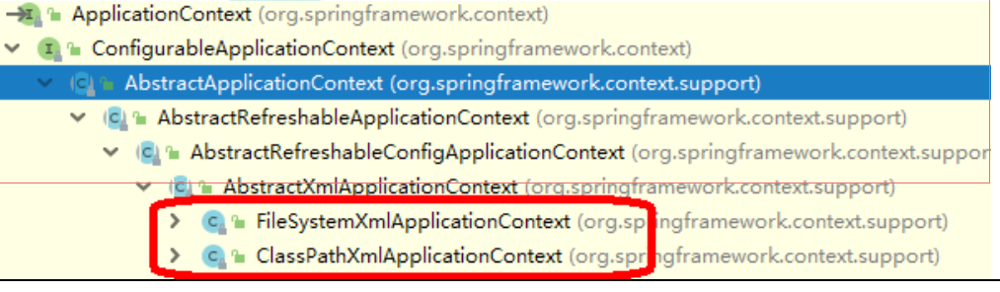
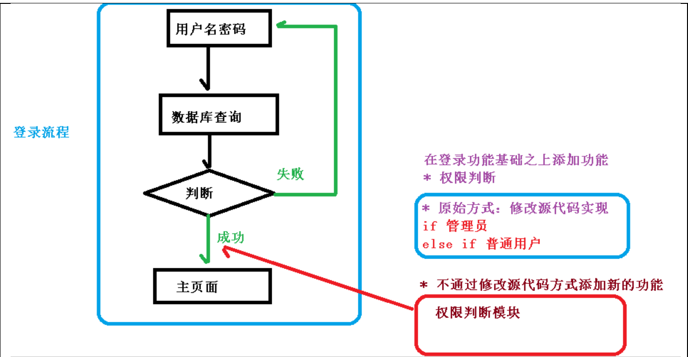
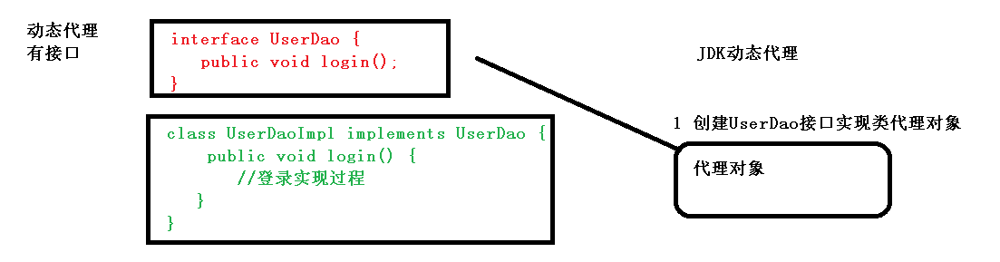
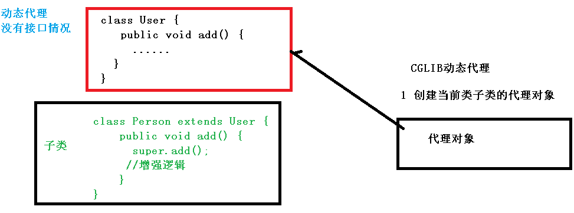
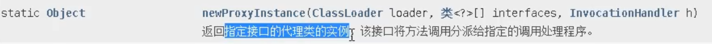
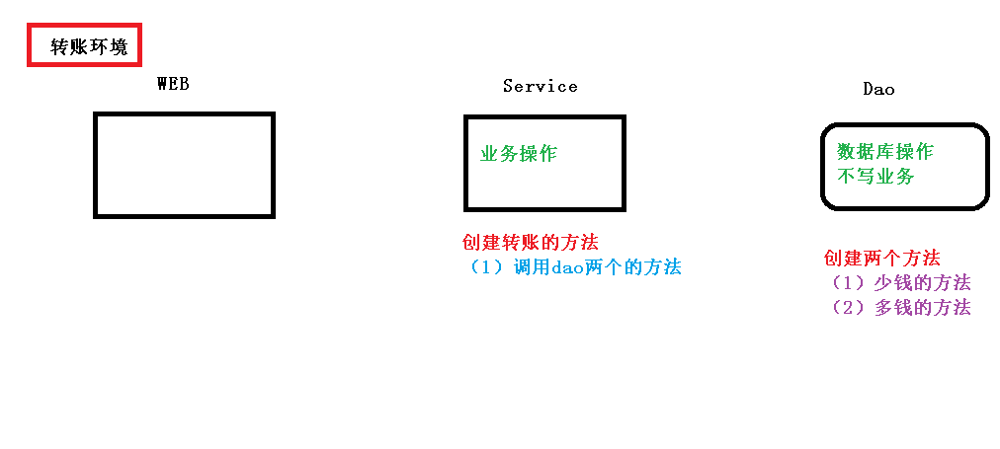

# 第一章 入门案例

## 1.下载Spring5

官网：spring.io 选稳定版

下载地址https://repo.spring.io/release/org/springframework/spring

导入jar包


创建普通的类，在这个类创建普通方法

```java
public class User {
    public void add(){
        System.out.println("add...");
    }
}
```

创建spring配置文件，配置文件中配置创建的对象

（1）使用xml格式

bean1.xml

```xml
<?xml version="1.0" encoding="UTF-8"?>
<beans xmlns="http://www.springframework.org/schema/beans"
       xmlns:xsi="http://www.w3.org/2001/XMLSchema-instance"
       xsi:schemaLocation="http://www.springframework.org/schema/beans http://www.springframework.org/schema/beans/spring-beans.xsd">
<!--配置User对象创建-->
    <bean id="user" class="com.atguigu.spring5.User"></bean>
</beans>
```

进行测试代码编写

```java
import com.atguigu.spring5.User;
import org.junit.Test;
import org.springframework.context.ApplicationContext;
import org.springframework.context.support.ClassPathXmlApplicationContext;

public class TestSpring5 {
    @Test
    public void testAdd(){
        //1.加载spring配置文件
        ApplicationContext context = new ClassPathXmlApplicationContext("bean1.xml");
        //2.获取配置文件对象
        User user = context.getBean("user", User.class);
        System.out.println(user);
        user.add();
    }
}
```


# 第二章 IOC概念和原理

## 1、什么是 IOC

（1）控制反转，把对象创建和对象之间的调用过程，交给 Spring 进行管理

（2）使用 IOC 目的：为了耦合度降低

（3）做入门案例就是 IOC 实现

## 2、IOC 底层原理

（1）xml 解析、工厂模式、反射


## 3、画图讲解 IOC 底层原理


## 4.IOC（BeanFactory接口）

1、IOC 思想基于 IOC 容器完成，IOC 容器底层就是对象工厂

2、Spring 提供 IOC 容器实现两种方式：（两个接口）

（1）**BeanFactory**：IOC 容器基本实现，是 Spring 内部的使用接口，**不提供开发人员进行使用**

-  **加载配置文件时候不会创建对象，在获取对象（使用）才去创建对象**

（2）**ApplicationContext**：BeanFactory 接口的子接口，提供更多更强大的功能，**一般由开发人员进行使用**

- **加载配置文件时候就会把在配置文件对象进行创建**

3、ApplicationContext 接口有实现类



## 5.**IOC** **操作** **Bean** 管理（概念）

1、什么是 **Bean** 管理

（0）Bean 管理指的是两个操作

（1）Spring 创建对象

（2）Spirng 注入属性

2、Bean 管理操作有两种方式

（1）基于 xml 配置文件方式实现

（2）基于注解方式实现

## 6.**IOC** **操作** **Bean** **管理（基于** **xml** **方式）**

### 1、**基于 xml 方式创建对象**

```xml
<!--配置User对象创建-->
    <bean id="user" class="com.atguigu.spring5.User"></bean>
```

（1）在 spring 配置文件中，使用 bean 标签，标签里面添加对应属性，就可以实现对象创建

（2）在 bean 标签有很多属性，介绍常用的属性

\* **id 属性**：唯一标识

\* **class 属性**：类全路径（包类路径）

name属性：和id类似（不常用）

（3）创建对象时候，默认也是执行无参数构造方法完成对象创建

### **2、基于xml 方式注入属性**

**（1）DI：依赖注入，就是注入属性**

```java
public class Book {
    private String bname;

    public void setBname(String bname) {
        this.bname = bname;
    }
//set方法注入
    public static void main(String[] args) {
        Book book = new Book();
        book.setBname("11");
    }
}
//-------------------------------------------
public class Book {
    private String bname;
    public Book(String bname) {
        this.bname = bname;
    }
    //有参构造注入
    public static void main(String[] args) {
        Book book = new Book("22");
    }
}
```


### **3、第一种注入方式：使用 set 方法进行注入**

（1）创建类，定义属性和对应的 set 方法

```java
/**
 * 演示使用set方法进行注入属性
 */
public class Book {
    //创建属性
    private String bname;
    private String bauthor;

    //创建属性对应的set方法
    public void setBname(String bname) {
        this.bname = bname;
    }
    public void setBauthor(String bauthor) {
        this.bauthor = bauthor;
    }
}
```

（2）在 spring 配置文件配置对象创建，配置属性注入

```xml
<!--2. set方法注入属性-->
    <bean id="book" class="com.atguigu.spring5.Book">
    <!--使用property完成属性注入
        name:类里面属性名称
        value:向属性注入的值
    -->
        <property name="bname" value="易筋经"></property>
        <property name="bauthor" value="达摩老祖"></property>
    </bean>
```

测试一下：

```java
@Test
public void testBook1(){
    //1.加载spring配置文件
    ApplicationContext context = new ClassPathXmlApplicationContext("bean1.xml");
    //2.获取配置文件对象
    Book book = context.getBean("book", Book.class);
    System.out.println(book);
    book.testDemo();
}
```

### **4、第二种注入方式：使用有参数构造进行注入**

（1）创建类，定义属性，创建属性对应有参数构造方法

```java
/**
 * 有参构造注入
 */
public class Orders {
    private String oname;
    private String address;
    public Orders(String oname, String address) {
        this.oname = oname;
        this.address = address;
    }
}
```

（2）在 spring 配置文件配置对象创建，配置属性注入

```java
<!--    3.有参构造注入属性-->
    <bean id="orders" class="com.atguigu.spring5.Orders">
        <constructor-arg name ="oname" value="电脑"></constructor-arg>
        <constructor-arg name ="address" value="China"></constructor-arg>
    </bean>
```

测试一下：

```java
@Test
public void testOrders(){
    //1.加载spring配置文件
    ApplicationContext context = new ClassPathXmlApplicationContext("bean1.xml");
    //2.获取配置文件对象
    Orders orders = context.getBean("orders", Orders.class);
    System.out.println(orders);
    orders.orderTest();
}
```

### 5.p名称空间注入（了解）

（1）使用 p 名称空间注入，可以简化基于 xml 配置方式

第一步 添加 p 名称空间在配置文件中

```xml
xmlns:p="http://www.springframework.org/schema/p"
```

第二步 进行属性注入，在 bean 标签里面进行操作

```xml
<bean id="book" class="com.atguigu.spring5.Book" p:bname="九阳神功" p:bauthor="无名氏"></bean>
```

### 6.**IOC** **操作** **Bean** 管理（xm注入其他类型属性）

#### 1、字面量

（1）null 值

```xml
<!--null值-->
<property name="address">
    <null/>
</property>
```

（2）属性值包含特殊符号

```xml
        <!--属性值包含特殊符号
                1.把<>进行转义&lt;&gt;
                2.把特殊符号内容写到CDATA
        -->
        <property name="address">
            <value><![CDATA[<<南京>>]]]]></value>
        </property>
```

#### 2、注入属性-外部bean

（1）创建两个类 service 类和 dao 类

```java
package com.atguigu.spring5.dao;

public interface UserDao {
    public void update();
}
package com.atguigu.spring5.dao;
//-----------------------------------
public class UserDaoImpl implements UserDao {

    @Override
    public void update() {
        System.out.println("dao update...");
    }
}

```

（2）在 service 调用 dao 里面的方法

```java
package com.atguigu.spring5.service;

import com.atguigu.spring5.dao.UserDao;
import com.atguigu.spring5.dao.UserDaoImpl;

public class UserService {
    public void add(){
        System.out.println("service add...");
        //原始方式 创建UserDao对象
//        UserDao userDao = new UserDaoImpl();
//        userDao.update();
    }
}
```

（3）在 spring 配置文件中进行配置

```java
public class UserService {
    //1.创建UserDao类型属性，生成set方法
    private UserDao userDao;
    public void setUserDao(UserDao userDao) {
        this.userDao = userDao;
    }

    public void add(){
        System.out.println("service add...");
        userDao.update();
    }
}
```

```xml
<?xml version="1.0" encoding="UTF-8"?>
<beans xmlns="http://www.springframework.org/schema/beans"
       xmlns:xsi="http://www.w3.org/2001/XMLSchema-instance"
       xmlns:p="http://www.springframework.org/schema/p"
       xsi:schemaLocation="http://www.springframework.org/schema/beans http://www.springframework.org/schema/beans/spring-beans.xsd">
<!--1.service和dao对象创建-->
    <bean id="userService" class="com.atguigu.spring5.service.UserService">
<!--    注入userDao对象,name：类里面的属性名称  ref:创建userDao对象bean标签id值-->
        <property name="userDao" ref="userDaoImpl"></property>
    </bean>
    <bean id="userDaoImpl" class="com.atguigu.spring5.dao.UserDaoImpl">
    </bean>
</beans>
```

测试

```java
@Test
public void testAdd(){
    //1.加载spring配置文件
    ApplicationContext context = new ClassPathXmlApplicationContext("bean2.xml");
    //2.获取配置文件对象
    UserService userService = context.getBean("userService", UserService.class);
    userService.add();
}
```

#### 3、注入属性-内部bean和级联赋值

（1）一对多关系：部门和员工一个部门有多个员工，一个员工属于一个部门部门是一，员工是多

（2）**在实体类之间表示一对多关系**，员工表示所属部门，使用对象类型属性进行表示

```java
//部门类
public class Dept {
    private String dname;
    public void setDname(String dname) {this.dname = dname;}
}
//员工类
public class Emp {
    private String ename;
    private String gender;
    //员工属于某一个部门，使用对象形式表示
    private Dept dept;
    public void setDept(Dept dept) {this.dept = dept;}
    public void setEname(String ename) {this.ename = ename;}
    public void setGender(String gender) {this.gender = gender;}
}
```

（3）在 spring 配置文件中进行配置

```xml
<!--    内部bean-->
    <bean id="emp" class="com.atguigu.spring5.bean.Emp">
<!--        先设置两个普通的属性-->
        <property name="ename" value="lucy"></property>
        <property name="gender" value="女"></property>
<!--        设置对象类型属性-->
        <property name="dept">
            <bean id="dept" class="com.atguigu.spring5.bean.Dept">
                <property name="dname" value="保安部"></property>
            </bean>
        </property>
    </bean>
```

测试

```java
    @Test
    public void testBean2(){
        //1.加载spring配置文件
        ApplicationContext context = new ClassPathXmlApplicationContext("bean3.xml");
        //2.获取配置文件对象
        Emp emp = context.getBean("emp", Emp.class);
        emp.add();
    }
```

#### 4、注入属性-级联赋值 

**（1）第一种写法** 

```xml
<?xml version="1.0" encoding="UTF-8"?>
<beans xmlns="http://www.springframework.org/schema/beans"
       xmlns:xsi="http://www.w3.org/2001/XMLSchema-instance"
       xmlns:p="http://www.springframework.org/schema/p"
       xsi:schemaLocation="http://www.springframework.org/schema/beans http://www.springframework.org/schema/beans/spring-beans.xsd">
<!--    级联赋值-->
    <bean id="emp" class="com.atguigu.spring5.bean.Emp">
<!--        先设置两个普通的属性-->
        <property name="ename" value="lucy"></property>
        <property name="gender" value="女"></property>
<!--        级联赋值-->
        <property name="dept" ref="dept"></property>
    </bean>
    <bean id="dept" class="com.atguigu.spring5.bean.Dept">
        <property name="dname" value="财务部"></property>
    </bean>
</beans>
```

```java
@Test
public void testBean3(){
    //1.加载spring配置文件
    ApplicationContext context = new ClassPathXmlApplicationContext("bean4.xml");
    //2.获取配置文件对象
    Emp emp = context.getBean("emp", Emp.class);
    emp.add();
}
```

（2）第二种写法

```java
//生成dept的get方法
public Dept getDept() {
    return dept;
}
```

```xml
<?xml version="1.0" encoding="UTF-8"?>
<beans xmlns="http://www.springframework.org/schema/beans"
       xmlns:xsi="http://www.w3.org/2001/XMLSchema-instance"
       xmlns:p="http://www.springframework.org/schema/p"
       xsi:schemaLocation="http://www.springframework.org/schema/beans http://www.springframework.org/schema/beans/spring-beans.xsd">
<!--    级联赋值-->
    <bean id="emp" class="com.atguigu.spring5.bean.Emp">
<!--        先设置两个普通的属性-->
        <property name="ename" value="lucy"></property>
        <property name="gender" value="女"></property>
<!--        级联赋值-->
        <property name="dept" ref="dept"></property>
        <property name="dept.dname" value="技术部"></property>
    </bean>
    <bean id="dept" class="com.atguigu.spring5.bean.Dept">
        <property name="dname" value="财务部"></property>
    </bean>
</beans>
```

#### 5、IOC操作Bean管理（xml注入集合属性）

**1、注入数组类型属性**

**2、注入List集合类型属性**

**3、注入Map集合类型属性**

（1）创建类，定义数组、list、map、set 类型属性，生成对应 set 方法

```java
public class Stu {
    //1.数组类型属性
    private String[] courses;
    //2.list类型属性
    private List<String> list;
    //3.map集合类型属性
    private Map<String,String> maps;
    //4.set集合类型属性
    private Set<String> sets;

    public void setSets(Set<String> sets) {
        this.sets = sets;
    }
    public void setCourses(String[] courses) {
        this.courses = courses;
    }
    public void setList(List<String> list) {
        this.list = list;
    }
    public void setMaps(Map<String, String> maps) {
        this.maps = maps;
    }
}
```

（2）在 spring 配置文件进行配置

```xml
<?xml version="1.0" encoding="UTF-8"?>
<beans xmlns="http://www.springframework.org/schema/beans"
       xmlns:xsi="http://www.w3.org/2001/XMLSchema-instance"
       xmlns:p="http://www.springframework.org/schema/p"
       xsi:schemaLocation="http://www.springframework.org/schema/beans http://www.springframework.org/schema/beans/spring-beans.xsd">
<!--1.配置User对象创建-->
    <bean id="stu" class="com.atguigu.spring5.collectiontype.Stu">
        <!--数组类型属性注入-->
        <property name="courses">
            <array>
                <value>java课程</value>
                <value>数据库课程</value>
            </array>
        </property>
        <!--list类型属性注入-->
        <property name="list">
            <list>
                <value>张三</value>
                <value>小三</value>
            </list>
        </property>
        <!--map类型属性注入-->
        <property name="maps">
            <map>
                <entry key="JAVA" value="java"></entry>
                <entry key="PHP" value="php"></entry>
            </map>
        </property>
        <!--set类型属性注入-->
        <property name="sets">
            <set>
                <value>MySQL</value>
                <value>Redis</value>
            </set>
        </property>
    </bean>
</beans>
```

测试

```java
@Test
public void testCollection(){
    ApplicationContext context = new ClassPathXmlApplicationContext("bean1.xml");
    Stu stu = context.getBean("stu", Stu.class);
    stu.test();
}
```
4、在集合里面设置对象类型值

```xml
<!--创建多个course对象-->
<bean id="course1" class="com.atguigu.spring5.collectiontype.Course">
    <property name="cname" value="Spring5框架"></property>
</bean>
<bean id="course2" class="com.atguigu.spring5.collectiontype.Course">
    <property name="cname" value="MyBatis框架"></property>
</bean>

<!--注入list集合类型，值是对象-->
<property name="courseList">
    <list>
        <ref bean="course1"></ref>
        <ref bean="course2"></ref>
    </list>
</property>
```


5、把集合注入部分提取出来

（1）在 spring 配置文件中引入名称空间 util

```xml
<?xml version="1.0" encoding="UTF-8"?>
<beans xmlns="http://www.springframework.org/schema/beans"
       xmlns:xsi="http://www.w3.org/2001/XMLSchema-instance"
       xmlns:util="http://www.springframework.org/schema/util"
       xsi:schemaLocation="http://www.springframework.org/schema/beans http://www.springframework.org/schema/beans/spring-beans.xsd
                           http://www.springframework.org/schema/util http://www.springframework.org/schema/beans/spring-util.xsd">

</beans>
```

（2）使用 util 标签完成 list 集合注入提取

```xml
<?xml version="1.0" encoding="UTF-8"?>
<beans xmlns="http://www.springframework.org/schema/beans"
       xmlns:xsi="http://www.w3.org/2001/XMLSchema-instance"
       xmlns:util="http://www.springframework.org/schema/util"
       xsi:schemaLocation="http://www.springframework.org/schema/beans http://www.springframework.org/schema/beans/spring-beans.xsd
                           http://www.springframework.org/schema/util http://www.springframework.org/schema/beans/spring-util.xsd">
    <!--1.提取list集合类型属性注入-->
    <util:list id="bookList">
        <value>易筋经</value>
        <value>九阴真经</value>
        <value>九阳神功</value>
    </util:list>
    <!--2.-->
    <bean id="book" class="com.atguigu.spring5.collectiontype.Book">
        <property name="list" ref="bookList"></property>
    </bean>
</beans>
```

测试

```java
@Test
public void testCollection2(){
    ApplicationContext context = new ClassPathXmlApplicationContext("bean2.xml");
    Book book = context.getBean("book", Book.class);
    book.test();
}
```

## 7.IOC操作管理（FactoryBean）

1、Spring有两种类型bean，一种**普通bean**，另外一种**工厂bean**（FactoryBean）

2、普通bean：在**配置文件中定义bean类型就是返回类型**

3、工厂bean：在**配置文件定义bean类型可以和返回类型不一样**

第一步 创建类，让这个类作为工厂 bean，实现接口 FactoryBean

第二步 实现接口里面的方法，在实现的方法中定义返回的 bean 类型

```java
package com.atguigu.spring5.factorybean;

import com.atguigu.spring5.collectiontype.Course;
import org.springframework.beans.factory.FactoryBean;

public class MyBean implements FactoryBean<Course> {
    //定义返回bean
    @Override
    public Course getObject() throws Exception {
        Course course = new Course();
        course.setCname("abc");
        return course;
    }

    @Override
    public Class<?> getObjectType() {
        return null;
    }

    @Override
    public boolean isSingleton() {
        return false;
    }
}
//测试
    @Test
    public void test3(){
        ApplicationContext context = new ClassPathXmlApplicationContext("bean3.xml");
        Course course = context.getBean("myBean", Course.class);
        System.out.println(course);
    }
```

```xml
<bean id="myBean" class="com.atguigu.spring5.factorybean.MyBean">

</bean>
```

## 8.IOC 操作 Bean 管理（bean 作用域）

1、在 Spring 里面，设置创建 bean 实例是单实例还是多实例

2、在 Spring 里面，**默认情况下，bean 是单实例对象**

```java
@Test
public void testCollection2(){
    ApplicationContext context = new ClassPathXmlApplicationContext("bean2.xml");
    Book book1 = context.getBean("book", Book.class);
    Book book2 = context.getBean("book", Book.class);
    System.out.println(book1);
    System.out.println(book2);
    //com.atguigu.spring5.collectiontype.Book@5d11346a
	//com.atguigu.spring5.collectiontype.Book@5d11346a
}
```

3、如何设置单实例还是多实例
（1）在 spring 配置文件 **bean 标签里面有属性（scope）**用于设置单实例还是多实例
（2）**scope 属性值**
第一个值 默认值，singleton，表示是单实例对象
第二个值 prototype，表示是多实例对象

```xml
<bean id="book" class="com.atguigu.spring5.collectiontype.Book" scope="prototype">
        <property name="list" ref="bookList"></property>
    </bean>
//com.atguigu.spring5.collectiontype.Book@5d11346a
//com.atguigu.spring5.collectiontype.Book@7a36aefa
```

（3）singleton 和 prototype 区别
第一 **singleton 单实例**，**prototype 多实例**
第二 设置 scope 值是 singleton 时候，**加载 spring 配置文件时候就会创建单实例对象**;
 设置 scope 值是 prototype 时候，不是在加载 spring 配置文件时候创建 对象，在**调用getBean 方法时候创建多实例对象**

request

ression

## 10.IOC 操作 Bean 管理（bean 生命周期）

1、生命周期
（1）从对象创建到对象销毁的过程
2、bean 生命周期
（1）通过构造器创建 bean 实例（无参数构造）
（2）为 bean 的属性设置值和对其他 bean 引用（调用 set 方法）
（3）调用 bean 的初始化的方法（需要进行配置初始化的方法）
（4）bean 可以使用了（对象获取到了）
（5）当容器关闭时候，调用 bean 的销毁的方法（需要进行配置销毁的方法）
3、演示 bean 生命周期

```java
package com.atguigu.spring5.bean;

public class Orders {
    private String oname;

    public Orders() {
        System.out.println("第一步 执行无参构造创建bean实例");
    }

    public void setOname(String oname) {
        this.oname = oname;
        System.out.println("第二步 调用set方法设置属性值");
    }
    //创建执行的初始化方法
    public void initMethod(){
        System.out.println("第三步 执行初始化的方法");
    }

    //创建执行的销毁方法
    public void destorytMethod(){
        System.out.println("第五步 执行销毁的方法");
    }
}
```

```xml
<bean id="orders" class="com.atguigu.spring5.bean.Orders" init-method="initMethod" destroy-method="destorytMethod">
    <property name="oname" value="手机"></property>
</bean>
```

```java
    @Test
    public void test4(){
//        ApplicationContext context = new ClassPathXmlApplicationContext("bean4.xml");
        ClassPathXmlApplicationContext context = new ClassPathXmlApplicationContext("bean4.xml");
        Orders orders = context.getBean("orders", Orders.class);
        System.out.println("第四步 获取创建bean实例对象");
        System.out.println(orders);
        //手动让bean实例销毁
        context.close();
    }
```

```
第一步 执行无参构造创建bean实例
第二步 调用set方法设置属性值
第三步 执行初始化的方法
第四步 获取创建bean实例对象
com.atguigu.spring5.bean.Orders@192d3247
第五步 执行销毁的方法
```

4、bean 的后置处理器，bean 生命周期有七步
（1）通过构造器创建 bean 实例（无参数构造）
（2）为 bean 的属性设置值和对其他 bean 引用（调用 set 方法）
（3）把 bean 实例传递 bean 后置处理器的方法 **postProcessBeforeInitialization** 
（4）调用 bean 的初始化的方法（需要进行配置初始化的方法）
（5）把 bean 实例传递 bean 后置处理器的方法 **postProcessAfterInitialization**
（6）bean 可以使用了（对象获取到了）
（7）当容器关闭时候，调用 bean 的销毁的方法（需要进行配置销毁的方法）
5、演示添加后置处理器效果
（1）创建类，实现接口 BeanPostProcessor，创建后置处理器

```java
package com.atguigu.spring5.bean;

import org.springframework.beans.BeansException;
import org.springframework.beans.factory.config.BeanPostProcessor;

public class MyBeanPost implements BeanPostProcessor {
    @Override
    public Object postProcessBeforeInitialization(Object bean, String beanName) throws BeansException {
        System.out.println("在初始化之前执行的方法");
        return bean;
    }

    @Override
    public Object postProcessAfterInitialization(Object bean, String beanName) throws BeansException {
        System.out.println("在初始化之后执行的方法");
        return bean;
    }
}
```

```xml
<!--配置后置处理器-->
<bean id="myBeanPost" class="com.atguigu.spring5.bean.MyBeanPost"></bean>
```

```
第一步 执行无参构造创建bean实例
第二步 调用set方法设置属性值
在初始化之前执行的方法
第三步 执行初始化的方法
在初始化之后执行的方法
第四步 获取创建bean实例对象
com.atguigu.spring5.bean.Orders@43bd930a
第五步 执行销毁的方法
```

## 11.IOC 操作 Bean 管理（xml 自动装配）

1、什么是自动装配
（1）根据指定装配规则（**属性名称或者属性类型**），Spring 自动将匹配的属性值进行注入
2、演示自动装配过程
（1）根据属性名称自动注入

```java
package com.atguigu.spring5.autowire;

public class Emp {
    private Dept dept;

    public void setDept(Dept dept) {
        this.dept = dept;
    }

    @Override
    public String toString() {
        return "Emp{" +
                "dept=" + dept +
                '}';
    }
    public void test(){
        System.out.println(dept);
    }
}
package com.atguigu.spring5.autowire;

public class Dept {
    @Override
    public String toString() {
        return "Dept{}";
    }
}

```


```xml
    <!--实现自动装配
        bean标签属性值autowire，配置自动装配
        autowire属性值常用两个：
            byName根据属性名称注入 ，注入值的bean的id值和类属性名称一样
            byType根据属性类型注入
    -->
    <bean id="emp" class="com.atguigu.spring5.autowire.Emp" autowire="byName">
    </bean>
    <bean id="dept" class="com.atguigu.spring5.autowire.Dept"></bean>
```
（2）根据属性类型自动注入
```xml
   <bean id="emp" class="com.atguigu.spring5.autowire.Emp" autowire="byType">
    </bean>
```

## 12.IOC 操作 Bean 管理(外部属性文件)

1、直接配置数据库信息
（1）配置德鲁伊连接池
（2）引入德鲁伊连接池依赖 jar 包

```xml
<!--直接配置连接池-->
<bean id="dataSource" class="com.alibaba.druid.pool.DruidDataSource">
 <property name="driverClassName" value="com.mysql.jdbc.Driver"></property>
 <property name="url" 
value="jdbc:mysql://localhost:3306/userDb"></property>
 <property name="username" value="root"></property>
 <property name="password" value="root"></property>
</bean>
```

2、引入外部属性文件配置数据库连接池
（1）创建外部属性文件，properties 格式文件，写数据库信息

jdbc.properties

```properties
prop.driverClass=com.mysql.jdbc.Driver
prop.url=jdbc:mysql://localhost:3306/userDb
prop.userName=root
prop.password=root
```

（2）把外部 properties 属性文件引入到 spring 配置文件中

* 引入 context 名称空间

  ```xml
  <?xml version="1.0" encoding="UTF-8"?>
  <beans xmlns="http://www.springframework.org/schema/beans"
         xmlns:xsi="http://www.w3.org/2001/XMLSchema-instance"
         xmlns:util="http://www.springframework.org/schema/util"
         xmlns:context="http://www.springframework.org/schema/context"
         xsi:schemaLocation="http://www.springframework.org/schema/beans http://www.springframework.org/schema/beans/spring-beans.xsd
                             http://www.springframework.org/schema/util http://www.springframework.org/schema/util/spring-util.xsd
                             http://www.springframework.org/schema/context http://www.springframework.org/schema/context/spring-context.xsd">
   
  ```
  在 spring 配置文件使用标签引入外部属性文件

  ```xml
      <!--引入外部属性文件-->
      <context:property-placeholder location="classpath:jdbc.properties"/>
      <!--配置连接池-->
      <bean id="dataSource" class="com.alibaba.druid.pool.DruidDataSource">
          <property name="driverClassName" value="${jdbc.driverclass}"></property>
          <property name="url" value="${jdbc.url}"></property>
          <property name="username" value="${jdbc.username}"></property>
          <property name="password" value="${jdbc.password}"></property>
      </bean>
  ```

  

## 13.IOC 操作 Bean 管理(基于注解方式)

### 1、什么是注解

（1）注解是代码特殊标记，格式：@注解名称(属性名称=属性值, 属性名称=属性值..)
（2）使用注解，注解作用在类上面，方法上面，属性上面
（3）使用注解目的：简化 xml 配置

### 2、Spring 针对 Bean 管理中创建对象提供注解

（1）**@Component**
（2）**@Service**
（3）**@Controller**
（4）**@Repository**

* 上面四个注解功能是一样的，都可以用来创建 bean 实例

### 3、基于注解方式实现对象创建

第一步 引入依赖

spring-aop-5.2.6.RELEASE.jar

第二步 开启组件扫描

```xml
<?xml version="1.0" encoding="UTF-8"?>
<beans xmlns="http://www.springframework.org/schema/beans"
       xmlns:xsi="http://www.w3.org/2001/XMLSchema-instance"
       xmlns:p="http://www.springframework.org/schema/p"
       xmlns:context="http://www.springframework.org/schema/context"
       xsi:schemaLocation="http://www.springframework.org/schema/beans http://www.springframework.org/schema/beans/spring-beans.xsd
       http://www.springframework.org/schema/context http://www.springframework.org/schema/context/spring-context.xsd">
<!--
    开启组件扫描
    1.扫描多个包，报个包用逗号隔开
    2.扫描包上层目录
-->
    <context:component-scan base-package="com.atguigu"></context:component-scan>
</beans>
```

第三步 创建类，在类上面添加创建对象注解

```java
package com.atguigu.service;

import org.springframework.stereotype.Component;

//注解里面value属性值可以省略不写
//默认是类名称，首字母小写
//UserService-userService
@Component(value="userService")//<bean id = "userService" class="..."/>
public class UserService {
    public  void add(){
        System.out.println("Service add....");
    }
}

```

### 4、开启组件扫描细节配置

```xml
<!--示例 1
         use-default-filters="false" 表示现在不使用默认 filter，自己配置 filter
        context:include-filter ，设置扫描哪些内容
    -->
<context:component-scan base-package="com.atguigu" use-default-filters="false">
    <context:include-filter type="annotation" expression="org.springframework.stereotype.Controller"/>
</context:component-scan>

<!--示例 2
 下面配置扫描包所有内容
 context:exclude-filter： 设置哪些内容不进行扫描
-->
<context:component-scan base-package="com.atguigu">
    <context:exclude-filter type="annotation" expression="org.springframework.stereotype.Controller"/>
</context:component-scan>
```

### 5、基于注解方式实现属性注入

（1）@Autowired：根据属性类型进行自动装配
第一步 把 service 和 dao 对象创建，在 service 和 dao 类添加创建对象注解

```java
package com.atguigu.dao;
public interface UserDao {
    public void add();
}

package com.atguigu.dao;
import org.springframework.stereotype.Repository;
@Repository
public class UserDaoImpl implements UserDao {
    @Override
    public void add() {
        System.out.println("dao add...");
    }
}

```

第二步 在 service 注入 dao 对象，在 service 类添加 dao 类型属性，在属性上面使用注解

```java
@Service
public class UserService {
    //定义dao类型属性,不需要set方法
    //添加注入属性注解
    @Autowired
    private UserDao userDao;
    public  void add(){
        System.out.println("Service add....");
        userDao.add();
    }
}
```

（2）@Qualifier：根据名称进行注入
这个@Qualifier 注解的使用，和上面@Autowired 一起使用

```java
//定义dao类型属性,不需要set方法
//添加注入属性注解
@Autowired //根据类型注入
@Qualifier(value="userDaoImpl1")
private UserDao userDao;
```

（3）@Resource：可以根据类型注入，可以根据名称注入

```java
@Resource//根据类型注入
private UserDao userDao;
```

```java
import javax.annotation.Resource;
@Resource(name = "userDaoImpl1")//根据名称注入
private UserDao userDao;
```

（4）@Value：注入普通类型属性

```java
@Value(value="abc")
private String name;
```

### 6、完全注解开发

（1）创建配置类，替代 xml 配置文件

```java
package com.atguigu.config;

import org.springframework.context.annotation.ComponentScan;
import org.springframework.context.annotation.Configuration;

@Configuration//作为配置类，代替xml配置文件
@ComponentScan(basePackages = {"com.atguigu"})
public class SpringConfig {
}
```

（2）编写测试类

```java
@Test
public void testService2(){
    //加载配置类
    ApplicationContext context = new AnnotationConfigApplicationContext(SpringConfig.class);
    UserService userService = context.getBean("userService", UserService.class);
    System.out.println(userService);
    userService.add();

}
```

# 第三章 AOP

## 3.1 什么是 AOP

（1）面向切面编程（方面），利用 AOP 可以对业务逻辑的各个部分进行隔离，从而使得业务逻辑各部分之间的耦合度降低，提高程序的  可重用性，同时提高了开发的效率。
（2）通俗描述：不通过修改源代码方式，在主干功能里面添加新功能
（3）使用登录例子说明 AOP



## 3.2 AOP（底层原理）

1、AOP 底层使用动态代理

（1）有两种情况动态代理第一种 有接口情况，使用 JDK 动态代理⚫ 创建接口实现类代理对象，增强类的方法



第二种 没有接口情况，使用 CGLIB 动态代理
⚫ 创建子类的代理对象，增强类的方法



## 3.3 AOP（JDK 动态代理）


### 1、使用 JDK 动态代理，使用 Proxy 类里面的方法创建代理对象

（1）调用 newProxyInstance 方法



方法有三个参数：
第一参数，类加载器
第二参数，增强方法所在的类，这个类实现的接口，支持多个接口
第三参数，实现这个接口 InvocationHandler，创建代理对象，写增强的部分

### 2、编写 JDK 动态代理代码

（1）创建接口，定义方法

```java
package com.atguigu.spring5;

public interface UserDao {
    public int add(int a,int b);
    public String update(String id);
}
```

（2）创建接口实现类，实现方法

```java
package com.atguigu.spring5;

public class UserDaoImpl implements UserDao {
    @Override
    public int add(int a, int b) {
        System.out.println("add方法执行了...");
        return a+b;
    }

    @Override
    public String update(String id) {
        System.out.println("update方法执行了...");
        return id;
    }
}
```

（3）使用 Proxy 类创建接口代理对象

```java
package com.atguigu.spring5;

import java.lang.reflect.InvocationHandler;
import java.lang.reflect.Method;
import java.lang.reflect.Proxy;
import java.util.Arrays;

public class JDKProxy {
    public static void main(String[] args) {
        //创建接口实现类的代理对象
        Class[] interfaces={UserDao.class};
//        Proxy.newProxyInstance(JDKProxy.class.getClassLoader(), interfaces, new InvocationHandler() {
//////            @Override
//////            public Object invoke(Object proxy, Method method, Object[] args) throws Throwable {
//////                return null;
//////            }
//////        });
        //为了便于理解，上述的匿名内部类写法给拆开
        UserDaoImpl userDao = new UserDaoImpl();//被代理对象
        UserDao dao = (UserDao) Proxy.newProxyInstance(JDKProxy.class.getClassLoader(), interfaces, new UserDaoProxy(userDao));
        int add = dao.add(1, 2);
        System.out.println("result:"+add);
    }
}
//创建代理对象
class UserDaoProxy implements InvocationHandler{
    //1.把创建的是谁的代理对象，把谁传递过来
    //有参数构造传递
    private Object obj;
    public UserDaoProxy(Object obj){
        this.obj=obj;
    }
    //增强的逻辑
    @Override
    public Object invoke(Object proxy, Method method, Object[] args) throws Throwable {
        //方法之前
        System.out.println("方法之前执行..."+method.getName()+"传递的参数..."+ Arrays.toString(args));
        //被增强的方法执行
        Object res = method.invoke(obj, args);
        //方法之后
        System.out.println("方法之后执行..."+obj);
        return res;
    }
}
```

结果：

方法之前执行...add传递的参数...[1, 2]
add方法执行了...
方法之后执行...com.atguigu.spring5.UserDaoImpl@5e481248
result:3

## 3.4 AOP术语


- 连接点

​        类里面哪些方法可以被增强，这些方法称为连接点

- 切入点

​        实际被真正增强的方法，称为切入点

- 通知（增强）
  - 实际增强的逻辑部分称为通知（增强）
  - 通知有多种类型
    - 前置通知
    - 后置通知
    - 环绕通知
    - 异常通知
    - 最终通知（try ...finally中的finally）

- 切面

  是个动作。把通知应用到切入点过程

## 3.5 AOP 操作（准备工作）

#### 1、Spring 框架一般都是基于 AspectJ 实现 AOP 操作

（1）AspectJ 不是 Spring 组成部分，独立 AOP 框架，一般把 AspectJ 和 Spirng 框架一起使用，进行 AOP 操作
2、基于 AspectJ 实现 AOP 操作
（1）基于 xml 配置文件实现
（2）基于注解方式实现（推荐使用）

#### 3、在项目工程里面引入 AOP 相关依赖

com.springsource.net.sf.cglib-2.2.0.jar
com.springsource.org.aopalliance-1.0.0.jar
com.springsource.org.aspectj.weaver-1.6.8.RELEASE.jar
commons-logging-1.1.1.jar
druid-1.1.9.jar
spring-aop-5.2.6.RELEASE.jar
spring-aspects-5.2.6.RELEASE.jar
spring-beans-5.2.6.RELEASE.jar
spring-context-5.2.6.RELEASE.jar
spring-core-5.2.6.RELEASE.jar
spring-expression-5.2.6.RELEASE.jar

#### 4、切入点表达式

（1）切入点表达式作用：知道对哪个类里面的哪个方法进行增强
（2）语法结构： execution([权限修饰符] [返回类型] [类全路径] [方法名称]（[参数列表]))
举例 1：对 com.atguigu.dao.BookDao 类里面的 add 进行增强
	execution(* com.atguigu.dao.BookDao.add(..))

   *表示任意权限修饰符

举例 2：对 com.atguigu.dao.BookDao 类里面的所有的方法进行增强
	execution(* com.atguigu.dao.BookDao.* (..))

举例 3：对 com.atguigu.dao 包里面所有类，类里面所有方法进行增强

​	execution(* com.atguigu.dao.*.* (..))

## 3.6 AOP 操作（AspectJ 注解）

### 1、创建类，在类里面定义方法

```java
package com.atguigu.spring5.aopnno;
public class User {
    public void add(){
        System.out.println("add......");
    }
}
```

### 2、创建增强类（编写增强逻辑）

```java
package com.atguigu.spring5.aopnno;
public class UserProxy {
    //前置通知
    public void before(){
        System.out.println("before...");
    }
}
```

### 3、进行通知的配置

（1）在 spring 配置文件中，开启注解扫描

```xml
<?xml version="1.0" encoding="UTF-8"?>
<beans xmlns="http://www.springframework.org/schema/beans"
       xmlns:xsi="http://www.w3.org/2001/XMLSchema-instance"
       xmlns:context="http://www.springframework.org/schema/context"
       xmlns:aop="http://www.springframework.org/schema/aop"
       xsi:schemaLocation="http://www.springframework.org/schema/beans http://www.springframework.org/schema/beans/spring-beans.xsd
        http://www.springframework.org/schema/context http://www.springframework.org/schema/context/spring-context.xsd
        http://www.springframework.org/schema/aop http://www.springframework.org/schema/aop/spring-aop.xsd">
    <!--开启注解扫描-->
    <context:component-scan base-package="com.atguigu.spring5.aopnno"></context:component-scan>

</beans>
```

（2）使用注解创建User和UserProxy对象

```java
package com.atguigu.spring5.aopnno;
import org.springframework.stereotype.Component;
@Component
public class User {
    public void add(){
        System.out.println("add......");
    }
}

package com.atguigu.spring5.aopnno;
import org.springframework.stereotype.Component;
@Component
public class UserProxy {
    //前置通知
    public void before(){
        System.out.println("before...");
    }
}
```

（3）在增强类上面添加注解@Aspect

```
@Aspect//生成代理对象
public class UserProxy {...}
```

（4）在 spring 配置文件中开启生成代理对象

```xml
<!--开启Aspect生成代理对象-->
<aop:aspectj-autoproxy></aop:aspectj-autoproxy>
```

### 4、配置不同类型的通知

（1）在增强类的里面，在作为通知方法上面添加通知类型注解，使用切入点表达式配置

```java
package com.atguigu.spring5.aopnno;

import org.aspectj.lang.ProceedingJoinPoint;
import org.aspectj.lang.annotation.*;
import org.springframework.stereotype.Component;

@Component
@Aspect//生成代理对象
public class UserProxy {
    //前置通知 Before注解表示作为前置通知
    @Before(value="execution(* com.atguigu.spring5.aopnno.User.add(..))")
    public void before(){
        System.out.println("before...");
    }

    //after，叫做最终通知  不管有没有异常，最后都执行
    @After(value="execution(* com.atguigu.spring5.aopnno.User.add(..))")
    public void after(){
        System.out.println("after...");
    }

    //AfterReturning,add方法出现异常后，这里就不执行
    @AfterReturning(value="execution(* com.atguigu.spring5.aopnno.User.add(..))")
    public void afterReturning(){
        System.out.println("AfterReturning...");
    }
    //异常通知，add方法出现异常这里才会被执行
    @AfterThrowing(value="execution(* com.atguigu.spring5.aopnno.User.add(..))")
    public void afterThrowing(){
        System.out.println("AfterThrowing...");
    }

    //环绕通知，add方法出现异常后，环绕之后部分不能执行
    @Around(value="execution(* com.atguigu.spring5.aopnno.User.add(..))")
    public void around(ProceedingJoinPoint proceedingJoinPoint) throws Throwable {
        System.out.println("环绕之前...");
        //被增强的方法执行
        proceedingJoinPoint.proceed();
        System.out.println("环绕之后...");
    }
}

```

测试

```java
package com.atguigu.spring5.test;

import com.atguigu.spring5.aopnno.User;
import org.junit.Test;
import org.springframework.context.ApplicationContext;
import org.springframework.context.support.ClassPathXmlApplicationContext;

public class TestAop {
    @Test
    public void testAopAnno(){
        ApplicationContext context = new ClassPathXmlApplicationContext("bean1.xml");
        User user = context.getBean("user", User.class);
        user.add();
    }
}
```

结果

```
环绕之前...
before...
add......
环绕之后...
after...
AfterReturning...
```

### 5、相同的切入点抽取

```java
//相同切入点抽取
@Pointcut(value="execution(* com.atguigu.spring5.aopnno.User.add(..))")
public void pointdemo(){

}

//前置通知 Before注解表示作为前置通知
@Before(value="pointdemo")
public void before(){
    System.out.println("before...");
}
```

### 6、有多个增强类对同一个方法进行增强，设置增强类优先级

（1）在增强类上面添加注解 @Order(数字类型值)，数字类型值越小优先级越高


```java
@Component
@Aspect
@Order(1)
public class PersonProxy {
    @Before(value="execution(* com.atguigu.spring5.aopnno.User.add(..))")
    public void afterReturning(){
        System.out.println("Person Before...");
    }
}

@Component
@Aspect//生成代理对象
@Order(3)
public class UserProxy {...}
```

### 7、完全使用注解开发

**（1）创建配置类，不需要创建 xml 配置文件** 

```java
package com.atguigu.spring5.config;

import org.springframework.context.annotation.ComponentScan;
import org.springframework.context.annotation.Configuration;
import org.springframework.context.annotation.EnableAspectJAutoProxy;

@Configuration
@ComponentScan(basePackages={"com.atguigu"})
@EnableAspectJAutoProxy(proxyTargetClass = true)
public class Config {
}

```


## 3.7 AOP 操作（AspectJ 配置文件 了解）

### 1、创建两个类，增强类和被增强类，创建方法

```java
public class Book {
    public void buy(){
        System.out.println("buy...");
    }
}

public class BookProxy {
    public void before(){
        System.out.println("befor...");
    }
}
```

### 2、在 spring 配置文件中创建两个类对象

```xml
<!--创建对象-->
<bean id="book" class="com.atguigu.spring5.aopxml.Book"></bean>
<bean id="bookProxy" class="com.atguigu.spring5.aopxml.BookProxy"></bean>
```

### 3、在 spring 配置文件中配置切入点

```xml
<!--配置AOP增强-->
<aop:config>
    <!--配置切入点-->
    <aop:pointcut id="p" expression="execution(* com.atguigu.spring5.aopxml.Book.buy(..))"/>
    <!--配置切面-->
    <aop:aspect ref="bookProxy">
        <!--增强作用在具体的方法上-->
        <aop:before method="before" pointcut-ref="p"/>
    </aop:aspect>
</aop:config>
```

### 测试

```
@Test
public void testXml(){
    ApplicationContext context = new ClassPathXmlApplicationContext("bean2.xml");
    Book book = context.getBean("book", Book.class);
    book.buy();
}
```

结果：

befor...
buy...

# 第四章 Jdbc Template

## 4.1概念和准备

### 1.什么是 JdbcTemplate

（1）Spring 框架对 JDBC 进行封装，使用 JdbcTemplate 方便实现对数据库操作

### 2、准备工作

#### （1）引入相关 jar 包

```
com.springsource.net.sf.cglib-2.2.0.jar
com.springsource.org.aopalliance-1.0.0.jar
com.springsource.org.aspectj.weaver-1.6.8.RELEASE.jar
commons-logging-1.1.1.jar
druid-1.1.9.jar
mysql-connector-java-5.1.7-bin.jar
spring-aop-5.2.6.RELEASE.jar
spring-aspects-5.2.6.RELEASE.jar
spring-beans-5.2.6.RELEASE.jar
spring-context-5.2.6.RELEASE.jar
spring-core-5.2.6.RELEASE.jar
spring-expression-5.2.6.RELEASE.jar
spring-jdbc-5.2.6.RELEASE.jar
spring-orm-5.2.6.RELEASE.jar
spring-tx-5.2.6.RELEASE.jar
```

#### （2）在 spring 配置文件配置数据库连接池

```xml
<!-- 数据库连接池 -->
<bean id="dataSource" class="com.alibaba.druid.pool.DruidDataSource"
      destroy-method="close">
    <property name="url" value="jdbc:mysql:///user_db" />
    <property name="username" value="root" />
    <property name="password" value="root" />
    <property name="driverClassName" value="com.mysql.jdbc.Driver" />
</bean>
```

#### （3）配置 JdbcTemplate 对象，注入 DataSource

```xml
<!--JdbcTemplate对象-->
<bean id="jdbcTemplate" class="org.springframework.jdbc.core.JdbcTemplate">
    <!--注入dataSource-->
    <property name="dataSource" ref="dataSource"></property>
</bean>
```

#### （4）创建 service 类，创建 dao 类，在 dao 注入 jdbcTemplate 对象

- 配置文件中

```xml
<!--开启组件扫描-->
<context:component-scan base-package="com.atguigu"></context:component-scan>
```

- Service

```java
package com.atguigu.spring5.service;

import com.atguigu.spring5.dao.BookDao;
import org.springframework.beans.factory.annotation.Autowired;
import org.springframework.stereotype.Service;

import java.awt.print.Book;

@Service
public class BookService {
    //注入Dao
    @Autowired
    private BookDao bookDao;
}
```

- Dao

```java
package com.atguigu.spring5.dao;

public interface BookDao {
}
```

```java
package com.atguigu.spring5.dao;

import org.springframework.beans.factory.annotation.Autowired;
import org.springframework.jdbc.core.JdbcTemplate;
import org.springframework.stereotype.Repository;

@Repository
public class BookDaoImpl implements BookDao {
    //注入JdbcTemplate
    @Autowired
    private JdbcTemplate jdbcTemplate;
}
```

## 4.2JdbcTemplate 操作数据库（添加）

### 1.对应数据库创建实体类

```java
package com.atguigu.spring5.entity;

public class User {
    private String userId;
    private String username;
    private String  ustatus;

    public String getUserId() {
        return userId;
    }

    public void setUserId(String userId) {
        this.userId = userId;
    }

    public String getUsername() {
        return username;
    }

    public void setUsername(String username) {
        this.username = username;
    }

    public String getUstatus() {
        return ustatus;
    }

    public void setUstatus(String ustatus) {
        this.ustatus = ustatus;
    }
}
```

### 2.编写service和dao

（1）在dao进行数据库添加操作

（2）调用 JdbcTemplate 对象里面 update 方法实现添加操作

update（String sql ,Object...args)

添加、修改、删除都是在这里

⚫ 有两个参数

⚫ 第一个参数：sql 语句

⚫ 第二个参数：可变参数，设置 sql 语句值

```java
package com.atguigu.spring5.dao;

import com.atguigu.spring5.entity.Book;
import org.springframework.beans.factory.annotation.Autowired;
import org.springframework.jdbc.core.JdbcTemplate;
import org.springframework.stereotype.Repository;

@Repository
public class BookDaoImpl implements BookDao {
    //注入JdbcTemplate
    @Autowired
    private JdbcTemplate jdbcTemplate;

    @Override
    public void add(Book book) {
        String sql = "insert into t_book values(?,?,?)";
        Object[] args={book.getUserId(), book.getUsername(), book.getUstatus()};
        int update = jdbcTemplate.update(sql,args);
        System.out.println(update);
    }
}
```

测试

```java
@Test
public void testJdbcTemplate(){
    ApplicationContext context = new ClassPathXmlApplicationContext("bean1.xml");
    BookService bookservice = context.getBean("bookService", BookService.class);
    Book book = new Book();
    book.setUserId("1");
    book.setUsername("java");
    book.setUstatus("a");
    bookservice.addBook(book);
}
```


## 4.3JdbcTemplate 操作数据库（修改和删除）

```java
package com.atguigu.spring5.service;

import com.atguigu.spring5.dao.BookDao;
import com.atguigu.spring5.entity.Book;
import org.springframework.beans.factory.annotation.Autowired;
import org.springframework.stereotype.Service;

@Service
public class BookService {
    //注入Dao
    @Autowired
    private BookDao bookDao;
    //添加的方法
    public void addBook(Book book){
        bookDao.add(book);
    }

    //修改的方法
    public void updateBook(Book book){
        bookDao.updateBook(book);
    }

    //删除的方法
    public void deleteBook(String id){
        bookDao.delete(id);
    }
}
```

```java
@Override
public void updateBook(Book book) {
    String sql = "update t_book set username=?,ustatus=? where user_id=?";
    Object[] args={book.getUsername(), book.getUstatus(),book.getUserId()};
    int update = jdbcTemplate.update(sql, args);
    System.out.println(update);
}

@Override
public void delete(String id) {
    String sql = "delete from t_book where user_id=?";
    int update = jdbcTemplate.update(sql, id);
    System.out.println(update);
}
```


## 4.4JdbcTemplate 操作数据库（查询返回某个值）

1、查询表里面有多少条记录，返回是某个值
2、使用 JdbcTemplate 实现查询返回某个值代码

```java
queryForObject(String sql,Class<T> requireType)
```

⚫ 有两个参数

⚫ 第一个参数：sql 语句

⚫ 第二个参数：返回类型 Class

```java
@Override
public int selectCount() {
    String sql = "select count (*) from t_book";
    Integer count = jdbcTemplate.queryForObject(sql, Integer.class);
    return count;

}
```

## 4.5JdbcTemplate 操作数据库（查询返回对象）

1、场景：查询图书详情
2、JdbcTemplate 实现查询返回对象

queryForObject(String sql,RowMapper<T> rewMapper,Object..args)

⚫ 第一个参数：sql 语句
⚫ 第二个参数：RowMapper 是接口，针对返回不同类型数据，使用这个接口里面实现类完成数据封装
⚫ 第三个参数：sql 语句值

```java
@Override
public Book findBookInfo(String id) {
    String sql = "select count(*) from t_book where user_id=?";
    Book book = jdbcTemplate.queryForObject(sql, new BeanPropertyRowMapper<Book>(Book.class), id);
    return book;
}
```

## 4.6JdbcTemplate 操作数据库（查询返回集合）

1、场景：查询图书列表分页…
2、调用 JdbcTemplate 方法实现查询返回集合

```java
query(String sql,RowMapper<T> rowMapper,Object...args)
```


⚫ 第一个参数：sql 语句
⚫ 第二个参数：RowMapper 是接口，针对返回不同类型数据，使用这个接口里面实现类完成
数据封装
⚫ 第三个参数：sql 语句值

## 4.7JdbcTemplate 操作数据库（批量操作）

#### 1.批量添加

1、批量操作：操作表里面多条记录
2、JdbcTemplate 实现批量添加操作

```java
barchUpdate(String sql,List<Object[] batchArgs)
```

⚫ 第一个参数：sql 语句
⚫ 第二个参数：List 集合，添加多条记录数据

```java
//批量添加
@Override
public void batchAddBook(List<Object[]> batchArgs) {
    String sql = "inset into t_book values(?,?,?)";
    int[] ints = jdbcTemplate.batchUpdate(sql,batchArgs);
    System.out.println(Arrays.toString(ints));
}
```

#### 2.批量修改

```java
@Override
public void batchUpdateBook(List<Object[]> batchArgs) {
    String sql = "update t_book set username=?,ustatus=? where user_id=?";
    int[] ints = jdbcTemplate.batchUpdate(sql, batchArgs);
    System.out.println(ints);
}
```

```java
@Test
public void testJdbcTemplate(){
    ApplicationContext context = new ClassPathXmlApplicationContext("bean1.xml");
    BookService bookservice = context.getBean("bookService", BookService.class);
    //批量修改
    List<Object[]> batchArgs = new ArrayList<>();
    Object[] o1 = {"java2","a3","3"};
    Object[] o2 = {"c++2","a3","4"};
    Object[] o3 = {"mysql2","a3","5"};
    batchArgs.add(o1);
    batchArgs.add(o2);
    batchArgs.add(o3);
    //调用批量添加
    bookservice.batchUpdate(batchArgs);
}
```

#### 3.批量删除

```java
@Override
public void batchDeleteBook(List<Object[]> batchArgs) {
    String sql = "delete from t_book where user_id=?";
    int[] ints = jdbcTemplate.batchUpdate(sql, batchArgs);
    System.out.println(ints);
}
```

# 第五章 Spring事务操作

## 5.1、什么事务

（1）事务是数据库操作最基本单元，逻辑上一组操作，要么都成功，如果有一个失败所有操
作都失败
（2）典型场景：银行转账

* lucy 转账 100 元 给 mary
* lucy 少 100，mary 多 100

## 5.2、事务四个特性（ACID）

（1）原子性
（2）一致性
（3）隔离性
（4）持久性

## 5.3 搭建事务操作环境



1、创建数据库表，添加记录


2、创建 service，搭建 dao，完成对象创建和注入关系

# 

# bean的加载


## 循环依赖

### 是什么

循环依赖就是循环引用，多个bean相互持有对方，比如A引用B，B引用C，C引用A。

```java
public class A{
    private B b;
    //public void a(){B.b();}//构造器循环依赖
    public B getB(){return b;}
    public void setB(B b){this.b=b;}//setter循环依赖
}
public class B{
    private C c;
    //public void b(){C.c();}
    public C getC(){return c;}
    public void setC(C c){this.c=c;}
}
public class C{
    private A a;
    //public void c(){A.a();}
    public A getA(){return a;}
    public void setA(A a){this.a=a;}
}
```


循环依赖和循环调用的区别：

循环调用是方法之间的环调用，是无法解决的，除非是有终止条件，否则就是死循环导致内存溢出错误。

循环依赖包括：

- 构造器依赖

  无法解决，抛出BeanCurrentlyInCreationException异常
  bean池

- setter依赖

### spring如何解决循环依赖

**构造器依赖**

Spring容器会将每一个正在创建的Bean 标识符放在一个“当前创建Bean池”中，Bean标识符在创建过程中将一直保持在这个池中。

因此如果在创建Bean过程中发现自己已经在“当前创建Bean池”里时将抛出BeanCurrentlyInCreationException异常表示循环依赖；而对于创建完毕的Bean将从“当前创建Bean池”中清除掉

**setter循环依赖**

**单例**

Spring容器提前暴露刚完成构造器注入但未完成其他步骤（如setter注入）的bean，且只能解决单例作用域的bean循环依赖。通过提前暴露一个单例工厂方法，从而使其他bean能引用到该bean

```java
addSingletonFactory(beanName,new ObjectFactory){
  public Object getObject() throws BeansException{
      return getEarlyBeanReference(beanName,mbd,bean);
  }  
};
```

依靠第三级缓存才能提前暴露

步骤：

1. Spring容器创建单例a bean，根据无参构造器创建bean,并暴露一个ObjectFactory用于返回一个提前暴露**一个创建中的bean**,并将“a”标识符放到“**当前创建bean池**”,然后进行setter输入“b”
2. Spring容器创建单例b bean，根据无参构造器创建bean,并暴露一个ObjectFactory用于返回一个提前暴露**一个创建中的bean**,并将“b”标识符放到“**当前创建bean池**”,然后进行setter输入“c”
3. Spring容器创建单例c bean，根据无参构造器创建bean,并暴露一个ObjectFactory用于返回一个提前暴露**一个创建中的bean**,并将“c”标识符放到“**当前创建bean池**”,然后进行setter输入“a”。进行注入“a”时由于提前暴露了“ObjectFactory”工厂，从而使用它返回一个提前暴露一个创建中的bean
4. 最后依赖注入“b”和“a”，完成setter注入

**prototype范围的依赖处理**

**原型**

prototype作用域的bean，spring无法完成依赖注入，三级缓存不保存非单例模式的bean对象，因此无法提前暴露一个创建中的bean

BeanCurrentlyInCreationException异常

**三级缓存**

- 单例对象的缓存：singletonObjects
- 单例对象工厂的缓存：singletonFactories
- 提前暴露的单例对象的缓存：earlySingletonObjects

```Java
/** Cache of singleton objects: bean name --> bean instance */
private final Map<String, Object> singletonObjects = new ConcurrentHashMap<String, Object>(256);
/** Cache of singleton factories: bean name --> ObjectFactory */
private final Map<String, ObjectFactory<?>> singletonFactories = new HashMap<String, ObjectFactory<?>>(16);
/** Cache of early singleton objects: bean name --> bean instance */
private final Map<String, Object> earlySingletonObjects = new HashMap<String, Object>(16);
```