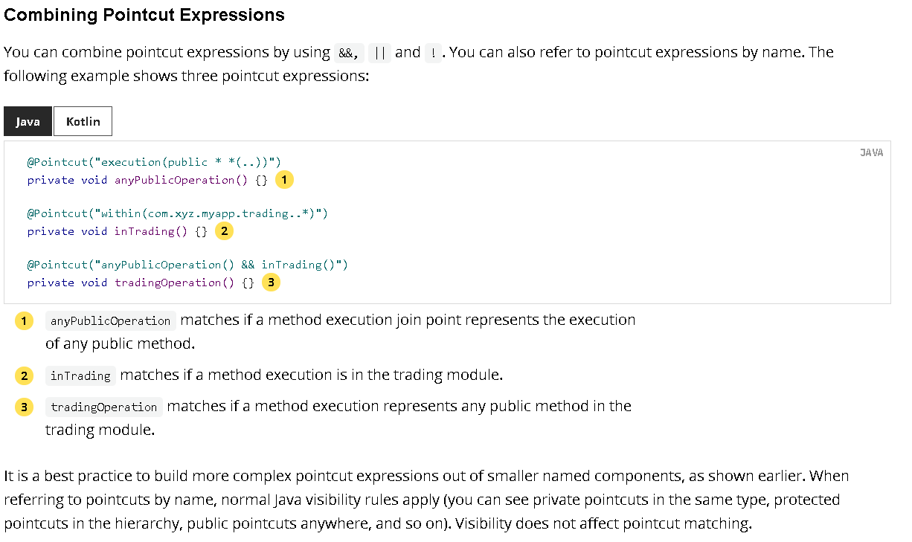
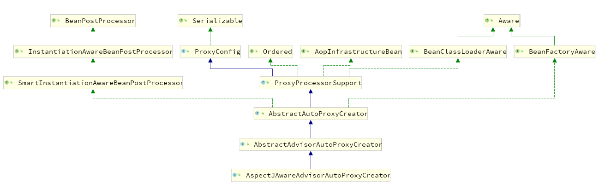
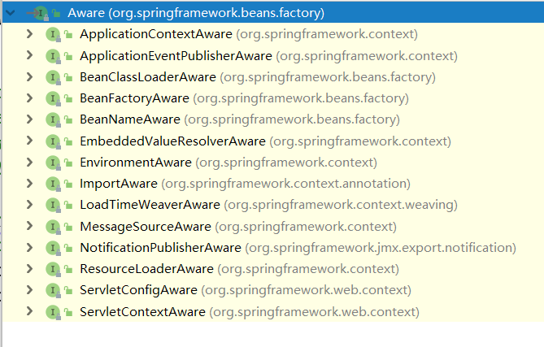

# 组件注册

**依赖**

```xml
<dependency>
    <groupId>org.springframework</groupId>
    <artifactId>spring-context</artifactId>
</dependency>
```

**实体类**

```java
@Data
@NoArgsConstructor
@AllArgsConstructor
public class Person {
    private String name;
    private Integer age;
}
```


## xml配置注入

resources目录下的bean.xml

```xml
<?xml version="1.0" encoding="UTF-8"?>
<beans xmlns="http://www.springframework.org/schema/beans"
       xmlns:xsi="http://www.w3.org/2001/XMLSchema-instance"
       xsi:schemaLocation="http://www.springframework.org/schema/beans http://www.springframework.org/schema/beans/spring-beans.xsd">

    <bean id="person" class="com.potato.spring.annotation.bean.Person">
        <property name="name" value="zhangsan"></property>
        <property name="age" value="18"></property>
    </bean>
</beans>
```

测试类

```java
public class MainTest {
    public static void main(String[] args) {
        //读取配置文件，返回spring容器
        ApplicationContext applicationContext = new ClassPathXmlApplicationContext("bean.xml");
        Person bean = (Person) applicationContext.getBean("person");//根据bean的id来获取bean
        System.out.println(bean);

    }
}
```

结果

```
日志。。。
日志。。。
日志。。。
Person(name=zhangsan, age=18)
```

这样太麻烦了，采用注解：

## 配置类@Configuration

### 使用

```java
package com.potato.spring.annotation.config;

import com.potato.spring.annotation.bean.Person;
import org.springframework.context.annotation.Bean;
import org.springframework.context.annotation.Configuration;

//配置类相当于xml配置文件
@Configuration //告诉spring这是个配置类
public class MainConfig {
    @Bean //给容器中注册一个bean，类型为返回值类型，id默认是方法名作为id
    public Person person(){
        return new Person("lisi", 20);
    }
}
```

测试

```java
ApplicationContext applicationContext = new AnnotationConfigApplicationContext(MainConfig.class);
Person bean = (Person) applicationContext.getBean(Person.class);//根据bean的类型来获取
System.out.println(bean);//Person(name=lisi, age=20)

String[] beanNamesForType = applicationContext.getBeanNamesForType(Person.class);
for (String s : beanNamesForType) {
    System.out.println(s);//person
}
```

结果：

```
Person(name=lisi, age=20)
person
```

### 想要改id怎么改

默认是方法名作为id

```
@Configuration //告诉spring这是个配置类
public class MainConfig {
    @Bean //给容器中注册一个bean，类型为返回值类型，id默认是方法名作为id
    public Person person01(){
        return new Person("lisi", 20);
    }
}
```

```java
String[] beanNamesForType = applicationContext.getBeanNamesForType(Person.class);
for (String s : beanNamesForType) {
    System.out.println(s);//person01
}
```

现在要改掉,只需要在@Bean注解后面写上名称就行

```java
@Configuration //告诉spring这是个配置类
public class MainConfig {
    //给容器中注册一个bean，类型为返回值类型，id默认是方法名作为id
    @Bean("person02")
    public Person person(){
        return new Person("lisi", 20);
    }
}
```

这样就改了名字，而且不用改方法名

```java
String[] beanNamesForType = applicationContext.getBeanNamesForType(Person.class);
for (String s : beanNamesForType) {
    System.out.println(s);//person02
}
```

## 组件扫描@ComponentScan

```java
package com.potato.spring.annotation.dao;
@Repository
public class BookDao {
}
```


```java
@Service
public class BookService {
}
```


```java
@Controller
public class BookController {
}
```


### 以前的做法

```xml
<!--包扫描，只要标注了@Controller、@Service、@Repository、@Component-->
<context:component-scan base-package="com.potato"></context:component-scan>
```

### 在配置类上写@ComponentScan

```java
@ComponentScan(value = "com.potato.spring.annotation")
```

测试类

```java
@Test
public void test01(){
    ApplicationContext applicationContext = new AnnotationConfigApplicationContext(MainConfig.class);
    String[] beanDefinitionNames = applicationContext.getBeanDefinitionNames();
    for (String beanDefinitionName : beanDefinitionNames) {
        System.out.println(beanDefinitionName);
    }
}
```

结果,前几个org开头的是IOC容器内部的bean

```java
org.springframework.context.annotation.internalConfigurationAnnotationProcessor
org.springframework.context.annotation.internalAutowiredAnnotationProcessor
org.springframework.context.annotation.internalCommonAnnotationProcessor
org.springframework.context.event.internalEventListenerProcessor
org.springframework.context.event.internalEventListenerFactory
mainConfig  
bookController
bookDao
bookService
person02
```

结果中出现了mainConfig，说明加了**@Configuration的配置类也是bean**，因为**@Configuration点开源码后又看到了@Component注解**


### 指定排除规则

**excludeFilters**  不包含

```java
//excludeFilters = Filters[] 是个数组，所以要用大括号
@ComponentScan(value = "com.potato.spring.annotation",excludeFilters = {
        @ComponentScan.Filter(type = FilterType.ANNOTATION,classes = {
                Controller.class, Service.class  /*排除加了@Controller或@Service注解的类*/
        })
} )
```

**includeFilters** 包含

```java
//includeFilters 也是个Filters[]数组
@ComponentScan(value = "com.potato.spring.annotation",includeFilters = {
        @ComponentScan.Filter(type = FilterType.ANNOTATION,classes = {
                Controller.class, Service.class  /*排除加了@Controller或@Service注解的类*/
        })
} )
```

这是个重复注解，可以多写几次

### FilterType指定过滤规则

- FilterType.ANNOTATION  按照注解来过滤

- FilterType.ASSIGNABLE_TYPE 按照给定的类型来过滤

- FilterType.ASPECTJ ,使用Aspectj表达式来过滤

- FilterType.REGEX 按照正则表达式

- FilterType.CUSTOM  自定义规则

  自定义的规则必须是TypeFilter的实现类


```java
package com.potato.spring.annotation.config;

import org.springframework.core.io.Resource;
import org.springframework.core.type.AnnotationMetadata;
import org.springframework.core.type.ClassMetadata;
import org.springframework.core.type.classreading.MetadataReader;
import org.springframework.core.type.classreading.MetadataReaderFactory;
import org.springframework.core.type.filter.TypeFilter;

import java.io.IOException;

/**
 * @author Potato20522
 * @date 2021/1/29
 */
public class MyTypeFilter implements TypeFilter {
    /**
     *
     * @param metadataReader 读取到的当前正在扫描的类的信息
     * @param metadataReaderFactory 可以获取到其他任何类的信息
     * @return
     */
    @Override
    public boolean match(MetadataReader metadataReader, MetadataReaderFactory metadataReaderFactory) throws IOException {
        //获取当前类的注解信息
        AnnotationMetadata annotationMetadata = metadataReader.getAnnotationMetadata();
        //获取正在扫描的类的类下信息
        ClassMetadata classMetadata = metadataReader.getClassMetadata();
        //获取当前类的资源信息(比如类路径)
        Resource resource = metadataReader.getResource();

        String className = classMetadata.getClassName();
        System.out.println("--->类名："+className);
        
        //随便写一个规则
        if (className.contains("er")){
            return true;
        }
        return false;
    }
}

```

在配置类上加注解

```java
@ComponentScan(value = "com.potato.spring.annotation",includeFilters = {
    @ComponentScan.Filter(type =FilterType.CUSTOM,classes = {MyTypeFilter.class})
})
```

结果

```
--->类名：com.potato.spring.annotation.MainTest
--->类名：com.potato.spring.annotation.bean.Person
--->类名：com.potato.spring.annotation.config.MyTypeFilter
org.springframework.context.annotation.internalConfigurationAnnotationProcessor
org.springframework.context.annotation.internalAutowiredAnnotationProcessor
org.springframework.context.annotation.internalCommonAnnotationProcessor
org.springframework.context.event.internalEventListenerProcessor
org.springframework.context.event.internalEventListenerFactory
mainConfig
bookController
bookDao
bookService
person02
```


## 设置组件作用域@Scope

```java

/**
 * 作用域Scope
 *   prototype  多实例，IOC容器启动不会调用方法创建对象，放在容器中
 *     而是在每次获取时才会调用方法创建对象
 *   singleton 默认，单实例，IOC容器启动时，会调用方法创建对象，以后每次获取就直接从容器中拿
 *   request  同一个请求创建一个实例
 *   session  同一个session创建一个实例
 */
@Configuration //告诉spring这是个配置类
public class MainConfig2 {
    @Bean("person")
    @Scope("prototype")
    public Person person(){
        //单例时，IOC容器启动时，这句就被调用了。
        // 多实例时，则不调用，在获取时才调用，获取几次就调用几次
        System.out.println("给容器添加Person...");
        return new Person("张三", 25);
    }
}

```

## bean懒加载@Lazy

 针对单实例bean,默认在容器启动时创建对象

懒加载：容器启动时不创建对象，第一次获取(使用)bean创建对象并初始化

```java
@Configuration //告诉spring这是个配置类
public class MainConfig2 {
    @Bean("person")
    @Lazy
    public Person person(){
        System.out.println("给容器添加Person...");
        return new Person("张三", 25);
    }
}
```

## 按照条件注册bean @Conditional

按照一定的条件进行判断，满足条件给容器中注册bean

```java
package com.potato.spring.annotation.condition;

import org.springframework.beans.factory.config.ConfigurableListableBeanFactory;
import org.springframework.beans.factory.support.BeanDefinitionRegistry;
import org.springframework.context.annotation.Condition;
import org.springframework.context.annotation.ConditionContext;
import org.springframework.core.env.Environment;
import org.springframework.core.type.AnnotatedTypeMetadata;

public class LinuxCondition implements Condition {

    /**
     *
     * @param context 判断条件能使用的上下文（环境）
     * @param metadata 注释信息
     * @return
     */
    @Override
    public boolean matches(ConditionContext context, AnnotatedTypeMetadata metadata) {
        //是否 Linux 系统
        //1.能获取到ioc的beanFactory
        ConfigurableListableBeanFactory beanFactory = context.getBeanFactory();
        //2.获取类加载器
        ClassLoader classLoader = context.getClassLoader();
        //3.获取环境信息
        Environment environment = context.getEnvironment();
        //4.获取bean定义的注册类
        BeanDefinitionRegistry registry = context.getRegistry();

        String property = environment.getProperty("os.name");
        return property.contains("Linux");
    }
}
```


```java
package com.potato.spring.annotation.condition;

import org.springframework.beans.factory.support.BeanDefinitionRegistry;
import org.springframework.context.annotation.Condition;
import org.springframework.context.annotation.ConditionContext;
import org.springframework.core.env.Environment;
import org.springframework.core.type.AnnotatedTypeMetadata;

/**
 * 判断是否是windows系统
 */
public class WindowsCondition implements Condition {

    @Override
    public boolean matches(ConditionContext context, AnnotatedTypeMetadata metadata) {
        Environment environment = context.getEnvironment();
        BeanDefinitionRegistry registry = context.getRegistry();
        //还可以判断容器中的bean注册情况，也可以给容器中注册bean
        boolean definition = registry.containsBeanDefinition("person");

        String property = environment.getProperty("os.name");
        return property.contains("Windows");
    }
}
```


```java
@Configuration
@Conditional({LinuxCondition.class})//还可以放在类上，满足当前条件，这个类的配的所有bean注册才会生效
public class MainConfig2 {
    @Bean("person")
    @Lazy
    public Person person(){
        System.out.println("给容器添加Person...");
        return new Person("张三", 25);
    }

    //@Conditional 按照条件注册bean
    //比如，如果系统是windows，就给容器中注册bill，是Linux就注册linus
    @Conditional({WindowsCondition.class})
    @Bean("bill")
    public Person person01(){
        return new Person("Bill", 55);
    }

    @Conditional({LinuxCondition.class})
    @Bean("linus")
    public Person person02(){
        return new Person("linus", 48);
    }
}
```


```java
@Test
public void test03(){
    ApplicationContext applicationContext = new AnnotationConfigApplicationContext(MainConfig2.class);
    String[] beanNamesForType = applicationContext.getBeanNamesForType(Person.class);
    //获取环境变量的值
    Environment environment = applicationContext.getEnvironment();
    String property = environment.getProperty("os.name");
    System.out.println(property);//Windows 10

    for (String name : beanNamesForType) {
        System.out.println(name);//person  bill  linus
    }
    Map<String, Person> beansOfType = applicationContext.getBeansOfType(Person.class);
    //给容器添加Person...
    System.out.println(beansOfType);
    //{person=Person(name=张三, age=25), bill=Person(name=Bill, age=55)

}
```

## 给容器快速导入一个组件@Import

给容器中注册 组件

1.包扫描+组件标注注解（@Controller/@Service/@Repository/@Component) [自己写的类]

2.@Bean[导入的第三方包里的组件]

3.@Import[快速给容器中导入一个组件

 	1)@Import(要导入到容器中的组件),容器中就会自动注册这个组件，id默认是全类名

​	2)ImportSelector 返回需要导入的组件的全类名数组

​	3)ImportBeanDefinitionRegistrar 手动注册bean到容器中

4.使用Spring提供的FactoryBean(工厂Bean)

​	1)默认获取到的是工厂bean调用getObject创建的对象

​	2)要获取工厂Bean本身，需要在id前面加一个&,比如&colorFactoryBean

### 基本用法@Import

写一个类，就当做是第三方包里的

```java
package com.potato.spring.annotation.bean;

public class Color {
}
```

在配置类上写**@Import(Color.class)** //导入组件，id默认是组件的全类名,导入多个的话就写成数组形式

测试：

```java
private void printBeans(ApplicationContext applicationContext){
    String[] beanDefinitionNames = applicationContext.getBeanDefinitionNames();
    for (String name : beanDefinitionNames) {
        System.out.println(name);
    }
}

@Test
public void testImport(){
    ApplicationContext applicationContext = new AnnotationConfigApplicationContext(MainConfig2.class);
    printBeans(applicationContext);
}
```


```
//IOC自己的
mainConfig2
com.potato.spring.annotation.bean.Color
person
bill
```

### ImportSelector 

再随便写几个类

```java
public class Red {
}
public class Blue {
}
public class Yellow {
}
```

写在配置类上

```java
@Import({Color.class, Red.class, MyImportSelector.class})
```


```java
package com.potato.spring.annotation.condition;

import org.springframework.context.annotation.ImportSelector;
import org.springframework.core.type.AnnotationMetadata;

/**
 * 自定义逻辑返回需要导入的组件
 */
public class MyImportSelector implements ImportSelector {
    /**
     *
     * @param importingClassMetadata 当前标注@Import注解的类的所有注解信息
     * @return 返回值就是要导入到容器中的组件全类名
     */
    @Override
    public String[] selectImports(AnnotationMetadata importingClassMetadata) {

        return new String[]{"com.potato.spring.annotation.bean.Blue","com.potato.spring.annotation.bean.Yellow"};
    }
}
```

测试

```java
@Test
public void testImport(){
    ApplicationContext applicationContext = new AnnotationConfigApplicationContext(MainConfig2.class);
    printBeans(applicationContext);
    Blue bean = applicationContext.getBean(Blue.class);
    System.out.println(bean);
}
```

结果：

```
mainConfig2
com.potato.spring.annotation.bean.Color
com.potato.spring.annotation.bean.Red
com.potato.spring.annotation.bean.Blue
com.potato.spring.annotation.bean.Yellow
person
bill
com.potato.spring.annotation.bean.Blue@609e8838
```

### ImportBeanDefinitionRegistrar

```java
public class RainBow {
}
```


```java
package com.potato.spring.annotation.condition;

import com.potato.spring.annotation.bean.RainBow;
import org.springframework.beans.factory.support.BeanDefinitionRegistry;
import org.springframework.beans.factory.support.RootBeanDefinition;
import org.springframework.context.annotation.ImportBeanDefinitionRegistrar;
import org.springframework.core.type.AnnotationMetadata;

public class MyImportBeanDefinitionRegistrar implements ImportBeanDefinitionRegistrar {
    /**
     *
     * @param importingClassMetadata 当前类的注解信息
     * @param registry  BeanDefinition注册类
     * 把所有需要添加到容器中的bean，调用：
     *                  BeanDefinitionRegistry.registerBeanDefinitions手工注册进来
     */
    @Override
    public void registerBeanDefinitions(AnnotationMetadata importingClassMetadata, BeanDefinitionRegistry registry) {
        boolean red = registry.containsBeanDefinition("com.potato.spring.annotation.bean.Red");
        boolean blue = registry.containsBeanDefinition("com.potato.spring.annotation.bean.Blue");
        if(red && blue){
            //指定bean的定义信息（Bean的类型等）
            RootBeanDefinition beanDefinition = new RootBeanDefinition(RainBow.class);
            //注册一个bean，指定bean名
            registry.registerBeanDefinition("rainBow",beanDefinition);
        }

    }

}
```

测试

```java
@Test
public void testImport(){
    ApplicationContext applicationContext = new AnnotationConfigApplicationContext(MainConfig2.class);
    printBeans(applicationContext);
    Blue bean = applicationContext.getBean(Blue.class);
    System.out.println(bean);
}
```

结果

```
mainConfig2
com.potato.spring.annotation.bean.Color
com.potato.spring.annotation.bean.Red
com.potato.spring.annotation.bean.Blue
com.potato.spring.annotation.bean.Yellow
person
bill
rainBow
com.potato.spring.annotation.bean.Blue@43df23d3
```

### FactoryBean容器接口

实现FactoryBean接口，加个类的泛型

```java
package com.potato.spring.annotation.bean;

import org.springframework.beans.factory.FactoryBean;

public class ColorFactoryBean implements FactoryBean<Color> {
    //返回一个Color对象，这个对象会被添加到容器中
    @Override
    public Color getObject() throws Exception {
        System.out.println("ColorFactoryBean...getObject...");
        return new Color();
    }

    //返回这个对象的类型
    @Override
    public Class<?> getObjectType() {
        return Color.class;
    }

    //是否是单例的
    @Override
    public boolean isSingleton() {
        return true;
    }
}
```

配置类里注册Color的工厂bean

```java
@Bean
public ColorFactoryBean colorFactoryBean(){
    return new ColorFactoryBean();
}
```

测试

```java
@Test
public void testImport(){
    ApplicationContext applicationContext = new AnnotationConfigApplicationContext(MainConfig2.class);
    //工厂Bean获取的是调用getObject创建的对象
    Object bean2 = applicationContext.getBean("colorFactoryBean");
    Object bean3 = applicationContext.getBean("colorFactoryBean");
    System.out.println("bean的类型："+bean2.getClass());//Color
    System.out.println(bean2==bean3);//true
    Object bean4 = applicationContext.getBean("&colorFactoryBean");//加个前缀&，就是获取工厂bean
    System.out.println(bean4.getClass());//ColorFactoryBean
}
```

结果

```
ColorFactoryBean...getObject...
bean的类型：class com.potato.spring.annotation.bean.Color
true
class com.potato.spring.annotation.bean.ColorFactoryBean
```

# AOP

## 基本使用

AOP:在程序运行期间动态的将某段代码切入到指定方法指定位置进行运行的编程方式

1.导入模块Spring Aop(Spring-aspectj)

2.定义一个业务逻辑类 MathCalculator，运行期间将日志进行打印

3.定义一个日志切面类LogAspects，切面类里面的方法需要动态感知MathCalculator.div运行到哪里，然后执行

 前置通知 @Before
  后置通知 @After
  返回通知 @AfterReturning
  异常通知 @AfterThrowing
  环绕通知 @Around

4.给切面类的目标方法标注何时何地运行

5.将切面类和业务逻辑类(目标方法所在的类)都加入容器中

6.告诉Spring哪个类是切面类(@Aspect)

7.配置类加@EnableAspectJAutoProxy 开启基于注解的aop

**业务类**

```java
public class MathCalculator {
    public int div(int i,int j){
        System.out.println("MathCalculator...div...");
        return i/j;
    }
}
```

**切面类**

```java
package com.potato.spring.annotation.aop;

import org.aspectj.lang.annotation.*;
@Aspect //告诉Spring当前类是一个切面类
public class LogAspects {

    //切入点表达式("com.potato.spring.annotation.aop.MathCalculator.div.*(..)")
    //每次都写这个表达式有点麻烦，抽取出来

    /**
     * 本类引用：pointCut()
     * 其他的切面引用：com.potato.spring.annotation.aop.LogAspects#pointCut()
     */
    @Pointcut("execution(public int com.potato.spring.annotation.aop.MathCalculator.*(..))")//所有方法
    public void pointCut(){}

    //可以指定方法的何种参数时才切入，比如div(int,int) ，任意参数任意类型 div*(..)
//    @Before("com.potato.spring.annotation.aop.MathCalculator.div*(..)")
    @Before("pointCut()")
    public void logStarts(){
        System.out.println("除法运行...参数列表是:{}");
    }

    @After("pointCut()")
    public void logEnd(){
        System.out.println("除法结束");
    }
    @AfterReturning("pointCut()")
    public void logReturn(){
        System.out.println("除法正常返回...运行结果是:{}");
    }
    @AfterThrowing("pointCut()")
    public void logException(){
        System.out.println("除法异常...异常信息是:{}");
    }
}
```

**配置类**

```java
@EnableAspectJAutoProxy
@Configuration
public class MainConfigOfAop {
    //业务逻辑类加入容器
    @Bean
    public MathCalculator calculator(){
        return new MathCalculator();
    }

    //切面类加入容器中
    @Bean
    public LogAspects logAspects(){
        return new LogAspects();
    }
}
```

**测试**

```java
@Test
public void test01(){
    AnnotationConfigApplicationContext applicationContext = new AnnotationConfigApplicationContext(MainConfigOfAop.class);
    MathCalculator mathCalculator = applicationContext.getBean(MathCalculator.class);
    mathCalculator.div(1, 1);
    applicationContext.close();
}
```

**运行结果**

```java
除法运行...参数列表是:{}
MathCalculator...div...
除法正常返回...运行结果是:{}
除法结束
```

[切入点表达式](https://docs.spring.io/spring-framework/docs/current/reference/html/core.html#aop-pointcuts-combining)




## JointPoint

```java
@Aspect
public class LogAspects {
    @Pointcut("execution(public int com.potato.spring.annotation.aop.MathCalculator.*(..))")//所有方法
    public void pointCut(){}

    @Before("pointCut()")
    public void logStarts(JoinPoint joinPoint){
        Object[] args = joinPoint.getArgs();
        System.out.println(joinPoint.getSignature().getName()+"除法运行...参数列表是:{"+ Arrays.asList(args) +"}");
    }

    @After("pointCut()")
    public void logEnd(JoinPoint joinPoint){
        System.out.println(joinPoint.getSignature().getName()+"除法结束");
    }
    
    //如有多个参数，joinPoint必须放在第一位，否则出现错误
    @AfterReturning(value="pointCut()",returning = "result")
    public void logReturn(JoinPoint joinPoint,Object result){
        System.out.println(joinPoint.getSignature().getName()+"除法正常返回...运行结果是:{"+ result +"}");
    }
    @AfterThrowing(value="pointCut()",throwing = "exception")
    public void logException(Exception exception){
        System.out.println("除法异常...异常信息是:{"+exception+"}");
    }
}
```

运行结果

```
div除法运行...参数列表是:{[1, 1]}
MathCalculator...div...
除法正常返回...运行结果是:{1}
div除法结束
```

## 步骤总结

三步：

1.将业务逻辑组件和切面类都加入到容器中，告诉Spring哪个是切面类(@Aspect)

2.在切面类上的每一个通知方法上标注通知注解，告诉Spring何时何地运行（切入点表达式）

3.开启基于注解的aop模式@EnableAspectJAutoProxy

## AOP原理

看给容器中注册了什么组件，这个组件什么时候工作，功能是什么

### @EnableAspectJAutoProxy是什么

点进@EnableAspectJAutoProxy源码，看到调用了：

**@Import(AspectJAutoProxyRegistrar.class)** 给容器导入AspectJAutoProxyRegistrar，利用AspectJAutoProxyRegistrar自定义给容器中注册bean;

internalAutoProxyCreator=AnnotationAwareAspectJAutoProxyCreator

给容器中注册一个 AnnotationAwareAspectJAutoProxyCreator

一句话：这个注解给容器中注册了一个组件（就是上面这个名字很长的）

### AnnotationAwareAspectJAutoProxyCreator

继承实现关系




关注后置处理器（在bean初始化完成前后做的事情）、自动装配BeanFactory

AbstractAutoProxyCreator.setBeanFactory()

AbstractAutoProxyCreator.有后置处理器的逻辑

AbstractAdvisorAutoProxyCreator.setBeanFactory()\==>initBeanFactory()

AnnotationAwareAspectJAutoProxyCreator.initBeanFactory()

**注册 AnnotationAwareAspectJAutoProxyCreator**

流程：

1.传入配置类，创建IOC容器

2.注册配置类，调用refresh() 刷新容器

3.在refresh()方法里，调用registerBeanPostProcessors(beanFactory);注册bean的后置处理器来方便拦截bean的创建

3.1先获取IOC容器已经定义了的需要创建对象的所有BeanPostProcessor

3.2给容器中加别的BeanPostProcessor

3.3优先注册实现了PriorityOrdered接口的BeanPostProcessor

3.4再在给容器中注册实现了Ordered接口的BeanPostProcessor

3.4注册没实现优先级接口的BeanPostProcessor


# 生命周期

## 指定初始化和销毁方法

### @Bean注解的initMethod和destroyMethod

以前在xml文件中bean标签有init-method 和destroy-method属性来指定初始化和销毁方法

```java
public class Car {
    public Car() {
        System.out.println("car constructor...");
    }
    public void init(){
        System.out.println("car init...");
    }
    public void destroy(){
        System.out.println("car destroy...");
    }
}
```


```java
@Configuration
public class MainConfigOfLifeCycle {
    @Bean(initMethod = "init",destroyMethod = "destroy")
    public Car car(){
        return new Car();
    }
}
```


默认情况下

```
car constructor...
容器创建完成
```

指定初始化和销毁方法

```
car constructor...
car init...
容器创建完成
car destroy...
```

**多实例时**

```
@Scope("prototype")
public Car car(){
    return new Car();
}
```

测试

```java
AnnotationConfigApplicationContext applicationContext = new AnnotationConfigApplicationContext(MainConfigOfLifeCycle.class);
System.out.println("容器创建完成");
applicationContext.getBean("car");
applicationContext.close();
```

结果

```
容器创建完成
car constructor...
car init...
```

结果说明，多实例的bean关闭容器时不会销毁bean


### 实现InitializingBean和DisposableBean接口

```java
@Component
public class Cat implements InitializingBean, DisposableBean {
    public Cat() {
        System.out.println("cat constructor...");
    }

    @Override
    public void destroy() throws Exception {
        System.out.println("cat destroy...");
    }

    @Override
    public void afterPropertiesSet() throws Exception {
        System.out.println("cat afterPropertiesSet...");
    }
}
```
测试

```java
AnnotationConfigApplicationContext applicationContext = new AnnotationConfigApplicationContext(MainConfigOfLifeCycle.class);
System.out.println("容器创建完成");
applicationContext.close();//关闭容器会销毁bean，bean被remove时也会调用destory销毁bean
```

结果

```
cat constructor...
cat afterPropertiesSet...
car constructor...
car init...
容器创建完成
car destroy...
cat destroy...
```

### @PostConstruct和@PreDestroy

这两个是Java自带的注解

```java
@Component
public class Dog {
    public Dog() {
        System.out.println("dog constructor...");
    }
    //对象创建并赋值之后调用
    @PostConstruct
    public void init(){
        System.out.println("dog @PostConstruct...");
    }

    @PreDestroy
    public void destroy(){
        System.out.println("dog @PreDestroy...");
    }
}
```

## 初始化之前之后

BeanPostProcessor接口:bean后置处理器

在bean初始化前后进行一些处理工作

- postProcessBeforeInitialization 初始化之前工作

- postProcessAfterInitialization  初始化之后工作

```
BeanPostProcessor.postProcessBeforeInitialization()
初始化：
  对象创建完成、并赋值好，调用初始化方法...
BeanPostProcessor.postProcessAfterInitialization()
销毁:
  单实例：容器关闭的时候
  多实例：容器不会管理这个bean，容器不会调用销毁方法，但可以手动调用销毁
```


```java
//后置处理器：初始化前后进行处理工作
@Component  //将后置处理器加到容器中
public class MyBeanPostProcessor implements BeanPostProcessor {
    @Override
    public Object postProcessBeforeInitialization(Object bean, String beanName) throws BeansException {
        System.out.println("postProcessBeforeInitialization..."+beanName+"==>"+bean);
        return bean;
    }

    @Override
    public Object postProcessAfterInitialization(Object bean, String beanName) throws BeansException {
        System.out.println("postProcessAfterInitialization..."+beanName+"==>"+bean);
        return bean;
    }
}
```

### BeanPostProcessor原理

遍历得到容器中所有的BeanPostProcessor，挨个执行，一旦返回null，跳出for循环，后面的就不会执行

```java
populateBean(beanName,mbd,instanceWrapper);//给bean属性赋值
initializeBean;
{
    applyPostProcessBeforeInitialization(wrappedBean,beanName);
    invokeInitMethods(beanNme,wrappedBean,mbd); //执行初始化
    applyPostProcessAfterInitialization(wrappedBean,beanName);

}
```

### BeanPostProcessor在spring底层的使用

bean赋值、注入其他组件、@Autowired、生命周期注解功能@Async,xxx BeanPostProcessor

## 属性赋值

```java
@Data
@NoArgsConstructor
@AllArgsConstructor
public class Person {
    //@Value赋值
    //1.基本数值
    //2.SpEL表达式  #{}
    //3.${} 取出配置文件【properties】中的值(在运行环境变量里的值)
    @Value("张三")
    private String name;
    @Value("#{10-2}")
    private Integer age;
    @Value("${person.nickName")
    private String nickName;
}
```

properties文件

```properties
person.nickName=小张三
```

配置类

```java
//使用@PropertySource读取外部配置文件中的k/v保存到运行的环境变量中
@Configuration
@PropertySource(value = {"classpath:/person.properties"})
public class MainConfigOfPropertyValues {
    @Bean
    public Person person(){
        return new Person();
    }
}
```

测试

```java
Person person = (Person) applicationContext.getBean("person");
System.out.println(person);

ConfigurableEnvironment environment = applicationContext.getEnvironment();
String nickName = environment.getProperty("person.nickName");
```

# 自动装配

自动装配：
  Spring利用依赖注入(DI),完成对对IOC容器中各个组件的依赖关系赋值

## @Autowired

  @Autowired  自动注入  

- 默认优先按照类型去容器中找对应的组件:applicationContext.getBean(BookDao.class)找到就赋值
      

- 如果找到多个相同类型的组件，再将属性的名称作为组件的id去容器中查找 applicationContext.getBean("bookDao")
      

- @Qualifier("bookDao")指定需要装配的组件的id，而不是使用属性名
      

- 自动装配默认一定要将属性赋值好，没有就会报错，可以使用@Autowired(required = false)，能装上就装，不能装上就拉倒
      

- @Primary 让spring进行自动装配时，默认选用首选的bean
  ，也可以继续使用@Qualifier指定的需要装配的bean名字
       

- 构造器、参数、方法、属性 都可以使用  @Autowired

  ```
  @Autowired：构造器、参数、方法、属性，都是从容器中获取参数组件的值
  1)标注在方法上，Spring容器创建当前对象，就会调用方法，完成赋值，方法使用的参数，自定义类型的值从IOC容器中获取
      @Bean +方法参数， 标注的方法创建对象时，方法参数的值从容器中获取，默认不写 Autowired，都能自动装配
  2)标注在构造器上（有参），如果组件只有一个有参构造器，这个有参构造器的@Autowired可以省略，
      参数位置的组件还是可以自动从容器中获取
  3)标注在参数位置
  ```

  底层是AutowiredAnnotationBeanPostProcessor来解析完成自动装配功能，是个后置处理器，前面说过了

```java
@Repository
public class BookDao {
    private String lable = "1";

    public String getLable() {
        return lable;
    }

    public void setLable(String lable) {
        this.lable = lable;
    }

    @Override
    public String toString() {
        return "BookDao{" +
                "lable='" + lable + '\'' +
                '}';
    }
}
```


```java
@Configuration
@ComponentScan({"com.potato.spring.annotation.dao","com.potato.spring.annotation.service","com.potato.spring.annotation.controller"})
public class MainConfigOfAutowired {
    @Primary
    @Bean("bookDao2")
    public BookDao bookDao(){
        BookDao bookDao = new BookDao();
        bookDao.setLable("2");
        return bookDao;
    }
}
```


```java
BookService bookService = applicationContext.getBean(BookService.class);
System.out.println(bookService);//默认是BookService{bookDao=BookDao{lable='1'}}
```

## @Resource和@Inject

@Resource 可以和 @Autowired一样实现自动装配功能，默认是安装组件名称进行装配的
  没有能支持@Primary @Autowired(required = false)等功能

@Inject 需要导入javax.inject依赖，和Autowired功能一样，没有required = false

## Aware接口

自定义组件想要使用Spring容器底层的一些组件(ApplicationContext,BeanFactory,xxx)
 自定义组件实现 xxxAware 接口就行，在创建对象时，会调用接口规定的方法注入相关的组件
 xxxAware:功能使用xxxProcessor，比如
 ApplicationContextAware==>ApplicationContextAwareProcessor

有这么多子接口




```java
@Component
public class Red implements ApplicationContextAware, BeanNameAware, EmbeddedValueResolverAware {
    private ApplicationContext applicationContext;
    @Override
    public void setApplicationContext(ApplicationContext applicationContext) throws BeansException {
        System.out.println("传入的IOC:"+applicationContext);
        this.applicationContext = applicationContext;
    }

    @Override
    public void setBeanName(String name) {
        System.out.println("当前bean的名字:"+name);
    }

    @Override
    public void setEmbeddedValueResolver(StringValueResolver resolver) {
        String resolveStringValue = resolver.resolveStringValue("你好${os.name} 我是#{20*18}");
        System.out.println("解析的字符串:"+resolveStringValue);
    }
}
```

## @Profile

```
Profile注解:Spring为我们提供的可以根据当前环境，动态的激活和切换一系列组件的功能
开发环境、测试环境、生产环境
1.@Profile：指定组件在哪个环境的情况下才能被注册到容器中，不指定，任何环境下都能注册这个组件
  1）加了环境标识的bean，只有这个环境被激活的时候才能注册到容器中,默认是default环境
  2）注解还可以写在配置类上，只有指定环境的时候，整个配置类才会被加载
  3）没有标识的bean，在任何环境时都是加载的
```

```java
@Configuration
public class MainConfigOfProfile {
    @Profile("default")
    @Bean("testDataSource")
    public DataSource dataSourceTest(){
        DruidDataSource dataSource = new DruidDataSource();
        System.out.println("测试环境数据源");
        return dataSource;
    }
    @Profile("dev")
    @Bean("devDataSource")
    public DataSource dataSourceDev(){
        DruidDataSource dataSource = new DruidDataSource();
        System.out.println("开发环境数据源");
        return dataSource;
    }
    @Profile("prod")
    @Bean("prodDataSource")
    public DataSource dataSourceProd(){
        DruidDataSource dataSource = new DruidDataSource();
        System.out.println("生产环境数据源");
        return dataSource;
    }
}
```

如何切换？

1.使用JVM参数

-Dspring.profiles.active=test

2.代码的方式来激活某种环境

```java
AnnotationConfigApplicationContext applicationContext = new AnnotationConfigApplicationContext();
applicationContext.getEnvironment().setActiveProfiles("test","dev");//一次可以设置多个环境
applicationContext.register(MainConfigOfProfile.class);
applicationContext.refresh();
```

# IDEA Spring源码阅读环境搭建

https://blog.csdn.net/sinat_34324872/article/details/107397430