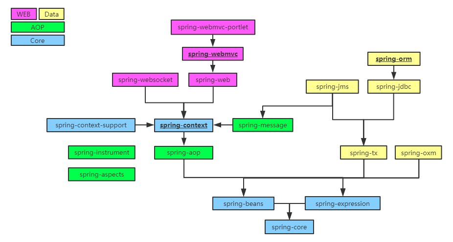

# 1.概述及IOC理论推导

## 1.1 简介

Spring : 春天 --->给软件行业带来了春天

2002年，Rod Jahnson首次推出了Spring框架雏形interface21框架。

2004年3月24日，Spring框架以interface21框架为基础，经过重新设计，发布了1.0正式版。

很难想象Rod Johnson的学历 , 他是悉尼大学的博士，然而他的专业不是计算机，而是音乐学。

Spring理念 : 使现有技术更加实用 . 本身就是一个大杂烩 , 整合现有的框架技术

官网 : http://spring.io/

官方下载地址 : https://repo.spring.io/libs-release-local/org/springframework/spring/

GitHub : https://github.com/spring-projects

优点

1、Spring是一个开源免费的框架 , 容器  .

2、Spring是一个轻量级的框架 , 非侵入式的 .

**3、控制反转 IoC  , 面向切面 Aop**

4、对事物的支持 , 对框架的支持

一句话概括：

**Spring是一个轻量级的控制反转(IoC)和面向切面(AOP)的容器（框架）。**

组成

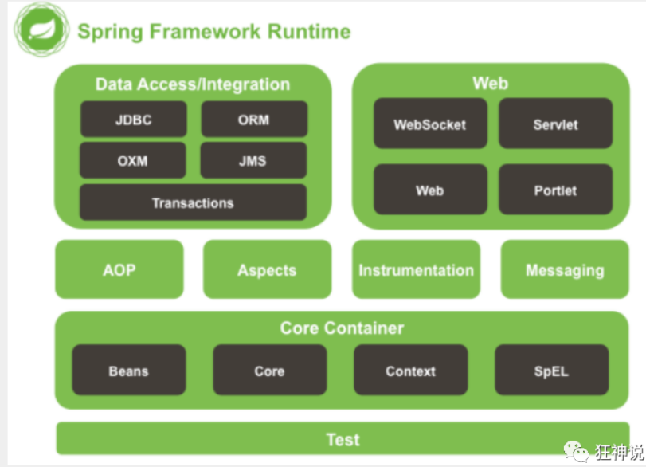

Spring 框架是一个分层架构，由 7 个定义良好的模块组成。Spring 模块构建在核心容器之上，核心容器定义了创建、配置和管理 bean 的方式 .

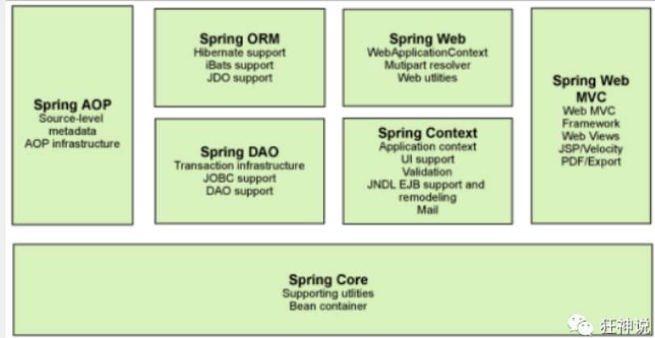

组成 Spring 框架的每个模块（或组件）都可以单独存在，或者与其他一个或多个模块联合实现。每个模块的功能如下：

- **核心容器**：核心容器提供 Spring 框架的基本功能。核心容器的主要组件是 BeanFactory，它是工厂模式的实现。BeanFactory 使用*控制反转*（IOC） 模式将应用程序的配置和依赖性规范与实际的应用程序代码分开。
- **Spring 上下文**：Spring 上下文是一个配置文件，向 Spring 框架提供上下文信息。Spring 上下文包括企业服务，例如 JNDI、EJB、电子邮件、国际化、校验和调度功能。
- **Spring AOP**：通过配置管理特性，Spring AOP 模块直接将面向切面的编程功能 , 集成到了 Spring 框架中。所以，可以很容易地使 Spring 框架管理任何支持 AOP的对象。Spring AOP 模块为基于 Spring 的应用程序中的对象提供了事务管理服务。通过使用 Spring AOP，不用依赖组件，就可以将声明性事务管理集成到应用程序中。
- **Spring DAO**：JDBC DAO 抽象层提供了有意义的异常层次结构，可用该结构来管理异常处理和不同数据库供应商抛出的错误消息。异常层次结构简化了错误处理，并且极大地降低了需要编写的异常代码数量（例如打开和关闭连接）。Spring DAO 的面向 JDBC 的异常遵从通用的 DAO 异常层次结构。
- **Spring ORM**：Spring 框架插入了若干个 ORM 框架，从而提供了 ORM 的对象关系工具，其中包括 JDO、Hibernate 和 iBatis SQL Map。所有这些都遵从 Spring 的通用事务和 DAO 异常层次结构。
- **Spring Web 模块**：Web 上下文模块建立在应用程序上下文模块之上，为基于 Web 的应用程序提供了上下文。所以，Spring 框架支持与 Jakarta Struts 的集成。Web 模块还简化了处理多部分请求以及将请求参数绑定到域对象的工作。
- **Spring MVC 框架**：MVC 框架是一个全功能的构建 Web 应用程序的 MVC 实现。通过策略接口，MVC 框架变成为高度可配置的，MVC 容纳了大量视图技术，其中包括 JSP、Velocity、Tiles、iText 和 POI。

拓展

**Spring Boot与Spring Cloud**

- Spring Boot 是 Spring 的一套快速配置脚手架，可以基于Spring Boot 快速开发单个微服务;
- Spring Cloud是基于Spring Boot实现的；
- Spring Boot专注于快速、方便集成的单个微服务个体，Spring Cloud关注全局的服务治理框架；
- Spring Boot使用了约束优于配置的理念，很多集成方案已经帮你选择好了，能不配置就不配置 , Spring Cloud很大的一部分是基于Spring Boot来实现，Spring Boot可以离开Spring Cloud独立使用开发项目，但是Spring Cloud离不开Spring Boot，属于依赖的关系。
- SpringBoot在SpringClound中起到了承上启下的作用，如果你要学习SpringCloud必须要学习SpringBoot。


## 1.2 IOC理论推导

### IOC基础

新建一个空白的maven项目

> 分析实现

我们先用我们原来的方式写一段代码 .

1、先写一个UserDao接口

```java
public interface UserDao {
   public void getUser();
}
```

2、再去写Dao的实现类

```java
public class UserDaoImpl implements UserDao {
   public void getUser() {
       System.out.println("获取用户数据");
  }
}
```

3、然后去写UserService的接口

```java
public interface UserService {
   public void getUser();
}
```

4、最后写Service的实现类

```java
public class UserServiceImpl implements UserService {
   private UserDao userDao = new UserDaoImpl();

   public void getUser() {
       userDao.getUser();
  }
}
```

5、测试一下

```java
@Test
public void test(){
   UserService service = new UserServiceImpl();
   service.getUser();
}
```

这是我们原来的方式 , 开始大家也都是这么去写的对吧 . 那我们现在修改一下 .

把Userdao的实现类增加一个 .

```java
public class UserDaoMySqlImpl implements UserDao {
   @Override
   public void getUser() {
       System.out.println("MySql获取用户数据");
  }
}
```

紧接着我们要去使用MySql的话 , 我们就需要去service实现类里面修改对应的实现

```java
public class UserServiceImpl implements UserService {
   private UserDao userDao = new UserDaoMySqlImpl();

   @Override
   public void getUser() {
       userDao.getUser();
  }
}
```

在假设, 我们再增加一个Userdao的实现类 .

```java
public class UserDaoOracleImpl implements UserDao {
   public void getUser() {
       System.out.println("Oracle获取用户数据");
  }
}
```

那么我们要使用Oracle , 又需要去service实现类里面修改对应的实现 . 假设我们的这种需求非常大 , 这种方式就根本不适用了, 甚至反人类对吧 , 每次变动 , 都需要修改大量代码 . 这种设计的耦合性太高了, 牵一发而动全身 .

### **那我们如何去解决呢 ?** 

我们可以在需要用到他的地方 , 不去实现它 , 而是留出一个接口 , 利用set , 我们去代码里修改下 .

```java
public class UserServiceImpl implements UserService {
   private UserDao userDao;
// 利用set进行动态实现值的注入
   public void setUserDao(UserDao userDao) {
       this.userDao = userDao;
  }
   public void getUser() {
       userDao.getUser();
  }
}
```

现在去我们的测试类里 , 进行测试 ;

```java
@Test
public void test(){
   UserServiceImpl service = new UserServiceImpl();
   service.setUserDao( new UserDaoMySqlImpl() );
   service.getUser();
   //那我们现在又想用Oracle去实现呢
   service.setUserDao( new UserDaoOracleImpl() );
   service.getUser();
}
```

在我们之前的业务中,用户的需求可能会影响我们原来的代码,我们需要根据用户的需求去修改原代码!如果程序代码量十分大,修改一次的成本代价十分昂贵!

我们使用一个set接口实现，已经发生了革命性的变换

```java
   private UserDao userDao;
   public void setUserDao(UserDao userDao) {
       this.userDao = userDao;
  }
```

- 之前，程序是主动创建对象，控制权在程序员手上
- 使用set注入后，程序不在具有主动性，而是变成了被动的接受对象

大家发现了区别没有 ? 可能很多人说没啥区别 . 但是同学们 , 他们已经发生了根本性的变化 , 很多地方都不一样了 . 仔细去思考一下 , 以前所有东西都是由程序去进行控制创建 , 而现在是由我们自行控制创建对象 , 把**主动权交给了调用者** . 程序不用去管怎么创建,怎么实现了 . 它只负责提供一个接口 .

这种思想 , 从本质上解决了问题 , 我们程序员不再去管理对象的创建了 , 更多的去关注业务的实现 . 耦合性大大降低 . 这也就是IOC的原型 !

### IOC本质

**控制反转IoC(Inversion of Control)，是一种设计思想，DI(依赖注入)是实现IoC的一种方法**，也有人认为DI只是IoC的另一种说法。没有IoC的程序中 , 我们使用面向对象编程 , 对象的创建与对象间的依赖关系完全硬编码在程序中，对象的创建由程序自己控制，控制反转后将对象的创建转移给第三方，个人认为所谓控制反转就是：获得依赖对象的方式反转了。

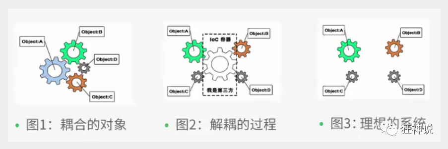

**IoC是Spring框架的核心内容**，使用多种方式完美的实现了IoC，可以使用XML配置，也可以使用注解，新版本的Spring也可以零配置实现IoC。

Spring容器在初始化时先读取配置文件，根据配置文件或元数据创建与组织对象存入容器中，程序使用时再从Ioc容器中取出需要的对象。

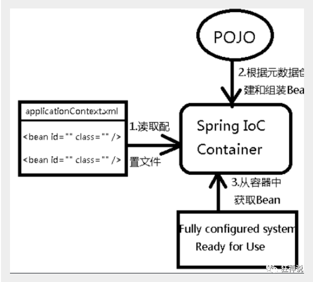

采用XML方式配置Bean的时候，Bean的定义信息是和实现分离的，而采用注解的方式可以把两者合为一体，Bean的定义信息直接以注解的形式定义在实现类中，从而达到了零配置的目的。

**控制反转是一种通过描述（XML或注解）并通过第三方去生产或获取特定对象的方式。在Spring中实现控制反转的是IoC容器，其实现方法是依赖注入（Dependency Injection,DI）。**

明白IOC的思想，是理解Spring的核心技巧

# 2.快速上手Spring

## 2.1 HelloSpring

> 导入Jar包

注 : spring 需要导入commons-logging进行日志记录 . 我们利用maven , 他会自动下载对应的依赖项 .

```xml
<dependency>
   <groupId>org.springframework</groupId>
   <artifactId>spring-webmvc</artifactId>
   <version>5.1.10.RELEASE</version>
</dependency>
```

> 编写代码

1、编写一个Hello实体类

```java
public class Hello {
   private String name;

   public String getName() {
       return name;
  }
   public void setName(String name) {
       this.name = name;
  }

   public void show(){
       System.out.println("Hello,"+ name );
  }
}
```

2、编写我们的spring文件 , 这里我们命名为beans.xml

```xml
<?xml version="1.0" encoding="UTF-8"?>
<beans xmlns="http://www.springframework.org/schema/beans"
      xmlns:xsi="http://www.w3.org/2001/XMLSchema-instance"
      xsi:schemaLocation="http://www.springframework.org/schema/beans
       http://www.springframework.org/schema/beans/spring-beans.xsd">
    <!--bean就是java对象 , 由Spring创建和管理
    类型 变量名 = new 类型（）；
    Hello hello = new Hello();s
        bean = 对象 new Hello();

        id = 变量名
        class = new的对象
        property相当于给对象的属性设置值

    -->
    <!--
            ref:引用spring容器中创建好的对象
            value:具体的值，基本数据类型
        -->
   <bean id="hello" class="com.kuang.pojo.Hello">
       <property name="name" value="Spring"/>
   </bean>

</beans>
```

3、我们可以去进行测试了 .

```java
@Test
public void test(){
   //解析beans.xml文件 , 生成管理相应的Bean对象
   ApplicationContext context = new ClassPathXmlApplicationContext("beans.xml");
   //getBean : 参数即为spring配置文件中bean的id .
   Hello hello = (Hello) context.getBean("hello");
   hello.show();
}
```


> 思考

- Hello 对象是谁创建的 ?  【hello 对象是由Spring创建的
- Hello 对象的属性是怎么设置的 ?  hello 对象的属性是由Spring容器设置的

这个过程就叫控制反转 :

- 控制 : 谁来控制对象的创建 , 传统应用程序的对象是由程序本身控制创建的 , 使用Spring后 , 对象是由Spring来创建的
- 反转 : 程序本身不创建对象 , 而变成被动的接收对象 .

依赖注入 : 就是利用set方法来进行注入的.

 IOC是一种编程思想，由主动的编程变成被动的接收

可以通过newClassPathXmlApplicationContext去浏览一下底层源码 .


> 修改案例一

我们在案例一中， 新增一个Spring配置文件beans.xml

```xml
<?xml version="1.0" encoding="UTF-8"?>
<beans xmlns="http://www.springframework.org/schema/beans"
      xmlns:xsi="http://www.w3.org/2001/XMLSchema-instance"
      xsi:schemaLocation="http://www.springframework.org/schema/beans
       http://www.springframework.org/schema/beans/spring-beans.xsd">

   <bean id="MysqlImpl" class="com.kuang.dao.impl.UserDaoMySqlImpl"/>
   <bean id="OracleImpl" class="com.kuang.dao.impl.UserDaoOracleImpl"/>

   <bean id="ServiceImpl" class="com.kuang.service.impl.UserServiceImpl">
       <!--注意: 这里的name并不是属性 , 而是set方法后面的那部分 , 首字母小写-->
       <!--引用另外一个bean , 不是用value 而是用 ref-->
       <property name="userDao" ref="OracleImpl"/>
   </bean>

</beans>
```

测试！

```java
@Test
public void test2(){
   ApplicationContext context = new ClassPathXmlApplicationContext("beans.xml");
   UserServiceImpl serviceImpl = (UserServiceImpl) context.getBean("ServiceImpl");
   serviceImpl.getUser();
}
```

OK , 到了现在 , 我们彻底不用再程序中去改动了 , 要实现不同的操作 , 只需要在xml配置文件中进行修改 , 所谓的IoC,一句话搞定 : 对象由Spring 来创建 , 管理 , 装配 ! 


## 2.2 IOC创建对象方式

共有4种

spring容器

在配置文件加载的时候，容器中管理的对象就已经初始化了！

> **通过无参构造方法来创建**

1、User.java

```java
public class User {

   private String name;

   public User() {
       System.out.println("user无参构造方法");
  }

   public void setName(String name) {
       this.name = name;
  }

   public void show(){
       System.out.println("name="+ name );
  }

}
```

2、beans.xml

```xml
<?xml version="1.0" encoding="UTF-8"?>
<beans xmlns="http://www.springframework.org/schema/beans"
      xmlns:xsi="http://www.w3.org/2001/XMLSchema-instance"
      xsi:schemaLocation="http://www.springframework.org/schema/beans
       http://www.springframework.org/schema/beans/spring-beans.xsd">

   <bean id="user" class="com.kuang.pojo.User">
       <property name="name" value="kuangshen"/>
   </bean>

</beans>
```

3、测试类

```java
@Test
public void test(){
   ApplicationContext context = new ClassPathXmlApplicationContext("beans.xml");
   //在执行getBean的时候, user已经创建好了 , 通过无参构造
   User user = (User) context.getBean("user");
   //调用对象的方法 .
   user.show();
}
```

结果可以发现，在调用show方法之前，User对象已经通过无参构造初始化了！


> **通过有参构造方法来创建**

1、UserT . java

```java
public class UserT {

   private String name;

   public UserT(String name) {
       this.name = name;
  }

   public void setName(String name) {
       this.name = name;
  }

   public void show(){
       System.out.println("name="+ name );
  }

}
```

2、beans.xml 有**三种方式**编写

```xml
<!-- 第一种根据index参数下标设置 -->
<bean id="userT" class="com.kuang.pojo.UserT">
   <!-- index指构造方法 , 下标从0开始 -->
   <constructor-arg index="0" value="kuangshen2"/>
</bean>
<!-- 第二种根据参数名字设置 -->
<bean id="userT" class="com.kuang.pojo.UserT">
   <!-- name指参数名 -->
   <constructor-arg name="name" value="kuangshen2"/>
</bean>
<!-- 第三种根据参数类型设置(不推荐使用) -->
<bean id="userT" class="com.kuang.pojo.UserT">
   <constructor-arg type="java.lang.String" value="kuangshen2"/>
</bean>
```

3、测试

```java
@Test
public void testT(){
   ApplicationContext context = new ClassPathXmlApplicationContext("beans.xml");
   UserT user = (UserT) context.getBean("userT");
   user.show();
}
```

结论：在配置文件加载的时候。其中管理的对象都已经初始化了！

## 2.3 Spring配置

> **别名**

alias 设置别名 , 为bean设置别名 , 可以设置多个别名

```xml
<!--设置别名：在获取Bean的时候可以使用别名获取-->
<alias name="userT" alias="userNew"/>
```

> **Bean的配置**

```xml
<!--bean就是java对象,由Spring创建和管理-->

<!--
   id 是bean的标识符,要唯一,如果没有配置id,name就是默认标识符
   如果配置id,又配置了name,那么name是别名
   name：也是别名，name比alias更高级可以设置多个别名,可以用逗号,分号,空格隔开
   如果不配置id和name,可以根据applicationContext.getBean(.class)获取对象;

	class：bean的全限定名=包名+类名

-->
<bean id="userT" name="hello2 h2,h3;h4" class="com.kuang.pojo.UserT">
   <property name="name" value="西部开源"/>
</bean>
```

> **import**

团队的合作通过import来实现 .可以将多个配置文件导入合并为一个

```xml
<import resource="{path}/beans.xml"/>
```

假设，现在项目中有多个人开发，这三个人负责不同类的开发，不同的类需要注册在不同的bean中，可以利用import将所有人的beans.xml合并为一个总的,使用的时候使用总的就可以了

张三

李四

王五

applicationConetxt.xml

```xml
<?xml version="1.0" encoding="UTF-8"?>
<beans xmlns="http://www.springframework.org/schema/beans"
       xmlns:xsi="http://www.w3.org/2001/XMLSchema-instance"
       xsi:schemaLocation="http://www.springframework.org/schema/beans
       http://www.springframework.org/schema/beans/spring-beans.xsd">
    <import resource="beans.xml"/>
    <import resource="beans2.xml"/>
    <import resource="beans3.xml"/>
</beans>
```

# 3.依赖注入（DI）

Dependency Injection

> 概念

- 依赖注入（Dependency Injection,DI）。
- 依赖 : 指Bean对象的创建依赖于容器 . Bean对象的依赖资源 .
- 注入 : 指Bean对象所依赖的资源 , 由容器来设置和装配 .

## 3.1构造器注入

我们在之前的案例已经讲过了

## 3.2Set 注入 （重点）

依赖：bean对象的创建依赖于容器

注入：bean对象的所有属性右容器注入

要求被注入的属性 , 必须有set方法 , set方法的方法名由set + 属性首字母大写 , 如果属性是boolean类型 , 没有set方法 , 是 is .

测试pojo类 :

1. Address.java

```java
 public class Address {
 
     private String address;
 
     public String getAddress() {
         return address;
    }
 
     public void setAddress(String address) {
         this.address = address;
    }
 }
```

2. Student.java

```java
 package com.kuang.pojo;
 
 import java.util.List;
 import java.util.Map;
 import java.util.Properties;
 import java.util.Set;
 
 public class Student {
     private String name;
     private Address address;
     private String[] books;
     private List<String> hobbys;
     private Map<String,String> card;
     private Set<String> games;
     private String wife;
     private Properties info;
//get set toString...
 }
```

3.beans.xml

```xml
<?xml version="1.0" encoding="UTF-8"?>
<beans xmlns="http://www.springframework.org/schema/beans"
       xmlns:xsi="http://www.w3.org/2001/XMLSchema-instance"
       xsi:schemaLocation="http://www.springframework.org/schema/beans
       http://www.springframework.org/schema/beans/spring-beans.xsd">
    <bean id="student" class="com.kuang.pojo.Student">
        <!--第一种，普通注入，value-->
        <property name="name" value="小明"/>
    </bean>

</beans>
```

4. 测试类

```java
import com.kuang.pojo.Student;
import org.junit.Test;
import org.springframework.context.ApplicationContext;
import org.springframework.context.support.ClassPathXmlApplicationContext;

public class MyTest {
    @Test
    public void test01(){
        ApplicationContext context = new ClassPathXmlApplicationContext("applicationContext.xml");

        Student student = (Student) context.getBean("student");

        System.out.println(student.getName());

    }
}

```

5. 完善注入信息

```xml
<?xml version="1.0" encoding="UTF-8"?>
<beans xmlns="http://www.springframework.org/schema/beans"
       xmlns:xsi="http://www.w3.org/2001/XMLSchema-instance"
       xsi:schemaLocation="http://www.springframework.org/schema/beans
       http://www.springframework.org/schema/beans/spring-beans.xsd">
    <bean id="address" class="com.kuang.pojo.Address">
        <property name="address" value="西安"/>
    </bean>
    <bean id="student" class="com.kuang.pojo.Student">
        <!--第1种，普通注入，value-->
        <property name="name" value="小明"/>

        <!--第2种，Bean注入，ref-->
        <property name="address" ref="address"/>

        <!--第3种，数组注入，array-->
        <property name="books">
            <array>
                <value>红楼梦</value>
                <value>三国演义</value>
                <value>水浒传</value>
                <value>西游记</value>
            </array>
        </property>

        <!--第4种，List注入，list-->
        <property name="hobbys">
            <list>
                <value>听歌</value>
                <value>敲代码</value>
                <value>看电影</value>
            </list>
        </property>

        <!--第5种，Map注入，map-->
        <property name="card">
            <map>
                <entry key="身份证" value="1234567890"/>
                <entry key="银行卡" value="6664567890"/>
            </map>
        </property>

        <!--第6种，Set注入-->
        <property name="games">
            <set>
                <value>LOL</value>
                <value>COC</value>
                <value>BOB</value>
            </set>
        </property>

        <!--第7种，null注入-->
        <property name="wife">
            <null/>
        </property>

        <!--第8种，Properties注入-->
        <property name="info">
            <props>
                <prop key="driver">20190525</prop>
                <prop key="url">20190525</prop>
                <prop key="username">root</prop>
                <prop key="password">123456</prop>
            </props>
        </property>
    </bean>

</beans>
```


1、**常量注入**

```xml
 <bean id="student" class="com.kuang.pojo.Student">
     <!--第一种，普通注入，value-->
     <property name="name" value="小明"/>
 </bean>
```

测试：

```xml
 @Test
 public void test01(){
     ApplicationContext context = newClassPathXmlApplicationContext("applicationContext.xml");
 
     Student student = (Student) context.getBean("student");
 
     System.out.println(student.getName());
 
 }
```

2、**Bean注入** 

注意点：这里的值是一个引用，ref

```xml
 <bean id="addr" class="com.kuang.pojo.Address">
     <property name="address" value="重庆"/>
 </bean>
 
 <bean id="student" class="com.kuang.pojo.Student">
     <property name="name" value="小明"/>
     <property name="address" ref="addr"/>
 </bean>
```

3、**数组注入**

```xml
 <bean id="student" class="com.kuang.pojo.Student">
     <property name="name" value="小明"/>
     <property name="address" ref="addr"/>
     <property name="books">
         <array>
             <value>西游记</value>
             <value>红楼梦</value>
             <value>水浒传</value>
         </array>
     </property>
 </bean>
```

4、**List注入**

```xml
 <property name="hobbys">
     <list>
         <value>听歌</value>
         <value>看电影</value>
         <value>爬山</value>
     </list>
 </property>
```

5、**Map注入**

```xml
 <property name="card">
     <map>
         <entry key="中国邮政" value="456456456465456"/>
         <entry key="建设" value="1456682255511"/>
     </map>
 </property>
```

6、**set注入**

```xml
 <property name="games">
     <set>
         <value>LOL</value>
         <value>BOB</value>
         <value>COC</value>
     </set>
 </property>
```

7、**Null注入**

```xml
 <property name="wife"><null/></property>
```

8、**Properties注入**

```xml
 <property name="info">
     <props>
         <prop key="学号">20190604</prop>
         <prop key="性别">男</prop>
         <prop key="姓名">小明</prop>
     </props>
 </property>
```

测试结果：


## 3.3 p命名和c命名注入

User.java ：【注意：这里没有有参构造器！】

```java
 public class User {
     private String name;
     private int age;
 
     public void setName(String name) {
         this.name = name;
    }
 
     public void setAge(int age) {
         this.age = age;
    }
 
     @Override
     public String toString() {
         return "User{" +
                 "name='" + name + '\'' +
                 ", age=" + age +
                 '}';
    }
 }
```

1、P命名空间注入 : 需要在头文件中加入约束文件

```xml
xmlns:p="http://www.springframework.org/schema/p"
```

userbeans.xml

```xml
<?xml version="1.0" encoding="UTF-8"?>
<beans xmlns="http://www.springframework.org/schema/beans"
       xmlns:xsi="http://www.w3.org/2001/XMLSchema-instance"
       xmlns:p="http://www.springframework.org/schema/p"
       xsi:schemaLocation="http://www.springframework.org/schema/beans
       http://www.springframework.org/schema/beans/spring-beans.xsd">
    <!--P(属性: properties)命名空间注入 ,可以直接注入属性的值，属性依然要设置set方法-->
    <bean id="user" class="com.kuang.pojo.User" p:name="狂神" p:age="18"/>
</beans>
```

测试类

```java
@Test
public void test02(){
    ApplicationContext context = new ClassPathXmlApplicationContext("userbeans.xml");

    User user = context.getBean("user",User.class);//User.class,这样就不用强转了

    System.out.println(user.toString());

}
```

2、c 命名空间注入 : 需要在头文件中加入约束文件

```xml
xmlns:c="http://www.springframework.org/schema/c"
```

userbeans.xml

```xml
<!--C(构造: Constructor)命名空间 , 属性依然要设置set方法-->
 <bean id="user" class="com.kuang.pojo.User" c:name="狂神" c:age="18"/>
```

把有User类参构造器加上，这里也能知道，c 就是所谓的构造器注入！

注意点:p命名空间和c命名空间不能直接使用，需要导入xml约束

```xml
xmlns:p="http://www.springframework.org/schema/p"
xmlns:c="http://www.springframework.org/schema/c"
```

## 3.4 Bean的作用域

在Spring中，那些组成应用程序的主体及由Spring IoC容器所管理的对象，被称之为bean。简单地讲，bean就是由IoC容器初始化、装配及管理的对象 .


几种作用域中，request、session作用域仅在基于web的应用中使用（不必关心你所采用的是什么web应用框架），只能用在基于web的Spring ApplicationContext环境。

#### Singleton(单例模式，默认)

当一个bean的作用域为Singleton，那么Spring IoC容器中只会存在一个共享的bean实例，并且所有对bean的请求，只要id与该bean定义相匹配，则只会返回bean的同一实例。Singleton是单例类型，就是在创建起容器时就同时自动创建了一个bean的对象，不管你是否使用，他都存在了，每次获取到的对象都是同一个对象。注意，Singleton作用域是Spring中的缺省作用域。要在XML中将bean定义成singleton，可以这样配置：

```xml
 <bean id="ServiceImpl" class="cn.csdn.service.ServiceImpl" scope="singleton">
```

测试：

```java
 @Test
 public void test03(){
     ApplicationContext context = newClassPathXmlApplicationContext("applicationContext.xml");
     User user = (User) context.getBean("user");
     User user2 = (User) context.getBean("user");
     System.out.println(user==user2);
 }
```

#### Prototype(原型模式)

当一个bean的作用域为Prototype，表示一个bean定义对应多个对象实例。Prototype作用域的bean会导致在每次对该bean请求（将其注入到另一个bean中，或者以程序的方式调用容器的getBean()方法）时都会创建一个新的bean实例。Prototype是原型类型，它在我们创建容器的时候并没有实例化，而是当我们获取bean的时候才会去创建一个对象，而且我们每次获取到的对象都不是同一个对象。根据经验，对有状态的bean应该使用prototype作用域，而对无状态的bean则应该使用singleton作用域。在XML中将bean定义成prototype，可以这样配置：

```xml
 <bean id="account" class="com.foo.DefaultAccount" scope="prototype"/>  
  或者
 <bean id="account" class="com.foo.DefaultAccount" singleton="false"/>
```

#### Request

当一个bean的作用域为Request，表示在一次HTTP请求中，一个bean定义对应一个实例；即每个HTTP请求都会有各自的bean实例，它们依据某个bean定义创建而成。该作用域仅在基于web的Spring ApplicationContext情形下有效。考虑下面bean定义：

```xml
 <bean id="loginAction" class="cn.csdn.LoginAction" scope="request"/>
```

针对每次HTTP请求，Spring容器会根据loginAction bean的定义创建一个全新的LoginAction bean实例，且该loginAction bean实例仅在当前HTTP request内有效，因此可以根据需要放心的更改所建实例的内部状态，而其他请求中根据loginAction bean定义创建的实例，将不会看到这些特定于某个请求的状态变化。当处理请求结束，request作用域的bean实例将被销毁。

#### Session

当一个bean的作用域为Session，表示在一个HTTP Session中，一个bean定义对应一个实例。该作用域仅在基于web的Spring ApplicationContext情形下有效。考虑下面bean定义：

```xml
 <bean id="userPreferences" class="com.foo.UserPreferences" scope="session"/>
```

针对某个HTTP Session，Spring容器会根据userPreferences bean定义创建一个全新的userPreferences bean实例，且该userPreferences bean仅在当前HTTP Session内有效。与request作用域一样，可以根据需要放心的更改所创建实例的内部状态，而别的HTTP Session中根据userPreferences创建的实例，将不会看到这些特定于某个HTTP Session的状态变化。当HTTP Session最终被废弃的时候，在该HTTP Session作用域内的bean也会被废弃掉。

# 4.Bean的自动装配

- 自动装配是使用spring满足bean依赖的一种方法
- spring会在应用上下文中为某个bean寻找其依赖的bean。

pring中bean有三种装配机制，分别是：

1. 在xml中显式配置；
2. 在java中显式配置；
3. **隐式的bean发现机制和自动装配。**

这里我们主要讲第三种：自动化的装配bean。

Spring的自动装配需要从两个角度来实现，或者说是两个操作：

1. 组件扫描(component scanning)：spring会自动发现应用上下文中所创建的bean；
2. 自动装配(autowiring)：spring自动满足bean之间的依赖，也就是我们说的IoC/DI；

组件扫描和自动装配组合发挥巨大威力，使得显示的配置降低到最少。

**荐不使用自动装配xml配置 , 而使用注解 .**

## 4.1测试环境搭建

1、新建一个项目

2、新建两个实体类，Cat  Dog  都有一个叫的方法

```java
public class Cat {
   public void shout() {
       System.out.println("miao~");
  }
}
public class Dog {
   public void shout() {
       System.out.println("wang~");
  }
}
```

3、新建一个用户类 People

```java
package com.kuang.pojo;

public class People {
    private Cat cat;
    private Dog dog;
    private String name;
}//get set toSrtirng
```

4、编写Spring配置文件

```xml
<?xml version="1.0" encoding="UTF-8"?>
<beans xmlns="http://www.springframework.org/schema/beans"
       xmlns:xsi="http://www.w3.org/2001/XMLSchema-instance"
       xsi:schemaLocation="http://www.springframework.org/schema/beans
       http://www.springframework.org/schema/beans/spring-beans.xsd">

    <bean id="dog" class="com.kuang.pojo.Dog"/>
    <bean id="cat" class="com.kuang.pojo.Cat"/>

    <bean id="people" class="com.kuang.pojo.People">
        <property name="name" value="qinjiang"/>
        <property name="dog" ref="dog"/>
        <property name="cat" ref="cat"/>
    </bean>
</beans>
```

5、测试

```java
    @Test
    public void test1(){
        ApplicationContext context = new ClassPathXmlApplicationContext("bean.xml");
        People people = context.getBean("people", People.class);
        people.getCat().shout();
        people.getDog().shout();
    }
```

## 4.2 byName按名称自动装配

由于在手动配置xml过程中，常常发生字母缺漏和大小写等错误，而无法对其进行检查，使得开发效率降低。

采用自动装配将避免这些错误，并且使配置简单化。

测试：

1、修改bean配置，增加一个属性  autowire="byName"

```xml
    <!--
        byName：会自动在容器上下文中查找，和自己对象set方法后面的值对应的bean id
    -->
<bean id="user" class="com.kuang.pojo.User" autowire="byName">
   <property name="str" value="qinjiang"/>
</bean>
```

2、再次测试，结果依旧成功输出！

3、我们将 cat 的bean id修改为 catXXX

4、再次测试， 执行时报空指针java.lang.NullPointerException。因为按byName规则找不对应set方法，真正的setCat就没执行，对象就没有初始化，所以调用时就会报空指针错误。

**小结：**

当一个bean节点带有 autowire byName的属性时。

1. 将查找其类中所有的set方法名，例如setCat，获得将set去掉并且首字母小写的字符串，即cat。
2. 去spring容器中寻找是否有此字符串名称id的对象。
3. 如果有，就取出注入；如果没有，就报空指针异常。

## 4.3 byType按类型自动装配

使用autowire byType首先需要保证：同一类型的对象，在spring容器中唯一。如果不唯一，会报不唯一的异常。

```
NoUniqueBeanDefinitionException
```

测试：

1、将user的bean配置修改一下 ： autowire="byType"

2、测试，正常输出

3、在注册一个cat 的bean对象！

```xml
<bean id="dog" class="com.kuang.pojo.Dog"/>
<bean id="cat" class="com.kuang.pojo.Cat"/>
<bean id="cat2" class="com.kuang.pojo.Cat"/>

<bean id="user" class="com.kuang.pojo.User" autowire="byType">
   <property name="str" value="qinjiang"/>
</bean>
```

4、测试，报错：NoUniqueBeanDefinitionException

5、删掉cat2，将cat的bean名称改掉！测试！因为是按类型装配，所以并不会报异常，也不影响最后的结果。**甚至将id属性去掉，也不影响结果**。

这就是按照类型自动装配！

小结：

- byName的时候，需要保证所有bean的id唯一，并且这个bean需要和自动注入的属性的set方法的值一致
- byTpye的时候，需要保证所有bean的class唯一，并且这个bean需要和自动注入的属性类型一致

## 4.4使用注解Autowired

jdk1.5开始支持注解，spring2.5开始全面支持注解。

要使用注解：

1. 导入约束:context约束

   ```
   xmlns:context="http://www.springframework.org/schema/context"
   
   http://www.springframework.org/schema/context
   http://www.springframework.org/schema/context/spring-context.xsd
   ```

2. ==配置注解的支持\<context:annotation-config/\>==

   ```xml
   <context:annotation-config/>
   ```

   ```xml
   <?xml version="1.0" encoding="UTF-8"?>
   <beans xmlns="http://www.springframework.org/schema/beans"
          xmlns:xsi="http://www.w3.org/2001/XMLSchema-instance"
          xmlns:context="http://www.springframework.org/schema/context"
          xsi:schemaLocation="http://www.springframework.org/schema/beans
          http://www.springframework.org/schema/beans/spring-beans.xsd
          http://www.springframework.org/schema/context
          http://www.springframework.org/schema/context/spring-context.xsd">
   
   	<context:annotation-config/>
   </beans>
   ```

### @Autowired

直接在属性上使用即可，也可以在set方法上使用

使用@Autowired，可以不用编写se方法了,前提是你这个自动装配的属性在IOC( Spring)容器中存在,且符合名字 byType!

```java
@Nullable 字段标记了这个注解，说明这个字段可以为null,否则不允许为空
```

```java
public @interface Autowired {
    boolean required() default true;
}
```


```java
public class People {
    //如果显式定义了Autowired的required属性为false，说明这个对象可以为null，否则不允许为空
    @Autowired(required = false)
    private Cat cat;
    @Autowired
    private Dog dog;
    private String name;
}
```

### @Qualifier

- @Autowired是根据类型自动装配的，加上@Qualifier则可以根据byName的方式自动装配
- @Qualifier不能单独使用。

测试实验步骤：

1、配置文件修改内容，保证类型存在对象。且名字不为类的默认名字！

```
<bean id="dog1" class="com.kuang.pojo.Dog"/>
<bean id="dog2" class="com.kuang.pojo.Dog"/>
<bean id="cat1" class="com.kuang.pojo.Cat"/>
<bean id="cat2" class="com.kuang.pojo.Cat"/>
```

2、没有加Qualifier测试，直接报错

3、在属性上添加Qualifier注解

```
@Autowired
@Qualifier(value = "cat2")
private Cat cat;
@Autowired
@Qualifier(value = "dog2")
private Dog dog;
```

测试，成功输出！

如果@Autowired自动装配的环境比较复杂，自动装配无法通过一个注解【@ Autowired】完成的时候、我们可以使用@ Qualifier(vaue="xXx")去配置@ Autowiredl的使用,指定一个唯一的bean对象注入!

```java
public class People {
    @Autowired
    @Qualifier(value="cat111")
    private Cat cat;
    @Autowired
    @Qualifier(value="dog222")
    private Dog dog;
    private String name;
}
```

### @Resource（jdk自带的注解）

- @Resource如有指定的name属性，先按该属性进行byName方式查找装配；
- 其次再进行默认的byName方式进行装配；
- 如果以上都不成功，则按byType的方式自动装配。
- 都不成功，则报异常。

实体类：

```
public class User {
   //如果允许对象为null，设置required = false,默认为true
   @Resource(name = "cat2")
   private Cat cat;
   @Resource
   private Dog dog;
   private String str;
}
```

beans.xml

```
<bean id="dog" class="com.kuang.pojo.Dog"/>
<bean id="cat1" class="com.kuang.pojo.Cat"/>
<bean id="cat2" class="com.kuang.pojo.Cat"/>

<bean id="user" class="com.kuang.pojo.User"/>
```

测试：结果OK

配置文件2：beans.xml ， 删掉cat2

```
<bean id="dog" class="com.kuang.pojo.Dog"/>
<bean id="cat1" class="com.kuang.pojo.Cat"/>
```

实体类上只保留注解

```
@Resource
private Cat cat;
@Resource
private Dog dog;
```

结果：OK


小结：@Resource和@Autowired的区别

- 都是用来自动装配的，都可以放在属性字段上
- @ Autowired通过 byType的方式实现,而且要求这个对象必须存在【常用】
- @ Resource默认通过 byName的方式实现,如果找不到名字,则通过 byType实现!如果两个都找不到的情况下,就报错!

执行顺序不同：

- @ Autowired通过 byType的方式实现，@ Resource默认通过 byName的方式实现

# 5.使用注解开发

在spring4之后，要使用注解开发，必须要保证aop的包导入了

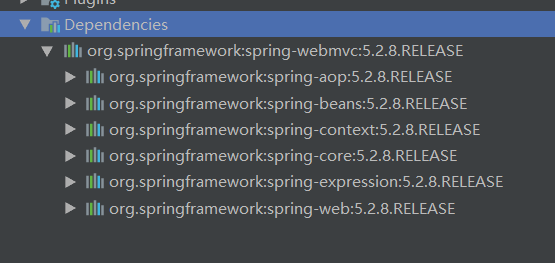

在使用注解需要导入context约束，增加注解的支持

applicationContext.xml

```xml
<?xml version="1.0" encoding="UTF-8"?>
<beans xmlns="http://www.springframework.org/schema/beans"
       xmlns:xsi="http://www.w3.org/2001/XMLSchema-instance"
       xmlns:context="http://www.springframework.org/schema/context"
       xsi:schemaLocation="http://www.springframework.org/schema/beans
       http://www.springframework.org/schema/beans/spring-beans.xsd
       http://www.springframework.org/schema/context
       http://www.springframework.org/schema/context/spring-context.xsd">
    <!--开启注解支持-->
    <context:annotation-config/>

</beans>
```


## 5.1 bean


## 5.2 属性如何注入

```java
package com.kuang.pojo;

import org.springframework.beans.factory.annotation.Value;
import org.springframework.stereotype.Component;

// 相当于配置文件中 <bean id="user" class="com.kuang.User"/>
@Component("user")
public class User {
   //相当于<property name="name" value="kuangshen"/>
   //也可以放在set方法上
   @Value("kuangshen")
   public String name;
}
```


## 5.3 衍生的注解

@Component有几个衍生注解，我们在web开发中，会按照mvc三层架构分层

- dao   @Repository
- service  @Service  
- controller @Controller 

这四个注解功能都是一样的，都是将某个类注册到Spring中,装配bean

## 5.4 自动装配

```
- @Autowired:自动装配，通过类型，再名字
    如果Autowired不能唯一自动装配上属性，则需要通过@Qualifier(value="xxx")
- @Nullable 字段标记了这个注解，说明这个字段可以为null
- @Resource:自动装配，通过名字，再类型
```

## 5.5 作用域

```java
// 相当于配置文件中 <bean id="user" class="com.kuang.User"/>
@Component("user")
@Scope("prototype")
public class User {
   //相当于<property name="name" value="kuangshen"/>
   //也可以放在set方法上
   @Value("kuangshen")
   public String name;
}
```

## 5.6小结

xml与注解

- xml更加万能，适用于任何场合！维护简单方便
- 注解 不是自己类使用不了，维护相对复杂

xml与注解最佳实践

- xml原来管理bean
- 注解只负责完成属性的注入
- 我们在使用的过程中，只需要注意一个问题：必须让注解生效，就需要开启注解的支持

```xml
    <!--开启注解支持-->
    <context:annotation-config/>
    <!--指定要扫描的包，这个包下的注解就会生效-->
    <context:component-scan base-package="com.kuang"/>
```

# 6.使用Java的方式配置Spring

我们现在要完全不使用Spring的xml配置了，全权交给Java来做

JavaConfig是Spring的一个子项目，在Spring4之后，它就称为了一个核心功能

实体类

```java
package com.kuang.pojo;

import org.springframework.beans.factory.annotation.Value;
import org.springframework.stereotype.Component;
//这里这个注解的意思，就是说明这个类被Spring容器接管了，注册到了容器中
@Component
public class User {
    @Value("qinjiang")
    private String name;

    public String getName() {
        return name;
    }

    public void setName(String name) {
        this.name = name;
    }

    @Override
    public String toString() {
        return "User{" +
                "name='" + name + '\'' +
                '}';
    }
}

```

配置文件

```java
package com.kuang.config;

import com.kuang.pojo.User;
import org.springframework.context.annotation.Bean;
import org.springframework.context.annotation.ComponentScan;
import org.springframework.context.annotation.Configuration;
import org.springframework.context.annotation.Import;

//@Configuration代表这个一个配置类，和我们之前看的beans.xml一样的
@Configuration//这个也会被Spring容器接管，注册到容器中，因为它本来就是一个@Component
@ComponentScan("com.kuang.pojo")
@Import(KuangConfig2.class)
public class KuangConfig {
    //注册一个bean，就相当于我们之前写的一个bean标签
    //这个方法的名字，就相当于bean标签中的id属性
    //这个方法的返回值，就相当于bean标签中的class属性
    @Bean
    public User getUser(){
        return new User();//就是返回要注入到bean的对象
    }
}
```


```java
package com.kuang.config;

import com.kuang.pojo.User;
import org.springframework.context.annotation.Bean;
import org.springframework.context.annotation.ComponentScan;
import org.springframework.context.annotation.Configuration;

//@Configuration代表这个一个配置类，和我们之前看的beans.xml一样的
@Configuration//这个也会被Spring容器接管，注册到容器中，因为它本来就是一个@Component
@ComponentScan("com.kuang.pojo")
public class KuangConfig2 {
    //注册一个bean，就相当于我们之前写的一个bean标签
    //这个方法的名字，就相当于bean标签中的id属性
    //这个方法的返回值，就相当于bean标签中的class属性
    @Bean
    public User getUser(){
        return new User();//就是返回要注入到bean的对象
    }
}
```

测试类

```java
import com.kuang.config.KuangConfig;
import com.kuang.pojo.User;
import org.junit.Test;
import org.springframework.context.ApplicationContext;
import org.springframework.context.annotation.AnnotationConfigApplicationContext;

public class MyTest {
    @Test
    public void test1(){
        //如果完全使用了配置类方式去做，我们只能通过AnnotationConfig上下文来获取容器，通过配置类的class对象加载
        ApplicationContext context = new AnnotationConfigApplicationContext(KuangConfig.class);
        User getUser = (User) context.getBean("user");
        System.out.println(getUser.getName());
    }
}
```

这种纯Java的配置方式，在SpringBoot中随处可见

# 7.代理模式

为什么要学习代理模式，因为这就是Spring AOP的底层【Spring AOP和SpringMVC】

- 静态代理
- 动态代理

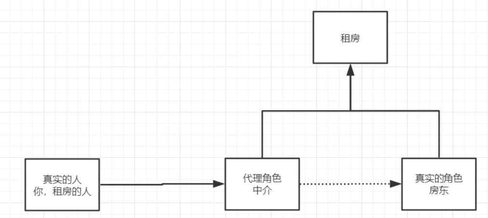


## 7.1静态代理

角色分析

- 抽象角色：一般会使用接口或者抽象类来解决
- 真实角色：被代理的角色
- 代理角色：代理真实角色后，一般会做一些附属操作
- 客户：访问代理对象的人

步骤：

1.接口

```java
package com.kuang.demo01;
//租房
public interface Rent {
    public void rent();
}
```


2.真实角色

```java
package com.kuang.demo01;
//房东
public class Host implements Rent{
    public void rent() {
        System.out.println("房东要出租房子");
    }
}
```

3.代理角色

```java
package com.kuang.demo01;

public class Proxy implements Rent {
    private Host host;

    public Proxy(Host host) {
        this.host = host;
    }

    public void rent() {
        seeHouse();
        host.rent();
        hetong();
        fare();
    }
    //看房
    public void seeHouse(){
        System.out.println("中介带你看房");
    }
    //签合同
    public void hetong(){
        System.out.println("签租赁合同");
    }
    //收中介费
    public void fare(){
        System.out.println("收中介费");
    }
}

```

4.客户端访问代理角色

```java
package com.kuang.demo01;

public class Client {
    public static void main(String[] args) {
        Host host = new Host();
        //代理,中介帮房东租房子，但是，代理一般会有一些附属操作
        Proxy proxy = new Proxy(host);
        //不用面对房东，直接找中介租房
        proxy.rent();
    }
}
```

代理模式好处：

- 可以使真实角色的操作更加纯粹!不用去关注一些公共的业务
- 公共也就就交给代理角色!实现了业务的分工公共
- 业务发生扩展的时候,方便集中管理

缺点：

- 一个真实角色就会产生一个代理角色，代码量会翻倍，开发效率低

## 7.2静态代理加深理解

```java
public interface UserService {
    public void add();
    public void delete();
    public void update();
    public void query();
}
//原有的代码
public class UserServiceImpl implements UserService {
    public void add() {
        System.out.println("增加了一个用户");
    }

    public void delete() {
        System.out.println("删除了一个用户");
    }

    public void update() {
        System.out.println("修改了一个用户");
    }

    public void query() {
        System.out.println("查询了一个用户");
    }
    //1.改动原有的代码，在公司中是大忌

}
```


```java
package com.kuang.demo02;
//利用代理，在原有的代码上增加日志方法
public class UserServiceProxy implements UserService {
    private UserServiceImpl userService;

    public void setUserService(UserServiceImpl userService) {
        this.userService = userService;
    }

    public void add() {
        log("add");
        userService.add();
    }

    public void delete() {
        log("delete");
        userService.delete();
    }

    public void update() {
        log("update");
        userService.update();
    }

    public void query() {
        log("query");
        userService.query();
    }
    //日志方法
    public void log(String msg){
        System.out.println("使用了"+msg+"方法");
    }
}
```

```java
package com.kuang.demo02;

public class Client {
    public static void main(String[] args) {
        UserServiceImpl userService = new UserServiceImpl();
        UserServiceProxy proxy = new UserServiceProxy();
        proxy.setUserService(userService);
        proxy.add();
    }
}
```

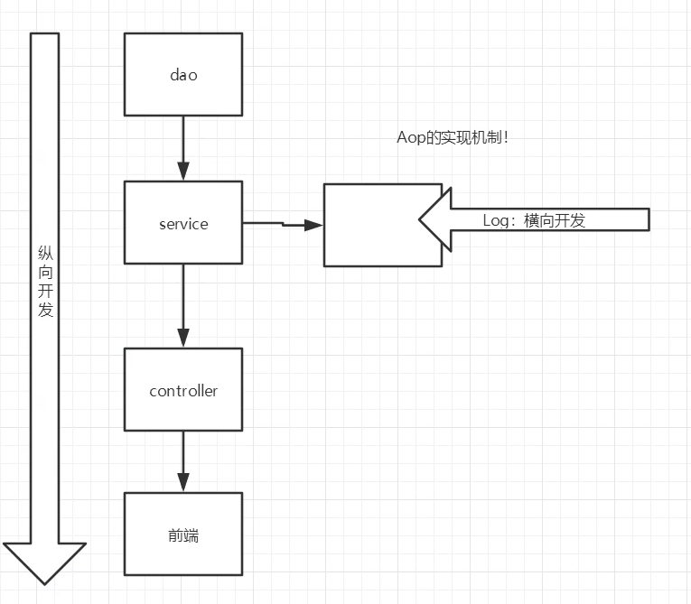


## 7.3 动态代理

- 动态代理和静态代理角色一样
- 动态代理的代理类是动态生成的，不是我们直接写好的
- 动态代理分为两大类：基于接口的动态代理，基于类的动态代理
  - 基于接口--JDK动态代理【我们在这里使用】
  - 基于类：cglib
  - java字节码实现：javasist

需要了解两个类：Proxy:代理,InvocationHandler：调用处理程序


动态代理的好处：

- 可以使真实角色的操作更加纯粹!不用去关注一些公共的业务
- 公共也就就交给代理角色!实现了业务的分工公共
- 业务发生扩展的时候,方便集中管理
- 一个动态代理类代理的是一个接口，一般就是对应一类业务
- 一个动态代理类可以代理多个类，只要是实现了同一个接口即可

### 7.3.1租房子动态代理

```java
//租房
public interface Rent {
    public void rent();
}
//房东
public class Host implements Rent {
    public void rent() {
        System.out.println("房东要出租房子");
    }
}
```

```java
package com.kuang.demo03;

import java.lang.reflect.InvocationHandler;
import java.lang.reflect.Method;
import java.lang.reflect.Proxy;

//等会我们会用这个类，自动生成代理类
public class ProxyInvocationHandler implements InvocationHandler {
    //被代理的接口
    private Rent rent;
    public void setRent(Rent rent) {
        this.rent=rent;
    }

    //生成得到代理类（这段代码是固定的）
    public Object getProxy(){
        return Proxy.newProxyInstance(this.getClass().getClassLoader(), rent.getClass().getInterfaces(),this);
    }
    //处理代理实例，并返回结果
    public Object invoke(Object proxy, Method method, Object[] args) throws Throwable {
        //动态代理的本质，就是实验反射机制实现
        seeHouse();
        fare();
        Object result = method.invoke(rent, args);
        return result;
    }
    public void seeHouse(){
        System.out.println("中介看房子");
    }
    public void fare(){
        System.out.println("收中介费");
    }


}
```

客户端

```java
package com.kuang.demo03;

public class Client {
    public static void main(String[] args) {
        //真实角色
        Host host = new Host();
        //代理角色：现在没有
        ProxyInvocationHandler pih = new ProxyInvocationHandler();
        //通过调用程序处理角色来处理我们要调用的接口对象
        pih.setRent(host);
        //这里的proxy就是动态生成的，我们并没有写
        Rent proxy = (Rent) pih.getProxy();
        proxy.rent();
    }
}
```

### 7.3.2动态代理模板

```java
package com.kuang.demo04;

import java.lang.reflect.InvocationHandler;
import java.lang.reflect.Method;
import java.lang.reflect.Proxy;

//等会我们会用这个类，自动生成代理类
public class ProxyInvocationHandler implements InvocationHandler {
    //被代理的接口
    private Object target;
    public void setTarget(Object target) {
        this.target = target;
    }

    //生成得到代理类（这段代码是固定的）
    public Object getProxy(){
        return Proxy.newProxyInstance(this.getClass().getClassLoader(), target.getClass().getInterfaces(),this);
    }
    //处理代理实例，并返回结果
    public Object invoke(Object proxy, Method method, Object[] args) throws Throwable {
        //动态代理的本质，就是实验反射机制实现
        log(method.getName());
        Object result = method.invoke(target, args);
        return result;
    }
    public void log(String msg){
        System.out.println("执行了"+msg+"方法");
    }
}
```

客户端

```java
package com.kuang.demo04;


import com.kuang.demo02.UserService;
import com.kuang.demo02.UserServiceImpl;

public class Client {
    public static void main(String[] args) {
        //真实角色
        UserServiceImpl userService = new UserServiceImpl();
        //代理角色：不存在
        ProxyInvocationHandler pih = new ProxyInvocationHandler();

        pih.setTarget(userService);//设置要代理的对象

        //动态生成代理类
        UserService proxy = (UserService)pih.getProxy();

        proxy.add();
    }
}
```

# 8.AOP

## 8.1什么是AOP

AOP（Aspect Oriented Programming）意为：面向切面编程，通过预编译方式和运行期动态代理实现程序功能的统一维护的一种技术。AOP是OOP的延续，是软件开发中的一个热点，也是Spring框架中的一个重要内容，是函数式编程的一种衍生范型。利用AOP可以对业务逻辑的各个部分进行隔离，从而使得业务逻辑各部分之间的耦合度降低，提高程序的可重用性，同时提高了开发的效率。

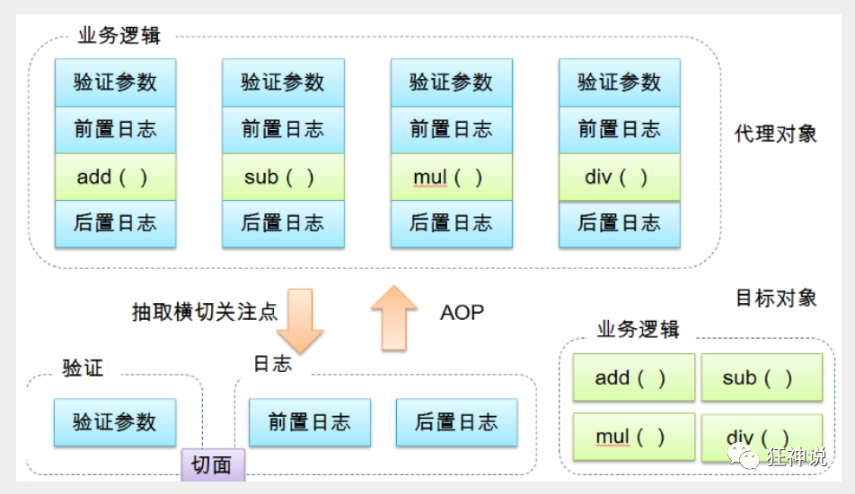

## 8.2Aop在Spring中的作用

提供声明式事务；允许用户自定义切面

以下名词需要了解下：

- 横切关注点：跨越应用程序多个模块的方法或功能。即是，与我们业务逻辑无关的，但是我们需要关注的部分，就是横切关注点。如日志 , 安全 , 缓存 , 事务等等 ....
- 切面（ASPECT）：横切关注点 被模块化 的特殊对象。即，它是一个类。
- 通知（Advice）：切面必须要完成的工作。即，它是类中的一个方法。
- 目标（Target）：被通知对象。
- 代理（Proxy）：向目标对象应用通知之后创建的对象。
- 切入点（PointCut）：切面通知 执行的 “地点”的定义。
- 连接点（JointPoint）：与切入点匹配的执行点。

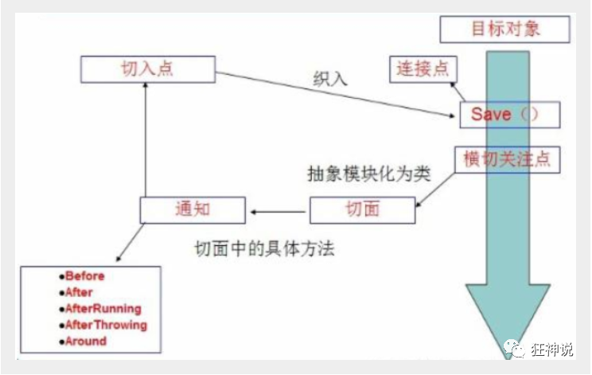

SpringAOP中，通过Advice定义横切逻辑，Spring中支持5种类型的Advice:

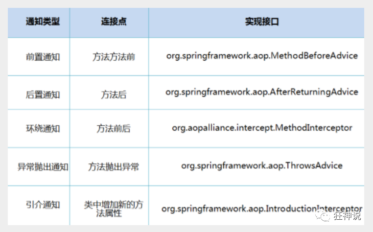

即 Aop 在 不改变原有代码的情况下 , 去增加新的功能 .

## 8.3使用Spring实现Aop

【重点】使用AOP织入，需要导入一个依赖包！

```xml
<!-- https://mvnrepository.com/artifact/org.aspectj/aspectjweaver -->
<dependency>
   <groupId>org.aspectj</groupId>
   <artifactId>aspectjweaver</artifactId>
   <version>1.9.4</version>
</dependency>
```

### 方式一、使用Spring的API接口

【主要是SpringAPI接口实现】

业务接口和实现类

```java
public interface UserService {
   public void add();
   public void delete();
   public void update();
   public void search();

}

public class UserServiceImpl implements UserService{

    public void add() {System.out.println("增加用户");}
    public void delete() {System.out.println("删除用户");}
    public void update() {System.out.println("更新用户");}
    public void search() {System.out.println("查询用户");}
}
```

然后去写我们的增强类 , 我们编写两个 , 一个前置增强 一个后置增强

```java
public class Log implements MethodBeforeAdvice {

   //method : 要执行的目标对象的方法
   //objects : 被调用的方法的参数
   //Object : 目标对象
   @Override
   public void before(Method method, Object[] objects, Object o) throws Throwable {
       System.out.println( o.getClass().getName() + "的" + method.getName() + "方法被执行了");
  }
}

public class AfterLog implements AfterReturningAdvice {
   //returnValue 返回值
   //method被调用的方法
   //args 被调用的方法的对象的参数
   //target 被调用的目标对象
   @Override
   public void afterReturning(Object returnValue, Method method, Object[] args,Object target) throws Throwable {
       System.out.println("执行了" + target.getClass().getName()
       +"的"+method.getName()+"方法,"
       +"返回值："+returnValue);
  }
}
```

最后去spring的文件中注册 , 并实现aop切入实现 , 注意导入约束 .

applicationContext.xml

```xml
<?xml version="1.0" encoding="UTF-8"?>
<beans xmlns="http://www.springframework.org/schema/beans"
       xmlns:xsi="http://www.w3.org/2001/XMLSchema-instance"
       xmlns:aop="http://www.springframework.org/schema/aop"
       xsi:schemaLocation="http://www.springframework.org/schema/beans
       http://www.springframework.org/schema/beans/spring-beans.xsd
       http://www.springframework.org/schema/aop
       http://www.springframework.org/schema/aop/spring-aop.xsd">

    <!--注册bean-->
    <bean id="userService" class="com.kuang.service.UserServiceImpl"/>
    <bean id="log" class="com.kuang.log.Log"/>
    <bean id="afterLog" class="com.kuang.log.AfterLog"/>

    <!--方式一，使用原生的Spring API接口-->
    <!--aop的配置，需要导入约束-->
    <aop:config>
        <!--切入点 expression:表达式匹配要执行的方法-->
        <!--expression：表达式，expression(要执行的位置)-->
        <aop:pointcut id="pointcut" expression="execution(* com.kuang.service.UserServiceImpl.*(..))"/>
        <!--执行环绕; advice-ref执行方法 . pointcut-ref切入点-->
        <aop:advisor advice-ref="log" pointcut-ref="pointcut"/>
        <aop:advisor advice-ref="afterLog" pointcut-ref="pointcut"/>
    </aop:config>

</beans>
```

测试

```java
@Test
public void test(){
    ApplicationContext context = new ClassPathXmlApplicationContext("applicationContext.xml");
    UserService userService = (UserService) context.getBean("userService");
    userService.search();
}
```

### 方式二 自定义类来实现Aop

【主要是切面定义】

目标业务类不变依旧是userServiceImpl

第一步 : 写我们自己的一个切入类

```java
public class DiyPointcut {

   public void before(){
       System.out.println("---------方法执行前---------");
  }
   public void after(){
       System.out.println("---------方法执行后---------");
  }
   
}
```

去spring中配置

```xml
<!--方式二 自定义实现-->
<!--注册bean-->
<bean id="diy" class="com.kuang.diy.DiyPointcut"/>

<!--aop的配置-->
<aop:config>
    <!--自定义切面，ref要引用的类-->
    <aop:aspect ref="diy">
        <aop:pointcut id="diyPonitcut" expression="execution(* com.kuang.service.UserServiceImpl.*(..))"/>
        <aop:before pointcut-ref="diyPonitcut" method="before"/>
        <aop:after pointcut-ref="diyPonitcut" method="after"/>
    </aop:aspect>
</aop:config>
```

测试：

```java
@Test
public void test(){
    ApplicationContext context = new ClassPathXmlApplicationContext("applicationContext.xml");
    UserService userService = (UserService) context.getBean("userService");
    userService.search();
}
```

### 方式三  使用注解实现

第一步：编写一个注解实现的增强类

```java
package com.kuang.diy;

import org.aspectj.lang.ProceedingJoinPoint;
import org.aspectj.lang.annotation.After;
import org.aspectj.lang.annotation.Around;
import org.aspectj.lang.annotation.Aspect;
import org.aspectj.lang.annotation.Before;

@Aspect
public class AnnotationPointCut {
    @Before("execution(* com.kuang.service.UserServiceImpl.*(..))")
    public void before(){
        System.out.println("---------方法执行前---------");
    }

    @After("execution(* com.kuang.service.UserServiceImpl.*(..))")
    public void after(){
        System.out.println("---------方法执行后---------");
    }

    //在环绕增强中，我们可以指定一个参数，代表我们要获取处理切入的点
    @Around("execution(* com.kuang.service.UserServiceImpl.*(..))")
    public void around(ProceedingJoinPoint jp) throws Throwable {
        System.out.println("环绕前");
        System.out.println("签名:"+jp.getSignature());//获得签名
        //执行目标方法proceed
        Object proceed = jp.proceed();
        System.out.println("环绕后");
        System.out.println(proceed);
    }
}
```

第二步：在Spring配置文件中，注册bean，并增加支持注解的配置

```xml
<!--第三种方式:注解实现-->
<bean id="annotationPointcut" class="com.kuang.diy.AnnotationPointCut"/>
<aop:aspectj-autoproxy/>
```

aop:aspectj-autoproxy：说明

通过aop命名空间的<aop:aspectj-autoproxy />声明自动为spring容器中那些配置@aspectJ切面的bean创建代理，织入切面。当然，spring 在内部依旧采用AnnotationAwareAspectJAutoProxyCreator进行自动代理的创建工作，但具体实现的细节已经被<aop:aspectj-autoproxy />隐藏起来了

<aop:aspectj-autoproxy />有一个proxy-target-class属性，默认为false，表示使用jdk动态代理织入增强，当配为<aop:aspectj-autoproxy  poxy-target-class="true"/>时，表示使用CGLib动态代理技术织入增强。不过即使proxy-target-class设置为false，如果目标类没有声明接口，则spring将自动使用CGLib动态代理。

# 9.整合Mybatis

## 9.1步骤

- 导入相关jar包
  - junit
  - mybatis
  - mysql数据库
  - spring 相关的
  - aop织入
  - mybatis-spring

- 编写配置文件
- 测试

junit

```xml
<dependency>
   <groupId>junit</groupId>
   <artifactId>junit</artifactId>
   <version>4.12</version>
</dependency>
```

mybatis

```xml
<dependency>
   <groupId>org.mybatis</groupId>
   <artifactId>mybatis</artifactId>
   <version>3.5.2</version>
</dependency>
```

mysql-connector-java

```xml
<dependency>
   <groupId>mysql</groupId>
   <artifactId>mysql-connector-java</artifactId>
   <version>5.1.47</version>
</dependency>
```

spring相关xml

```xml
<dependency>
   <groupId>org.springframework</groupId>
   <artifactId>spring-webmvc</artifactId>
   <version>5.1.10.RELEASE</version>
</dependency>
<dependency>
   <groupId>org.springframework</groupId>
   <artifactId>spring-jdbc</artifactId>
   <version>5.1.10.RELEASE</version>
</dependency>
```

aspectJ AOP 织入器

```xml
<!-- https://mvnrepository.com/artifact/org.aspectj/aspectjweaver -->
<dependency>
   <groupId>org.aspectj</groupId>
   <artifactId>aspectjweaver</artifactId>
   <version>1.9.4</version>
</dependency>
```

mybatis-spring整合包 【重点】

```xml
<dependency>
   <groupId>org.mybatis</groupId>
   <artifactId>mybatis-spring</artifactId>
   <version>2.0.2</version>
</dependency>
```

配置Maven静态资源过滤问题！

```xml
<build>
   <resources>
       <resource>
           <directory>src/main/java</directory>
           <includes>
               <include>**/*.properties</include>
               <include>**/*.xml</include>
           </includes>
           <filtering>true</filtering>
       </resource>
   </resources>
</build>
```