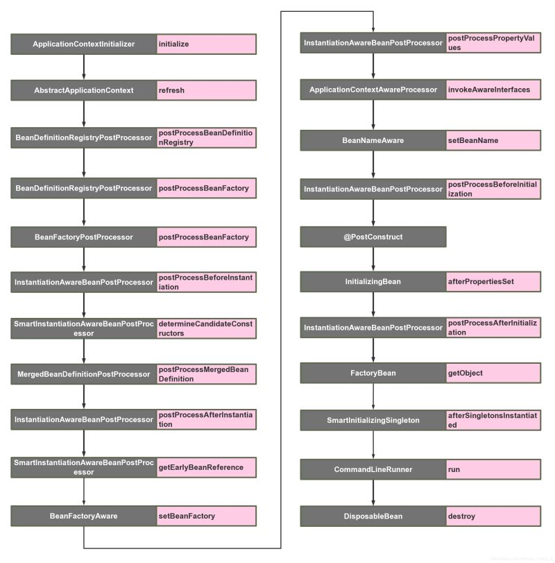
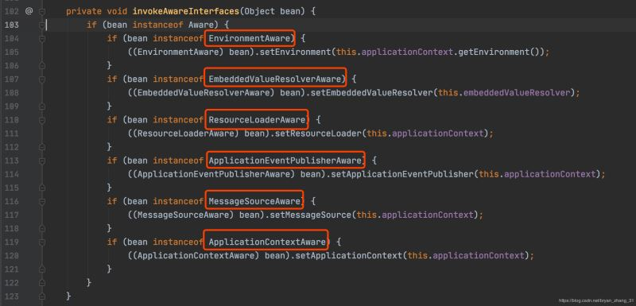
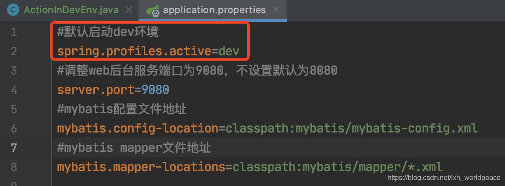
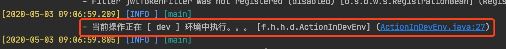
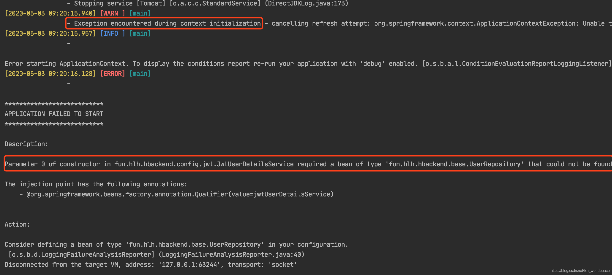
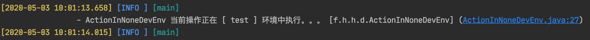

## SpringBoot常用扩展点

主要有五大：SpringApplicationRunlistener、Applicationlistener、ApplicationContextInitializer、CommandLineRunner、ApplicationRunner、

[Spring Boot 扩展分析 - 仍是少年 - 博客园 (cnblogs.com)](https://www.cnblogs.com/ashleyboy/p/9567854.html)

### 扩展ApplicationContextInitializer接口

ApplicationContextInitializer这个接口的功能主要是在Spring应用上下文（ConfigurableApplicationContext）执行refresh之前调用，官方文档中的描述是“通常被用作web应用，在一些程序设计在spring容器初始化使用。比如说注册一些熟悉配置或者激活一些配置文件针对（ConfigurableApplicationContext的getEnvironment()方法）”，扩展这个接口可以实现一些额外的处理。

扩展代码如下，只需要实现接口中的initialize()方法即可,并将该实例添加到容器中：

```java
@Order(1)
public class ApplicationContextInitializerTest implements org.springframework.context.ApplicationContextInitializer<ConfigurableApplicationContext> {
    @Override
    public void initialize(ConfigurableApplicationContext applicationContext) {

        System.out.println("这里是自定义ApplicationContextInitializer，可以用来操作applicationContext");

    }
}
```

可以通过下面任一中方式添加到Spring容器中：

- 直接在SpringBoot入口main函数中添加application.addInitializers(new ApplicationContextInitializerTest());
- 通过在application.properties中添加配置项：

```properties
context.initializer.class=com.sl.springbootdemo.extendsion.ApplicationContextInitializerTest
```

如果扩展了多个Initialize则可以通过逗号分隔（为什么可以这么配置可以查看springboot jar包提供的类：DelegatingApplicationContextInitializer）

- 之前分析SpringBoot启动过程，我们知道SpringBoot启动时会读取META-INF/spring.factories中的配置项，那么自定义的Initialize也通过在项目自定义的META-INF/spring.factories文件中注册

```properties
 org.springframework.context.ApplicationContextInitializer=\
 com.sl.springbootdemo.extendsion. ApplicationContextInitializerTest
```

### 扩展CommandLineRunner或者ApplicationRunner接口

CommandLineRunner、ApplicationRunner 接口的功能是在容器启动成功后的最后一步调用，分析过源码可以知道有个callrunners()方法，这两个接口是SpringBoot框架提供，两个接口的区别也只是参数类型不同。

关于这货，我们需要关注的点有两个：

1. 所有CommandLineRunner的执行时间点是在SpringBoot应用的Application完全初始化工作之后(这里我们可以认为是SpringBoot应用启动类main方法执行完成之前的最后一步)。
2. 当前SpringBoot应用的ApplicationContext中的所有CommandLinerRunner都会被加载执行(无论是手动注册还是被自动扫描注册到IoC容器中)。

　　跟其他几个扩展点接口类型相似，我们建议CommandLineRunner的实现类使用@org.springframework.core.annotation.Order进行标注或者实现`org.springframework.core.Ordered`接口，便于对他们的执行顺序进行排序调整，这是非常有必要的，因为我们不希望不合适的CommandLineRunner实现类阻塞了后面其他CommandLineRunner的执行。**这个接口非常有用和重要，我们需要重点关注。**

扩展CommandLineRunner：

```java
@Order(2)
@Component
public class CommandLineRunnerTest implements CommandLineRunner {
    @Override
    public void run(String... args) throws Exception {
        System.out.println("扩展CommandLineRunner，打印出来看看");
    }
}
```

扩展ApplicationRunner：

```java
@Order(3)
@Component
public class ApplicationRunnerTest implements ApplicationRunner {

    //ApplicationArguments是对参数（main方法）做了进一步封装
    @Override
    public void run(ApplicationArguments args) throws Exception {

        System.out.println("===MyApplicationRunner==="+ Arrays.asList(args.getSourceArgs()));
        System.out.println("===getOptionNames========"+args.getOptionNames());
        System.out.println("===getOptionValues======="+args.getOptionValues("name"));
        System.out.println("==getOptionValues========"+args.getOptionValues("password"));

    }
}
```

不加Order注解时ApplicationRunner先执行，CommandLineRunner后执行

### 自定义Banner

- 关闭Banner

在SpringBoot入口main函数中加入如下代码即可关闭打印Banner

```java
  springApplication.setBannerMode(Banner.Mode.OFF);
```

- 修改Banner

在SpringBoot项目resources目录下新建一个banner.txt文件，再次启动将会打印banner.txt中的内容，文本中尽管放一些天马行空的内容好了。

### 扩展ApplicationListener

事件及监听并不是SpringBoot的新功能，Spring框架早已提供了完善的事件监听机制，在Spring框架中实现事件监听的流程如下：

1. 自定义事件，继承org.springframework.context.ApplicationEvent抽象类
2. 定义事件监听器，实现org.springframework.context.ApplicationListener接口
3. 在Spring容器中发布事件

[Spring Boot 自定义事件及监听 - 仍是少年 - 博客园 (cnblogs.com)](https://www.cnblogs.com/ashleyboy/p/9566579.html)

- 定义事件

```java
//自定义事件
public class ApplicationEventTest extends ApplicationEvent {

    public ApplicationEventTest(Object source) {
        super(source);
    }

    /**
     * 事件处理事项
     * @param msg
     */
    public void printMsg(String msg)
    {
        System.out.println("监听到事件："+ApplicationEventTest.class);
    }
}
```

- 定义监听器

```java
//自定义事件监听器
//@Component
public class ApplicationListenerTest implements ApplicationListener<ApplicationEventTest> {

    @Override
    public void onApplicationEvent(ApplicationEventTest event) {

        event.printMsg(null);
    }
}
```

- 在Spring容器中发布事件

```java
public static void main(String[] args) {

   SpringApplication application = new SpringApplication(SpringbootdemoApplication.class);
   //需要把监听器加入到spring容器中
   application.addListeners(new ApplicationListenerTest());
   Set<ApplicationListener<?>> listeners = application.getListeners();
   ConfigurableApplicationContext context =  application.run(args);
   //发布事件
   context.publishEvent(new ApplicationEventTest(new Object()));

   context.close();
}
```

上面的示例是在SpringBoot应用中简单的测试一下。

实际开发中实现监听还有其他的方式，在Spring框架中提供了两种事件监听的方式：

1. 编程式：通过实现ApplicationListener接口来监听指定类型的事件
2. 注解式：通过在方法上加@EventListener注解的方式监听指定参数类型的事件，写该类需要托管到Spring容器中

 在SpringBoot应用中还可以通过配置的方式实现监听：

　　 3. 通过application.properties中配置context.listener.classes属性指定监听器

下面分别分析一下这三种监听方式

#### 编程式实现监听

实现ApplicationListenser接口：

```java
@Component
public class ApplicationListenerTest implements ApplicationListener<ApplicationEventTest> {

    @Override
    public void onApplicationEvent(ApplicationEventTest event) {

        event.printMsg(null);
    }
}
```

控制台输出测试：

```java
public static void main(String[] args) {

   SpringApplication application = new SpringApplication(SpringbootdemoApplication.class);
   //需要把监听器加入到spring容器中
   //application.addListeners(new ApplicationListenerTest());
   //Set<ApplicationListener<?>> listeners = application.getListeners();

   ConfigurableApplicationContext context =  application.run(args);
   //发布事件
   context.publishEvent(new ApplicationEventTest(new Object()));
}
```

源码分析：略

#### @EventListener注解方式实现

定义注解方法

```java
@Component
public class MyEventHandleTest {

    /**
     * 参数为Object类型时，所有事件都会监听到
     * 参数为指定类型事件时，该参数类型事件或者其子事件（子类）都可以接收到
     */
    @EventListener
    public void event(ApplicationEventTest event){

        event.printMsg(null);
    }

}
```

实现过程分析：

@EventListener注解主要通过EventListenerMethodProcessor扫描出所有带有@EventListener注解的方法，然后动态构造事件监听器，并将监听器托管到Spring应用上文中。

**在application.properties中配置context.listener.classes**

添加如下配置：

```properties
context.listener.classes=com.sl.springbootdemo.Listeners.ApplicationListenerTest
```

　Spring-boot-{version}.jar包中提供一个类DelegatingApplicationListener，该类的作用是从application.properties中读取配置context.listener.classes，并将事件广播给这些配置的监听器。通过前面一章对SpringBoot启动流程分析，我们已经了解到SpringBoot启动时会从META-INF/spring.factories中读取key为org.springframework.context.ApplicationListener的所有监听器。DelegatingApplicationListener的功能可以让我们不需要创建META-INF/spring.factories，直接在application.properties中配置即可。

### 扩展SpringApplicationRunlistener

**SpringApplicationRunListener**属于应用程序启动层面的监听器,在springboot启动时候,调用run方法进行反射加载初始化。**此时上下文还没有加载**，如果通过@Compnant是起不了作用的。

[SpringBoot各类扩展点详解 - 阿豪聊干货 - 博客园 (cnblogs.com)](https://www.cnblogs.com/hafiz/p/9155017.html)

从命名我们就可以知道它是一个监听者，那纵观整个启动流程我们会发现，它其实是用来在整个启动流程中接收不同执行点事件通知的监听者。源码如下：

```java
public interface SpringApplicationRunListener {
    void starting();
    void environmentPrepared(ConfigurableEnvironment environment);
    void contextPrepared(ConfigurableApplicationContext context);
    void contextLoaded(ConfigurableApplicationContext context);
    void finished(ConfigurableApplicationContext context, Throwable exception);
}
```

　对于开发者来说，基本没有什么常见的场景要求我们必须实现一个自定义的SpringApplicationRunListener，即使是SpringBoot中也只默认实现了一个`org.springframework.boot.context.eventEventPublishingRunListener`, 用来在SpringBoot的整个启动流程中的不同时间点发布不同类型的应用事件(SpringApplicationEvent)。那些对这些应用事件感兴趣的ApplicationListener可以接受并处理(这也解释了为什么在SpringApplication实例化的时候加载了一批ApplicationListener，但在run方法执行的过程中并没有被使用)。

如果我们真的在实际场景中自定义实现SpringApplicationRunListener,有一个点需要注意：**任何一个SpringApplicationRunListener实现类的构造方法都需要有两个构造参数，一个参数的类型就是我们的org.springframework.boot.SpringApplication,另外一个参数就是args参数列表的String[]**:

```java
package com.hafiz.springbootdemo;

import org.springframework.boot.SpringApplication;
import org.springframework.boot.SpringApplicationRunListener;
import org.springframework.context.ConfigurableApplicationContext;
import org.springframework.core.env.ConfigurableEnvironment;

/**
 * @author hafiz.zhang
 * @description:
 * @date Created in 2018/6/7 20:07.
 */
public class DemoSpringApplicationRunListener implements SpringApplicationRunListener {
    private final SpringApplication application;
    private final String[] args;
    public DemoSpringApplicationRunListener(SpringApplication sa, String[] args) {
        this.application = sa;
        this.args = args;
    }

    @Override
    public void starting() {
        System.out.println("自定义starting");
    }

    @Override
    public void environmentPrepared(ConfigurableEnvironment environment) {
        System.out.println("自定义environmentPrepared");
    }

    @Override
    public void contextPrepared(ConfigurableApplicationContext context) {
        System.out.println("自定义contextPrepared");
    }

    @Override
    public void contextLoaded(ConfigurableApplicationContext context) {
        System.out.println("自定义contextLoaded");
    }

    @Override
    public void finished(ConfigurableApplicationContext context, Throwable exception) {
        System.out.println("自定义finished");
    }
}
```

接着，我们还要满足SpringFactoriesLoader的约定，在当前SpringBoot项目的classpath下新建META-INF目录，并在该目录下新建spring.fatories文件，文件内容如下:

```
org.springframework.boot.SpringApplicationRunListener=\
    com.hafiz.springbootdemo.DemoSpringApplicationRunListener
```

#### SpringApplicationRunlistener和Applicationlistener区别

[SpringApplicationRunlistener和Applicationlistener区别_华海的bk的博客-CSDN博客](https://blog.csdn.net/qq_40204976/article/details/106411703)

**SpringApplicationRunListener**属于应用程序启动层面的监听器,在springboot启动时候,调用run方法进行反射加载初始化。**此时上下文还没有加载**，如果通过@Compnant是起不了作用的。

**Applicationlistener**通过spring上下文加载初始化的

## Bean生命周期中的扩展点

[Springboot启动扩展点超详细教程小结_java_脚本之家 (jb51.net)](https://www.jb51.net/article/190699.htm)

以下是我整理的spring容器中Bean的生命周期内所有可扩展的点的调用顺序，下面会一个个分析



### ApplicationContextInitializer

```
org.springframework.context.ApplicationContextInitializer
```

这是整个spring容器在刷新之前初始化`ConfigurableApplicationContext`的回调接口，简单来说，就是在容器刷新之前调用此类的`initialize`方法。这个点允许被用户自己扩展。用户可以在整个spring容器还没被初始化之前做一些事情。

可以想到的场景可能为，在最开始激活一些配置，或者利用这时候class还没被类加载器加载的时机，进行动态字节码注入等操作。

扩展方式为：

```java
public class TestApplicationContextInitializer implements ApplicationContextInitializer {
    @Override
    public void initialize(ConfigurableApplicationContext applicationContext) {
        System.out.println("[ApplicationContextInitializer]");
    }
}
```

因为这时候spring容器还没被初始化，所以想要自己的扩展的生效，有以下三种方式：

- 在启动类中用`springApplication.addInitializers(new TestApplicationContextInitializer())`语句加入配置文件
- 配置`context.initializer.classes=com.example.demo.TestApplicationContextInitializer` **(个人推荐)**
- Spring SPI扩展，在spring.factories中加入 `org.springframework.context.ApplicationContextInitializer=com.example.demo.TestApplicationContextInitializer`

### BeanDefinitionRegistryPostProcessor

```
org.springframework.beans.factory.support.BeanDefinitionRegistryPostProcessor
```

这个接口在读取项目中的`beanDefinition`之后执行，提供一个补充的扩展点

使用场景：你可以在这里动态注册自己的`beanDefinition`，可以加载classpath之外的bean

```java
public class TestBeanDefinitionRegistryPostProcessor implements BeanDefinitionRegistryPostProcessor {
    @Override
    public void postProcessBeanDefinitionRegistry(BeanDefinitionRegistry registry) throws BeansException {
        System.out.println("[BeanDefinitionRegistryPostProcessor] postProcessBeanDefinitionRegistry");
    }

    @Override
    public void postProcessBeanFactory(ConfigurableListableBeanFactory beanFactory) throws BeansException {
        System.out.println("[BeanDefinitionRegistryPostProcessor] postProcessBeanFactory");
    }
}
```

### BeanFactoryPostProcessor

```
org.springframework.beans.factory.config.BeanFactoryPostProcessor
```

这个接口是`beanFactory`的扩展接口，调用时机在spring在读取`beanDefinition`信息之后，实例化bean之前。

在这个时机，用户可以通过实现这个扩展接口来自行处理一些东西，比如修改已经注册的`beanDefinition`的元信息。

```java
public class TestBeanFactoryPostProcessor implements BeanFactoryPostProcessor {
    @Override
    public void postProcessBeanFactory(ConfigurableListableBeanFactory beanFactory) throws BeansException {
        System.out.println("[BeanFactoryPostProcessor]");
    }
}
```

### InstantiationAwareBeanPostProcessor

```
org.springframework.beans.factory.config.InstantiationAwareBeanPostProcessor
```

该接口继承了`BeanPostProcess`接口，区别如下：

**`BeanPostProcess`接口只在bean的初始化阶段进行扩展（注入spring上下文前后），而`InstantiationAwareBeanPostProcessor`接口在此基础上增加了3个方法，把可扩展的范围增加了实例化阶段和属性注入阶段。**

该类主要的扩展点有以下5个方法，主要在bean生命周期的两大阶段：**实例化阶段**和**初始化阶段**，下面一起进行说明，按调用顺序为：

- `postProcessBeforeInstantiation`：实例化bean之前，相当于new这个bean之前
- `postProcessAfterInstantiation`：实例化bean之后，相当于new这个bean之后
- `postProcessPropertyValues`：bean已经实例化完成，在属性注入时阶段触发，`@Autowired`,`@Resource`等注解原理基于此方法实现
- `postProcessBeforeInitialization`：初始化bean之前，相当于把bean注入spring上下文之前
- `postProcessAfterInitialization`：初始化bean之后，相当于把bean注入spring上下文之后

使用场景：这个扩展点非常有用 ，无论是写中间件和业务中，都能利用这个特性。比如对实现了某一类接口的bean在各个生命期间进行收集，或者对某个类型的bean进行统一的设值等等。

扩展方式为

```JAVA
public class TestInstantiationAwareBeanPostProcessor implements InstantiationAwareBeanPostProcessor {

    @Override
    public Object postProcessBeforeInitialization(Object bean, String beanName) throws BeansException {
        System.out.println("[TestInstantiationAwareBeanPostProcessor] before initialization " + beanName);
        return bean;
    }

    @Override
    public Object postProcessAfterInitialization(Object bean, String beanName) throws BeansException {
        System.out.println("[TestInstantiationAwareBeanPostProcessor] after initialization " + beanName);
        return bean;
    }

    @Override
    public Object postProcessBeforeInstantiation(Class<?> beanClass, String beanName) throws BeansException {
        System.out.println("[TestInstantiationAwareBeanPostProcessor] before instantiation " + beanName);
        return null;
    }

    @Override
    public boolean postProcessAfterInstantiation(Object bean, String beanName) throws BeansException {
        System.out.println("[TestInstantiationAwareBeanPostProcessor] after instantiation " + beanName);
        return true;
    }

    @Override
    public PropertyValues postProcessPropertyValues(PropertyValues pvs, PropertyDescriptor[] pds, Object bean, String beanName) throws BeansException {
        System.out.println("[TestInstantiationAwareBeanPostProcessor] postProcessPropertyValues " + beanName);
        return pvs;
    }
```

### SmartInstantiationAwareBeanPostProcessor

```
org.springframework.beans.factory.config.SmartInstantiationAwareBeanPostProcessor
```

该扩展接口有3个触发点方法：

- `predictBeanType`：该触发点发生在`postProcessBeforeInstantiation`之前(在图上并没有标明，因为一般不太需要扩展这个点)，这个方法用于预测Bean的类型，返回第一个预测成功的Class类型，如果不能预测返回null；当你调用`BeanFactory.getType(name)`时当通过bean的名字无法得到bean类型信息时就调用该回调方法来决定类型信息。
- `determineCandidateConstructors`：该触发点发生在`postProcessBeforeInstantiation`之后，用于确定该bean的构造函数之用，返回的是该bean的所有构造函数列表。用户可以扩展这个点，来自定义选择相应的构造器来实例化这个bean。
- `getEarlyBeanReference`：该触发点发生在`postProcessAfterInstantiation`之后，当有循环依赖的场景，当bean实例化好之后，为了防止有循环依赖，会提前暴露回调方法，用于bean实例化的后置处理。这个方法就是在提前暴露的回调方法中触发。

扩展方式为：

```JAVA
public class TestSmartInstantiationAwareBeanPostProcessor implements SmartInstantiationAwareBeanPostProcessor {

    @Override
    public Class<?> predictBeanType(Class<?> beanClass, String beanName) throws BeansException {
        System.out.println("[TestSmartInstantiationAwareBeanPostProcessor] predictBeanType " + beanName);
        return beanClass;
    }

    @Override
    public Constructor<?>[] determineCandidateConstructors(Class<?> beanClass, String beanName) throws BeansException {
        System.out.println("[TestSmartInstantiationAwareBeanPostProcessor] determineCandidateConstructors " + beanName);
        return null;
    }

    @Override
    public Object getEarlyBeanReference(Object bean, String beanName) throws BeansException {
        System.out.println("[TestSmartInstantiationAwareBeanPostProcessor] getEarlyBeanReference " + beanName);
        return bean;
    }
}
```

### BeanFactoryAware

```
org.springframework.beans.factory.BeanFactoryAware
```

这个类只有一个触发点，发生在bean的实例化之后，注入属性之前，也就是Setter之前。这个类的扩展点方法为`setBeanFactory`，可以拿到`BeanFactory`这个属性。

使用场景为，你可以在bean实例化之后，但还未初始化之前，拿到 `BeanFactory`，在这个时候，可以对每个bean作特殊化的定制。也或者可以把`BeanFactory`拿到进行缓存，日后使用。

扩展方式为：

```JAVA
public class TestBeanFactoryAware implements BeanFactoryAware {
    @Override
    public void setBeanFactory(BeanFactory beanFactory) throws BeansException {
        System.out.println("[TestBeanFactoryAware] " + beanFactory.getBean(TestBeanFactoryAware.class).getClass().getSimpleName());
    }
}
```

### ApplicationContextAwareProcessor

```
org.springframework.context.support.ApplicationContextAwareProcessor
```

该类本身并没有扩展点，但是该类内部却有6个扩展点可供实现 ，这些类触发的时机在bean实例化之后，初始化之前



可以看到，该类用于执行各种驱动接口，在bean实例化之后，属性填充之后，通过执行以上红框标出的扩展接口，来获取对应容器的变量。**所以这里应该来说是有6个扩展点**，这里就放一起来说了

- `EnvironmentAware`：用于获取`EnviromentAware`的一个扩展类，这个变量非常有用， 可以获得系统内的所有参数。当然个人认为这个Aware没必要去扩展，因为spring内部都可以通过注入的方式来直接获得。
- `EmbeddedValueResolverAware`：用于获取`StringValueResolver`的一个扩展类， `StringValueResolver`用于获取基于`String`类型的properties的变量，一般我们都用`@Value`的方式去获取，如果实现了这个Aware接口，把`StringValueResolver`缓存起来，通过这个类去获取`String`类型的变量，效果是一样的。
- `ResourceLoaderAware`：用于获取`ResourceLoader`的一个扩展类，`ResourceLoader`可以用于获取classpath内所有的资源对象，可以扩展此类来拿到`ResourceLoader`对象。`ApplicationEventPublisherAware`：用于获取`ApplicationEventPublisher`的一个扩展类，`ApplicationEventPublisher`可以用来发布事件，结合`ApplicationListener`来共同使用，下文在介绍`ApplicationListener`时会详细提到。这个对象也可以通过spring注入的方式来获得。
- `MessageSourceAware`：用于获取`MessageSource`的一个扩展类，`MessageSource`主要用来做国际化。
- `ApplicationContextAware`：用来获取`ApplicationContext`的一个扩展类，`ApplicationContext`应该是很多人非常熟悉的一个类了，就是spring上下文管理器，可以手动的获取任何在spring上下文注册的bean，我们经常扩展这个接口来缓存spring上下文，包装成静态方法。

同时`ApplicationContext`也实现了`BeanFactory`，`MessageSource`，`ApplicationEventPublisher`等接口，也可以用来做相关接口的事情。

### BeanNameAware

```
org.springframework.beans.factory.BeanNameAware
```

可以看到，这个类也是Aware扩展的一种，触发点在bean的初始化之前，也就是`postProcessBeforeInitialization`之前，这个类的触发点方法只有一个：`setBeanName`

使用场景为：用户可以扩展这个点，在初始化bean之前拿到spring容器中注册的的beanName，来自行修改这个beanName的值。

扩展方式为：

```java
public class NormalBeanA implements BeanNameAware{
    public NormalBeanA() {
        System.out.println("NormalBean constructor");
    }

    @Override
    public void setBeanName(String name) {
        System.out.println("[BeanNameAware] " + name);
    }
}
```

### @PostConstruct

```
javax.annotation.PostConstruct
```

这个并不算一个扩展点，其实就是一个标注。其作用是在bean的初始化阶段，如果对一个方法标注了`@PostConstruct`，会先调用这个方法。这里重点是要关注下这个标准的触发点，这个触发点是在`postProcessBeforeInitialization`之后，`InitializingBean.afterPropertiesSet`之前。

使用场景：用户可以对某一方法进行标注，来进行初始化某一个属性

扩展方式为：

```java
public class NormalBeanA {
    public NormalBeanA() {
        System.out.println("NormalBean constructor");
    }

    @PostConstruct
    public void init(){
        System.out.println("[PostConstruct] NormalBeanA");
    }
}
```

### InitializingBean

```
org.springframework.beans.factory.InitializingBean
```

这个类，顾名思义，也是用来初始化bean的。`InitializingBean`接口为bean提供了初始化方法的方式，它只包括`afterPropertiesSet`方法，凡是继承该接口的类，在初始化bean的时候都会执行该方法。这个扩展点的触发时机在`postProcessAfterInitialization`之前。

使用场景：用户实现此接口，来进行系统启动的时候一些业务指标的初始化工作。

扩展方式为：

```java
public class NormalBeanA implements InitializingBean{
    @Override
    public void afterPropertiesSet() throws Exception {
        System.out.println("[InitializingBean] NormalBeanA");
    }
}
```

### FactoryBean

```
org.springframework.beans.factory.FactoryBean
```

一般情况下，Spring通过反射机制利用bean的class属性指定支线类去实例化bean，在某些情况下，实例化Bean过程比较复杂，如果按照传统的方式，则需要在bean中提供大量的配置信息。配置方式的灵活性是受限的，这时采用编码的方式可能会得到一个简单的方案。Spring为此提供了一个`org.springframework.bean.factory.FactoryBean`的工厂类接口，用户可以通过实现该接口定制实例化Bean的逻辑。`FactoryBean`接口对于Spring框架来说占用重要的地位，Spring自身就提供了70多个`FactoryBean`的实现。它们隐藏了实例化一些复杂bean的细节，给上层应用带来了便利。从Spring3.0开始，`FactoryBean`开始支持泛型，即接口声明改为`FactoryBean<T>`的形式

使用场景：用户可以扩展这个类，来为要实例化的bean作一个代理，比如为该对象的所有的方法作一个拦截，在调用前后输出一行log，模仿`ProxyFactoryBean`的功能。

扩展方式为：

```java
public class TestFactoryBean implements FactoryBean<TestFactoryBean.TestFactoryInnerBean> {

    @Override
    public TestFactoryBean.TestFactoryInnerBean getObject() throws Exception {
        System.out.println("[FactoryBean] getObject");
        return new TestFactoryBean.TestFactoryInnerBean();
    }

    @Override
    public Class<?> getObjectType() {
        return TestFactoryBean.TestFactoryInnerBean.class;
    }

    @Override
    public boolean isSingleton() {
        return true;
    }

    public static class TestFactoryInnerBean{

    }
}
```

### SmartInitializingSingleton

```
org.springframework.beans.factory.SmartInitializingSingleton
```

这个接口中只有一个方法`afterSingletonsInstantiated`，其作用是是 在spring容器管理的所有单例对象（非懒加载对象）初始化完成之后调用的回调接口。其触发时机为`postProcessAfterInitialization`之后。

使用场景：用户可以扩展此接口在对所有单例对象初始化完毕后，做一些后置的业务处理。

扩展方式为：

```java
public class TestSmartInitializingSingleton implements SmartInitializingSingleton {
    @Override
    public void afterSingletonsInstantiated() {
        System.out.println("[TestSmartInitializingSingleton]");
    }
}
```

### CommandLineRunner

```
org.springframework.boot.CommandLineRunner
```

这个接口也只有一个方法：`run(String... args)`，触发时机为整个项目启动完毕后，自动执行。如果有多个`CommandLineRunner`，可以利用`@Order`来进行排序。

使用场景：用户扩展此接口，进行启动项目之后一些业务的预处理。

```java
public class TestCommandLineRunner implements CommandLineRunner {
    @Override
    public void run(String... args) throws Exception {
        System.out.println("[TestCommandLineRunner]");
    }
}
```

### DisposableBean

```java
org.springframework.beans.factory.DisposableBean
```

这个扩展点也只有一个方法：`destroy()`，其触发时机为当此对象销毁时，会自动执行这个方法。比如说运行`applicationContext.registerShutdownHook`时，就会触发这个方法。

扩展方式为：

```java
public class NormalBeanA implements DisposableBean {
    @Override
    public void destroy() throws Exception {
        System.out.println("[DisposableBean] NormalBeanA");
    }
}
```

### ApplicationListener

```
org.springframework.context.ApplicationListener
```

准确的说，这个应该不算spring&springboot当中的一个扩展点，`ApplicationListener`可以监听某个事件的`event`，触发时机可以穿插在业务方法执行过程中，用户可以自定义某个业务事件。但是spring内部也有一些内置事件，这种事件，可以穿插在启动调用中。我们也可以利用这个特性，来自己做一些内置事件的监听器来达到和前面一些触发点大致相同的事情。

接下来罗列下spring主要的内置事件：

**ContextRefreshedEvent**

ApplicationContext 被初始化或刷新时，该事件被发布。这也可以在`ConfigurableApplicationContext`接口中使用 `refresh()`方法来发生。此处的初始化是指：所有的Bean被成功装载，后处理Bean被检测并激活，所有Singleton Bean 被预实例化，`ApplicationContext`容器已就绪可用。

**ContextStartedEvent**

当使用 `ConfigurableApplicationContext` （ApplicationContext子接口）接口中的 start() 方法启动 `ApplicationContext`时，该事件被发布。你可以调查你的数据库，或者你可以在接受到这个事件后重启任何停止的应用程序。

**ContextStoppedEvent**

当使用 `ConfigurableApplicationContext`接口中的 `stop()`停止`ApplicationContext` 时，发布这个事件。你可以在接受到这个事件后做必要的清理的工作

**ContextClosedEvent**

当使用 `ConfigurableApplicationContext`接口中的 `close()`方法关闭 `ApplicationContext` 时，该事件被发布。一个已关闭的上下文到达生命周期末端；它不能被刷新或重启

**RequestHandledEvent**

这是一个 web-specific 事件，告诉所有 bean HTTP 请求已经被服务。只能应用于使用DispatcherServlet的Web应用。在使用Spring作为前端的MVC控制器时，当Spring处理用户请求结束后，系统会自动触发该事件

## @Component 是如何生效的

[SpringBoot中@Component是如何生效的 - 简书 (jianshu.com)](https://www.jianshu.com/p/723758807fd1)


## 如何正确控制springboot中bean的加载顺序

[如何正确控制springboot中bean的加载顺序小结篇_java_脚本之家 (jb51.net)](https://www.jb51.net/article/190698.htm)


## SpringBoot SPI机制

[手把手教你写Spring Boot插件01-SPI规范-云海天教程 (yht7.com)](https://www.yht7.com/news/95197)

[springboot源码分析——SPI扩展机制 - warrior1234 - 博客园 (cnblogs.com)](https://www.cnblogs.com/warrior4236/p/13280755.html)


## Springboot 优雅停止服务的几种方法

[Springboot 优雅停止服务的几种方法 - 黄青石 - 博客园 (cnblogs.com)](https://www.cnblogs.com/huangqingshi/p/11370291.html)

在使用Springboot的时候，都要涉及到服务的停止和启动，当我们停止服务的时候，很多时候大家都是kill -9 直接把程序进程杀掉，这样程序不会执行优雅的关闭。而且一些没有执行完的程序就会直接退出。

　　我们很多时候都需要安全的将服务停止，也就是把没有处理完的工作继续处理完成。比如停止一些依赖的服务，输出一些日志，发一些信号给其他的应用系统，这个在保证系统的高可用是非常有必要的。那么咱么就来看一下几种停止springboot的方法。

### actuator

　　第一种就是Springboot提供的actuator的功能，它可以执行shutdown, health, info等，默认情况下，actuator的shutdown是disable的，我们需要打开它。首先引入acturator的maven依赖。

```xml
<dependency>
    <groupId>org.springframework.boot</groupId>
    <artifactId>spring-boot-starter-actuator</artifactId>
</dependency>
```

然后将shutdown节点打开，也将/actuator/shutdown暴露web访问也设置上，除了shutdown之外还有health, info的web访问都打开的话将**management.endpoints.web.exposure.include=***就可以(最好不要设置为\*，不安全！)。将如下配置设置到application.properties里边。设置一下服务的端口号为3333。

```properties
server.port=3333
management.endpoint.shutdown.enabled=true
management.endpoints.web.exposure.include=shutdown
```

接下来，咱们创建一个springboot工程，然后设置一个bean对象，配置上PreDestroy方法。这样在停止的时候会打印语句。bean的整个生命周期分为创建、初始化、销毁，当最后关闭的时候会执行销毁操作。在销毁的方法中执行一条输出日志。

```java
import javax.annotation.PreDestroy;
@configuration
public class TerminateBean {
    @PreDestroy
    public void preDestroy() {
        System.out.println("TerminalBean is destroyed");
    }
}
```

　在启动类里边输出一个启动日志，当工程启动的时候，会看到启动的输出，接下来咱们执行停止命令。

```shell
curl -X POST http://localhost:3333/actuator/shutdown
```

日志可以输出启动时的日志打印和停止时的日志打印，同时程序已经停止。是不是比较神奇。

### SpringApplication.close()

　第二种方法也比较简单，获取程序启动时候的context，然后关闭主程序启动时的context。这样程序在关闭的时候也会调用PreDestroy注解。如下方法在程序启动十秒后进行关闭。

```java
ConfigurableApplicationContext ctx = SpringApplication.run(ShutdowndemoApplication.class, args);

try {
    TimeUnit.SECONDS.sleep(10);

} catch (InterruptedException e) {
    e.printStackTrace();
}

ctx.close();
```

不推荐上面这种写法，可以这样：

```java
/**
 * CommandLineRunner
 * ApplicationRunner
 * 这两个方法都是在Spring启动完成后，最后执行
 */
@Slf4j
@Component
public class CommandLineRunnerImpl implements CommandLineRunner, ApplicationContextAware {

    @Override
    public void run(String... args) throws Exception {
        log.info("CommandLineRunner...");
        //...执行需要的代码
        //调用Springboot的关闭方法
        ((ConfigurableApplicationContext)context).close();
    }

    @Autowired
    private ApplicationContext context;
    @Override
    public void setApplicationContext(ApplicationContext ctx) throws BeansException {
        this.context = ctx;
    }
}

```

### kill pid

第三种方法，在springboot启动的时候将进程号写入一个app.pid文件，生成的路径是可以指定的，可以通过命令 cat /Users/huangqingshi/app.id | xargs kill 命令直接停止服务，这个时候bean对象的PreDestroy方法也会调用的。这种方法大家使用的比较普遍。写一个start.sh用于启动springboot程序，然后写一个停止程序将服务停止。

```java
SpringApplication application = new SpringApplication(ShutdowndemoApplication.class);
application.addListeners(new ApplicationPidFileWriter("/Users/123/app.pid"));
application.run();
```


注意：在windows下,kill pid后，SpringBoot是被强行推出的，不会调用PreDestroy方法，也不会正常退出数据库连接池连接

```cmd
taskkill /F /pid 7476
```

### SpringApplication.exit(）

第四种方法，通过调用一个SpringApplication.exit(）方法也可以退出程序，同时将生成一个退出码，这个退出码可以传递给所有的context。这个就是一个JVM的钩子，通过调用这个方法的话会把所有PreDestroy的方法执行并停止，并且传递给具体的退出码给所有Context。通过调用System.exit(exitCode)可以将这个错误码也传给JVM。程序执行完后最后会输出：Process finished with exit code 0，给JVM一个SIGNAL。

exit()方法调用了上面提到的close()方法

```java
ConfigurableApplicationContext ctx = SpringApplication.run(ShutdowndemoApplication.class, args);
exitApplication(ctx);
```


```java
public static void exitApplication(ConfigurableApplicationContext context) {
    int exitCode = SpringApplication.exit(context, (ExitCodeGenerator) () -> 0);

    System.exit(exitCode);
}
```

### controller调用context的退出

第五种方法，自己写一个Controller，然后将自己写好的Controller获取到程序的context，然后调用自己配置的Controller方法退出程序。通过调用自己写的/shutDownContext方法关闭程序：curl -X POST http://localhost:3333/shutDownContext。

感觉也不安全，前端就能关闭SpringBoot，需要加些配置，比如配置指定的IP才能调用这个Controller

```java
@RestController
public class ShutDownController implements ApplicationContextAware {

    private ApplicationContext context;

    @PostMapping("/shutDownContext")
    public String shutDownContext() {
        ConfigurableApplicationContext ctx = (ConfigurableApplicationContext) context;
        ctx.close();
        return "context is shutdown";
    }

    @GetMapping("/")
    public String getIndex() {
        return "OK";
    }

    @Override
    public void setApplicationContext(ApplicationContext applicationContext) throws BeansException {
        context = applicationContext;
    }
}
```

## SpringBoot优雅的按需加载Bean

[Spring Boot：让你的应用优雅的按需加载Bean_Crane的博客-CSDN博客_springboot按需加载](https://blog.csdn.net/lxh_worldpeace/article/details/105886064)

在日常开发过程中，我们的应用一般有3个最基本的环境：开发环境、测试环境和线上环境，不同的环境会有不同的配置，假设3个环境在SpringBoot应用中分别对应3个配置application-dev.properties、application-test.properties和application-prod.properties。你可能遇到过类似下面的场景：

1. 有个操作，只能在开发环境执行
2. 又有个操作，不能在开发环境执行，只能在其他非开发环境执行
3. 又又有个操作，需要在开发或测试环境执行，线上环境不能做
4. 叒有个操作，不论是什么环境，在同时满足A和B两个配置条件的时候才能执行
5. ... ...

我们可能最先想到通过类似硬编码判断的方式：在包含对应操作的Bean中通过@Value注入配置，再通过判断该值是否满足条件确定逻辑是否应该执行。 这样也可以实现，但是至少有两个硬伤：

1. 不易维护
假如有多个类似的操作，当执行条件发生变化的时候，要对应修改多个地方，容易遗漏；尤其是当条件变得稍微复杂的时候，要将每个对应的地方改成一致的条件判断也容易产生错误。
2. 不优雅
对于一个开发者来说，产出的代码不优雅，这不能忍，其它就什么都不用说了。

下面记录一下基于@Conditional的 优雅 的实现方式，并实现一些简单案例。案例使用 之前文章 的源码，并在此基础上进行改造。

### 初级用法

根据配置文件确定是否初始化Bean，解决上面第一个问题：**`1.有个操作，只能在开发环境执行`**。这里我们通过`@ConditionalOnProperty`注解实现，创建自定义组件类`ActionInDevEnv`并添加`@ConditionalOnProperty`注解，完整代码如下：

```java
/**
 * 自定义Bean组件，只在配置 spring.profiles.active 值为 dev 的情况下加载此组件，
 * 如果没有配置spring.profiles.active默认也看做是满足要求
 */
@ConditionalOnProperty(value = "spring.profiles.active", havingValue = "dev", matchIfMissing = true)
@Component
public class ActionInDevEnv {
    private Logger logger = LoggerFactory.getLogger(this.getClass());
    @Value("${spring.profiles.active:none}")
    private String env;

    /**
     * 组件Bean创建完成后执行的操作
     */
    @PostConstruct
    private void run() {
        this.logger.info("当前操作正在 [ {} ] 环境中执行。。。", this.env);
    }
}

```

在`application.properties`配置文件中，我们指定了启动配置使用`application-dev.properties`配置文件，如下图：



启动SpringBoot应用程序，可看到组件初始化完成后执行`run`方法，打印日志如下：



假如在application.properties配置文件中指定的不是application-dev.properties配置文件（不满足ConditionalOnProperty指定的条件），则无法看到上面的日志信息，因为在应用启动过程中并没有创建这个Bean。

我们可以验证一下没有创建这个Bean，这次我们将注解加到之前创建的UserRepository接口上，并设定在prod环境下生效，在 前面的文章 中我们创建了ApplicationRunnerInit类，该类会在应用启动后查询用户数量，这时会使用到UserRepository接口，调整接口如下：

注：@ConditionalOnProperty包含元注解@Target({ ElementType.TYPE, ElementType.METHOD })，表示可以作用在任何类和方法上，在应用初始化上下文的时候使用了@ConditionalOnProperty注解的类或方法都会根据设定检查组件类或者Bean方法是否满足创建Bean的条件

```java
@ConditionalOnProperty(value = "spring.profiles.active", havingValue = "prod", matchIfMissing = true) //添加了这一行
@Repository
public interface UserRepository extends PagingAndSortingRepository<User, Integer>, JpaRepository<User, Integer> {
    Optional<User> findByUsername(String userName);

    int countAllByUsername(String userName);

    @Query("select u from User u where u.realName = ?#{principal.realName}")
    List<User> findCurrentUserBySpel();

    @Query(value = "select * from h_user u where u.real_name = ?#{principal.realName}", nativeQuery = true)
    List<User> findCurrentUserByNativeQuery();
}

```

此时SpringBoot应用将会启动失败，报错如下，在初始化上下文的时候出现异常，原因是找不到UserRepositoryBean，因为不满足ConditionalOnProperty设定的条件所以没有创建这个Bean到应用上下文中。假如将注解的havingValue调整为dev，再重新启动则启动成功。



### 组合Conditional

介绍`与`、`或`、`非`逻辑的Conditional。

解决上面提到的第二个问题 2. 又有个操作，不能在开发环境执行，只能在其他非开发环境执行。这里通过@ConditionalOnExpression注解实现，该注解接收一个SpEL表达式参数，满足表达式设定条件即满足要求，关于SpEL表达式的更多说明可参考 [官方文档](https://docs.spring.io/spring-framework/docs/5.2.5.RELEASE/spring-framework-reference/core.html#expressions)。

为了达到模拟效果，我们执行以下步骤：

**创建测试环境的应用配置**

创建一个测试环境的应用配置application-test.properties，内容和application-dev.properties完全相同，然后在application.properties中指定启动环境为test：spring.profiles.active=test。

**创建ActionInNoneDevEnv类**

和第1步类似，创建自定义组件类`ActionInNoneDevEnv`并添加`@ConditionalOnExpression`注解，完整代码如下：

```java
/**
 * 自定义只在配置 spring.profiles.active 值不为 dev 的情况下加载此组件，
 * 如果没有配置spring.profiles.active默认也看做是dev
 */
@ConditionalOnExpression("'${spring.profiles.active:dev}' != 'dev'")
@Component
public class ActionInNoneDevEnv {
    private Logger logger = LoggerFactory.getLogger(this.getClass());
    @Value("${spring.profiles.active:none}")
    private String env;

    /**
     * 组件Bean创建完成后执行的操作
     */
    @PostConstruct
    private void run() {
        this.logger.info("ActionInNoneDevEnv 当前操作正在 [ {} ] 环境中执行。。。", this.env);
    }
}

```

启动应用，可通过日志查看`ActionInNoneDevEnv`的`run`方法正常运行，如下图。如果在`application.properties`中指定启动环境为dev则该组件不会被加载到上下文中。



