[TOC]


# 第1章 微服务架构入门

# 第2章 SpringCloud版本

SpringCloud版本与Spring Boot版本对应表

SpringCloud采用英国伦敦地铁站的名称来命名，并由地铁站名称字母A-Z一次类推的形式来发布迭代版本。
spring Cloud是个由许多子项目组成的综合项目,各子项目有不同的发布节奏。为了管理 Spring Cloud与各子项目的版本依赖关系,发布了一个清单,其中包括了某个 Spring Cloud版本对应的子项目版本。为了避兔 Spring Cloud版本号与子项目版本号混清, Springcloudk版本采用了名称而非版本号的命名,这些版本的名字采用了伦敦地铁站的名字,根据字母表的顺序来对应版本时间顺序。例妙如 Angela是第一个版本, Brixton!是第二个版本。Spring Cloude的发布内容积累到临界点或者个重大BUG被解决后,会发布一个" service releases"版本,简称SRX版本,比如 Greenwich.SR2就是pring Cloud发布的 Greenwich版本的第2个SRX版本

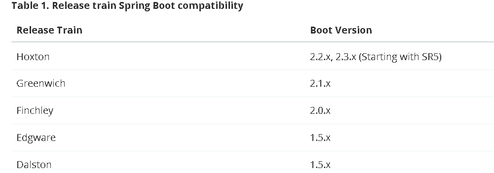

最新的Spring Cloud **Hoxton.SR8**版对应 Spring Boot**2.3.3.RELEASE**

# 第3章 Cloud各种组件的停更/升级/替换

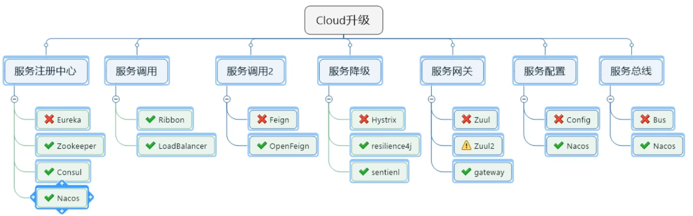

# 第4章 为服务架构编码构建

约定>配置>编码

## IDEA新建project工作空间

**父工程步骤**

1. New Project

2. 总工程名字，如cloud2020

3. Maven选版本

4. 工程名字

5. 字符编码

6. 注解生效激活

7. Java版本选8

8. File Type过滤（可选）

   ```
   *.hprof;*.idea;*.iml;*.pyc;*.pyo;*.rbc;*.yarb;*~;.DS_Store;.git;.hg;.svn;CVS;__pycache__;_svn;vssver.scc;vssver2.scc;
   ```

**父工程POM（见依赖汇总文件）**

**Maven中的dependencyManagement和dependencies**

通常会在一个组织或者项目的最顶层的父POM中看到dependencyManagement元素
使用pom.xml中的 dependencymanagement元素能让所有在子项目中引用个依赖而不用显式的列出版本号。Maven会沿着父子层次向上走,直到找到个拥有 dependency Management元素的项目,然后它就会使用这个dependencymanagement元素中指定的版本号。

子项目还需要显式定义依赖dependencyManagement中的依赖

**设置maven中跳过单元测试**

**父工程创建完成执行mvn:install将父工程发布到仓库方便子工程继承**

## Rest微服务工程构建

### cloud-provider-payment8001微服务提供者支付Module模块

#### 1.建module

cloud-provider-payment8001

#### 2.改POM

(见POM汇总文件)

#### 3.写YML	

**application.yml**

```yaml
server:
  port: 8001
spring:
  application:
    name: cloud-payment-service
  datasource:
    type: com.alibaba.druid.pool.DruidDataSource #当前数据操作类型
    driver-class-name: com.mysql.cj.jdbc.Driver  #当前mysql驱动包
    url: jdbc:mysql://localhost:3306/db2019?useUnicode=true&characterEncoding=utf-8&useSSL=false&serverTimezone=Asia/Shanghai
    username: root
    password: root

mybatis:
  mapperLocations: classpath:mapper/*.xml
  type-aliases-package: com.hang.springcloud.entities    # 所有Entity别名类所在包
```


#### 4.主启动 

com.hang.springcloud.PaymentMain8001

```java
package com.hang.springcloud;

import org.springframework.boot.SpringApplication;
import org.springframework.boot.autoconfigure.SpringBootApplication;

@SpringBootApplication
public class PaymentMain8001 {
    public static void main(String[] args) {
        SpringApplication.run(PaymentMain8001.class,args);
    }
}
```

#### 5.业务类

**数据库**

```mysql
CREATE DATABASE `db2019`;
CREATE TABLE `db2019`.`payment`( `id` BIGINT(20) NOT NULL AUTO_INCREMENT COMMENT 'ID', `serial` VARCHAR(200), PRIMARY KEY (`id`) ) ENGINE=INNODB;
```

**dao**

```java
package com.hang.springcloud.dao;

import com.hang.springcloud.entities.Payment;
import org.apache.ibatis.annotations.Mapper;
import org.apache.ibatis.annotations.Param;

@Mapper
public interface PaymentDao {
    public int create(Payment payment);
    public Payment getPaymentById(@Param("id") Long id);
}
```

**service**

```java
package com.hang.springcloud.service;

import com.hang.springcloud.entities.Payment;
import org.apache.ibatis.annotations.Param;

public interface PaymentService {
    public int create(Payment payment);
    public Payment getPaymentById(@Param("id") Long id);
}
```


```java
package com.hang.springcloud.service.impl;

import com.hang.springcloud.dao.PaymentDao;
import com.hang.springcloud.entities.Payment;
import com.hang.springcloud.service.PaymentService;
import org.apache.ibatis.annotations.Param;
import org.springframework.stereotype.Service;

import javax.annotation.Resource;

@Service
public class PaymentServiceImpl implements PaymentService {
    @Resource
    private PaymentDao paymentDao;

    @Override
    public int create(Payment payment) {
        return paymentDao.create(payment);
    }

    @Override
    public Payment getPaymentById(Long id) {
        return paymentDao.getPaymentById(id);
    }
}
```

**controller**

```java
package com.hang.springcloud.controller;

import com.hang.springcloud.entities.CommonResult;
import com.hang.springcloud.entities.Payment;
import com.hang.springcloud.service.PaymentService;
import lombok.extern.slf4j.Slf4j;
import org.springframework.web.bind.annotation.GetMapping;
import org.springframework.web.bind.annotation.PathVariable;
import org.springframework.web.bind.annotation.PostMapping;
import org.springframework.web.bind.annotation.RestController;

import javax.annotation.Resource;

@RestController
@Slf4j
public class PaymentController {
    @Resource
    private PaymentService paymentService;

    @PostMapping(value="/payment/create")
    public CommonResult<Integer> create(@RequestBody Payment payment){
        int result = paymentService.create(payment);
        log.info("***插入结果"+result);
        if (result>0){
            return new CommonResult<>(200,"插入数据库成功",result);
        }else {
            return new CommonResult<>(444,"插入数据库失败",null);
        }
    }

    @GetMapping(value="/payment/get/{id}")
    public CommonResult<Payment> getPaymentById(@PathVariable("id") Long id){
        Payment payment = paymentService.getPaymentById(id);
        log.info("***插入结果"+payment);
        if (payment!=null){
            return new CommonResult<>(200,"查询成功",payment);
        }else {
            return new CommonResult<>(444,"没有对应记录，查询id:"+id,null);
        }
    }
}
```


**mapp配置文件**

`/resources/mapper/PaymentMapper.xml`

**文件头**

```xml
<?xml version="1.0" encoding="UTF-8"?>
<!DOCTYPE mapper PUBLIC "-//mybatis.org//DTD Mapper 3.0//EN" "http://mybatis.org/dtd/mybatis-3-mapper.dtd">
<mapper namespace="com.atguigu.springcloud.dao.PaymentDao">
    
</mapper>
```

内容

```xml
<?xml version="1.0" encoding="UTF-8"?>
<!DOCTYPE mapper PUBLIC "-//mybatis.org//DTD Mapper 3.0//EN" "http://mybatis.org/dtd/mybatis-3-mapper.dtd">
<mapper namespace="com.hang.springcloud.dao.PaymentDao">
    <insert id="create" parameterType="Payment" useGeneratedKeys="true" keyProperty="id">
        insert into payment(serial) values(#{serial})
    </insert>
    <resultMap id="BaseResultMap" type="com.hang.springcloud.entities.Payment">
        <id column="id" property="id" jdbcType="BIGINT"/>
        <id column="serial" property="serial" jdbcType="VARCHAR"/>
    </resultMap>
    <select id="getPaymentById" parameterType="Long" resultMap="BaseResultMap">
        select * from payment where id=#{id}
    </select>
</mapper>
```

**测试**

Postman提交请求

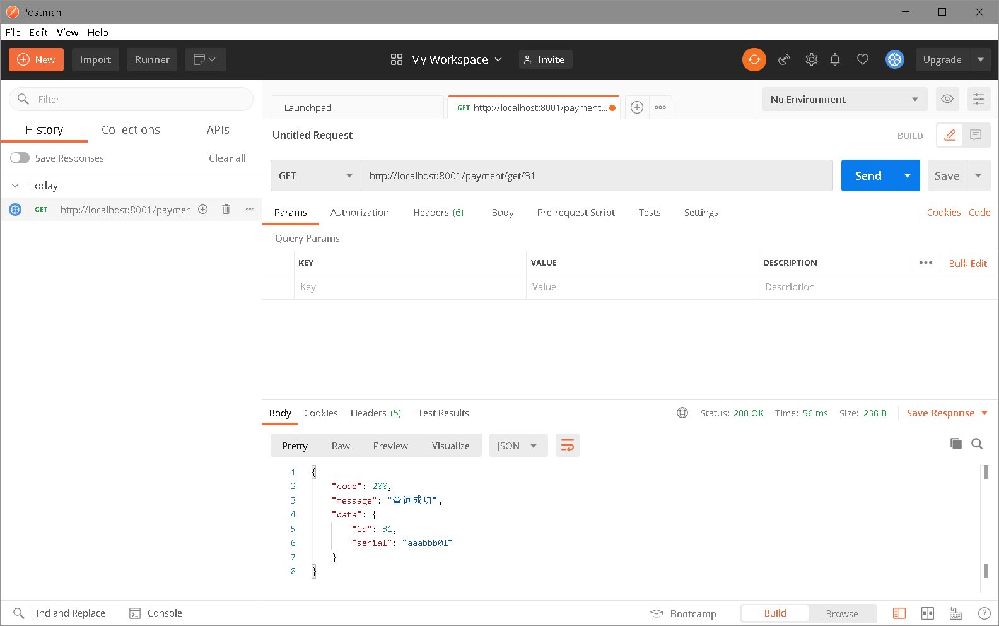

POST请求（因为chrome地址栏回车后是GET请求，所以会报错）

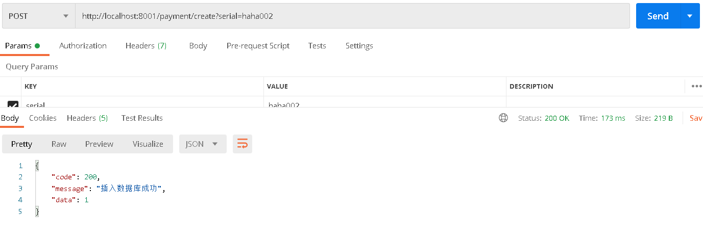

**小结：**

1.建module	2.改POM	3.写YML	4.主启动	5.业务类

### 热部署devtools

网友：不建议热部署，会耗费电脑性能且会让自己产生依赖

添加devtools依赖

```xml
<dependency>
    <groupId>org.springframework.boot</groupId>
    <artifactId>spring-boot-devtools</artifactId>
    <scope>runtime</scope>
    <optional>true</optional>
</dependency>
```

到父工程pom启用插件

```xml
<build>
    <plugins>
        <plugin>
            <groupId>org.springframework.boot</groupId>
            <artifactId>spring-boot-maven-plugin</artifactId>
            <configuration>
                <fork>true</fork>
                <addResources>true</addResources>
            </configuration>
        </plugin>
    </plugins>
</build>
```

开启自动编译

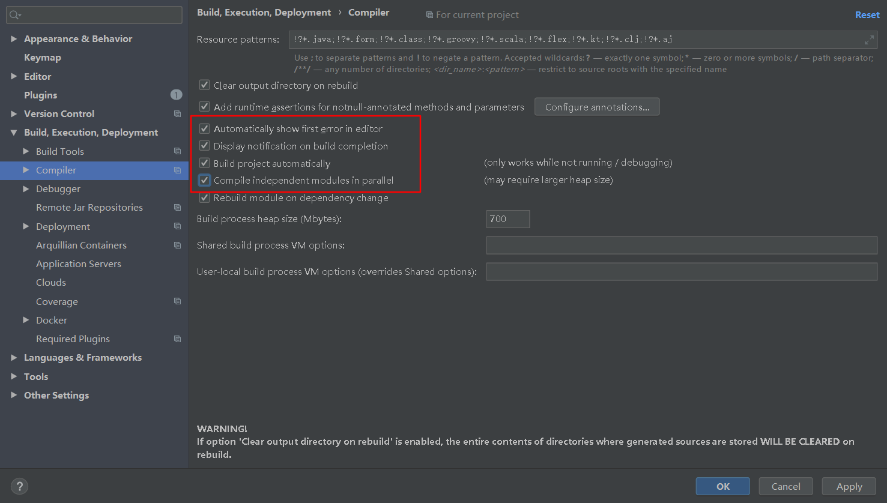

快捷键

`ctrl+shift+alt+/`

勾上：

compiler.automake.allow.when.app.running

actionSystem.assertFocusAccessFromEdt

重启IDEA


**实体类的vo和dto**

https://www.cnblogs.com/vegetableDD/p/11732495.html

**RestTamplate**

### cloud-consumer-order80微服务消费者订单Module模块

#### 建module	

cloud-consumer-order80

#### 改POM

见依赖汇总文件

#### 写YML

```yaml
server:
  port: 80
```

#### 主启动

```java
package com.atguigu.springcloud;

import org.springframework.boot.SpringApplication;
import org.springframework.boot.autoconfigure.SpringBootApplication;

@SpringBootApplication
public class PaymentMain8001 {
    public static void main(String[] args) {
        SpringApplication.run(PaymentMain8001.class,args);
    }
}
```

#### 业务类

创建entities(将cloud-provider-payment8001工程下的entities包下的两个实体类复制过来)

**首说RestTemplate**

spring框架提供的RestTemplate类可用于在应用中调用rest服务，它简化了与http服务的通信方式，统一了RESTful的标准，封装了http链接， 我们只需要传入url及返回值类型即可。相较于之前常用的HttpClient，RestTemplate是一种更优雅的调用RESTful服务的方式。

在Spring应用程序中访问第三方REST服务与使用Spring RestTemplate类有关。RestTemplate类的设计原则与许多其他Spring *模板类(例如JdbcTemplate、JmsTemplate)相同，为执行复杂任务提供了一种具有默认行为的简化方法。

RestTemplate默认依赖JDK提供http连接的能力（HttpURLConnection），如果有需要的话也可以通过setRequestFactory方法替换为例如 Apache HttpComponents、Netty或OkHttp等其它HTTP library。

考虑到RestTemplate类是为调用REST服务而设计的，因此它的主要方法与REST的基础紧密相连就不足为奇了，后者是HTTP协议的方法:HEAD、GET、POST、PUT、DELETE和OPTIONS。例如，RestTemplate类具有headForHeaders()、getForObject()、postForObject()、put()和delete()等方法。

官网地址：
https://docs.spring.io/spring-framework/docs/5.2.2.RELEASE/javadoc-api/org/springframework/web/client/RestTemplate.html

#### 测试

先启动cloud-provider-payment8001

再启动cloud-consumer-order80

http://localhost/consumer/payment/get/32

不要忘记@RequestBody注解

### 工程重构

系统中有重复部分(实体类)，重构

新建module 		cloud-api-commons

POM (见依赖汇总)

entities

- ​	Payment实体
- CommonResult通用封装类

**maven命令clean install**

订单80和支付8001分别改造

- ​	删除各自的原先有过的entities文件夹

- 各自黏贴POM内容

- ```xml
  <dependency><!-- 引用自己定义的api通用包，可以使用Payment支付Entity -->
      <groupId>com.atguigu.springcloud</groupId>
      <artifactId>cloud-api-commons</artifactId>
      <version>${project.version}</version>
  </dependency>
  ```

**目前工程样图**

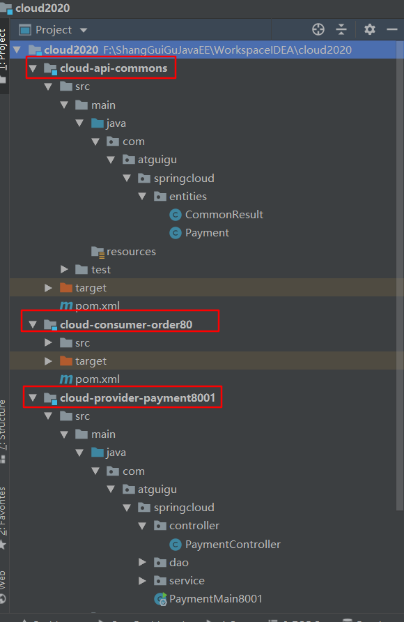

# 第5章 Eureka服务注册与发现

## Eureka基础知识

### 什么是服务治理

Spring Cloud封装了 Netflix公司开发的 Eureka模块来**实现服务治理**

在传统的RPC远程调用框架中,管理每个服务与服务之间依赖关系比较复杂,管理比较复杂,所以需要使用服务治理,管理服务于服务之间依赖关系,可以实现服务调用、负载均衡、容错等,实现服务发现与注册。

### 什么是服务注册与发现

Eureka采用了CS的设计架构, Eureka Server作为服务注册功能的服务器,它是服务注册中心。而系统中的其他微服务,使用Eureka的客户端连接到Eureka Server并维持心跳连接。这样系统的维护人员就可以通过 Eureka Server来监控系统中各个微服务是否正常运行。

在服努注册与发现中,有一个注册中心。当服务器启动的时候,会把当前自己**服务器的信息**比如服务地址通讯地址等以别名方式**注册到注册中心上**。另一方(消费者服务提供者),以该别名的方式去注册中心上获取到实际的服务通讯地址,然后再实现本地RPC调用RPC远程调用框架核心设计思想:在于注册中心,因为使用注册中心管理每个服务与服务之间的—个依赖关系(服务治理概念)。在任何rp远程框架中,都会有一个注册中心存放服务地址相关信息(接口地址)

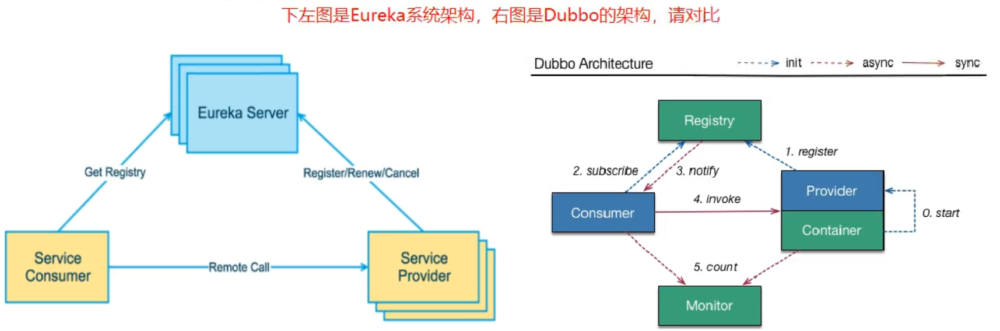

### Eureka两组件

**Eureka Server**提供服务注册服务

各个微服务节点通过配置启动后,会在 Eurekaservert中进行注册,这样 Eureka Server中的服务注册表中将会存储所有可用服务节点的信息,服务节点的信息可以在界面中直观看到。

**Eurekaclient**通过注册中心进行访问

是个Java客户端,用于简化 Eureka Serverl的交互,客户端同时也具备个内置的、使用轮询( round- robin)负载算法的负载均衡器。在应用启动后,将会向 Eureka Server发送心跳(默认周期为30秒)。如果 Eureka Server在多个心跳周期内没有接收到某个节点的心跳, Eureka Server将会从服务注册表中把这个服务节点移除(默认90秒

## 单机Eureka构建

### eurekaServer端服务注册中心

IDEA生成eurekaServer端服务注册中心类似物业公司

#### 建Module

cloud-eureka-server7001

#### 改POM

见依赖汇总文件

1.X和2.X的对比说明

2.X有netflix ，而1.X没有

```xml
<!-- eureka-server -->
<dependency>
    <groupId>org.springframework.cloud</groupId>
    <artifactId>spring-cloud-starter-netflix-eureka-server</artifactId>
</dependency>
```

#### 写YML

```yaml
server:
  port: 7001

eureka:
  instance:
    hostname: eureka7001.com #eureka服务端的实例名称
  client:
    register-with-eureka: false     #false表示不向注册中心注册自己。
    fetch-registry: false     # false表示自己端就是注册中心，我的职责就是维护服务实例，并不需要去检索服务
    service-url:
      #集群指向其它eureka
      #defaultZone: http://eureka7002.com:7002/eureka/
      #单机就是7001自己
      #defaultZone: http://${eureka.instance.hostname}:${server.port}/eureka/
      defaultZone: http://eureka7001.com:7001/eureka/
  #server:
    #关闭自我保护机制，保证不可用服务被及时踢除，这里只是演示，一般不关闭
    #enable-self-preservation: false
    #eviction-interval-timer-in-ms: 2000
```

#### 主启动

```java
package com.atguigu.springcloud;

import org.springframework.boot.SpringApplication;
import org.springframework.boot.autoconfigure.SpringBootApplication;
import org.springframework.cloud.netflix.eureka.server.EnableEurekaServer;

@SpringBootApplication
@EnableEurekaServer//表示该模块作为Eureka注册中心
public class EurekaMain7001 {
    public static void main(String[] args) {
        SpringApplication.run(EurekaMain7001.class,args);
    }
}
```

#### 测试

- 访问http://localhost:7001/
- 结果页面

### 服务提供者注册进EurekaServer

EurekaClient端cloud-provider-payment8001将注册进EurekaServer成为服务提供者provider，类似尚硅谷学校对外提供授课服务

cloud-provider-payment8001

#### 改POM

再加如下依赖，注意是Client

```xml
<!--eureka client-->
<dependency>
    <groupId>org.springframework.cloud</groupId>
    <artifactId>spring-cloud-starter-netflix-eureka-client</artifactId>
</dependency>
```

1.X和2.X的对比说明

2.X版本多了netflix

#### 写YML

```yaml
server:
  port: 8001

spring:
  application:
    name: cloud-payment-service
  datasource:
    type: com.alibaba.druid.pool.DruidDataSource #当前数据操作类型
    driver-class-name: com.mysql.cj.jdbc.Driver  #当前mysql驱动包
    url: jdbc:mysql://localhost:3306/db2019?useUnicode=true&characterEncoding=utf-8&useSSL=false&serverTimezone=Asia/Shanghai
    username: root
    password: root


mybatis:
  mapperLocations: classpath:mapper/*.xml
  type-aliases-package: com.atguigu.springcloud.entities    # 所有Entity别名类所在包

eureka:
  client:
    register-with-eureka: true # 表示是否将自己注册进 EurekaServer 默认为true
    fetch-registry: true # 是否从EurekaServer抓取已有的注册信息，默认为true。单节点无所谓，集群必须设置为true才能配合ribbon使用负载均衡
    service-url:
      defaultZone: http://localhost:7001/eureka # 单机版
      #defaultZone: http://eureka7001.com:7001/eureka, http://eureka7002.com:7002/eureka
  instance:
    instance-id: payment8001
    prefer-ip-address: true # 访问路径可以显示IP地址
    #lease-renewal-interval-in-seconds: 1 # Eureka客户端向服务中心发送心跳的时间间隔，单位为秒（默认30秒）
    #lease-expiration-duration-in-seconds: 2 #Eureka服务端在收到最后一次心跳后等待时间上限，单位为秒（默认90秒），超时将剔除服务
```

#### 主启动

类上再加注解：启用Eureka客户端

`@EnableEurekaClient`

#### 测试

- 先要启动EurekaServer

- 访问：http://localhost:7001/

- 微服务注册名配置说明

  - ```yaml
    spring:
      application:
        name: cloud-payment-service
    ```

自我保护机制

### 服务消费者注册进EurekaServer

EurekaClient端cloud-consumer-order80将注册进EurekaServer成为服务消费者consumer,类似来尚硅谷上课消费的各位同学

cloud-consumer-order80

POM

```xml
<!--eureka client-->
<dependency>
    <groupId>org.springframework.cloud</groupId>
    <artifactId>spring-cloud-starter-netflix-eureka-client</artifactId>
</dependency>
```

写YML

```yaml
server:
  port: 80

spring:
  application:
    name: cloud-order-service

eureka:
  client:
    register-with-eureka: true # 表示是否将自己注册进 EurekaServer 默认为true
    fetch-registry: true # 是否从EurekaServer抓取已有的注册信息，默认为true。单节点无所谓，集群必须设置为true才能配合ribbon使用负载均衡
    service-url:
      defaultZone: http://localhost:7001/eureka # 单机用这个，集群用下面的
      #defaultZone: http://eureka7001.com:7001/eureka, http://eureka7002.com:7002/eureka
```

主启动

​	加上`@EnableEurekaClient`

测试

- 先要启动EurekaServer，7001服务
- 再要启动服务提供者provider，8001服务
- eureka服务器
- 访问http://localhost/consumer/payment/get/31

## Eureka集群

解决办法：搭建Eureka注册中心集群，实现负载均衡+故障容错 

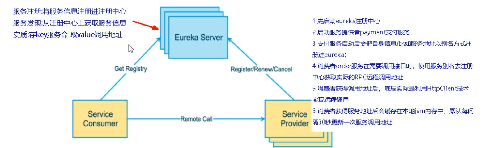


key服务名：

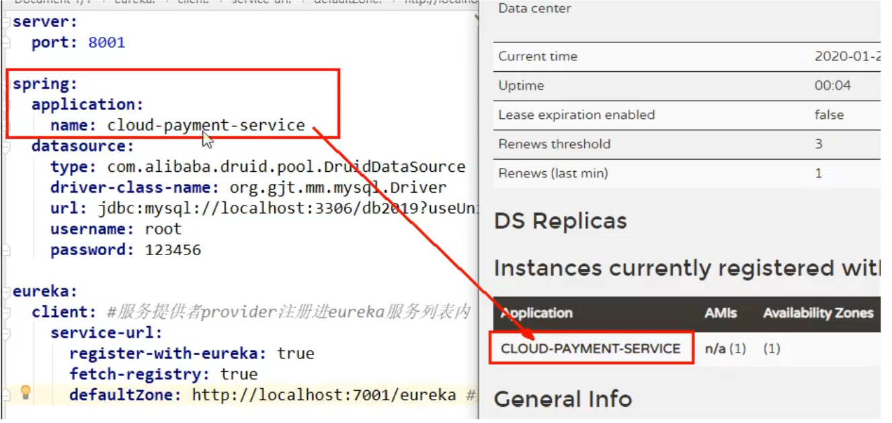

微服务RPC远程服务调用最核心是什么

高可用，如果注册这些只有一个，出故障就。。。

集群：相互注册


### EurekaServer集群搭建

参考cloud-eureka-server7001

新建cloud-eureka-server7002

改POM

**修改映射配置**

C:\Windows\System32\drivers\etc路径下的hosts文件

添加如下：

127.0.0.1 eureka7001.com

127.0.0.1 eureka7002.com

写YML（以前单机）

7001

```yaml
server:
  port: 7001

eureka:
  instance:
    hostname: eureka7001.com #eureka服务端的实例名称
  client:
    register-with-eureka: false     #false表示不向注册中心注册自己。
    fetch-registry: false     # false表示自己端就是注册中心，我的职责就是维护服务实例，并不需要去检索服务
    service-url:
      #集群指向其它eureka
      defaultZone: http://eureka7002.com:7002/eureka/
      #单机就是7001自己
      #defaultZone: http://${eureka.instance.hostname}:${server.port}/eureka/
      #defaultZone: http://eureka7001.com:7001/eureka/
```

7002

```yaml
server:
  port: 7002

eureka:
  instance:
    hostname: eureka7002.com #eureka服务端的实例名称
  client:
    register-with-eureka: false     #false表示不向注册中心注册自己。
    fetch-registry: false     # false表示自己端就是注册中心，我的职责就是维护服务实例，并不需要去检索服务
    service-url:
      #集群指向其它eureka
      defaultZone: http://eureka7001.com:7001/eureka/
      #单机就是7001自己
      #defaultZone: http://${eureka.instance.hostname}:${server.port}/eureka/
```

主启动(复制cloud-eureka-server7001的主启动类到7002即可)

### 服务提供者发布到Eureka集群

将支付服务8001微服务发布到上面2台Eureka集群配置中

8001的application.yml配置

加入`defaultZone: http://eureka7001.com:7001/eureka, http://eureka7002.com:7002/eureka`

```yaml
eureka:
  client:
    register-with-eureka: true # 表示是否将自己注册进 EurekaServer 默认为true
    fetch-registry: true # 是否从EurekaServer抓取已有的注册信息，默认为true。单节点无所谓，集群必须设置为true才能配合ribbon使用负载均衡
    service-url:
      defaultZone: http://eureka7001.com:7001/eureka, http://eureka7002.com:7002/eureka
  instance:
    instance-id: payment8001
    prefer-ip-address: true # 访问路径可以显示IP地址
```

### 服务消费者发布到Eureka集群

将订单服务80微服务发布到上面2台Eureka集群配置中

80的application.yml配置

同样加入`defaultZone: http://eureka7001.com:7001/eureka, http://eureka7002.com:7002/eureka`

### 测试01

- 先要启动EurekaServer，7001/7002服务
- 再要启动服务提供者provider，8001服务
- 再要启动消费者，80
- 访问：http://localhost/consumer/payment/get/31 正常返回json数据

### 服务提供者集群

支付服务提供者8001集群环境构建，参考cloud-provider-payment8001

- 新建module   cloud-provider-payment8002

- 改POM

- 写YML

  - 7001

    - ```YAML
      eureka:
        instance:
          hostname: eureka7001.com #eureka服务端的实例名称
        client:
          register-with-eureka: false     #false表示不向注册中心注册自己。
          fetch-registry: false     # false表示自己端就是注册中心，我的职责就是维护服务实例，并不需要去检索服务
          service-url:
            defaultZone: http://eureka7002.com:7002/eureka/
      ```

  - 7002

    - ```YAML
      eureka:
        instance:
          hostname: eureka7002.com #eureka服务端的实例名称
        client:
          register-with-eureka: false     #false表示不向注册中心注册自己。
          fetch-registry: false     # false表示自己端就是注册中心，我的职责就是维护服务实例，并不需要去检索服务
          service-url:
            defaultZone: http://eureka7001.com:7001/eureka/
      ```

- 修改8001/8002的Controller

  ```JAVA
  
  @RestController
  @Slf4j
  public class PaymentController {
      @Resource
      private PaymentService paymentService;
      @Value("${server.port}")
      private String serverPort;
  
      @Resource
      private DiscoveryClient discoveryClient;
      @PostMapping(value="/payment/create")
      public CommonResult<Integer> create(@RequestBody Payment payment){
          int result = paymentService.create(payment);
          log.info("***插入结果"+result);
          if (result>0){//修改这里：输出加入端口
              return new CommonResult<>(200,"插入数据库成功,serverPort:"+serverPort,result);
          }else {
              return new CommonResult<>(444,"插入数据库失败",null);
          }
      }
  
      @GetMapping(value="/payment/get/{id}")
      public CommonResult<Payment> getPaymentById(@PathVariable("id") Long id){
          Payment payment = paymentService.getPaymentById(id);
          log.info("***插入结果"+payment);
          if (payment!=null){
              return new CommonResult<>(200,"查询成功,serverPort:"+serverPort,payment);
          }else {
              return new CommonResult<>(444,"没有对应记录，查询id:"+id,null);
          }
      }
  }
  ```

### 负载均衡

**bug**

80订单服务访问地址不能写死，改为

```java
public class OrderController {
    //public static final String PAYMENT_URL="http://localhost:8001";//单机版，不走注册中心
    public static final String PAYMENT_URL="http://CLOUD-PAYMENT-SERVICE";//必须大写
    @Resource
    private RestTemplate restTemplate;
    @GetMapping("/consumer/payment/create")
    public CommonResult<Payment> create(Payment payment){
        return restTemplate.postForObject(PAYMENT_URL+"/payment/create",payment,CommonResult.class);
    }
    @GetMapping("/consumer/payment/get/{id}")
    public CommonResult<Payment> getPayment(@PathVariable("id") Long id){
        return restTemplate.getForObject(PAYMENT_URL+"/payment/get/"+id,CommonResult.class);
    }
}
```

使用@LoadBalanced注解赋予RestTemplate负载均衡的能力

在服务消费者中:

```java
@Configuration
public class ApplicationContextConfig {
    @Bean
    @LoadBalanced
    public RestTemplate getRestTemplate(){
        return new RestTemplate();
    }
}
//applicationContext.xml <bean id="" class="">
```

ApplicationContextBean,提前说一下Ribbon的负载均衡功能

### 测试02

- 先要启动EurekaServer，7001/7002服务
- 再要启动服务提供者provider，8001/8002服务
- http://localhost/consumer/payment/get/31
- 结果
  - 负载均衡效果达到
  - 8001/8002端口交替出现

Ribbon和Eureka整合后Consumer可以直接调用服务而不用再关心地址和端口号，且该服务还有负载功能了

## actuator微服务信息完善

主机名称：服务名称修改

访问信息有ip信息提示

修改cloud-provider-payment8001

YML

```yaml
  instance:
    instance-id: payment8001 # 服务名称修改
    prefer-ip-address: true # 访问路径可以显示IP地址
```

对于8002类似修改

## 服务发现Discovery

对于注册进eureka里面的微服务，可以通过服务发现来获得该服务的信息

修改cloud-provider-payment8001的Controller

添加：

```java
@Resource
private DiscoveryClient discoveryClient;

@GetMapping(value ="/payment/discovery")
public Object discovery(){
    List<String> services = discoveryClient.getServices();
    for (String element : services) {
        log.info("****element:"+element);
    }
    List<ServiceInstance> instances = discoveryClient.getInstances("CLOUD-PAYMENT-SERVICE");
    for (ServiceInstance instance : instances) {
        log.info(instance.getServiceId()+"\t"+instance.getHost()+"\t"+instance.getPort()+"\t"+instance.getUri());
    }
    return this.discoveryClient;
}
```

8001主启动类，添加`@EnableDiscoveryClient`

对8002的修改类似

测试

- 先要启动EurekaServer，7001/7002服务
- 再启动8001主启动类，需要稍等一会
- http://localhost:8001/payment/discovery

## Eureka自我保护

### 故障现象

概述：

**保护模式**主要用于一组客户端Eureka Server之间存在网络分区场景下的保护。一旦进入保护模式，Eureka Server将会尝试保护其服务注册表中的信息，不在删除服务注册表中的数据，也就是不会注销任何微服务。

出现一下文字，说明Eurka进入了保护模式


### 导致原因：

**一句话**：某时刻某一个微服务不可用了，Eureka不会立即清理，依旧会对该微服务的信息进行保存

属于CAP里面的AP分支

### 禁止自我保护

怎么禁止自我保护（一般生产环境中不会禁止自我保护）

### 注册中心eureakeServer端7001

yml

默认是自我保护开启的`eureka.server.enable-self-preservation = true`

关闭`eureka.server.enable-self-preservation = false`

**关闭效果**


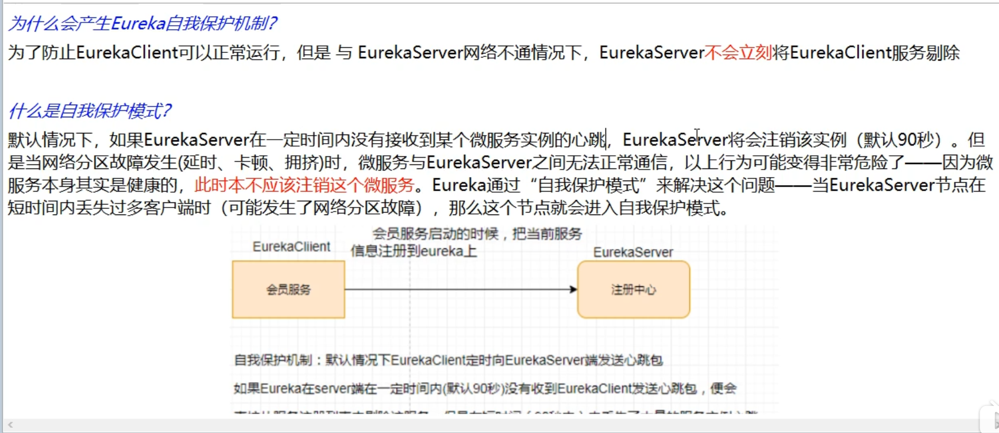


禁止自我保护

### 生产者客户端eureakeClient端8001

默认

```yaml
eureka.instance.lease-renewal-interval-in-seconds=30  单位为秒（默认是30秒）
eureka.instance.lease-expiration-duration-in-seconds=90 单位为秒（默认是90秒）
```

```yaml
eureka:
  client:
    register-with-eureka: true # 表示是否将自己注册进 EurekaServer 默认为true
    fetch-registry: true # 是否从EurekaServer抓取已有的注册信息，默认为true。单节点无所谓，集群必须设置为true才能配合ribbon使用负载均衡
    service-url:
      defaultZone: http://localhost:7001/eureka # 单机版
      #defaultZone: http://eureka7001.com:7001/eureka, http://eureka7002.com:7002/eureka
  instance:
    instance-id: payment8001
    prefer-ip-address: true # 访问路径可以显示IP地址
    lease-renewal-interval-in-seconds: 1 # Eureka客户端向服务中心发送心跳的时间间隔，单位为秒（默认30秒）
    lease-expiration-duration-in-seconds: 2 #Eureka服务端在收到最后一次心跳后等待时间上限，单位为秒（默认90秒），超时将剔除服务
```

**测试**

7001和8001都配置完成

先启动7001再启动8001

先关闭8001,马上被删除了

# 第6章 Zookeeper服务注册与发现

Eureka停更

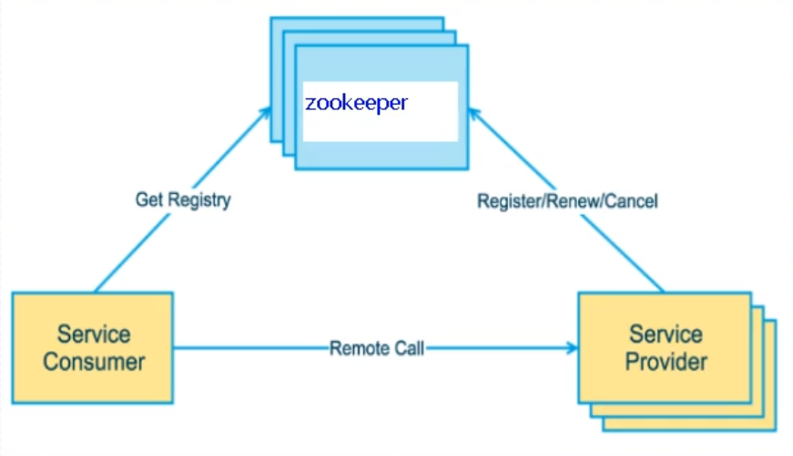

zookeeper是一个分布式协调工具，可以实现注册中心功能

## zookeeper安装到Centos

- 安装 Jdk

- 拷贝 Zookeeper 安装包到 Linux 系统下

- 解压到指定目录

  ```bash
  tar -zxvf zookeeper-
  3.4.10.tar.gz -C /opt/module/
  ```

- 配置修改

  - 将/opt/module/zookeeper-3.4.10/conf 这个路径下的 zoo_sample.cfg 修改为 zoo.cfg

    ```bash
    mv zoo_sample.cfg zoo.cfg
    ```

  - 打开 zoo.cfg 文件，修改 dataDir 路径

    ```bash
     vim zoo.cfg
    ```

  - 修改如下内容：

    ```bash
    dataDir=/opt/module/zookeeper-3.4.10/zkData
    ```

  - 在/opt/module/zookeeper-3.4.10/这个目录上创建 zkData 文件夹

    ```bash
    mkdir zkData
    ```

- 操作 Zookeeper

  - 启动 Zookeeper

    ```bash
    bin/zkServer.sh start
    ```

    

  -  查看进程是否启动

    ```bash
    jps
    4020 Jps
    4001 QuorumPeerMain
    ```

  - 查看状态：

    ```bash
     bin/zkServer.sh status
     ZooKeeper JMX enabled by default
    Using config: /opt/module/zookeeper-
    3.4.10/bin/../conf/zoo.cfg
    Mode: standalone
    ```

  - 启动客户端：

    ```bash
     bin/zkCli.sh
    ```

  - 退出客户端：

    ```bash
     quit
    ```

  - 停止 Zookeeper

    ```bash
     bin/zkServer.sh stop
    ```

    

```bash
# 关闭防火墙
systemctl stop firewalld.service

```

## Eureka停更

停更了怎么办，https://github.com/Netflix/eureka/wiki

SpringCloud整合Zookeeper代替Eureka

## 注册中心Zookeeper

zookeeper是一个分布式协调工具，可以实现注册中心功能

关闭Linux服务器防火墙后启动zookeeper服务器

zookeeper服务器取代Eureka服务器，zk作为服务注册中心

### 服务提供者

- 新建cloud-provider-payment8004

- POM

  ```xml
  <dependencies>
          <dependency>
              <groupId>org.springframework.cloud</groupId>
              <artifactId>spring-cloud-starter-zookeeper-discovery</artifactId>
          </dependency>
          <dependency>
              <groupId>org.springframework.cloud</groupId>
              <artifactId>spring-cloud-starter-zipkin</artifactId>
          </dependency>
          <dependency><!-- 引用自己定义的api通用包，可以使用Payment支付Entity -->
              <groupId>com.atguigu.springcloud</groupId>
              <artifactId>cloud-api-commons</artifactId>
              <version>${project.version}</version>
          </dependency>
          <dependency>
              <groupId>org.springframework.boot</groupId>
              <artifactId>spring-boot-starter-web</artifactId>
          </dependency>
          <!--监控-->
          <dependency>
              <groupId>org.springframework.boot</groupId>
              <artifactId>spring-boot-starter-actuator</artifactId>
          </dependency>
          <dependency>
              <groupId>org.mybatis.spring.boot</groupId>
              <artifactId>mybatis-spring-boot-starter</artifactId>
          </dependency>
          <dependency>
              <groupId>com.alibaba</groupId>
              <artifactId>druid-spring-boot-starter</artifactId>
              <version>1.1.23</version>
              <!--如果没写版本,从父层面找,找到了就直接用,全局统一-->
          </dependency>
          <!--mysql-connector-java-->
          <dependency>
              <groupId>mysql</groupId>
              <artifactId>mysql-connector-java</artifactId>
          </dependency>
          <!--jdbc-->
          <dependency>
              <groupId>org.springframework.boot</groupId>
              <artifactId>spring-boot-starter-jdbc</artifactId>
          </dependency>
          <!--热部署-->
          <dependency>
              <groupId>org.springframework.boot</groupId>
              <artifactId>spring-boot-devtools</artifactId>
              <scope>runtime</scope>
              <optional>true</optional>
          </dependency>
          <dependency>
              <groupId>org.projectlombok</groupId>
              <artifactId>lombok</artifactId>
              <optional>true</optional>
          </dependency>
          <dependency>
              <groupId>org.springframework.boot</groupId>
              <artifactId>spring-boot-starter-test</artifactId>
              <scope>test</scope>
          </dependency>
      </dependencies>
  ```

- YML

  ```yaml
  # 8004表示注册到zookeeper服务器的支付服务提供者端口号
  server:
    port: 8004
  # 服务名----注册zookeeper到注册中心名称
  spring:
    application:
      name: cloud-provider-payment
    datasource:
      type: com.alibaba.druid.pool.DruidDataSource #当前数据操作类型
      driver-class-name: com.mysql.cj.jdbc.Driver  #当前mysql驱动包
      url: jdbc:mysql://localhost:3306/db2019?useUnicode=true&characterEncoding=utf-8&useSSL=false&serverTimezone=Asia/Shanghai
      username: root
      password: root
    cloud:
      zookeeper:
        connect-string: 192.168.1.130:2181
  ```

- 主启动类

  ```java
  package com.atguigu.springcloud;
  
  import org.springframework.boot.SpringApplication;
  import org.springframework.boot.autoconfigure.SpringBootApplication;
  import org.springframework.cloud.client.discovery.EnableDiscoveryClient;
  
  @SpringBootApplication
  @EnableDiscoveryClient//该注解用于向使用consul或者zookeeper作为注册中心时注册服务
  public class PaymentMain8004 {
      public static void main(String[] args) {
          SpringApplication.run(PaymentMain8004.class,args);
      }
  }
  ```

- Controller

  ```java
  package com.atguigu.springcloud.controller;
  
  import lombok.extern.slf4j.Slf4j;
  import org.springframework.beans.factory.annotation.Value;
  import org.springframework.web.bind.annotation.RequestMapping;
  import org.springframework.web.bind.annotation.RestController;
  
  import java.util.UUID;
  
  @RestController
  @Slf4j
  public class PaymentController {
      @Value("${server.port}")
      private String serverPort;
  
      @RequestMapping(value="payment/zk")
      public String paymentzk(){
          return "springcloud with zookper:"+serverPort+"\t"+ UUID.randomUUID().toString();
      }
  
  }
  ```

- 启动8004注册进zookeeper

- 验证测试

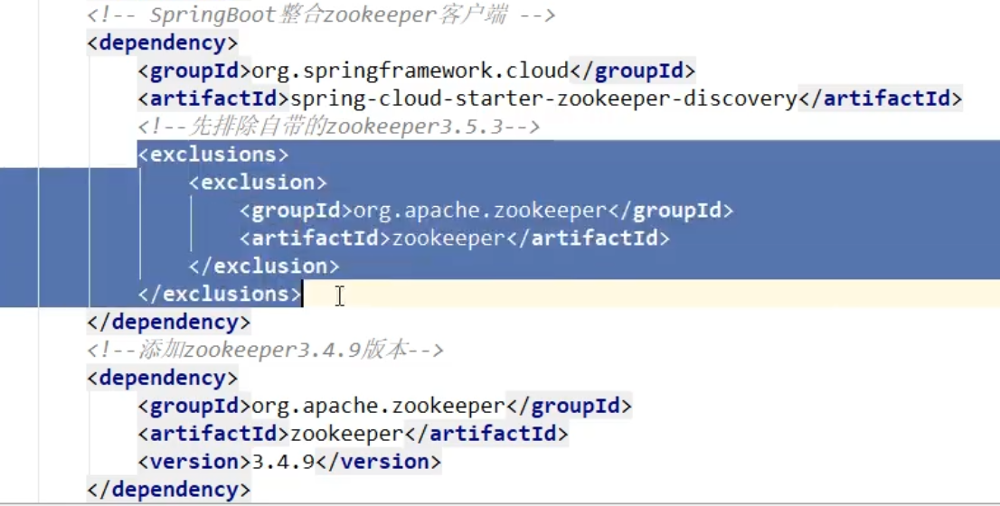


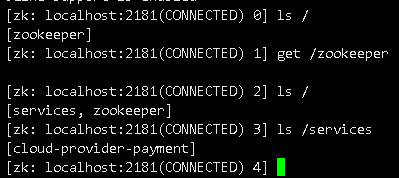

http://localhost:8004/payment/zk

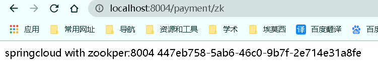


```bash
[zk: localhost:2181(CONNECTED) 0] ls /
[zookeeper]
[zk: localhost:2181(CONNECTED) 1] get /zookeeper
[zk: localhost:2181(CONNECTED) 2] ls /
[services, zookeeper]
[zk: localhost:2181(CONNECTED) 3] ls /services
[cloud-provider-payment]
[zk: localhost:2181(CONNECTED) 4] ls /services/cloud-provider-payment
[acce42cb-fbad-4fa6-991e-9388666080b5]
[zk: localhost:2181(CONNECTED) 6] get  /services/cloud-provider-payment/acce42cb-fbad-4fa6-991e-9388666080b5

```


```json
{
  "name": "cloud-provider-payment",
  "id": "acce42cb-fbad-4fa6-991e-9388666080b5",
  "address": "Hsq",
  "port": 8004,
  "sslPort": null,
  "payload": {
    "@class": "org.springframework.cloud.zookeeper.discovery.ZookeeperInstance",
    "id": "application-1",
    "name": "cloud-provider-payment",
    "metadata": {
      "instance_status": "UP"
    }
  },
  "registrationTimeUTC": 1600506586704,
  "serviceType": "DYNAMIC",
  "uriSpec": {
    "parts": [
      {
        "value": "scheme",
        "variable": true
      },
      {
        "value": "://",
        "variable": false
      },
      {
        "value": "address",
        "variable": true
      },
      {
        "value": ":",
        "variable": false
      },
      {
        "value": "port",
        "variable": true
      }
    ]
  }
}
```


这里是临时节点，IDEA里关闭程序后，zookeeper那边过一会就没有uuid了


### 服务消费者

- 新建cloud-consumerzk-order80

- POM

  同上一个

- YML

  同上一个，端口改为80，服务名改为cloud-consumer-order

- 主启动

  ```java
  @SpringBootApplication
  @EnableDiscoveryClient
  public class OrderZKMain80 {
      public static void main(String[] args) {
          SpringApplication.run(OrderZKMain80.class,args);
      }
  }
  ```

- 业务类

  - 配置Bean

    ```java
    package com.atguigu.springcloud.config;
    
    import org.springframework.cloud.client.loadbalancer.LoadBalanced;
    import org.springframework.context.annotation.Bean;
    import org.springframework.context.annotation.Configuration;
    import org.springframework.web.client.RestTemplate;
    
    @Configuration
    public class ApplicationContextConfig {
        @Bean
        @LoadBalanced
        public RestTemplate getRestTemplate(){
            return new RestTemplate();
        }
    }
    
    ```

  - Controller

    ```java
    
    @RestController
    @Slf4j
    public class OrderZKController {
        public static final String INVOKE_URL = "http://cloud-provider-payment";
        @Resource
        private RestTemplate restTemplate;
        @GetMapping(value = "/consumer/payment/zk")
        public String paymentInfo(){
            String result = restTemplate.getForObject(INVOKE_URL+"/payment/zk",String.class);
            return result;
        }
    }
    
    ```

- 验证测试

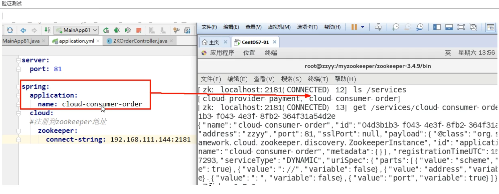

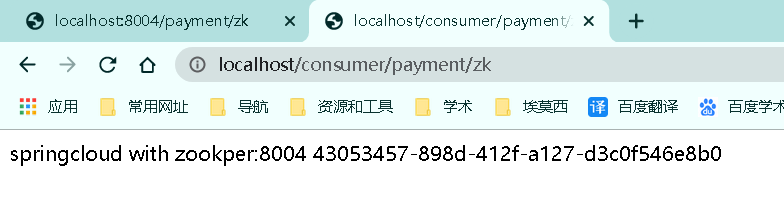

# 第7章 Consul服务注册与发现

## Consul简介

### 是什么

https://www.consul.io/intro/index.html

Consul是一套开源的分布式服务发现和配置管理系统，右HashiCorp公司用Go语言开发

提供了微服务系统中的服务治理，配置中心，控制总线等功能。这些功能中每一个都可以根据需要单独使用，也可以使用以构建全方位的服务网格，总之Consul提供了一种完整的服务网格解决方案。

### 能干嘛

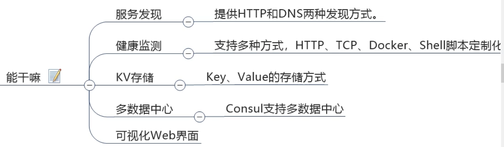

### 下载与文档

https://www.consul.io/downloads

中文文档https://www.springcloud.cc/spring-cloud-consul.html

## 安装并运行Consul

解压就行

**运行**

```bash
# 查看版本信息
F:\ShangGuiGuJavaEE\Environment\consul>consul --version
Consul v1.8.4
Revision 12b16df32
Protocol 2 spoken by default, understands 2 to 3 (agent will automatically use protocol >2 when speaking to compatible agents)
#开发模式启动
consul agent -dev
```

通过以下地址可以访问Consul的首页：`http://localhost:8500`

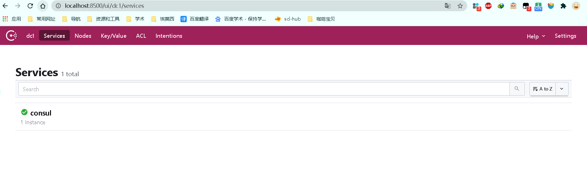

服务注册进入Consul：

## 服务提供者

- 新建Module支付服务provider8006

  cloud-providerconsul-payment8006

- POM

  ```xml
  <dependencies>
          <!--SpringCloud consul-server-->
          <dependency>
              <groupId>org.springframework.cloud</groupId>
              <artifactId>spring-cloud-starter-consul-discovery</artifactId>
          </dependency>
          <!--SpringBoot 整合Web组件-->
          <dependency>
              <groupId>org.springframework.boot</groupId>
              <artifactId>spring-boot-starter-web</artifactId>
          </dependency>
          <!--监控-->
          <dependency>
              <groupId>org.springframework.boot</groupId>
              <artifactId>spring-boot-starter-actuator</artifactId>
          </dependency>
          <!--日常通用jar包配置-->
          <dependency>
              <groupId>org.springframework.boot</groupId>
              <artifactId>spring-boot-devtools</artifactId>
              <scope>runtime</scope>
              <optional>true</optional>
          </dependency>
          <dependency>
              <groupId>org.projectlombok</groupId>
              <artifactId>lombok</artifactId>
              <optional>true</optional>
          </dependency>
          <dependency>
              <groupId>org.springframework.boot</groupId>
              <artifactId>spring-boot-starter-test</artifactId>
              <scope>test</scope>
          </dependency>
      </dependencies>
  ```

  

- YML

  ```yaml
  # consul服务端口号
  server:
    port: 8006
  spring:
    application:
      name: cloud-provider-payment
    # consul注册中心地址
    cloud:
      consul:
        host: localhost
        port: 8500
        discovery:
          service-name: ${spring.application.name}
        # hostname:127.0.0.1
  
  ```

  

- 主启动类

  ```java
  package com.atguigu.springcloud;
  
  import org.springframework.boot.SpringApplication;
  import org.springframework.boot.autoconfigure.SpringBootApplication;
  import org.springframework.cloud.client.discovery.EnableDiscoveryClient;
  
  @SpringBootApplication
  @EnableDiscoveryClient
  public class PaymentMain8006 {
      public static void main(String[] args) {
          SpringApplication.run(PaymentMain8006.class,args);
      }
  }
  
  ```

  

- 业务类Controller

  ```java
  package com.atguigu.springcloud.controller;
  
  import lombok.extern.slf4j.Slf4j;
  import org.springframework.beans.factory.annotation.Value;
  import org.springframework.web.bind.annotation.RequestMapping;
  import org.springframework.web.bind.annotation.RestController;
  
  import java.util.UUID;
  
  @RestController
  @Slf4j
  public class PaymentController {
      @Value("${server.port}")
      private String serverPort;
  
      @RequestMapping(value="payment/consul")
      public String paymentConsul(){
          return "springcloud with consul:"+serverPort+"\t"+ UUID.randomUUID().toString();
      }
  }
  
  ```

  

- 验证测试

  http://localhost:8006/payment/consul


## 服务消费者

- 新建Module消费服务order8006

  cloud-consumerconsul-order80

- POM

  同服务提供者

- YML

  ```yaml
  # consul服务端口号
  server:
    port: 8006
  spring:
    application:
      name: cloud-provider-payment
    # consul注册中心地址
    cloud:
      consul:
        host: localhost
        port: 8500
        discovery:
          service-name: ${spring.application.name}
        # hostname:127.0.0.1
  
  ```

  

- 主启动类

  ```java
  package com.atguigu.springcloud;
  
  import org.springframework.boot.SpringApplication;
  import org.springframework.boot.autoconfigure.SpringBootApplication;
  import org.springframework.cloud.client.discovery.EnableDiscoveryClient;
  
  @SpringBootApplication
  @EnableDiscoveryClient
  public class OrderZKMain80 {
      public static void main(String[] args) {
          SpringApplication.run(OrderZKMain80.class,args);
      }
  }
  
  ```

  

- 配置Bean

  ```java
  package com.atguigu.springcloud.config;
  
  import org.springframework.cloud.client.loadbalancer.LoadBalanced;
  import org.springframework.context.annotation.Bean;
  import org.springframework.context.annotation.Configuration;
  import org.springframework.web.client.RestTemplate;
  
  @Configuration
  public class ApplicationContextConfig {
      @Bean
      @LoadBalanced
      public RestTemplate getRestTemplate(){
          return new RestTemplate();
      }
  }
  
  ```

  

- Controller

  ```java
  package com.atguigu.springcloud.controller;
  
  import lombok.extern.slf4j.Slf4j;
  import org.springframework.web.bind.annotation.GetMapping;
  import org.springframework.web.bind.annotation.RestController;
  import org.springframework.web.client.RestTemplate;
  
  import javax.annotation.Resource;
  
  @RestController
  @Slf4j
  public class OrderZKController {
      public static final String INVOKE_URL = "http://cloud-provider-payment";
      @Resource
      private RestTemplate restTemplate;
      @GetMapping(value = "/consumer/payment/zk")
      public String paymentInfo(){
          String result = restTemplate.getForObject(INVOKE_URL+"/payment/zk",String.class);
          return result;
      }
  }
  
  ```

  

- 验证测试


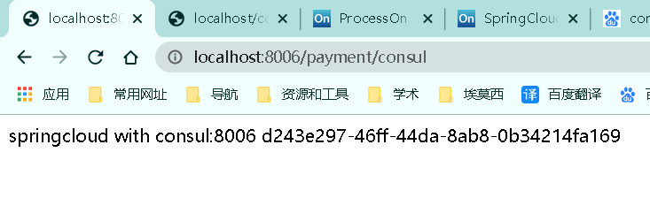


http://localhost:8500/

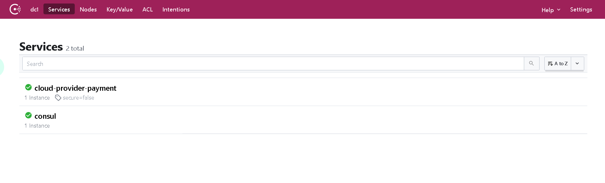


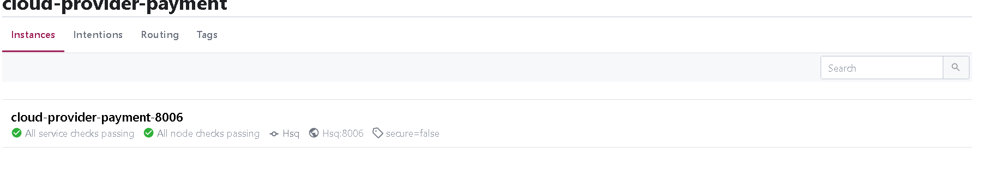


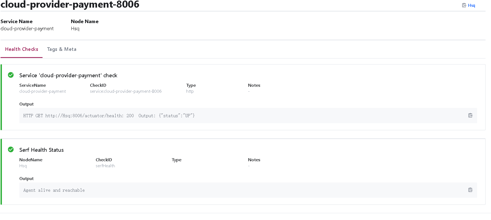

## 三个注册中心异同点

| 组件名    | 语言 | CAP  | 服务健康检查 | 对外接口暴露 | SpringCloud集成 |
| --------- | ---- | ---- | ------------ | ------------ | --------------- |
| Eureka    | Java | AP   | 可配支持     | HTTP         | 已集成          |
| Consul    | Go   | CP   | 支持         | HTTP/DNS     | 已集成          |
| Zookeeper | Java | CP   | 支持         | 客户端       | 已集成          |

### CAP

- C:Consistency(强一致性)
- A:Availability(可用性)
- P:Partition tolerance(分区容错)

CAP理论关注粒度是数据，而不是整体系统设计的策略

**最多只能同时较好的满足两个**

CAP理论核心是：**一个分布式系统不可能同时很好的满足一致性，可用性和分区容错性这三个需求**

因此，根据CAP原理将NoSQL数据库分成了满足CA原则，满足CP原则和满足AP原则这三大类：

CA-单点集群，满足一致性，可用性的系统，通常性能不是特别高

CP-满足一致性，分区容错性的系统，通常性能不是特别高

AP-满足可用性，分区容错性的系统，通常可能对一致性要求低一些

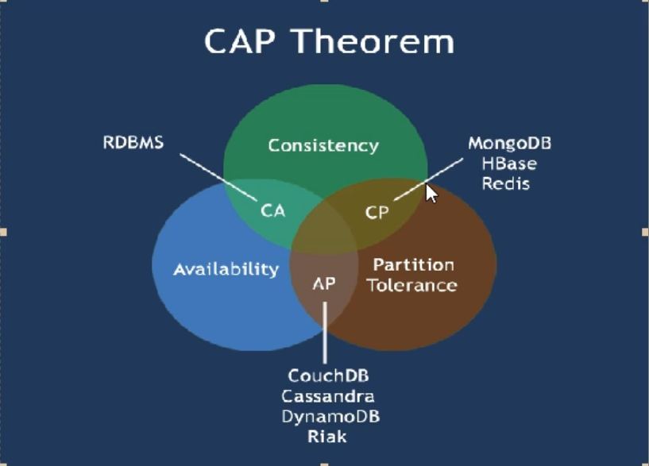


AP：Eureka

当网络分区出现后，为了保证可用性，系统B**可以返回旧值**，保证系统的可用性。

结论：违背了一致性C的要求，只满足可用性和分区容错，即AP

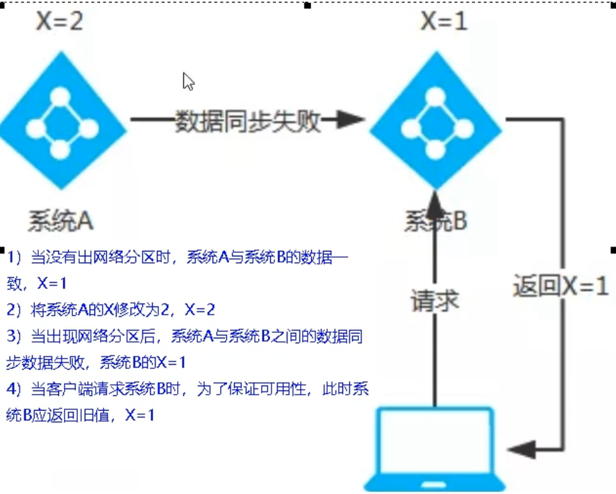

CP（Zookeeper/Consul）

当网络分区出现后，为了保证一致性，就必须拒绝请求，否则无法保证一致性。

结论：违背了一致性A的要求，只满足一致性和分区容错，即CP

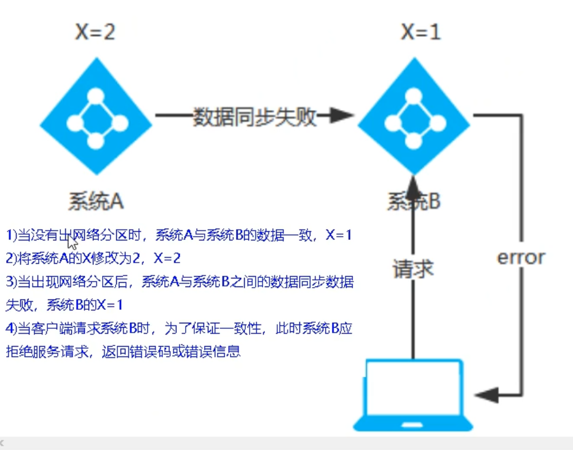

# 第8章 Ribbon负载均衡服务调用

## 概述

### 是什么

SpringCloud Ribbon是基于 Netflix Ribbon实现的一套**客户端**负载均衡的工具。

简单的说, Ribbon是 Netflix发布的开源项目,主要功能是提供**客户端的软件负载均衡算法和服务调用**。 Ribbon客户端组件提供一系列完善的配置项如连接超时,重试等。简单的说,就是在配置文件中列出 Load Balancer(简称LB)后面所有的机器, Ribbon会自动的帮助你基于某种规则(如简单轮询,随机连接等)去连接这些机器。我们很容易使用 Ribbon实现自定义的负载均衡算法

Ribbon现在维护中

https://github.com/Netflix/ribbon

替换方案：SpringCloud LoadBalancer

### 能干啥

负载均衡+RestTemplate调用

- 负载均衡是什么？

  简单的说就是将用户的请求平摊的分配到多个服务上,从而达到系统的HA(高可用)。

  常见的负载均衡有软件Ngnx,LVS,硬件F5等

- Ribbon本地负载均衡客户端 S Nginx服务端负载均衡区别

  - Nginx是服务器负载均衡,客户端所有请求都会交给 nginx,然后由 nginx实现转发请求。即负载均衡是由服务端实现的。

  - Ribbon本地负载均衡,在调用微服务接口时候,会在注册中心上获取注册信息服务列表之后缓存到VM本地,从而在本地实现RPC远程服务调用技术

- 负载均衡类别：
  - 集中式LB

    即在服务的消费方和提供方之间使用独立的LB设施可以是硬件,如F5,也可以是软件,如 nginx,由该设施负责把访问请求通过某种策略转发至服务的提供方;

  - 进程内LB

    将LB逻辑集成到消费方,消费方从服务注册中心获知有哪些地址可用,然后自己再从这些地址中选择出—个合适的服务器。**Ribbon就属于进程内LB**,它只是一个类库,集成于消费方进程,消费方通过它来获取到服务提供方的地址

## 演示

架构说明：Ribbon其实就是一个软负载均衡的客户端组件，他可以和其他所需请求的客户端结合使用，和eureka结合只是其中的一个实例。

Ribbon在工作时分成两步

第一步先选择 Eurekaserver,它优先选择在同一个区域内负载较少的 server.

第二步再根据用户指定的策略,在从 serverl取到的服务注册列表中选择个地址。其中 Ribbon提供了多种策略:比如轮询、随机和根据响应时间加权。

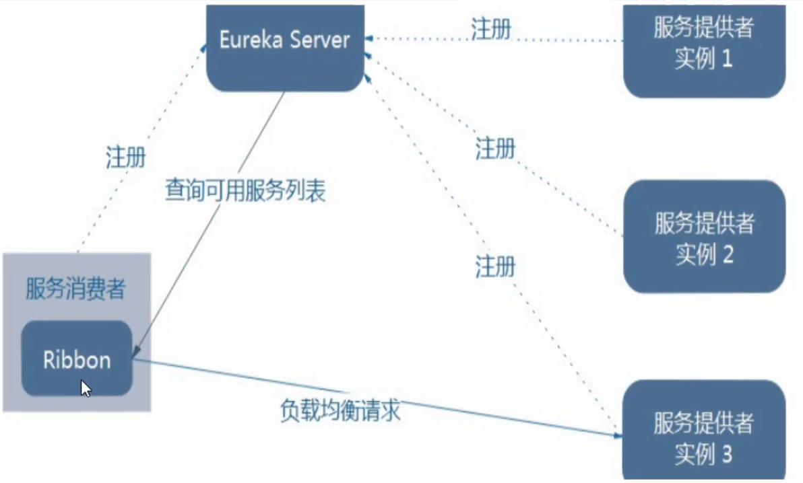

### POM

eureka客户端就自带了Ribbon

```xml
<dependency>
    <groupId>org.springframework.cloud</groupId>
    <artifactId>spring-cloud-starter-netflix-eureka-client</artifactId>
</dependency>
```

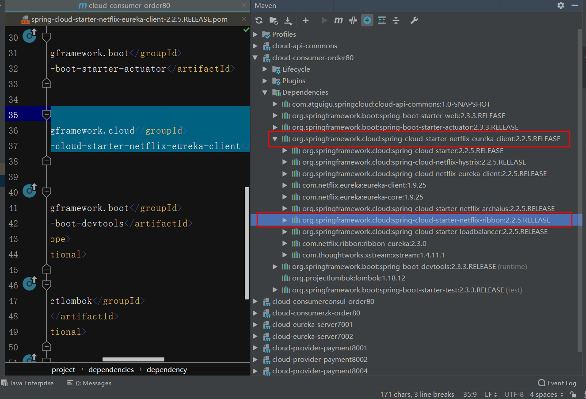

### 二说RestTemplate的使用

文档

https://docs.spring.io/spring-framework/docs/5.2.2.RELEASE/javadoc-api/org/springframework/web/client/RestTemplate.html

getForObject方法/getForEntity方法

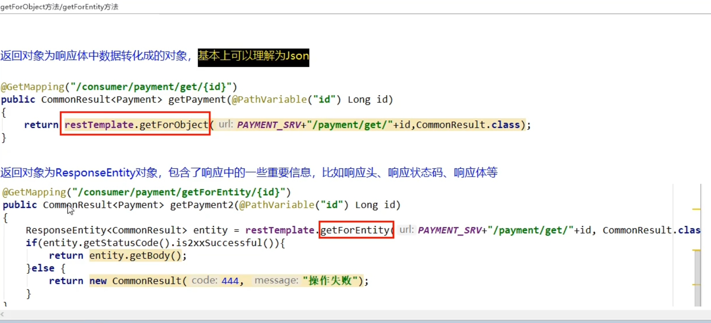

postForObject/postForEntity

```java
@GetMapping("/consumer/payment/create")
public CommonResult<Payment> create(Payment payment){
    return restTemplate.postForEntity(PAYMENT_URL+"/payment/create",payment,CommonResult.class).getBody();
}

@GetMapping("/consumer/payment/getForEntity/{id}")
public CommonResult<Payment> getPayment2(@PathVariable("id") Long id){
    ResponseEntity<CommonResult> entity = restTemplate.getForEntity(PAYMENT_URL+"/payment/get/"+id,CommonResult.class);
    if (entity.getStatusCode().is2xxSuccessful()){
        log.info(entity.getStatusCode()+"\t"+entity);
        return entity.getBody();
    }else {
        return new CommonResult<>(444,"操作失败");
    }
}
```


GET请求方法

POST请求方法

## Ribbon核心组件IRule


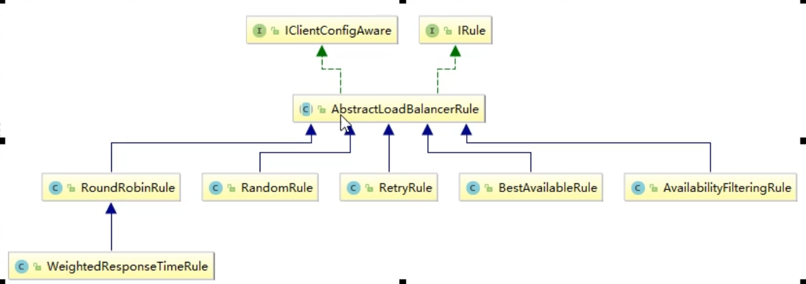

IRule：根据特定算法中从服务列表中选取一个要访问的服务

- com.netflix.loadbalancer.RoundRobinRule 	轮询
- com.netflix.loadbalancer.RandomRule     随机
- com.netflix.loadbalancer.RetryRule    先按照RoundRobinRule的策略获取服务，如果获取服务失败则在指定时间内会进行重试
- WeightedResponseTimeRule   对RoundRobinRule的扩展，响应速度越快的实例选择权重越大，越容易被选择
- BestAvailableRule   会先过滤掉由于多次访问故障而处于断路器跳闸状态的服务，然后选择一个并发量最小的服务
- AvailabilityFilteringRule  先过滤掉故障实例，再选择并发较小的实例
- ZoneAvoidanceRule  默认规则，复合判断server所在区域的性能和server的可用性选择服务器

如何替换

- 修改cloud-consumer-order80

- 注意配置细节

  官方文档明确给出了警告:这个自定义配置类不能放在@ Compone叶Scan所扫描的当前包下以及子包下,否则我们自定义的这个配置类就会被所有的 Ribbon客户端所共亨,达不到特殊化定制的目的了。

  点开SpringBootApplication注解，找到

  ```java
  @ComponentScan(excludeFilters = { @Filter(type = FilterType.CUSTOM, classes = TypeExcludeFilter.class),@Filter(type = FilterType.CUSTOM, classes = AutoConfigurationExcludeFilter.class) })
  ```

  ComponentScan注解能扫到主启动类所在的包和子包里。

- 新建package

  com.atguigu.myrule

- 上面包下新建MySelfRule规则类

  ```java
  package com.atguigu.myrule;
  
  import com.netflix.loadbalancer.IRule;
  import com.netflix.loadbalancer.RandomRule;
  import org.springframework.context.annotation.Bean;
  import org.springframework.context.annotation.Configuration;
  
  @Configuration
  public class MySelfRule {
      @Bean
      public IRule myRule(){
          return new RandomRule();//定义为随机
      }
  }
  ```

- 主启动类添加@RibbonClient

  ```java
  package com.atguigu.springcloud;
  
  import com.atguigu.myrule.MySelfRule;
  import org.springframework.boot.SpringApplication;
  import org.springframework.boot.autoconfigure.SpringBootApplication;
  import org.springframework.cloud.netflix.eureka.EnableEurekaClient;
  import org.springframework.cloud.netflix.ribbon.RibbonClient;
  
  
  @SpringBootApplication
  @EnableEurekaClient
  @RibbonClient(name="CLOUD-PAYMENT-SERVICE",configuration = MySelfRule.class)
  //这里的name要和注册进入Eureka里的服务名一样，不然更改不了，还是默认的轮询
  public class OrderMain80 {
      public static void main(String[] args) {
          SpringApplication.run(OrderMain80.class,args);
      }
  }
  
  ```

- 测试

  http://localhost/consumer/payment/get/31

  不断刷新看看，服务端口是随机在8001和8002之间切换

## Ribbon负载均衡算法

### 原理

负载均衡算法:**rest接口第几次请求数%服务器集群总数量=实际调用服务器位置下标,每次服务重启动后rest接口计数从1开始。**

```java
List<ServiceInstance> instances= discoveryClient.getInstances("CLOUD-PAYMENT-SERVICE");
```

如: 

List [0] instances= 127.0.0.1: 8002

List [1] instances =127.0.0.1: 8001

8001+8002组合成为集群,它们共计2台机器,集群总数为2,按照轮询算法原理

当总请求数为1时:1%2=1对应下标位置为1,则获得服务地址为127.001:8001

当总请求数位2时:2%2=0对应下标位置为0,则获得服务地址为127.0.0.1:8002

当总请求数位3时:3%2=1对应下标位置为1,则获得服务地址为127001:80001

当总请求数位4时:4%2=0对应下标位置为0,则获得服务地址为12700.1:8002如此类推……

### 源码

- 进入IRule接口

- 进入这个接口的实现类RoundRobinRule

  ```Java
  public Server choose(ILoadBalancer lb, Object key)//这个方法实现了接口中的choose方法
  ```

- 找到choose方法里的

```Java
int nextServerIndex = incrementAndGetModulo(serverCount);
```

- 进入incrementAndGetModulo方法

  发现用到了CAS自旋锁，算法核心是上面说到的下标取余

  ```java
  private int incrementAndGetModulo(int modulo) {
      for (;;) {
          int current = nextServerCyclicCounter.get();
          int next = (current + 1) % modulo;
          if (nextServerCyclicCounter.compareAndSet(current, next))
              return next;
      }
  }
  ```

### 手写

自己试着写一个本地负载均衡器

原理+JUC（CAS+自旋锁的复习）

- 7001/7002集群启动

- 8001/8002微服务改造

  controller

  加上：

  ```java
  @GetMapping(value="/payment/lb")
  public String getPaymentLB(){
      return serverPort;
  }
  ```

  

- 80订单微服务改造

  1. ApplicationContextBean去掉@LoadBalanced

  2. LoadBalancer接口

     ```java
     package com.atguigu.springcloud.lb;
     
     import org.springframework.cloud.client.ServiceInstance;
     
     import java.util.List;
     
     public interface LoadBalancer {
         ServiceInstance instance(List<ServiceInstance> serviceInstance);//获取服务实例列表
     }
     
     ```

     

  3. MyLB

     ```java
     package com.atguigu.springcloud.lb;
     
     import org.springframework.cloud.client.ServiceInstance;
     import org.springframework.stereotype.Component;
     
     import java.util.List;
     import java.util.concurrent.atomic.AtomicInteger;
     
     @Component
     public class MyLB implements LoadBalancer {
         private AtomicInteger atomicInteger = new AtomicInteger(0);
         public final int getAndIncrement(){
             int current;
             int next;
             do {
                 current=this.atomicInteger.get();
                 next = current >= 2147483647 ? 0 : current+1;
             }while (!this.atomicInteger.compareAndSet(current,next));
             System.out.println("****第几次访问，次数next:"+next);
             return next;
         }
         @Override
         public ServiceInstance instance(List<ServiceInstance> serviceInstance) {
             int index = getAndIncrement() % serviceInstance.size();
             return serviceInstance.get(index);
         }
     }
     
     ```

     

  4. OrderController

     ```java
     package com.atguigu.springcloud.controller;
     
     import com.atguigu.springcloud.entities.CommonResult;
     import com.atguigu.springcloud.entities.Payment;
     import com.atguigu.springcloud.lb.LoadBalancer;
     import lombok.extern.slf4j.Slf4j;
     import org.springframework.cloud.client.ServiceInstance;
     import org.springframework.cloud.client.discovery.DiscoveryClient;
     import org.springframework.http.ResponseEntity;
     import org.springframework.web.bind.annotation.GetMapping;
     import org.springframework.web.bind.annotation.PathVariable;
     import org.springframework.web.bind.annotation.RestController;
     import org.springframework.web.client.RestTemplate;
     
     import javax.annotation.Resource;
     import java.net.URI;
     import java.util.List;
     
     @RestController
     @Slf4j
     public class OrderController {
         //public static final String PAYMENT_URL="http://localhost:8001";//单机版，不走注册中心
         public static final String PAYMENT_URL="http://CLOUD-PAYMENT-SERVICE";//必须大写
         @Resource
         private RestTemplate restTemplate;
         @Resource
         private LoadBalancer loadBalancer;//加上这个
         @Resource
         private DiscoveryClient discoveryClient;//加上这个
         @GetMapping("/consumer/payment/create")
         public CommonResult<Payment> create(Payment payment){
             return restTemplate.postForObject(PAYMENT_URL+"/payment/create",payment,CommonResult.class);
         }
         @GetMapping("/consumer/payment/get/{id}")
         public CommonResult<Payment> getPayment(@PathVariable("id") Long id){
             return restTemplate.getForObject(PAYMENT_URL+"/payment/get/"+id,CommonResult.class);
         }
     
         @GetMapping("/consumer/payment/getForEntity/{id}")
         public CommonResult<Payment> getPayment2(@PathVariable("id") Long id){
             ResponseEntity<CommonResult> entity = restTemplate.getForEntity(PAYMENT_URL+"/payment/get/"+id,CommonResult.class);
             if (entity.getStatusCode().is2xxSuccessful()){
                 log.info(entity.getStatusCode()+"\t"+entity);
                 return entity.getBody();
             }else {
                 return new CommonResult<>(444,"操作失败");
             }
         }
         @GetMapping(value = "/consumer/payment/lb")
         public String getPaymentLB(){//加上这个方法
             List<ServiceInstance> instances= discoveryClient.getInstances("CLOUD-PAYMENT-SERVICE");
             if (instances==null||instances.size()<=0){
                 return null;
             }
             ServiceInstance serviceInstance = loadBalancer.instance(instances);
             URI uri = serviceInstance.getUri();
             return restTemplate.getForObject(uri+"/payment/lb",String.class);
         }
     }
     
     ```

     

- 测试

  http://localhost/consumer/payment/lb

  点刷新10次

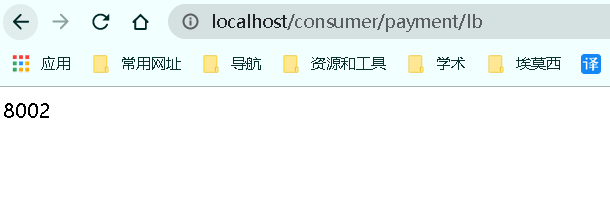

```java
****第几次访问，次数next:1
****第几次访问，次数next:2
****第几次访问，次数next:3
****第几次访问，次数next:4
****第几次访问，次数next:5
****第几次访问，次数next:6
****第几次访问，次数next:7
****第几次访问，次数next:8
****第几次访问，次数next:9
****第几次访问，次数next:10
```

# 第9章 OpenFeign服务调用

## 是什么

https://spring.io/projects/spring-cloud-openfeign

Feign是个声明式 Webservice客户端。使用 Feign能让编写 Web Service客户端更加简单。它的使用方法是**定义一个服务接口然后在上面添加注解**。 Feign也支持可拔插式的编码器和解码器。 Spring Cloud对 Feign进行了封装使其支持了 Spring MVC标准注解和 HttpMessageConverters。 Feign可以与 Eureka和 Ribbon组合使用以支持负载均衡

Feign能干什么

Feign旨在使编写 Java Http客户端变得更容易。

前面在使用 Ribbon+ RestTemplate时,利用 RestTemplate对http请求的封装处理,形成了一套模版化的调用方法。但是在实际开发中,由于对服务依赖的调用可能不止一处,往**往一个接口会被多处调用,所以通常都会针对毎个微服务自行封装一些客户端类来包装这些依赖服务的调用**。所以, Feign在此基础上做了进一步封装,由他来帮助我们定义和实现依赖服务接口的定乂。在 Feign的实现下**我们只需创建一个接口并使用注解的方式来配置它(前是Dao接口上面标注 Mapper注解现在是一个微服务接口上面标注一个eign注解即可)**,即可完成**对服务提供方的接口绑定**,简化了使用 Spring cloud Ribbon时,自动封装服务调用客户端的开发量。

Feign集成了 Ribbon

利用 Ribbon维护了 Payment的服务列表信息,并且通过轮询实现了客户端的负载均衡。而与 Ribbon 不同的是,**通过 feign只需要定义服务绑定接口目以声明式的方法**,优雅而简单的实现了服务调用

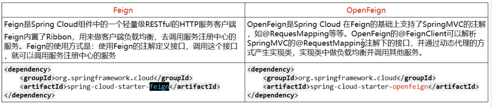


## OpenFeign使用步骤

接口+注解

微服务调用接口+@FeignClient

- 新建cloud-consumer-feign-order80

  Feign在消费端使用

- POM

  ```xml
  <?xml version="1.0" encoding="UTF-8"?>
  <project xmlns="http://maven.apache.org/POM/4.0.0"
           xmlns:xsi="http://www.w3.org/2001/XMLSchema-instance"
           xsi:schemaLocation="http://maven.apache.org/POM/4.0.0 http://maven.apache.org/xsd/maven-4.0.0.xsd">
      <parent>
          <artifactId>cloud2020</artifactId>
          <groupId>com.atguigu.springcloud</groupId>
          <version>1.0-SNAPSHOT</version>
      </parent>
      <modelVersion>4.0.0</modelVersion>
  
      <artifactId>cloud-consumer-feign-order80</artifactId>
      <dependencies>
          <!--openfeign-->
          <dependency>
              <groupId>org.springframework.cloud</groupId>
              <artifactId>spring-cloud-starter-openfeign</artifactId>
          </dependency>
          <!--eureka client-->
          <dependency>
              <groupId>org.springframework.cloud</groupId>
              <artifactId>spring-cloud-starter-netflix-eureka-client</artifactId>
              <version>2.2.5.RELEASE</version>
          </dependency>
          <dependency><!-- 引用自己定义的api通用包，可以使用Payment支付Entity -->
              <groupId>com.atguigu.springcloud</groupId>
              <artifactId>cloud-api-commons</artifactId>
              <version>${project.version}</version>
          </dependency>
          <!--web-->
          <dependency>
              <groupId>org.springframework.boot</groupId>
              <artifactId>spring-boot-starter-web</artifactId>
          </dependency>
          <dependency>
              <groupId>org.springframework.boot</groupId>
              <artifactId>spring-boot-starter-actuator</artifactId>
          </dependency>
          <!--一般基础通用配置-->
          <dependency>
              <groupId>org.springframework.boot</groupId>
              <artifactId>spring-boot-devtools</artifactId>
              <scope>runtime</scope>
              <optional>true</optional>
          </dependency>
          <dependency>
              <groupId>org.projectlombok</groupId>
              <artifactId>lombok</artifactId>
              <optional>true</optional>
          </dependency>
          <dependency>
              <groupId>org.springframework.boot</groupId>
              <artifactId>spring-boot-starter-test</artifactId>
              <scope>test</scope>
          </dependency>
      </dependencies>
  
  </project>
  ```

  

feign也自带了ribbon

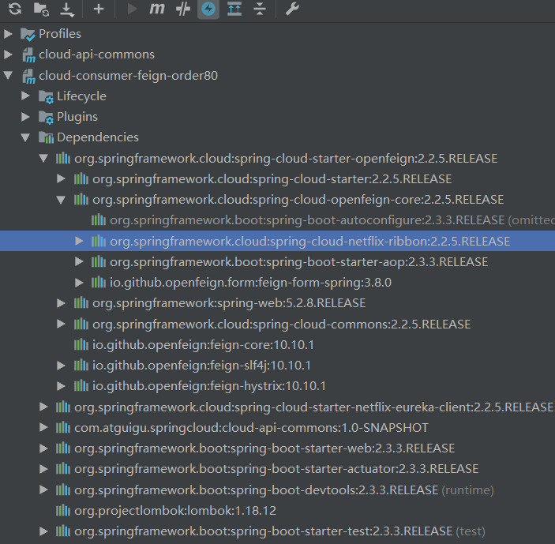

- 主启动类

  `@EnableFeignClients`

  ```java
  package com.atguigu.springcloud;
  
  import org.springframework.boot.SpringApplication;
  import org.springframework.boot.autoconfigure.SpringBootApplication;
  import org.springframework.cloud.openfeign.EnableFeignClients;
  
  @SpringBootApplication
  @EnableFeignClients
  public class OrderFeignMian80 {
      public static void main(String[] args) {
          SpringApplication.run(OrderFeignMian80.class,args);
      }
  }
  
  ```

- 业务类

  业务逻辑接口+**@FeignClient配置调用provider服务**

  **新建PaymentFeignService接口**并新增注解@FeignClient

  ```java
  package com.atguigu.springcloud.service;
  
  import com.atguigu.springcloud.entities.CommonResult;
  import com.atguigu.springcloud.entities.Payment;
  import org.springframework.cloud.openfeign.FeignClient;
  import org.springframework.stereotype.Component;
  import org.springframework.web.bind.annotation.GetMapping;
  import org.springframework.web.bind.annotation.PathVariable;
  
  @Component
  @FeignClient(value = "CLOUD-PAYMENT-SERVICE")
  public interface PaymentFeignService {
      @GetMapping(value="/payment/get/{id}")
      public CommonResult<Payment> getPaymentById(@PathVariable("id") Long id);
  }
  
  ```

  
  - 控制层Controller

    ```java
    package com.atguigu.springcloud.controller;
    
    import com.atguigu.springcloud.entities.CommonResult;
    import com.atguigu.springcloud.entities.Payment;
    import com.atguigu.springcloud.service.PaymentFeignService;
    import lombok.extern.slf4j.Slf4j;
    import org.springframework.web.bind.annotation.GetMapping;
    import org.springframework.web.bind.annotation.PathVariable;
    import org.springframework.web.bind.annotation.RestController;
    
    import javax.annotation.Resource;
    
    @RestController
    @Slf4j
    public class OrderFeignController {
        @Resource
        private PaymentFeignService paymentFeignService;
    
        @GetMapping(value = "/consumer/payment/get/{id}")
        public CommonResult<Payment> getPaymentById(@PathVariable("id") Long id){
            return paymentFeignService.getPaymentById(id);
        }
    }
    
    ```

- 测试
  - 先启动2个eureka集群7001/7002

  - 再启动2个微服务8001/8002

  - 启动OpenFeign启动

  - http://localhost/consumer/payment/get/31

    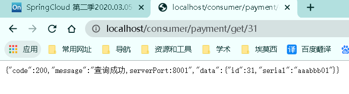

  - Feign自带负载均衡配置项，自带ribbon

小总结

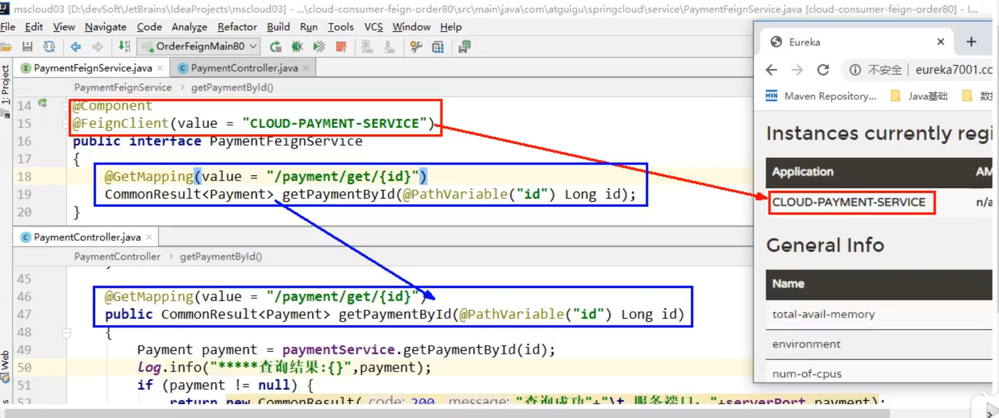

## OpenFeign超时控制

**超时设置**，故意设置超时演示出错情况

- 服务提供方8001故意写暂停程序

  ```java
  @GetMapping(value = "/payment/feign/timeout")
  public String paymentFeignTimeOut(){
      try {
          TimeUnit.SECONDS.sleep(3);
      } catch (InterruptedException e) {
          e.printStackTrace();
      }
      return serverPort;
  }
  ```

- 服务消费方80添加超时方法PaymentFeignService

  ```java
  @GetMapping(value = "/payment/feign/timeout")
  public String paymentFeignTimeOut();
  ```

  

- 服务消费方80添加超时方法OrderFeignController

  ```java
  @GetMapping(value = "/consumer/payment/feign/timeout")
  public String paymentFeignTimeOut(){
      //openfeign-ribbon 客户端一般默认等待1秒
      return paymentFeignService.paymentFeignTimeOut();
  }
  ```

- 测试

  http://localhost/consumer/payment/feign/timeout

OpenFeign默认等待一秒钟，超过后报错

YML文件里需要开启OpenFeign客户端超时控制

默认Fegn客户端只等待秒钟,但是服务喘处理需要超过1秒钟,导致 Feign客户端不想等待了,直接返回报错为了避免这样的情况,有时候我们需要设置 Feign客户端的超时控制。yam文件中开启配置

```yaml
#设置 feign客户端超的时间( openfelgn默认支持 ribbon)
ribbon:
  ReadTimeout: 5000 # 指的是建立连接后从服务器读取到可用资源所用的时间
  ConnectTimeout: 5000 # 指的是建立连接所用的时间,适用于间络状况正常的情况下两端连接所用的时间
```

## OpenFeign日志增强

Feign提供了日志打印功能,我们可以通过配置来调整日志级别,从而了解Feign中Http请求的细节说白了就是对 Feign接口的调用情况进行监控和输出

日志级别：

NONE:默认的,不显示任何日志;

BASIC:仅记录请求方法、URL、响应状态码及执行时间;

HEADERS:除了BASIC中定义的信息之外,还有请求和响应的头信息;

FULL:除了 HEADERS中定义的信息之外,还有请求和响应的正文及元数据

- 配置日志Bean

```java
package com.atguigu.springcloud.config;

import feign.Logger;
import org.springframework.context.annotation.Bean;

public class FeignConfig {
    @Bean
    Logger.Level feignLoggerLevel(){
        return Logger.Level.FULL;
    }
}

```

YML文件需要开启日志的Feign客户端

```yaml
logging:
  level:
    # feign日志以什么级别监控哪个接口
    com.atguigu.springcloud.service.PaymentFeignService: debug
```

后台日志查看

# 第10章 Hystrix断路器

## 概述

分布式系统面临的问题

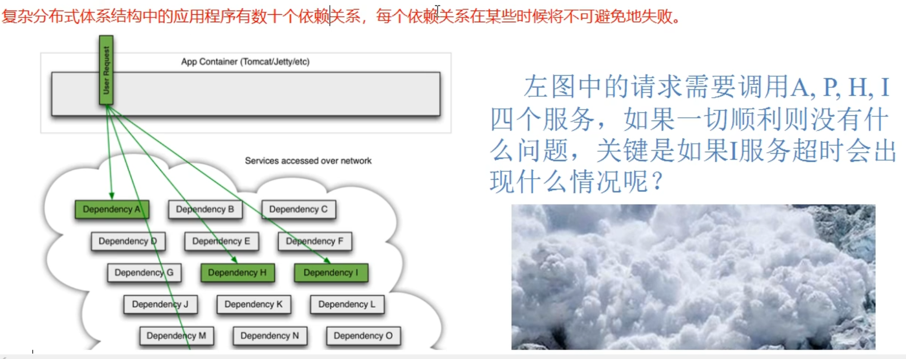

**服务雪崩**

多个微服务之间调用的时候,假设微服务A调用微服务B和微服务C,微服务B和微服务C又调用其它的微服务,这就是所谓的“**扇出**“。如果扇出的链路上某个微服务的调用响应时间过长或者不可用,对微服务A的调用就会占用越来越多的系统资源,进而引起系统崩溃,所谓的“雪崩效应”对于高流量的应用来说,单—的后端依赖可能会导致所有服务器上的所有资源都在几秒钟内饱和。比失败更糟糕的是,这些应用程序还可能导致服务之间的延迟增加,备份队列,线程和其他系统资源紧张,导致整个系统发生更多的级联故障。这些都表示需要对故障和延迟进行隔离和管理,以便单个依赖关系的失败,不能取消整个应用程序或系统。

所以，通常当你发现—个模块下的某个实例失败后,这时候这个模块依然还会接收流量,然后这个有问题的模块还调用了其他的模块,这样就会发生级联故障,或者叫雪崩

**是什么**

Hystrix是一个用于处理分布式系统的**延迟和容错**的开源库,在分布式系统里,许多依赖不可避免的会调用失败,比如超时、异常等,Hystrix能够保证在一个依赖出问题的情况下,**不会导致整体服务失败,避免级联故障,以提高分布式系统的弹性**。

断路器”本身是_种开关装置,当某个服务单元发生故障之后,通过断路器的故障监控(类似熔断保险丝),向调用方返回_个符合预期的、可处理的**备选晌应( Fallback)**,**而不是长时间的等待或者抛出调用方无法处理的异常**,这样就保证了服务调用方的线程不会被长时间、不必要地占用,从而避免了故障在分布式系统中的蔓延,乃至雪崩。

**能干嘛**

- 服务降级
- 服务熔断
- 接近实时的监控
- ......

**官网资料**

https://github.com/Netflix/Hystrix/wiki/How-To-Use

**Hystrix官宣，停更进维**

https://github.com/Netflix/Hystrix

被动修复bugs,不再接受合并请求,不再发布新版本

## Hystrix重要概念

### 服务降级fallback

对方系统不可用了，你需要给我一个兜底的解决方案

服务器忙，请稍候再试，不让客户端等待并立刻返回一个友好提示，fallback

**哪些情况会触发降级**

- 程序运行异常

- 超时
- 服务熔断触发服务降级
- 线程池/信号量打满也会导致服务降级

### 服务熔断break

类比保险丝达到最大服务访问后，直接**拒绝访问**，**拉闸限电**，然后调用服务降级的方法并返回友好提示

就是保险丝:服务的降级->进而熔断->恢复调用链路

### 服务限流flowlimit

秒杀高并发等操作，严禁一窝蜂的过来拥挤，大家排队，一秒钟N个，有序进行

## hystrix案例

### 构建

- 新建cloud-provider-hystrix-payment8001

- POM

  ```xml
  <dependencies>
      <!--hystrix-->
      <dependency>
          <groupId>org.springframework.cloud</groupId>
          <artifactId>spring-cloud-starter-netflix-hystrix</artifactId>
      </dependency>
      <!--eureka client-->
      <dependency>
          <groupId>org.springframework.cloud</groupId>
          <artifactId>spring-cloud-starter-netflix-eureka-client</artifactId>
          <version>2.2.5.RELEASE</version>
      </dependency>
      <dependency><!-- 引用自己定义的api通用包，可以使用Payment支付Entity -->
          <groupId>com.atguigu.springcloud</groupId>
          <artifactId>cloud-api-commons</artifactId>
          <version>${project.version}</version>
      </dependency>
      <!--web-->
      <dependency>
          <groupId>org.springframework.boot</groupId>
          <artifactId>spring-boot-starter-web</artifactId>
      </dependency>
      <dependency>
          <groupId>org.springframework.boot</groupId>
          <artifactId>spring-boot-starter-actuator</artifactId>
      </dependency>
      <!--一般基础通用配置-->
      <dependency>
          <groupId>org.springframework.boot</groupId>
          <artifactId>spring-boot-devtools</artifactId>
          <scope>runtime</scope>
          <optional>true</optional>
      </dependency>
      <dependency>
          <groupId>org.projectlombok</groupId>
          <artifactId>lombok</artifactId>
          <optional>true</optional>
      </dependency>
      <dependency>
          <groupId>org.springframework.boot</groupId>
          <artifactId>spring-boot-starter-test</artifactId>
          <scope>test</scope>
      </dependency>
  </dependencies>
  ```

- YML

  ```yaml
  server:
    port: 8001
  
  spring:
    application:
      name: cloud-provider-hystrix-payment
  
  
  eureka:
    client:
      register-with-eureka: true # 表示是否将自己注册进 EurekaServer 默认为true
      fetch-registry: true # 是否从EurekaServer抓取已有的注册信息，默认为true。单节点无所谓，集群必须设置为true才能配合ribbon使用负载均衡
      service-url:
        defaultZone: http://localhost:7001/eureka # 单机版
        #defaultZone: http://eureka7001.com:7001/eureka, http://eureka7002.com:7002/eureka
  ```

- 主启动

  ```java
  package com.atguigu.springcloud;
  
  import org.springframework.boot.SpringApplication;
  import org.springframework.boot.autoconfigure.SpringBootApplication;
  import org.springframework.cloud.netflix.eureka.EnableEurekaClient;
  
  @SpringBootApplication
  @EnableEurekaClient
  public class PaymentHystrixMain8001 {
      public static void main(String[] args) {
          SpringApplication.run(PaymentHystrixMain8001.class,args);
      }
  }
  
  ```

  

- 业务类

  service

  ```java
  package com.atguigu.springcloud.service;
  
  import org.springframework.stereotype.Service;
  
  import java.util.concurrent.TimeUnit;
  
  @Service
  public class PaymentService {
      public String PaymentInfoOK(Integer id){
          return "线程池"+Thread.currentThread().getName()+"PaymentInfoOK,id: "+id+"\t"+"O(∩_∩)O哈哈~";
      }
  
      public String PaymentInfoTimeout(Integer id){
          //模拟超时导致服务降级
          int timeNumber = 3;
          try {TimeUnit.SECONDS.sleep(timeNumber);} catch (InterruptedException e) {e.printStackTrace(); }
          return "线程池"+Thread.currentThread().getName()+"PaymentInfoTimeout,id: "+id+"\t"+"O(∩_∩)O哈哈~"+"耗时（秒）: "+timeNumber;
      }
  }
  
  ```

  controller

  ```java
  package com.atguigu.springcloud.controller;
  
  import com.atguigu.springcloud.service.PaymentService;
  import lombok.extern.slf4j.Slf4j;
  import org.springframework.beans.factory.annotation.Value;
  import org.springframework.web.bind.annotation.GetMapping;
  import org.springframework.web.bind.annotation.PathVariable;
  import org.springframework.web.bind.annotation.RestController;
  
  import javax.annotation.Resource;
  
  @RestController
  @Slf4j
  public class PaymentController {
      @Resource
      private PaymentService paymentService;
      @Value("${server.port}")
      private String serverPort;
      @GetMapping("/payment/hystrix/ok/{id}")
      public String PaymentInfoOK(@PathVariable("id") Integer id){
          String result = paymentService.PaymentInfoOK(id);
          log.info("***result:"+result);
          return result;
      }
      @GetMapping("/payment/hystrix/timeout/{id}")
      public String PaymentInfoTimeout(@PathVariable("id") Integer id){
          String result = paymentService.PaymentInfoTimeout(id);
          log.info("***result:"+result);
          return result;
      }
  }
  
  ```

  

- 正常测试
  - 启动eureka7001(为了启动快，eureka不做集群了)

  - 启动cloud-provider-hystrix-payment8001

  - 访问

    - 访问http://localhost:8001/payment/hystrix/ok/31
    - 每次调用耗费5秒钟http://localhost:8001/payment/hystrix/timeout/31

  - 上述module均OK

    以上述为根基平台，从正确->错误->降级熔断->恢复

### 高并发测试

上述在非高并发情形下，还能勉强满足 but.....

- Jmeter压测测试

  - 开启Jmeter，来20000个并发压死8001，20000个请求都去访问paymentInfo_TimeOut服务

  - 再来一个访问

    http://localhost:8001/payment/hystrix/ok/31

    http://localhost:8001/payment/hystrix/timeout/31

- 看演示结果

  - 两个都在自己转圈圈

  - 为什么会被卡死

    tomcat的默认工作线程数被打满了，没有多余的线程来分解压力和处理

- Jmeter压测结论

  上面还是服务提供者8001自己测试，假如此时外部的消费者80也来访问，那消费者只能干等，最终导致消费端80不满意，服务端8001直接被拖死

#### 看热闹不嫌弃事大，80新建加入

cloud-consumer-feign-hystrix-order80

- POM

  ```xml
  <dependencies>
      <!--openfeign-->
      <dependency>
          <groupId>org.springframework.cloud</groupId>
          <artifactId>spring-cloud-starter-openfeign</artifactId>
      </dependency>
      <!--hystrix-->
      <dependency>
          <groupId>org.springframework.cloud</groupId>
          <artifactId>spring-cloud-starter-netflix-hystrix</artifactId>
      </dependency>
      <!--eureka client-->
      <dependency>
          <groupId>org.springframework.cloud</groupId>
          <artifactId>spring-cloud-starter-netflix-eureka-client</artifactId>
          <version>2.2.5.RELEASE</version>
      </dependency>
      <dependency><!-- 引用自己定义的api通用包，可以使用Payment支付Entity -->
          <groupId>com.atguigu.springcloud</groupId>
          <artifactId>cloud-api-commons</artifactId>
          <version>${project.version}</version>
      </dependency>
      <!--web-->
      <dependency>
          <groupId>org.springframework.boot</groupId>
          <artifactId>spring-boot-starter-web</artifactId>
      </dependency>
      <dependency>
          <groupId>org.springframework.boot</groupId>
          <artifactId>spring-boot-starter-actuator</artifactId>
      </dependency>
      <!--一般基础通用配置-->
      <dependency>
          <groupId>org.springframework.boot</groupId>
          <artifactId>spring-boot-devtools</artifactId>
          <scope>runtime</scope>
          <optional>true</optional>
      </dependency>
      <dependency>
          <groupId>org.projectlombok</groupId>
          <artifactId>lombok</artifactId>
          <optional>true</optional>
      </dependency>
      <dependency>
          <groupId>org.springframework.boot</groupId>
          <artifactId>spring-boot-starter-test</artifactId>
          <scope>test</scope>
      </dependency>
  </dependencies>
  ```

- YAM

  ```yaml
  server:
    port: 80
  
  eureka:
    client:
      register-with-eureka: false # 表示是否将自己注册进 EurekaServer 默认为true
      service-url:
        defaultZone: http://eureka7001.com:7001/eureka
  ```

  

- 主启动

  ```java
  package com.atguigu.springcloud;
  
  import org.springframework.boot.SpringApplication;
  import org.springframework.boot.autoconfigure.SpringBootApplication;
  import org.springframework.cloud.openfeign.EnableFeignClients;
  
  @SpringBootApplication
  @EnableFeignClients
  public class OrderHystrixMain80 {
      public static void main(String[] args) {
          SpringApplication.run(OrderHystrixMain80.class,args);
      }
  }
  
  ```

  

- 业务类

  PaymentHystrixService

  ```java
  package com.atguigu.springcloud.service;
  
  import org.springframework.cloud.openfeign.FeignClient;
  import org.springframework.stereotype.Component;
  import org.springframework.web.bind.annotation.GetMapping;
  import org.springframework.web.bind.annotation.PathVariable;
  
  @Component
  @FeignClient(value = "CLOUD-PROVIDER-HYSTRIX-PAYMENT")
  public interface PaymentHystrixService {
      @GetMapping("/payment/hystrix/ok/{id}")
      public String PaymentInfoOK(@PathVariable("id") Integer id);
  
      @GetMapping("/payment/hystrix/timeout/{id}")
      public String PaymentInfoTimeout(@PathVariable("id") Integer id);
  }
  
  ```

  OrderHystrixController

  ```java
  package com.atguigu.springcloud.controller;
  
  import com.atguigu.springcloud.service.PaymentHystrixService;
  import lombok.extern.slf4j.Slf4j;
  import org.springframework.web.bind.annotation.GetMapping;
  import org.springframework.web.bind.annotation.PathVariable;
  import org.springframework.web.bind.annotation.RestController;
  
  import javax.annotation.Resource;
  
  @RestController
  @Slf4j
  public class OrderHystrixController {
      @Resource
      private PaymentHystrixService paymentHystrixService;
  
      @GetMapping("/consumer/payment/hystrix/ok/{id}")
      public String PaymentInfoOK(@PathVariable("id") Integer id){
          String result = paymentHystrixService.PaymentInfoOK(id);
          return result;
      }
  
      @GetMapping("/consumer/payment/hystrix/timeout/{id}")
      public String PaymentInfoTimeout(@PathVariable("id") Integer id){
          String result = paymentHystrixService.PaymentInfoTimeout(id);
          return result;
      }
  }
  
  ```

- 正常测试

  http://localhost/consumer/payment/hystrix/ok/31

- 高并发测试

  2W个线程压8001

  消费端80微服务再去访问正常的OK微服务8001地址

  http://localhost/consumer/payment/hystrix/timeout/31

  消费者80，呜呜呜,要么转圈圈等待,要么消费端报超时错误

**故障现象和导致原因**

8001同一层次的其他接口服务被困死，因为tomcat线程里面的工作线程已经被挤占完毕

80此时调用8001，客户端访问响应缓慢，转圈圈

**上诉结论**

正因为有上述故障或不佳表现，才有我们的降级/容错/限流等技术诞生

**如何解决？解决的要求**

- 超时导致服务器变慢（转圈）:超时不再等待

- 出错（宕机或程序运行出错）:  出错要有兜底

- 解决
  - 对方服务（8001）超时了，调用者（80）不能一直卡死等待，必须有服务降级
  - 对方服务（8001）down机了，调用者（80）不能一直卡死等待，必须有服务降级
  - 对方服务（8001）OK，调用者（80）自己出故障或有自我要求（自己的等待时间小于服务提供者），自己处理降级

### 服务降级

- 降低配置:`@HystrixCommand`

- 8001先从自身找问题

  设置自身调用超时时间的峰值，峰值内可以正常运行，超过了需要有兜底的方法处理，作服务降级fallback

- **8001fallback**

  - 业务类启用

    - `@HystrixCommand`报异常后如何处理

      一旦调用服务方法失败并抛出了错误信息后，会自动调用@HystrixCommand标注好的fallbackMethod调用类中的指定方法

      ```java
      package com.atguigu.springcloud.service;
      
      import com.netflix.hystrix.contrib.javanica.annotation.HystrixCommand;
      import com.netflix.hystrix.contrib.javanica.annotation.HystrixProperty;
      import org.springframework.stereotype.Service;
      
      import java.util.concurrent.TimeUnit;
      
      @Service
      public class PaymentService {
          public String PaymentInfoOK(Integer id){
              return "线程池"+Thread.currentThread().getName()+"PaymentInfoOK,id: "+id+"\t"+"O(∩_∩)O哈哈~";
          }
      
          @HystrixCommand(fallbackMethod = "paymentInfoTimeoutHandler",commandProperties = {
              @HystrixProperty(name="execution.isolation.thread.timeoutInMilliseconds",value="3000")
          })//出了问题找这个方法兜底,超时时间3秒钟，超过3秒就是出错，要兜底方法
          public String PaymentInfoTimeout(Integer id){
              //模拟超时
              int timeNumber = 5;//5秒超过了3秒
              //int age = 10/0;
              try {TimeUnit.SECONDS.sleep(timeNumber);} catch (InterruptedException e) {e.printStackTrace(); }
              return "线程池"+Thread.currentThread().getName()+"PaymentInfoTimeout,id: "+id+"\t"+"O(∩_∩)O哈哈~"+"耗时（秒）: "+timeNumber;
          }
      
          public String paymentInfoTimeoutHandler(Integer id){
              return "线程池"+Thread.currentThread().getName()+"系统繁忙或者运行报错，请稍后再试,id: "+id+"\t"+"⊙﹏⊙∥";
          }
      }
      
      ```

      

  - 主启动类激活

    添加新注解`@EnableCircuitBreaker`

    ```java
    @SpringBootApplication
    @EnableEurekaClient
    @EnableCircuitBreaker
    public class PaymentHystrixMain8001 {
        public static void main(String[] args) {
            SpringApplication.run(PaymentHystrixMain8001.class,args);
        }
    }
    ```

    

  - 测试

    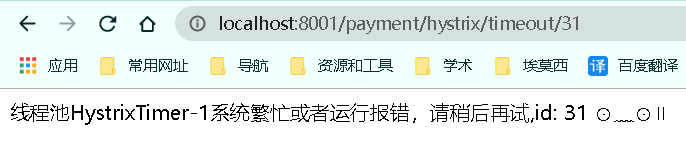

    

- 80fallback 在客户端进行服务降级

  80订单微服务，也可以更好的保护自己，自己也依样画葫芦进行客户端降级保护

  我们自己配置过的热部署方式对java代码的改动明显，但**对@HystrixCommand内属性的修改建议重启微服务**

  - YML

    加上

    ```yaml
    # 用于服务降级，在注解@FeignClient中添加fallbackFactory属性值
    feign:
      hystrix:
        enabled: true # 在Feign中开启Hystrix
    ```

  - 主启动   @EnableHystrix

  - 业务类

    controller加上这两个方法

    ```java
    @GetMapping("/consumer/payment/hystrix/timeout/{id}")
    @HystrixCommand(fallbackMethod = "paymentInfoTimeoutFallbackMethod",commandProperties = {
        @HystrixProperty(name="execution.isolation.thread.timeoutInMilliseconds",value="1500")
    })//出了问题找这个方法兜底,超时时间3秒钟，超过3秒就是出错，要兜底方法
    public String PaymentInfoTimeout(@PathVariable("id") Integer id){
        String result = paymentHystrixService.PaymentInfoTimeout(id);
        return result;
    }
    
    public String paymentInfoTimeoutFallbackMethod(@PathVariable("id") Integer id){
        return "我是消费者80，对方支付系统繁忙请10秒后再试或者自己运行出错请检查自己(;´༎ຶД༎ຶ`)";
    }
    ```

- 目前问题

  - 每个业务方法对应一个兜底的方法，代码膨胀
  - 统一和自定义的分开

解决问题

**每个方法配置一个？？？膨胀**

@DefaultProperties(defaultFallback = "全局fallback方法名")

1:1每个方法配置一个服务降级方法,技术上可以,实际上傻X

1:N除了个别重要核心业务有专属,其它普通的可以通过@ Default Properties(default Fallback="")统跳转到统处理结果页面

通用的和独享的各自分开,避兔了代码膨胀,合理减少了代码量,O(∩_∩)O哈哈~

controller配置

```java
//下面是全局fallback方法
public String paymentGlobalFallbackMethod(){
    return "Global异常处理信息，请稍后再试，＞﹏＜";
}

//类上加注解：
@DefaultProperties(defaultFallback = "paymentGlobalFallbackMethod")

//某个方法上加注解，表示使用全局的fallback方法
@HystrixCommand
```

**和业务逻辑混一起？？？混乱**

**服务降级，客户端去调用服务端，碰上服务端宕机或关闭**

本次案例服务降级处理是在客户端80实现完成的，与服务端8001没有关系，只需要为**Feign客户端定义的接口**添加一个服务降级处理的实现类即可实现解耦

未来我们要面对的异常  **运行  超时  宕机**

再看我们的业务类PaymentController

修改cloud-consumer-feign-hystrix-order80

根据cloud-consumer-feign-hystrix-order80已经有的PaymentHystrixService接口，重新新建一个类（PaymentFallbackService）实现该接口，统一为接口里面的方法进行异常处理

- PaymentFallbackService类实现PaymentFeignClientService接口

  ```java
  package com.atguigu.springcloud.service;
  
  public class PaymentFallbackService implements PaymentHystrixService {
      @Override
      public String PaymentInfoOK(Integer id) {
          return "----PaymentHystrixService fallback PaymentInfoOK (⊙o⊙)？";
      }
  
      @Override
      public String PaymentInfoTimeout(Integer id) {
          return "----PaymentHystrixService fallback PaymentInfoTimeout (⊙o⊙)？";
      }
  }
  
  ```

  

- YML

- PaymentFeignClientService接口

  接口上添加注解

  ```java
  @FeignClient(value = "CLOUD-PROVIDER-HYSTRIX-PAYMENT",fallback = PaymentFallbackService.class)
  ```

  

- 测试

  - 单个eureka先启动7001

  - PaymentHystrixMain8001启动

  - 正常访问测试  http://localhost/consumer/payment/hystrix/ok/31

  - 故意关闭微服务8001

  - 客户端自己调用提升  

    此时服务端provider已经down了，但是我们做了服务降级处理，让客户端在服务端不可用时也会获得提示信息而不会挂起耗死服务器

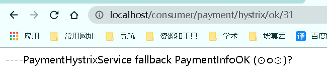

### 服务熔断

就像是断路器    一句话就是家里保险丝

服务降级----进而熔断----恢复调用链路

熔断是什么  大神论文  https://martinfowler.com/bliki/CircuitBreaker.html

熔断机制概述

熔断机制是应对雪崩效应的种微服务链路保护机制。当扇岀链路的某个微服务出错不可用或者晌应时间太长时会进行服务的降级,进而熔断该节点微服务的调用,快速返回错误的响应信息。

当检测到该节点微服务调用响应正常后,**恢复调用链路**。

在 Spring Cloud框架里,熔断机制通过 Hystrix实现。 Hystriⅸ会监控微服务间调用的状况,当失败的调用到定阈值,缺省是5秒内20次调用失败,就会启动熔断机制。

熔断机制的注解是`@HystrixCommand`

#### 实操

- 修改cloud-provider-hystrix-payment8001

- PaymentService

  ```java
  //服务熔断
  @HystrixCommand(fallbackMethod = "paymentCircuitBreakerFallback",commandProperties = {
      @HystrixProperty(name="circuitBreaker.enabled",value = "true"),//是否开启断路器
      @HystrixProperty(name="circuitBreaker.requestVolumeThreshold",value = "10"),//请求次数
      @HystrixProperty(name="circuitBreaker.sleepWindowInMilliseconds",value = "10000"),//时间窗口期
      @HystrixProperty(name="circuitBreaker.errorThresholdPercentage",value = "60")//失败率达到多少后跳闸
  })
  public String paymentCircuitBreaker(@PathVariable("id") Integer id){
      if (id<0){
          throw new RuntimeException("****id 不能负数");
      }
      String serialNumber = IdUtil.simpleUUID();
      return Thread.currentThread().getName()+"\t"+"调用成功，流水号："+serialNumber;
  }
  public String paymentCircuitBreakerFallback(@PathVariable("id") Integer id){
      return "id不能为负数，请稍后再试，≡(▔﹏▔)≡  id:"+id;
  }
  ```

  

- PaymentController

  ```java
  //服务熔断
  @GetMapping("/payment/circuit/{id}")
  public String paymentCircuitBreaker(@PathVariable("id") Integer id){
      String result = paymentService.paymentCircuitBreaker(id);
      log.info("***result:"+result);
      return result;
  }
  ```

- 测试

  自测cloud-provider-hystrix-payment8001

  ​	

  正确    http://localhost:8001/payment/circuit/31

  hystrix-PaymentService-1 调用成功，流水号：65ea60659d564b2e8c6d7bd1f12c5be6

  错误  http://localhost:8001/payment/circuit/-31

  id不能为负数，请稍后再试，≡(▔﹏▔)≡ id:-31

  一次正确一次错误trytry

  重点测试    多次错误,然后慢慢正确，发现刚开始不满足条件，就算是正确的访问地址也不能进行访问，需要慢慢的恢复链路

  狂刷新错误的请求连接，再点正确的连接：

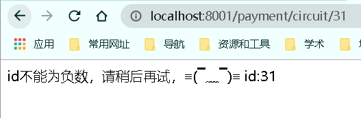

隔一会后

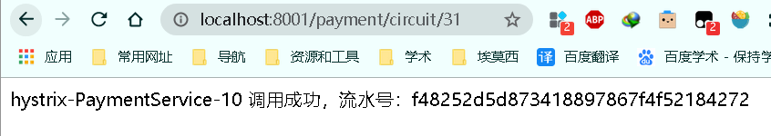

#### 原理（小总结）

大神结论


熔断类型

- 熔断打开

  请求不再进行调用当前服务，内部设置时钟一般为MTTR(平均故障处理时间)，当打开时长达到所设时钟则进入熔断状态

- 熔断关闭

  熔断关闭不会对服务进行熔断

- 熔断半开

  部分请求根据规则调用当前服务，如果请求成功且符合规则则认为当前服务恢复正常，关闭熔断

**官网断路器流程图**

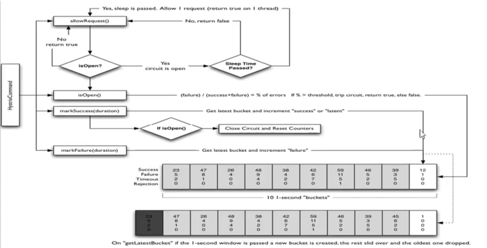


断路器在什么情况下开始起作用

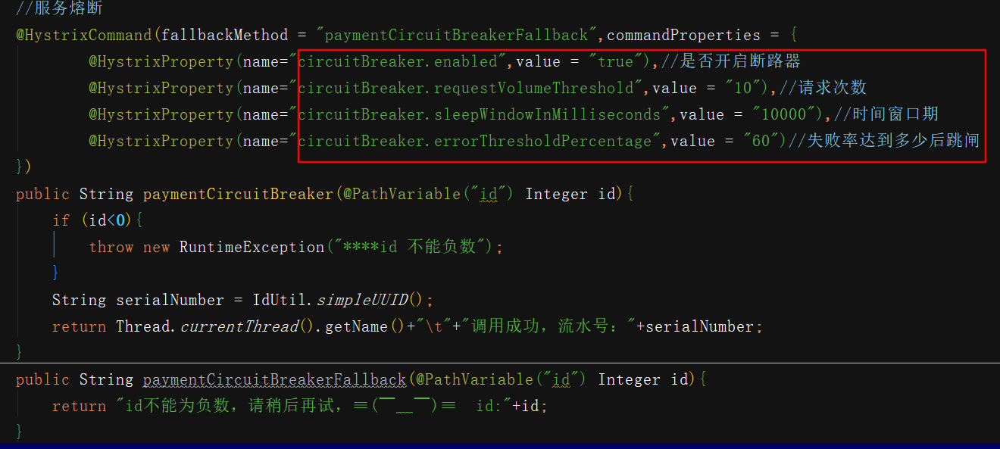

涉及到断路器的三个重要参数:**快照时间窗、请求总数阀值、错误百分比阀值**

1:快照时间窗:断路器确定是否打开需要统计些请求和错误数据,而统计的时间范围就是快照时间窗,默认为最近的10秒。

2:请求总数阀值:在快照时间窗内,必须满足请求总数阀值才有资格熔断。默认为20,意味着在10秒内,如果该 hystrix命令的调用次数不足20次,即使所有的请求都超时或其他原因失败,断路器都不会打开。

3:错误百分比阀值:当请求总数在快照时间窗内超过了阀值,比如发生了30次调用,如果在这30次调用中,有15次发生了超时异常,也就是超过50%的错误百分比,在默认设定50%阀值情况下,这时候就会将断路器打开。

断路器开启或者关闭的条件

- 当满足一定阀值的时候（默认10秒内超过20个请求次数）
- 当失败率达到一定的时候（默认10秒内超过50%请求失败）
- 到达以上阀值，断路器将会开启
- 当开启的时候，所有请求都不会进行转发
- 一段时间之后（默认是5秒），这个时候断路器是半开状态，会让其中一个请求进行转发。如果成功，断路器会关闭，若失败，继续开启。重复4和5

**断路器打开之后**

1:再有请求调用的时候,将不会调用主逻辑,而县直接调用降级 fallback通过断路器,实现了自动地发现错误并将降级逻辑切换为主逻辑,减少响应延迟的效果。

2:原来的主逻辑要如何恢复呢?

对于这一问题, hystrix也为我们实现了自动恢复功能。

当断路器打开,对主逻辑进行熔断之后, hysterⅸ会启动一个休眠时间窗,在这个时间窗内,降级逻辑是临时的成为主逻辑,

当休眠时间窗到期,断路器将进入半开状态,释放一次请求到原来的主逻辑上,如果此次请求正常返回,那么断路器将继续闭合,

主逻辑恢复,如果这次请求依然有问题,断路器继续进λ打开状态,休眠时间窗重新计时。

**All配置**

....

### 服务限流

后面高级篇讲解alibaba的Sentinel说明

## hystrix工作流程

文档https://github.com/Netflix/Hystrix/wiki/How-it-Works

官网图例


步骤说明

## 服务监控hystrixDashboard

### 概述

除了隔离依赖服务的调用以外, Hystrⅸ还提供了**准实时的调用监控**( Hystrix Dashboard), Hystriⅸ会持绩地记录所有通过 Hystrⅸ发起的请求的执行信息,并以统计报表和图形的形式展示给用户,包括每秒执行多少请求多少成功,多少失败等。 Netflⅸ通过hystrix-metrics- event- stream项目实现了对以指标的监控。 Spring Cloud也提供了 Hystrix Dashboard的整合,对监控内容转化成可视化界面。

### 仪表盘9001

- 新建cloud-consumer-hystrix-dashboard9001

- POM

  ```xml
  <dependencies>
      <dependency>
          <groupId>org.springframework.cloud</groupId>
          <artifactId>spring-cloud-starter-netflix-hystrix-dashboard</artifactId>
      </dependency>
      <!--web-->
      <dependency>
          <groupId>org.springframework.boot</groupId>
          <artifactId>spring-boot-starter-web</artifactId>
      </dependency>
      <dependency>
          <groupId>org.springframework.boot</groupId>
          <artifactId>spring-boot-starter-actuator</artifactId>
      </dependency>
      <!--一般基础通用配置-->
      <dependency>
          <groupId>org.springframework.boot</groupId>
          <artifactId>spring-boot-devtools</artifactId>
          <scope>runtime</scope>
          <optional>true</optional>
      </dependency>
      <dependency>
          <groupId>org.projectlombok</groupId>
          <artifactId>lombok</artifactId>
          <optional>true</optional>
      </dependency>
      <dependency>
          <groupId>org.springframework.boot</groupId>
          <artifactId>spring-boot-starter-test</artifactId>
          <scope>test</scope>
      </dependency>
  </dependencies>
  ```

  

- YAM

  ```yaml
  server:
    port: 9001
  ```

  

- HystrixDashboardMain9001+新注解@EnableHystrixDashboard

  ```java
  package com.atguigu.springcloud;
  
  import org.springframework.boot.SpringApplication;
  import org.springframework.boot.autoconfigure.SpringBootApplication;
  import org.springframework.cloud.netflix.hystrix.dashboard.EnableHystrixDashboard;
  
  @SpringBootApplication
  @EnableHystrixDashboard
  public class HystrixDashboardMain9001 {
      public static void main(String[] args) {
          SpringApplication.run(HystrixDashboardMain9001.class,args);
      }
  }
  
  ```

  

- 所有Provider微服务提供类（8001/8002/8003）都需要监控依赖配置(前面都已经加上了，原来如此啊)

  ```xml
  <dependency>
      <groupId>org.springframework.boot</groupId>
      <artifactId>spring-boot-starter-actuator</artifactId>
  </dependency>
  ```

  

- 启动cloud-consumer-hystrix-dashboard9001该微服务后续将监控微服务8001

  http://localhost:9001/hystrix

  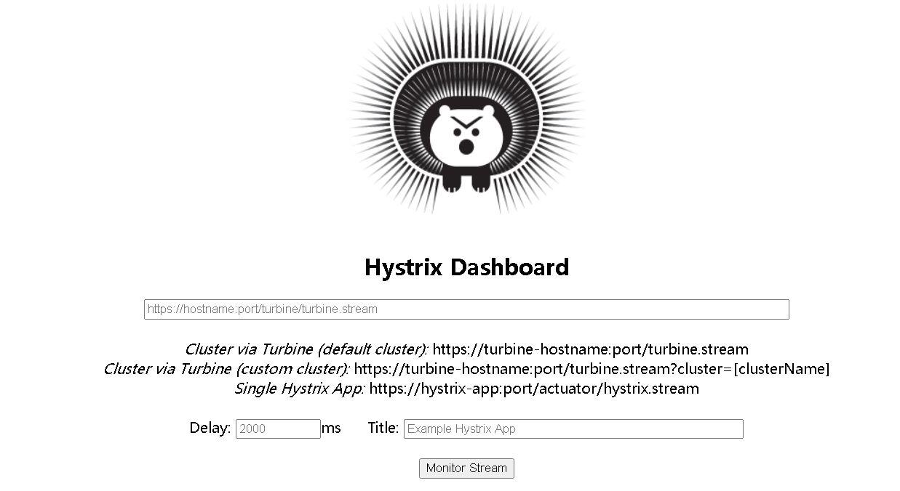

### 断路器演示

- 修改cloud-provider-hystrix-payment8001

  - 注意：新版本Hystrix需要在主启动类MainAppHystrix8001中指定监控路径

  - Unable to connect to Command Metric Stream

  - 404

    ```java
    package com.atguigu.springcloud;
    
    import com.netflix.hystrix.contrib.metrics.eventstream.HystrixMetricsStreamServlet;
    import org.springframework.boot.SpringApplication;
    import org.springframework.boot.autoconfigure.SpringBootApplication;
    import org.springframework.boot.web.servlet.ServletRegistrationBean;
    import org.springframework.cloud.netflix.hystrix.dashboard.EnableHystrixDashboard;
    import org.springframework.context.annotation.Bean;
    
    @SpringBootApplication
    @EnableHystrixDashboard
    public class HystrixDashboardMain9001 {
        public static void main(String[] args) {
            SpringApplication.run(HystrixDashboardMain9001.class,args);
        }
    
        /**
         * 此配置是为了监控而配置,与服务容错本身无关,springcloud升级后的坑
         * ServletRegistrationBean 因为springboot的默认路径不是"/hystrix.stream"，
         * 要在自已的项目里配置上下面的 servlet就可以了
         */
        @Bean
        public ServletRegistrationBean getServlet(){
            HystrixMetricsStreamServlet streamServlet = new HystrixMetricsStreamServlet();
            ServletRegistrationBean registrationBean = new ServletRegistrationBean(streamServlet);
            registrationBean.setLoadOnStartup(1);
            registrationBean.addUrlMappings("/hystrix.stream");
            registrationBean.setName("HystrixMetricsStreamServlet");
            return registrationBean;
        }
    }
    
    ```

    

**监控测试**

- 启动1个eureka或者3个eureka集群均可

- 观察监控窗口

  - 9001监控8001

    - 填写监控地址
    - http://localhost:8001/hystrix.stream

  - 测试地址

    - http://localhost:8001/payment/circuit/31
    - http://localhost:8001/payment/circuit/-31
    - 上述测试通过 ok
    - 先访问正确地址，再访问错误地址，再正确地址，会发现图示断路器都是慢慢放开的
      - 监控结果，成功
      - 监控结果，失败

    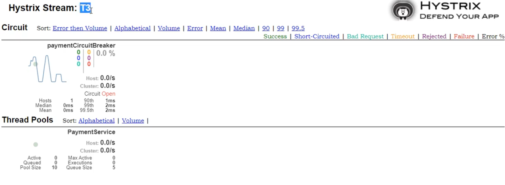

  - 如何看

    - 7色

    - 1圈

      实心圆:共有两种含义。它通过颜色的变化代表了实例的健康程度,它的健康度从绿色<黄色<橙色<红色递减

      该实心圆除了颜色的变化之外,它的大小也会根据实例的请求流量发生变化,流量越大该实心圆就越大。所以通过该实心圆的展示,就可以在大量的实例中快速的发现**故障实例和高压力实例**。

    - 1线

      曲线:用来记录2分钟内流量的相对变化,可以通过它来观察到流量的上升和下降趋势。

    - 整图说明

      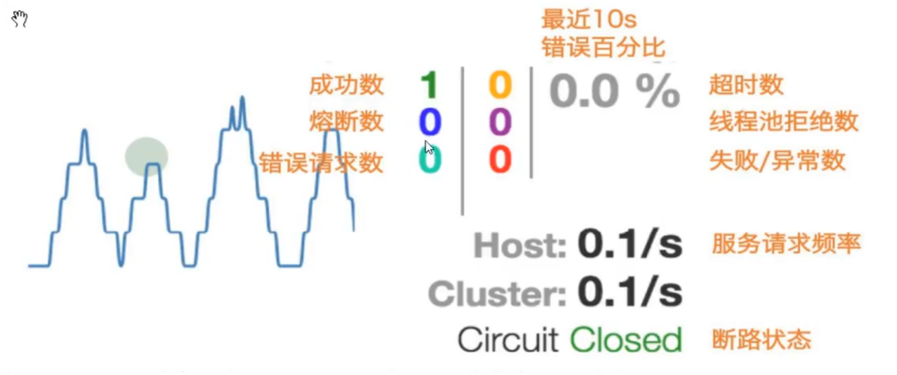

      

    - 整图说明2

      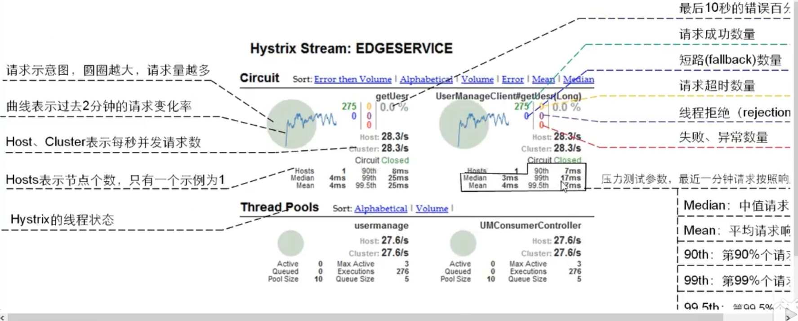

- 搞懂一个才能看懂复杂的


# 第11章 Gateway新一代网关

Zuul课程说明 不讲  zuul没人维护了，zuul2还在研发中

## 概述简介

### 官网

上一代zuul 1.X   https://github.com/Netflix/zuul/wiki

当前gateway   https://cloud.spring.io/spring-cloud-static/spring-cloud-gateway/2.2.1.RELEASE/reference/html/

### 是什么

**SpringCloud Gateway使用的 Webflux中的 reactor-netty响应式编程组件,底层使用了Netty通讯框架**

Cloud全家桶中有个很重要的组件就是网关,在1.x版本中都是采用的Zuul网关但在2.x版本中,zuul的升级一直跳票, SpringCloud最后自己硏发了一个网关替代zuul

**那就是 SpringCloud Gateway一句话: gateway是原zuul 1.X版的替代**

Gateway是在 Spring生态系统之上构建的AP网关服务,基于 Spring5, Spring Boot2和 Project Reactor等技术。

Gateway旨在提供一种简单而有效的方式来对AP进行路由,以及提供—些强大的过滤器功能,例如:熔断、限流、重试等

Spring Cloud Gateway是 Spring Cloud的个全新项目,基于 Spring5.0+ Spring Boot20和 Project Reactor等技术开发的网关,它旨在为微服务架构提供一种简单有效的統-的API路由管理方式。

Spring Cloud Gateway作为 Spring Cloud生态系统中的网关,目标是替代zuul,在 Spring Cloud2.0以上版本中,没有对新版本的zuul2以上最新高性能版本进行集成,仍然还是使用的zuul1非 Reactor模式的老版本。而为了提升网关的性能, Springcloud Gateway是基于 Webflux框架实现的,而 Webflux框架底层则使用了高性能的 Reactor模式通信框架**Netty**

Spring Cloud Gateway的目标提供统-的路由方式且基于 Filter链的方式提供了网关基本的功能,例如:安全,监控/指标,和限流

源码架构

### 能干嘛

- 反向代理
- 鉴权
- 流量控制
- 熔断
- 日志监控等

### 微服务架构中网关在哪里

挡在所有微服务的前面

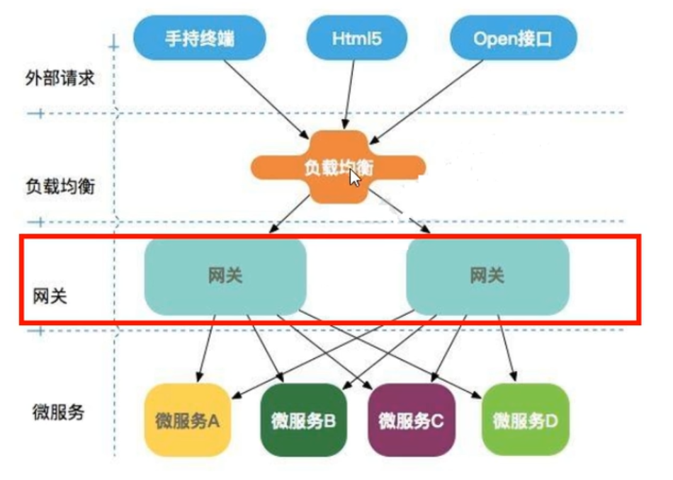

### 有了Zuul了怎么又出来了gateway

#### 我们为什么选择Gatway?

**1.neflix不太靠谱，zuul2.0一直跳票,迟迟不发布**

一方面因为zuul1.0已经进入了维护阶段,而且 Gateway是 Spring Cloud团队研发的,是亲儿子产品,值得信赖。

而且很多功能zuul都没有用起来也非常的简单便捷。Gateway是基于**异步非阻塞模型**上进行开发的,性能方面不需要担心。虽然 Netflix早就发布了最新的zuu2x但 Spring Cloud貌似没有整合计划。而且 Netflix相关组件都宣布进入维护期;不知前景如何?

多方面综合考虑 Gateway是很理想的网关选择。

**2.SpringCloud Gateway具有如下特性**

**基于 Spring Framework5, Project Reactor和 Spring Boot2.0进行构建**;

动态路由:能够匹配任何请求属性;

可以对路由指定 Predicate(断言)和 Filter(过滤器);

集成 Hystrix的断路器功能;

集成 Spring Cloud服务发现功能;

易于编写的 Predicate(断言)和 Filter(过滤器

请求限流功能

支持路径重写。

**3.SpringCloud Gateway与Zuul的区别**

​	在 Springcloud Finchley正式版之前, Spring Cloud推荐的网关是Netflix提供的zuul

1.zuul1.x,是一个基于阻塞O的 API Gateway

2、zuul1x**基于 Servlet2.5使用阻塞架构**它不攴持任何长连接(如 Websocket)zu的设计模式和 Nginx较像,每次∥O操作都是从工作线程中选择一个执行,请求线程被阻塞到工作线程完成,但是差別是 Nginx用C++实现,zu用Java实现,而JM本身会有第次加载较慢的情况,使得zuul的性能相对较差。

3.zul2x理念更先进,想基于Netl阻塞和支持长连接,但 Spring Cloud目前还没有整合。zul2x的性能较zuu|1.x有较大提升在性能方面,根据官方提供的基准测试, Spring Cloud Gateway的RPS(每秒请求数)是Zu的1.6倍。

4.Spring Cloud Gateway建立在 Spring Framework5、 Project Reactor和 Spring Boot2之上,使用**非阻塞APl**

5、 Spring Cloud Gateway还支持 Websocket,并且与 Spring紧密集成拥有更好的开发体验

#### Zuul1.x模型

Springcloud中所集成的zuu版本,采用的是 Tomcat容器,使用的是传统的 Servlet IO处理模型

学过尚硅谷web中期课程都知道—个题目, **Servlet的生命周期**? servlet由 servlet container进行生命周期管理。

container启动时构造 serve对象并调用 servlet init0进行初始化;

container运行时接受请求,并为每个请求分配—个线程(一般从线程池中获取空闲线程)然后调用 service.

container关闭时调用 servlet destory0销毁 servlet

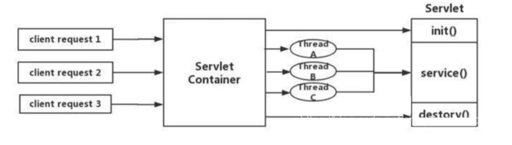

上述模式的缺点

servlet是一个简单的网络IO模型,当请求进入 servlet container时, servlet container就会为其绑定一个线程,在**并发不高**的场景下这种模型是适用的。但是一旦高并发(比如抽风用 emeter压),线程数量就会上涨,而线程资源代价是昂贵的(上线文切换,内存消耗大)严重影响请求的处理时间在一些简单业务场景下,不希望为每 request分配一个线程,只需要1个或几个线程就能应对极大并发的请求,这种业务场景下 servlet模型没有优势

所以zuul1.X是基于 servlet.之上的一个**阻塞式处理模型**,即 spring实现了处理所有 request请求的一个 servlet( Dispatcher Servlet)并由该 servlet阻塞式处理处理。所以 Springcloud Zuu无法摆脱 servlet模型的弊端

#### GateWay模型

WebFlux是什么？

说明

传统的Web框架,此如说: struts2, springmvc等都是基于 Servlet Apl与 Servlet容器基础之上运行的

**但是在 Servlet3.1之后有了异步非阻塞的支持**。而 Webflux是一个典型非阻塞异步的框架,它的核心是基于 Reactor的相关AP实现的。相对于传统的web框架来说,它可以运行在诸如№etty, Undertow及支持 Servlet3.1的容器上。非阻塞式+函数式编程( Spring5必须让你使用Java8)

Spring Webflux是 Spring5.0引入的新的响应式框架,区别于 Spring Mvc,它不需要依赖 Servlet Ap,它是完全异步非阻塞的,并且基于 Reactor来实现响应式流规范。

## 三大核心概念

### Route(路由)

路由是构建网关的基本模块，它由ID，目标URI，一系列的断言和过滤器组成，如果断言为true则匹配该路由

### Predicate（断言）

参考的是java8的java.util.function.Predicate开发人员可以匹配HTTP请求中的所有内容（例如请求头或请求参数），**如果请求与断言相匹配则进行路由**

### Filter(过滤)

指的是Spring框架中GatewayFilter的实例，使用过滤器，可以在请求被路由前或者之后对请求进行修改。

### 总体

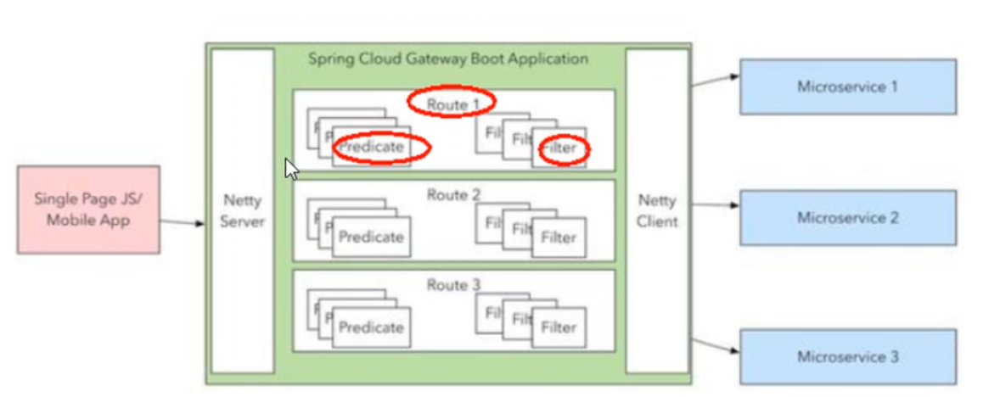

web请求,通过一些匹配条件,定位到真正的服务节点。并在这个转发过程的前后,进行一些精细化控制。

predicate就是我们的匹配条件;而 filter,就可以理解为一个无所不能的拦截器。有了这两个元素,再加上目标uri,就可以实现一个具体的路由了

## Gateway工作流程

官网总结

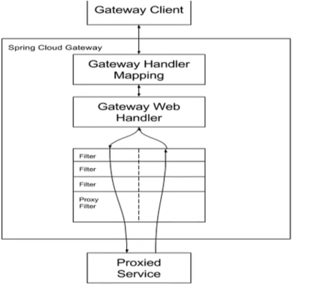

客户端向 Spring Cloud Gateway发出请求。然后在 Gateway Handler Mapping中找到与请求相匹配的路由,将其发送到 GatewayWeb handler。Handler再通过指定的过滤器链来将请求发送到我们实际的服务执行业务逻辑,然后返回。过滤器之间用虚线分开是因为过滤器可能会在发送代理请求之前("pre")或之后("post")执行业务逻辑。

**核心逻辑**

路由转发+执行过滤器链

## 入门配置

- 建moudel:   cloud-gateway-gateway9527

- POM

  ```xml
  <dependency>
      <groupId>org.springframework.cloud</groupId>
      <artifactId>spring-cloud-starter-gateway</artifactId>
  </dependency>
  
  <!--eureka-client，网关作为一种微服务也到注册中心中-->
  <dependency>
      <groupId>org.springframework.cloud</groupId>
      <artifactId>spring-cloud-starter-netflix-eureka-client</artifactId>
  </dependency>
  <dependency><!-- 引用自己定义的api通用包，可以使用Payment支付Entity -->
      <groupId>com.atguigu.springcloud</groupId>
      <artifactId>cloud-api-commons</artifactId>
      <version>${project.version}</version>
  </dependency>
  <!--一般基础通用配置-->
  <dependency>
      <groupId>org.springframework.boot</groupId>
      <artifactId>spring-boot-devtools</artifactId>
      <scope>runtime</scope>
      <optional>true</optional>
  </dependency>
  <dependency>
      <groupId>org.projectlombok</groupId>
      <artifactId>lombok</artifactId>
      <optional>true</optional>
  </dependency>
  <dependency>
      <groupId>org.springframework.boot</groupId>
      <artifactId>spring-boot-starter-test</artifactId>
      <scope>test</scope>
  </dependency>
  ```

  

- YML

  ```yaml
  server:
    port: 9527
  
  spring:
    application:
      name: cloud-gateway
  
  eureka:
    instance:
      hostname: cloud-gateway-service
    client: # 微服务提供者provider注册进eureka服务列表内
      service-url:
        register-with-eureka: true
        fetch-registry: true
        defaultZone: http://localhost:7001/eureka
  ```

  

  

- 业务类：无

- 主启动类

- 9527网关如何做路由映射??

  - cloud-provider-payment8001看看controller的访问地址
    - get
    - lb
  - 我们目前不想暴露8001端口，希望在8001外面套一层9527

- **YML新增网关配置**

  ```yaml
  spring:
    application:
      name: cloud-gateway
    cloud:
      gateway:
        routes:
          - id: payment_routh # payment_route # 路由的ID，没有固定规划但要求唯一，建议配合服务名
            uri: http://localhost:8001 # 匹配后提供服务的路由地址
            predicates:
              - Path=/payment/get/**  # 断言，路径相匹配的进行路由
  
          - id: payment_routh2 # payment_route # 路由的ID，没有固定规划但要求唯一，建议配合服务名
            uri: http://localhost:8001 # 匹配后提供服务的路由地址
            predicates:
              - Path=/payment/lb/** # 断言，路径相匹配的进行路由
  ```

  

- 测试

  - 启动7001

  - 启动8001 cloud-provider-payment8001

  - 启动9527网关

    如果启动失败，且报错为：

    ```
    Spring MVC found on classpath, which is incompatible with Spring Cloud Gateway at this time. Please remove spring-boot-starter-web dependency.
    # 网关不需要web
    ```

    则把pom中的web依赖去掉

  - 访问说明

    - 添加网关前http://localhost:8001/payment/get/31

    - 添加网关后http://localhost:9527/payment/get/31

      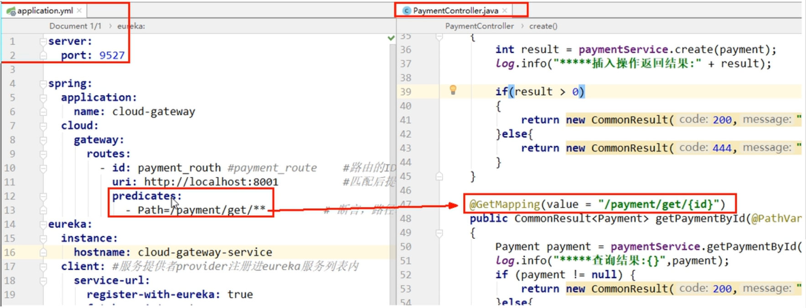

- YML配置说明

  Gateway网关路由有两种配置方式

  - 在配置文件yml中配置

    见前面步骤

  - 代码中注入RouteLocator的Bean

    - 官网案例

      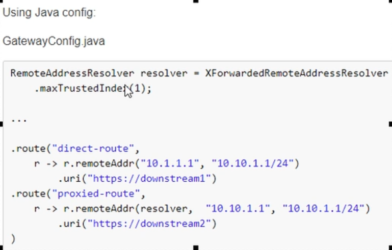

    - 自己写一个

      - 百度国内新闻网址http://news.baidu.com/guoji

      - 业务需求  通过9527网关访问到外网的百度新闻网址(在yml文件中也能配置成这样)

      - 编码

        - cloud-gateway-gateway9527

        - 实现业务

          config

          ```java
          package com.atguigu.springcloud.config;
          
          import org.springframework.cloud.gateway.route.RouteLocator;
          import org.springframework.cloud.gateway.route.builder.RouteLocatorBuilder;
          import org.springframework.context.annotation.Bean;
          import org.springframework.context.annotation.Configuration;
          
          @Configuration
          public class GateWayConfig {
              /**
               * 配置了一个id为router-name的路由规则
               * 当访问地址http://localhost:9527/guonei时会自动转发地址：http://news.baidu.com/guonei
               * @param routeLocatorBuilder
               * @return
               */
              @Bean
              public RouteLocator customRouteLocator(RouteLocatorBuilder routeLocatorBuilder){
                  RouteLocatorBuilder.Builder routes = routeLocatorBuilder.routes();
                  //http://news.baidu.com/guonei
                  routes.route("path_route_atguigu",
                          r ->r.path("/guonei")
                          .uri("http://news.baidu.com/guonei"))
                          .build();
                  return routes.build();
              }
              @Bean
              public RouteLocator customRouteLocator2(RouteLocatorBuilder routeLocatorBuilder){
                  RouteLocatorBuilder.Builder routes = routeLocatorBuilder.routes();
                  //http://news.baidu.com/guoji
                  routes.route("path_route_atguigu2",
                          r ->r.path("/guoji")
                                  .uri("http://news.baidu.com/guoji"))
                          .build();
                  return routes.build();
              }
          }
          
          ```

      - 测试结果

        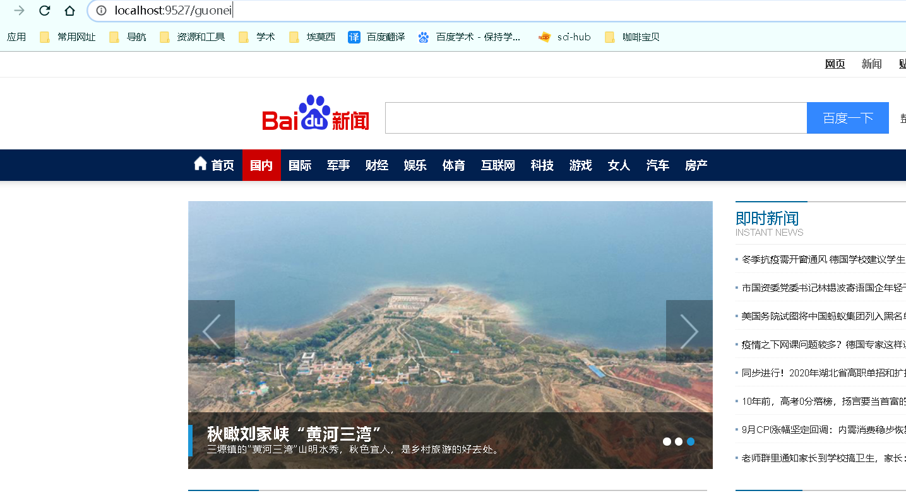

## 通过微服务名实现动态路由

默认情况下Gateway会根据注册中心的服务列表，以注册中心上微服务名为路径创建动态路由进行转发，从而实现动态路由的功能

- 启动

  一个eureka7001+两个服务提供者8001/8002

- POM

  ```xml
  <dependency>
      <groupId>org.springframework.cloud</groupId>
      <artifactId>spring-cloud-starter-netflix-eureka-client</artifactId>
  </dependency>
  ```

- YML

  ```yaml
  spring:
    application:
      name: cloud-gateway
    cloud:
      gateway:
        discovery:
          locator:
            enabled: true #开启从注册中心动态创建路由的功能，利用微服务名进行路由
        routes:
          - id: payment_routh # payment_route # 路由的ID，没有固定规划但要求唯一，建议配合服务名
            # uri: http://localhost:8001 # 匹配后提供服务的路由地址
            uri: lb://cloud-payment-service # 匹配后提供服务的路由地址
            predicates:
              - Path=/payment/get/**  # 断言，路径相匹配的进行路由
  
          - id: payment_routh2 # payment_route # 路由的ID，没有固定规划但要求唯一，建议配合服务名
            # uri: http://localhost:8001 # 匹配后提供服务的路由地址
            uri: lb://cloud-payment-service # 匹配后提供服务的路由地址
            predicates:
              - Path=/payment/lb/** # 断言，路径相匹配的进行路由
  ```

  - 需要注意的是uri的**协议为lb**，表示启用Gateway的负载均衡功能。
  - lb://serviceName是spring cloud gateway在微服务中自动为我们创建的负载均衡uri

- 测试

  http://localhost:9527/payment/lb

  8001/8002两个端口切换

## Predicate的使用

### 是什么

启动我们的gatewat9527

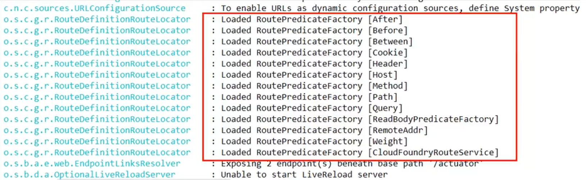

### Route Predicate Factories这个是什么东东？

https://docs.spring.io/spring-cloud-gateway/docs/2.2.5.RELEASE/reference/html/#gateway-request-predicates-factories

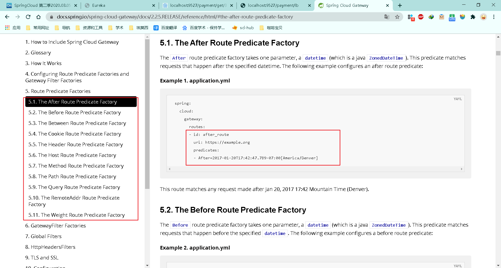

Spring Cloud Gateway将路由匹配作为 Spring WebFlux HandlerMapping2基础架初的一部分

Spring Cloud Gateway包括许多内置的 Route Predicate厂。所有这些 Predicate都与HTP请求的不同属性匹配。多个 RoutePredicate工可以进行组合

Spring Cloud Gateway创建 Route对象时,使用 Routepredicatefactory创建 Predicate对象, Predicate对象可以赋值给Route。 Spring Cloud Gateway包含许多内置的 Route Predicate Factories。

所有这些谓词都匹配HTTP请求的不同属性。多种谓词工厂可以组合,并通过逻辑and

### 常用的Route Predicate

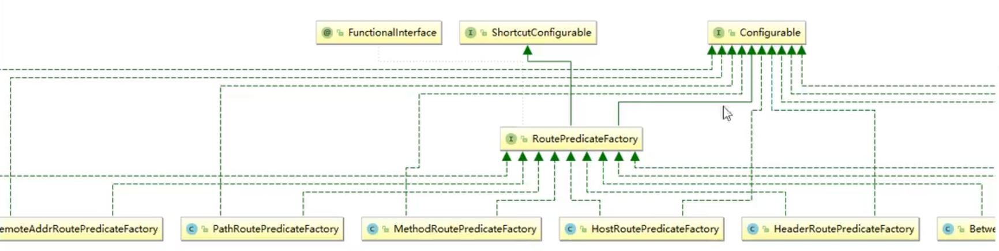

#### 1.After Route Predicate

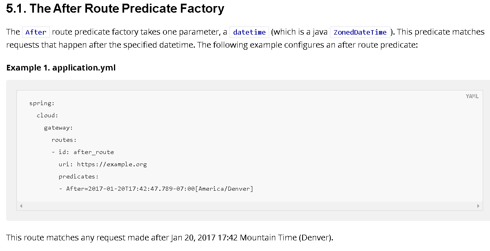

上述这个After好懂，这个时间串串？可以获取：

```java
public static void main(String[] args) {
    ZonedDateTime now = ZonedDateTime.now();
    System.out.println(now);//2020-10-15T20:47:39.380+08:00[Asia/Shanghai]
}
```

```yaml
spring:
  application:
    name: cloud-gateway
  cloud:
    gateway:
      discovery:
        locator:
          enabled: true #开启从注册中心动态创建路由的功能，利用微服务名进行路由
      routes:
        - id: payment_routh # payment_route # 路由的ID，没有固定规划但要求唯一，建议配合服务名
          # uri: http://localhost:8001 # 匹配后提供服务的路由地址
          uri: lb://cloud-payment-service # 匹配后提供服务的路由地址
          predicates:
            - Path=/payment/get/**  # 断言，路径相匹配的进行路由

        - id: payment_routh2 # payment_route # 路由的ID，没有固定规划但要求唯一，建议配合服务名
          # uri: http://localhost:8001 # 匹配后提供服务的路由地址
          uri: lb://cloud-payment-service # 匹配后提供服务的路由地址
          predicates:
            - Path=/payment/lb/** # 断言，路径相匹配的进行路由
            - After=2020-10-15T20:47:39.380+08:00[Asia/Shanghai] # 在这个时间点之后才能访问
            # - Before=2020-10-15T20:47:39.380+08:00[Asia/Shanghai] # 在这个时间点之前才能访问
            # - Between=2020-10-15T20:47:39.380+08:00[Asia/Shanghai],2020-11-15T20:47:39.380+08:00[Asia/Shanghai] # 在这个时间段之间才能访问

```

#### 2.Before Route Predicate

```yaml
- Before=2020-10-15T20:47:39.380+08:00[Asia/Shanghai] # 在这个时间点之前才能访问
```

#### 3.Between Route Predicate

```yaml
- Between=2020-10-15T20:47:39.380+08:00[Asia/Shanghai],2020-11-15T20:47:39.380+08:00[Asia/Shanghai] # 在这个时间段之间才能访问
```

#### 4. Cookie Route Predicate

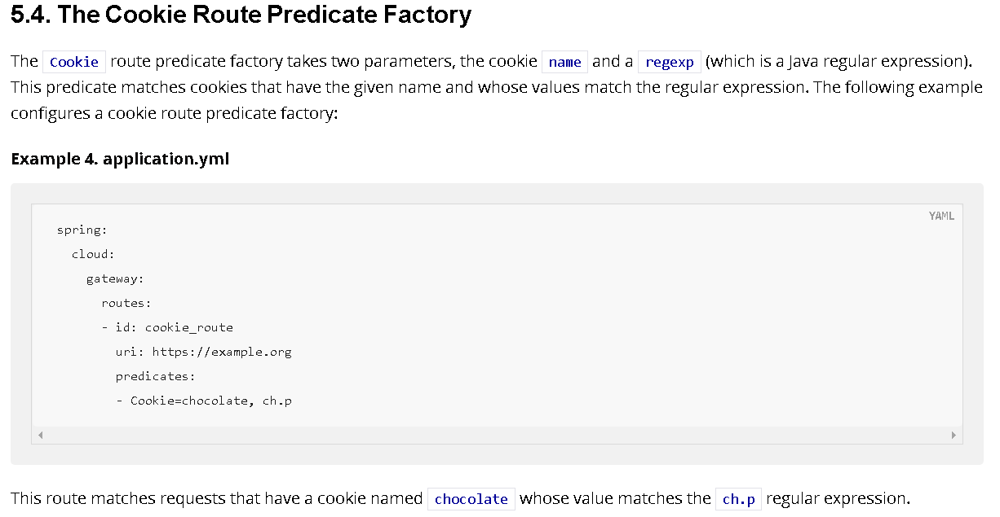

Cookie route predicate需要两个参数,一个是 Cookie name,个是正则表达式。

```yaml
- Cookie=username,zzyy
```

路由规则会通过获取对应的 Cookie name值和正则表达式去匹配,如果匹配上就会执行路由,如果没有匹配上则不执行

- 不带cookies访问

  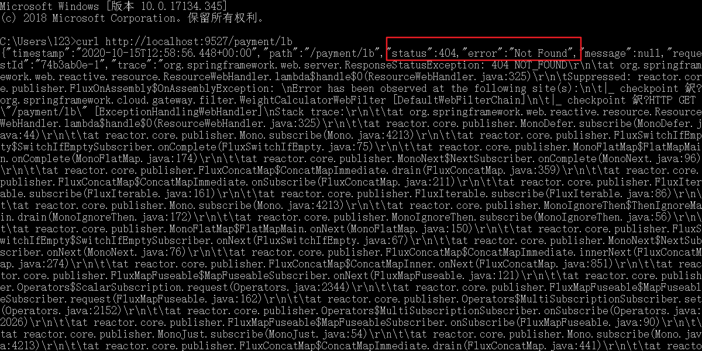

- 带上cookies访问

  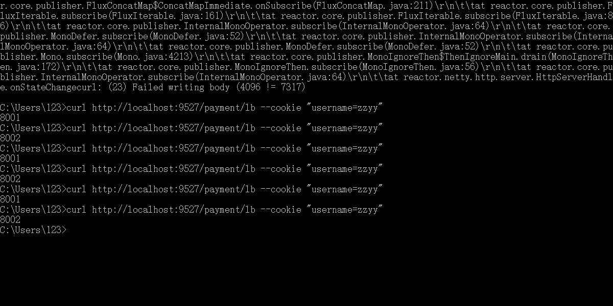

  加入curl返回中文乱码

#### 5. Header Route Predicate

请求头

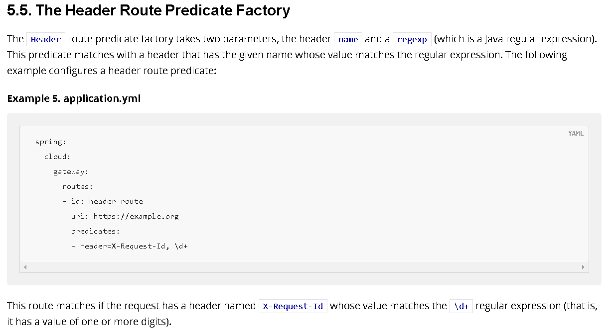

两个参数：一个是属性名和一个正则表达式，这个属性值和正则表达式匹配则执行

```yaml
 - Header=X-Request-Id,\d+ # 请求头要有X-Request-Id属性并且值为整数的正则表达式
```


#### 6.Host Route Predicate

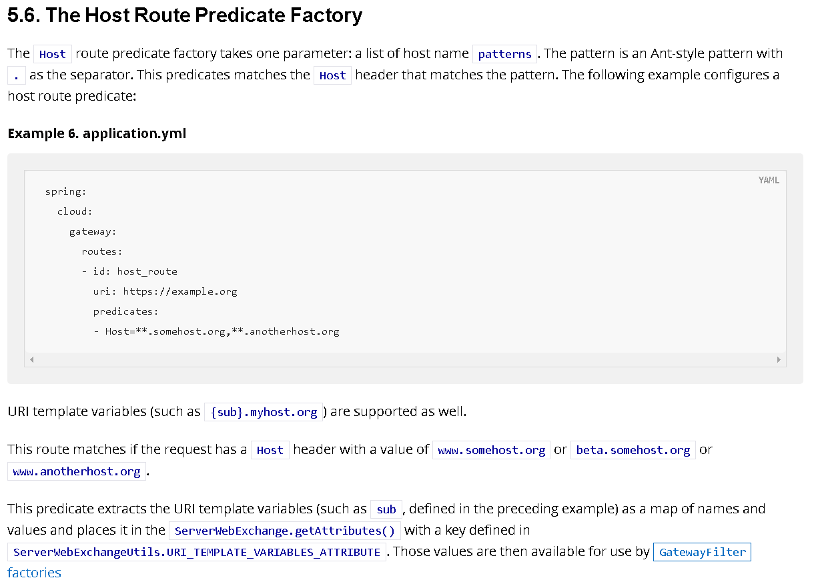

Host Route Predicate接收一组参数,一组匹配的域名列表,这个模板是一个ant分隔的模板,用.号作为分隔符。它通过参数中的主机地址作为匹配规则。

```yaml
-Host=**.atguigu.com
```

请求：

```bash
curl http://localhost:9527/payment/lb -H "Host:news.atguigu.com"
```

#### 7.Method Route Predicate

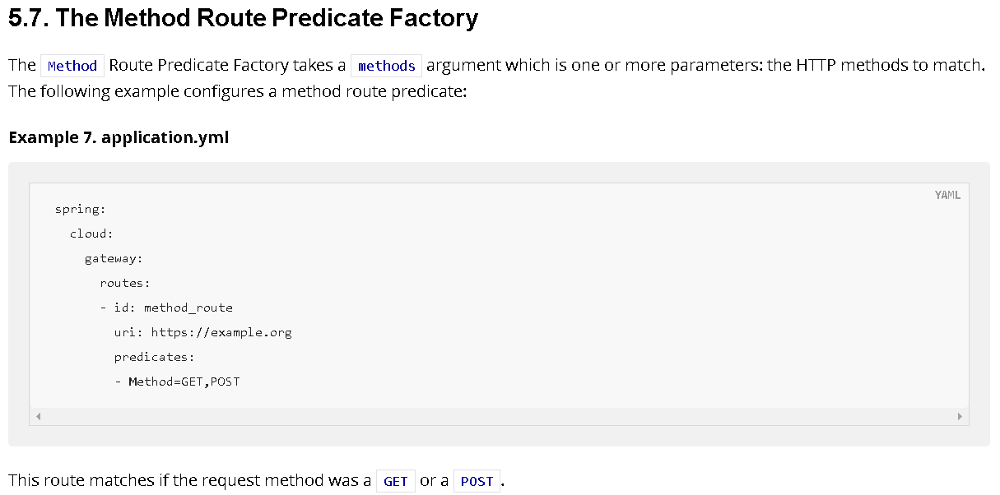

```yaml
-Method=Get #发Get请求才给访问，Post不给访问
```


#### 8.Path Route Predicate

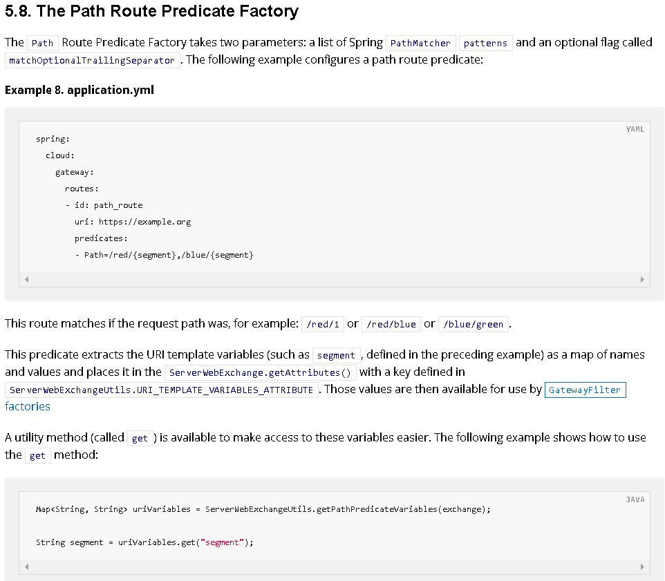


#### 9. Query Route Predicate

带查询条件的

```yaml
-Query=username,\d+ #要有参数username并且值还要是整数才能路由
```

#### 10.小总结

```yaml
server:
  port: 9527

spring:
  application:
    name: cloud-gateway
  cloud:
    gateway:
      discovery:
        locator:
          enabled: true #开启从注册中心动态创建路由的功能，利用微服务名进行路由
      routes:
        - id: payment_routh # payment_route # 路由的ID，没有固定规划但要求唯一，建议配合服务名
          # uri: http://localhost:8001 # 匹配后提供服务的路由地址
          uri: lb://cloud-payment-service # 匹配后提供服务的路由地址
          predicates:
            - Path=/payment/get/**  # 断言，路径相匹配的进行路由

        - id: payment_routh2 # payment_route # 路由的ID，没有固定规划但要求唯一，建议配合服务名
          # uri: http://localhost:8001 # 匹配后提供服务的路由地址
          uri: lb://cloud-payment-service # 匹配后提供服务的路由地址
          predicates:
            - Path=/payment/lb/** # 断言，路径相匹配的进行路由
            - After=2020-10-15T20:47:39.380+08:00[Asia/Shanghai] # 在这个时间点之后才能访问
            # - Before=2020-10-15T20:47:39.380+08:00[Asia/Shanghai] # 在这个时间点之前才能访问
            # - Between=2020-10-15T20:47:39.380+08:00[Asia/Shanghai],2020-11-15T20:47:39.380+08:00[Asia/Shanghai] # 在这个时间段之间才能访问
            # - Cookie=username,zzyy
            - Header=X-Request-Id,\d+ # 请求头要有X-Request-Id属性并且值为整数的正则表达式

eureka:
  instance:
    hostname: cloud-gateway-service
  client: # 微服务提供者provider注册进eureka服务列表内
    service-url:
      register-with-eureka: true
      fetch-registry: true
      defaultZone: http://localhost:7001/eureka
```


说白了，Predicate就是为了实现一组匹配规则，让请求过来找到对应的Route进行处理

## Filter的使用

### 是什么

路由过滤器可用于修改进入的HTTP请求和返回的HTTP晌响应,路由过滤器只能指定路由进行使用。Spring Cloud Gateway内置了多种路由过滤器,他们都由 Gateway Filter的工厂类来产生

### Spring Cloud Gateway的Filter

#### 生命周期，Only Two

- pre  在业务逻辑之前
- post 在业务逻辑之后

#### 种类，Only Two

- GatewayFilter  单一

  [官网文档]: https://docs.spring.io/spring-cloud-gateway/docs/2.2.5.RELEASE/reference/html/#gatewayfilter-factories

  有31种之多

- GlobalFilter 全局

  https://docs.spring.io/spring-cloud-gateway/docs/2.2.5.RELEASE/reference/html/#global-filters

  10种之多

### 常用的GatewayFilter

- AddRequestParameter  YML

  ```yaml
  filters:
    -AddRequestParameter=X-Request-Id,1024 # 过滤器工厂会在匹配的请求头上加上一对请求头，名称为X-Request-Id值为1024
  ```

- 省略

### 自定义过滤器

官方自带的三四十多种的不好用，太多了，用自定义的

自定义全局GlobalFilter

- 两个主要接口介绍 

  implemerts **GlobalFilter** ，**Ordered**

- 能干嘛

  - 全局日志记录
  - 统一网关鉴权
  - ……

- 案例代码

  ```java
  package com.atguigu.springcloud.filter;
  
  import lombok.extern.slf4j.Slf4j;
  import org.springframework.cloud.gateway.filter.GatewayFilterChain;
  import org.springframework.cloud.gateway.filter.GlobalFilter;
  import org.springframework.core.Ordered;
  import org.springframework.http.HttpStatus;
  import org.springframework.stereotype.Component;
  import org.springframework.web.server.ServerWebExchange;
  import reactor.core.publisher.Mono;
  
  import java.util.Date;
  
  @Component
  @Slf4j
  public class MyLogGateWayFilter implements GlobalFilter, Ordered {
      @Override
      public Mono<Void> filter(ServerWebExchange exchange, GatewayFilterChain chain) {
          log.info("****come in MyLogGateWayFilter:"+new Date());
          String uname = exchange.getRequest().getQueryParams().getFirst("uname");
          if (uname==null){
              log.info("****用户名为null,非法用户，(ノへ￣、)");
              exchange.getResponse().setStatusCode(HttpStatus.NOT_ACCEPTABLE);
              return exchange.getResponse().setComplete();
          }
          return chain.filter(exchange);
      }
  
      @Override
      public int getOrder() {
          return 0;
      }
  }
  
  ```

  

- 测试

  - 启动

    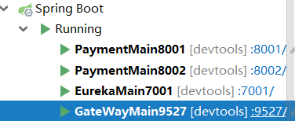

  - 正确  http://localhost:9527/payment/lb?uname=z3

  - 错误

# 第12章 SpringCloud config分布式配置中心

## 概述

### 分布式系统面临的配置问题

工程越来越多，每个工程都有application.yml，随着微服务数量增大，每次都要改yml，要哭了

而且，配置文件至少有分：生产环境、测试环境、灰度发布环境。

微服务意味着要将单体应用中的业务拆分成—个个子服务,每个服务的粒度相对较小,因此系统中会出现大量的服务。由于每个服务都需要必要的配置信息才能运行,所以套集中式的、动态的配置管理设施是必不可少的。

Spring Cloud提供了 ConfigServer来解决这个问题,我们每个微服务自己带着一个 application.yml,上百个配置文件的管理

### 是什么

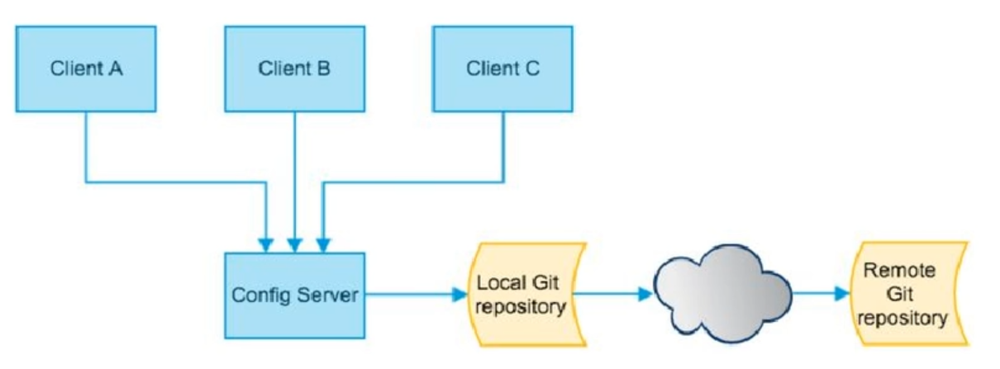


SpringCloud Config为微服务架构中的微服务提供集中化外部配置支持,配置服务器为**各个不同微服务应用**的所有环境提供了一个**中心化的外部配置**。

怎么玩

Spring Cloud Config分为服务端和客户端两部分.

服务端也称为**分布式配置中心**,它是**—个独立的微服务应用**,用来连接配置服务器并为客户端提供获取配置信息,加密/解密信息等访问接口.

客户端则是通过指定的配置中心来管理应用资源,以及与业务相关的配置内容,并在启动的时候从配置中心获取和加载配置信息配置服务器默认采用git来存储配置信息,这样就有助于对环境配置进行版本管理,并且可以通过gt客户端工具来方便的管理和访问配置内容

### 能干嘛

- 集中管理配置文件
- 不同环境不同配置，动态化的配置更新，分环境部署比如dev/test/prod/beta/release
- 运行期间动态调整配置，不再需要在每个服务部署的机器上编写配置文件，服务会向配置中心统一拉取配置自己的信息
- 当配置发生变动时，服务不需要重启即可感知到配置的变化并应用新的配置
- 将配置信息以REST接口的形式暴露    post、curl访问刷新均可....

### 与Github整合配置

由于SpringCloud Config默认使用Git来存储配置文件（也有其它方式，比如支持svn和本地文件，但最推荐的还是Git，而且使用的是http/https访问的形式）

### 官网文档

https://docs.spring.io/spring-cloud-config/docs/2.2.5.RELEASE/reference/html/

## Config服务端配置与测试

1.用你自己的账号在Github上新建一个名为sprincloud-config的新Repository

2.由上一步获得刚新建的git地址

​	写你自己的仓库地址

3.本地硬盘上新建git仓库并clone

​	本地地址：D:\44\SpringCloud2020

​	git命令    git clone xxx

```bash
echo "# springcloud-config" >> README.md
git init
git add README.md
git commit -m "first commit"
git branch -M main
git remote add origin https://github.com/Potato20522/springcloud-config.git
git push -u origin main
```

4.此时在本地D盘符下D:\44\SpringCloud2020\springcloud-config

​	表示多个环境的配置文件

​	保存格式必须为UTF-8

​	如果需要修改，此处模拟运维人员操作git和github

- git add
- git commit -m "init yml"
- git push origin master

5.新建Module模块cloud-config-center-3344它既为Cloud的配置中心模块cloudConfig Center

6.POM

```xml
<dependencies>
    <dependency>
        <groupId>org.springframework.cloud</groupId>
        <artifactId>spring-cloud-config-server</artifactId>
    </dependency>
    <dependency>
        <groupId>org.springframework.cloud</groupId>
        <artifactId>spring-cloud-starter-netflix-eureka-client</artifactId>
    </dependency>
    <!--web-->
    <dependency>
        <groupId>org.springframework.boot</groupId>
        <artifactId>spring-boot-starter-web</artifactId>
    </dependency>
    <dependency>
        <groupId>org.springframework.boot</groupId>
        <artifactId>spring-boot-starter-actuator</artifactId>
    </dependency>
    <!--一般基础通用配置-->
    <dependency>
        <groupId>org.springframework.boot</groupId>
        <artifactId>spring-boot-devtools</artifactId>
        <scope>runtime</scope>
        <optional>true</optional>
    </dependency>
    <dependency>
        <groupId>org.projectlombok</groupId>
        <artifactId>lombok</artifactId>
        <optional>true</optional>
    </dependency>
    <dependency>
        <groupId>org.springframework.boot</groupId>
        <artifactId>spring-boot-starter-test</artifactId>
        <scope>test</scope>
    </dependency>
</dependencies>
```


7.主启动类  ConfigCenterMain3344  @EnableConfigServer

```java
package com.atguigu.springcloud;

import org.springframework.boot.SpringApplication;
import org.springframework.boot.autoconfigure.SpringBootApplication;
import org.springframework.cloud.config.server.EnableConfigServer;

@SpringBootApplication
@EnableConfigServer
public class ConfigCenterMain3344 {
    public static void main(String[] args) {
        SpringApplication.run(ConfigCenterMain3344.class,args);
    }
}
```


8.windows下修改hosts文件，增加映射

​	127.0.0.1 config-3344.com

9.测试通过Config微服务是否可以从Github上获取配置内容

- 启动微服务3344
- http://config-3344.com:3344/master/config-dev.yml
- 可能遇到报错：https://blog.csdn.net/uuuuu___/article/details/85224316

#### 配置读取规则

官网上有5种，太多了

##### /{label}/{application}-{profile}.yml（最推荐使用这种方式）

- master分支

  ```
  http://config-3344.com:3344/master/config-dev.yml
  http://config-3344.com:3344/master/config-test.yml
  http://config-3344.com:3344/master/config-prod.yml
  ```

- dev分支

  ```
  http://config-3344.com:3344/dev/config-dev.yml
  http://config-3344.com:3344/dev/config-test.yml
  http://config-3344.com:3344/dev/config-prod.yml
  ```

##### /{application}-{profile}.yml

没有label默认读出来是master分支

```
http://config-3344.com:3344/config-dev.yml
http://config-3344.com:3344/config-test.yml
http://config-3344.com:3344/config-test.yml
http://config-3344.com:3344/config-xxxx.yml(不存在的配置)
```

##### /{application}-{profile}[/{label}]

```
http://config-3344.com:3344/config/dev/master
http://config-3344.com:3344/config/test/master
http://config-3344.com:3344/config/prod/master
```

##### 重要配置细节总结

label：分支（branch）

name:服务名

profiles:环境名（dev/test/prod）

成功实现了用SpringCloud Config 通过GitHub获取配置信息

## Config客户端配置与测试

1.新建cloud-config-client-3355

2.POM

```xml
<dependencies>
    <!--config客户端-->
    <dependency>
        <groupId>org.springframework.cloud</groupId>
        <artifactId>spring-cloud-starter-config</artifactId>
    </dependency>
    <dependency>
        <groupId>org.springframework.cloud</groupId>
        <artifactId>spring-cloud-starter-netflix-eureka-client</artifactId>
    </dependency>
    <!--web-->
    <dependency>
        <groupId>org.springframework.boot</groupId>
        <artifactId>spring-boot-starter-web</artifactId>
    </dependency>
    <dependency>
        <groupId>org.springframework.boot</groupId>
        <artifactId>spring-boot-starter-actuator</artifactId>
    </dependency>
    <!--一般基础通用配置-->
    <dependency>
        <groupId>org.springframework.boot</groupId>
        <artifactId>spring-boot-devtools</artifactId>
        <scope>runtime</scope>
        <optional>true</optional>
    </dependency>
    <dependency>
        <groupId>org.projectlombok</groupId>
        <artifactId>lombok</artifactId>
        <optional>true</optional>
    </dependency>
    <dependency>
        <groupId>org.springframework.boot</groupId>
        <artifactId>spring-boot-starter-test</artifactId>
        <scope>test</scope>
    </dependency>
</dependencies>
```

**3.bootstap.yml**

**是什么**

applicaiton.yml是用户级的资源配置项

bootstrap.yml是**系统级的,优先级更加高**

Spring Cloud会创建一个" Bootstrap Context”,作为 Spring应用的 Application Context的**父上下文**。初始化的时候, BootstrapContext负责从**外部源**加载配置属性并解析配置。这两个上下文共享一个从外部获取的 Environment。

Bootstrap属性有高优先級,默认情況下,它们不会被本地配置覆盖。 Bootstrap context和 Application Context有着不同的约定,所以新增了一个 bootstrap.yml文件,保证 Bootstrap Context和 Application Context配置的分离。

**要将 Client模块下的 application.ym文件改为 bootstrap.yml,这是很关键的,**

因为 bootstrap.yml是比 application.yml先加载的。 bootstrap.ym优先级高于 application. yml

**内容**

```yaml
server:
  port: 3355

spring:
  application:
    name: config-client # 注册进Eureka服务器的微服务名
  cloud:
    config: # config客户端配置
      label: main # 分支名称
      name: config # 配置文件名称
      profile: dev # 读取后缀名称 上述3个综合，main分支上config-dev.yml的配置文件读取http://config-3344.com:3344/main/config-dev.yml
      uri: http://localhost:3344 # 配置中心地址

eureka:
  client:
    service-url:
      defaultZone: http://localhost:7001/eureka
```

4.修改config-dev.yml配置并提交到GitHub中，比如加个变量age或者版本号version

5.主启动    类ConfigClientMain3355

```java
package com.atguigu.springcloud;

import org.springframework.boot.SpringApplication;
import org.springframework.boot.autoconfigure.SpringBootApplication;
import org.springframework.cloud.netflix.eureka.EnableEurekaClient;

@EnableEurekaClient
@SpringBootApplication
public class ConfigClientMain3355 {
    public static void main(String[] args) {
        SpringApplication.run(ConfigClientMain3355.class,args);
    }
}

```

说明

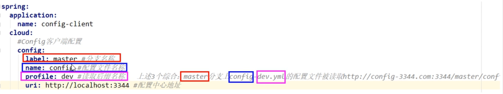

6.业务类

```java
package com.atguigu.springcloud.controller;

import org.springframework.beans.factory.annotation.Value;
import org.springframework.web.bind.annotation.GetMapping;
import org.springframework.web.bind.annotation.RestController;

@RestController
public class ConfigClientController {
    @Value("${config.info}")
    private String configInfo;

    @GetMapping("/configInfo")
    public String getConfigInfo(){
        return configInfo;
    }
}

```


7.测试

- 启动Config配置中心3344微服务并自测

  http://config-3344.com:3344/main/config-test.yml

  http://config-3344.com:3344/main/config-test.yml

- 启动3355作为Client准备访问

  http://localhost:3355/configInfo

8.成功实现了客户端3355访问SpringCloud Config3344通过GitHub获取配置信息

9.问题随时而来，分布式配置的动态刷新

- Linux运维修改GitHub上的配置文件内容做调整
- 刷新3344，发现ConfigServer配置中心立刻响应
- 刷新3355，发现ConfigServer客户端没有任何响应
- 3355没有变化除非自己重启或者重新加载
- 难道每次运维修改配置文件，客户端都需要重启？？噩梦

## Config客户端之动态刷新

避免每次更新配置都要重启客户端微服务3355

### 动态刷新

步骤：

1.修改3355模块

2.POM引入actuator监控

```xml
<dependency>
    <groupId>org.springframework.boot</groupId>
    <artifactId>spring-boot-starter-actuator</artifactId>
</dependency>
```

3.修改YML，暴露监控端口

加上：

```yaml
# 暴露监控端点
management:
  endpoints:
    web:
      exposure:
        include: "*"
```


4.@RefreshScope业务类Controller修改

5.此时修改github---> 3344 ---> 3355

​	http://localhost:3355/configInfo

​	3355改变了没有？？？没有改变，(┬＿┬)

6.How   需要运维人员发送Post请求刷新3355

- 必须是Post请求
- curl -X POST "http://localhost:3355/actuator/refresh"     （在cmd上执行）

7.再次

​	http://localhost:3355/configInfo     ok


想想还有什么问题？

假如有多个微服务客户端3355/3366/3377。。。。

每个微服务都要执行一次post请求，手动刷新？

**可否广播，一次通知，处处生效？**

我们想大范围的自动刷新，求方法

# 第13章 SpringCloud Bus 消息总线

## 概述

上一讲解的加深和扩充，一言以蔽之

- 分布式自动刷新配置功能

- Spring Cloud Bus配合Spring Cloud Config使用可以实现配置的动态刷新

### 是什么

Spring Cloud Bus 配合 Spring Cloud Config使用可以实现配置的动态新

- Bus支持两种消息代理：RabbitMQ和Kafka

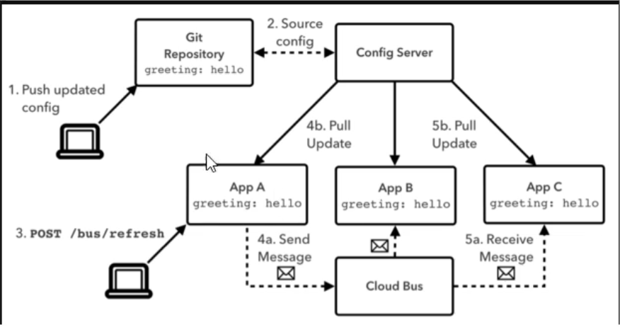

Spring Cloud Bus是用来将分布式系统的节点与轻量级消息系统链接起来的框架,

**它整合了Java的事件处理机制和消息中间件的功能。**

Spring Clud Bus目前支持 Rabbitmo和 Kafka。

### 能干嘛

Spring Cloud Bus能管理和传播分布式系统间的消息,就像-个分布式执行器,可用于广播状态更改、事件推送等,也可以当作微服务间的通信通道

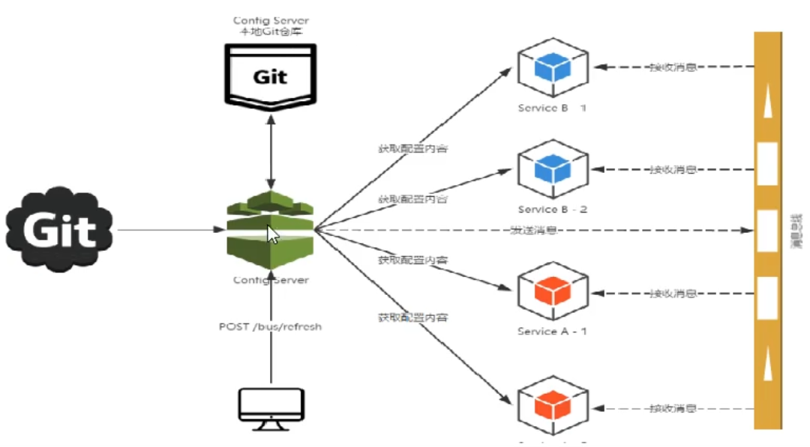

### 为何被称为总线

**什么是总线**

在微服务架构的系统中,通常会使用**轻量级的消息代理**来构建一个共用的消息主题,并让系统中所有微服务实例都连接上来。由于**该主题中产生的消息会被所有实例监听和消费**,所以称它为消息总线。在总线上的各个实例,都可以方便地广播一些需要让其他连接在该主题上的实例都知道的消息。

**基本原理**

Configclient实例都监听MQ中同个 topic(默认是 springcloudbus)。当一个服务刷新数据的时候,它会把这个信息放入到 Topic中,这样其它监听同-Topi的服务就能得到通知,然后去更新自身的配置

https://www.bilibili.com/video/av55976700

## RabbitMQ环境配置

1.安装Erlang

下载地址：http://erlang.org/download/otp_win64_21.3.exe  安装

2.安装RabbitMQ

下载地址https://dl.bintray.com/rabbitmq/all/rabbitmq-server/3.7.14/rabbitmq-server-3.7.14.exe

安装

3.进入RabbitMQ安装目录下的sbin目录

D:\scmq\rabbitmq_server-3.7.14\sbin

4.输入以下命令启动管理功能

​	rabbitmq-plugins enable rabbitmq_management  可视化插件

5.访问地址查看是否安装成功

​	http://localhost:15672/

6.输入账号密码并登录: guest guest

## SpringCloud Bus动态刷新全局广播

**必须先具备良好的RabbitMQ环境先**

### 演示广播效果，增加复杂度，再以3355为模板再制作一个3366

1.新建 cloud-config-client-3366

2.POM

3.YML

4.主启动

5.controller

### 设计思想

1.利用消息总线触发一个客户端/bus/refresh,而刷新所有客户端的配置

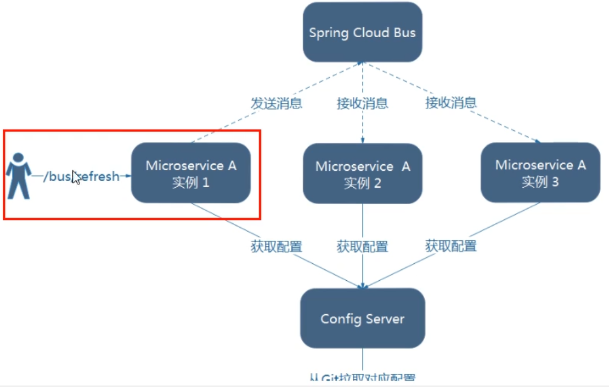

2.利用消息总线触发一个服务端ConfigServer的/bus/refresh端点,而刷新所有客户端的配置（更加推荐）

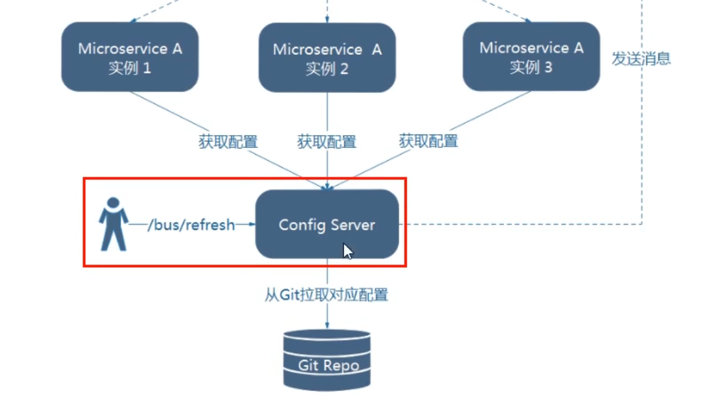

图二的架构显然更加合适，图一不适合的原因如下

- 打破了微服务的职责单一性，因为微服务本身是业务模块，它本不应该承担配置刷新职责
- 破坏了微服务各节点的对等性
- 有一定的局限性。例如，微服务在迁移时，它的网络地址常常会发生变化，此时如果想要做到自动刷新，那就会增加更多的修改


### 给cloud-config-center-3344配置中心服务端添加消息总线支持

POM

```xml
<!--添加消息总线RabbitMQ支持-->
<dependency>
    <groupId>org.springframework.cloud</groupId>
    <artifactId>spring-cloud-starter-bus-amqp</artifactId>
</dependency>
<dependency>
    <groupId>org.springframework.boot</groupId>
    <artifactId>spring-boot-starter-actuator</artifactId>
</dependency>
```

YML

```yaml
server:
  port: 3344

spring:
  application:
    name: cloud-config-center # 注册进Eureka服务器的微服务名
  cloud:
    config:
      server:
        git:
          uri: https://github.com/Potato20522/springcloud-config.git # github上的git仓库名字
          search-paths: # 搜索目录
            - springcloud-config
      label: main # 读取分支
  rabbitmq: # RabbitMQ相关配置
    host: 192.168.1.130
    port: 5672
    username: guest
    password: guest
# 服务注册到eureka
eureka:
  client:
    service-url:
      defaultZone: http://localhost:7001/eureka


# RabbitMQ相关配置，暴露bus刷新配置的端点
management:
  endpoints: # 暴露bus刷新配置的端点
    web:
      exposure:
        include: 'bus-refresh'

```


### 给cloud-config-center-3355客户端添加消息总线支持

POM

```xml
<!--添加消息总线RabbitMQ支持-->
<dependency>
    <groupId>org.springframework.cloud</groupId>
    <artifactId>spring-cloud-starter-bus-amqp</artifactId>
</dependency>
<dependency>
    <groupId>org.springframework.boot</groupId>
    <artifactId>spring-boot-starter-actuator</artifactId>
</dependency>
```

YML

```yaml
server:
  port: 3355

spring:
  application:
    name: config-client # 注册进Eureka服务器的微服务名
  cloud:
    config: # config客户端配置
      label: main # 分支名称（之前主分支是master，现在是main了）
      name: config # 配置文件名称
      profile: dev # 读取后缀名称 上述3个综合，main分支上config-dev.yml的配置文件读取http://config-3344.com:3344/main/config-dev.yml
      uri: http://localhost:3344 # 配置中心地址
  rabbitmq: # RabbitMQ相关配置
    host: 192.168.1.130
    port: 5672
    username: guest
    password: guest

eureka:
  client:
    service-url:
      defaultZone: http://localhost:7001/eureka

# 暴露监控端点
management:
  endpoints:
    web:
      exposure:
        include: "*"
```


### 给cloud-config-center-3366客户端添加消息总线支持

POM

```xml
<!--添加消息总线RabbitMQ支持-->
<dependency>
    <groupId>org.springframework.cloud</groupId>
    <artifactId>spring-cloud-starter-bus-amqp</artifactId>
</dependency>
<dependency>
    <groupId>org.springframework.boot</groupId>
    <artifactId>spring-boot-starter-actuator</artifactId>
</dependency>
```

YML

```YML
server:
  port: 3366

spring:
  application:
    name: config-client # 注册进Eureka服务器的微服务名
  cloud:
    config: # config客户端配置
      label: main # 分支名称（之前主分支是master，现在是main了）
      name: config # 配置文件名称
      profile: dev # 读取后缀名称 上述3个综合，main分支上config-dev.yml的配置文件读取http://config-3344.com:3344/main/config-dev.yml
      uri: http://localhost:3344 # 配置中心地址
  rabbitmq: # RabbitMQ相关配置
    host: 192.168.1.130
    port: 5672
    username: guest
    password: guest

eureka:
  client:
    service-url:
      defaultZone: http://localhost:7001/eureka

# 暴露监控端点
management:
  endpoints:
    web:
      exposure:
        include: "*"

```

### 测试

1.运维工程师

- 修改Github上配置文件增加版本号

- 发送Post请求
  - curl -X POST "http://localhost:3344/actuator/bus-refresh"
  - 一次发送，处处生效

2.配置中心

​	http://config-3344.com/config-dev.yml

3.客户端

​	http://localhost:3355/configInfo

​	http://localhost:3366/configInfo

​	获取配置信息，发现都已经刷新了

一次修改，广播通知，处处生效

## SpringCloud Bus动态刷新定点通知

### 不想全部通知，只想定点通知

 只通知3355,不通知3366

### 简单一句话

指定具体某一个实例生效而不是全部,

公式：

```
http://localhost:配置中心的端口号/actuator/bus-refresh/{destination}
```

/bus/refresh请求不再发送到具体的服务实例上，而是发给config server并通过destination参数类指定需要更新配置的服务或实例

### 案例

我们这里以刷新运行在3355端口上的config-client为例

 只通知3355,不通知3366

```
curl -X POST "http://localhost:3344/actuator/bus-refresh/config-client:3355"
```


### 通知总结All

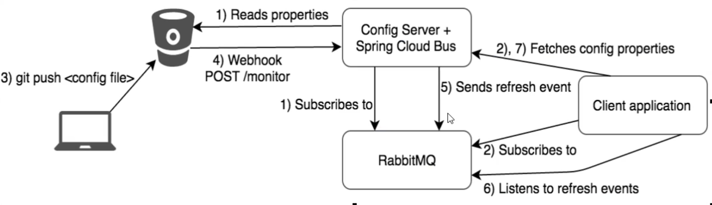

# 第14章 SpringCloud Stream 消息驱动

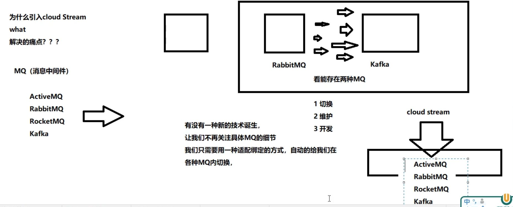

## 消息驱动概述

### 是什么

一句话：屏蔽底层消息中间件的差异，降低切换版本，统一消息的编程模型

官网：https://spring.io/projects/spring-cloud-stream#overview

https://docs.spring.io/spring-cloud-stream/docs/3.0.8.RELEASE/reference/html/

Spring Cloud Stream中文指导手册https://m.wang1314.com/doc/webapp/topic/20971999.html

什么是 SpringcloudStream

官方定义 Spring Cloud Stream是一个构建消息驱动微服务的框架。

应用程序通过 Inputs或者 outputs来与 Spring Cloud Stream中 bindel对象交互通过我们配置来 binding绑定),而 Spring Cloud Stream的 binder,对象负责与消息中间件交互。所以,我们只需要搞清楚如何与 Spring Cloud Stream交互就可以方便使用消息驱动的方式。

通过使用 Spring Integration来连接消息代理中间件以实现消息事件驱动Spring Cloud Stream为一些供应商的消息中间件产品提供了个性化的自动化配置实现,引用了发布-订阅、消费组、分区的三个核心概念。

目前仅支持 RabbitMQ、 Kafka

Spring Cloud Stream是用于构建与共享消息传递系统连接的髙度可伸缩的事件驱动微服务框架,该框架提供了—个灵活的编程模型,它建立在已经建立和熟悉的 Spring熟语和最佳实践上,包括支持持久化的发布/订阅、消费组以及消息分区这三个核心概念

### 设计思想

#### 标准MQ

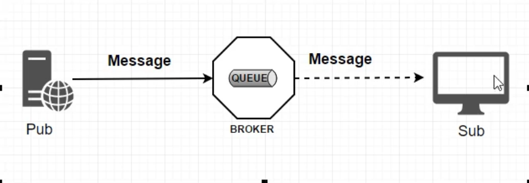

- 生产者/消费者之间靠**消息**媒介传递信息内容      Message

- 消息必须走特定的**通道**    消息通道MessageChannel

- 消息通道里的消息如何被消费呢，谁负责收发**处理**    

  消息通道MessageChannel的子接口SubscribableChannel,由MessageHandler消息处理器订阅

#### 为什么用Cloud Stream

比方说我们用到了 Rabbitmo和 Kafka,由于这两个消息中间件的架构上的不同,

像 Rabbitmq有 exchange, kafka有 Topic和 Partitions分区.

这些中间件的差异性导致我们实际项目开发给我们造成了一定的困扰,我们如果用了两个消息队列的其中一,后面的业务需求,我想往另外—种消息队列进行迁移,这时候无疑就是一个灾难性的,**一大堆东西都要重新推倒重新做**,因为它跟我们的系统耦合了,这时候 springcloud Stream给我们提供了一种解耦合的方式。

##### stream凭什么可以统一底层差异

在没有绑定器这个概念的情况下,我们的 Spring Boot应用要直接与消息中间件进行信息交互的时候,由于各消息中间件构建的初衷不同,它们的实现细节上会有较大的差异性通过定义绑定器作为中间层,完美地实现了**应用程序与消息中间件细节之间的隔离**。通过向应用程序暴露统的 Channe通道,使得应用程序不需要再考虑各种不同的消息中间件实现

**通过定义绑定器 Binder作为中间层,实现了应用程序与消息中间件细节之间的隔离。**

##### Binder

图中input和output写反了

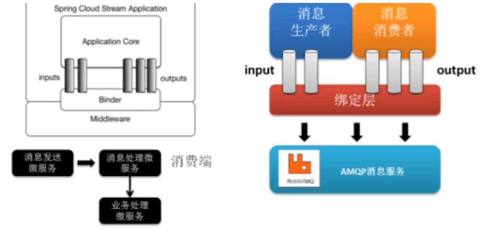

- INPUT对应于消费者
- OUTPUT对应于生产者

#### Stream中的消息通信方式遵循了发布-订阅模式

Topic主题进行广播

- 在RabbitMQ就是Exchange
- 在kafka中就是Topic

### Spring Cloud Stream标准流程套路

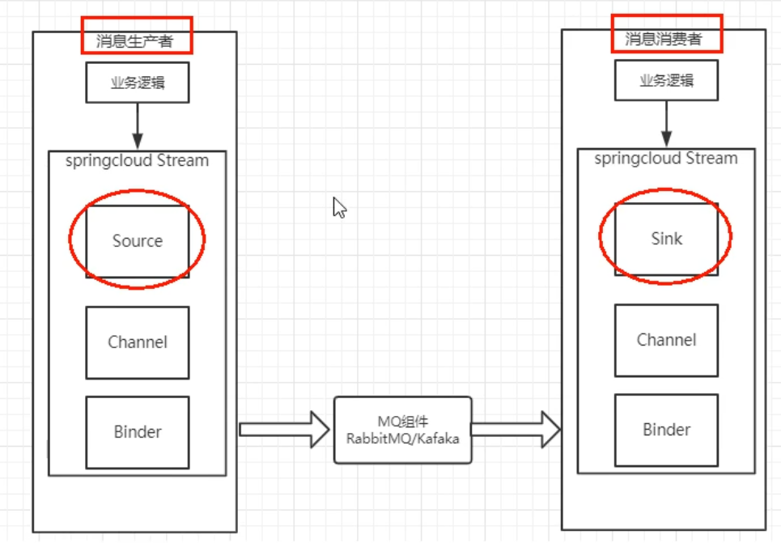

- Binder

  很方便的连接中间件，屏蔽差异

- Channel

  通道，是队列Queue的一种抽象，在消息通讯系统中就是实现存储和转发的媒介，通过对Channel对队列进行配置

- Source和Sink

  简单的可理解为参照对象是Spring Cloud Stream自身，从Stream发布消息就是输出，接受消息就是输入

### 编码API和常用注解

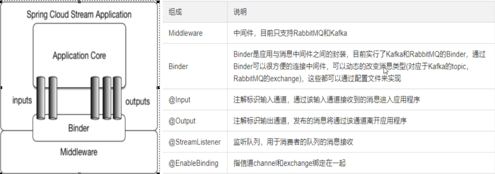

## 案例说明

RabbitMQ环境已经OK

工程中新建三个子模块

- cloud-stream-rabbitmq-provider8801,作为生产者进行发消息模块
- cloud-stream-rabbitmq-consumer8802,作为消息接收模块
- cloud-stream-rabbitmq-consumer8803,作为消息接收模块

## 消息驱动之生产者

1.新建Module:  cloud-stream-rabbitmq-provider8801

2.POM

```xml
<dependencies>
    <!--stream rabbit-->
    <dependency>
        <groupId>org.springframework.cloud</groupId>
        <artifactId>spring-cloud-starter-stream-rabbit</artifactId>
    </dependency>
    <dependency>
        <groupId>org.springframework.cloud</groupId>
        <artifactId>spring-cloud-starter-netflix-eureka-client</artifactId>
    </dependency>
    <!--web-->
    <dependency>
        <groupId>org.springframework.boot</groupId>
        <artifactId>spring-boot-starter-web</artifactId>
    </dependency>
    <dependency>
        <groupId>org.springframework.boot</groupId>
        <artifactId>spring-boot-starter-actuator</artifactId>
    </dependency>
    <!--一般基础通用配置-->
    <dependency>
        <groupId>org.springframework.boot</groupId>
        <artifactId>spring-boot-devtools</artifactId>
        <scope>runtime</scope>
        <optional>true</optional>
    </dependency>
    <dependency>
        <groupId>org.projectlombok</groupId>
        <artifactId>lombok</artifactId>
        <optional>true</optional>
    </dependency>
    <dependency>
        <groupId>org.springframework.boot</groupId>
        <artifactId>spring-boot-starter-test</artifactId>
        <scope>test</scope>
    </dependency>
</dependencies>
```


3.YML

```yaml
server:
  port: 8801

spring:
  application:
    name: cloud-stream-provider
  cloud:
    stream:
      binders: # 在此处配置要绑定的rabbitmq的服务信息：
        defaultRabbit: #表示定义的名称，用于于binding整合
          type: rabbit # 消息组件类型
          environment: #设置rabbitmq的相关环境配置
            spring:
              rabbitmq:
                host: 192.168.1.130
                port: 5672
                username: guest
                password: guest
      bindings: # 服务的整合处理
        output: # 这个名字是一个通道名称
          destination: studyExchange # 表示使用的Exchange名称定义
          content-type: application/json # 设置消息类型，本次为json,文本则设置为"text/plain"
          binder: defaultRabbit # 设置要绑定的消息服务的具体设置

# 服务注册到eureka
eureka:
  client:
    service-url:
      defaultZone: http://localhost:7001/eureka
  instance:
    lease-renewal-interval-in-seconds: 2 # 设置心跳的时间间隔（默认是30秒的）
    lease-expiration-duration-in-seconds: 5 # 如果现在超过了5秒的间隔（默认是90秒）
    instance-id: send-8801.com # 在信息列表显示主机名称
    prefer-ip-address: true # 范围的路径变为ip地址
```


4.主启动类StreamMQMain8801

```java
package com.atguigu.springcloud;

import org.springframework.boot.SpringApplication;
import org.springframework.boot.autoconfigure.SpringBootApplication;

@SpringBootApplication
public class SteamMQMain8801 {
    public static void main(String[] args) {
        SpringApplication.run(SteamMQMain8801.class,args);
    }
}

```

5.业务类

- 发送消息接口

  ```java
  package com.atguigu.springcloud.service;
  
  public interface IMessageProvider {
      public String Send();
  }
  ```

  

- 发送消息接口实现类

  ```java
  package com.atguigu.springcloud.service.impl;
  
  import com.atguigu.springcloud.service.IMessageProvider;
  import org.springframework.cloud.stream.annotation.EnableBinding;
  import org.springframework.cloud.stream.messaging.Source;
  import org.springframework.messaging.MessageChannel;
  import org.springframework.messaging.support.MessageBuilder;
  
  import javax.annotation.Resource;
  import java.util.UUID;
  
  @EnableBinding(Source.class)//定义消息的推送管道
  public class MessageProviderImpl implements IMessageProvider {
      @Resource
      private MessageChannel output;//消息发送管道
      @Override
      public String Send() {
          String serial = UUID.randomUUID().toString();
          output.send(MessageBuilder.withPayload(serial).build());
          System.out.println("****serial:"+serial);
          return null;
      }
  }
  ```

  

- Controller

  ```java
  package com.atguigu.springcloud.controller;
  
  import com.atguigu.springcloud.service.IMessageProvider;
  import org.springframework.web.bind.annotation.GetMapping;
  import org.springframework.web.bind.annotation.RestController;
  
  import javax.annotation.Resource;
  
  @RestController
  public class SendMessageController {
      @Resource
      private IMessageProvider messageProvider;
  
      @GetMapping(value="/sendMessage")
      public String sendMessage(){
          return messageProvider.Send();
      }
  }
  ```

  

6.测试

- 启动7001eureka

- 启动rabbitmq

  - rabbitmq-plugins enable rabbitmq_management

  - http://localhost:15672/

    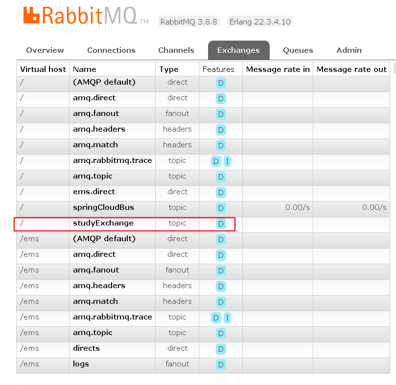

- 启动8801

- 访问  http://localhost:8801/sendMessage 多刷新几次

  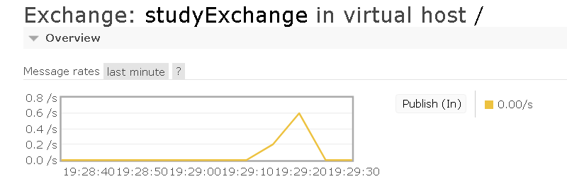

  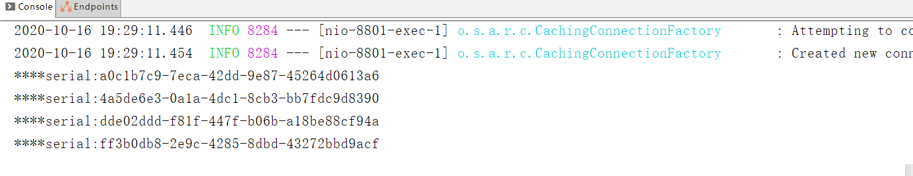

  

## 消息驱动之消费者

1.新建Module  cloud-stream-rabbitmq-consumer8802

2.POM

```xml
<dependencies>
        <!--stream rabbit-->
        <dependency>
            <groupId>org.springframework.cloud</groupId>
            <artifactId>spring-cloud-starter-stream-rabbit</artifactId>
        </dependency>
        <dependency>
            <groupId>org.springframework.cloud</groupId>
            <artifactId>spring-cloud-starter-netflix-eureka-client</artifactId>
        </dependency>
        <!--web-->
        <dependency>
            <groupId>org.springframework.boot</groupId>
            <artifactId>spring-boot-starter-web</artifactId>
        </dependency>
        <dependency>
            <groupId>org.springframework.boot</groupId>
            <artifactId>spring-boot-starter-actuator</artifactId>
        </dependency>
        <!--一般基础通用配置-->
        <dependency>
            <groupId>org.springframework.boot</groupId>
            <artifactId>spring-boot-devtools</artifactId>
            <scope>runtime</scope>
            <optional>true</optional>
        </dependency>
        <dependency>
            <groupId>org.projectlombok</groupId>
            <artifactId>lombok</artifactId>
            <optional>true</optional>
        </dependency>
        <dependency>
            <groupId>org.springframework.boot</groupId>
            <artifactId>spring-boot-starter-test</artifactId>
            <scope>test</scope>
        </dependency>
    </dependencies>
```


3.YML

```yaml
server:
  port: 8802

spring:
  application:
    name: cloud-stream-consumer
  cloud:
    stream:
      binders: # 在此处配置要绑定的rabbitmq的服务信息：
        defaultRabbit: #表示定义的名称，用于于binding整合
          type: rabbit # 消息组件类型
          environment: #设置rabbitmq的相关环境配置
            spring:
              rabbitmq:
                host: 192.168.1.130
                port: 5672
                username: guest
                password: guest
      bindings: # 服务的整合处理
        input: # 这个名字是一个通道名称
          destination: studyExchange # 表示使用的Exchange名称定义
          content-type: application/json # 设置消息类型，本次为json,文本则设置为"text/plain"
          binder: defaultRabbit # 设置要绑定的消息服务的具体设置

# 服务注册到eureka
eureka:
  client:
    service-url:
      defaultZone: http://localhost:7001/eureka
  instance:
    lease-renewal-interval-in-seconds: 2 # 设置心跳的时间间隔（默认是30秒的）
    lease-expiration-duration-in-seconds: 5 # 如果现在超过了5秒的间隔（默认是90秒）
    instance-id: receive-8802.com # 在信息列表显示主机名称
    prefer-ip-address: true # 范围的路径变为ip地址
```


4.主启动类StreamMQMain8802

```java
package com.atguigu.springcloud;

import org.springframework.boot.SpringApplication;
import org.springframework.boot.autoconfigure.SpringBootApplication;

@SpringBootApplication
public class StreamMQMain8802 {
    public static void main(String[] args) {
        SpringApplication.run(StreamMQMain8802.class,args);
    }
}
```

5.业务类

```java
package com.atguigu.springcloud.controller;

import org.springframework.beans.factory.annotation.Value;
import org.springframework.cloud.stream.annotation.EnableBinding;
import org.springframework.cloud.stream.annotation.StreamListener;
import org.springframework.cloud.stream.messaging.Sink;
import org.springframework.messaging.Message;
import org.springframework.stereotype.Component;

@Component
@EnableBinding(Sink.class)
public class ReceiveMessageListenerController {
    @Value("${server.port}")
    private String serverPort;

    @StreamListener(Sink.INPUT)
    public void input(Message<String> message){
        System.out.println("消费者1号，---->接收到的消息: "+message.getPayload()+"\t port: "+serverPort);
    }
}
```

6.测试8801发送8802接收消息

​	http://localhost:8801/sendMessage

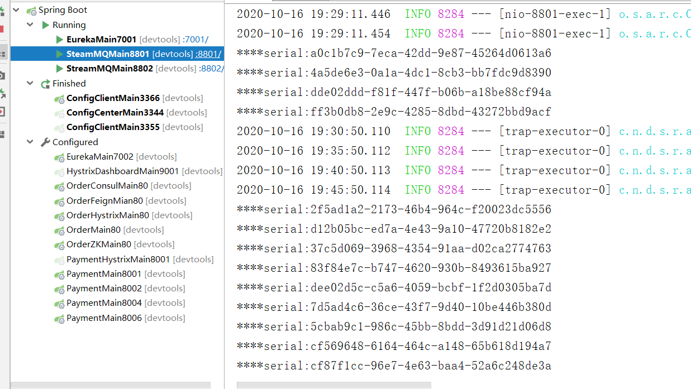


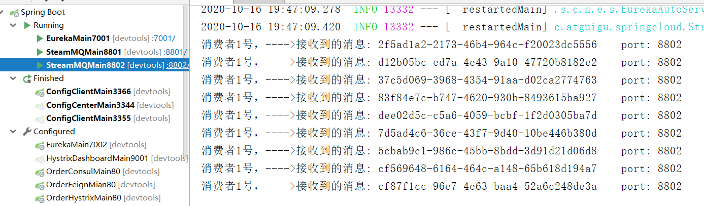

## 分组消费与持久化

1.依照8802，clone出来一份运行8803，注意yml中更改8802为8803以及代码中对应的更改

​	cloud-stream-rabbitmq-consumer8803

2.启动

- RabbitMQ
- 7001服务注册
- 8801消息生产
- 8802消息消费
- 8803消息消费

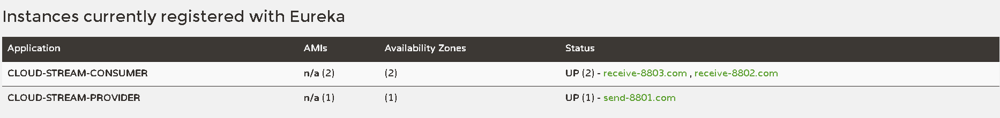

3.运行后两个问题.

- 有重复消费问题
- 消息持久化问题

4.消费，目前是8802/8803同时都收到了，存在重复消费问题

- http://localhost:8801/sendMessage

- 如何解决

  分组和持久化属性group

- 生产实际案例

  比如在如下场景中,订单系统我们做集群部署,都会从 Rabbitmq中获取订单信息,那**如果一个订单同时被两个服务获取到**,那么就会造成**数据错**误,我们得避免这种情况。这时我们就可以使用 **Stream中的消息分组**来解决

  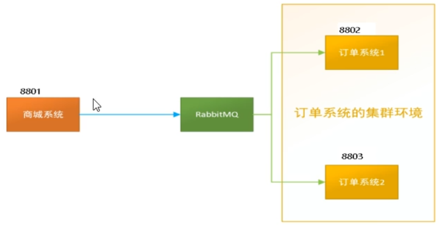

  注意在 Stream中处于同一个 group中的多个消费者是竟争关系,就能够保证消息只会被其中一个应用消费次。**不同组是可以全面消费的(重复消费)**,

  **同一组内会发生竟争关系,只有其中一个可以消费。**

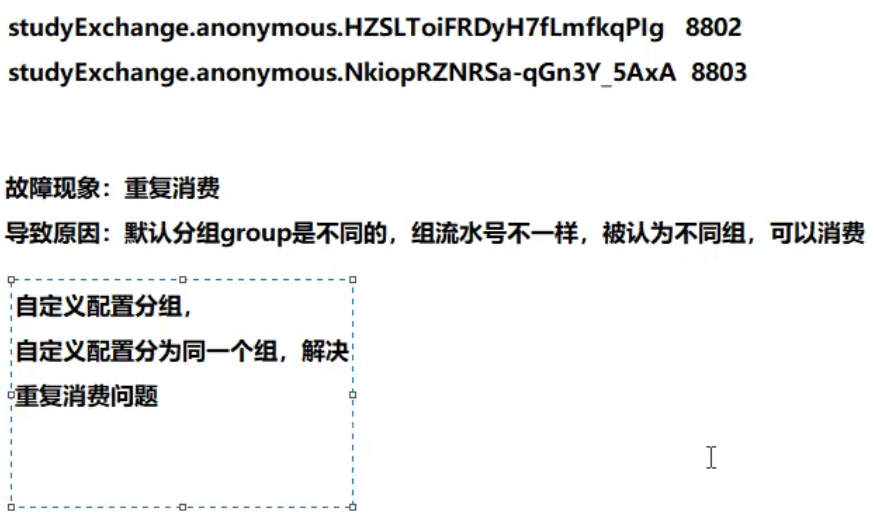

### 分组

#### 原理

微服务应用放置于同一个group中，就能够保证消息只会被其中一个应用消费一次。**不同的组是可以消费的，同一个组内会发生竞争关系，只有其中一个可以消费。**

#### 8802/8803都变成不同组，group两个不同

- group: atguiguA、atguiguB

- 8802修改YML

  ```yaml
  # 在binder下面添加
  group: atguiguA
  ```

- 8803修改YML

  ```yaml
  # 在binder下面添加
  group: atguiguB
  ```

- 我们自己配置

  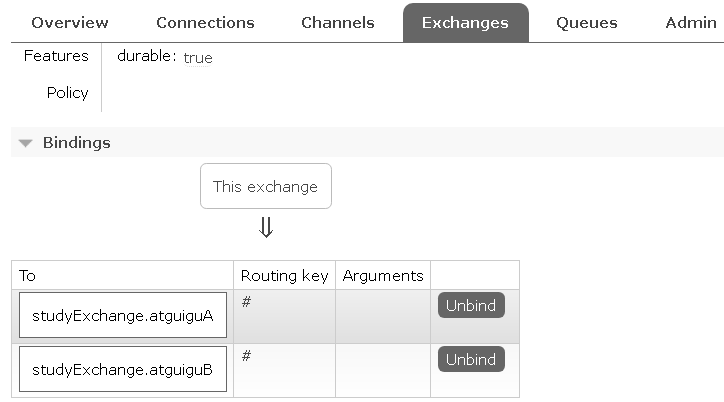

  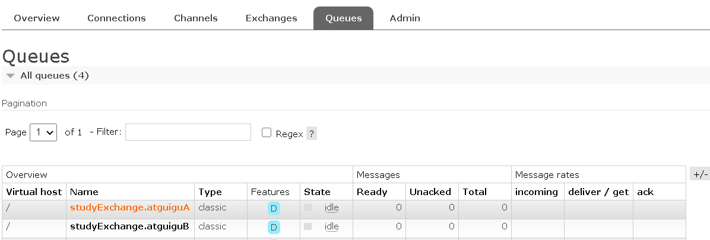

  分布式微服务应用为了实现高可用和负载均衡,实际上都会部署多个实例,本例阳哥启动了两个消费微服务(8802/8803)

  多数情况,生产者发送消息给某个具体微服务时只希望被消费一次,按照上面我们启动两个应用的例子,虽然它们同属一个应用,但是这个消怠出现了被重复消费两次的情况。为了解决这个冋题,在 Spring Cloud Stream中提供了**消费组**的概念。

- 结论  还是重复消费

  

  

8802/8803实现了轮询分组，每次只有一个消费者 8801模块的发的消息只能被8802或8803其中一个接收到，这样避免了重复消费

#### 8802/8803都变成相同组，group两个相同

- group: atguiguA

- 8802修改YML

  ```Yaml
  # 在binder下面添加
  group: atguiguA
  ```

- 8803修改YML

  ```yaml
  # 在binder下面添加
  group: atguiguB
  ```

  

- 结论

  同一个组的多个微服务实例，每次只会有一个拿到

### 持久化

通过上述，解决了重复消费问题，再看看持久化

- 停止8802/8803并去除掉8802的分组group:atguiguA

  8803的分组group:atguiguA没有去掉

- 8801先发送4条信息到rabbitmq

- 先启动8802，无分组属性配置，后台没有打出来消息

- 先启动8803，有分组属性配置，后台打出来了MQ上的消息

# 第15章 SpringCloud Sleuth分布式请求链路追踪

## 概述

### 为什么会出现这个技术？需要解决哪些问题？

在微服务框架中,一个由客户端发起的请求在后端系统中会经过多个不同的的服务节点调用来协同产生最后的请求结果,每—个前段请求都会形成—条复杂的分布式服务调用链路,链路中的任何_环岀现髙延时或错误都会引起整个请求最后的失败。


复杂的链路：


### 是什么

https://github.com/spring-cloud/spring-cloud-sleuth

https://spring.io/projects/spring-cloud-sleuth#overview

https://docs.spring.io/spring-cloud-sleuth/docs/2.2.5.RELEASE/reference/html/

Spring Cloud Sleuth提供了一套完整的服务跟踪的解决方案

在分布式系统中提供追踪解决方案并且兼容支持了zipkin

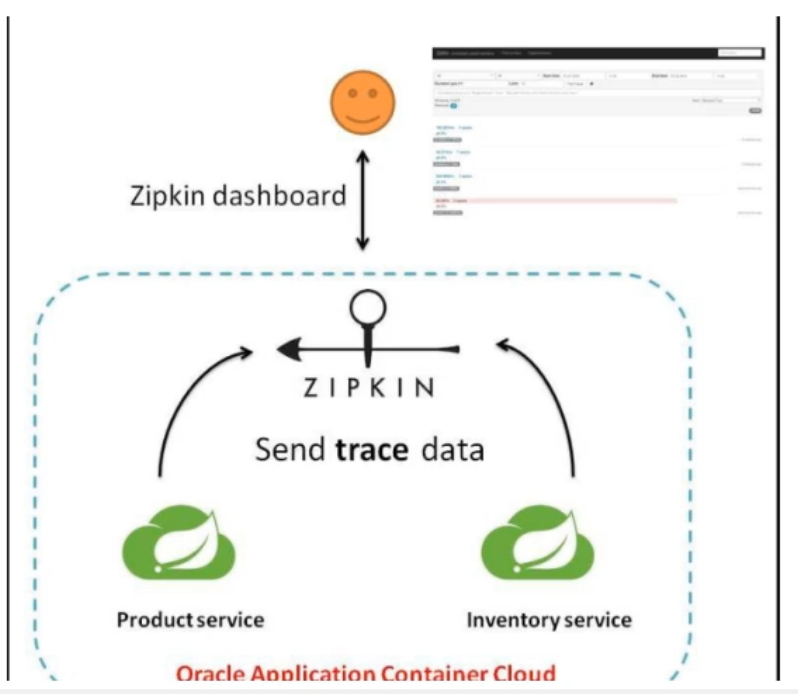

## 搭建链路监控步骤

### 1.zipkin

#### 下载

SpringCloud从F版起已不需要自己构建Zipkin server了，只需要调用jar包即可

https://dl.bintray.com/openzipkin/maven/io/zipkin/java/zipkin-server/

上阿里云maven仓库下载速度快

zipkin-server-2.12.9.exec.jar

#### 运行jar

```bash
java -jar zipkin-server-2.12.9-exec.jar
```

#### 运行控制台

http://localhost:9411/zipkin/

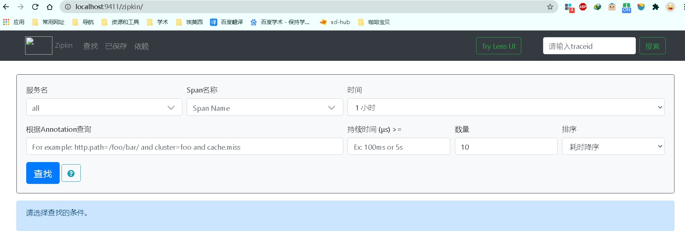

术语

- 完整的调用链路

  表示—请求链路,一条链路通过 Trace ld唯标识,Span标识发起的请求信息,各span通过 parent id关联起来

  

- 上图what

  一条链路通过 Trace ld唯一标识,Span标识发起的请求信息,各span通过 parent id关联起来

  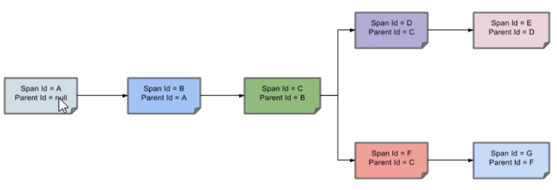

  整个链路的依赖关系如下:

  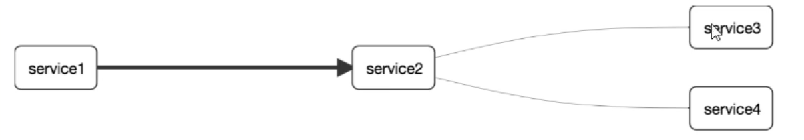

- 名词解释

  - Trace:类似于树结构的Span集合，表示一条调用链路，存在唯一标识
  - span:表示调用链路来源，通俗的理解span就是一次请求信息

### 2.服务提供者

cloud-provider-payment8001

POM

下面依赖如果有的话就不要动了，没有就加进来

```xml
<!-- 包含了sleuth zipkin 数据链路追踪-->
<dependency>
    <groupId>org.springframework.cloud</groupId>
    <artifactId>spring-cloud-starter-zipkin</artifactId>
</dependency>
```

YML

```yaml
# ...省略，还是原来的
spring:
  application:
    name: cloud-payment-service
  zipkin:
    base-url: http://localhost:9411
  sleuth:
    sampler: #采样率值介于0到1之间，1则表示全部采集
      probability: 1
# ...省略，还是原来的
```

controller中加入方法：

```java
@GetMapping("/payment/zipkin")
public String paymentZipkin(){
    return "hi,I am paymentZipkin server fall back, welcome to atguigu,哈哈";
}
```

### 3.服务消费者（调用方）

cloud-consumer-order80

POM

```xml
<!-- 包含了sleuth zipkin 数据链路追踪-->
<dependency>
    <groupId>org.springframework.cloud</groupId>
    <artifactId>spring-cloud-starter-zipkin</artifactId>
</dependency>
```

YML

```yaml
# ...省略，还是原来的
spring:
  application:
    name: cloud-order-service
  zipkin:
    base-url: http://localhost:9411
  sleuth:
    sampler: #采样率值介于0到1之间，1则表示全部采集
      probability: 1
# ...省略，还是原来的
```

业务类OrderController

```java
//=======>zipkin+sleuth
@GetMapping("/consumer/payment/zipkin")
public String paymentZipkin(){
    return restTemplate.getForObject("http://localhost:8001"+"/paymnet/zipkin",String.class);
}
```

4.依次启动eureka7001/8001/80

80调用8001几次测试下

http://localhost/consumer/payment/zipkin

5.打开浏览器访问:http:localhost:9411

会出现以下界面

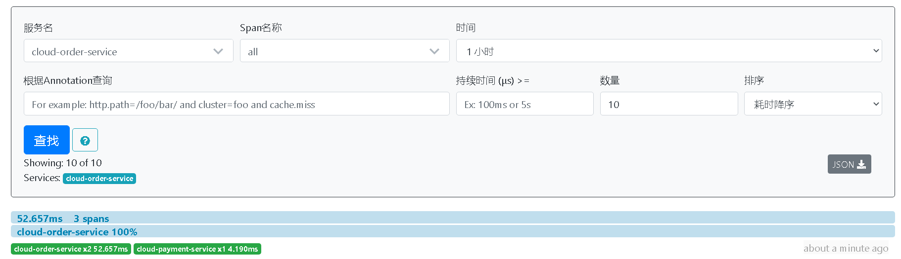

查看依赖关系

原理

# 第16章 SpringCloud Alibaba入门简介

## why会出现SpringCloud alibaba

https://spring.io/blog/2018/12/12/spring-cloud-greenwich-rc1-available-now

Spring Cloud Netflix项目进入维护模式

**什么是维护模式**

将模块置于维护模式,意味着 Spring Cloud团队将不会再向模块添加新功能。我们将修复 block级别的bug以及安全问题,我们也会考虑并审查社区的小型 pull request

**进入维护模式意味着**

Spring Cloud Netflix将不再开发新的组件我们都知道 Spring Cloud版本迭代算是比较快的,因而出现了很多重大SSUE都还来不及Fⅸ就又推另-个 Release了。进入维护模式意思就是目前直以后一段时间 Spring Cloud Netflix提供的服务和功能就这么多了,不在开发新的组件和功能了。以后将以维护和 Merge分支Fu‖ Request为主

新组件功能将以其他替代平代替的方式实现

唉，商业上的爱恨情仇

套娃，一层包一层

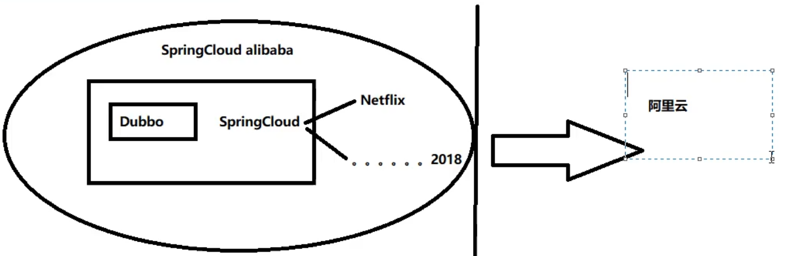

## SpringCloud alibaba带来了什么？

### 是什么

https://github.com/alibaba/spring-cloud-alibaba/blob/master/README-zh.md

诞生:

20181031, Spring Cloud Alibaba正式入驻了 Spring Cloud官方孵化器,并在 Maven中央库发布了第一个版本

### 能干嘛

服务限流阵趿:默认支持 Servlet、 Feign、Restτ emplate、Dubo和 Rocketmq限流降级功能的接入,可以在运行时通过控制台实时修改限流降级规则,还支持查看限流降级 Metrics

监控服务注册与发现:适配 Spring Cloud服务注册与发现标准,默认集成了 Ribbon的支持。

分布式配置管理:支持分布式系统中的外部化配置,配置更改时自动刷新消息驱动能力:基于 Spring Cloud Stream为微服务应用构建消息驱动能力。

阿里云对象存储:阿里云提供的海量、安全、低成本、高可靠的云存储服务。支持在任何应用、任何时间、任何地点存储和访问任意类型的数据。

分布式任务调度:提供秒级、精准、高可靠、高可用的定时(基于cron表达式)任务调度服务。同时提供分布式的任务执行模型,如网格任务。网格任务支持海量子任务均匀分配到所有 Worker( schedulerx-client)上执行

### 去哪下

https://github.com/alibaba/spring-cloud-alibaba/blob/master/README-zh.md

## SpringCloud alibaba学习资料获取

官网

https://spring.io/projects/spring-cloud-alibaba#overview

英文

https://github.com/alibaba/spring-cloud-alibaba

https://spring-cloud-alibaba-group.github.io/github-pages/greenwich/spring-cloud-alibaba.html

中文

https://github.com/alibaba/spring-cloud-alibaba/blob/master/README-zh.md

# 第17章 SpringCloud Alibaba Nacos服务注册和配置中心

## Nacos简介

### 为什么叫Nacos

前四个字母分别为Naming和Configuration的前两个字母，最后的s为Service

### 是什么

一个更易于构建云原生应用的动态服务发现，配置管理和服务管理中心

Nacos：Dynamic Naming and Configuration Service

Nacos就是注册中心+配置中心的组合  等价于  Nacos = Eureka+Config+Bus

### 能干嘛

- 替代Eureka做服务注册中心

- 替代Config做服务配置中心

### 去哪下

https://github.com/alibaba/Nacos

官网文档

https://nacos.io/zh-cn/index.html

https://spring-cloud-alibaba-group.github.io/github-pages/greenwich/spring-cloud-alibaba.html#_spring_cloud_alibaba_nacos_discovery

### 各种注册中心比较

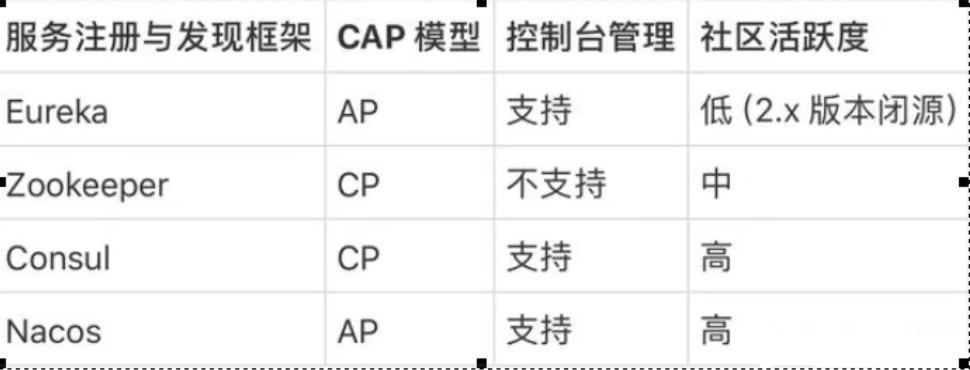

据说 Nacos在阿里巴巴内部有超过10万的实例运行,已经过了类似双十一等各种大型流量的考验

## 安装并运行Nacos

1.本地Java8+Maven环境已经OK

2.先从官网下载Nacos

​	https://github.com/alibaba/nacos/releases/tag/1.3.2

3.解压安装包，直接运行bin目录下的startup.cmd

​	将startup.cmd中的集群模式改为单机模式

4.命令运行成功后直接访问http://localhost:8848/nacos

​	默认账号密码都是nacos

5.结果页面

​	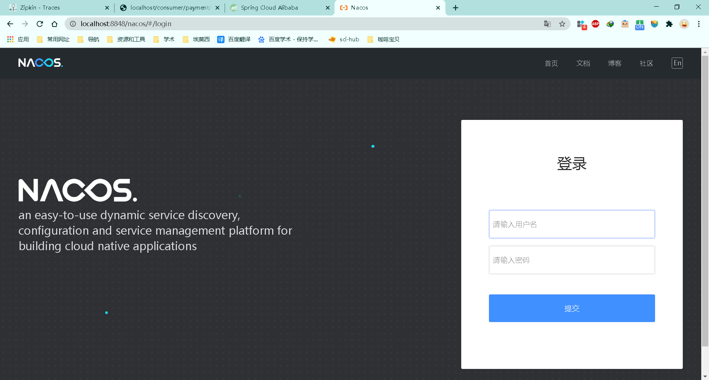

## Nacos作为服务注册中心演示

官网文档https://spring-cloud-alibaba-group.github.io/github-pages/hoxton/en-us/index.html#_spring_cloud_alibaba_nacos_discovery

### 基于Nacos的服务提供者

1.新建Module cloudalibaba-provider-payment9001

2.POM

父POM

```xml
<dependency>
    <groupId>com.alibaba.cloud</groupId>
    <artifactId>spring-cloud-alibaba-dependencies</artifactId>
    <version>2.2.3.RELEASE</version>
    <type>pom</type>
    <scope>import</scope>
</dependency>
```

本模块POM

```xml
<dependency>
    <groupId>com.alibaba.cloud</groupId>
    <artifactId>spring-cloud-starter-alibaba-nacos-discovery</artifactId>
</dependency>
```

3.YML

```yaml
server:
  port: 9001
spring:
  application:
    name: nacos-payment-provider
  cloud:
    nacos:
      discovery:
        server-addr: localhost:8848 # 配置Nacos地址
management:
  endpoints:
    web:
      exposure:
        include: "*"

```


4.主启动

```java
package com.atguigu.springcloud.alibaba;

import org.springframework.boot.SpringApplication;
import org.springframework.boot.autoconfigure.SpringBootApplication;
import org.springframework.cloud.client.discovery.EnableDiscoveryClient;

@EnableDiscoveryClient
@SpringBootApplication
public class PaymentMain9001 {
    public static void main(String[] args) {
        SpringApplication.run(PaymentMain9001.class,args);
    }
}

```


5.业务类

```java
package com.atguigu.springcloud.alibaba.controller;

import org.springframework.beans.factory.annotation.Value;
import org.springframework.web.bind.annotation.GetMapping;
import org.springframework.web.bind.annotation.PathVariable;
import org.springframework.web.bind.annotation.RestController;

@RestController
public class PaymentController {
    @Value("${server.port}")
    private String serverPort;

    @GetMapping(value = "/payment/nacos/{id}")
    public String getPayment(@PathVariable("id") Integer id){
        return "nacos registry, serverport: "+ serverPort+"\t id: "+id;
    }
}

```


6.测试

http://localhost:9001/payment/nacos/1

http://localhost:8848/nacos/

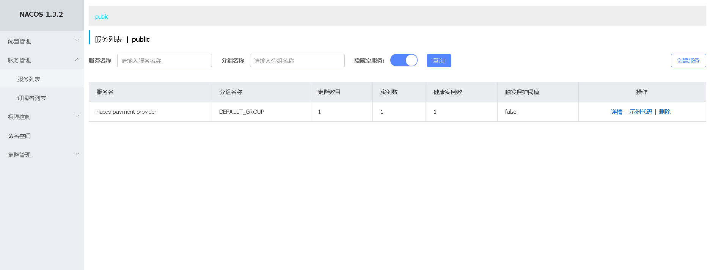


nacos服务注册中心+服务提供者9001都ok了

7.为了下一章节演示nacos的负载均衡，参照9001新建9002

新建cloudalibaba-provider-payment9002

9002其他步骤你懂的

或者取巧不想新建重复体力劳动，直接拷贝虚拟端口映射

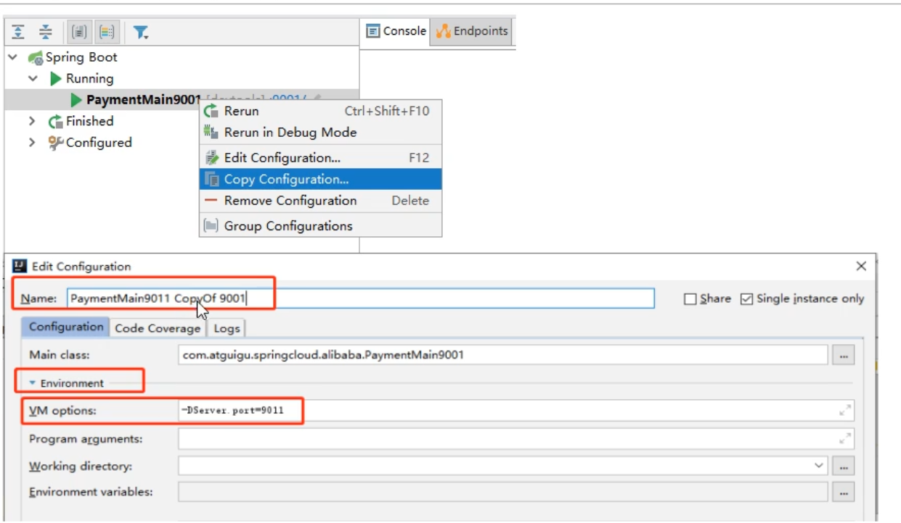

### 基于Nacos的服务消费者

1.新建Module    cloudalibaba-consumer-nacos-order83

2.POM

```xml
<dependencies>
        <!--SpringCloud ailibaba nacos -->
        <dependency>
            <groupId>com.alibaba.cloud</groupId>
            <artifactId>spring-cloud-starter-alibaba-nacos-discovery</artifactId>
        </dependency>
        <!-- 引入自己定义的api通用包，可以使用Payment支付Entity -->
        <dependency>
            <groupId>com.atguigu.springcloud</groupId>
            <artifactId>cloud-api-commons</artifactId>
            <version>${project.version}</version>
        </dependency>
        <!-- SpringBoot整合Web组件 -->
        <dependency>
            <groupId>org.springframework.boot</groupId>
            <artifactId>spring-boot-starter-web</artifactId>
        </dependency>
        <dependency>
            <groupId>org.springframework.boot</groupId>
            <artifactId>spring-boot-starter-actuator</artifactId>
        </dependency>
        <!--日常通用jar包配置-->
        <dependency>
            <groupId>org.springframework.boot</groupId>
            <artifactId>spring-boot-devtools</artifactId>
            <scope>runtime</scope>
            <optional>true</optional>
        </dependency>
        <dependency>
            <groupId>org.projectlombok</groupId>
            <artifactId>lombok</artifactId>
            <optional>true</optional>
        </dependency>
        <dependency>
            <groupId>org.springframework.boot</groupId>
            <artifactId>spring-boot-starter-test</artifactId>
            <scope>test</scope>
        </dependency>
    </dependencies>
```

为什么nacos支持负载均衡

nacos集成了netflix-ribbon

3.YML

```yaml
server:
  port: 83
spring:
  application:
    name: nacos-order-consumer
  cloud:
    nacos:
      discovery:
        server-addr: localhost:8848 # 配置Nacos地址

# 消费者将要去访问的微服务名称（注册成功进nacos的微服务提供者）
service-url:
  nacos-user-service: http://nacos-payment-provider

```


4.主启动

```java
package com.atguigu.springcloud.alibaba;

import org.springframework.boot.SpringApplication;
import org.springframework.boot.autoconfigure.SpringBootApplication;
import org.springframework.cloud.client.discovery.EnableDiscoveryClient;

@EnableDiscoveryClient
@SpringBootApplication
public class OrderNacosMain83 {
    public static void main(String[] args) {
        SpringApplication.run(OrderNacosMain83.class,args);
    }
}

```

5.业务类

ApplicationContextBean:

```java
package com.atguigu.springcloud.alibaba.config;

import org.springframework.context.annotation.Bean;
import org.springframework.context.annotation.Configuration;
import org.springframework.web.client.RestTemplate;

@Configuration
public class ApplicationContextConfig {
    @Bean
    @LoadBalanced
    public RestTemplate getRestTamplate(){
        return new RestTemplate();
    }
}

```


OrderNacosController:

```java
package com.atguigu.springcloud.alibaba.controller;

import lombok.extern.slf4j.Slf4j;
import org.springframework.beans.factory.annotation.Value;
import org.springframework.web.bind.annotation.GetMapping;
import org.springframework.web.bind.annotation.PathVariable;
import org.springframework.web.bind.annotation.RestController;
import org.springframework.web.client.RestTemplate;

import javax.annotation.Resource;

@RestController
@Slf4j
public class OrderNacosController {
    @Resource
    private RestTemplate restTemplate;

    @Value("${service-url.nacos-user-service}")
    private String serverURL;

    @GetMapping(value = "/consumer/payment/nacos/{id}")
    public String paymentInfo(@PathVariable("id") Long id){
        return restTemplate.getForObject(serverURL+"/payment/nacos/"+id,String.class);
    }
}

```

6.测试

nacos控制台

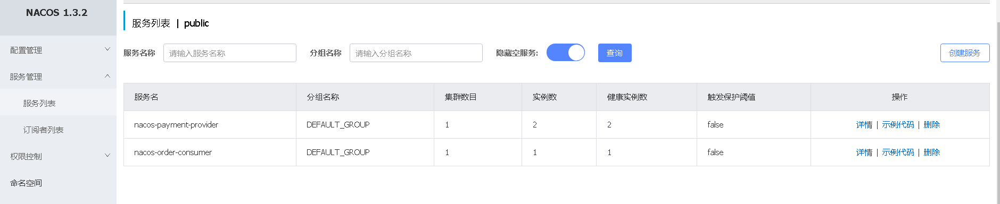

http://localhost:83/consumer/payment/nacos/13  83访问9001/9002，轮询负载OK

### 服务注册中心对比

#### Nacos全景图所示


#### Nacos和CAP

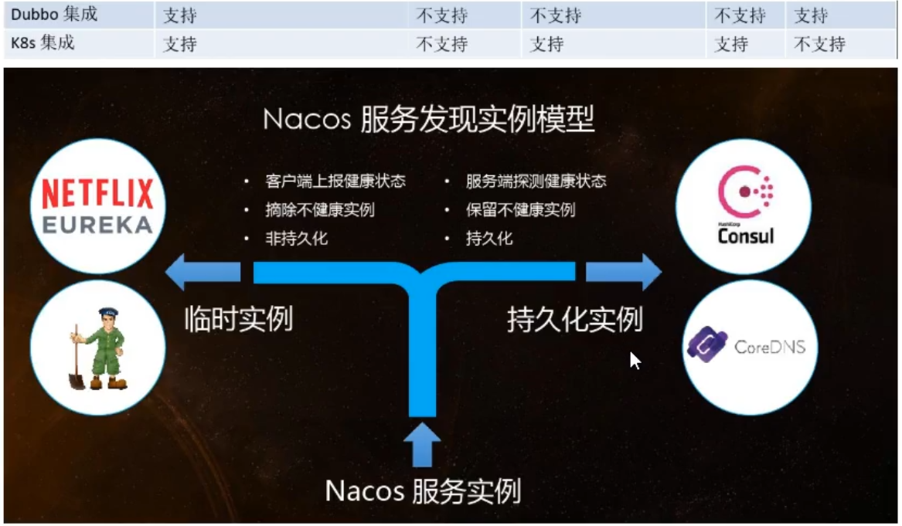

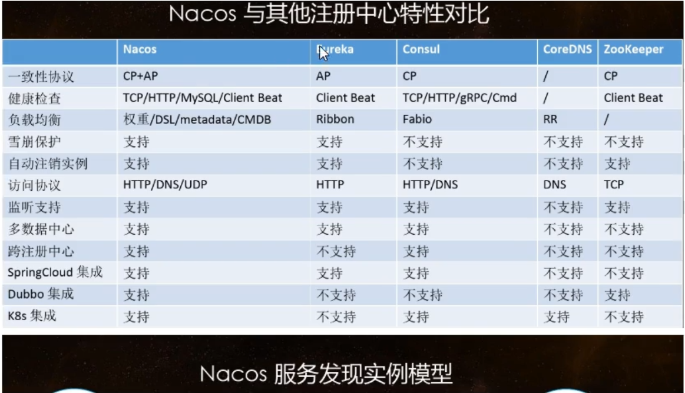

#### Nacos支持AP和CP模式的切换

C是所有节点在同一时间看到的数据是一致的;而A的定义是所有的请求都会收到响应

何时选择使用何种模式?

一般来说,如果不需要存储服务级别的信息囯服务实例是通过ηacos- client.注册,并能够倸持心跳上报,那么就可以选择AP模式。当前主流的服务如 Spring cloud和 Dubbo服务,都适用于AP模式,AP模式为了服务的可能性而减弱了一致性,因此AP模式下只支持注册临时实例.

如果需要在服务级别编辑或者存储配置信息,那么CP是必须,K8S服努和DNS服务则适用于CP模式CP模式下则攴持注册持久化实例,此时则是以Raft协议为集群运行模式,该模式下注册实例之前必须先注册服努,如果服务不存在,则会返回错误。

curl-x PUT'SNACOS SERVER: 8848/nacos/v1/ns/operator/switches?entry=servermode &value=CP

## Nacos作为服务配置中心演示

### Nacos作为配置中心-基础配置

1.cloudalibaba-config-nacos-client3377

2.POM

```xml
<dependencies>
    <!--nacos-config-->
    <dependency>
        <groupId>com.alibaba.cloud</groupId>
        <artifactId>spring-cloud-starter-alibaba-nacos-config</artifactId>
    </dependency>
    <!--nacos-discovery-->
    <dependency>
        <groupId>com.alibaba.cloud</groupId>
        <artifactId>spring-cloud-starter-alibaba-nacos-discovery</artifactId>
    </dependency>
    <!--web + actuator-->
    <dependency>
        <groupId>org.springframework.boot</groupId>
        <artifactId>spring-boot-starter-web</artifactId>
    </dependency>
    <dependency>
        <groupId>org.springframework.boot</groupId>
        <artifactId>spring-boot-starter-actuator</artifactId>
    </dependency>
    <!--一般基础配置-->
    <dependency>
        <groupId>org.springframework.boot</groupId>
        <artifactId>spring-boot-devtools</artifactId>
        <scope>runtime</scope>
        <optional>true</optional>
    </dependency>
    <dependency>
        <groupId>org.projectlombok</groupId>
        <artifactId>lombok</artifactId>
        <optional>true</optional>
    </dependency>
    <dependency>
        <groupId>org.springframework.boot</groupId>
        <artifactId>spring-boot-starter-test</artifactId>
        <scope>test</scope>
    </dependency>
</dependencies>
```

3.YML

application.yml

```yaml
spring:
  profiles:
    active: dev # 表示开发环境
```

bootstrap.yml

```yaml
server:
  port: 3377

spring:
  application:
    name: nacos-config-client
  cloud:
    nacos:
      discovery:
        server-addr: localhost:8848 # nacos服务注册中心地址
      config:
        server-addr: localhost:8848 # nacos作为配置中心地址
        file-extension: yml #指定yaml格式的配置

# ${Spring.application.name}-{spring.profile.active}.${spring.cloud.nacos.config.file-extension}
```

why配置两个

Nacos同 springcloud- config样,在项目初始化时,要保证先从配置中心进行配置拉取,拉取配置之后,才能保证项目的正常启动

springboot中配置文件的加载是存在优先级顺序的, **bootstrap优先级高于 application**

4.主启动

```java
package com.atguigu.springcloud.alibaba;

import org.springframework.boot.SpringApplication;
import org.springframework.boot.autoconfigure.SpringBootApplication;
import org.springframework.cloud.client.discovery.EnableDiscoveryClient;

@EnableDiscoveryClient
@SpringBootApplication
public class NacosConfigClientMain3377 {
    public static void main(String[] args) {
        SpringApplication.run(NacosConfigClientMain3377.class,args);
    }
}

```


5.业务类

ConfigClientController

```java
package com.atguigu.springcloud.alibaba.controller;

import org.springframework.beans.factory.annotation.Value;
import org.springframework.cloud.context.config.annotation.RefreshScope;
import org.springframework.web.bind.annotation.GetMapping;
import org.springframework.web.bind.annotation.RestController;

@RestController
@RefreshScope//支持Nacos的动态刷新功能
public class ConfigClientController {
    @Value("${config.info}")
    private String configInfo;

    @GetMapping("/config/info")
    public String getConfigInfo(){
        return configInfo;
    }
}

```

@RefreshScope

通过SpringCloud原生注解实现配置自动更新

#### 6.在Nacos中添加配置信息

Nacos中的匹配规则

##### 理论

- Nacos中的dataid的组成格式与SpringBoot配置文件中的匹配规则

- 官网https://nacos.io/zh-cn/docs/quick-start-spring-cloud.html

  说明：之所以需要配置 `spring.application.name` ，是因为它是构成 Nacos 配置管理 `dataId`字段的一部分。

  在 Nacos Spring Cloud 中，`dataId` 的完整格式如下：

  ```
  ${prefix}-${spring.profiles.active}.${file-extension}
  ```

  - `refix` 默认为 `spring.application.name` 的值，也可以通过配置项 `spring.cloud.nacos.config.prefix`来配置。
  - `spring.profiles.active` 即为当前环境对应的 profile，详情可以参考 [Spring Boot文档](https://docs.spring.io/spring-boot/docs/current/reference/html/boot-features-profiles.html#boot-features-profiles)。 **注意：当 `spring.profiles.active` 为空时，对应的连接符 `-` 也将不存在，dataId 的拼接格式变成 `${prefix}.${file-extension}`**
  - `file-exetension` 为配置内容的数据格式，可以通过配置项 `spring.cloud.nacos.config.file-extension` 来配置。目前只支持 `properties` 和 `yaml` 类型。
  - 通过 Spring Cloud 原生注解 `@RefreshScope` 实现配置自动更新：

最后公式

```java
${Spring.application.name}-{spring.profile.active}.${spring.cloud.nacos.config.file-extension}
```

##### 实操

###### 配置新增

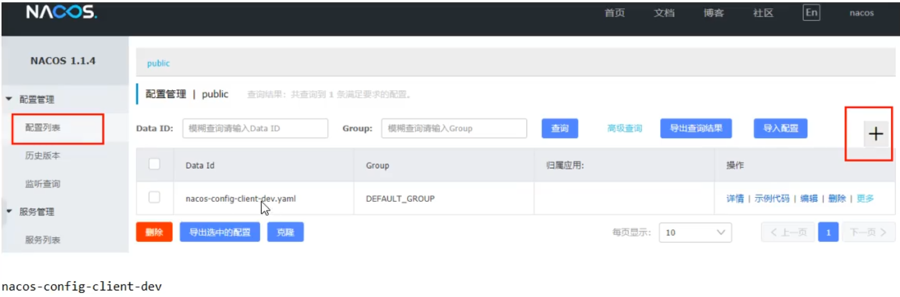

###### Nacos界面配置对应

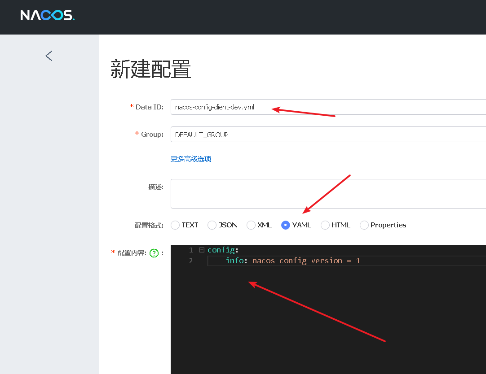

设置DataId

- 公式 

  ```
  ${spring.application.name}-${spring.profile.active}.${spring.cloud.nacos.config.file-extension}
  ```

- prefix默认为spring.application.name的值

- spring.profile.active既为当前环境对应的profile,可以通过配置项spring.profile.active 来配置

- file-exetension为配置内容的数据格式，可以通过配置项spring.cloud.nacos.config.file-extension配置

- 小总结说明

  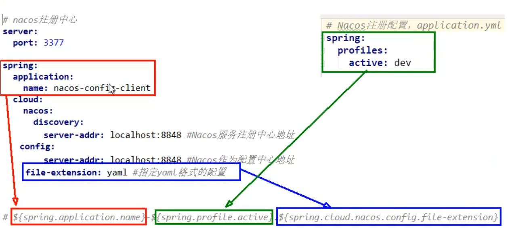


###### 历史配置

7.测试

启动前需要在nacos客户端-配置管理-配置管理栏目下有没有对应的yaml配置文件

运行cloud-config-nacos-client3377的主启动类

调用接口查看配置信息http://localhost:3377/config/info

8.自带动态刷新

修改下Nacos中的yaml配置文件，再次调用查看配置的接口，就会发现配置已经刷新

### Nacos作为配置中心-分类配置

**问题 : 多环境多项目管理**

问题1:实际开发中,通常一个系统会准备ev开发环境test测试环境prod生产环境。如何保证指定环境启动时服务能正确读取到№acσs上相应环境的配置文件呢?

问题2一个大型分布式微服务系统会有很多微服务子项目,每个微服务项目又都会有相应的开发环境、测试环境、预发环境、正式环境.那怎么对这些微服务配置进行管理呢?

**Nacos的图形化管理界面**

- 配置管理

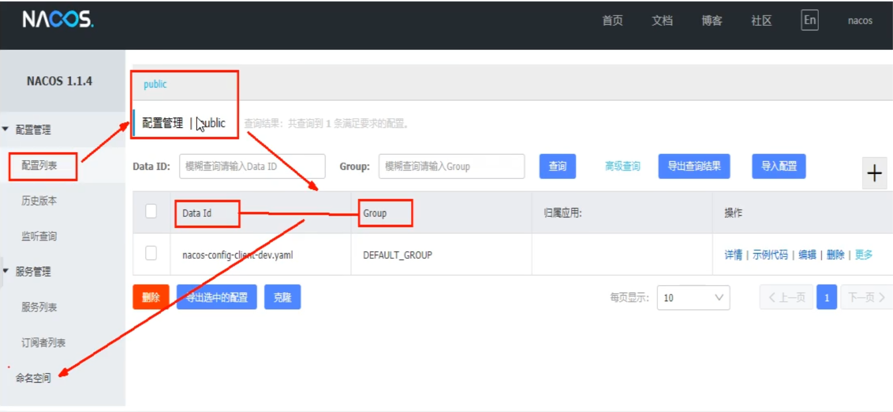

- 命名空间

  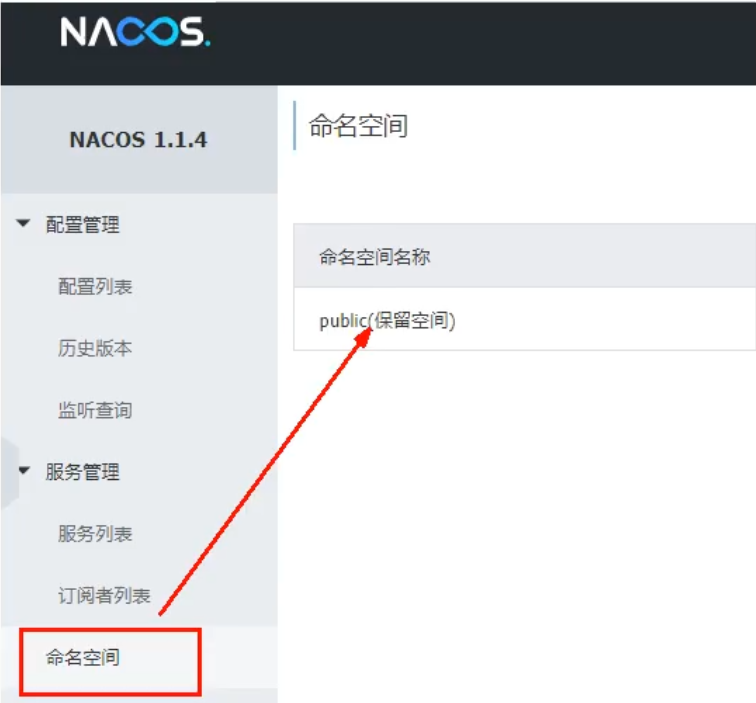

**Namespace+Group+Data ID三者关系？为什么这么设计？**

是什么?

类似Java里面的 package名和类名

最外层的 namespace是可以用于区分部署环境的, Groupi和 Datai逻辑上区分两个目标对象

三者情况

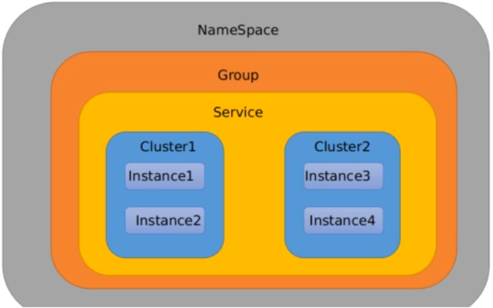

默认情况:**Namespace= public, Group= DEFAULT GROUP,默认 Cluster是 DEFAULT**

Nacos默认的命名空间是 public, Namespace主要用来实现隔离

比方说我们现在有三个环境:开发、测试、生产环境,我们就可以创建三个 Namespace,不同的 Namespace之间是隔离的

Group默认是 DEFAULT GROUP, Group可以把不同的微服务划分到同个分组里面去

Service就是微服务;—个 Service可以包含多个 Cluster(集群), Nacos默认 Cluster是 DEFAULT, 

Cluster是对指定微服务的个虚拟划分比方说为了容灾,将 Service微服务分别部署在了杭州机房和广州机房,这时就可以给杭州机房的 Service微服务起一个集群名称(Hz),给广州机房的 Service微服务起—个集群名称(Gz),还可以尽量让同一个机房的微服务互相调用,以提升性能。

最后是 nstance,就是微服务的实例

#### DataID方案

1.指定spring.profile.active和配置文件的DataID来使不同环境下读取不同的配置

2.默认空间+默认分组+新建dev和test两个DataID

- 新建dev配置DataID
- 新建test配置DataID

3.通过spring.profile.active属性就能进行多环境下配置文件的读取

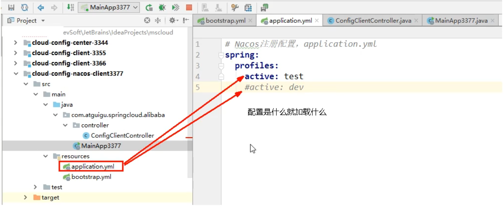

4.测试

- http://localhost:3377/config/info
- 配置是什么就加载什么 test

#### Group方案

1.通过Group实现环境区分  新建Group

2.在nacos图形界面控制台上面新建配置文件DataID

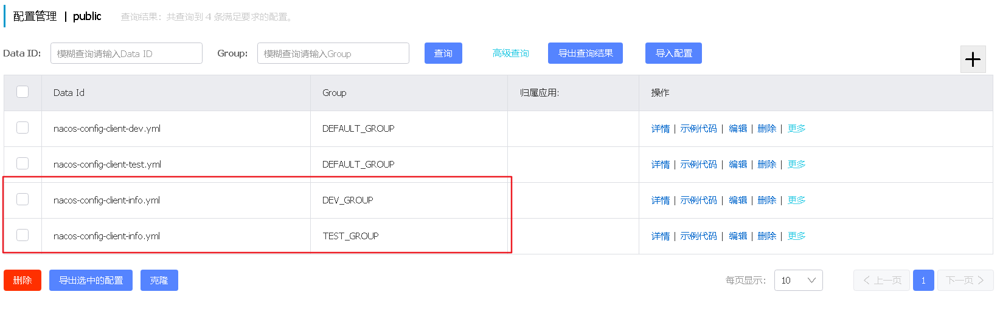

3.bootstrap+application   

在config下增加一条group的配置即可。可配置为DEV_GROUP或TEST_GROUP

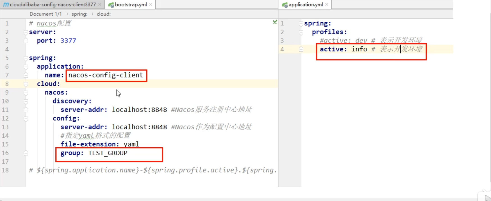

#### Namespace方案

1.新建dev/test的Namespace

2.回到服务管理-服务列表查看.

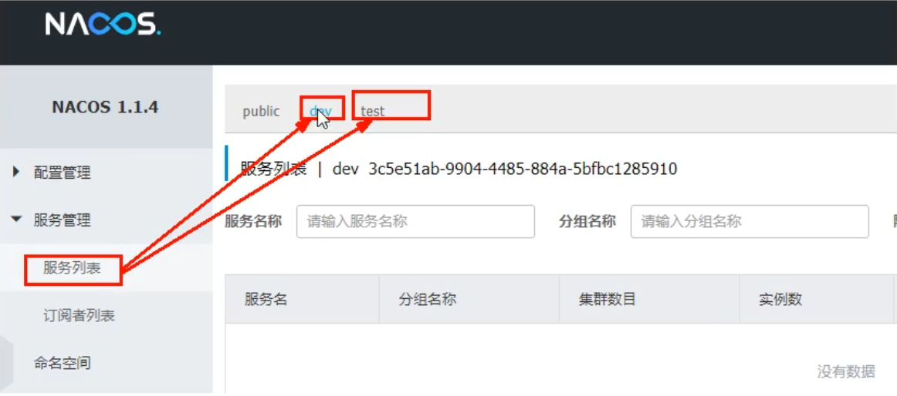

3.按照域名配置填写.

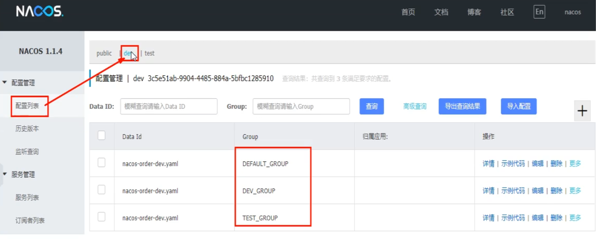

4.YML

- bootstrap
- application

## Nacos集群和持久化配置（重要）

### 官网说明

https://nacos.io/zh-cn/docs/cluster-mode-quick-start.html

官网架构图（写的(┬＿┬)）

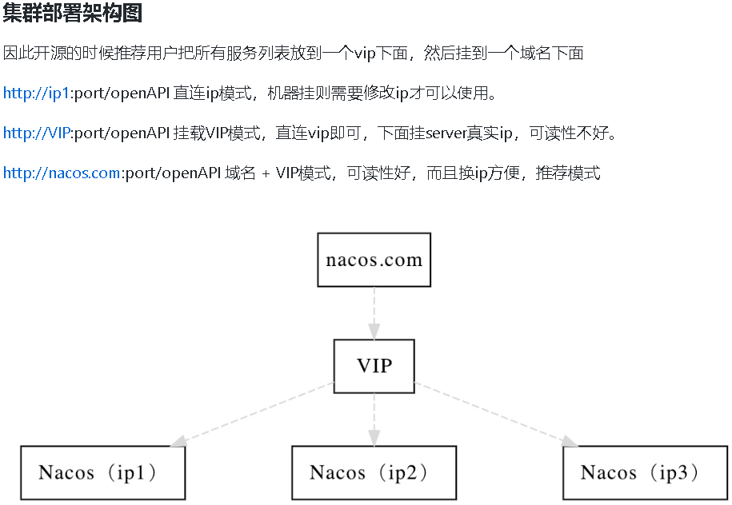

上图官网翻译，真实情况

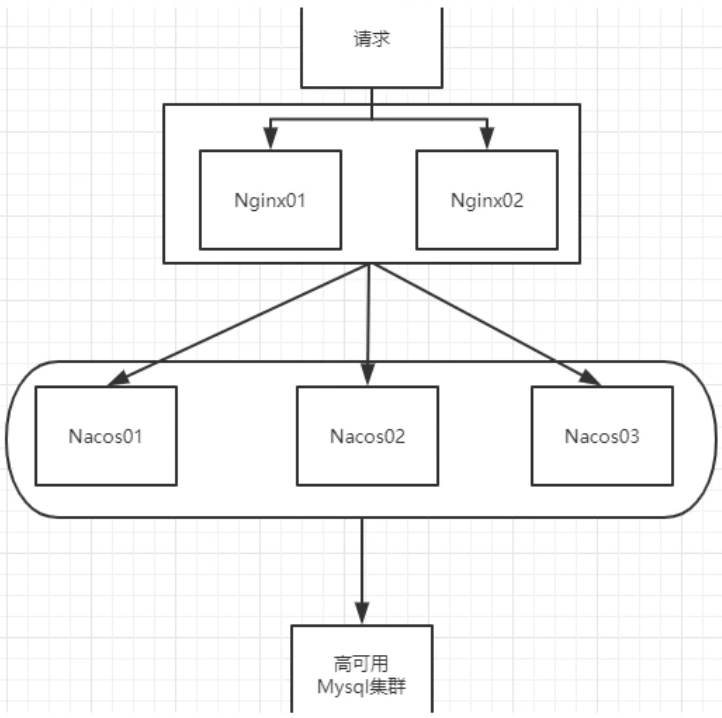

#### 说明

默认Nacos使用嵌λ式数据库实现数据的存储。所以,如果启动多个默认配置下的Nac。s节点,数据存储是存在-致性冋题的。为了解决这个问题, Nacos釆用了**集中式存储的方式来支持集群化部署,目前只支持 MYSQL的存储**

Nacos支持三种部署模式：

- 单机模式-用于测试和单机试用

- **集群模式-用于生产环境,确保高可用。**

- 多集群模式-用于多数据中心场景。

Windows

cmd startup. cmd或者双击 startup. cmd文件

单机模式支持 mysql

在0.7版本之前,在单机模式时 nacos使用嵌入式数据库实现数据的存储,不方便观察数据存储的基本情况。0.7版本增加了支持mysql数据源能力,具体的操作步骤:

1.安装数据库,版本要求:5.6.5+

2.初始化mysq数据库,数据库初始化文件: nacos- mysql. sql

3.修改 conf/application properties文件,增加支持mysq数据源配置(目前只支持mysq),添加mysq据源的ur、用户名和密码。

```properties
spring.datasource.platform=mysql

db.num=1
db.url.0=jdbc:mysql://11.162.196.16:3306/nacos_devtest?characterEncoding=utf8&connectTimeout=1000&socketTimeout=3000&autoReconnect=true
db.user=nacos_devtest
db.password=youdontknow
```


再以单机模式启动 nacos, nacos所有写嵌)式数据库的数据都写到了mysql

按照上述，我们需要mysql数据库

官网说明

https://nacos.io/zh-cn/docs/deployment.html

重点说明

### Nacos持久化配置解释

#### Nacos默认自带的是嵌入式数据库derby

https://github.com/alibaba/nacos/blob/develop/config/pom.xml

#### derby到mysql切换配置步骤

1.nacos-server-1.1.4\nacos\conf目录下找到sql脚本

​	nacos-mysql.sql	

​	执行脚本

2.nacos-server-1.1.4\nacos\conf目录下找到application.properties

```properties
spring.datasource.platform=mysql

db.num=1
db.url.0=jdbc:mysql://11.162.196.16:3306/nacos_config?characterEncoding=utf8&connectTimeout=1000&socketTimeout=3000&autoReconnect=true
db.user=root
db.password=root
```

注意：使用MySQL8时，

1.去下载一个mysql-connector-java-8.0.17.jar,

2.放到nacos\plugins\mysql目录下

#### 启动nacos

启动nacos,可以看到是个全新的空记录界面，以前是记录进derby

### Linux版Nacos+MySQL生产环境配置

预计需要，1个nginx+3个nacos注册中心+1个mysql

#### Nacos下载linux版本

- 1.预备环境准备

请确保是在环境中安装使用:

1.64 bit OS Linux/unx/Mac,推荐使用Linux系统

2.64 bit JDK1.8+;下载配置

3.Maven3.2x+;下载配置。

4.3个或3个以上 Nacos节点才能构成集群。

- 2.下载源码或者安装包

你可以通过两种方式来获取 Nacos。从 Github上下载源码方式

https://github.com/alibaba/nacos/releases/tag/1.3.2

nacos-server-1.3.2.tar.gz

解压后安装

```bash
tar -zxvf nacos-server-1.3.2.tar.gz 

# 可选步骤：复制解压后的文件夹为mynacos（为了备份作用）
cp cp -r nacos mynacos
#进入mynacos

#备份启动文件
cp startup.sh startup.sh.bk
```

#### 集群配置步骤（重点）

##### 1.Linux服务器上mysql数据库配置

```bash
#mysql服务是否启动
mysqld status #没有启动

#启动mysql服务
service mysqld start
#登录mysql
mysql -uroot -p #回车后输入密码
#创建数据库
mysql> create database nacos_config;
mysql> use nacos_config;

#执行sql脚本
source /opt/mynacos/conf/nacos-mysql.sql
#成功
```

##### 2.application.properties配置

位置：/opt/nacos/conf

修改配置文件

```properties
#*************** Config Module Related Configurations ***************#
### If use MySQL as datasource:
spring.datasource.platform=mysql
### 数据库实例数量:(使用了几个mysql，这里是1)
db.num=1
### 第1个数据库实例(从0开始)
db.url.0=jdbc:mysql://127.0.0.1:3306/nacos_config?characterEncoding=utf8&connectTimeout=1000&socketTimeout=3000&autoReconnect=true&useUnicode=true&useSSL=false&serverTimezone=UTC
db.user=root
db.password=root
```


##### 3.Linux服务器上nacos的集群配置cluster.conf

- 梳理出3台nacos机器的不同服务端口号

- 复制出cluster.conf

  位置：/opt/mynacos/conf

  ```bash
  cp cluster.conf.example cluster.conf
  vim cluster.conf
  ```

  

- 这个IP不能写127.0.0.1,必须是Linux命令hostname -I能够识别的IP

  三台虚拟机

```properties
192.169.1.130:8848
192.169.1.131:8848
192.169.1.101:8848
```

##### 4.Nacos的启动脚本startup.sh

​	**./startup.sh**

##### 5.Nginx的配置，由它作为负载均衡器

修改nginx的配置文件

nginx.conf

```
upstream cluster{
        server 192.168.1.130:8848;# 填写三台虚拟机的nacos
        server 192.168.1.131:8848;
        server 192.168.1.101:8848;
}
server {
        listen       1111; #监听的端口，后面要用
        listen       [::]:80 default_server;
        server_name  localhost;
        root         /usr/share/nginx/html;

        # Load configuration files for the default server block.
        include /etc/nginx/default.d/*.conf;

        location / {
            proxy_pass http://cluster;
        }
        …………
```


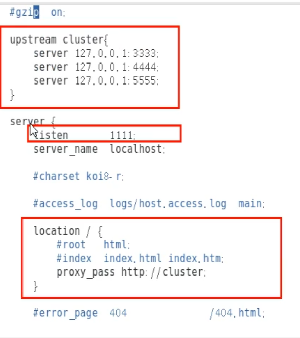

按照指定启动

```bash
# nginx根据配置文件启动
nginx -c /etc/nginx/nginx.conf
#如果中途有修改配置文件
nginx -s reload 
```

##### 6.截止到此处，1个Nginx+3个nacos注册中心+1个mysql

- 测试通过nginx访问nacos

  https://写你自己虚拟机的ip:1111/nacos/#/login

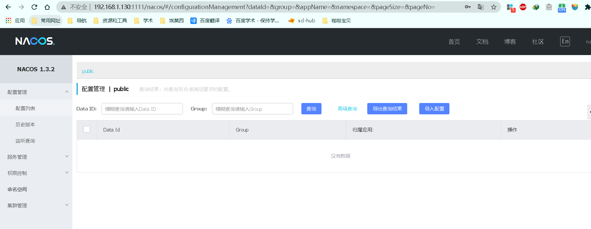

- 新建一个配置测试

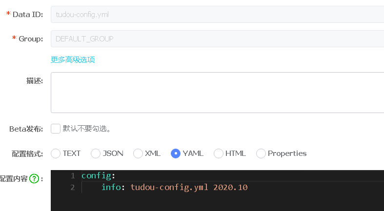

- 在mysql中查询看看

```mysql
use nacos_config;
select * from config_info;
```


#### 测试

微服务cloudalibaba-provider-payment9002启动注册进nacos集群

yml

```yaml
 server-addr: 192.168.1.130:1111 # 换成nginx的1111端口，做集群
```

结果


#### 高可用小总结

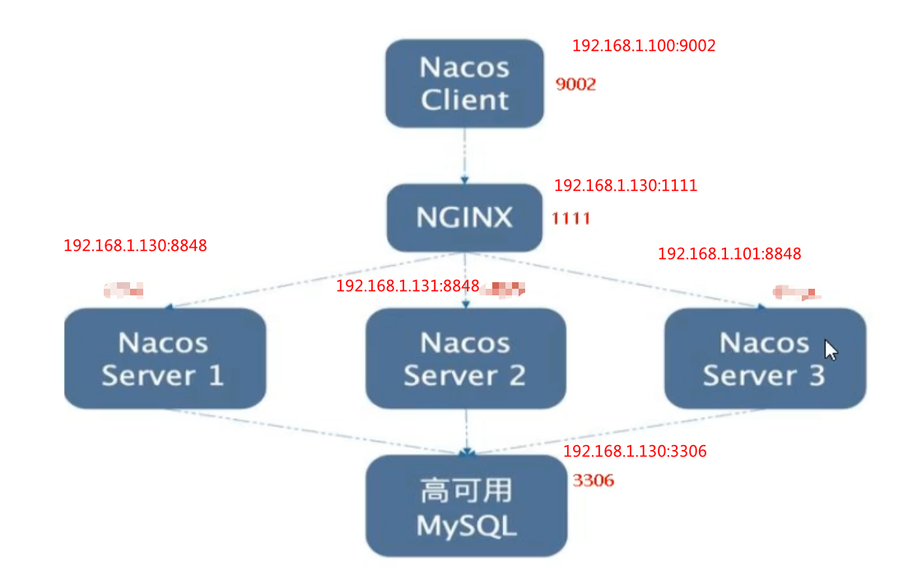

# 第18章 SpringCloud Alibaba Sentinel实现熔断与限流

## Sentinel

面向云原生微服务的高可用流控防护组件

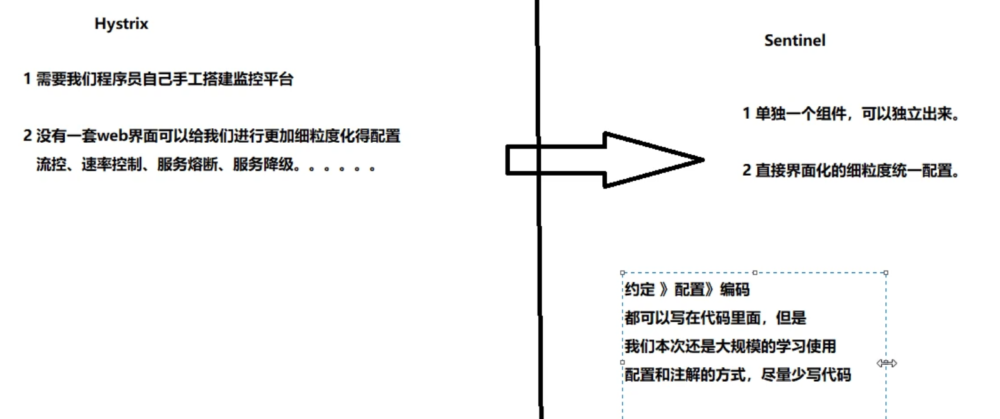

官网

https://github.com/alibaba/Sentinel

https://github.com/alibaba/Sentinel/wiki/%E4%BB%8B%E7%BB%8D

是什么  一句话解释，之前我们讲解过的Hystrix

去哪下  https://github.com/alibaba/Sentinel/releases

能干嘛


怎么玩

https://spring-cloud-alibaba-group.github.io/github-pages/greenwich/spring-cloud-alibaba.html#_spring_cloud_alibaba_sentinel

服务使用中的各种问题

- 服务雪崩
- 服务降级
- 服务熔断
- 服务限流

## 安装Sentinel控制台

sentinel组件由2部分组成  后台   前台8080

- 核心库(Java客户端)不依赖任何框架/库,能够运行于所有 Java运行时环境,同时对Dubo/Spring Cloud等框架也有较好的支持。
- 控制台( Dashboard)基于 Spring Boot开发,打包后可以直接运行,不需要额外的 Tomcat等应用容器。

下载  https://github.com/alibaba/Sentinel/releases

安装步骤

- 前提: java8环境OK+8080端口不能被占用

- 运行命令 java -jar sentinel-dashboard-1.7.0.jar

访问sentinel管理界面  http://localhost:8080  登录账号密码均为sentinel

## 初始化演示工程

启动Nacos8848成功 http://localhost:8848/nacos/#/login

### cloudalibaba-sentinel-service8401

POM

```xml
<dependencies>
    <!--SpringCloud ailibaba nacos -->
    <dependency>
        <groupId>com.alibaba.cloud</groupId>
        <artifactId>spring-cloud-starter-alibaba-nacos-discovery</artifactId>
    </dependency>
    <!--SpringCloud ailibaba sentinel-datasource-nacos 后续做持久化用到-->
    <dependency>
        <groupId>com.alibaba.csp</groupId>
        <artifactId>sentinel-datasource-nacos</artifactId>
    </dependency>
    <!--SpringCloud ailibaba sentinel-->
    <dependency>
        <groupId>com.alibaba.cloud</groupId>
        <artifactId>spring-cloud-starter-alibaba-sentinel</artifactId>
    </dependency>
    <!--openfeign-->
    <dependency>
        <groupId>org.springframework.cloud</groupId>
        <artifactId>spring-cloud-starter-openfeign</artifactId>
    </dependency>
    <!-- SpringBoot整合Web组件 -->
    <dependency>
        <groupId>org.springframework.boot</groupId>
        <artifactId>spring-boot-starter-web</artifactId>
    </dependency>
    <dependency>
        <groupId>org.springframework.boot</groupId>
        <artifactId>spring-boot-starter-actuator</artifactId>
    </dependency>
    <!--日常通用jar包配置-->
    <dependency>
        <groupId>org.springframework.boot</groupId>
        <artifactId>spring-boot-devtools</artifactId>
        <scope>runtime</scope>
        <optional>true</optional>
    </dependency>
    <dependency>
        <groupId>org.projectlombok</groupId>
        <artifactId>lombok</artifactId>
        <optional>true</optional>
    </dependency>
    <dependency>
        <groupId>org.springframework.boot</groupId>
        <artifactId>spring-boot-starter-test</artifactId>
        <scope>test</scope>
    </dependency>
</dependencies>
```

YML

```yaml
server:
  port: 8401
spring:
  application:
    name: cloudalibaba-sentinel-service
  cloud:
    nacos:
      discovery:
        server-addr: localhost:8848 # nacos服务注册中心地址
    sentinel:
      transport:
        dashboard: localhost:8080 # sentinel dashboard地址
        port: 8719 #默认8719端口，若被占用则会自动从8719开始+1扫描，直到未被占用的端口
management:
  endpoints:
    web:
      exposure:
        include: '*'

```

主启动

```java
package com.atguigu.springcloud.alibaba;

import org.springframework.boot.SpringApplication;
import org.springframework.boot.autoconfigure.SpringBootApplication;
import org.springframework.cloud.client.discovery.EnableDiscoveryClient;

@EnableDiscoveryClient
@SpringBootApplication
public class MainApp8401 {
    public static void main(String[] args) {
        SpringApplication.run(MainApp8401.class,args);
    }
}

```

业务类FlowLimitController

```java
package com.atguigu.springcloud.alibaba.controller;

import org.springframework.web.bind.annotation.GetMapping;
import org.springframework.web.bind.annotation.RestController;

@RestController
public class FlowLimitController {
    @GetMapping("/testA")
    public String testA(){
        return "----testA";
    }

    @GetMapping("/testB")
    public String testB(){
        return "----testB";
    }
}

```

### 测试

启动Sentinel8080  java -jar sentinel-dashboard-1.8.0

启动微服务8401

启动8401微服务后查看sentienl控制台   空空如也，啥都没有

Sentinel采用的懒加载说明

- 执行一次访问即可http://localhost:8401/testA   http://localhost:8401/testB 使劲刷新看看

- 效果

  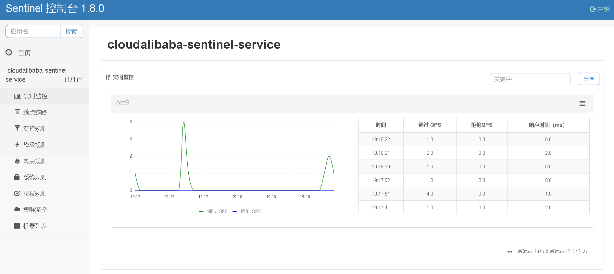

结论  sentinel8080正在监控微服务8401

## 流控规则

### 基本介绍

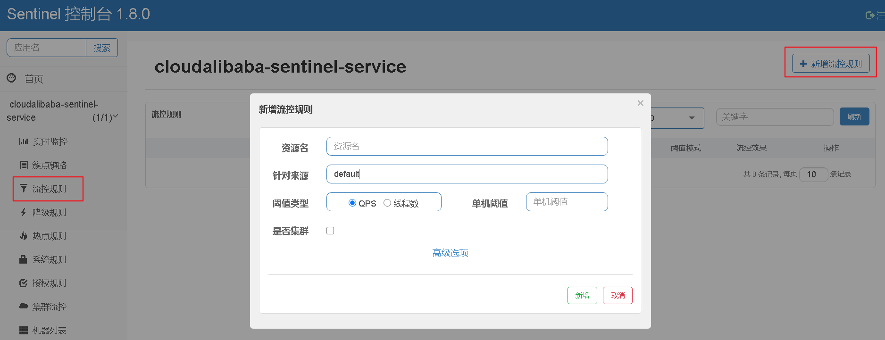

- 资源名:唯一名称,默认请求路径
- 针对来源: Sentinel可以针对调用者进行限流,填写微服务名,默认 default(不区分来源
- 阈值类型/单机阈值
  - QPS(每秒钟的诮求数量):当调用该api的QPS达到阈值的时候,进行限流
  - 线程数:当调用该ap的线程数达到阈值的时候,进行限流
- 是否集群:不需要集群
- 流控横式
  - 直接:api达到限流条件时,直接限流
  - 关联:当关联的资源达到阈值时,就限流自己
  - 链路:只记录指定链路上的流量(指定资源从λ口资源进来的流量,如果达到阈值,就进行限流)【ai级别的针对来源】
- 流控效果:
  - 快速失败:直接失败,抛异常
  - Warm Up:根据 codeFactor(冷加载因子,默认3)的值,从阈值/ codeFactor,经过预热时长,才达到设置的QPS阈值
  - 排队等待:匀速排队,让请求以匀速的速度通过,阈值类型必须设置为QPS,否则无效

### 流控模式

#### 直接（默认）

直接->快速失败（系统默认）

配置及说明


**测试**   快速点击访问http://localhost:8401/testA

**结果**  Blocked by Sentinel (flow limiting)

**思考**？？？  直接调用默认报错信息，技术方面OK but，是否应该有我们自己的后续处理？

​	类似有一个fallback的兜底方法？


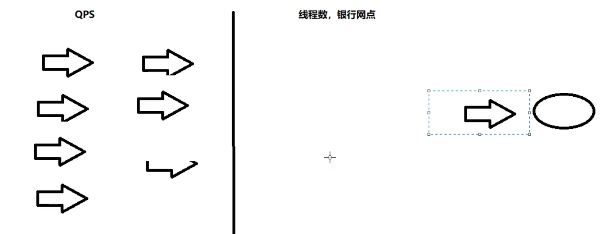

线程数:设置 /testA的流控规则线程数量为1，并让方法执行慢一点：

```java
@GetMapping("/testA")
public String testA(){
    try {
        TimeUnit.MILLISECONDS.sleep(800);
    }catch (InterruptedException e){
        e.printStackTrace();
    }
    return "----testA";
}
```

http://localhost:8401/testA 快速刷新几次,结果：

Blocked by Sentinel (flow limiting)


#### 关联

##### 是什么？

当关联的资源达到阈值时，就限流自己。

当与A关联的资源B达到阈值后，就限流自己(比如，当支付服务达到阈值后，就限流订单服务)

B惹事，A挂了


设置效果

当关联资源/tesB的QPS阀值超过1时,就限流/ testa的Rest访问地址,当关联资源到阈值后限制配置好的资源名

##### 配置A

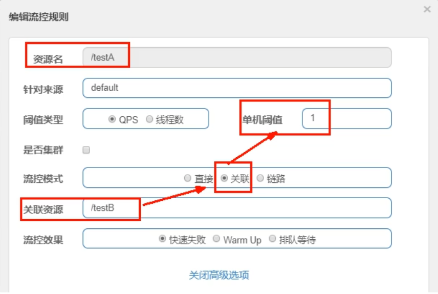

##### postman模拟并发密集访问testB

访问testB成功

postman里新建多线程集合组

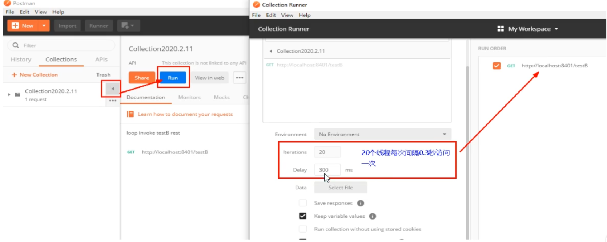

将访问地址添加进新线程组

Run    大批量线程高并发访问B，导致A失效了

##### 运行后发现testA挂了

点击访问http://localhost:8401/testA

结果   Blocked by Sentinel (flow limiting)

#### 链路

多个请求调用了同一个微服务

家庭作业试试

### 流控效果

#### 直接->快速失败（默认的流控处理）

直接失败，抛出异常   Blocked by Sentinel (flow limiting)

源码  com.alibaba.csp.sentinel.slots.block.flow.controller.DefaultController

#### 预热

**说明**

公式：阈值除以coldFactor（默认值为3），经过预热时长后才会达到阈值

**官网**

默认coldFactor为3，即请求QPS从threshold/3开始，经预热时长逐渐升至设定的QPS阈值。

限流 冷启动  https://github.com/alibaba/Sentinel/wiki/%E9%99%90%E6%B5%81---%E5%86%B7%E5%90%AF%E5%8A%A8

当流量突然增大的时候，我们常常会希望系统从空闲状态到繁忙状态的切换的时间长一些。即如果系统在此之前长期处于空闲的状态，我们希望处理请求的数量是缓步的增多，经过预期的时间以后，到达系统处理请求个数的最大值。Warm Up（冷启动，预热）模式就是为了实现这个目的的。


**源码**

com.alibaba.csp.sentinel.slots.block.flow.controller.WarmUpController

**Warmup配置**

默认 coldfactor为3,即请求QPS从 (threshold/3)开始,经多少预热时长才逐渐升至设定的QPS阈值

案例,阀值为10+预热时长设置5秒系统初始化的阀值为10/3约等于3即阀值刚开始为3;然后过了5秒后阀值才憬慢升高恢复到10

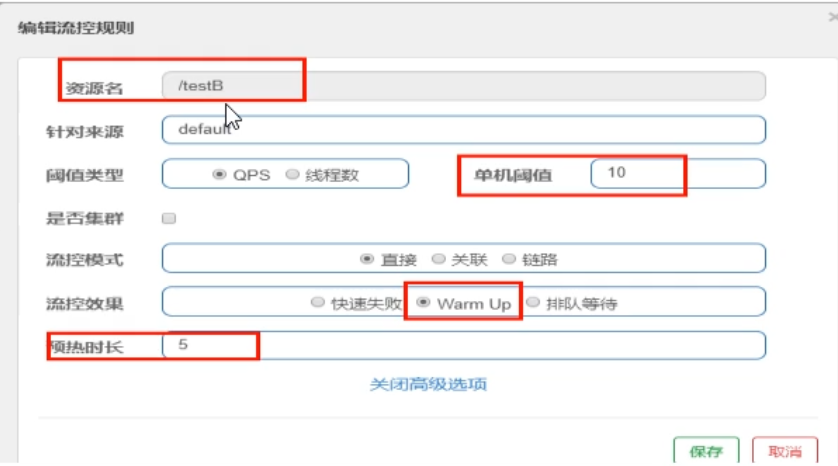

多次点击http://localhost:8401/testB   刚开始不行，后续慢慢OK

应用场景

如:秒杀系统在开启的瞬间,会有很多流量上来,很有可能把系统打死,预热方式就是把为了保护系统,可慢慢的把流量放进来,慢慢的把阀值增长到设置的阀值。

#### 排队等待

**匀速排队**,让请求以均匀的速度通过,阀值类型必须设成QPS,否则无效。

设置含义:/ testa每秒1次请求,超过的话就排队等待,等待的超时时间为20000毫秒

匀速排队，阈值必须设置为QPS

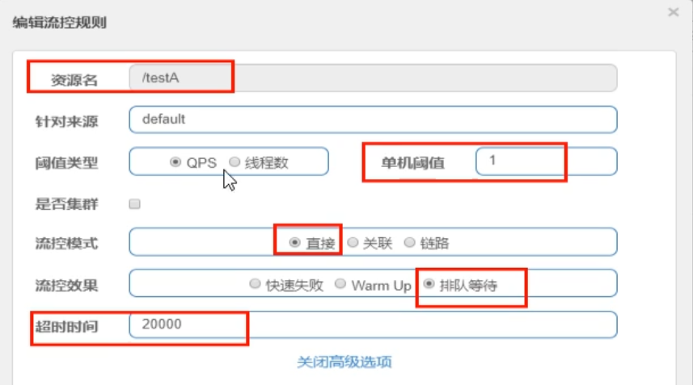

**官网**

匀速排队（`RuleConstant.CONTROL_BEHAVIOR_RATE_LIMITER`）方式会严格控制请求通过的间隔时间，也即是让请求以均匀的速度通过，对应的是漏桶算法。详细文档可以参考 [流量控制 - 匀速器模式](https://github.com/alibaba/Sentinel/wiki/流量控制-匀速排队模式)，具体的例子可以参见 [PaceFlowDemo](https://github.com/alibaba/Sentinel/blob/master/sentinel-demo/sentinel-demo-basic/src/main/java/com/alibaba/csp/sentinel/demo/flow/PaceFlowDemo.java)。

该方式的作用如下图所示：

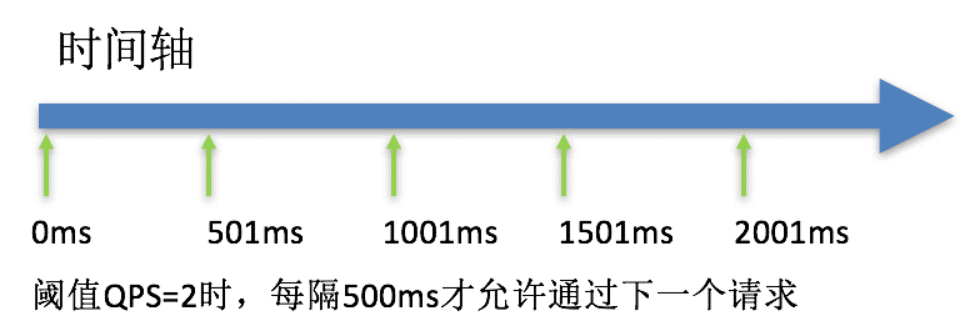

这种方式主要用于处理间隔性突发的流量，例如消息队列。想象一下这样的场景，在某一秒有大量的请求到来，而接下来的几秒则处于空闲状态，我们希望系统能够在接下来的空闲期间逐渐处理这些请求，而不是在第一秒直接拒绝多余的请求。

> 注意：匀速排队模式暂时不支持 QPS > 1000 的场景。

源码com.alibaba.csp.sentinel.slots.block.flow.controller.RateLimiterController

测试

```java
@GetMapping("/testB")
public String testB(){
    log.info(Thread.currentThread().getName()+"\t"+"...testB");
    return "----testB";
}
```


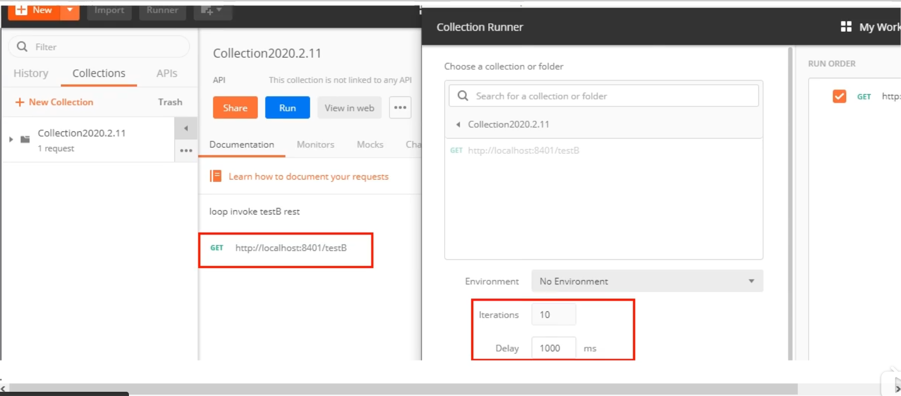

## 降级规则

官网 https://github.com/alibaba/Sentinel/wiki/%E7%86%94%E6%96%AD%E9%99%8D%E7%BA%A7

### 基本介绍

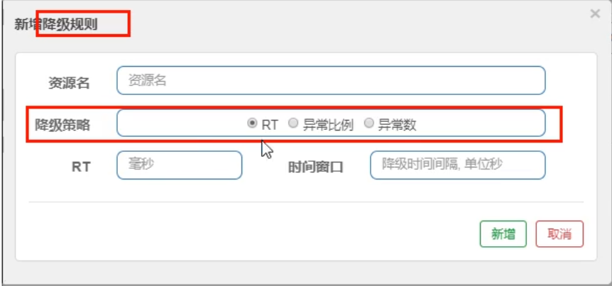

**RT(平均响应时间,秒级)**

平均响应时间**超出阈值**且**在时间窗口内通过的请求>=5**,两个条件同时满足后触发降级

窗口期过后关闭断路器

RT最大4900(更大的需要通过-Dcsp. sentinelstatistic. max rt=XXX才能生效

**异常比列(秒级)**

异常比列(秒级)QPS>=5且异常比例(秒级统计)超过阈值时,触发降级;时间窗口结束后,关闭降级

**异常数(分钟级)**

异常数(分钟统计)超过阈值时,触发降级;时间窗口结束后,关闭降级

#### 进一步说明

Sentinel 熔断降级会在调用链路中某个资源岀现不稳定状态时(例如调用超时或异常比例升高),对这个资源的调用进行限制,让请求快速失败,避免影响到其它的资源而导致级联错误。当资源被降级后,在接下来的降级时间窗口之内,对该资源的调用都自动熔断(默认行为是抛出 Degrade Exception)。

#### Sentinel的断路器是没有半开状态的

- 半开的状态系统自动去检测是否请求有异常，没有异常就关闭断路器恢复使用，有异常则继续打开断路器不可用。具体可以参考Hystrix

- 复习Hystrix

  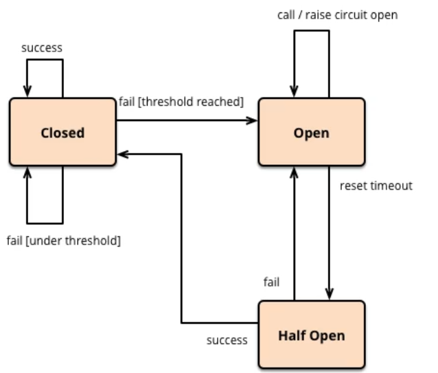

### 降级策略实战

1.7.0是平均响应时间，到了1.8.0被换成了慢调用比例 

- 平均响应时间( `DEGRADE GRADE RT`):当1s内持续进入5个请求,对应时刻的平均响应时间(秒级)均超过阈值( count,以ms为单位),那么在接下的时间窗口( Degrader中的imelindow,以s为单位)之内,对这个方法的调用都会自动地熔断(抛出ms,若需要变更此上限可以通过启动配置项05p, sentinel. statistic.max.rtx.线冷4900pegradeexceptioni。注意 Sentinel默认统计的RT上限是4900ms,**超出此阈值的都会算作4900ms**,若需要变更此上限可以通过启动配置项

  `-Dcsp. sentinel. statistic, max rt=xxx`来配置。

  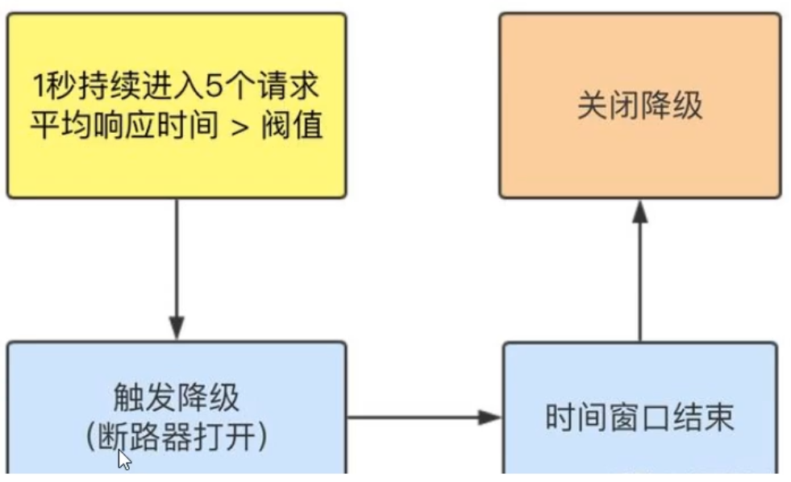

- 慢调用比例 (`SLOW_REQUEST_RATIO`)：选择以慢调用比例作为阈值，需要设置允许的慢调用 RT（即**最大的响应时间**），请求的响应时间大于该值则统计为慢调用。当单位统计时长（`statIntervalMs`）内请求数目大于设置的最小请求数目，并且慢调用的比例大于阈值，则接下来的熔断时长内请求会自动被熔断。经过熔断时长后熔断器会进入探测恢复状态（HALF-OPEN 状态），若接下来的一个请求响应时间小于设置的慢调用 RT 则结束熔断，若大于设置的慢调用 RT 则会再次被熔断。

  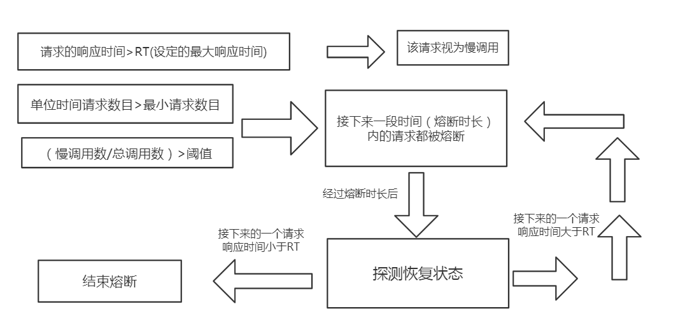

- 异常比例 (`ERROR_RATIO`)：当单位统计时长（`statIntervalMs`）内请求数目大于设置的最小请求数目，并且异常的比例大于阈值，则接下来的熔断时长内请求会自动被熔断。经过熔断时长后熔断器会进入探测恢复状态（HALF-OPEN 状态），若接下来的一个请求成功完成（没有错误）则结束熔断，否则会再次被熔断。异常比率的阈值范围是 `[0.0, 1.0]`，代表 0% - 100%。

- 异常数 (`ERROR_COUNT`)：当单位统计时长内的异常数目超过阈值之后会自动进行熔断。经过熔断时长后熔断器会进入探测恢复状态（HALF-OPEN 状态），若接下来的一个请求成功完成（没有错误）则结束熔断，否则会再次被熔断。

#### RT

​        平均响应时间( `DEGRADE GRADE RT`):当1s内持续进入5个请求,对应时刻的平均响应时间(秒级)均超过阈值( count,以ms为单位),那么在接下的时间窗口( Degrader中的imelindow,以s为单位)之内,对这个方法的调用都会自动地熔断(抛出ms,若需要变更此上限可以通过启动配置项05p, sentinel. statistic.max.rtx.线冷4900pegradeexceptioni。注意 Sentinel默认统计的RT上限是4900ms,**超出此阈值的都会算作4900ms**,若需要变更此上限可以通过启动配置项`-Dcsp. sentinel. statistic, max rt=xxx`来配置。

##### 测试

代码

```java
@GetMapping("/testD")
public String testD(){
    try {
        TimeUnit.SECONDS.sleep(1);
    }catch (InterruptedException e){
        e.printStackTrace();
    }
    log.info("testD RT");
    return "----testD";
}
```

配置

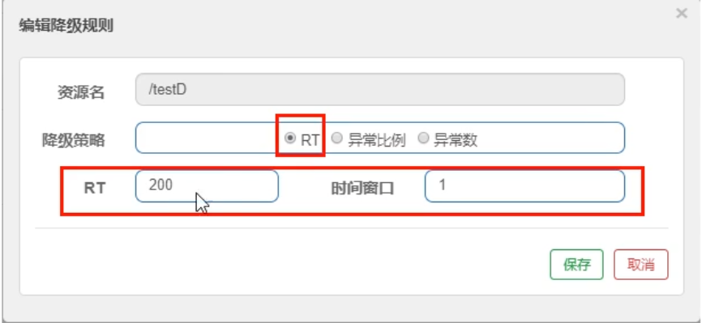

对应的慢调用比例可以这样设置：

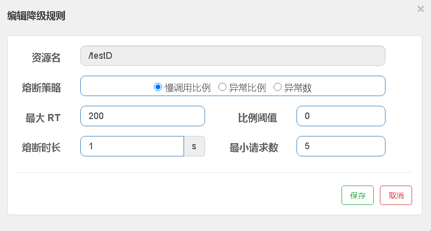

jmeter压测

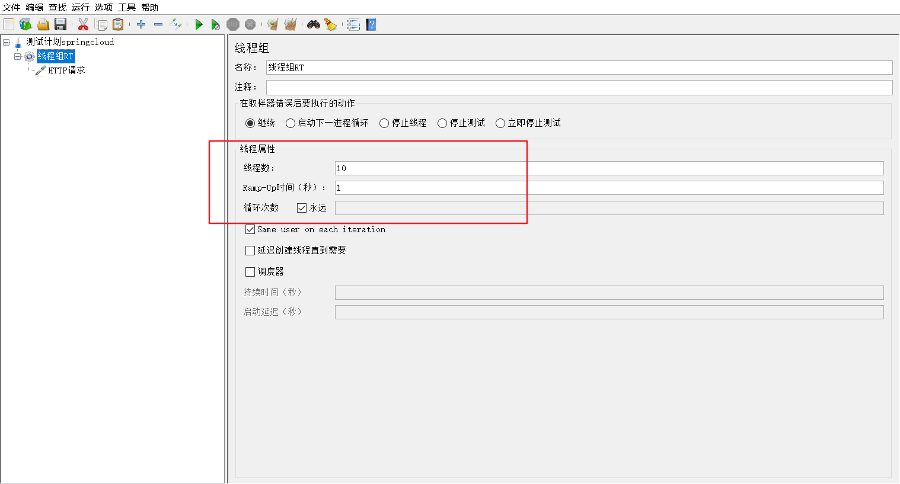

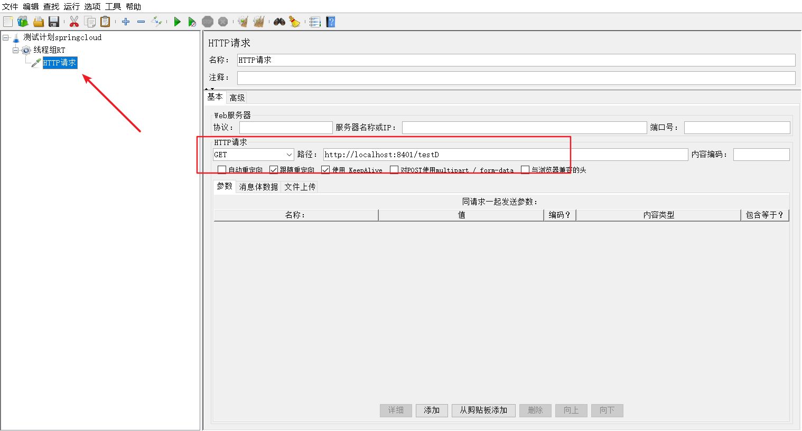

结论   Blocked by Sentinel (flow limiting)

按照上述配置永近一秒钟打进来10个线程(大于5个了)调用 testd,我们希望200毫秒处理完本次任务,如果超过200毫秒还没处理完,在未来1秒钟的时间窗口内,断路器打开(保险丝跳闸)微服务不可用,保险丝跳闻断电了后续我停 jmeter,没有这么大的访问量了,断路器关闭(保险丝恢复),微服务恢复OK

#### 异常比例

​        异常比例 (`ERROR_RATIO`)：当单位统计时长（`statIntervalMs`）内请求数目大于设置的最小请求数目，并且异常的比例大于阈值，则接下来的熔断时长内请求会自动被熔断。经过熔断时长后熔断器会进入探测恢复状态（HALF-OPEN 状态），若接下来的一个请求成功完成（没有错误）则结束熔断，否则会再次被熔断。异常比率的阈值范围是 `[0.0, 1.0]`，代表 0% - 100%。

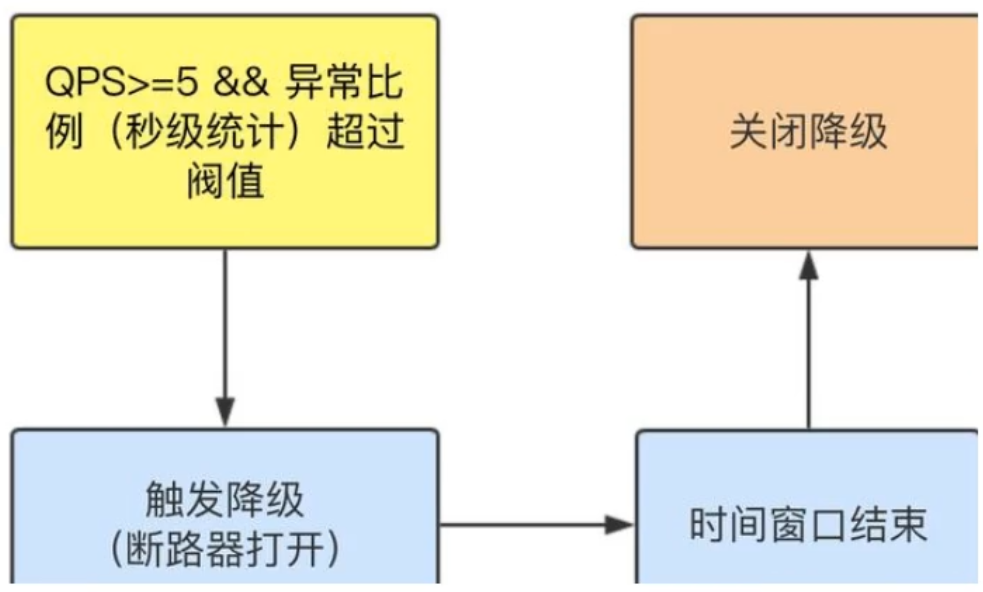

```java
@GetMapping("/testD")
public String testD(){
    log.info("testD 测试异常比例");
    int age = 10/0;
    return "----testD";
}
```

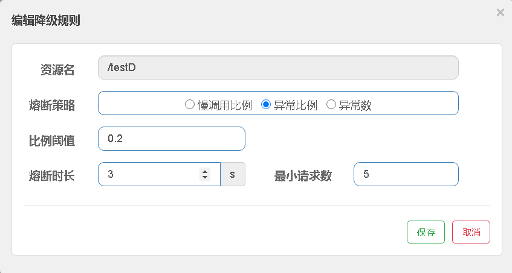

结论：

按照上述配置,单独访问一次,必然来一次报错一次( nt age=10/0),调一次错一次

开启 imeter后,直接高并发发送请求,多次调用达到我们的配置条件了。断路器开启(保险丝跳闸),微服务不可用了,不再报错 error而是服务降级了。

#### 异常数

1.8：异常数 (`ERROR_COUNT`)：当单位统计时长内的异常数目超过阈值之后会自动进行熔断。经过熔断时长后熔断器会进入探测恢复状态（HALF-OPEN 状态），若接下来的一个请求成功完成（没有错误）则结束熔断，否则会再次被熔断。

1.7：异常数( DEFRADE_GRADE_ EXCEPTION_COUNT):当资源近1分钟的异常数目超过阈值之后会进行熔断。注意由于统计时间窗口是分钟级别的,若 timewindow小于60s,则结束熔断状态后仍可能再进入熔断状态。

**时间窗口一定要大于等于60秒。**

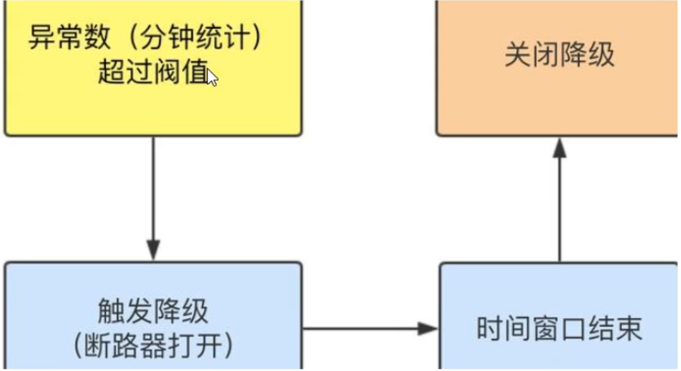

```java
@GetMapping("/testE")
public String testE(){
    log.info("testD 测试异常数");
    int age = 10/0;
    return "----testD 测试异常数";
}
```

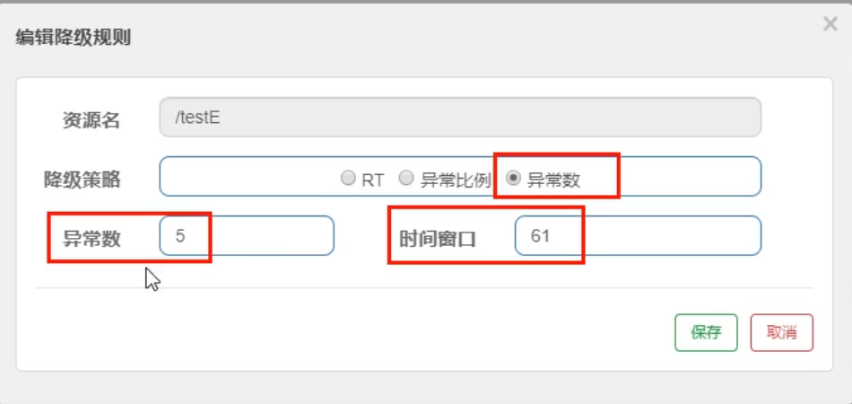

1.8可以这样设置：

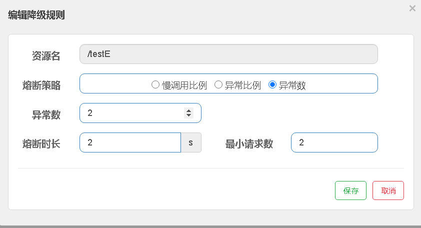

## 热点key限流

### 基本介绍

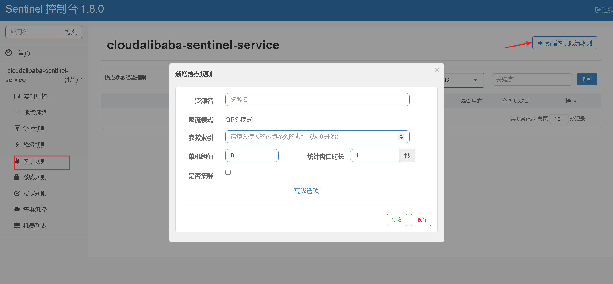

官网文档：https://github.com/alibaba/Sentinel/wiki/%E7%83%AD%E7%82%B9%E5%8F%82%E6%95%B0%E9%99%90%E6%B5%81

承上启下复习start

**兜底方法**

为**系统默认和客户自定义**,两种

之前的case,限流出问题后,都是用 sentinel系统默认的提示: Blocked by Sentinel(flow limiting

我们能不能自定?类似 hystrix,某个方法出问题了,就找对应的兜底降级方法?

结论从 HystrixCommand到**@SentinelResource**

源码   com.alibaba.csp.sentinel.slots.block.BlockException

controller添加：

```java
@GetMapping("/testHotKey")
@SentinelResource(value = "testHotKey",blockHandler = "deal_testHotKey")
public String testHotKey(@RequestParam(value = "p1",required = false) String p1,
                         @RequestParam(value = "p2",required = false) String p2){
    return "----testHotKey";
}

public String deal_testHotKey(String p1, String p2, BlockException exception){
    return "----deal_testHotKey,≡(▔﹏▔)≡";
    //sentinel默认提示为：Blocked by Sentinel (flow limiting)
}
```

添加热点规则

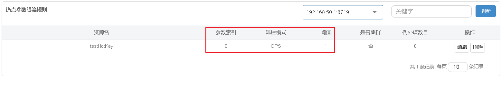

结果   方法testHostKey里面第一个参数只要QPS超过每秒1次，马上降级处理

`http://localhost:8401/testHotKey?p1=a`  会被限流

`http://localhost:8401/testHotKey?p1=a&p2=aaa`  也会被限流

`http://localhost:8401/testHotKey?p2=a ` 不会被限流


如果把handler去掉，写成

@SentinelResource(value = "testHotKey")

降级后，运行结果就是：给用户不友好体验

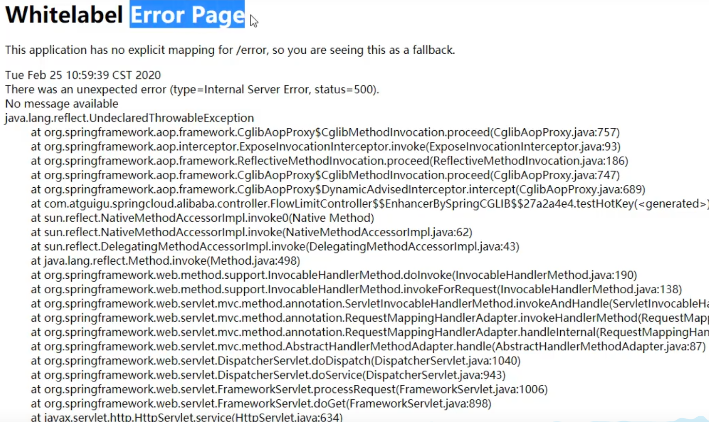

### 参数例外项

上述案例演示了第一个参数p1,当QPS超过1秒1次点击后马上被限流

特殊情况

- 普通  超过1秒钟一个后，达到阈值1后马上被限流
- 我们期望p1参数当它是某个特殊值时，它的限流值和平时不一样
- 特例   假如当p1的值等于5时，它的阈值可以达到200

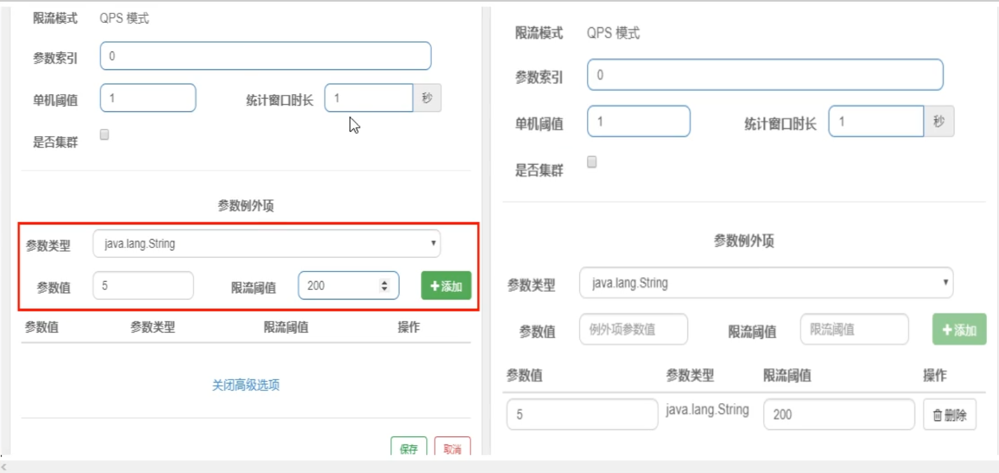

配置   添加按钮不能忘

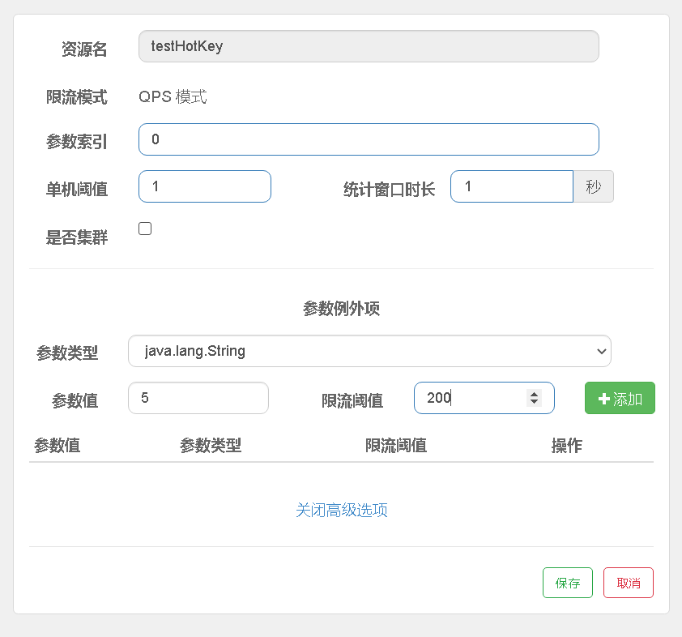

测试

- http://localhost:8401/testHotKey?p1=5
- http://localhost:8401/testHotKey?p1=3
- 当p1等于5的时候，阈值变为200
- 当p1不等于5的时候，阈值就是平常的1

前提条件   热点参数的注意点，参数必须是基本类型或者String

手贱添加异常看看....  int age = 10/0; 运行就挂了，和限流没关系


## 系统规则

https://github.com/alibaba/Sentinel/wiki/%E7%B3%BB%E7%BB%9F%E8%87%AA%E9%80%82%E5%BA%94%E9%99%90%E6%B5%81

Sentinel 系统自适应限流**从整体维度对应用入口流量进行控制**，结合应用的 Load、CPU 使用率、总体平均 RT、入口 QPS 和并发线程数等几个维度的监控指标，通过自适应的流控策略，让系统的入口流量和系统的负载达到一个平衡，让系统尽可能跑在最大吞吐量的同时保证系统整体的稳定性。

目的：

- 保证系统不被拖垮
- 在系统稳定的前提下，保持系统的吞吐量

系统规则支持以下的模式：

- **Load 自适应**（仅对 Linux/Unix-like 机器生效）：系统的 load1 作为启发指标，进行自适应系统保护。当系统 load1 超过设定的启发值，且系统当前的并发线程数超过估算的系统容量时才会触发系统保护（BBR 阶段）。系统容量由系统的 `maxQps * minRt` 估算得出。设定参考值一般是 `CPU cores * 2.5`。
- **CPU usage**（1.5.0+ 版本）：当系统 CPU 使用率超过阈值即触发系统保护（取值范围 0.0-1.0），比较灵敏。
- **平均 RT**：当单台机器上所有入口流量的平均 RT 达到阈值即触发系统保护，单位是毫秒。
- **并发线程数**：当单台机器上所有入口流量的并发线程数达到阈值即触发系统保护。
- **入口 QPS**：当单台机器上所有入口流量的 QPS 达到阈值即触发系统保护。

各项配置参数说明

入口 QPS比较危险，是全局性的

## @SentinelResource

### 按资源名称限流+后续处理

启动Nacos成功,启动Sentinel成功

**cloudalibaba-sentinel-service8401**

POM添加

```xml
<dependency><!-- 引用自己定义的api通用包，可以使用Payment支付Entity -->
    <groupId>com.atguigu.springcloud</groupId>
    <artifactId>cloud-api-commons</artifactId>
    <version>${project.version}</version>
</dependency>
```

YML

```yaml
不变
```

业务类RateLimitController

```java
package com.atguigu.springcloud.alibaba.controller;

import com.alibaba.csp.sentinel.annotation.SentinelResource;
import com.alibaba.csp.sentinel.slots.block.BlockException;
import com.atguigu.springcloud.entities.CommonResult;
import com.atguigu.springcloud.entities.Payment;
import org.springframework.web.bind.annotation.GetMapping;
import org.springframework.web.bind.annotation.RestController;

@RestController
public class RateLimitController {
    @GetMapping("/byResource")
    @SentinelResource(value = "byResource",blockHandler = "handleException")
    public CommonResult byResource()
    {
        return new CommonResult(200,"按资源名称限流测试OK",new Payment(2020L,"serial001"));
    }
    public CommonResult handleException(BlockException exception)
    {
        return new CommonResult(444,exception.getClass().getCanonicalName()+"\t 服务不可用");
    }
}

```

**配置流控规则**

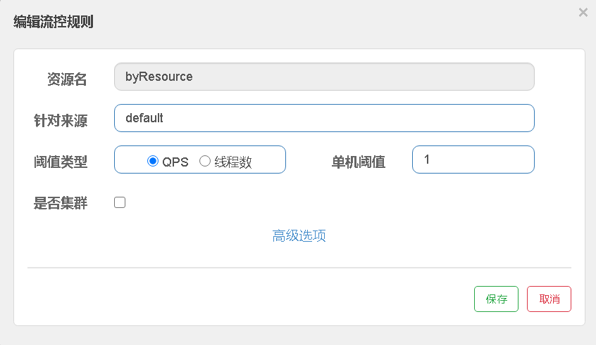

测试

- 1秒钟点击1下，OK

  {"code":200,"message":"按资源名称限流测试OK","data":{"id":2020,"serial":"serial001"}}

- 超过上述问题，疯狂点击，返回了自己定义的限流处理信息，限流发送

  {"code":444,"message":"com.alibaba.csp.sentinel.slots.block.flow.FlowException\t 服务不可用","data":null}

**额外问题**

- 此时关闭微服务8401看看
- Sentinel控制台，流控规则消失了？？？？？  临时/持久？

### 按照Url地址限流+后续处理

通过访问的URL来限流，会返回Sentinel自带默认的限流处理信息

业务类RateLimitController

```java
@GetMapping("/rateLimit/byUrl")
@SentinelResource(value = "byUrl")
public CommonResult byUrl()
{
    return new CommonResult(200,"按url限流测试OK",new Payment(2020L,"serial002"));
}
```

访问一次,Sentinel控制台配置:

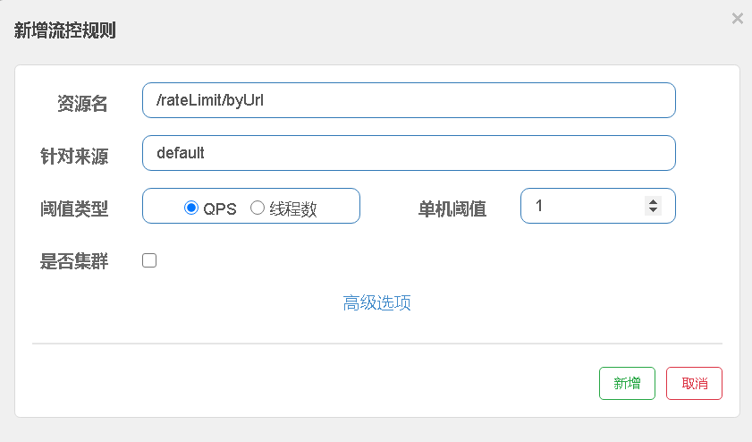

测试   疯狂点击http://localhost:8401/rateLimit/byUrl

结果 返回sentinel自带的结果：  Blocked by Sentinel (flow limiting)

因为@SentinelResource没有写blockHandler

### 上面兜底方法面临的问题

1. 系统默认的,没有体现我们自己的业务要求
2. 依照现有条件,我们自定义的处理方法又和业务代码耦合在一块,不直观。
3. 每个业务方法都添加个兜底的,那代码膨胀加剧。
4. 全局统的处理方法没有体现。

### 客户自定义限流处理逻辑

创建customerBlockHandler类用于自定义限流处理逻辑

自定义限流处理类CustomerBlockHandler

```java
package com.atguigu.springcloud.alibaba.myhandler;

import com.alibaba.csp.sentinel.slots.block.BlockException;
import com.atguigu.springcloud.entities.CommonResult;

public class CustomerBlockHandler {
    //必须是static的
    public static CommonResult handlerException(BlockException exception){
        return new CommonResult(4444,"按客户自定义,global handlerException---1");
    }

    public static CommonResult handlerException2(BlockException exception){
        return new CommonResult(4444,"按客户自定义,global handlerException---2");
    }

}

```

RateLimitController

```java
@GetMapping("/rateLimit/CustomerBlockHandler")
@SentinelResource(value = "CustomerBlockHandler",
                  blockHandlerClass = CustomerBlockHandler.class,
                  blockHandler = "handlerException2")
public CommonResult CustomerBlockHandler()
{
    return new CommonResult(200,"按客户自定义",new Payment(2020L,"serial003"));
}
```

启动微服务后先调用一次  http://localhost:8401/rateLimit/customerBlockHandler

Sentinel控制台配置

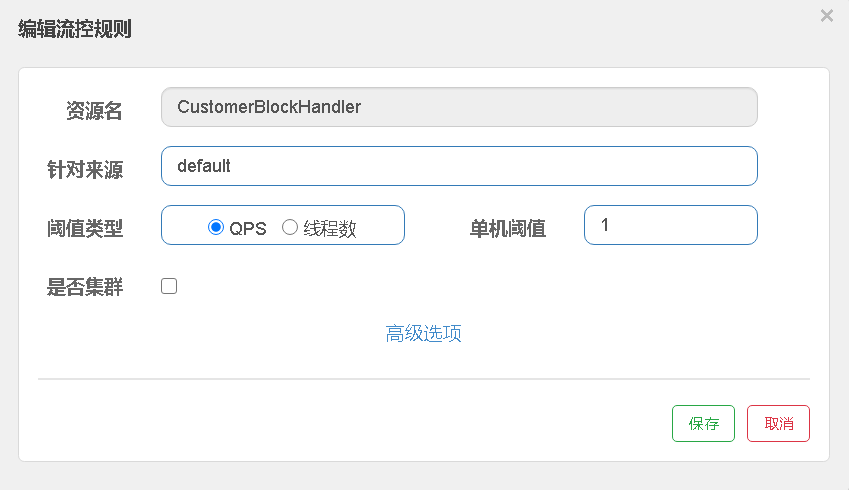

测试后我们自定义的出来了

{"code":4444,"message":"按客户自定义,global handlerException---2","data":null}

进一步说明

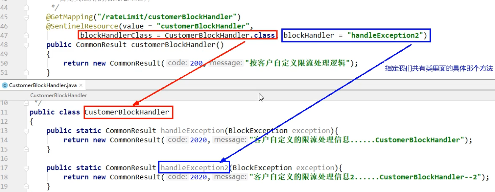

### 更多注解属性说明

https://github.com/alibaba/Sentinel/wiki/%E6%B3%A8%E8%A7%A3%E6%94%AF%E6%8C%81

> 注意：注解方式埋点不支持 private 方法。

`@SentinelResource` 用于定义资源，并提供可选的异常处理和 fallback 配置项。 `@SentinelResource` 注解包含以下属性：

- `value`：资源名称，必需项（不能为空）
- `entryType`：entry 类型，可选项（默认为 `EntryType.OUT`）
- `blockHandler` / `blockHandlerClass`: `blockHandler` 对应处理 `BlockException` 的函数名称，可选项。blockHandler 函数访问范围需要是 `public`，返回类型需要与原方法相匹配，参数类型需要和原方法相匹配并且最后加一个额外的参数，类型为 `BlockException`。blockHandler 函数默认需要和原方法在同一个类中。若希望使用其他类的函数，则可以指定 `blockHandlerClass` 为对应的类的 `Class` 对象，注意对应的函数必需为 static 函数，否则无法解析。

- `fallback` / `fallbackClass`：fallback 函数名称，可选项，用于在抛出异常的时候提供 fallback 处理逻辑。fallback 函数可以针对所有类型的异常（除了 `exceptionsToIgnore` 里面排除掉的异常类型）进行处理。fallback 函数签名和位置要求：
  - 返回值类型必须与原函数返回值类型一致；
  - 方法参数列表需要和原函数一致，或者可以额外多一个 `Throwable` 类型的参数用于接收对应的异常。
  - fallback 函数默认需要和原方法在同一个类中。若希望使用其他类的函数，则可以指定 `fallbackClass` 为对应的类的 `Class` 对象，注意对应的函数必需为 static 函数，否则无法解析。
- `defaultFallback`（since 1.6.0）：默认的 fallback 函数名称，可选项，通常用于通用的 fallback 逻辑（即可以用于很多服务或方法）。默认 fallback 函数可以针对所有类型的异常（除了 `exceptionsToIgnore` 里面排除掉的异常类型）进行处理。若同时配置了 fallback 和 defaultFallback，则只有 fallback 会生效。defaultFallback 函数签名要求：
  - 返回值类型必须与原函数返回值类型一致；
  - 方法参数列表需要为空，或者可以额外多一个 `Throwable` 类型的参数用于接收对应的异常。
  - defaultFallback 函数默认需要和原方法在同一个类中。若希望使用其他类的函数，则可以指定 `fallbackClass` 为对应的类的 `Class` 对象，注意对应的函数必需为 static 函数，否则无法解析。
- `exceptionsToIgnore`（since 1.6.0）：用于指定哪些异常被排除掉，不会计入异常统计中，也不会进入 fallback 逻辑中，而是会原样抛出。

> 注：1.6.0 之前的版本 fallback 函数只针对降级异常（`DegradeException`）进行处理，**不能针对业务异常进行处理**。

特别地，若 blockHandler 和 fallback 都进行了配置，则被限流降级而抛出 `BlockException` 时只会进入 `blockHandler` 处理逻辑。若未配置 `blockHandler`、`fallback` 和 `defaultFallback`，则被限流降级时会将 `BlockException` **直接抛出**（若方法本身未定义 throws BlockException 则会被 JVM 包装一层 `UndeclaredThrowableException`）。

Sentinel主要有三个核心API

- SphU定义资源
- Tracer定义统计
- ContextUtil定义了上下文

## 服务熔断功能

sentinel整合ribbon+openFeign+fallback

### Ribbon系列

#### 提供者9003/9004

1.新建cloudalibaba-provider-payment9003/9004

2.POM

```xml
<dependencies>
    <!--SpringCloud ailibaba nacos -->
    <dependency>
        <groupId>com.alibaba.cloud</groupId>
        <artifactId>spring-cloud-starter-alibaba-nacos-discovery</artifactId>
    </dependency>
    <dependency><!-- 引入自己定义的api通用包，可以使用Payment支付Entity -->
        <groupId>com.atguigu.springcloud</groupId>
        <artifactId>cloud-api-commons</artifactId>
        <version>${project.version}</version>
    </dependency>
    <!-- SpringBoot整合Web组件 -->
    <dependency>
        <groupId>org.springframework.boot</groupId>
        <artifactId>spring-boot-starter-web</artifactId>
    </dependency>
    <dependency>
        <groupId>org.springframework.boot</groupId>
        <artifactId>spring-boot-starter-actuator</artifactId>
    </dependency>
    <!--日常通用jar包配置-->
    <dependency>
        <groupId>org.springframework.boot</groupId>
        <artifactId>spring-boot-devtools</artifactId>
        <scope>runtime</scope>
        <optional>true</optional>
    </dependency>
    <dependency>
        <groupId>org.projectlombok</groupId>
        <artifactId>lombok</artifactId>
        <optional>true</optional>
    </dependency>
    <dependency>
        <groupId>org.springframework.boot</groupId>
        <artifactId>spring-boot-starter-test</artifactId>
        <scope>test</scope>
    </dependency>
</dependencies>
```


3.YML

```yaml
server:
  port: 9003

spring:
  application:
    name: nacos-payment-provider
  cloud:
    nacos:
      discovery:
        server-addr: localhost:8848 #配置Nacos地址

management:
  endpoints:
    web:
      exposure:
        include: '*'
```


4.主启动

```java
package com.atguigui.springcloud.alibaba;

import org.springframework.boot.SpringApplication;
import org.springframework.boot.autoconfigure.SpringBootApplication;
import org.springframework.cloud.client.discovery.EnableDiscoveryClient;

@SpringBootApplication
@EnableDiscoveryClient
public class PaymentMain9003
{
    public static void main(String[] args) {
        SpringApplication.run(PaymentMain9003.class, args);
    }
}

```


5.业务类

```java
package com.atguigui.springcloud.alibaba.controller;

import com.atguigu.springcloud.entities.CommonResult;
import com.atguigu.springcloud.entities.Payment;
import org.springframework.beans.factory.annotation.Value;
import org.springframework.web.bind.annotation.GetMapping;
import org.springframework.web.bind.annotation.PathVariable;
import org.springframework.web.bind.annotation.RestController;

import java.util.HashMap;

@RestController
public class PaymentController
{
    @Value("${server.port}")
    private String serverPort;

    public static HashMap<Long, Payment> hashMap = new HashMap<>();
    static
    {
        hashMap.put(1L,new Payment(1L,"28a8c1e3bc2742d8848569891fb42181"));
        hashMap.put(2L,new Payment(2L,"bba8c1e3bc2742d8848569891ac32182"));
        hashMap.put(3L,new Payment(3L,"6ua8c1e3bc2742d8848569891xt92183"));
    }

    @GetMapping(value = "/paymentSQL/{id}")
    public CommonResult<Payment> paymentSQL(@PathVariable("id") Long id)
    {
        Payment payment = hashMap.get(id);
        CommonResult<Payment> result = new CommonResult(200,"from mysql,serverPort:  "+serverPort,payment);
        return result;
    }
}
```


6.测试地址  http://localhost:9003/paymentSQL/1

#### 消费者84

1.新建cloudalibaba-consumer-nacos-order84

2.POM

```xml
<dependencies>
    <!--SpringCloud openfeign -->
    <dependency>
        <groupId>org.springframework.cloud</groupId>
        <artifactId>spring-cloud-starter-openfeign</artifactId>
    </dependency>
    <!--SpringCloud ailibaba nacos -->
    <dependency>
        <groupId>com.alibaba.cloud</groupId>
        <artifactId>spring-cloud-starter-alibaba-nacos-discovery</artifactId>
    </dependency>
    <!--SpringCloud ailibaba sentinel -->
    <dependency>
        <groupId>com.alibaba.cloud</groupId>
        <artifactId>spring-cloud-starter-alibaba-sentinel</artifactId>
    </dependency>
    <!-- 引入自己定义的api通用包，可以使用Payment支付Entity -->
    <dependency>
        <groupId>com.atguigu.springcloud</groupId>
        <artifactId>cloud-api-commons</artifactId>
        <version>${project.version}</version>
    </dependency>
    <!-- SpringBoot整合Web组件 -->
    <dependency>
        <groupId>org.springframework.boot</groupId>
        <artifactId>spring-boot-starter-web</artifactId>
    </dependency>
    <dependency>
        <groupId>org.springframework.boot</groupId>
        <artifactId>spring-boot-starter-actuator</artifactId>
    </dependency>
    <!--日常通用jar包配置-->
    <dependency>
        <groupId>org.springframework.boot</groupId>
        <artifactId>spring-boot-devtools</artifactId>
        <scope>runtime</scope>
        <optional>true</optional>
    </dependency>
    <dependency>
        <groupId>org.projectlombok</groupId>
        <artifactId>lombok</artifactId>
        <optional>true</optional>
    </dependency>
    <dependency>
        <groupId>org.springframework.boot</groupId>
        <artifactId>spring-boot-starter-test</artifactId>
        <scope>test</scope>
    </dependency>
</dependencies>
```

3.YML

```yaml
server:
  port: 84


spring:
  application:
    name: nacos-order-consumer
  cloud:
    nacos:
      discovery:
        server-addr: localhost:8848
    sentinel:
      transport:
        #配置Sentinel dashboard地址
        dashboard: localhost:8080
        #默认8719端口，假如被占用会自动从8719开始依次+1扫描,直至找到未被占用的端口
        port: 8719

#消费者将要去访问的微服务名称(注册成功进nacos的微服务提供者)
service-url:
  nacos-user-service: http://nacos-payment-provider

# 激活Sentinel对Feign的支持
feign:
  sentinel:
    enabled: true
```

4.主启动

```java
package com.atguigu.springcloud.alibaba;

import org.springframework.boot.SpringApplication;
import org.springframework.boot.autoconfigure.SpringBootApplication;
import org.springframework.cloud.client.discovery.EnableDiscoveryClient;
import org.springframework.cloud.openfeign.EnableFeignClients;

@EnableDiscoveryClient
@SpringBootApplication
@EnableFeignClients
public class OrderNacosMain84
{
    public static void main(String[] args) {
        SpringApplication.run(OrderNacosMain84.class, args);
    }
}


```

5.业务类

ApplicationContextConfig

```java
package com.atguigu.springcloud.alibaba.config;

import org.springframework.cloud.client.loadbalancer.LoadBalanced;
import org.springframework.context.annotation.Bean;
import org.springframework.context.annotation.Configuration;
import org.springframework.web.client.RestTemplate;

@Configuration
public class ApplicationContextConfig {
    @Bean
    @LoadBalanced
    public RestTemplate getRestTemplate(){
        return new RestTemplate();
    }
}

```


##### CircleBreakerController的全部源码

```java
package com.atguigu.springcloud.alibaba.controller;

import com.alibaba.csp.sentinel.annotation.SentinelResource;
import com.atguigu.springcloud.entities.CommonResult;
import com.atguigu.springcloud.entities.Payment;
import lombok.extern.slf4j.Slf4j;
import org.springframework.web.bind.annotation.PathVariable;
import org.springframework.web.bind.annotation.RequestMapping;
import org.springframework.web.bind.annotation.RestController;
import org.springframework.web.client.RestTemplate;

import javax.annotation.Resource;

@RestController
@Slf4j
public class CircleBreakerController {
    public static final String SERVICE_URL = "http://nacos-payment-provider";

    @Resource
    private RestTemplate restTemplate;

    @RequestMapping("/consumer/fallback/{id}")
    @SentinelResource(value = "fallback") //没有配置
    public CommonResult<Payment> fallback(@PathVariable Long id)
    {
        CommonResult<Payment> result = restTemplate.getForObject(SERVICE_URL + "/paymentSQL/"+id,CommonResult.class,id);

        if (id == 4) {
            throw new IllegalArgumentException ("IllegalArgumentException,非法参数异常....");
        }else if (result.getData() == null) {
            throw new NullPointerException ("NullPointerException,该ID没有对应记录,空指针异常");
        }

        return result;
    }

}
```


修改后请重启微服务,热部署对java代码级生效及时,但是对@SentinelResource注解内属性，有时效果不好

目的：**fallback管运行异常    blockHandler管配置违规**

测试地址   http://localhost:84/consumer/fallback/1

**没有任何配置**    

给客户error页面，不友好


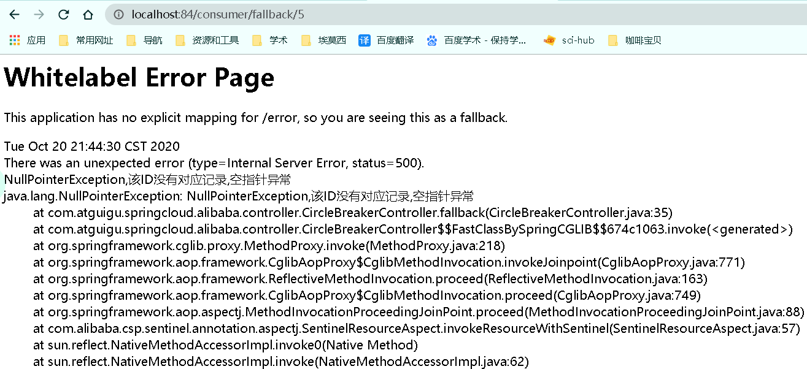

**只配置fallback**

编码（那个业务类下面的CircleBreakerController的全部源码）

```Java
@SentinelResource(value = "fallback",fallback = "handlerFallback") //fallback只负责业务异常
```

```java
//本例是fallback
public CommonResult handlerFallback(@PathVariable  Long id,Throwable e) {
    Payment payment = new Payment(id,"null");
    return new CommonResult<>(444,"兜底异常handlerFallback,exception内容  "+e.getMessage(),payment);
}
```


结果：

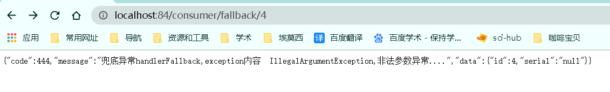

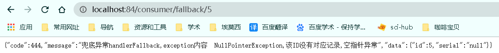

**只配置blockHandle**

```java
@SentinelResource(value = "fallback",blockHandler = "blockHandler") //blockHandler只负责sentinel控制台配置违规  
```


```java
//本例是blockHandler
public CommonResult blockHandler(@PathVariable  Long id, BlockException blockException) {
    Payment payment = new Payment(id,"null");
    return new CommonResult<>(445,"blockHandler-sentinel限流,无此流水: blockException  "+blockException.getMessage(),payment);
}
```

配置：

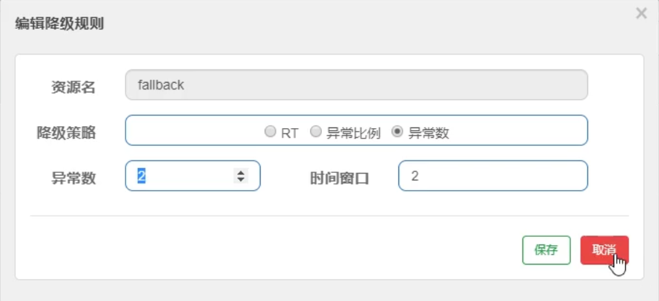

结果：

第一次异常界面：

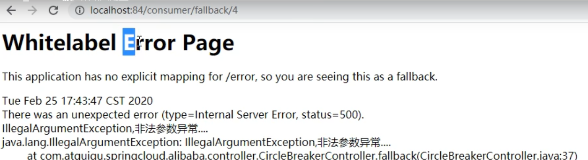

多刷新几次（超过2次）：

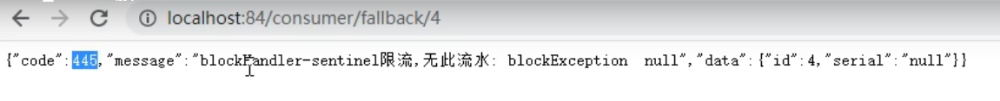

**fallback和blockHandler都配置**

```java
 @SentinelResource(value = "fallback",fallback = "handlerFallback",blockHandler = "blockHandler")
```

点的快：

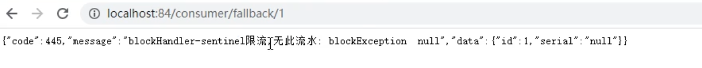

异常参数：

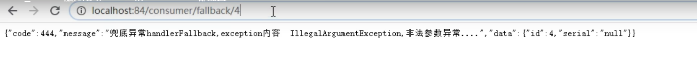

异常参数+狂点：

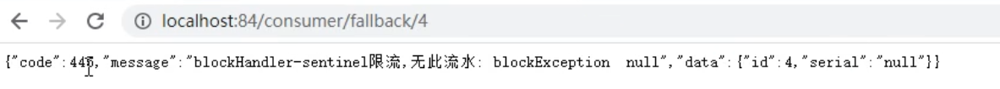

**结论**：若 blockhandler和 fallback都进行了配置,则被限流降级而抛出 Blockexception时只会进入 blockhandler处理逻辑


**异常忽略属性**...

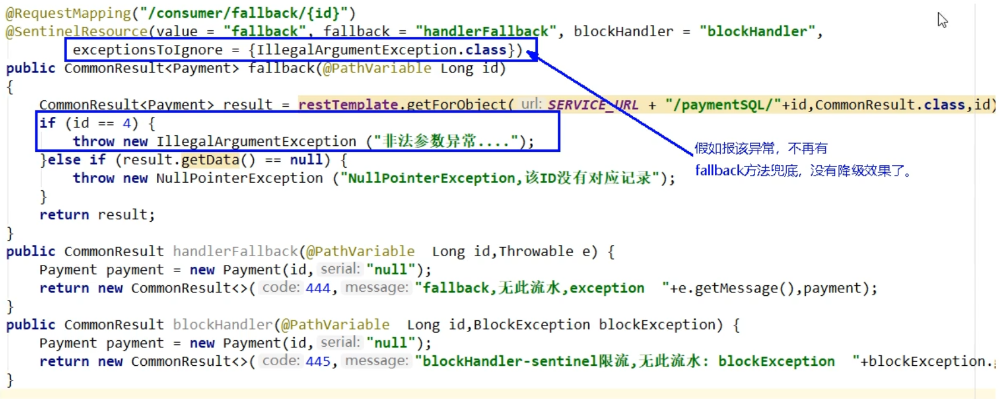


```java
@SentinelResource(value = "fallback",fallback = "handlerFallback",blockHandler = "blockHandler",exceptionsToIgnore = {IllegalArgumentException.class})
```

异常参数的方法被忽略了，所以出现默认异常界面


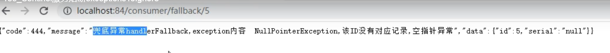

### Feign系列

修改84模块:    84消费者调用提供者9003    Feign组件一般是消费侧

POM

```xml
<!--SpringCloud openfeign -->
<dependency>
    <groupId>org.springframework.cloud</groupId>
    <artifactId>spring-cloud-starter-openfeign</artifactId>
</dependency>
```

YML

```yaml
# 激活Sentinel对Feign的支持
feign:
  sentinel:
    enabled: true
```

主启动类加：@EnableFeignClients

带@FeignClient注解的业务接口

```java
@FeignClient(value="nacos-payment-provider",fallback = PaymentFallbackService.class)
public interface PaymentService {
    @GetMapping(value = "/paymentSQL/{id}")
    public CommonResult<Payment> paymentSQL(@PathVariable("id") Long id);
}
```

实现类：

```java
package com.atguigu.springcloud.alibaba.service;

import com.atguigu.springcloud.entities.CommonResult;
import com.atguigu.springcloud.entities.Payment;
import org.springframework.stereotype.Component;

@Component
public class PaymentFallbackService implements PaymentService {
    @Override
    public CommonResult<Payment> paymentSQL(Long id) {

        return new CommonResult<>(444444,"服务降级返回，---PaymentFallbackService： "+new Payment(id,"errorSerial"));
    }
}

```

fallback = PaymentFallbackService.class


controller

```java
//openfeign
@Resource
private PaymentService paymentService;

@GetMapping(value = "/consumer/paymentSQL/{id}")
public CommonResult<Payment> paymentSQL(@PathVariable("id") Long id){
    return paymentService.paymentSQL(id);
}
```

http://lcoalhost:84/consumer/paymentSQL/1

```
{"code":200,"message":"from mysql,serverPort:  9003","data":{"id":1,"serial":"28a8c1e3bc2742d8848569891fb42181"}}
```

测试84调用9003，此时故意关闭9003微服务提供者，看84消费侧自动降级，不会被耗死

```
{"code":444444,"message":"服务降级返回，---PaymentFallbackService： Payment(id=1, serial=errorSerial)","data":null}
```

### 熔断框架比较

|                | sentinel                                                   | Hytsrix                | resilience4j                     |
| -------------- | ---------------------------------------------------------- | ---------------------- | -------------------------------- |
| 隔离策略       | 信号量隔离（并发线程数限流）                               | 线程池隔离/信号量隔离  | 信号量隔离                       |
| 熔断降级策略   | 基于响应时间、异常比例、异常数                             | 异常比例               | 基于异常比例，响应时间           |
| 实时统计实现   | 滑动窗口（LeapArray)                                       | 滑动窗口（基于RxJava） | Ring Bit Buffer                  |
| 动态规划配置   | 支持多种数据源                                             | 支持多种数据源         | 有限支持                         |
| 扩展性         | 多个扩展点                                                 | 插件的形式             | 接口的形式                       |
| 基于注解的支持 | 支持                                                       | 支持                   | 支持                             |
| 限流           | 基于QPS、支持基于调用关系的限流                            | 有限的支持             | Rate Limter                      |
| 控制台         | 提供开箱即用的控制台，可配置规划、查看秒级监控、机器发现等 | 简单的监控查看         | 不提供控制台，可对接其他监控系统 |

## 规则持久化

**一旦我们重启应用，Sentinel规则将消失，生产环境需要将配置规则进行持久化**

怎么玩   将限流配置规则持久化进Nacos保存（还可以保存进数据库或者配置文件），只要刷新8401某个rest地址，sentinel控制台的流控规则就能看到，只要Nacos里面的配置不删除，针对8401上Sentinel上的流控规则持续有效

**步骤**

POM

```xml
<!--SpringCloud ailibaba sentinel-datasource-nacos 做持久化用到-->
<dependency>
    <groupId>com.alibaba.csp</groupId>
    <artifactId>sentinel-datasource-nacos</artifactId>
</dependency>
```


YML

添加Nacos数据源配置

```yaml
server:
  port: 8401
spring:
  application:
    name: cloudalibaba-sentinel-service
  cloud:
    nacos:
      discovery:
        server-addr: localhost:8848 # nacos服务注册中心地址
    sentinel:
      transport:
        dashboard: localhost:8080 # sentinel dashboard地址
        port: 8719 #默认8719端口，若被占用则会自动从8719开始+1扫描，直到未被占用的端口
      datasource: #注意缩进对齐，不然不起作用
        ds1:
          nacos:
            server-addr: localhost:8848
            dataId: cloudalibaba-sentinel-service
            groupId: DEFAULT_GROUP
            data-type: json
            rule-type: flow
management:
  endpoints:
    web:
      exposure:
        include: '*'
feign: # 激活sentinel对feign的支持
  sentinel:
    enabled: true

```


添加Nacos业务规则配置

```json
[
    {
        "resource":"/rateLimit/byUrl",
        "limitApp":"default",
        "grade":1,
        "count":1,
        "strategy":0,
        "controlBehavior":0,
        "clusterMode":false
    }
]
```

resource:资源名称：

limitApp:来源应用

grade:阈值类型,0表示线程数,1表示QPS

count:单机阈值

strategy:流控模式,0表示直接,1表示关联,2表示链路;

controlbehavior:流控效果,0表示快速失败,1表示 Warm Up,2表示排队等待;

cluster Mode:是否集群。

启动8401后刷新sentinel发现业务规则有了  

快速访问测试接口http://localhost:8401/rateLimit/byUrl   Blocked by Sentinel (flow limiting)

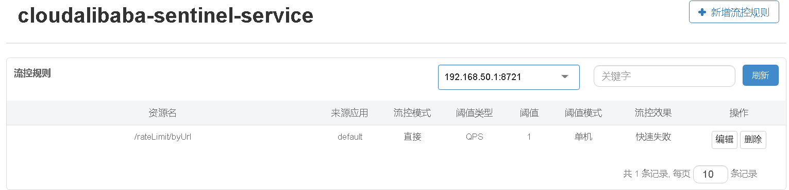


停止8401再看sentinel：流控规则没了

重新启动8401再看sentinel

- 扎一看还是没有，稍等一会儿
- 多次调用  http://localhost:8401/rateLimit/byUrl
- 重新配置出现了，**持久化验证通过**

# 第19章 SpringCloud Alibaba Seata处理分布式事务

## 分布式事务问题

1.分布式前  单机单库没这个问题

从1：1 -> 1:N -> N: N

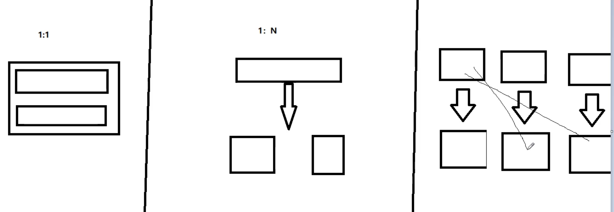

2.分布式之后 

单体应用被拆分成微服务应用,原来的三个模块被拆分成三个独立的应用,分别使用三个独立的数据源

业务操作需要调用三个服务来完成。此时每个服务内部的数据一致性由本地事务来保证,但是**全局的数据一致性问题没法保证**。

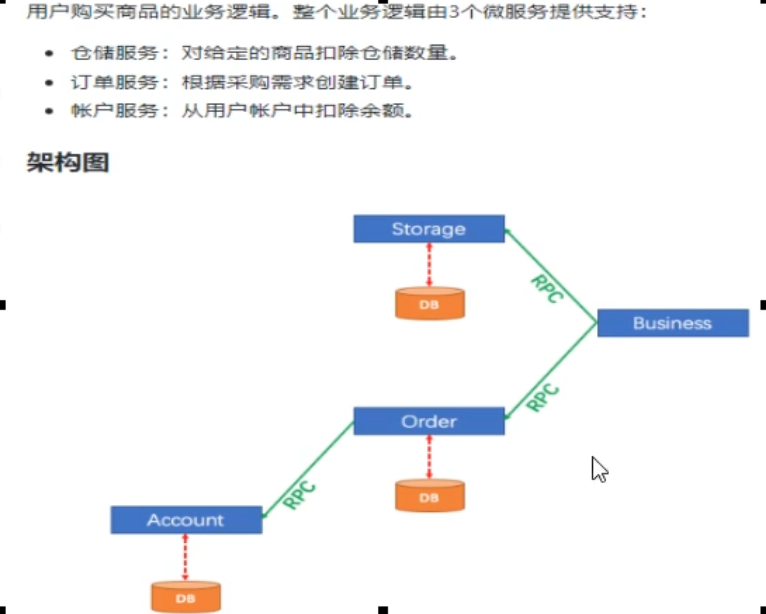

3.一句话  一次业务操作需要跨多个数据源或需要跨多个系统进行远程调用，就会产生分布式事务问题

## Seata简介

### 是什么

Seata是一款开源的分布式事务解决方案，致力于在微服务架构下提供高性能和简单易用的分布式事务服务

官网地址  http://seata.io/zh-cn/


### 能干嘛

一个典型的分布式事务过程

1.分布式事务处理过程的-ID+三组件模型

- Transaction ID XID  **全局唯一的事务ID**

- 3组件概念

  - Transaction Coordinator(TC)

    **事务协调器**，维护全局事务的运行状态，负责协调并驱动全局事务的提交或回滚;

  - Transaction Manager(TM)

    **控制全局事务的边界**，负责开启一个全局事务，并最终发起全局提交或全局回滚的决议;

  - Resource Manager(RM)

    **控制分支事务**，负责分支注册，状态汇报，并接收事务协调器的指令，驱动分支（本地）事务的提交和回滚；

**2.处理过程**

1.TM向TC申请开启一个全局事务,全局事务创建成功并生成一个全局唯一的XID

2.ⅪD在微服务调用链路的上下文中传播

3.RM向TC注册分支事务,将其纳入ⅪD对应全局事务的管辖

4.TM向TC发起针对ⅪD的全局提交或回滚决议;

5.TC调度ⅪD下管辖的全部分支事务完成提交或回滚请求。


### 去哪下

发布说明:https://github.com/seata/seata/releases

### 怎么玩

**Spring 本地@Transactional**

**全局@GlobalTransactional**  SEATA的分布式交易解决方案


使用@GlobalTransactional注解在业务方法上

## Seata-Server安装

1.官网地址  http://seata.io/zh-cn/

2.下载版本

3.seata-server-0.9.0.zip解压到指定目录并修改conf目录下的file.conf配置文件

0.9.0配置文件和1.0，1.3以上的都不一样了，以官网为准

service模块（只有0.9.0的版本有）

```
vgroupmapping.mytesttxgroup = "fsp_tx_group"
```

store模块(事务日志的存储模块，新版增加了redis)

```properties
mode = "db"
db{
    url = "jdbc:mysql://127.0.0.1:3306/seata"
    user = "root"
    password = "root"
}
```


4.mysql5.7数据库新建库seata

5.在seata库里建表

建表db_store.sql在\seata-server-0.9.0\seata\conf目录里面   db_store.sql

README-zh.md这个文件中的蓝色标题点进去

(没有的话上seata的github上找seata/script/server/db/mysql.sql)

```mysql
-- -------------------------------- The script used when storeMode is 'db' --------------------------------
-- the table to store GlobalSession data
CREATE TABLE IF NOT EXISTS `global_table`
(
    `xid`                       VARCHAR(128) NOT NULL,
    `transaction_id`            BIGINT,
    `status`                    TINYINT      NOT NULL,
    `application_id`            VARCHAR(32),
    `transaction_service_group` VARCHAR(32),
    `transaction_name`          VARCHAR(128),
    `timeout`                   INT,
    `begin_time`                BIGINT,
    `application_data`          VARCHAR(2000),
    `gmt_create`                DATETIME,
    `gmt_modified`              DATETIME,
    PRIMARY KEY (`xid`),
    KEY `idx_gmt_modified_status` (`gmt_modified`, `status`),
    KEY `idx_transaction_id` (`transaction_id`)
) ENGINE = InnoDB
  DEFAULT CHARSET = utf8;

-- the table to store BranchSession data
CREATE TABLE IF NOT EXISTS `branch_table`
(
    `branch_id`         BIGINT       NOT NULL,
    `xid`               VARCHAR(128) NOT NULL,
    `transaction_id`    BIGINT,
    `resource_group_id` VARCHAR(32),
    `resource_id`       VARCHAR(256),
    `branch_type`       VARCHAR(8),
    `status`            TINYINT,
    `client_id`         VARCHAR(64),
    `application_data`  VARCHAR(2000),
    `gmt_create`        DATETIME(6),
    `gmt_modified`      DATETIME(6),
    PRIMARY KEY (`branch_id`),
    KEY `idx_xid` (`xid`)
) ENGINE = InnoDB
  DEFAULT CHARSET = utf8;

-- the table to store lock data
CREATE TABLE IF NOT EXISTS `lock_table`
(
    `row_key`        VARCHAR(128) NOT NULL,
    `xid`            VARCHAR(96),
    `transaction_id` BIGINT,
    `branch_id`      BIGINT       NOT NULL,
    `resource_id`    VARCHAR(256),
    `table_name`     VARCHAR(32),
    `pk`             VARCHAR(36),
    `gmt_create`     DATETIME,
    `gmt_modified`   DATETIME,
    PRIMARY KEY (`row_key`),
    KEY `idx_branch_id` (`branch_id`)
) ENGINE = InnoDB
  DEFAULT CHARSET = utf8;
```


6.修改seata-server-0.9.0\seata\conf目录下的registry.conf配置文件

```properties
type = "nacos"
```

7.先启动Nacos端口号8848

8.再启动seata-server

softs\seata-server-0.9.0\seata\bin   seata-server.bat

## 订单/库存/账户业务数据库准备

以下演示都需要**先启动Nacos后启动Seata**，保证两个都OK

Seata没启动报错no available server to connect(先启动seata就报这个错)

### 分布式事务业务说明

**业务说明**

这里我们会创建三个服务,一个订单服务,一个库存服务,

一个账户服务当用户下单时,会在订单服务中创建一个订单,然后通过远程调用库存服务来扣减下单商品的库存,再通过远程调用账户服务来扣減用户账户里面的余额,最后在订单服务中修改订单状态为已完成。

该操作跨越三个数据库,有两次远程调用,很明显会有分布式事务问题。

**下订单-->扣库存-->减账户（余额）**

### 创建业务数据库

seata_order: 存储订单的数据库

seata_storage:存储库存的数据库

seata_account: 存储账户信息的数据库

SQL

```mysql
create database seata_order;
create database seata_storage;
create database seata_account;
```


按照上述3库分别建对应业务表

seata_order库下建t_order表

```mysql
CREATE TABLE t_order(
    `id` BIGINT(11) NOT NULL AUTO_INCREMENT PRIMARY KEY,
    `user_id` BIGINT(11) DEFAULT NULL COMMENT '用户id',
    `product_id` BIGINT(11) DEFAULT NULL COMMENT '产品id',
    `count` INT(11) DEFAULT NULL COMMENT '数量',
    `money` DECIMAL(11,0) DEFAULT NULL COMMENT '金额',
    `status` INT(1) DEFAULT NULL COMMENT '订单状态：0：创建中; 1：已完结'
) ENGINE=INNODB AUTO_INCREMENT=7 DEFAULT CHARSET=utf8;

SELECT * FROM t_order;
```

seata_storage库下建t_storage表

```mysql
CREATE TABLE t_storage(
    `id` BIGINT(11) NOT NULL AUTO_INCREMENT PRIMARY KEY,
    `product_id` BIGINT(11) DEFAULT NULL COMMENT '产品id',
    `total` INT(11) DEFAULT NULL COMMENT '总库存',
    `used` INT(11) DEFAULT NULL COMMENT '已用库存',
    `residue` INT(11) DEFAULT NULL COMMENT '剩余库存'
) ENGINE=INNODB AUTO_INCREMENT=2 DEFAULT CHARSET=utf8;
    
INSERT INTO seata_storage.t_storage(`id`,`product_id`,`total`,`used`,`residue`)
value(1,1,100,0,100);
select * from t_storage;
```

seata_account库下建t_account表

```mysql
CREATE TABLE t_account(
    `id` BIGINT(11) NOT NULL AUTO_INCREMENT PRIMARY KEY COMMENT 'id',
    `user_id` BIGINT(11) DEFAULT NULL COMMENT '用户id',
    `total` DECIMAL(10,0) DEFAULT NULL COMMENT '总额度',
    `used` DECIMAL(10,0) DEFAULT NULL COMMENT '已用余额',
    `residue` DECIMAL(10,0) DEFAULT '0' COMMENT '剩余可用额度'
) ENGINE=INNODB AUTO_INCREMENT=2 DEFAULT CHARSET=utf8;

INSERT INTO seata_account.t_account(`id`,`user_id`,`total`,`used`,`residue`) VALUES('1','1','1000','0','1000')...
```

按照上述3库分别建对应的回滚日志表

https://github.com/seata/seata/blob/1.3.0/script/client/at/db/mysql.sql

```mysql
-- for AT mode you must to init this sql for you business database. the seata server not need it.
CREATE TABLE IF NOT EXISTS `undo_log`
(
    `branch_id`     BIGINT(20)   NOT NULL COMMENT 'branch transaction id',
    `xid`           VARCHAR(100) NOT NULL COMMENT 'global transaction id',
    `context`       VARCHAR(128) NOT NULL COMMENT 'undo_log context,such as serialization',
    `rollback_info` LONGBLOB     NOT NULL COMMENT 'rollback info',
    `log_status`    INT(11)      NOT NULL COMMENT '0:normal status,1:defense status',
    `log_created`   DATETIME(6)  NOT NULL COMMENT 'create datetime',
    `log_modified`  DATETIME(6)  NOT NULL COMMENT 'modify datetime',
    UNIQUE KEY `ux_undo_log` (`xid`, `branch_id`)
) ENGINE = InnoDB
  AUTO_INCREMENT = 1
  DEFAULT CHARSET = utf8 COMMENT ='AT transaction mode undo table';
```


订单-库存-账户3个库下都需要建各自的回滚日志表

\seata-server-0.9.0\seata\conf目录下的db_undo_log.sql

最终效果

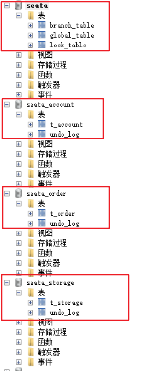

## 订单/库存/账户业务微服务准备

业务需求  下订单->减库存->扣余额->改（订单）状态

### 新建订单Order-Module

#### 1.seata-order-service2001

#### 2.POM

```xml
<dependencies>
        <!--nacos-->
        <dependency>
            <groupId>com.alibaba.cloud</groupId>
            <artifactId>spring-cloud-starter-alibaba-nacos-discovery</artifactId>
        </dependency>
        <!--seata-->
        <dependency>
            <groupId>com.alibaba.cloud</groupId>
            <artifactId>spring-cloud-starter-alibaba-seata</artifactId>
            <exclusions>
                <exclusion>
                    <artifactId>seata-all</artifactId>
                    <groupId>io.seata</groupId>
                </exclusion>
            </exclusions>
        </dependency>
        <dependency>
            <groupId>io.seata</groupId>
            <artifactId>seata-all</artifactId>
            <version>1.3.0</version>
        </dependency>
        <!--feign-->
        <dependency>
            <groupId>org.springframework.cloud</groupId>
            <artifactId>spring-cloud-starter-openfeign</artifactId>
        </dependency>
        <!--web-actuator-->
        <dependency>
            <groupId>org.springframework.boot</groupId>
            <artifactId>spring-boot-starter-web</artifactId>
        </dependency>
        <dependency>
            <groupId>org.springframework.boot</groupId>
            <artifactId>spring-boot-starter-actuator</artifactId>
        </dependency>
        <!--mysql-druid-->
        <dependency>
            <groupId>mysql</groupId>
            <artifactId>mysql-connector-java</artifactId>
            <version>5.1.37</version>
        </dependency>
        <dependency>
            <groupId>com.alibaba</groupId>
            <artifactId>druid-spring-boot-starter</artifactId>
            <version>1.1.10</version>
        </dependency>
        <dependency>
            <groupId>org.mybatis.spring.boot</groupId>
            <artifactId>mybatis-spring-boot-starter</artifactId>
            <version>2.0.0</version>
        </dependency>
        <dependency>
            <groupId>org.springframework.boot</groupId>
            <artifactId>spring-boot-starter-test</artifactId>
            <scope>test</scope>
        </dependency>
        <dependency>
            <groupId>org.projectlombok</groupId>
            <artifactId>lombok</artifactId>
            <optional>true</optional>
        </dependency>
    </dependencies>
```


#### 3.YML

```yaml
server:
  port: 2001

spring:
  application:
    name: seata-order-service
  cloud:
    alibaba:
      seata:
        #自定义事务组名称需要与seata-server中的对应
        tx-service-group: fsp_tx_group
    nacos:
      discovery:
        server-addr: localhost:8848
  datasource:
    driver-class-name: com.mysql.jdbc.Driver
    url: jdbc:mysql://localhost:3306/seata_order
    username: root
    password: root

feign:
  hystrix:
    enabled: false

logging:
  level:
    io:
      seata: info

mybatis:
  mapperLocations: classpath:mapper/*.xml
```


#### 4.file.conf

```properties
transport {
  # tcp udt unix-domain-socket
  type = "TCP"
  #NIO NATIVE
  server = "NIO"
  #enable heartbeat
  heartbeat = true
  #thread factory for netty
  thread-factory {
    boss-thread-prefix = "NettyBoss"
    worker-thread-prefix = "NettyServerNIOWorker"
    server-executor-thread-prefix = "NettyServerBizHandler"
    share-boss-worker = false
    client-selector-thread-prefix = "NettyClientSelector"
    client-selector-thread-size = 1
    client-worker-thread-prefix = "NettyClientWorkerThread"
    # netty boss thread size,will not be used for UDT
    boss-thread-size = 1
    #auto default pin or 8
    worker-thread-size = 8
  }
  shutdown {
    # when destroy server, wait seconds
    wait = 3
  }
  serialization = "seata"
  compressor = "none"
}

service {

  vgroup_mapping.fsp_tx_group = "default" #修改自定义事务组名称

  default.grouplist = "127.0.0.1:8091"
  enableDegrade = false
  disable = false
  max.commit.retry.timeout = "-1"
  max.rollback.retry.timeout = "-1"
  disableGlobalTransaction = false
}


client {
  async.commit.buffer.limit = 10000
  lock {
    retry.internal = 10
    retry.times = 30
  }
  report.retry.count = 5
  tm.commit.retry.count = 1
  tm.rollback.retry.count = 1
}

## transaction log store
store {
  ## store mode: file、db
  mode = "db"

  ## file store
  file {
    dir = "sessionStore"

    # branch session size , if exceeded first try compress lockkey, still exceeded throws exceptions
    max-branch-session-size = 16384
    # globe session size , if exceeded throws exceptions
    max-global-session-size = 512
    # file buffer size , if exceeded allocate new buffer
    file-write-buffer-cache-size = 16384
    # when recover batch read size
    session.reload.read_size = 100
    # async, sync
    flush-disk-mode = async
  }

  ## database store
  db {
    ## the implement of javax.sql.DataSource, such as DruidDataSource(druid)/BasicDataSource(dbcp) etc.
    datasource = "dbcp"
    ## mysql/oracle/h2/oceanbase etc.
    db-type = "mysql"
    driver-class-name = "com.mysql.jdbc.Driver"
    url = "jdbc:mysql://127.0.0.1:3306/seata"
    user = "root"
    password = "root"
    min-conn = 1
    max-conn = 3
    global.table = "global_table"
    branch.table = "branch_table"
    lock-table = "lock_table"
    query-limit = 100
  }
}
lock {
  ## the lock store mode: local、remote
  mode = "remote"

  local {
    ## store locks in user's database
  }

  remote {
    ## store locks in the seata's server
  }
}
recovery {
  #schedule committing retry period in milliseconds
  committing-retry-period = 1000
  #schedule asyn committing retry period in milliseconds
  asyn-committing-retry-period = 1000
  #schedule rollbacking retry period in milliseconds
  rollbacking-retry-period = 1000
  #schedule timeout retry period in milliseconds
  timeout-retry-period = 1000
}

transaction {
  undo.data.validation = true
  undo.log.serialization = "jackson"
  undo.log.save.days = 7
  #schedule delete expired undo_log in milliseconds
  undo.log.delete.period = 86400000
  undo.log.table = "undo_log"
}

## metrics settings
metrics {
  enabled = false
  registry-type = "compact"
  # multi exporters use comma divided
  exporter-list = "prometheus"
  exporter-prometheus-port = 9898
}

support {
  ## spring
  spring {
    # auto proxy the DataSource bean
    datasource.autoproxy = false
  }
}


```


#### 5.registry.conf

```properties

```


#### 6.domain

CommonResult

```java

```

Order

```java

```


#### 7.Dao接口及实现

OrderDao

```java

```

resources文件夹下新建mapper文件夹后添加 OrderMapper.xml

```xml

```


#### 8.Service接口及实现

OrderService

```java

```

OrderServiceImpl

```java

```

StorageService

```java

```

AccountService

```java

```


#### 9.Controller

```java

```


#### 10.Config配置

MyBatisConfig

```java

```

DataSourceProxyConfig

```java

```


#### 11.主启动

```java

```


### 新建库存Storage-Module

#### 1.seata-storage-service2002

#### 2.POM

```xml

```


#### 3.YML

```yaml

```


#### 4.file.conf

```pro

```


#### 5.registry.conf

```properties

```


#### 6.domain

CommonResult

```java

```

Storage

```java

```


#### 7.Dao接口及实现

StorageDao

```java

```

resources文件夹下新建mapper文件夹后添加  StorageMapper.xml

```xml

```


#### 8.Service接口及实现

StorageService

```java

```

StorageServiceImpl

```java

```


#### 9.Controller

```java

```


#### 10.Config配置

MyBatisConfig

```java

```

DataSourceProxyConfig

```java

```


#### 11.主启动

```java

```


### 新建账户Account-Module

#### 1.seata-account-service2003

#### 2.POM

```xml

```


#### 3.YML

```yaml

```


#### 4.file.conf

```properties

```


#### 5.registry.conf

```properties

```


#### 6.domain

CommonResult

```java

```

Account

```java

```


#### 7.Dao接口及实现

AccountDao

```java

```

resources文件夹下新建mapper文件夹后添加  AccountMapper.xml

```xml

```


#### 8.Service接口及实现

AccountService

```java

```

AccountServiceImpl

```java

```


#### 9.Controller

```java

```


#### 10.Config配置

MyBatisConfig

```java

```

DataSourceProxyConfig

```java

```


#### 11.主启动

```java

```


## Test

下订单->减库存->扣余额->改（订单）状态

数据库初始情况

正常下单  http://localhost:2001/order/create?userId=1&productId=1&count=10&money=100

如果出现如下异常：

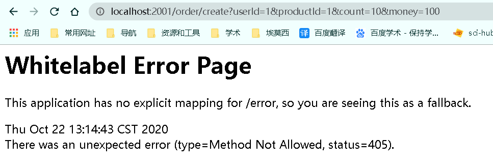

看看2001的controller中的`@GetMapping("/order/create")`是不是写成了@PostMapping("/order/create")

因为浏览器地址栏只能发Get请求

成功结果：

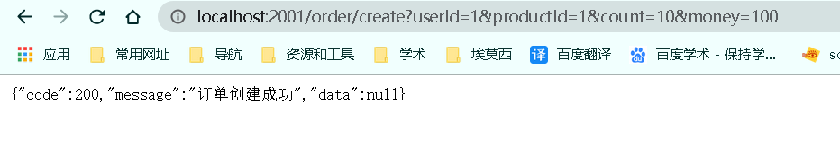

如果405异常，则需要把2003中的AccountServiceImpl中的sleep注释掉

### 超时异常，没加@GlobalTransactional

AccountServiceImpl添加超时

数据库情况

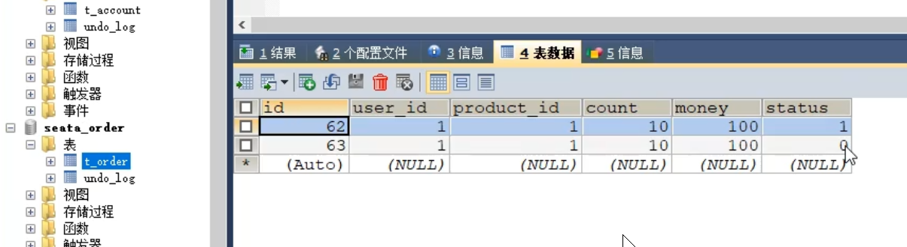

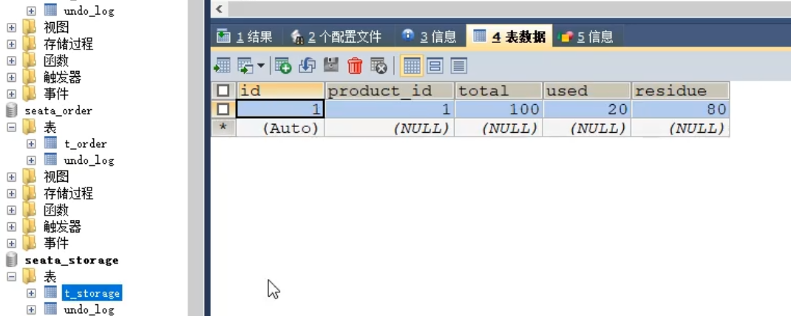

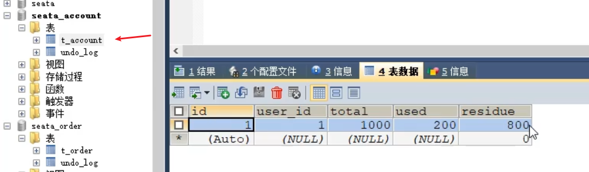

情况

- 当库存和账户余额扣减后，订单状态并没有设置为已经完成，没有从零改为1
- 而且由于feign的重试机制，账户余额还有可能被多次扣减

### 超时异常，添加@GlobalTransactional

2003AccountServiceImpl添加超时

2001OrderServiceImpl的create方法添加@GlobalTransactional

**页面异常**

**下单后数据库数据并没有任何改变  记录都添加不进来**

**回滚成功！**

## Seata之原理简介

### Seata

2019年1月份蚂蚁金服和阿里巴巴共同开源的分布式事务解决方案

Simple Extensible Autonomous Transaction Architecture,简单可扩展自治事务框架

2020起初，参加工作后用1.0以后的版本

### 再看TC/TM/RM三大组件

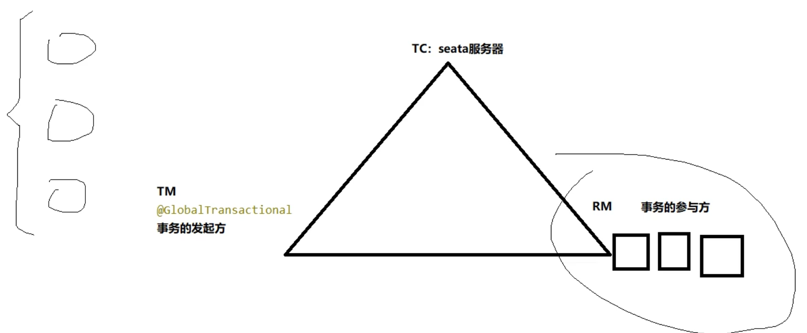

分布式事务的执行流程

- TM开启分布式事务(TM向TC注册全局事务记录)
- 换业务场景，编排数据库，服务等事务内资源（RM向TC汇报资源准备状态）
- TM结束分布式事务，事务一阶段结束（TM通知TC提交/回滚分布式事务）
- TC汇总事务信息，决定分布式事务是提交还是回滚
- TC通知所有RM提交/回滚资源，事务二阶段结束。

### AT模式如何做到对业务的无侵入

是什么http://seata.io/zh-cn/docs/overview/what-is-seata.html

**一阶段加载** 

业务数据和回滚日志记录在同一个本地事务中提交，释放本地锁和连接资源。

在一阶段, Seat会拦截“业务SQL"

1 SQL语义,找到"业务sαL"要更新的业务数据,在业务数据被更新前,将其保存成" before image

2 执行“业务SQL"更新业务数据,在业务数据更新之后

3其保存成" after image",最后生成行锁。

操作全部在—个数据库事务内完成,这样保证了一阶段操作的原子性。

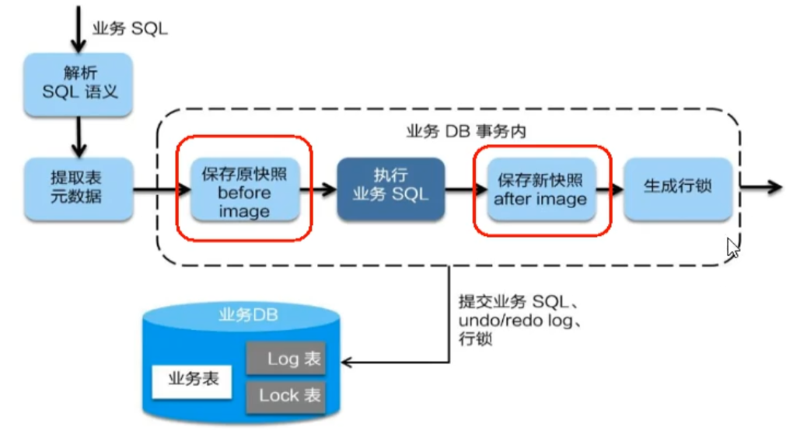

**二阶段提交**

提交异步化，非常快速地完成。

阶段如是顺利提交的话因为“业务SQL在一阶段已经提交至数据库,所以 Seat框架只需将一阶段保存的快照数据和行锁删掉,完成数据清理即可。

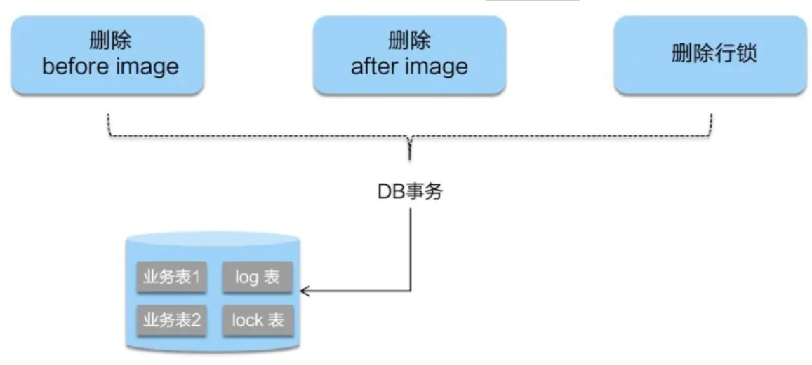


**二阶段回滚**

回滚通过一阶段的回滚日志进行反向补偿。

二阶段如果是回滚的话, Seata就需要回滚一阶段已经执行的"业务SQL",还原业务数据。

回滚方式便是用" before image”还原业务数据;但在还原前要首先要校验脏写,对比“数据库当前业务数据”和" after image如果两份数据完全一致就说明没有脏写,可以还原业务数据,如果不—致就说明有脏写,出现脏写就需要转人工处理

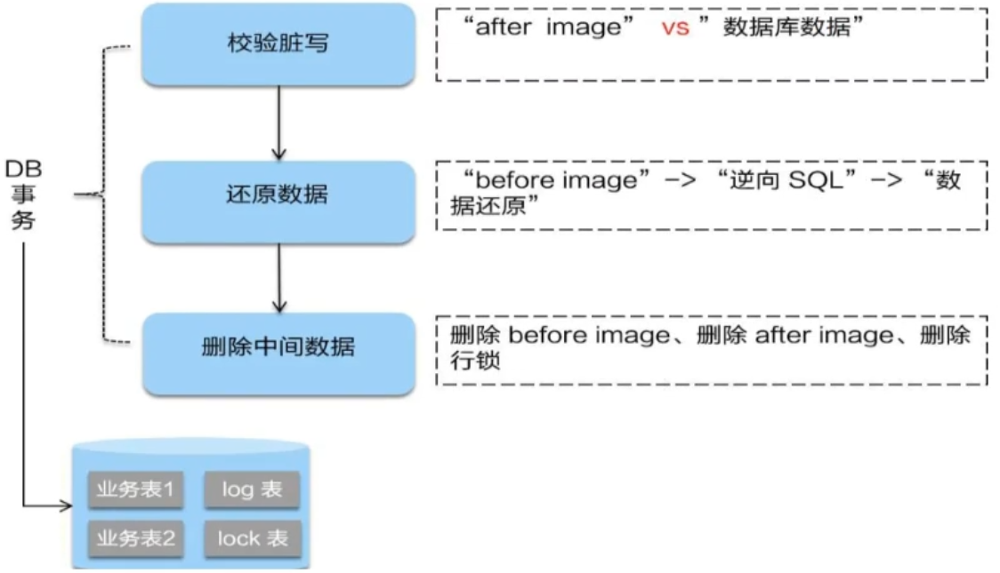


debug

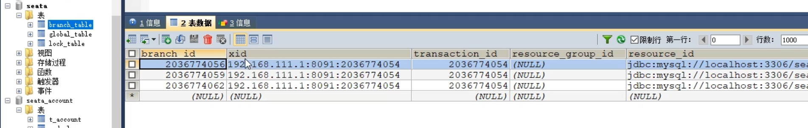

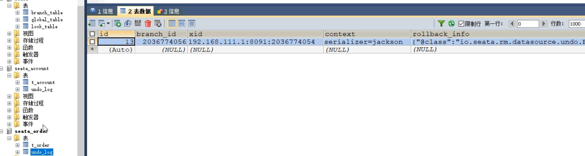

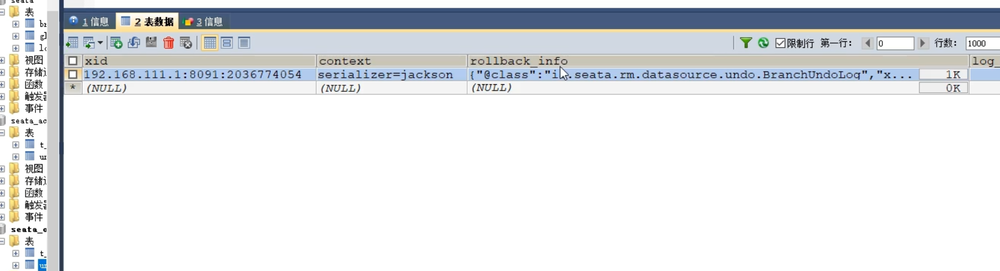

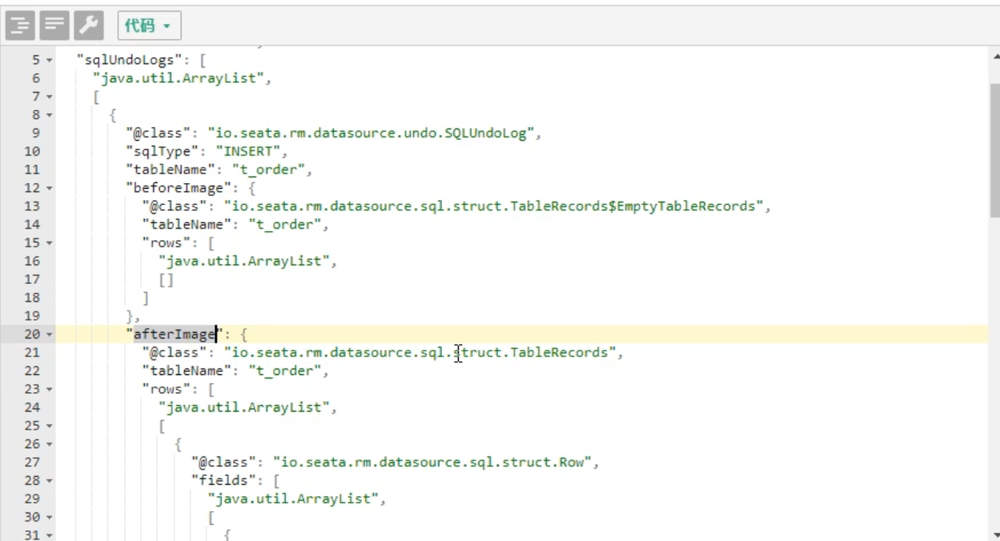


补充

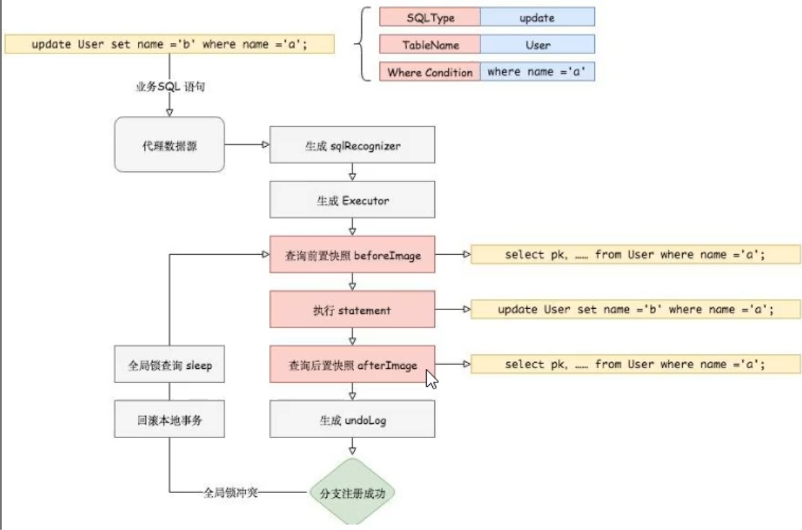

# 雪花算法

UUID要求：

- 全局唯一
- 趋势递增
- 单调递增
- 信息安全
- 含时间戳

```java
UUID.randomUUID().toString()  //JDK自带的
//唯一UUID，缺点：无序，入数据库性能差
```

**为什么无序的UUID会导致入库性能变差呢?**

1.无序,无法预测他的生成顺序,不能生成递增有序的数字.

首先分布式id般都会作为主键,但是安装mysql官方推荐主键要尽量越短越好,UUID每一个都很长,所以不是很推荐。

2.主键,ID作为主键时在特定的环境会存在一些问题。

比如做DB主键的场景下,UUID就非常不适用 MYSQL官方有明确的建议主键要尽量越短越好36个字符长度的UUID不符合要求

3.索引,B+树索引的分裂

既然分布式d是主键,然后主键是包含索引的,然后mysq的索引是通过b+树来实现的,每一次新的UUD数据的插入,为了查询的优化,都会对索引底层的b+树进行修改,因为UUD数据是无序的,所以每一次UUD数据的插入都会对主键地城的b+树进行很大的修改,这一点很不好。插入完全无序,不但会导致一些中间节点产生分裂,也会白白创造出很多不饱和的节点,这样大大降低了数据库插入的性能


糊涂工具包