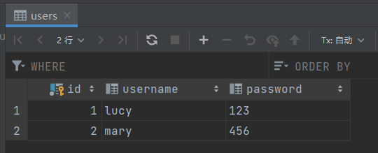

# SpringSecurity Web权限方案

## 三种方式进行用户名密码登录

有三种方式

- 通过配置文件
- 通过配置类
- 自定义编写实现类，查数据库

写一个controller用于测试：

```java
@GetMapping
public String hello(){
    return "hello";
}
```

### 方式一：在application.properties

```properties
spring.security.user.name=potato
spring.security.user.password=111111
```


### 方式二：配置类

```java
@Configuration
public class SecurityConfig extends WebSecurityConfigurerAdapter {

    @Bean
    public PasswordEncoder passwordEncoder() {
        return new BCryptPasswordEncoder();
    }

    @Override
    protected void configure(AuthenticationManagerBuilder auth) throws Exception {
        BCryptPasswordEncoder passwordEncoder = new BCryptPasswordEncoder();
        String password = passwordEncoder.encode("123");
        auth.inMemoryAuthentication().withUser("lucy").password(password).roles("admin");
    }
}
```

### **方式三：查数据库**

依赖：mybatis-plus、spring-security、数据库连接

第一步创建配置类,设置使用哪个 userdetailsservice实现类

```java
@Configuration
public class SecurityConfig extends WebSecurityConfigurerAdapter {
    @Autowired
    UserDetailsService userDetailsService;

    @Bean
    public PasswordEncoder passwordEncoder() {
        return new BCryptPasswordEncoder();
    }

    @Override
    protected void configure(AuthenticationManagerBuilder auth) throws Exception {
        auth.userDetailsService(userDetailsService).passwordEncoder(passwordEncoder());
    }
}
```


第二步编写实现类,返回User对象,User对象有用户名密码和操作权限。

Users实体类：

```java
@Data
@NoArgsConstructor
@AllArgsConstructor
public class Users {
    private Integer id;
    private String username;
    private String password;
}
```


```java
import com.baomidou.mybatisplus.core.mapper.BaseMapper;
import com.potato.demo1.entity.Users;
import org.springframework.stereotype.Repository;

@Repository
public interface UsersMapper extends BaseMapper<Users> {
}
```


```java
@Service("userDetailsService")
public class MyUserDetailsService implements UserDetailsService {
    @Autowired
    UsersMapper usersMapper;

    @Override
    public UserDetails loadUserByUsername(String username) throws UsernameNotFoundException {
        QueryWrapper<Users> wrapper = new QueryWrapper<>();
        wrapper.eq("username", username);
        Users users = usersMapper.selectOne(wrapper);
        if (users==null){
            //没有该用户名，认证失败
            throw new UsernameNotFoundException("用户名不存在");
        }

        List<GrantedAuthority> auths = AuthorityUtils.commaSeparatedStringToAuthorityList("role");
        return new User(users.getUsername(),new BCryptPasswordEncoder().encode(users.getPassword()),auths);
    }
}
```




https://www.bilibili.com/video/BV15a411A7kP?p=11