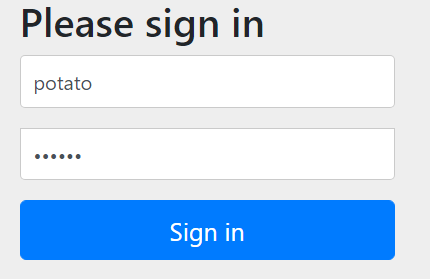

# SpringSecurity Web权限方案

## 三种方式进行用户名密码登录

有三种方式

- 通过配置文件
- 通过配置类
- 自定义编写实现类

写一个controller用于测试：

```java
@GetMapping
public String hello(){
    return "hello";
}
```

方式一：在application.properties

```properties
spring.security.user.name=potato
spring.security.user.password=111111
```



方式二：配置类

```java
@Configuration
public class SecurityConfig extends WebSecurityConfigurerAdapter {

    @Bean
    public PasswordEncoder passwordEncoder() {
        return new BCryptPasswordEncoder();
    }

    @Override
    protected void configure(AuthenticationManagerBuilder auth) throws Exception {
        BCryptPasswordEncoder passwordEncoder = new BCryptPasswordEncoder();
        String password = passwordEncoder.encode("123");
        auth.inMemoryAuthentication().withUser("lucy").password(password).roles("admin");
    }
}
```

**方式三：自定义编写实现类（推荐）**

第一步创建配置类,设置使用哪个 userdetailsservice实现类

第二步编写实现类,返回User对象,User对象有用户名密码和操作权限。

```java
@Configuration
public class SecurityConfig extends WebSecurityConfigurerAdapter {
    @Autowired
    UserDetailsService userDetailsService;

    @Bean
    public PasswordEncoder passwordEncoder() {
        return new BCryptPasswordEncoder();
    }

    @Override
    protected void configure(AuthenticationManagerBuilder auth) throws Exception {
        auth.userDetailsService(userDetailsService).passwordEncoder(passwordEncoder());
    }
}
```

实际中，用户名、密码、角色都是通过数据库查，这里为了方便就写死。

```java
@Service("userDetailsService")
public class MyUserDetailsService implements UserDetailsService {
    @Override
    public UserDetails loadUserByUsername(String username) throws UsernameNotFoundException {
        List<GrantedAuthority> auths = AuthorityUtils.commaSeparatedStringToAuthorityList("role");
        return new User("mary",new BCryptPasswordEncoder().encode("123"),auths);
    }
}
```

https://www.bilibili.com/video/BV15a411A7kP?p=9

