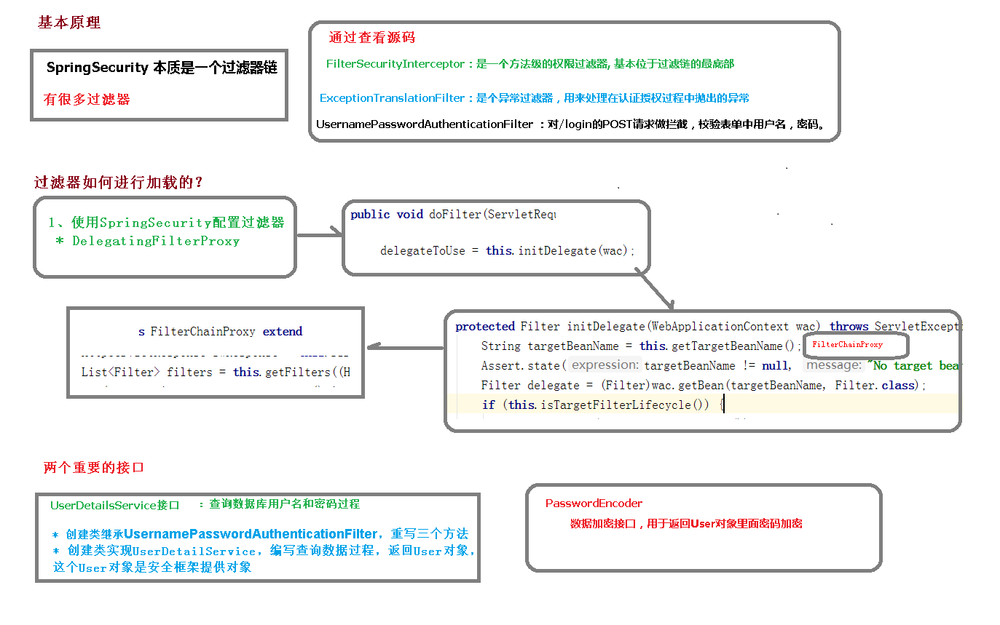

# SpringSecurity 基本原理

## 过滤器链

SpringSecurity 本质是一个过滤器链

```
org.springframework.security.web.context.request.async.WebAsyncManagerIntegrationFilter
org.springframework.security.web.context.SecurityContextPersistenceFilter
org.springframework.security.web.header.HeaderWriterFilter
org.springframework.security.web.csrf.CsrfFilter
org.springframework.security.web.authentication.logout.LogoutFilter
org.springframework.security.web.authentication.UsernamePasswordAuthenticationFilter
org.springframework.security.web.authentication.ui.DefaultLoginPageGeneratingFilter
org.springframework.security.web.authentication.ui.DefaultLogoutPageGeneratingFilter
org.springframework.security.web.savedrequest.RequestCacheAwareFilter
org.springframework.security.web.servletapi.SecurityContextHolderAwareRequestFilter
org.springframework.security.web.authentication.AnonymousAuthenticationFilter
org.springframework.security.web.session.SessionManagementFilter
org.springframework.security.web.access.ExceptionTranslationFilter
org.springframework.security.web.access.intercept.FilterSecurityInterceptor
```

代码底层流程：重点看三个过滤器：

- FilterSecurityInterceptor：是一个**方法级的权限过滤器**, 基本位于过滤链的最底部。

  super.beforeInvocation(fi) 表示查看之前的filter 是否通过。
  fi.getChain().doFilter(fi.getRequest(), fi.getResponse());表示真正的调用后台的服务。

- ExceptionTranslationFilter：是个**异常过滤器**，用来处理在认证授权过程中抛出的异常

- UsernamePasswordAuthenticationFilter ：对/login的POST请求做拦截，**校验表单中用户名，密码**。

## 过滤器是如何加载的



## UserDetailsService接口

作用：查询数据库用户名和密码的过程

当什么也没有配置的时候，账号和密码是由Spring Security定义生成的。而在实际项目中账号和密码都是从数据库中查询出来的。 所以我们要通过自定义逻辑控制认证逻辑。
如果需要自定义逻辑时，只需要实现UserDetailsService接口即可。接口定义如下：

```java
public interface UserDetailsService {
   UserDetails loadUserByUsername(String username) throws UsernameNotFoundException;
}
```

返回值UserDetails，这个类是系统默认的用户“**主体**”

UserDetails接口的方法：

```java
public interface UserDetails extends Serializable {
    // 表示获取登录用户所有权限
	Collection<? extends GrantedAuthority> getAuthorities();
    // 表示获取密码
	String getPassword();
	// 表示获取用户名
	String getUsername();
	// 表示判断账户是否过期
	boolean isAccountNonExpired();
	// 表示判断账户是否被锁定
	boolean isAccountNonLocked();
	// 表示凭证{密码}是否过期
	boolean isCredentialsNonExpired();
	// 表示当前用户是否可用
	boolean isEnabled();

}
```

以下是Spring Security自带的UserDetails实现类:

```java
public class User implements UserDetails, CredentialsContainer {

   private static final long serialVersionUID = SpringSecurityCoreVersion.SERIAL_VERSION_UID;

   private static final Log logger = LogFactory.getLog(User.class);

   private String password;

   private final String username;

   private final Set<GrantedAuthority> authorities;

   private final boolean accountNonExpired;

   private final boolean accountNonLocked;

   private final boolean credentialsNonExpired;

   private final boolean enabled;
   //省略实现的方法
}

```

以后我们只需要使用User 这个实体类即可，或者自己实现UserDetails

## PasswordEncoder 接口

```java
public interface PasswordEncoder {
// 表示把参数按照特定的解析规则进行解析
   String encode(CharSequence rawPassword);
// 表示验证从存储中获取的编码密码与编码后提交的原始密码是否匹配。如果密码匹配，则返回true；如果不匹配，则返回false。第一个参数表示需要被解析的密码。第二个参数表示存储的密码。
   boolean matches(CharSequence rawPassword, String encodedPassword);
// 表示如果解析的密码能够再次进行解析且达到更安全的结果则返回true，否则返回false。默认返回false。
   default boolean upgradeEncoding(String encodedPassword) {
      return false;
   }

}
```

接口实现类

- BCryptPasswordEncoder是Spring Security官方推荐的密码解析器，平时多使用这个解析器。

- BCryptPasswordEncoder是对bcrypt强散列方法的具体实现。是基于Hash算法实现的单向加密。可以通过strength控制加密强度，默认10.
- ......

