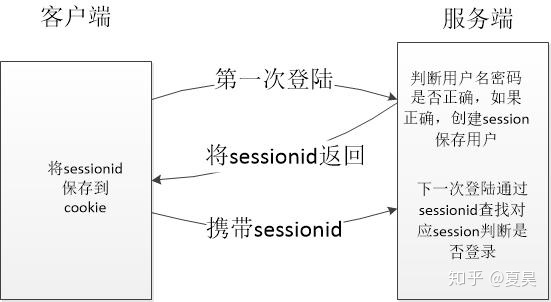
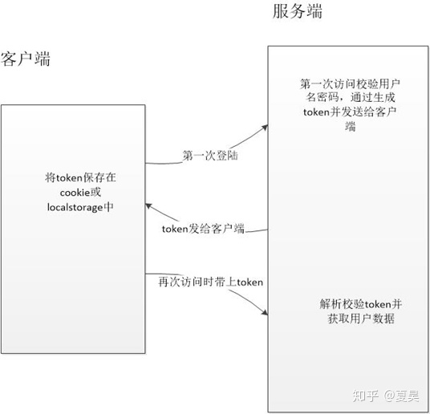

常用的认证方式有基于session的认证和基于token的认证。

[Spring Security 一：认证和授权 - 知乎 (zhihu.com)](https://zhuanlan.zhihu.com/p/108149585)

## 基于session的认证

用户登录成功后服务器会将用户的信息保存在session(当前会话)当中，每个session对应有一个sessionid,将该sessionid发送给客户端保存在cookie中。客户端下次访问的时候会将该sessioid带上，在服务器端进行比对看是否存在对应的session以此判断是否登录。

## 基于token的验证

用户登录成功后服务端生成一个token发送给客户端，客户端将收到的token存储在cookie或localstorage中，**下次访问的时候带上token到服务端验证**。

## Session和token方式比较

Sesion的认证方式需要将session存储在服务端，会占用服务端的内存，并且需要客户端开启cookie功能，而基于token的认证方式则不用将token存储在服务端，客户端的保存也比较灵活，现在前后端分离的开发方式越来越流行，所以采用基于token的验证方式更合适。