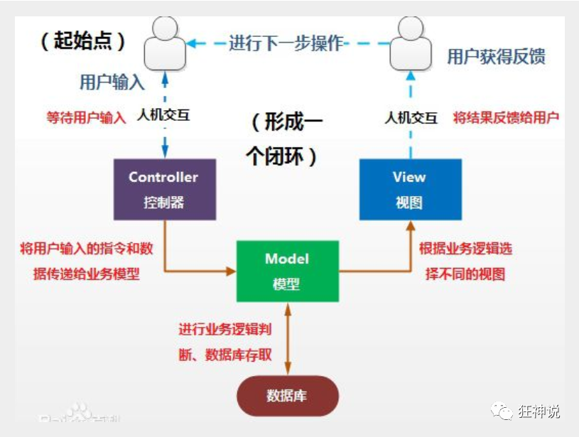
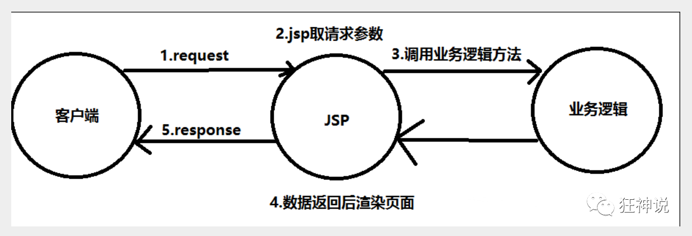
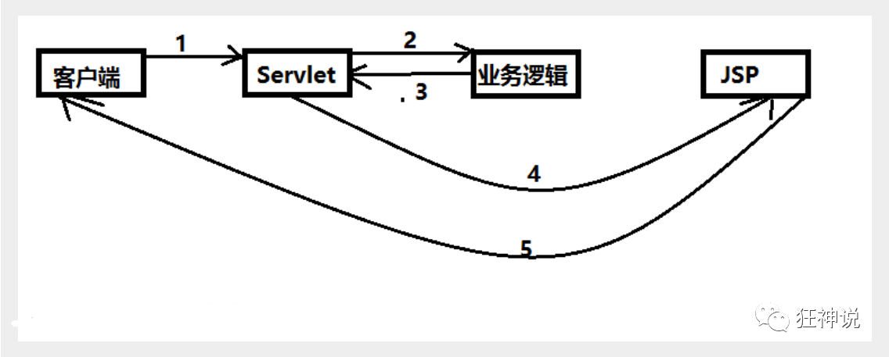
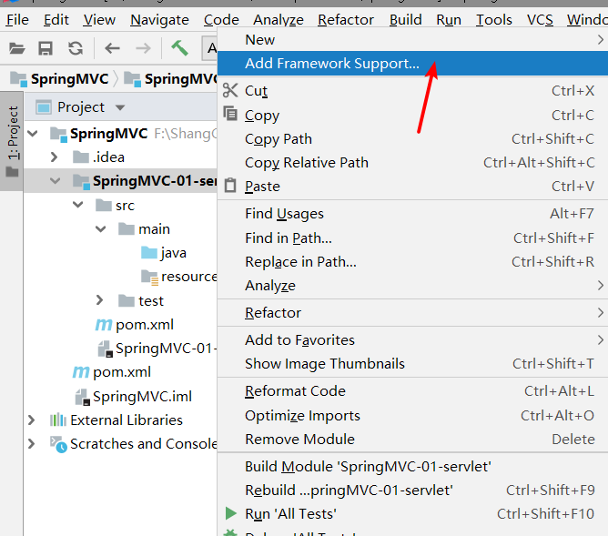
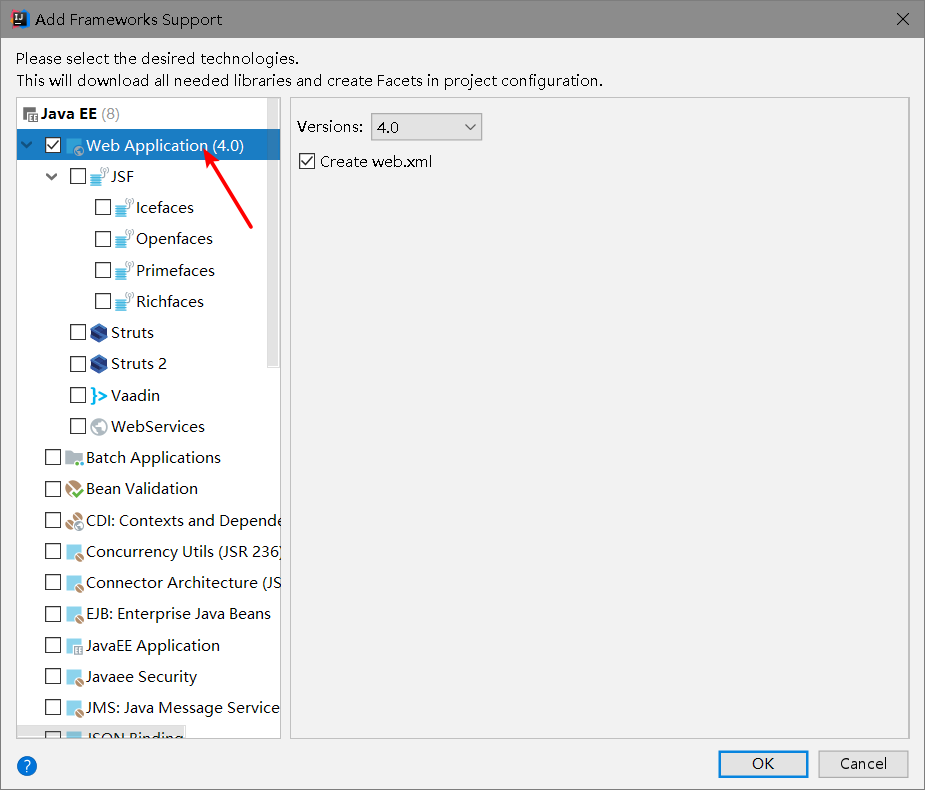
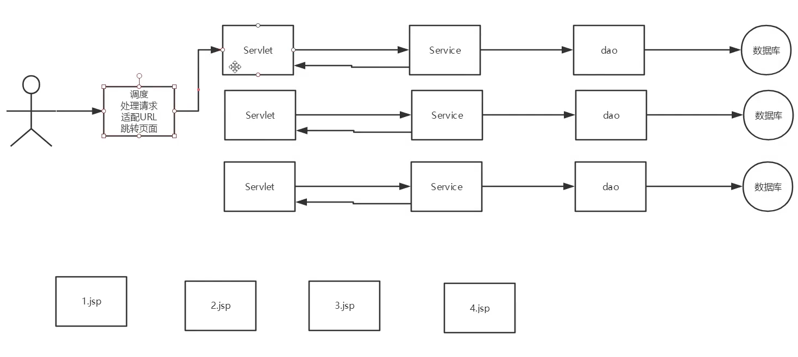
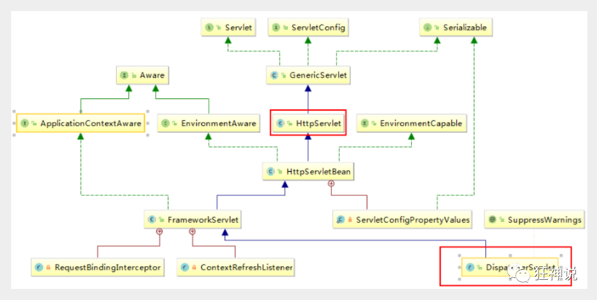
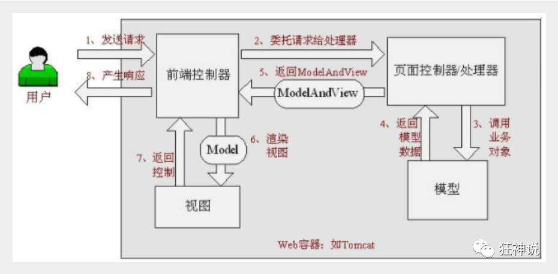
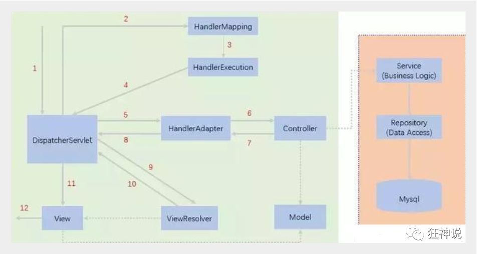
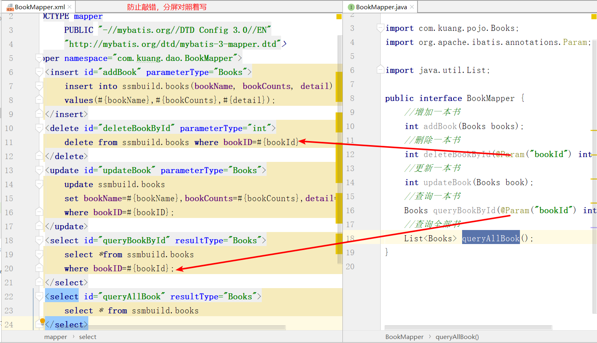

[TOC]

# 1.回顾MVC

重点

SpringMVC:SpringMVC执行流程

SSM框架整合

## 1.1、什么是MVC

- MVC是模型(Model)、视图(View)、控制器(Controller)的简写，是一种软件设计规范。

  模型（dao,service)

  视图（jsp/html)

  控制器(Servlet) 转发  重定向

  MVC是一种软件设计规范

- 是将业务逻辑、数据、显示分离的方法来组织代码。

- MVC主要作用是**降低了视图与业务逻辑间的双向偶合**。

- MVC不是一种设计模式，**MVC是一种架构模式**。当然不同的MVC存在差异。

**Model（模型）：**数据模型，提供要展示的数据，因此包含数据和行为，可以认为是领域模型或JavaBean组件（包含数据和行为），不过现在一般都分离开来：Value Object（数据Dao） 和 服务层（行为Service）。也就是模型提供了模型数据查询和模型数据的状态更新等功能，包括数据和业务。

前端 数据传输 实体类

pojo

**View（视图）：**负责进行模型的展示，一般就是我们见到的用户界面，客户想看到的东西。


**Controller（控制器）：**接收用户请求，委托给模型进行处理（状态改变），处理完毕后把返回的模型数据返回给视图，由视图负责展示。也就是说控制器做了个调度员的工作。

**最典型的MVC就是JSP + servlet + javabean的模式。**



## 1.2、Model1时代

- 在web早期的开发中，通常采用的都是Model1。
- Model1中，主要分为两层，视图层和模型层。



Model1优点：架构简单，比较适合小型项目开发；

Model1缺点：JSP职责不单一，职责过重，不便于维护；

## 1.3、Model2时代

Model2把一个项目分成三部分，包括**视图、控制、模型。**



1. 用户发请求

2. Servlet接收请求数据，并调用对应的业务逻辑方法

3. 业务处理完毕，返回更新后的数据给servlet

4. servlet转向到JSP，由JSP来渲染页面

5. 响应给前端更新后的页面

   **职责分析：**

   **Controller：控制器**

   1. 取得表单数据
   2. 调用业务逻辑
   3. 转向指定的页面

   **Model：模型**

   1. 业务逻辑
   2. 保存数据的状态

   **View：视图**

   1. 显示页面

   Model2这样不仅提高的代码的复用率与项目的扩展性，且大大降低了项目的维护成本。Model 1模式的实现比较简单，适用于快速开发小规模项目，Model1中JSP页面身兼View和Controller两种角色，将控制逻辑和表现逻辑混杂在一起，从而导致代码的重用性非常低，增加了应用的扩展性和维护的难度。Model2消除了Model1的缺点。

   MVVM:

   M

   V

   VM ViewModel:双向绑定

你的项目的架构，是设计好的，还是演进的？

应该回答演进的

- Alibaba PHP

- 随着用户大 Java

- 去IOE  MYSQL

- MYSQL：阿里的不一样的-->AliSQL,AliRedis

- All in one--->。。。--->微服务

  

## 1.4、回顾Servlet

1.新建一个Maven工程当做父工程！pom依赖！

删除父工程的src目录

```xml
<dependencies>
   <dependency>
       <groupId>junit</groupId>
       <artifactId>junit</artifactId>
       <version>4.12</version>
   </dependency>
   <dependency>
       <groupId>org.springframework</groupId>
       <artifactId>spring-webmvc</artifactId>
       <version>5.1.9.RELEASE</version>
   </dependency>
   <dependency>
       <groupId>javax.servlet</groupId>
       <artifactId>servlet-api</artifactId>
       <version>2.5</version>
   </dependency>
   <dependency>
       <groupId>javax.servlet.jsp</groupId>
       <artifactId>jsp-api</artifactId>
       <version>2.2</version>
   </dependency>
   <dependency>
       <groupId>javax.servlet</groupId>
       <artifactId>jstl</artifactId>
       <version>1.2</version>
   </dependency>
</dependencies>
```

2.建立一个Moudle：springmvc-01-servlet ， 添加Web app的支持！





3.导入servlet 和 jsp 的 jar 依赖

web目录下的pom.xml

```xml
<dependency>
   <groupId>javax.servlet</groupId>
   <artifactId>servlet-api</artifactId>
   <version>2.5</version>
</dependency>
<dependency>
   <groupId>javax.servlet.jsp</groupId>
   <artifactId>jsp-api</artifactId>
   <version>2.2</version>
</dependency>
```

4.编写一个Servlet类，用来处理用户的请求

```java
package com.kuang.servlet;

//实现Servlet接口
public class HelloServlet extends HttpServlet {
   @Override
   protected void doGet(HttpServletRequest req, HttpServletResponse resp) throws ServletException, IOException {
       //取得参数
       String method = req.getParameter("method");
       if (method.equals("add")){
           req.getSession().setAttribute("msg","执行了add方法");
      }
       if (method.equals("delete")){
           req.getSession().setAttribute("msg","执行了delete方法");
      }
       //业务逻辑
       //视图跳转
       req.getRequestDispatcher("/WEB-INF/jsp/hello.jsp").forward(req,resp);
  }

   @Override
   protected void doPost(HttpServletRequest req, HttpServletResponse resp) throws ServletException, IOException {
       doGet(req,resp);
  }
}
```

5.编写Hello.jsp，在WEB-INF目录下新建一个jsp的文件夹，新建hello.jsp

```jsp
<%@ page contentType="text/html;charset=UTF-8" language="java" %>
<html>
<head>
   <title>Kuangshen</title>
</head>
<body>
${msg}
</body>
</html
```

6.在web.xml中注册Servlet

```xml
<?xml version="1.0" encoding="UTF-8"?>
<web-app xmlns="http://xmlns.jcp.org/xml/ns/javaee"
        xmlns:xsi="http://www.w3.org/2001/XMLSchema-instance"
        xsi:schemaLocation="http://xmlns.jcp.org/xml/ns/javaee http://xmlns.jcp.org/xml/ns/javaee/web-app_4_0.xsd"
        version="4.0">
   <servlet>
       <servlet-name>HelloServlet</servlet-name>
       <servlet-class>com.kuang.servlet.HelloServlet</servlet-class>
   </servlet>
   <servlet-mapping>
       <servlet-name>HelloServlet</servlet-name>
       <url-pattern>/user</url-pattern>
   </servlet-mapping>

</web-app>
```

7.配置Tomcat，并启动测试

- localhost:8080/user?method=add
- localhost:8080/user?method=delete

**MVC框架要做哪些事情**

1. 将url映射到java类或java类的方法 .
2. 封装用户提交的数据 .
3. 处理请求--调用相关的业务处理--封装响应数据 .
4. 将响应的数据进行渲染 . jsp / html 等表示层数据 .

**说明：**

​	常见的服务器端MVC框架有：Struts、Spring MVC、ASP.NET MVC、Zend Framework、JSF；常见前端MVC框架：vue、angularjs、react、backbone；由MVC演化出了另外一些模式如：MVP、MVVM 等等....

# 2.什么是SpringMVC


## 2.1概述

Spring MVC是Spring Framework的一部分，是基于Java实现MVC的轻量级Web框架。

查看官方文档：https://docs.spring.io/spring/docs/5.2.0.RELEASE/spring-framework-reference/web.html#spring-web

**我们为什么要学习SpringMVC呢?**

 Spring MVC的特点：

1. 轻量级，简单易学
2. 高效 , 基于请求响应的MVC框架
3. 与Spring兼容性好，无缝结合
4. 约定优于配置
5. 功能强大：RESTful、数据验证、格式化、本地化、主题等
6. 简洁灵活

Spring的web框架围绕**DispatcherServlet** [ 调度Servlet ] 设计。

DispatcherServlet的作用是将请求分发到不同的处理器。从Spring 2.5开始，使用Java 5或者以上版本的用户可以采用基于注解形式进行开发，十分简洁；

正因为SpringMVC好 , 简单 , 便捷 , 易学 , 天生和Spring无缝集成(使用SpringIoC和Aop) , 使用约定优于配置 . 能够进行简单的junit测试 . 支持Restful风格 .异常处理 , 本地化 , 国际化 , 数据验证 , 类型转换 , 拦截器 等等......所以我们要学习 .

**最重要的一点还是用的人多 , 使用的公司多 .** 



## 2.2、中心控制器

Spring的web框架围绕DispatcherServlet设计。DispatcherServlet的作用是将请求分发到不同的处理器。从Spring 2.5开始，使用Java 5或者以上版本的用户可以采用基于注解的controller声明方式。

​	Spring MVC框架像许多其他MVC框架一样, **以请求为驱动** , **围绕一个中心Servlet分派请求及提供其他功能**，**DispatcherServlet是一个实际的Servlet (它继承自HttpServlet 基类)**。



SpringMVC的原理如下图所示：

​	当发起请求时被前置的控制器拦截到请求，根据请求参数生成代理请求，找到请求对应的实际控制器，控制器处理请求，创建数据模型，访问数据库，将模型响应给中心控制器，控制器使用模型与视图渲染视图结果，将结果返回给中心控制器，再将结果返回给请求者。



## 2.3、SpringMVC执行原理



图为SpringMVC的一个较完整的流程图，实线表示SpringMVC框架提供的技术，不需要开发者实现，虚线表示需要开发者实现。

**简要分析执行流程**

1. DispatcherServlet表示前置控制器，是整个SpringMVC的控制中心。用户发出请求，DispatcherServlet接收请求并拦截请求。

   我们假设请求的url为 : http://localhost:8080/SpringMVC/hello

   

   **如上url拆分成三部分：**

   http://localhost:8080服务器域名

   SpringMVC部署在服务器上的web站点

   hello表示控制器

   通过分析，如上url表示为：请求位于服务器localhost:8080上的SpringMVC站点的hello控制器。

2. HandlerMapping为处理器映射。DispatcherServlet调用HandlerMapping,HandlerMapping根据请求url查找Handler。

3. HandlerExecution表示具体的Handler,其主要作用是根据url查找控制器，如上url被查找控制器为：hello。

4. HandlerExecution将解析后的信息传递给DispatcherServlet,如解析控制器映射等。

5. HandlerAdapter表示处理器适配器，其按照特定的规则去执行Handler。

6. Handler让具体的Controller执行。

7. Controller将具体的执行信息返回给HandlerAdapter,如ModelAndView。

8. HandlerAdapter将视图逻辑名或模型传递给DispatcherServlet。

9. DispatcherServlet调用视图解析器(ViewResolver)来解析HandlerAdapter传递的逻辑视图名。

10. 视图解析器将解析的逻辑视图名传给DispatcherServlet。

11. DispatcherServlet根据视图解析器解析的视图结果，调用具体的视图。

12. 最终视图呈现给用户。

在这里先听一遍原理，不理解没有关系，我们马上来写一个对应的代码实现大家就明白了，如果不明白，那就写10遍，没有笨人，只有懒人！


```
@Component 组件
@Service  Service
@Controller   Controller  
@Repository   dao
```


LinkHashMap

ModelMap :继承了LinkHashMap,所以他拥有LinkHashMap的全部功能

Model:精简版（大部分情况，我们直接使用Model


前后端分离时代

后端部署后端，提供接口：提供数据

​				json

前端独立部署，负责渲染后端的数据：

“hello"

# 最后、SSM整合

## 1.环境要求

- IDEA
- MySQL 5.7.19
- Tomcat 9
- Maven 3.6

 要求：

- 需要熟练掌握MySQL数据库，Spring，JavaWeb及MyBatis知识，简单的前端知识

## 2.数据库环境

创建一个存放书籍数据的数据库表

```sql
CREATE DATABASE `ssmbuild`;

USE `ssmbuild`;

DROP TABLE IF EXISTS `books`;

CREATE TABLE `books` (
`bookID` INT(10) NOT NULL AUTO_INCREMENT COMMENT '书id',
`bookName` VARCHAR(100) NOT NULL COMMENT '书名',
`bookCounts` INT(11) NOT NULL COMMENT '数量',
`detail` VARCHAR(200) NOT NULL COMMENT '描述',
KEY `bookID` (`bookID`)
) ENGINE=INNODB DEFAULT CHARSET=utf8

INSERT  INTO `books`(`bookID`,`bookName`,`bookCounts`,`detail`)VALUES 
(1,'Java',1,'从入门到放弃'),
(2,'MySQL',10,'从删库到跑路'),
(3,'Linux',5,'从进门到进牢');
```

## 3.基本环境搭建

1. 新建一Maven项目！起名为 ssmbuild ， 添加web的支持

2. 导入相关的pom依赖！

   ```xml
   <dependencies>
      <!--Junit-->
      <dependency>
          <groupId>junit</groupId>
          <artifactId>junit</artifactId>
          <version>4.12</version>
      </dependency>
      <!--数据库驱动-->
      <dependency>
          <groupId>mysql</groupId>
          <artifactId>mysql-connector-java</artifactId>
          <version>5.1.47</version>
      </dependency>
      <!-- 数据库连接池 -->
      <dependency>
          <groupId>com.mchange</groupId>
          <artifactId>c3p0</artifactId>
          <version>0.9.5.2</version>
      </dependency>
   
      <!--Servlet - JSP -->
      <dependency>
          <groupId>javax.servlet</groupId>
          <artifactId>servlet-api</artifactId>
          <version>2.5</version>
      </dependency>
      <dependency>
          <groupId>javax.servlet.jsp</groupId>
          <artifactId>jsp-api</artifactId>
          <version>2.2</version>
      </dependency>
      <dependency>
          <groupId>javax.servlet</groupId>
          <artifactId>jstl</artifactId>
          <version>1.2</version>
      </dependency>
   
      <!--Mybatis-->
      <dependency>
          <groupId>org.mybatis</groupId>
          <artifactId>mybatis</artifactId>
          <version>3.5.2</version>
      </dependency>
      <dependency>
          <groupId>org.mybatis</groupId>
          <artifactId>mybatis-spring</artifactId>
          <version>2.0.2</version>
      </dependency>
   
      <!--Spring-->
      <dependency>
          <groupId>org.springframework</groupId>
          <artifactId>spring-webmvc</artifactId>
          <version>5.1.9.RELEASE</version>
      </dependency>
      <dependency>
          <groupId>org.springframework</groupId>
          <artifactId>spring-jdbc</artifactId>
          <version>5.1.9.RELEASE</version>
      </dependency>
   </dependencies>
   ```

3. Maven资源过滤设置

   ```xml
   <build>
      <resources>
          <resource>
              <directory>src/main/java</directory>
              <includes>
                  <include>**/*.properties</include>
                  <include>**/*.xml</include>
              </includes>
              <filtering>false</filtering>
          </resource>
          <resource>
              <directory>src/main/resources</directory>
              <includes>
                  <include>**/*.properties</include>
                  <include>**/*.xml</include>
              </includes>
              <filtering>false</filtering>
          </resource>
      </resources>
   </build>
   ```

   4. 建立基本结构和配置框架！

      com.kuang.pojo

      com.kuang.dao

      com.kuang.service

      com.kuang.controller

      mybatis-config.xml

      ```xml
      <?xml version="1.0" encoding="UTF-8" ?>
      <!DOCTYPE configuration
             PUBLIC "-//mybatis.org//DTD Config 3.0//EN"
             "http://mybatis.org/dtd/mybatis-3-config.dtd">
      <configuration>
      
      </configuration>
      ```

      applicationContext.xml

      ```xml
      <?xml version="1.0" encoding="UTF-8"?>
      <beans xmlns="http://www.springframework.org/schema/beans"
            xmlns:xsi="http://www.w3.org/2001/XMLSchema-instance"
            xsi:schemaLocation="http://www.springframework.org/schema/beans
             http://www.springframework.org/schema/beans/spring-beans.xsd">
      
      </beans>
      ```

## 4.Mybatis层编写

1. 数据库配置文件 database.properties

   ```properties
   jdbc.driver=com.mysql.jdbc.Driver
   jdbc.url=jdbc:mysql://localhost:3306/ssmbuild?useSSL=true&useUnicode=true&characterEncoding=utf8
   jdbc.username=root
   jdbc.password=root
   ```

2. IDEA关联数据库

3. 编写MyBatis的核心配置文件

   ```xml
   <?xml version="1.0" encoding="UTF-8" ?>
   <!DOCTYPE configuration
          PUBLIC "-//mybatis.org//DTD Config 3.0//EN"
          "http://mybatis.org/dtd/mybatis-3-config.dtd">
   <configuration>
      
      <typeAliases>
          <package name="com.kuang.pojo"/>
      </typeAliases>
      <mappers>
          <mapper resource="com/kuang/dao/BookMapper.xml"/>
      </mappers>
   
   </configuration>
   ```

4. 编写数据库对应的实体类 com.kuang.pojo.Books

   使用lombok插件！

   ```java
   package com.kuang.pojo;
   
   import lombok.AllArgsConstructor;
   import lombok.Data;
   import lombok.NoArgsConstructor;
   
   @Data
   @AllArgsConstructor
   @NoArgsConstructor
   public class Books {
      
      private int bookID;
      private String bookName;
      private int bookCounts;
      private String detail;
      
   }
   ```

5. 编写Dao层的 Mapper接口！

   ```java
   package com.kuang.dao;
   
   import com.kuang.pojo.Books;
   import java.util.List;
   
   public interface BookMapper {
   
      //增加一个Book
      int addBook(Books book);
   
      //根据id删除一个Book
      int deleteBookById(int id);
   
      //更新Book
      int updateBook(Books books);
   
      //根据id查询,返回一个Book
      Books queryBookById(int id);
   
      //查询全部Book,返回list集合
      List<Books> queryAllBook();
   
   }
   ```

6. 编写接口对应的 Mapper.xml 文件。需要导入MyBatis的包

   

```xml
<?xml version="1.0" encoding="UTF-8" ?>
<!DOCTYPE mapper
       PUBLIC "-//mybatis.org//DTD Mapper 3.0//EN"
       "http://mybatis.org/dtd/mybatis-3-mapper.dtd">

<mapper namespace="com.kuang.dao.BookMapper">

   <!--增加一个Book-->
   <insert id="addBook" parameterType="Books">
      insert into ssmbuild.books(bookName,bookCounts,detail)
      values (#{bookName}, #{bookCounts}, #{detail})
   </insert>

   <!--根据id删除一个Book-->
   <delete id="deleteBookById" parameterType="int">
      delete from ssmbuild.books where bookID=#{bookID}
   </delete>

   <!--更新Book-->
   <update id="updateBook" parameterType="Books">
      update ssmbuild.books
      set bookName = #{bookName},bookCounts = #{bookCounts},detail = #{detail}
      where bookID = #{bookID}
   </update>

   <!--根据id查询,返回一个Book-->
   <select id="queryBookById" resultType="Books">
      select * from ssmbuild.books
      where bookID = #{bookID}
   </select>

   <!--查询全部Book-->
   <select id="queryAllBook" resultType="Books">
      SELECT * from ssmbuild.books
   </select>

</mapper>
```

7. 编写Service层的接口和实现类

接口：

```java
package com.kuang.service;

import com.kuang.pojo.Books;

import java.util.List;

//BookService:底下需要去实现,调用dao层
public interface BookService {
   //增加一个Book
   int addBook(Books book);
   //根据id删除一个Book
   int deleteBookById(int id);
   //更新Book
   int updateBook(Books books);
   //根据id查询,返回一个Book
   Books queryBookById(int id);
   //查询全部Book,返回list集合
   List<Books> queryAllBook();
}
```

实现类：

```java
package com.kuang.service;

import com.kuang.dao.BookMapper;
import com.kuang.pojo.Books;
import java.util.List;

public class BookServiceImpl implements BookService {

   //调用dao层的操作，设置一个set接口，方便Spring管理
   private BookMapper bookMapper;

   public void setBookMapper(BookMapper bookMapper) {
       this.bookMapper = bookMapper;
  }
   
   public int addBook(Books book) {
       return bookMapper.addBook(book);
  }
   
   public int deleteBookById(int id) {
       return bookMapper.deleteBookById(id);
  }
   
   public int updateBook(Books books) {
       return bookMapper.updateBook(books);
  }
   
   public Books queryBookById(int id) {
       return bookMapper.queryBookById(id);
  }
   
   public List<Books> queryAllBook() {
       return bookMapper.queryAllBook();
  }
}
```

**OK，到此，底层需求操作编写完毕！**

## 5.Spring层

1. 配置**Spring整合MyBatis**，我们这里数据源使用c3p0连接池；
2. 我们去编写Spring整合Mybatis的相关的配置文件；spring-dao.xml

```xml
<?xml version="1.0" encoding="UTF-8"?>
<beans xmlns="http://www.springframework.org/schema/beans"
      xmlns:xsi="http://www.w3.org/2001/XMLSchema-instance"
      xmlns:context="http://www.springframework.org/schema/context"
      xsi:schemaLocation="http://www.springframework.org/schema/beans
       http://www.springframework.org/schema/beans/spring-beans.xsd
       http://www.springframework.org/schema/context
       https://www.springframework.org/schema/context/spring-context.xsd">

   <!-- 配置整合mybatis -->
   <!-- 1.关联数据库文件 -->
   <context:property-placeholder location="classpath:database.properties"/>

   <!-- 2.数据库连接池 -->
   <!--数据库连接池
       dbcp 半自动化操作 不能自动连接
       c3p0 自动化操作（自动的加载配置文件 并且设置到对象里面）
   -->
   <bean id="dataSource" class="com.mchange.v2.c3p0.ComboPooledDataSource">
       <!-- 配置连接池属性 -->
       <property name="driverClass" value="${jdbc.driver}"/>
       <property name="jdbcUrl" value="${jdbc.url}"/>
       <property name="user" value="${jdbc.username}"/>
       <property name="password" value="${jdbc.password}"/>

       <!-- c3p0连接池的私有属性 -->
       <property name="maxPoolSize" value="30"/>
       <property name="minPoolSize" value="10"/>
       <!-- 关闭连接后不自动commit -->
       <property name="autoCommitOnClose" value="false"/>
       <!-- 获取连接超时时间 -->
       <property name="checkoutTimeout" value="10000"/>
       <!-- 当获取连接失败重试次数 -->
       <property name="acquireRetryAttempts" value="2"/>
   </bean>

   <!-- 3.配置SqlSessionFactory对象 -->
   <bean id="sqlSessionFactory" class="org.mybatis.spring.SqlSessionFactoryBean">
       <!-- 注入数据库连接池 -->
       <property name="dataSource" ref="dataSource"/>
       <!-- 配置MyBaties全局配置文件:mybatis-config.xml -->
       <property name="configLocation" value="classpath:mybatis-config.xml"/>
   </bean>

   <!-- 4.配置扫描Dao接口包，动态实现Dao接口注入到spring容器中 -->
   <!--解释 ：https://www.cnblogs.com/jpfss/p/7799806.html-->
   <bean class="org.mybatis.spring.mapper.MapperScannerConfigurer">
       <!-- 注入sqlSessionFactory -->
       <property name="sqlSessionFactoryBeanName" value="sqlSessionFactory"/>
       <!-- 给出需要扫描Dao接口包 -->
       <property name="basePackage" value="com.kuang.dao"/>
   </bean>

</beans>
```

3. **Spring整合service层**

```xml
<?xml version="1.0" encoding="UTF-8"?>
<beans xmlns="http://www.springframework.org/schema/beans"
      xmlns:xsi="http://www.w3.org/2001/XMLSchema-instance"
      xmlns:context="http://www.springframework.org/schema/context"
      xsi:schemaLocation="http://www.springframework.org/schema/beans
   http://www.springframework.org/schema/beans/spring-beans.xsd
   http://www.springframework.org/schema/context
   http://www.springframework.org/schema/context/spring-context.xsd">

   <!-- 扫描service相关的bean -->
   <context:component-scan base-package="com.kuang.service" />

   <!--BookServiceImpl注入到IOC容器中-->
   <bean id="BookServiceImpl" class="com.kuang.service.BookServiceImpl">
       <property name="bookMapper" ref="bookMapper"/>
   </bean>

   <!-- 配置事务管理器 -->
   <bean id="transactionManager" class="org.springframework.jdbc.datasource.DataSourceTransactionManager">
       <!-- 注入数据库连接池 -->
       <property name="dataSource" ref="dataSource" />
   </bean>

</beans>
```

Spring层搞定！再次理解一下，Spring就是一个大杂烩，一个容器！对吧！

## 6.SpringMVC层

1. web.xml

   ```xml
   <?xml version="1.0" encoding="UTF-8"?>
   <web-app xmlns="http://xmlns.jcp.org/xml/ns/javaee"
           xmlns:xsi="http://www.w3.org/2001/XMLSchema-instance"
           xsi:schemaLocation="http://xmlns.jcp.org/xml/ns/javaee http://xmlns.jcp.org/xml/ns/javaee/web-app_4_0.xsd"
           version="4.0">
   
      <!--DispatcherServlet-->
      <servlet>
          <servlet-name>DispatcherServlet</servlet-name>
          <servlet-class>org.springframework.web.servlet.DispatcherServlet</servlet-class>
          <init-param>
              <param-name>contextConfigLocation</param-name>
              <!--一定要注意:我们这里加载的是总的配置文件，之前被这里坑了！-->  
              <param-value>classpath:applicationContext.xml</param-value>
          </init-param>
          <load-on-startup>1</load-on-startup>
      </servlet>
      <servlet-mapping>
          <servlet-name>DispatcherServlet</servlet-name>
          <url-pattern>/</url-pattern>
      </servlet-mapping>
   
      <!--encodingFilter-->
      <filter>
          <filter-name>encodingFilter</filter-name>
          <filter-class>
             org.springframework.web.filter.CharacterEncodingFilter
          </filter-class>
          <init-param>
              <param-name>encoding</param-name>
              <param-value>utf-8</param-value>
          </init-param>
      </filter>
      <filter-mapping>
          <filter-name>encodingFilter</filter-name>
          <url-pattern>/*</url-pattern>
      </filter-mapping>
      
      <!--Session过期时间-->
      <session-config>
          <session-timeout>15</session-timeout>
      </session-config>
      
   </web-app>
   ```

   2. **spring-mvc.xml**

      ```xml
      <?xml version="1.0" encoding="UTF-8"?>
      <beans xmlns="http://www.springframework.org/schema/beans"
            xmlns:xsi="http://www.w3.org/2001/XMLSchema-instance"
            xmlns:context="http://www.springframework.org/schema/context"
            xmlns:mvc="http://www.springframework.org/schema/mvc"
            xsi:schemaLocation="http://www.springframework.org/schema/beans
         http://www.springframework.org/schema/beans/spring-beans.xsd
         http://www.springframework.org/schema/context
         http://www.springframework.org/schema/context/spring-context.xsd
         http://www.springframework.org/schema/mvc
         https://www.springframework.org/schema/mvc/spring-mvc.xsd">
      
         <!-- 配置SpringMVC -->
         <!-- 1.开启SpringMVC注解驱动 -->
         <mvc:annotation-driven />
         <!-- 2.静态资源默认servlet配置-->
         <mvc:default-servlet-handler/>
      
         <!-- 3.配置jsp 显示ViewResolver视图解析器 -->
         <bean class="org.springframework.web.servlet.view.InternalResourceViewResolver">
             <property name="viewClass" value="org.springframework.web.servlet.view.JstlView" />
             <property name="prefix" value="/WEB-INF/jsp/" />
             <property name="suffix" value=".jsp" />
         </bean>
      
         <!-- 4.扫描web相关的bean -->
         <context:component-scan base-package="com.kuang.controller" />
      
      </beans>
      ```

   3. **Spring配置整合文件，applicationContext.xml**

      ```xml
      <?xml version="1.0" encoding="UTF-8"?>
      <beans xmlns="http://www.springframework.org/schema/beans"
            xmlns:xsi="http://www.w3.org/2001/XMLSchema-instance"
            xsi:schemaLocation="http://www.springframework.org/schema/beans
             http://www.springframework.org/schema/beans/spring-beans.xsd">
      
         <import resource="spring-dao.xml"/>
         <import resource="spring-service.xml"/>
         <import resource="spring-mvc.xml"/>
         
      </beans>
      ```

## **7.Controller 和 视图层编写**

1. BookController 类编写 ， 方法一：查询全部书籍

   ```java
   @Controller
   @RequestMapping("/book")
   public class BookController {
   
      @Autowired
      @Qualifier("BookServiceImpl")
      private BookService bookService;
   
      @RequestMapping("/allBook")
      public String list(Model model) {
          List<Books> list = bookService.queryAllBook();
          model.addAttribute("list", list);
          return "allBook";
     }
   }
   ```

2. 编写首页 **index.jsp**

```html
<%@ page language="java" contentType="text/html; charset=UTF-8" pageEncoding="UTF-8" %>
<!DOCTYPE HTML>
<html>
<head>
   <title>首页</title>
   <style type="text/css">
       a {
           text-decoration: none;
           color: black;
           font-size: 18px;
      }
       h3 {
           width: 180px;
           height: 38px;
           margin: 100px auto;
           text-align: center;
           line-height: 38px;
           background: deepskyblue;
           border-radius: 4px;
      }
   </style>
</head>
<body>

<h3>
   <a href="${pageContext.request.contextPath}/book/allBook">点击进入列表页</a>
</h3>
</body>
</html>
```

3. 书籍列表页面 **allbook.jsp**

   ```html
   <%@ taglib prefix="c" uri="http://java.sun.com/jsp/jstl/core" %>
   <%@ page contentType="text/html;charset=UTF-8" language="java" %>
   <html>
   <head>
      <title>书籍列表</title>
      <meta name="viewport" content="width=device-width, initial-scale=1.0">
      <!-- 引入 Bootstrap -->
      <link href="https://cdn.bootcss.com/bootstrap/3.3.7/css/bootstrap.min.css" rel="stylesheet">
   </head>
   <body>
   
   <div class="container">
   
      <div class="row clearfix">
          <div class="col-md-12 column">
              <div class="page-header">
                  <h1>
                      <small>书籍列表 —— 显示所有书籍</small>
                  </h1>
              </div>
          </div>
      </div>
   
      <div class="row">
          <div class="col-md-4 column">
              <a class="btn btn-primary" href="${pageContext.request.contextPath}/book/toAddBook">新增</a>
          </div>
      </div>
   
      <div class="row clearfix">
          <div class="col-md-12 column">
              <table class="table table-hover table-striped">
                  <thead>
                  <tr>
                      <th>书籍编号</th>
                      <th>书籍名字</th>
                      <th>书籍数量</th>
                      <th>书籍详情</th>
                      <th>操作</th>
                  </tr>
                  </thead>
   
                  <tbody>
                  <c:forEach var="book" items="${requestScope.get('list')}">
                      <tr>
                          <td>${book.getBookID()}</td>
                          <td>${book.getBookName()}</td>
                          <td>${book.getBookCounts()}</td>
                          <td>${book.getDetail()}</td>
                          <td>
                              <a href="${pageContext.request.contextPath}/book/toUpdateBook?id=${book.getBookID()}">更改</a> |
                              <a href="${pageContext.request.contextPath}/book/del/${book.getBookID()}">删除</a>
                          </td>
                      </tr>
                  </c:forEach>
                  </tbody>
              </table>
          </div>
      </div>
   </div>
   ```

   4. BookController 类编写 ， 方法二：添加书籍

      ```java
      @RequestMapping("/toAddBook")
      public String toAddPaper() {
         return "addBook";
      }
      
      @RequestMapping("/addBook")
      public String addPaper(Books books) {
         System.out.println(books);
         bookService.addBook(books);
         return "redirect:/book/allBook";
      }
      ```

   5. 添加书籍页面：**addBook.jsp**

      ```html
      <%@ taglib prefix="c" uri="http://java.sun.com/jsp/jstl/core" %>
      <%@ page contentType="text/html;charset=UTF-8" language="java" %>
      
      <html>
      <head>
         <title>新增书籍</title>
         <meta name="viewport" content="width=device-width, initial-scale=1.0">
         <!-- 引入 Bootstrap -->
         <link href="https://cdn.bootcss.com/bootstrap/3.3.7/css/bootstrap.min.css"rel="stylesheet">
      </head>
      <body>
      <div class="container">
      
         <div class="row clearfix">
             <div class="col-md-12 column">
                 <div class="page-header">
                     <h1>
                         <small>新增书籍</small>
                     </h1>
                 </div>
             </div>
         </div>
         <form action="${pageContext.request.contextPath}/book/addBook"method="post">
            书籍名称：<input type="text" name="bookName"><br><br><br>
            书籍数量：<input type="text" name="bookCounts"><br><br><br>
            书籍详情：<input type="text" name="detail"><br><br><br>
             <input type="submit" value="添加">
         </form>
      
      </div>
      ```

      6. BookController 类编写 ， 方法三：修改书籍

```java
@RequestMapping("/toUpdateBook")
public String toUpdateBook(Model model, int id) {
   Books books = bookService.queryBookById(id);
   System.out.println(books);
   model.addAttribute("book",books );
   return "updateBook";
}

@RequestMapping("/updateBook")
public String updateBook(Model model, Books book) {
   System.out.println(book);
   bookService.updateBook(book);
   Books books = bookService.queryBookById(book.getBookID());
   model.addAttribute("books", books);
   return "redirect:/book/allBook";
}
```

7.修改书籍页面  **updateBook.jsp**

```html
<%@ taglib prefix="c" uri="http://java.sun.com/jsp/jstl/core" %>
<%@ page contentType="text/html;charset=UTF-8" language="java" %>
<html>
<head>
   <title>修改信息</title>
   <meta name="viewport" content="width=device-width, initial-scale=1.0">
   <!-- 引入 Bootstrap -->
   <link href="https://cdn.bootcss.com/bootstrap/3.3.7/css/bootstrap.min.css"rel="stylesheet">
</head>
<body>
<div class="container">

   <div class="row clearfix">
       <div class="col-md-12 column">
           <div class="page-header">
               <h1>
                   <small>修改信息</small>
               </h1>
           </div>
       </div>
   </div>

   <form action="${pageContext.request.contextPath}/book/updateBook"method="post">
       <input type="hidden" name="bookID" value="${book.getBookID()}"/>
      书籍名称：<input type="text" name="bookName"value="${book.getBookName()}"/>
      书籍数量：<input type="text" name="bookCounts"value="${book.getBookCounts()}"/>
      书籍详情：<input type="text" name="detail" value="${book.getDetail() }"/>
       <input type="submit" value="提交"/>
   </form>

</div>
```

8. BookController 类编写 ， 方法四：删除书籍

   ```java
   @RequestMapping("/del/{bookId}")
   public String deleteBook(@PathVariable("bookId") int id) {
      bookService.deleteBookById(id);
      return "redirect:/book/allBook";
   }
   ```

   **配置Tomcat，进行运行！**

   到目前为止，这个SSM项目整合已经完全的OK了，可以直接运行进行测试！这个练习十分的重要，大家需要保证，不看任何东西，自己也可以完整的实现出来！

# Ajax

web目录下创建statics/js/目录，放入jQuery，启动tomcat时，statics目录没有被导出，导致网页不能正常运行某些功能

解决：右边Maven菜单-模块名-LifeStyle-clean双击-重启Tomcat就行


