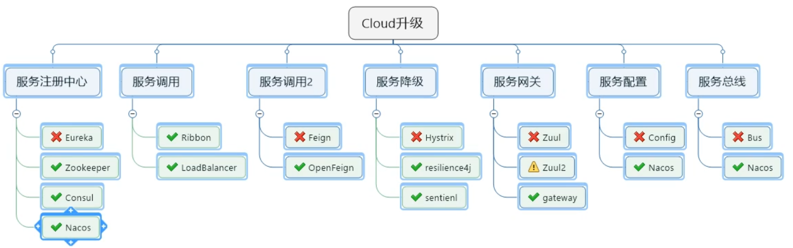

# Spring Framework

## Spring框架是什么

​		**Spring的核心**是提供了⼀个**容器**（container），通常称为Spring应⽤上下文（**Spring application context**），它们会创建和管理应⽤组件。这些组件也可以称为**Bean**，会在Spring应⽤上下⽂中装配在⼀起，从⽽形成⼀个完整的应用程序。这就像砖块、砂浆、⽊材、管道和电线组合在⼀起，形成⼀栋房⼦似的。

​		将Bean装配在⼀起的⾏为是通过⼀种基于**依赖注入**（dependency injection，DI）的模式实现的。此时，Bean不会再去创建它所依赖的Bean并管理它们的⽣命周期，使⽤依赖注⼊的应⽤依赖于单独的实体（容器）来创建和维护所有的组件，并将其注入到需要它们的bean中。通常，这是通过构造器注入和get set注入。

​		在核心容器之上，Spring及其⼀系列的相关库提供了**Web**框架、各种**持久化**可选方案、**安全**框架、**与其他系统集成**、**运行时监控**、**微服务**支持、**响应式编程**以及众多现代应⽤开发所需的特性。

## Spring框架做了什么

1、基于POJO的轻量级和最小侵入性编程，所有东西都是bean；

2、通过IOC，依赖注入（DI）和面向接口实现松耦合；

3、基于切面（AOP）和惯例进行声明式编程；

4、通过切面和模版减少样式代码，RedisTemplate，xxxTemplate；

## IOC和AOP

是个IOC（控制反转）容器，或称为DI(依赖注入)

AOP (面向切面编程)

横切"的技术，剖解开封装的对象内部，并将那些影响了多个类的公共行为封装到一个可重用模块，并将其命名为"Aspect"，即切面。所谓"切面"，简单说就是那些与业务无关，却为业务模块所共同调用的逻辑或责任封装起来，便于减少系统的重复代码，降低模块之间的耦合度，并有利于未来的可操作性和可维护性。
使用"横切"技术，AOP把软件系统分为两个部分：核心关注点和横切关注点。业务处理的主要流程是核心关注点，与之关系不大的部分是横切关注点。横切关注点的一个特点是，他们经常发生在核心关注点的多处，而各处基本相似，比如权限认证、日志、事物。AOP的作用在于分离系统中的各种关注点，将核心关注点和横切关注点分离开来。
AOP主要应用场景有：
1. Authentication 权限
2. Caching 缓存
3. Context passing 内容传递
4. Error handling 错误处理
5. Lazy loading 懒加载
6. Debugging 调试
7. logging, tracing, profiling and monitoring 记录跟踪 优化 校准
8. Performance optimization 性能优化
9. Persistence 持久化
10. Resource pooling 资源池
11. Synchronization 同步
12. Transactions 事务

# Web

## Spring MVC

Spring MVC是Spring中的基础 Web 框架，基于模型-视图-控制器（Model-View-Controller，[MVC](https://link.zhihu.com/?target=https%3A//zh.wikipedia.org/wiki/MVC)）模式实现，它能够帮你构建像Spring框架那样灵活和松耦合的Web应用程序。
在该框架下，一次web请求大致可以分为如下图几个步骤，这些划分分离了职责，使得代码灵活、维护性更好。

## Spring WebFlux

响应式编程的框架

使用传统web框架，比如SpringMVC，这些基于Servlet容器，Webflux是一种**异步非阻塞**的框架，异步非阻塞的框架在Servlet3.1以后才支持，核心是基于**Reactor**的相关API实现的。

SpringMVC方式实现，同步阻塞的方式，基于SpringMVC+Servlet+Tomcat
SpringWebflux方式实现，异步非阻塞 方式，基于SpringWebflux+Reactor+Netty

# SpringBoot

**自动配置**

SpringBoot 基于 Spring 开发，Spirng Boot 本身并不提供 Spring 框架的核心特性以及扩展功能，只是用于快速、敏捷地开发新一代基于 Spring 框架的应用程序。也就是说，它并不是用来替代 Spring 的解决方案，而是和 Spring 框架紧密结合用于**提升 Spring 开发者体验**的工具。Spring Boot 以**约定大于配置的核心思想**，默认帮我们进行了很多设置，多数 Spring Boot 应用只需要很少的 Spring 配置。同时它**集成了大量常用的第三方库配置**（例如 Redis、MongoDB、Jpa、RabbitMQ、Quartz 等等），Spring Boot 应用中这些第三方库几乎可以零配置的开箱即用。

优点：

- 为所有Spring开发者更快的入门
- **开箱即用**，提供各种默认配置来简化项目配置
- 内嵌式容器简化Web项目
- 没有冗余代码生成和XML配置的要求

# SpringData

**数据库访问框架**，支持关系型数据库和NoSQL

## SQL

Spring Data 项目所支持的**关系型数据存储技术**：

- **JDBC Template** (ORM 框架)

-  **JPA** (Java持久化API，Spring Data JPA底层默认是hibernate框架)
- R2DBC (响应式关系数据库)
- **MyBatis**(apache出的，google接手的ORM框架)
- JOOQ（另一种ORM框架，不太流行）
- 数据库迁移：Fkyway、Liquibase

## NoSQL

Spring Data 项目所支持**NoSQL存储**：

- MongoDB（文档数据库）、Neo4j （图形数据库）、 Redis（键/值存储）、Hbase（列族数据库）、Elasticsearch(数据搜索引擎)、Cassandra、Geode、Couchbase、Neo4j

## Web

# SpringCloud

SpringCloud 提供**服务注册发现、服务调用、服务降级、服务网关、配置中心、消息总线**等微服务组件。

除了Spring官方默认的SpringCloud，好几个大的企业也各自实现SpringCloud

- 微软 Spring Cloud Azure
- 阿里 Spring Cloud Alibaba
- 亚马逊AWS  Spring Cloud for Amazon Web Services
- Spring Cloud Netflix

- [Spring Cloud Azure](https://spring.io/projects/spring-cloud-azure)
- [Spring Cloud Alibaba](https://spring.io/projects/spring-cloud-alibaba)
- [Spring Cloud for Amazon Web Services](https://spring.io/projects/spring-cloud-aws)
- [Spring Cloud Bus](https://spring.io/projects/spring-cloud-bus)
- [Spring Cloud Circuit Breaker](https://spring.io/projects/spring-cloud-circuitbreaker)
- [Spring Cloud CLI](https://spring.io/projects/spring-cloud-cli)
- [Spring Cloud for Cloud Foundry](https://spring.io/projects/spring-cloud-cloudfoundry)
- [Spring Cloud - Cloud Foundry Service Broker](https://spring.io/projects/spring-cloud-cloudfoundry-service-broker)
- [Spring Cloud Cluster](https://spring.io/projects/spring-cloud-cluster)
- [Spring Cloud Commons](https://spring.io/projects/spring-cloud-commons)
- [Spring Cloud Config](https://spring.io/projects/spring-cloud-config)
- [Spring Cloud Connectors](https://spring.io/projects/spring-cloud-connectors)
- [Spring Cloud Consul](https://spring.io/projects/spring-cloud-consul)
- [Spring Cloud Contract](https://spring.io/projects/spring-cloud-contract)
- [Spring Cloud Function](https://spring.io/projects/spring-cloud-function)
- [Spring Cloud Gateway](https://spring.io/projects/spring-cloud-gateway)
- [Spring Cloud GCP](https://spring.io/projects/spring-cloud-gcp)
- [Spring Cloud Kubernetes](https://spring.io/projects/spring-cloud-kubernetes)
- [Spring Cloud Netflix](https://spring.io/projects/spring-cloud-netflix)
- [Spring Cloud Open Service Broker](https://spring.io/projects/spring-cloud-open-service-broker)
- [Spring Cloud OpenFeign](https://spring.io/projects/spring-cloud-openfeign)
- [Spring Cloud Pipelines](https://spring.io/projects/spring-cloud-pipelines)
- [Spring Cloud Schema Registry](https://spring.io/projects/spring-cloud-schema-registry)
- [Spring Cloud Security](https://spring.io/projects/spring-cloud-security)
- [Spring Cloud Skipper](https://cloud.spring.io/spring-cloud-skipper)
- [Spring Cloud Sleuth](https://spring.io/projects/spring-cloud-sleuth)
- [Spring Cloud Stream](https://cloud.spring.io/spring-cloud-stream)
- [Spring Cloud Stream App Starters](https://spring.io/projects/spring-cloud-stream-app-starters)
- [Spring Cloud Stream Applications](https://spring.io/projects/spring-cloud-stream-applications)
- [Spring Cloud Task](https://spring.io/projects/spring-cloud-task)
- [Spring Cloud Task App Starters](https://spring.io/projects/spring-cloud-task-app-starters)
- [Spring Cloud Vault](https://spring.io/projects/spring-cloud-vault)
- [Spring Cloud Zookeeper](https://spring.io/projects/spring-cloud-zookeeper)
- [Spring Cloud App Broker](https://spring.io/projects/spring-cloud-app-broker)

# Spring Cloud Data Flow

*Spring* *Cloud* *Data* *Flow*是基于微服务的,专门用于流式和批式数据处理的框架

# Security

Spring Security **认证授权**框架，同类框架还有Shiro ，也很流行

# Message

Spring与消息中间件整合

