# 是什么

创建Spring项目用的脚手架

[Spring Initializr](https://start.spring.io/)

可以在网页端访问

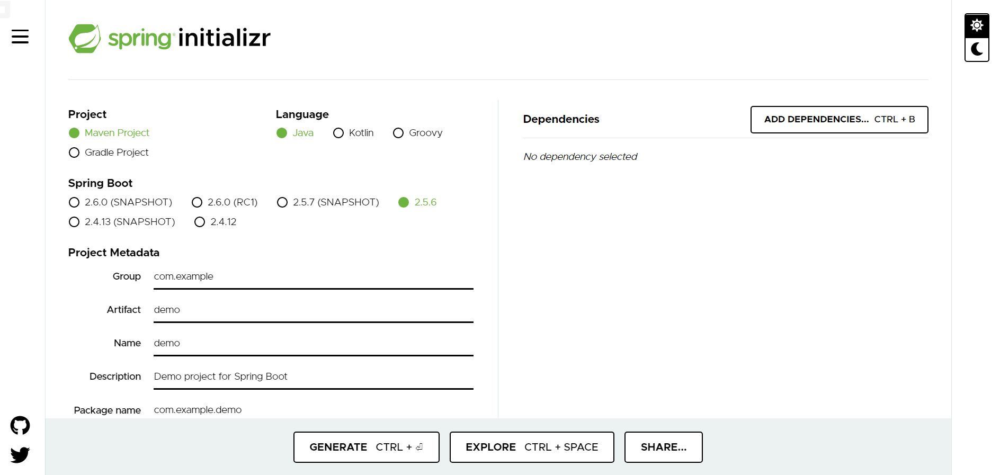

也可以在IDEA里访问

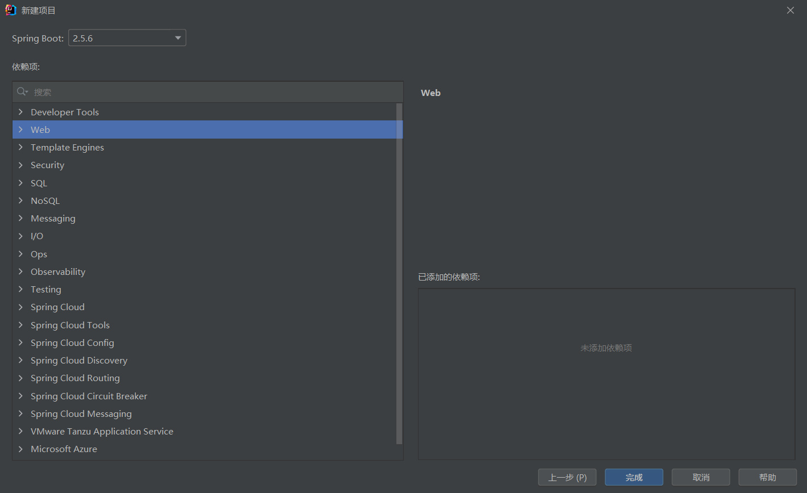

# 为什么要定制SpringInitialzr

先看看阿里的SpringInitialzr：[Aliyun Java Initializr](https://start.aliyun.com/bootstrap.html)


公司需要实现自定义的功能，比如加入公司内部的库、框架等，以此来达到快速创建Java项目的目的，减少重复性工作。


# 相关网址

文档：[Spring Initializr Reference Guide](https://docs.spring.io/initializr/docs/current/reference/html/)

官方仓库：

- 前端界面：[spring-io/start.spring.io: https://start.spring.io (github.com)](https://github.com/spring-io/start.spring.io)

- 后端服务：[spring-io/initializr: A quickstart generator for Spring projects (github.com)](https://github.com/spring-io/initializr)
  - initializr-actuator: 监控诊断的附加信息，这个暂时忽略；
  - initializr-bom: 便于外部使用的bom依赖；
  - initializr-docs: 使用文档；
  - initializr-generator: 核心工程生成库；
  - initializr-generator-spring: 用于生成典型的spring boot工程；
  - initializr-generator-test: 测试框架；
  - initializr-metadata: 项目各个方面的元数据基础结构；
  - initializr-service-sample: 基本使用案例；
  - initializr-version-resolver:版本号解析能力；
  - initializr-web: 提供给三方客户端使用的web入口。

网友教程：

- [自己搭建SpringBoot initializer 服务器 - it610.com](https://www.it610.com/article/1287747651856543744.htm)
- [定制 Spring Initializr_困难是否磨灭你的自信-CSDN博客](https://blog.csdn.net/sinat_34200786/article/details/102616131)
- [Spring Initializr - 掘金 (juejin.cn)](https://juejin.cn/post/6877810278570917896)

# initializr快速开始

参考：https://developer.aliyun.com/article/751899

## 依赖

IDEA新建SpringBoot项目，加入web依赖，再手动加入 initializer 依赖：

最新版本号去github上看看就知道了

```xml
<properties>
    <java.version>1.8</java.version>
    <initializr.version>0.11.1</initializr.version>
</properties>
<dependencies>
    <dependency>
        <groupId>org.springframework.boot</groupId>
        <artifactId>spring-boot-starter-web</artifactId>
    </dependency>
    <dependency>
        <groupId>io.spring.initializr</groupId>
        <artifactId>initializr-web</artifactId>
    </dependency>
    <dependency>
        <groupId>io.spring.initializr</groupId>
        <artifactId>initializr-generator-spring</artifactId>
    </dependency>
    <dependency>
        <groupId>io.spring.initializr</groupId>
        <artifactId>initializr-version-resolver</artifactId>
    </dependency>
</dependencies>

<build>
    <plugins>
        <plugin>
            <groupId>org.springframework.boot</groupId>
            <artifactId>spring-boot-maven-plugin</artifactId>
        </plugin>
    </plugins>
</build>
<dependencyManagement>
    <dependencies>
        <dependency>
            <groupId>io.spring.initializr</groupId>
            <artifactId>initializr-bom</artifactId>
            <version>${initializr.version}</version>
            <type>pom</type>
            <scope>import</scope>
        </dependency>
    </dependencies>
</dependencyManagement>
```

## 基本配置

- 完成了框架引入，就需要做一些基础配置了
- 支持哪些语言：Java、groovy、Kotlin
- 支持哪些版本：1.8、11、13
- 支持哪些打包方式：jar、war

将这些信息全部配置到 application.yml 文件中，如下：

### 配置语言和版本

```yaml
initializr:
    packagings:
    - name: Jar
      id: jar
      default: true
    - name: War
      id: war
      default: false
  javaVersions:
    - id: 13
      default: false
    - id: 11
      default: false
    - id: 1.8
      name: 8
      default: true
  languages:
    - name: Java
      id: java
      default: true
    - name: Kotlin
      id: kotlin
      default: false
    - name: Groovy
      id: groovy
      default: false
```

其中 name 是可选的， id 是必填的。

每个配置项下，可以有**一个**默认值（将 default 这是为 true 即可），除了这些基本配置，我们还需要定义可以支持的项目类型：

### 配置项目类型

```yaml
initializr:
    types:
    - name: Maven Project
      id: maven-project
      description: Generate a Maven based project archive.
      tags:
        build: maven
        format: project
      default: true
      action: /starter.zip
    - name: Maven POM
      id: maven-build
      description: Generate a Maven pom.xml.
      tags:
        build: maven
        format: build
      default: false
      action: /pom.xml
    - name: Gradle Project
      id: gradle-project
      description: Generate a Gradle based project archive.
      tags:
        build: gradle
        format: project
      default: false
      action: /starter.zip
    - name: Gradle Config
      id: gradle-build
      description: Generate a Gradle build file.
      tags:
        build: gradle
        format: build
      default: false
      action: /build.gradle
```

默认情况下， initializr 已经支持 4 种项目类型：

- /pom.xml 生成一个 Maven 的 pom.xml 配置文件
- /build.gradle 生成 Gradle 的配置文件
- /starter.zip 生成 zip 方式压缩的工程文件
- /starter.tgz 生成以 tgz 方式压缩的工程文件

通过 tags 标签，我们可以定义不同配型的编译方式 (build) 和打包格式（format）。

### 配置基本依赖

完成了基本配置以后，就可以配置可选的依赖组件了。

依赖配置以 dependency 为 key ，同样配置在 application.yml 的 initializr 下面，这里给出一个简单的样例：

```yaml
initializr:
  dependencies:
    - name: Web
      content:
        - name: Web
          id: web
          description: Full-stack web development with Tomcat and Spring MVC
        - name: Developer Tools
      content:
        - name: Spring Boot DevTools
          id: devtools
          groupId: org.springframework.boot
          artifactId: spring-boot-devtools
          description: Provides fast application restarts, LiveReload, and configurations for enhanced development experience.
        - name: Lombok
          id: lombok
          groupId: org.projectlombok
          artifactId: lombok
          description: Java annotation library which helps to reduce boilerplate code.
```

dependencies 下定义分组。分组的作用是便于展示和快速查找，所以不需要 id ，只需要 name 信息；每个分组的 content 是分组的具体内容，也就是这个分组下的组件定义；支持以列表形式定义多个；另外，每个分组都可以设置当前分组内组件公用的配置信息。

每一依赖，包含如下的基本信息：

- id：组件的唯一标识符
- groupId & artifactId：组件的坐标
- name：显示名称
- description：描述信息，主要用于展示用途
- version：组件版本

关于 groupId & artifactId：如果设置了坐标，生成的项目里会使用这里的坐标定位组件；**但是如果没有设置坐标，框架会认为这是一个标准的 spring-boot 组件，自动添加 spring-boot-starter-{id} 作为生成的依赖坐标**。

关于 version：如果直接在组件上设置版本信息，框架会直接使用这个值作为组件依赖的版本；但是很多时候，组件的版本会受到 spring-boot 版本的影响，此时就需要对版本做**特殊的定义 & 管理**。

### 配置依赖版本管理

这里需要先了解一下版本命名规则：一个典型的版本，一般包含如下 4 个信息：大版本、小版本、修正版本、版本限定符。

版本范围有一个上界和下界，可以方括号 [] 或者圆括号 () 表示。方括号代表上下界的闭区间，圆括号代表上下界的开区间。

**例如：**“[1.1.6.RELEASE,1.3.0.M1)”代表所有从 1.1.6.RELEASE 到 1.3.0.M1 之间所有的版本（包含 1.1.6.RELEASE ，但不包含 1.3.0.M1 ）。

同时，可以使用单一版本号作为版本范围，例如 “1.2.0.RELEASE”。单一版本号的版本范围代表“从这个版本以及之后的所有版本”。

如果需要使用“最新的 Release 版本”的概念，可以使用一个字母 x 代表具体的版本号。

例如， 1.4.x.BUILD-SNAPSHOT 代表 1.4.x 的最新快照版本。

再比如：如果需要表达，从 1.1.0.RELEASE 到 1.3.x 之间的所有版本，可以用[1.1.0.RELEASE,1.3.x.RELEASE]来表达。

另外，版本限定符也是有顺序的（升序）：

- M：里程碑版本
- RC：发布候选版本
- RELEASE：发布版本
- BUILD-SNAPSHOT：为开发构建的快照版本

所以快照版本是所有限定符里优先级最高的。假设某个组件需要 Spring Boot 的最新版本，可以使用 1.5.x.BUILD-SNAPSHOT  (假设 1.5 版是 Spring Boot 的最新版本)。

最后，版本范围中讨论的版本，指的都是 Spring Boot的版本，而不是组件自己的版本。

前面介绍了，可以使用 version 属性定义组件的具体版本号；但是，如果组件版本与Spring Boot 的版本存在关联关系，就需要使用 compatibilityRange 来配置依赖的版本范围。

 compatibilityRange 可以定义在两个地方：

- **直接定义在组件（或 Bom ）上**

这种定义方式，代表组件只支持 Spring Boot 的某一个版本范围，例如下面的配置：

```yaml
initializr:
  dependencies:
    - name: Stuff
      content:
        - name: Foo
          id: foo
          ...
          compatibilityRange: 1.2.0.M1
        - name: Bar
          id: bar
          ...
          compatibilityRange: "[1.5.0.RC1,2.0.0.M1)"
```

Foo 可以支持 Spring boot 1.2.0 之后的所有版本；而Bar只能支持 Spring Boot 1.5.0 到 2.0.0 之间的版本，且不包含 2.0.0 ；

- **定义在组件的 mappings 属性下**

可以支持在 Spring Boot 不同版本之下对组件做不同的设置（可以重置组件部分或者是所有的属性），下面的例子中对 artifactId 做了特殊定义：

```yaml
initializr:
  dependencies:
    - name: Stuff
      content:
        - name: Foo
          id: foo
          groupId: org.acme.foo
          artifactId: foo-spring-boot-starter
          compatibilityRange: 1.3.0.RELEASE
          mappings:
            - compatibilityRange: "[1.3.0.RELEASE,1.3.x.RELEASE]"
              artifactId: foo-starter
            - compatibilityRange: "1.4.0.RELEASE"
```

这个例子中， foo 在 Spring Boot 的 1.3 使用 foo-starter 作为坐标的 artifactId ；在 1.4.0.RELEASE 以及之后的版本中，还是使用 foo-spring-boot-starter 作为 artifactId 的值；

**使用 Bom 管理版本：**有时候，需要使用 Bom 的方式管理组件版本；此时不需要对组件单独设置版本号。

要使用 Bom ，首先要配置 Bom 定义：

```yaml
initializr:
  env:
    boms:
      my-api-bom:
        groupId: org.acme
        artifactId: my-api-dependencies
        version: 1.0.0.RELEASE
        repositories: my-api-repo-1
```

注意：Bom 信息，定义在 initializr.env.boms下面。

其属性和依赖组件基本一致，都是坐标、版本；同时， Bom 也支持版本范围管理。

完成了 Bom 的定义，就需要在组件中引用 Bom ：

```yaml
initializr:
  dependencies:
    - name: Other
      content:
        - name: My API
          id : my-api
          groupId: org.acme
          artifactId: my-api
          bom: my-api-bom
```

一旦用户选择了 my-api 组件，框架会自动为生成的项目添加了 my-api-dependencies 的 Bom 依赖；


## 版本获取策略

```java
package com.potato.initializedemo;

import com.fasterxml.jackson.databind.ObjectMapper;
import io.spring.initializr.web.support.SaganInitializrMetadataUpdateStrategy;
import org.springframework.boot.SpringApplication;
import org.springframework.boot.autoconfigure.SpringBootApplication;
import org.springframework.boot.web.client.RestTemplateBuilder;
import org.springframework.cache.annotation.EnableCaching;
import org.springframework.context.annotation.Bean;
import org.springframework.scheduling.annotation.EnableAsync;

@SpringBootApplication
@EnableCaching
@EnableAsync
public class InitializeDemoApplication {

    public static void main(String[] args) {
        SpringApplication.run(InitializeDemoApplication.class, args);
    }
    //从https://spring.io/project_metadata/spring-boot中获取SpringBoot版本信息
    @Bean
    SaganInitializrMetadataUpdateStrategy saganInitializrMetadataUpdateStrategy(RestTemplateBuilder restTemplateBuilder,
                                                                                ObjectMapper objectMapper) {
        return new SaganInitializrMetadataUpdateStrategy(restTemplateBuilder.build(), objectMapper);
    }
}
```


application.yml：

```yaml
initializr:
  group-id:
    value: org.acme
  dependencies:
    - name: Web
      content:
        - name: Web
          id: web
          description: Servlet web application with Spring MVC and Tomcat
  languages:
    - name: Java
      id: java
      default: true
    - name: Kotlin
      id: kotlin
      default: false
    - name: Groovy
      id: groovy
      default: false
  javaVersions:
    - id: 11
      default: true
    - id: 1.8
      name: 8
      default: false
  packagings:
    - name: Jar
      id: jar
      default: true
    - name: War
      id: war
      default: false
  types:
    - name: Maven Project
      id: maven-project
      description: Generate a Maven based project archive
      tags:
        build: maven
        format: project
      default: true
      action: /starter.zip
    - name: Gradle Project
      id: gradle-project
      description: Generate a Gradle based project archive
      tags:
        build: gradle
        format: project
      default: false
      action: /starter.zip

```

启动

## 结果

IDEA新建项目，输入http://localhost:8080

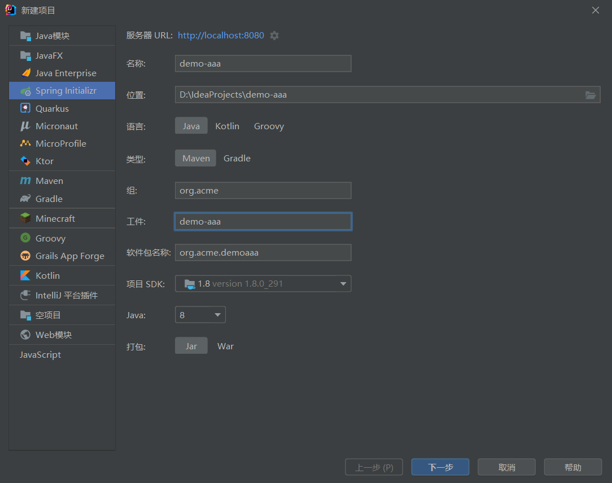

可以看到，能显示SpringBoot的最新版本

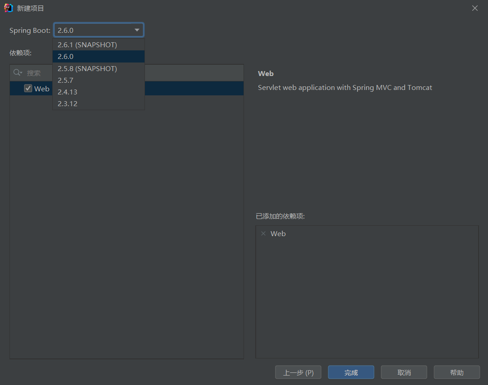


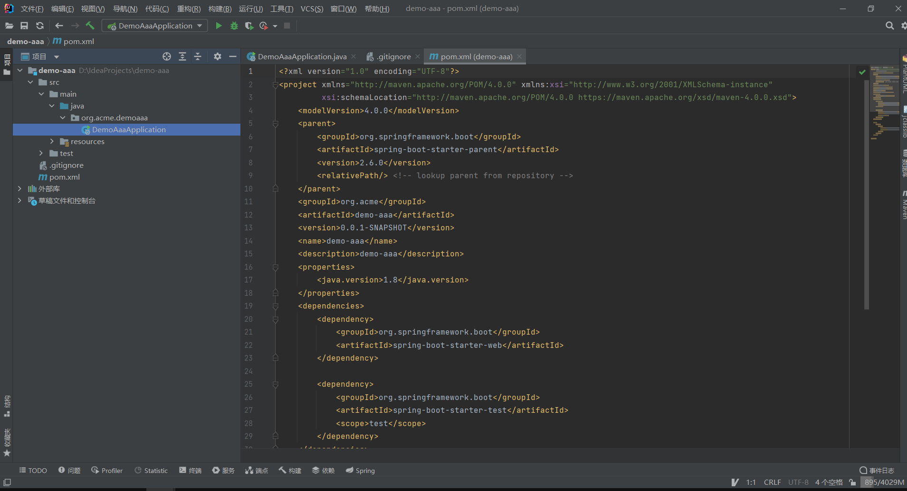


## SpringBoot 版本信息获取原理

请求这个网址：https://spring.io/project_metadata/spring-boot

```json
{
    "id":"spring-boot",
    "name":"Spring Boot",
    "projectReleases":[
        {
            "version":"2.6.1-SNAPSHOT",
            "versionDisplayName":"2.6.1-SNAPSHOT",
            "current":false,
            "releaseStatus":"SNAPSHOT",
            "snapshot":true
        },
        {
            "version":"2.6.0",
            "versionDisplayName":"2.6.0",
            "current":true,
            "releaseStatus":"GENERAL_AVAILABILITY",
            "snapshot":false
        },
        {
            "version":"2.5.8-SNAPSHOT",
            "versionDisplayName":"2.5.8-SNAPSHOT",
            "current":false,
            "releaseStatus":"SNAPSHOT",
            "snapshot":true
        },
        {
            "version":"2.5.7",
            "versionDisplayName":"2.5.7",
            "current":false,
            "releaseStatus":"GENERAL_AVAILABILITY",
            "snapshot":false
        },
        {
            "version":"2.4.13",
            "versionDisplayName":"2.4.13",
            "current":false,
            "releaseStatus":"GENERAL_AVAILABILITY",
            "snapshot":false
        },
        {
            "version":"2.3.12.RELEASE",
            "versionDisplayName":"2.3.12.RELEASE",
            "current":false,
            "releaseStatus":"GENERAL_AVAILABILITY",
            "snapshot":false
        }
    ]
}
```


# 高级定制

## 启用缓存

如果你启动过 start.spring.io 项目，你会在日志里发现这样的输出 “Fetching boot metadata from spring.io/project_metadata/spring-boot” 为了避免过于频繁的检查 Spring Boot 版本，官方是建议配合缓存一起使用。

首先需要引入缓存框架：

```xml
<dependency>
    <groupId>javax.cache</groupId>
    <artifactId>cache-api</artifactId>
</dependency>
<dependency>
    <groupId>org.ehcache</groupId>
    <artifactId>ehcache</artifactId>
</dependency>
```

然后，在 SpringBootApplication 类上增加 @EnableCaching 注解:

```java
@SpringBootApplication
@EnableCaching
@EnableAsync
public class DemoApplication {

    public static void main(String[] args) {
        SpringApplication.run(DemoApplication.class, args);
    }
}
```

如果需要自己定义缓存，可以调整如下缓存配置：

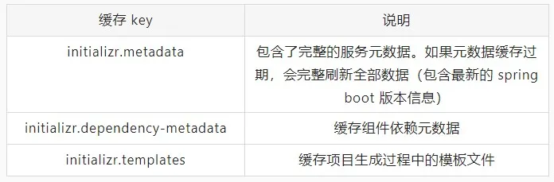

## Demo代码   

**增加 Demo代码：**由于不同的组件有不同的功能，如果需要为项目增加 Demo 代码。

**为不同的组件增加独立配置：**还记得原理篇中提到的 spring.factories 吗？对，我们要增加自己的配置项，就需要在这里增加针对不同组件样例代码的扩展入口。

```properties
io.spring.initializr.generator.project.ProjectGenerationConfiguration=\
com.alibaba.alicloud.initializr.extension.dependency.springboot.SpringCloudProjectGenerationConfiguration
```

在 SpringCloudProjectGenerationConfiguration 中，我们通过 ConditionalOnRequestedDependency 注解来识别不同组件：

```java
@ProjectGenerationConfiguration
public class SpringCloudAlibabaProjectGenerationConfiguration {
    private final InitializrMetadata metadata;
    private final ProjectDescription description;
    private final IndentingWriterFactory indentingWriterFactory;
    private final TemplateRenderer templateRenderer;
    public SpringCloudAlibabaProjectGenerationConfiguration(InitializrMetadata metadata,
                                                            ProjectDescription description,
                                                            IndentingWriterFactory indentingWriterFactory,
                                                            TemplateRenderer templateRenderer) {
        this.metadata = metadata;
        this.description = description;
        this.indentingWriterFactory = indentingWriterFactory;
        this.templateRenderer = templateRenderer;
    }
    @Bean
    @ConditionalOnRequestedDependency("sca-oss")
    public OSSDemoCodeContributor ossContributor() {
        return new OSSDemoCodeContributor(description, templateRenderer);
    }
    ......
}
```

上面的代码，会在选择了 sca-oss 组件时，创建一个 OSSDemoCodeContributor 用于对应 Demo 代码的生成。

**生成具体的 Demo 代码：**继续以 OSSDemoCodeContributor 为例，它是一个 ProjectContributor ，会在项目文件空间创建完成了调用。我们需要为这个 Contributor 在实例化时增加生成过程中需要的元数据信息，例如 ProjectDescription 。

代码生成过程，比较简单，可以直接复用框架中就提供的 mustache 模板引擎。

我们直接将 Demo 代码，以**模板**的形式，放置在 resources 文件夹之下：

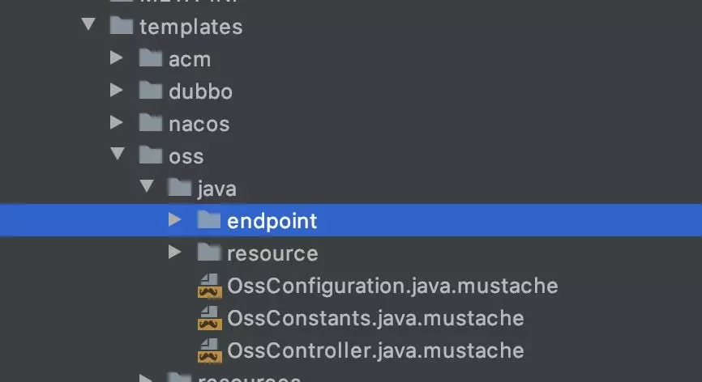

然后，我们再通过模板引擎，解析这些模板文件，再拷贝到项目目录下即可：

```java
private void writeCodeFile(TemplateRenderer templateRenderer, Language langeuage,
                               Map<String, Object> params, Path path, String temp) throws IOException {
        ......
        Path pkgPath = 生成包路径
        Path filePath = 成成代码文件路径
        // 渲染模板
        String code = templateRenderer.render(temp, params);
        // demo 文件写入
        Files.createDirectories(pkgPath);
        Files.write(filePath, code.getBytes("UTF-8"));
    }
```

除了模板代码以外，我们通常还需要在 applicatioin.properties 文件写入模块的配置信息。

这里，我们依然可以使用代码生成的方式：创建模板、解析模板，追加文件的方式来实现。具体代码这里就不贴了，读者可以自己发挥。

# 原理篇

原理篇，主要介绍 spring.initializr 是如何实现项目工程构建的，以及作为一个框架，如何提供丰富的扩展能力的。

在原理篇，我们将 initializr 的执行分为两个阶段：启动阶段和生成阶段。

- 启动阶段：启动应用，加载配置，扩展信息初始化；
- 生成阶段：一个项目生成，从收到请求，到返回内容的完整流程。

## 1. 启动阶段

再开始启动流程之前，先要看一下 initializr 的扩展体系。

整个架构大量使用了 spring 的 spi 机制，我们来看一下一共有哪些 spring.factories ：

- initializr-generator/src/main/resources/META-INF/spring.factories
- initializr-generator-spring/src/main/resources/META-INF/spring.factories
- initializr-web/src/main/resources/META-INF/spring.factories
- initializr-actuator/src/main/resources/META-INF/spring.factories
- start-site/src/main/resources/META-INF/spring.factories

其中只有一个在 start.spring.io 中，其他 4 个都在 initializr 工程中（各 spring.factories 的具体内容见参考资料）。

不过要注意，这些 spring.factories 定义，仅仅代表了各个 SPI 有哪些扩展。不同spi的实现创建和使用完全是在不同的阶段进行的。

在应用启动阶段，其实只有一个 spi 会被加载（暂不考虑 actuator）：io.spring.initializr.web.autoconfigure.InitializrAutoConfiguration 。

```java
@Configuration
@EnableConfigurationProperties(InitializrProperties.class)
public class InitializrAutoConfiguration {
    @Bean
    @ConditionalOnMissingBean
    public ProjectDirectoryFactory projectDirectoryFactory()
    @Bean
    @ConditionalOnMissingBean
    public IndentingWriterFactory indentingWriterFactory()
    @Bean
    @ConditionalOnMissingBean(TemplateRenderer.class)
    public MustacheTemplateRenderer templateRenderer(Environment environment, ObjectProvider<CacheManager> cacheManager)
    @Bean
    @ConditionalOnMissingBean
    public InitializrMetadataUpdateStrategy initializrMetadataUpdateStrategy(RestTemplateBuilder restTemplateBuilder,
            ObjectMapper objectMapper)
    @Bean
    @ConditionalOnMissingBean(InitializrMetadataProvider.class)
    public InitializrMetadataProvider initializrMetadataProvider(InitializrProperties properties,
            InitializrMetadataUpdateStrategy initializrMetadataUpdateStrategy)
    @Bean
    @ConditionalOnMissingBean
    public DependencyMetadataProvider dependencyMetadataProvider()
    @Configuration
    @ConditionalOnWebApplication
    static class InitializrWebConfiguration {
        @Bean
        InitializrWebConfig initializrWebConfig()
        @Bean
        @ConditionalOnMissingBean
        ProjectGenerationController<ProjectRequest> projectGenerationController(
                InitializrMetadataProvider metadataProvider, ApplicationContext applicationContext)
        @Bean
        @ConditionalOnMissingBean
        ProjectMetadataController projectMetadataController(InitializrMetadataProvider metadataProvider,
                DependencyMetadataProvider dependencyMetadataProvider)
        @Bean
        @ConditionalOnMissingBean
        CommandLineMetadataController commandLineMetadataController(InitializrMetadataProvider metadataProvider,
                TemplateRenderer templateRenderer)
        @Bean
        @ConditionalOnMissingBean
        SpringCliDistributionController cliDistributionController(InitializrMetadataProvider metadataProvider)
    }
}
```

这里会做如下几件事情：

- 初始化元数据 Provider
- 创建模板引擎
- 创建目录、缩进工厂
- 初始化 web 配置
- 创建 spring mvc 的 web 入口
- 各种 ProjectGenerationController

其中最关键的元数据加载部分，使用了 EnableConfigurationProperties 注解，将 spring 环境中的配置项写到 InitializrProperties 上：

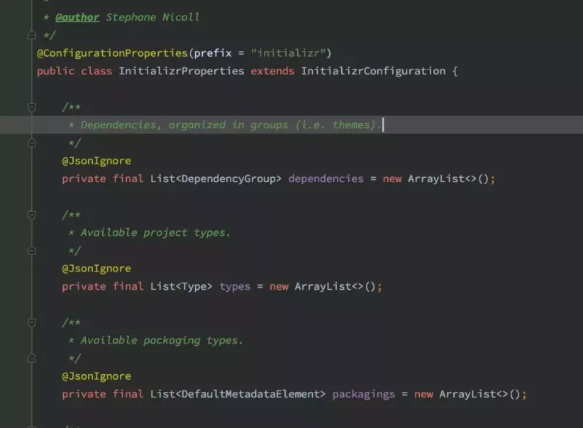

在 application.yml 文件中，可以找到如下的配置信息，这里就是实际的项目依赖关系元数据的配置存储点：

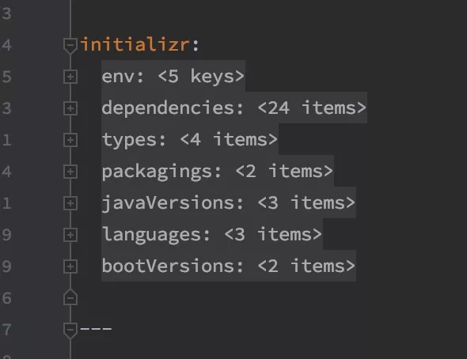


整体来看，启动阶段的动作还是比较简单的，这也是为什么 start.spring.io 启动只需要数秒的原因。

更多的逻辑，都被留在了工程生成阶段。

## 2. 生成阶段

生成阶段，spring-initializr 使用了一个很有意思的实现方式：initializr 框架会为每一次项目生成，创建一个独立的 context 用于存放生成流程中需要使用到的各种 bean 。

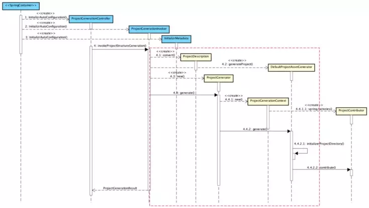

- 蓝色的类，是在应用启动阶段就完成了创建和数据填充；其生命周期和整个应用一致；
- 黄色的类，会在具体的项目构建过程中生成；其生命周期在一次项目生成流程之内结束。

从上面的时序图中可以看出：一个典型的创建行为，通常从 ProjectGenerationController收到web端的创建请求开始，通过 ProjectGenerationInvoker 这个中间层转换，最终进入 ProjectGenerator 的核心构建流程。

### 主干流程

下图，是 ProjectGenerator 的核心构建流程：

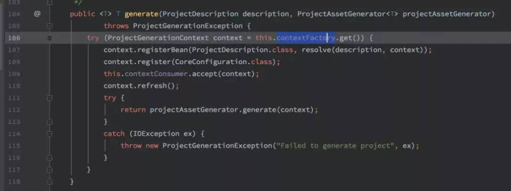

106 行，通过 contextFactory 构建了一个新的 ProjectGenerationContext 。

看一下这个context的继承关系，原来于spring提供的AnnotationConfigApplicationContext 。

再结合 110 行的 refresh() 方法，是不是发现了什么？就是 spring 的 ApplicationContext 的刷新流程。

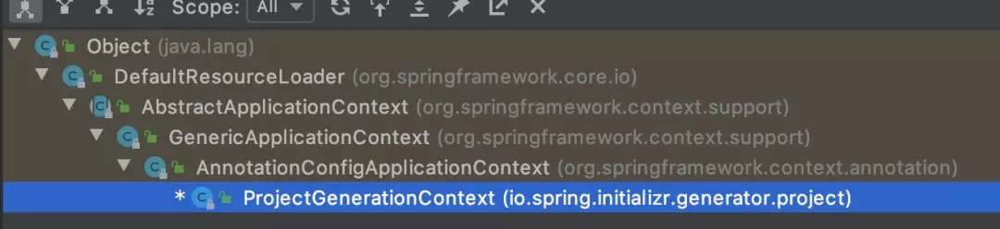

107 行的 resolve 方法，向 context 中注册了一个 ProjectDescription的Provider，代码如下：

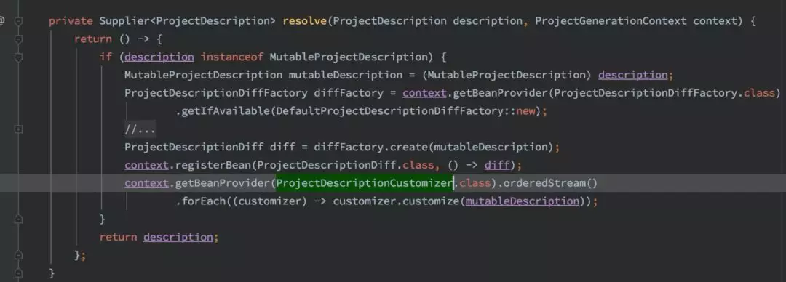

由于注册的是 Provider ，所以这段逻辑会在 Context 执行 refresh 时运行。

这里的 ProjectDescriptionCustomizer 就是针对 ProjectDescription 的扩展，用于对用户传入的 ProjectDescription 做调整。这里主要是一些强制依赖关系的调整，例如语言版本等。

这时候再看 108 行，这里向 Context 注册一个 Configuration 。

那么这个 Configuration 包含了什么内容呢？一起来看下面这段代码：

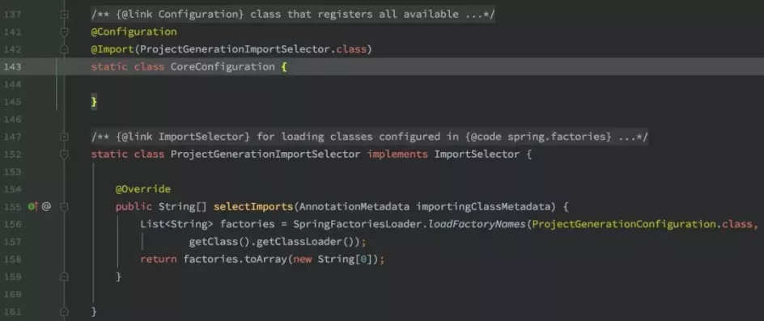

ProjectGenerationConfiguration！！！前面提到的 spring.factories 中有很多这个 SPI 的实现（参见参考资料）。

原来，initializr 的整个扩展体系，在这里才开始创建实例；

ProjectGenerator 的 109 行，对一个 consumer 做了 accept 操作；其实就是调用了下面的代码：

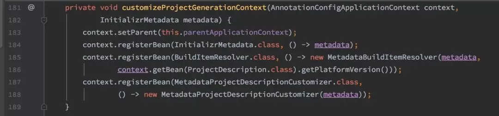

这里通过 setParent 将应用的主上下文设置为这次 ProjectGenerationContext 的父节点。

并且向这次 ProjectGenerationContext 中注册了元数据对象。

最后，在 ProjectGenerator 的 112 行，调用了 projectAssetGenerator 的 generate 方法，实现如下：

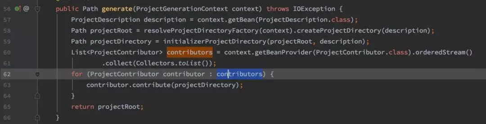

通过上面的代码可以发现，这里对实际的工程构建工作，其实就是很多的 ProjectContributor 共同叠加；

至此，主干流程已经结束了。

我们可以发现，在主干流程中，没有做任何写文件的操作（只创建了根文件夹）；它仅仅是定义了一套数据加载、扩展加载的机制与流程，将所有的具体实现都作为扩展的一部分。

### 扩展流程

spring-initializr 提供了 2 种主要扩展途径：ProjectContributor 和 xxxxxCustomizer。

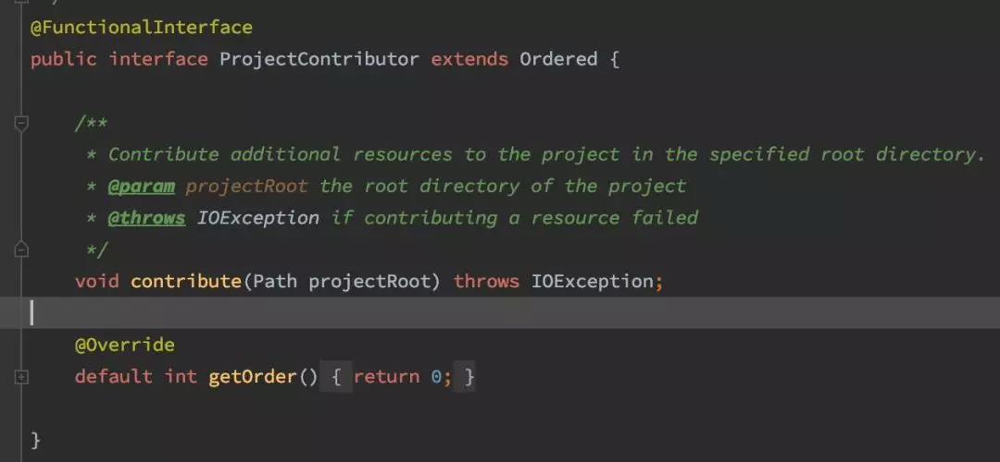

从方法签名就可以看出，入参只有一个项目的根路径，其职责就是向这个路径下些人项目文件。这个扩展点非常的灵活，几乎可以支持任何的代码、配置文件写入工作。

实现过程中，可以通过 ProjectGenerationContext 获取相关依赖，然后通过自定义逻辑完成文件生成工作。

下面是 initializr 和 start.spring.io 提供的 ProjectContributor 实现：

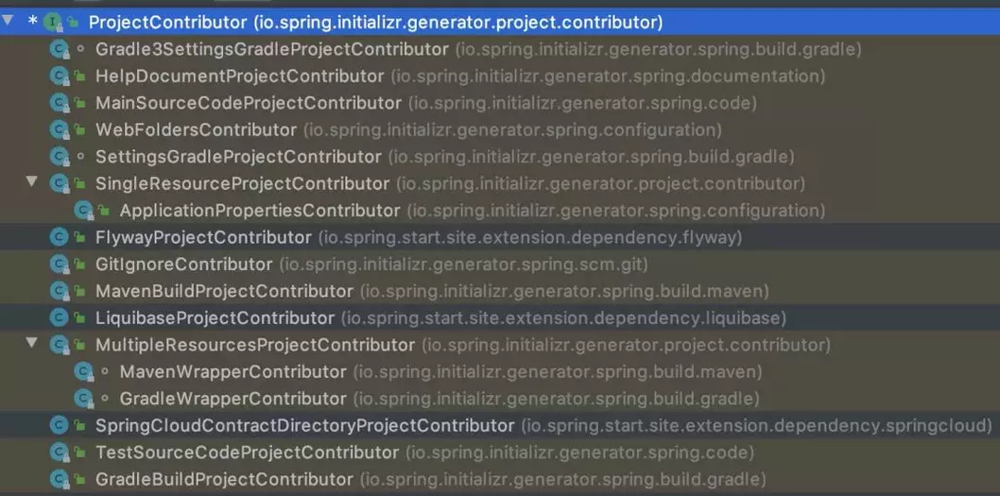

拿几个主要的实现看看：

- MavenBuildProjectContributor：写入 maven 项目 pom.xml 文件；
- WebFoldersContributor：创建 web 项目的资源文件夹；
- ApplicationPropertiesContributor：写入 application.properties 文件；
- MainSourceCodeProjectContributor：写入应用入口类 xxxApplication.java 文件；
- HelpDocumentProjectContributor：写入帮助文档 HELP.md 文件。

相对于 ProjectContributor，xxxxxCustomizer  不是一个统一的接口，我把他理解为一种感念和与之对应的命名习惯；每个 Customizer 都有自己明确的名字，同时也对应了明确的触发逻辑和职责边界。

下面列出框架提供的 Customizer 的说明：

- MainApplicationTypeCustomizer：自定义 MainApplication 类；
- MainCompilationUnitCustomizer：自定义 MainApplication 编译单元；
- MainSourceCodeCustomizer：自定义 MainApplication 源码；
- BuildCustomizer：自定义项目构建工具的配置内容；
- GitIgnoreCustomizer：自定义项目的 .gitignore 文件；
- HelpDocumentCustomizer：自定义项目的帮助文档；
- InitializrMetadataCustomizer：自定义项目初始化配置元数据；这个 Customizer 比较特殊，框架会在首次加载元数据配置时调用；
- ProjectDescriptionCustomizer：自定义 ProjectDescription ；即在生成项目文件之前，允许调整项目描述信息；
- ServletInitializerCustomizer：自定义 web 应用在类上的配置内容；
- TestApplicationTypeCustomizer：自定义测试 Application 类；
- TestSourceCodeCustomizer：自定义测试 Application 类的源码。

