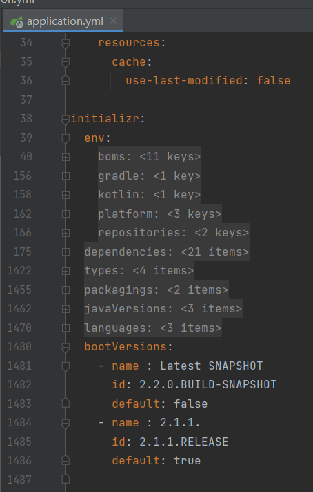

注意： SpringInitialzr不提供前端界面，需要自己写，或者参考：https://github.com/spring-io/start.spring.io

# 项目概述

SpringInitialzr的主要模块

- `initializr-actuator`： 可选模块，以提供有关项目生成的额外信息和统计数据。
- `initializr-bom`：项目pome依赖统一管理。
- `initializr-docs`： 文档。
- `initializr-generator`： 核心项目生成库。
- `initializr-generator-spring`： 可选模块，用于定义SpringBoot项目如何生成，可以自定义
- `initializr-generator-test`：测试项目。
- `initializr-metadata`： 项目各个方面的元数据基础架构。
- `initializr-service-sample`： 提供的实例。
- `initializr-version-resolver`： 可选模块，从任意 POM 中提取版本编号。
- `initializr-web`： 第三方客户端。


# 配置

都在在application.yml中，官方的start.spring.io项目中是这样配置的(由于太长了，折叠起来，看主要结构)：



## java版本和打包方式：javaVersions和languages

java版本和语言设置

```yaml
initializr:
  javaVersions:
    - id: 11
      default: false
    - id: 1.8
      default: true
  languages:
    - name: Java
      id: java
      default: true
    - name: Kotlin
      id: kotlin
      default: false
```

## 打包方式：packagings

```yaml
initializr:
  packagings:
    - name: Jar
      id: jar
      default: true
    - name: War
      id: war
      default: false
```

## 默认的项目名和包名:group-id和artifact-id

```yaml
initializr:
  group-id:
    value: org.acme
  artifact-id:
    value: my-app
```

## SpringBoot版本

```yaml
initializr:
  bootVersions:
    - id: 2.4.0-SNAPSHOT
      name: 2.4.0 (SNAPSHOT)
      default: false
    - id: 2.3.3.BUILD-SNAPSHOT
      name: 2.3.3 (SNAPSHOT)
      default: false
    - id: 2.3.2.RELEASE
      name: 2.3.2
      default: true
```

这里写死了三个版本，实际中，需要动态获取SpringBoot最新的版本，这需要通过写代码来设定。

### InitializrMetadataUpdateStrategy接口

配置如何获取SpringBoot的版本

```java
/**
 * A strategy interface for updating the {@link InitializrMetadata metadata} on a running
 * instance.
 *
 * @author Stephane Nicoll
 */
@FunctionalInterface
public interface InitializrMetadataUpdateStrategy {

   /**
    * Update the current {@link InitializrMetadata}.
    * @param current the metadata to update
    * @return the updated metadata, or {@code current} (never {@code null})
    */
   InitializrMetadata update(InitializrMetadata current);

}
```

有个默认实现：SaganInitializrMetadataUpdateStrategy

原理是从Spring的服务器获取最新版本

**注意开启缓存，防止频繁获取：@EnableCaching**

## 项目可用类型

在url拼接如下内容，获取不同的类型：

- /pom.xml

- /build.gradle
- /starter.zip
- /starter.tgz

```yaml
initializr:
  types:
    - name: Maven Project
      id: maven-project
      description: Generate a Maven based project archive
      tags:
        build: maven
        format: project
      default: true
      action: /starter.zip
    - name: Gradle Project
      id: gradle-project
      description: Generate a Gradle based project archive
      tags:
        build: gradle
        format: project
      default: false
      action: /starter.zip
```

配置前：

```
$ spring init --type=gradle-project my-project.zip
```

配置后，可以这样使用：

```
$ spring init --build=gradle my-project.zip
```

## 配置依赖

### 基础用法

比如，配置 spring-boot-starter-web 这个依赖

```yaml
initializr:
  dependencies:
    - name: Web #用于显示在前端界面的名字
      content: # maven坐标
        - name: Web
          id: web
          description: Full-stack web development with Tomcat and Spring MVC
```

那么问题来了，这里的name和id属性只写了web这个词，怎么知道是 spring-boot-starter-web ？

通过配置通用依赖组：

```yaml
initializr:
  dependencies:
    - name: Stuff
      bom: stuff-bom
      compatibilityRange: "[1.3.0.RELEASE,2.0.0.M1)" #版本号范围
      content:
...
```

想用一般的写法也行：

```yaml
initializr:
  dependencies:
    - name: Tech
      content:
        - name: Acme
          id: acme
          groupId: com.example.acme
          artifactId: acme
          version: 1.2.0.RELEASE
          description: A solid description for this dependency
```

生成对应的pom：

```xml
<dependency>
    <groupId>com.example.acme</groupId>
    <artifactId>acme</artifactId>
    <version>1.2.0.RELEASE</version>
</dependency>
```

### 设定版本范围

https://docs.spring.io/initializr/docs/current-SNAPSHOT/reference/html/#dependencies-compatibility-range

属性：compatibilityRange

- 中间用减号连接

- 中括号表示包含
- 小括号表示不包含

比如：

```yaml
initializr: 
  dependencies:
    - name: Developer Tools
      content:
        - name: Spring Native [Experimental]
          id: native
          compatibilityRange: "[2.4.3,2.7.0-M1)"
          groupId: org.springframework.experimental
          artifactId: spring-native
          description: ...
......
```

### 依赖仓库

即便没有写，默认仓库是Maven Central 

```yaml
initializr:
  env:
    repositories:
      my-api-repo-1: #仓库名字(唯一标识)
        name: repo1
        url: https://example.com/repo1
```

在dependencies中指定用哪个maven仓库：

```yaml
initializr:
  dependencies:
    - name: Other
      content:
        - name: Foo
          groupId: org.acme
          artifactId: foo
          version: 1.3.5
          repository: my-api-repo-1
```

最好是为每个依赖都加上repository属性

## 配置bom

https://docs.spring.io/initializr/docs/current-SNAPSHOT/reference/html/#create-instance-boms

为了解决依赖冲突，可以使用bom来管理不同环境下的依赖

```yaml
initializr:
  env:
    boms:
      my-api-bom:
        groupId: org.acme
        artifactId: my-api-dependencies
        version: 1.0.0.RELEASE
        repositories: my-api-repo-1
```

然后在dependencies中指向这个bom

```yaml
initializr:
  dependencies:
    - name: Other
      content:
        - name: My API
          id : my-api
          groupId: org.acme
          artifactId: my-api
          bom: my-api-bom
```


一个复杂的例子：

```yaml
initializr:
  env:
    boms:
      cloud-bom:
        groupId: com.example.foo
        artifactId: acme-foo-dependencies
        mappings:
          - compatibilityRange: "[1.2.3.RELEASE,1.3.0.RELEASE)"
            groupId: com.example.bar
            artifactId: acme-foo-bom
            version: Arcturus.SR6
          - compatibilityRange: "[1.3.0.RELEASE,1.4.0.RELEASE)"
            version: Botein.SR7
          - compatibilityRange: "[1.4.0.RELEASE,1.5.x.RELEASE)"
            version: Castor.SR6
          - compatibilityRange: "[1.5.0.RELEASE,1.5.x.BUILD-SNAPSHOT)"
            version: Diadem.RC1
            repositories: spring-milestones
          - compatibilityRange: "1.5.x.BUILD-SNAPSHOT"
            version: Diadem.BUILD-SNAPSHOT
            repositories: spring-snapshots,spring-milestones
```

