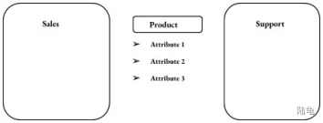
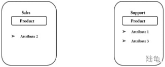
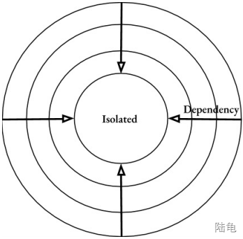
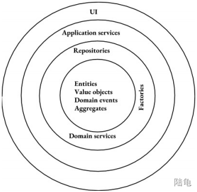
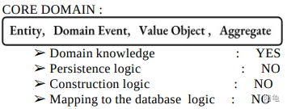
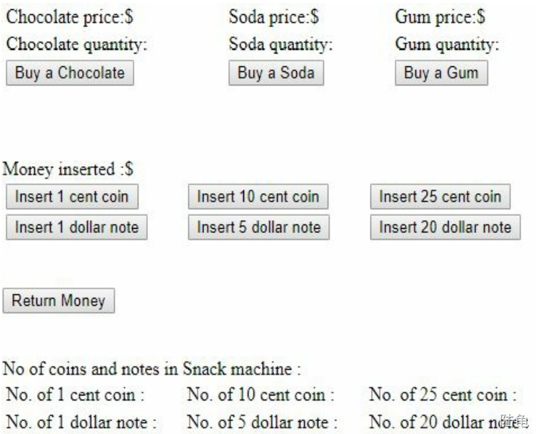
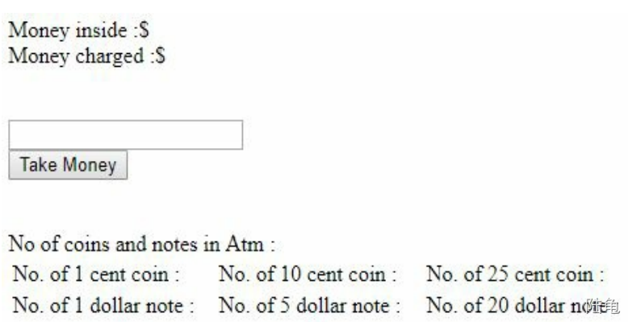
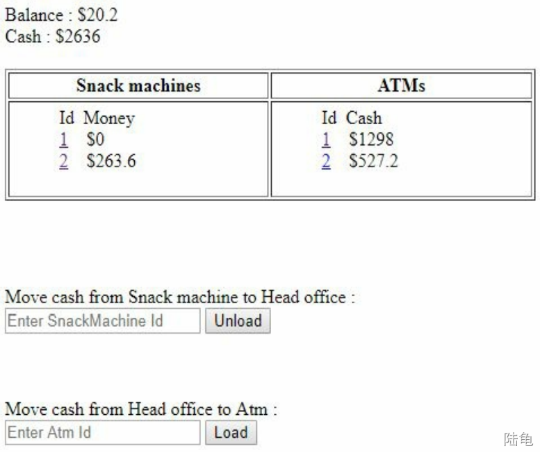

# 前言

这是《domain-driven-design-with-spring-boot》这本书的翻译

来源：[书籍下载 · 语雀 (yuque.com)](https://www.yuque.com/lugew/ddd/fstqw0)

我觉得还不错，实战性强，没有那些高深的专有名词，就直接搬过来了。


# 第一章介绍

## 开始

本书旨在将领域驱动设计（DDD）理论簇应用在Spring Boot环境中，例如单元测试（测试驱动开发）、关系数据库和对象关系映射JPA（Java Persistence API）。从零开始搭建基于DDD原则的完整应用框架（分别为UI和后端）
●Entities（实体）
●Value object（值对象）
●Aggregates（聚合根）
●Repositories（资源库）
●Bounded contexts（界限上下文）
●Domain events（领域事件）
我们将把这些概念应用于实际项目，过程中，很多抉择都经过深思熟虑。

## 领域驱动设计（DDD）应用领域

软件的重要属性有：

●数据量

●性能

●业务逻辑复杂度

●技术复杂度

任何优秀的技术/理论/实践都有其局限性。领域驱动设计也不例外，它只适用于一部分应用——复杂业务逻辑型应用。像新浪微博这种应用，应用DDD帮助不大。

**DDD特别适合下述应用**：

●数据量：小

●性能：低

●业务逻辑复杂度：**高**

●技术复杂度：低

典型的就是企业级应用。


软件开发核心原则：
●YAGNI（you are not gonna need it）
●KSS（keep it short and simple）
这两个原则，是贯彻于每个程序员的职业生涯，绝大部分情况下，此原则都是适用的。YAGNI意思是你只需实现当前仅需的功能，未来的功能不必实现。因为你开发功能大概率都不会被使用。KISS意思是保持程序短小精悍且简单。越简单的程序，可读性就越好，维护起来就越方便。这两个原则非常重要，因为他们能解决软件开发中两个主要问题：减少开发周期和提升代码可维护性。而DDD则是对这两个原则的实践补充。它提炼出问题领域的核心并且将之简化，降低复杂性。将业务逻辑以最简单清晰的方式表达的能力使其完美契合企业级应用。复杂性增长至难以控制的地步，这通常会导致项目流产失败，而DDD可以帮助解决复杂性增长的问题，规避相应的风险。本书的所有内容都是基于DDD理论，从理论过渡到实际，践行YAGNI和KISS原则。

## 核心概念

●通用语言：链接开发者和业务专家

本书假定你已熟悉DDD的相关知识，所以相关术语介绍会尽可能简洁明了。第一个是通用语言，在绝大多数项目中，开发者和业务相关人员对领域的描述都不同，这就导致开发者对问题存在误解的情况，进而影响开发进度。通用语言就是为了解决这个问题而出现。例如：存在一个销售系统，开发人员对最小销售单位产品进行建模，且建立了Product类，而领域专家对其有两种称呼：产品和包裹。这个时候就需要统一称谓，避免歧义。

●限界上下文：不同系统的分界线

另一个重要的概念是限界上下文。不同系统代码之间盘根交错通常是一个系统难以维护的主要原因。严格清晰地定义系统边界，建立限界上下文能有效避免此类情况的出现。








👆如果有两个系统Sales和Support都和Product有关联，那么建议将其分开表示。

●核心域：聚焦系统最重要的部分

**DDD认为任何系统的主要部分就是其业务逻辑，也就是说软件致力于要解决的问题便是核心域**。在Sales系统中便是其众多的业务逻辑，但并不是全部都是，如系统中依赖外部组件的业务就不是。因为一些业务逻辑并不是当前系统的核心问题，这些业务逻辑可以很容易通过第三方实现，而不用从零开始。

通用语言、限界上下文和核心域是DDD中最重要的概念，他们是DDD的战略要素。而其它的概念，如：实体、值对象、资源库则构成了战术要素。

## 领域驱动设计并不全是产出代码

代码是DDD的一个固有属性，其重点应是开发者与领域专家的深入交流。和领域专家的直接沟通异常重要，它关乎能不能获取问题的完整信息。要正确了解领域问题，必须与领域专家反复交流并提炼关键信息。这种交流并非单向，如你发现领域专家的陈述中存在矛盾，请直接指出，这种在问题出现最早期就将其解决的方式是最简单。通过反复的沟通交流，在代码和领域达成统一，有助于更好更快地解决问题。DDD的另一含义是从开发者转变为领域专家。开发者对技术问题的狂热导致对领域问题不够重视，然而要解决好领域问题，开发者必须深入了解领域知识。这看起来很无聊，也很浪费时间，因为开发者认为领域知识并不通用，无法应用于其它项目。恰恰相反，深入了解领域知识本身是好的开发者的一项必不可少的技能，同样，将知识系统化并落地至代码这种能力也是可以应用在其它项目中的。这两种能力随着解决问题规模的线性增长，最终将使开发者更加轻松地适应全新领域。

## 洋葱架构和域隔离



之所以称之为洋葱架构是因为类型洋葱——拥有多层且包含一个核心。外层依赖内层，但内层感知不到外层。有点像经典洋葱层架构实体，但不同地是洋葱架构强调核心部分是完全独立地，不依赖任何对象。这意味着领域模型地核心元素应该和其它元素隔离，这是非常重要的一点。



👆是DDD的架构图，核心是Entities（实体）、Value objects（值对象）、Domain events（领域事件）和Aggregates（聚合根）。外层是资源库（Repositories）、工厂（Factories）和领域服务（Domain services）。应用服务（Application services）在其外层，UI是最后一层。数据库属于哪部分？**所有的数据库操作（ORM或者其它形式）都分装在Repositories中**。实体、值对象、领域事件和聚合根是最基础的，他们能够互相引用，例如聚合根可以引用值对象，值对象也可以引用聚合根。但是这不适用于其它对象，如资源库和工厂。类似的，资源库、工厂和领域服务可以相互感知，且他们也可感知到四个基础元素，但是并不能引用应用服务。



为什么隔离如此重要？为什么将领域模型划分为四个核心要素呢？四个核心要素的关注点不同，实体、值对象、领域事件和聚合根承载了应用最核心的部分——业务逻辑，但他们并没有囊括所有的业务逻辑。资源库和工厂也会保留一些业务逻辑，但四个核心要素是暂大部分的。在这种情况下，将他们职责进行划分是至关重要的。实体和值对象只负责领域逻辑，这意味着它不会关注持久化或者如何创建之类的问题，这两个操作应该是资源库和工厂的责任。他们也不应关心数据库表或列如何存储的问题，也就是说数据映射是不该出现的。责任划分越清晰，后期扩展就越顺利。

```java
public class Product{
    public String name;

    public String getName(){
        return name;
    }

    protected Product(){

    }

    public Product(String name){
        this.name= name;
    }
}
```

👆我们可以引入一个无产构造函数来满足对象关系映射，因为这对领域问题的影响微乎其微。或者可以直接创建新的ProductDto专门用来持久化，当然dto可以用作UI层的数据传输。
●简洁的领域模型
●合适的责任分离
●处理ORM副作用
之后的章节将围绕上面三点进行实践。

## 建模最佳实践

**●聚焦核心域**
如果你严格遵循DDD原则的化，一套系统的指导是必不可少的。首先要做的是聚焦核心域，实践过程中开发者也是从核心域开始建模，同时辅以单元测试，即使此时不存在任何UI和数据库。转变过程很难，特别是当你习惯数据库优先时更甚。构建核心域花费的时间是最多的，也是绝对部分业务逻辑存在的范围，因此花一点时间是值得的。

## 领域驱动设计和单元测试

关于单元测试，需要注意的是其代码覆盖率和成本之前的平衡。100%的测试覆盖率是不切实际的，性价比不高。最需要单元测试的是核心层元素：实体、值对象、聚合根和领域事件，这部分的测试覆盖率应尽量达到100%。因为这部分元素被严格隔离，测试时便没有模拟外部依赖的问题。如果单元测试充斥着资源库和外部依赖，说明域隔离欠缺。这些外部依赖的测试属于集成测试。

## 问题域简介

现在存在一个关于自动售货机和自动取款机的业务，先来看看自动售货机的接口：



👆这是最终展示界面，然而我们着重关心的并不是用户界面，而是其背后的业务逻辑建模——购买零食、找零等。首先，我们需要对投币、找零、出货以及其它业务逻辑建模。售货机有三个零食槽，分别是巧克力（Chocolate）、苏打水（soda）、口香糖（gum）。投币口有：1分、10分、25分、1元、5元、20元。购买零食的流程是投币，选择目标、按下购买按钮。以购买巧克力为例，投3个1元币，按下购买键，巧克力数量减少1。下面我们将细化需求并实现。
另一个对象是ATM



用户可以支付少量费用进行存取款，输入金额1元，按下Take Money，ATM账号金额便会减少1。



最后，我们需要将现金从ATM转移到自动售货机且正确处理所有的费用。这个过程中，我们将会贯彻DDD理念并且给出切实建议。

## 总结

●DDD的应用领域
●软件开发核心原则：YAGNI和KISS
●DDD核心原则：通用语言，限界上下文和核心域
●DDD并不全是产出代码
●洋葱架构和领域模型隔离
●DDD和单元测试
DDD是解决软件复杂性的一个手段，它有自己适用的领域，并不是所有应用都适用。

