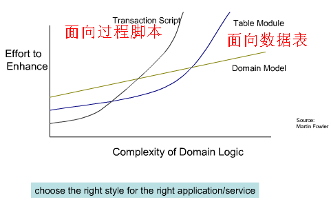
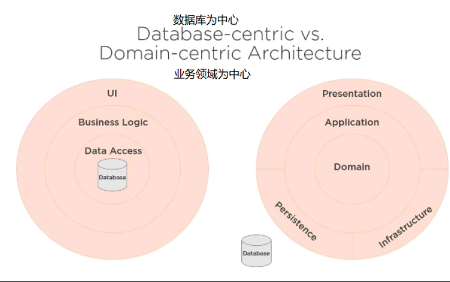

# 为什么会有DDD

[领域驱动设计(DDD:Domain-Driven Design) - 解道Jdon](https://www.jdon.com/ddd.html)

Eric Evans的“Domain-Driven Design领域驱动设计”简称DDD，Evans DDD是一套综合软件系统分析和设计的面向对象建模方法。

过去系统分析和系统设计都是分离的，正如我们国家“系统分析师” 和“系统设计师” 两种职称考试一样，这样割裂的结果导致，需求分析的结果无法直接进行设计编程，而能够进行编程运行的代码却扭曲需求，导致客户运行软件后才发现很多功能不是自己想要的，而且软件不能快速跟随需求变化。

　　DDD则打破了这种隔阂，提出了领域模型概念，统一了分析和设计编程，使得软件能够更灵活快速跟随需求变化。见下面DDD与传统CRUD或过程脚本或者面向数据表等在开发效率上比较：

　服务器后端发展三个阶段：

1. UI+DataBase的两层架构，这种面向数据库的架构(上图table module )没有灵活性。
2. UI+Service+DataBase的多层SOA架构，这种服务+表模型的架构易使服务变得囊肿，难于维护拓展，伸缩性能差，见[这里讨论](http://www.jdon.com/45994)或[**Spring Web 应用的最大败笔**](http://www.jdon.com/45857)或[垂直切片的烟囱式故事已经一去不复返了](https://www.jdon.com/54049)
3. DDD+SOA微服务的事件驱动的[CQRS读写分离架构](https://www.jdon.com/cqrs.html)，应付复杂业务逻辑，以聚合模型替代数据表模型，以并发的事件驱动替代串联的消息驱动。真正实现以业务实体为核心的灵活拓展。

　　DDD革命性在于：领域模型准确反映了业务语言，而传统J2EE或Spring+Hibernate等事务性编程模型只关心数据，这些数据对象除了简单setter/getter方法外，没有任何业务方法，被比喻成失血模型，那么领域模型这种带有业务方法的充血模型到底好在哪里？

　　以[比赛Match](http://www.jdon.com/44815)为案例，比赛有“开始”和“结束”等业务行为，但是传统经典的方式是将“开始”和“结束”行为放在比赛的服务Service中，而不是放在比赛对象本身之中。我们不能因为用了计算机，用了数据库，用了框架，业务模型反而被技术框架给绑架，就像人虽然是由母亲生的，但是人的吃喝拉撒母亲不能替代，更不能以母爱名义肢解人的正常职责行为，如果是这样，这个人就是被母爱绑架了。

　　提倡充血模型，实际就是让过去被肢解被黑crack的业务模型回归正常，当然这也会被一些先入为主或被洗过脑的程序员看成反而不正常，这更是极大可悲之处。看到领域模型代码，就看到业务需求，没有翻译没有转换，保证软件真正实现“拷贝不走样”。

　　

　　DDD最大的好处是：接触到需求第一步就是考虑领域模型，而不是将其切割成数据和行为，然后数据用数据库实现，行为使用服务实现，最后造成需求的首肢分离。DDD让你首先考虑的是业务语言，而不是数据。重点不同导致编程世界观不同。

　　DDD是解决复杂中大型软件的一套行之有效方式，在国外已经成为主流。DDD认为很多原因造成软件的复杂性，我们不可能避免这些复杂性，能做的是对复杂的问题进行控制。而一个好的领域模型是控制复杂问题的关键。领域模型的价值在于提供一种通用的语言，使得领域专家、产品经理和软件技术人员联系在一起，沟通无歧义。

　　DDD落地实现离不开[Clean架构、六边形架构](https://www.jdon.com/tags/40250)、 [CQRS、](http://www.jdon.com/tags/9958)[Event Source](http://www.jdon.com/tags/17268)几大大相关领域。下图是传统以数据库为中心的架构与使用DDD实现以领域为中心架构的区别。

　DDD专门为解决复杂性而诞生，因此解决思路完全不同于传统的CRUD，但是DDD本身掌握起来并不会感觉复杂，从程序员角度看，DDD其实是研究将包含业务逻辑的ifelse语句放在哪里的学问。

　　DDD主要难点是领域发现和领域建模，万事开头难，除了DDD原著作提出领域统一语言外，目前用于领域发现的方法有：事件风暴、业务能力建模、领域讲故事、业务模型画布、示例映射、影响映射、Wardley Maps等

