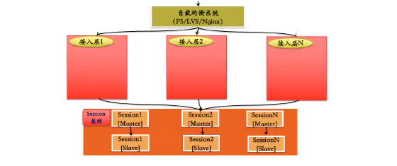

# 分布式无状态设计及幂等设计

[6、分布式无状态设计及幂等设计 - 简书 (jianshu.com)](https://www.jianshu.com/p/f8745ab297a4)

## 一、服务的状态

### 1、定义

- **无状态服务（stateless service）**对单次请求的处理，不依赖其他请求，也就是说，处理一次请求所需的全部信息，要么都包含在这个请求里，要么可以从外部获取到（比如说数据库），服务器本身不存储任何信息
- **有状态服务（stateful service）**则相反，它会在自身保存一些数据，先后的请求是有关联的

### 2、状态服务于无状态服务比较

- 单体条件下面，服务只有一个，因此状态每个时刻也就只有一种状态。在分布式集群环境下面，就存在一个状态同步问题，因此也有**有状态服务设计**和**无状态服务设计**。比如session，如果session保存在每一台服务器上，那么就是有状态设计，可能会出现集群内，服务状态不一致的现象；如果session由专门的一台服务器来保存，就是无状态设计，服务不保存状态，需要的时候从同一的服务器中获取，保证了服务在任何时刻的状态一致。
- 有状态的服务，会有比较明显的缺点，服务间数据需要同步，成为副本关系，逻辑复杂也浪费资源 ；无状态的应用服务器，不保存上下文信息，只负责对用户的每次请求提交数据进行处理然后返回处理结果 无状态应用服务器之间是对等的关系，无依赖，请求到哪个服务器，处理结果都一样的。

| 项目     | 有状态服务                                       | 无状态服务                   |
| -------- | ------------------------------------------------ | ---------------------------- |
| HA       | 负载均衡服务                                     | 负载均衡服务                 |
| 数据同步 | 需要同步                                         | 无数据同步                   |
| 资源消耗 | 消耗内存资源保存数据，消耗带宽进行数据同步       | 无内存消耗，无带宽消耗       |
| 部署发布 | 部署服务还需要额外的数据同步操作，有冷启动的问题 | 直接部署上线即可使用         |
| failover | 可能存在数据不同步，丢失数据                     | 负载均衡失效转给，无数据丢失 |

​												无状态服务于有状态服务区别

总结：对于高可用服务的构建要求来说，快速failover以及快速扩容是非常重要的 服务有状态，服务当机就可能会存在数据丢失 关键是快速扩容，有状态服务会有冷启动的问题，还需要先加载数据才能对外提供服务，太麻烦了,在进行系统设计时，时刻要有这个意识，我们的应用服务器，要设计成无状态,不保存任何上下文信息。当然在实现诸如本地事物的时候可以考虑有状态设计。

### 3、在论无状态设计

（1）设计要点

> 1、保证冗余部署的多个模块（进程）完全对等
> 2、请求提交到冗余部署任意模块，处理结果完全一样
> 3、模块不存储业务的上下文信息
> 4、仅根据每次请求携带的数据进行相应的业务逻辑处理

（2）目的

> 1、快速扩容服务
> 2、弹性缩容服务

（3）无状态服务设计案例（session的保存）

## 二、服务的幂等设计

- 如今我们的系统大多拆分为分布式SOA，或者微服务，一套系统中包含了多个子系统服务，而一个子系统服务往往会去调用另一个服务，而服务调用服务无非就是使用RPC通信或者restful，既然是通信，那么就有可能再服务器处理完毕后返回结果的时候挂掉，这个时候用户端发现很久没有反应，那么就会多次点击按钮，这样请求有多次，那么处理数据的结果就有可能不一致问题。

### 1、抽象概念

- 一个幂等操作的特点是其任意多次执行所产生的影响均与一次执行的影响相同。幂等函数，或幂等方法，是指可以使用相同参数重复执行，并能获得相同结果的函数。这些函数不会影响系统状态，也不用担心重复执行会对系统造成改变。

> **针对一个操作，不管做多少次，产生效果或返回的结果都是一样的**

### 2、幂等案例

- 1、比如前端对同一表单数据的重复提交，后台应该只会产生一个结果
- 2、比如我们发起一笔付款请求，应该只扣用户账户一次钱，当遇到网络重发或系统bug重发，也应该只扣一次钱
- 3、比如发送消息，也应该只发一次，同样的短信如果多次发给用户，用户会崩溃
- 4、比如创建业务订单，一次业务请求只能创建一个，不能出现创建多个订单
- 等等等等等...

### 3、curd与幂等

- 从读写层面来说，写请求有可能会对数据造成改变；从分层架构层面来说，数据访问层（dao层）可能会对数据造成改变。因此幂等设计重点考虑**数据访问层的写请求。**

> 1、查询对于结果是不会有改变的（无）
> 2、删除操作需要根据sql语句来定义（绝对值的修改是幂等的比如delete from user where age=10，相对值的修改不是幂等的比如delete from user bottom 10）
> 3、更新操作需要根据sql语句来定义（比如update user set age=10 where uid=20（绝对值修改）是幂等的，而update user set age++ where uid=20（相对值的修改）是非幂等的）
> 4、insert基本上不是幂等,除非表设计了一些约束（比如唯一主键等）

### 4、实现幂等技术

- 要实现幂等技术就是要在数据服务层保证幂等。

（1）数据表使用唯一主键（unique）或者联合主键保证
（2）token机制（redis+token）：数据提交前要向服务的申请token，token放到redis，token有效时间；提交后后台校验token，同时删除token，完成相关业务逻辑。
（3）通过数据库悲观锁和乐观锁机制
（4）分布式锁
（5）根据业务进行状态机幂等设计

### 5、对外提供接口的api如何保证幂等

- 如银联提供的付款接口：需要接入商户提交付款请求时附带：source来源，seq序列号。source+seq在数据库里面做唯一索引，防止多次付款

> 对外提供接口为了支持幂等调用，接口有两个字段必须传，一个是来源source，一个是来源方序列号seq，这个两个字段在提供方系统里面做联合唯一索引，这样当第三方调用时，先在本方系统里面查询一下，是否已经处理过，返回相应处理结果；没有处理过，进行相应处理，返回结果。注意，为了幂等友好，一定要先查询一下，是否处理过该笔业务，不查询直接插入业务系统，会报错，但实际已经处理了。