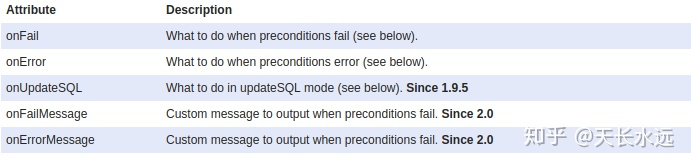
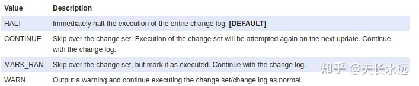
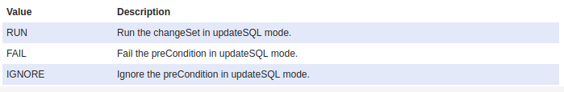
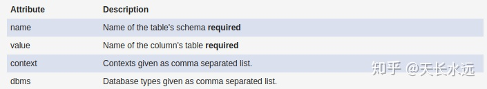
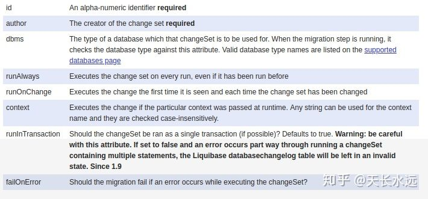
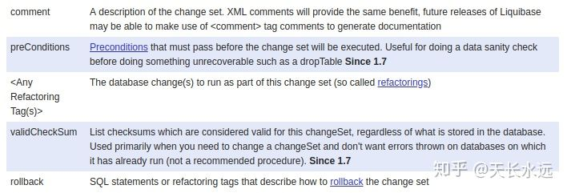
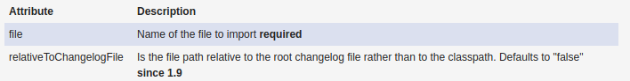

# 简介

参考：https://zhuanlan.zhihu.com/p/66187627

参考：https://www.cnblogs.com/tonyq/p/8039770.html

官网：https://www.liquibase.org/

和Springboot一起使用：https://docs.liquibase.com/tools-integrations/springboot/springboot.html

Liquibase是一个用于跟踪、管理**数据库变化**的开源**数据库重构工具**。它将数据库的所有变化（包括结构和数据）都保存在XML文件中，便于版本控制。Liquibase不依赖特定数据库，支持常见的12种数据库，包括：Oracle,MySQL, DB2,SQL Server,PostgreSQL,h2等。

- 支持多开发者的协作维护；
- 日志文件支持多种格式，如XML, YAML, JSON, SQL等；
- 支持多种运行方式，如命令行、Spring集成、Maven插件、Gradle插件等；

# Spring boot中使用LiquiBase

Spring boot内置了对Liquibase的支持，只需要在项目中引入Liquibase依赖并进行配置即可。版本号不用写。

```xml
<dependency>
    <groupId>org.liquibase</groupId>
    <artifactId>liquibase-core</artifactId>
    <version>3.5.3</version>
</dependency>
```

## 添加配置

配置Liquibase可以直接在application.properties中指定属性，也可以使用Java code来指定属性。

application.properties配置方式

```properties
liquibase.change-log=classpath:config/liquibase/master.xml  //存储变化的xml文件的位置
liquibase.user=sa                             //访问数据库的用户名
liquibase.password=                           //访问数据库的密码
liquibase.url=jdbc:h2:file:~/.h2/testdb       //访问数据库的连接地址
liquibase.enabled=true //启用liquibase，Spring boot 2.0之后使用spring.liquibase.enabled
liquibase.drop-first=false //默认为false，如果设置为true，liquibase将首先删除所有数据库对象的所有连接的用户。
```

Java配置方式

```java

import javax.sql.DataSource;

import org.springframework.context.annotation.Bean;
import org.springframework.context.annotation.Configuration;

import liquibase.integration.spring.SpringLiquibase;

@Configuration
public class LiquibaseConfig {
	
    @Bean
    public SpringLiquibase liquibase(DataSource dataSource) {
        SpringLiquibase liquibase = new SpringLiquibase();
        liquibase.setDataSource(dataSource);
        liquibase.setChangeLog("classpath:config/liquibase/master.xml");
        liquibase.setContexts("development,test,production");
        liquibase.setShouldRun(true);
        return liquibase;
    }
	
}
```

## 配置DB change

DB配置一般分为master配置和细节配置，master中使用include引入细节配置文件。

### 添加db.changelog-master.xml

```xml
<?xml version="1.0" encoding="utf-8"?>
<databaseChangeLog
    xmlns:xsi="http://www.w3.org/2001/XMLSchema-instance"
    xmlns="http://www.liquibase.org/xml/ns/dbchangelog"
    xsi:schemaLocation="http://www.liquibase.org/xml/ns/dbchangelog 
     http://www.liquibase.org/xml/ns/dbchangelog/dbchangelog-3.1.xsd">

    <include file="classpath:db/changelog/201712022057_add_entity_Base.xml" 
       relativeToChangelogFile="false"/>

</databaseChangeLog>
```

可以写多个include 来包含文件，也可以写includeAll来包含目录下的所有子文件，注意includeAll时不要把db.changelog-master.xml自己包含进去了，否则会死循环


### 添加子配置文件

201712022057_add_entity_Base.xml

**changelog中的一个changeSet对应一个事务，在changeSet执行完后commit，如果出现错误则rollback。**

```xml
<?xml version="1.0" encoding="utf-8"?>
<databaseChangeLog
    xmlns="http://www.liquibase.org/xml/ns/dbchangelog"
    xmlns:xsi="http://www.w3.org/2001/XMLSchema-instance"
    xsi:schemaLocation="http://www.liquibase.org/xml/ns/dbchangelog 
      http://www.liquibase.org/xml/ns/dbchangelog/dbchangelog-3.1.xsd">
	//now(): 调用sql函数,不推荐，不能保证与所有的sql通用
    <property name="now" value="now()" dbms="mysql"/>
 
    <changeSet id="20171202205" author="WATER">
        <preConditions onFail="MARK_RAN">
            <not>
                <tableExists tableName="tb_member"/>
            </not>
        </preConditions>
        
        <createTable tableName="tb_member">
           <column name="id" type="bigint" autoIncrement="true"   remarks="主键"   >
                <constraints primaryKey="true" nullable="false"/>
            </column>
            <column name="mobile" type="varchar(50)"   remarks="手机号"  >
                <constraints nullable="false" />
            </column>
            <column name="status" type="varchar(10)" remarks="账号状态"   />
            <column name="created_date" type="timestamp" defaultValueDate="${now}" remarks="创建时间" >
                <constraints nullable="false"/>
            </column>
            <column name="last_modified_by" type="varchar(50)"/>
            <column name="last_modified_date" type="timestamp"/>
        </createTable>
    </changeSet>
</databaseChangeLog>
```

通过上面的示例，我们已经知道在spring boot中怎么使用liquibase。由上可知，databaseChangeLog中会包含多个changeSet，Liquibase会在一个transaction中执行一个changeSet。执行上面的配置文件，会在DB中生成数据表tb_member，同时会生成表databasechangelog和databasechangeloglock。前者记录database上执行的所有statements，后者用于确保两台机器不会同时修改database。

Liquibase执行时会检查表databasechangelog，从而只执行没有执行过的changeSet。

## Liquibase changelog讲解

databasechangelog中包含元素include，property，changeSet，preConditions。

### **preConditions**

preConditions作用于databaseChangelog或changeSet来控制执行。changelog level的precoditions应用于所有的changeSet，包含include进来的changeSet。preConditions条件满足，按顺序执行其中的changeSet和include；preConditions条件不满足，失败退出并解释失败的原因。

下面是使用preConditions的示例。只有database type为oracle且username为SYSTEM时才执行该changelog。同时，只有oldtable中没有数据时才能drop table。

```xml
<?xml version="1.0" encoding="UTF-8"?>

<databaseChangeLog
  xmlns="http://www.liquibase.org/xml/ns/dbchangelog/1.8"
  xmlns:xsi="http://www.w3.org/2001/XMLSchema-instance"
  xsi:schemaLocation="http://www.liquibase.org/xml/ns/dbchangelog/1.8
         http://www.liquibase.org/xml/ns/dbchangelog/dbchangelog-1.8.xsd">
    <preConditions>
        <dbms type="oracle" />
        <runningAs username="SYSTEM" />
    </preConditions>

    <changeSet id="1" author="bob">
        <preConditions onFail="WARN">
            <sqlCheck expectedResult="0">select count(*) from oldtable</sqlCheck>
        </preConditions>
        <comment>Comments should go after preCondition. If they are before then liquibase 
          usually gives error.</comment>
        <dropTable tableName="oldtable"/>
    </changeSet>
</databaseChangeLog>
```

下面是常见的判断结果：



当出现上面的结果时，可以进行一些处理。

当结果为onFail或onError时，可执行下面操作：



当结果为onUpdateSQL时，可执行下面操作：



条件之间可以使用AND/OR/NOT进行拼接来构建复杂的环境，默认为and。下面为示例。

```xml
 <preConditions>
     <or>
         <and>
            <dbms type="oracle" />
            <runningAs username="SYSTEM" />
         </and>
         <and>
            <dbms type="mssql" />
            <runningAs username="sa" />
         </and>
     </or>
 </preConditions>
```

可用的precoditions包括下面item：

```
<dbms>、<runningAs>、<changeSetExecuted>、<columnExists>、<tableExists>、<viewExists>、<foreignKeyConstraintExists>、<indexExists>、<sequenceExists>、<primaryKeyExists>、<sqlCheck>
```

等。

详情参见文章[preconditions](https://link.zhihu.com/?target=http%3A//www.liquibase.org/documentation/preconditions.html)。

### **property**

Liquibase允许动态替换changelog中的参数，参数一般使用${}表示。参数值的搜索顺序：a. Liquibase runner的参数； b.JVM系统参数； c. changelog中<property>提供的参数。

property具有下面的属性，设置context或dbms，参数只会在这些context或dbms中使用。



下面是property的示例。

```text
    <property name="simpleproperty" value="somevalue"/>
    <property name="clob.type" value="clob" dbms="oracle,h2"/>
    <property name="clob.type" value="longtext" dbms="mysql"/>
    <property name="myproperty" value="yes" context="common,test"/>
```

详情参见文章[property](https://link.zhihu.com/?target=http%3A//www.liquibase.org/documentation/changelog_parameters.html)。

### **changeSet**

changeSet将database changes组合在一起，使用id,author以及changelog file path来唯一识别。

Liquibase顺序执行changelog中的changeSet，根据表databasechangelog判断id/author/filepath是否已经执行过，若执行过则跳过该changeSet，除非指定runAlways为true. 当changeset执行完，在表databasechangelog插入一行来记录id/author/filepath以及changeset的MD5sum值。

Liquibase通常在一个transaction中执行changeSet。

下面是changeSet具有的属性。



changeSet中可以包含如下的sub-tags。



其中，rollback tag用来描述怎么rollback change，可以使用SQL、change tags或之前changeSet的reference。

```xml
// Use SQL
<changeSet id="1" author="bob">
    <createTable tableName="testTable">
    <rollback>
        drop table testTable
    </rollback>
</changeSet>
// Use change tag
<changeSet id="1" author="bob">
    <createTable tableName="testTable">
    <rollback>
        <dropTable tableName="testTable"/>
    </rollback>
</changeSet>
// Use change set
<changeSet id="2" author="bob">
    <dropTable tableName="testTable"/>
    <rollback changeSetId="1" changeSetAuthor="bob"/>
</changeSet>
```

Liquibase执行changeSet时会计算check sum并保存在DB中。当check sum不匹配时，说明有人修改了changeSet，Liquibase将会报错并退出。若想忽略该错误，可将id/author/filepath对应的check sum设置为null，这样，下次执行时会生成新的check sum。设置runOnChange为true，当check sum不同时都会重新执行。

详情参见文章[changeSet](https://link.zhihu.com/?target=http%3A//www.liquibase.org/documentation/changeset.html)。

### **include**

用来在root change log file中引入其他的change log file。示例如下。

```xml
<?xml version="1.0" encoding="UTF-8"?>

<databaseChangeLog
  xmlns="http://www.liquibase.org/xml/ns/dbchangelog/1.9"
  xmlns:xsi="http://www.w3.org/2001/XMLSchema-instance"
  xsi:schemaLocation="http://www.liquibase.org/xml/ns/dbchangelog/1.9
         http://www.liquibase.org/xml/ns/dbchangelog/dbchangelog-1.9.xsd">
    <include file="com/example/news/news.changelog.xml"/>
    <include file="com/example/directory/directory.changelog.xml"/>
</databaseChangeLog>
```

include具有如下属性。




```
<include>的file属性表示要包含的changelog文件的路径，这个文件可以是LiquiBase支持的任意格式，relativeToChangelogFile如果为true，则表示file属性表示的文件路径是相对于根changelog而不是CLASSPATH的，默认为false。
<includeAll>指定的是changelog的目录，而不是为文件，如：
<includeAll path="com/example/changelogs/"/>
```


include目前具有重复引用和循环引用的问题。重复引用因为不会执行已经执行过的changeSet而自动解决。

详情参见文章[include](https://link.zhihu.com/?target=http%3A//www.liquibase.org/documentation/include.html)。

### **contexts**

Liquibase使用contexts作为tag来限制changeSet是否执行，可将changeSet进行分组。若不设置context，该changeSet将总是执行。context可以具有任意名称且大小写不敏感。

下面是使用context的示例。

```xml
   <changeSet id="2" author="bob" context="test">
        <insert tableName="news">
            <column name="id" value="1"/>
            <column name="title" value="Liquibase 0.8 Released"/>
        </insert>
        <insert tableName="news">
            <column name="id" value="2"/>
            <column name="title" value="Liquibase 0.9 Released"/>
        </insert>
    </changeSet>
```

可以使用and,or,!以及()来组合context，优先级顺序! > and > or。context也可以用,分隔，优先级比较高。test, qa and master等价于(test) or (qa and master)。

详情参见文章 [contexts](https://link.zhihu.com/?target=http%3A//www.liquibase.org/documentation/contexts.html) .

### **changes**

Liquibase中提供了很多可以作用于database的changes。

- Table/View

包括create, drop, rename table/view/column.

- index

包括create,drop index/procedure/primary key/foreign key/unique constraint/not null constraint/default value

- insert/delete

下面hi创建table的示例。

```xml
<changeSet author="liquibase-docs" id="createTable-example">
    <createTable catalogName="cat"
            remarks="A String"
            schemaName="public"
            tableName="person"
            tablespace="A String">
        <column name="address" type="varchar(255)"/>
    </createTable>
</changeSet>
```

详情参见文章[changes](https://link.zhihu.com/?target=http%3A//www.liquibase.org/documentation/changes/index.html) .

## 执行Liquibase

Liquibase可以on demand执行，也可以自动执行。On demand执行的方式包括command line, Ant, Maven。自动执行的方式包括servlet listener, spring listener。更多信息参见文章[Running](https://link.zhihu.com/?target=http%3A//www.liquibase.org/documentation/running.html)。

# spring.liquibase所有配置

| 配置项                                          | 默认值                                           | 注释                                                         |
| ----------------------------------------------- | ------------------------------------------------ | ------------------------------------------------------------ |
| spring.liquibase.change-log                     | classpath:/db/changelog/db.changelog-master.yaml | changeLogFile 配置路径                                       |
| spring.liquibase.check-change-log-location      | true                                             | 是否检查 changelog 配置路径存在                              |
| spring.liquibase.contexts                       |                                                  | 只有指定的 context 的 changelog 才会被执行，多个 context 之间以逗号分隔 |
| spring.liquibase.default-schema                 |                                                  | 默认数据库                                                   |
| spring.liquibase.liquibase-schema               |                                                  | 用于存储 liquibase 对象的数据库                              |
| spring.liquibase.liquibase-tablespace           |                                                  | 用于 liquibase 对象的表空间                                  |
| spring.liquibase.database-change-log-table      | DATABASECHANGELOG                                | 存储数据库改变记录执行情况的表名                             |
| spring.liquibase.database-change-log-lock-table | DATABASECHANGELOGLOCK                            | 存储当前使用 liquibase 的用户信息表名                        |
| spring.liquibase.drop-first                     | false                                            | 是否先删除表                                                 |
| spring.liquibase.enabled                        | true                                             | 是否启用 liquibase                                           |
| spring.liquibase.user                           |                                                  | liquibase 使用的数据库用户名，不指定时使用 spring.datasource 中的 |
| spring.liquibase.password                       |                                                  | liquibase 使用的数据库用户密码，不指定时使用 spring.datasource 中的 |
| spring.liquibase.url                            |                                                  | liquibase 使用的数据库url，不指定时使用 spring.datasource 中的 |
| spring.liquibase.labels                         |                                                  | 指定标签的才会运行，多个标签以逗号分隔                       |
| spring.liquibase.parameters                     |                                                  | changelog 参数                                               |
| spring.liquibase.rollback-file                  |                                                  | 当执行升级时写回滚 SQL 的文件                                |
| spring.liquibase.test-rollback-on-update        |                                                  | 执行更新前是否验证回滚                                       |


# yaml格式的配置

xml格式依赖liquidbase版本号，yaml就不需要，兼容性更好

## **db.changelog-master.yaml**

```yaml
databaseChangeLog:
  - includeAll:
      path: db/change-log/
```

## **新建表**

```yaml
databaseChangeLog:
  - changeSet:
      id: 202104142000 #可以用日期作为标志
      author: yh
      changes:
        - createTable:
            tableName: user
            remarks: 用户 #注释
            columns:
              - column:
                  name: id
                  type: int(11)
                  remarks: 主键
                  autoIncrement: true
                  constraints:
                    primaryKey: true
                    nullable: false
              - column:
                  name: username
                  type: varchar(128)
                  remarks: 用户名
              - column:
                  name: password
                  type: varchar(127)
                  remarks: 密码
              - column:
                  name: create_time
                  type: datetime
                  remarks: 创建时间
                  defaultValueDate: now()
              - column:
                  name: update_time
                  type: datetime
                  remarks: 更新时间
                  defaultValueDate: now()
```

## 更新表 添加字段

```yaml
databaseChangeLog:
  - changeSet:
      id: 202104142029
      author: yh
      changes:
        - addColumn:
            columns:
              - column:
                  name: nick_name
                  type: varchar(128)
                  remarks: 别名
            tableName: user
```

