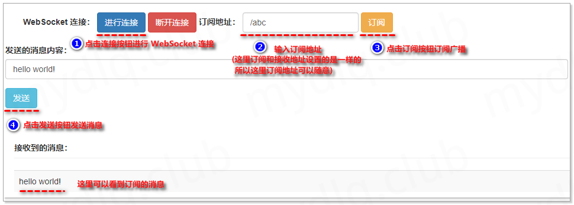

# STOMP 协议介绍

[SpringBoot 实现 Websocket 通信详解 | 超级小豆丁 (mydlq.club)](http://www.mydlq.club/article/86/#一websocket-简介)

**(1)、STOMP 协议概述**

​    STOMP（Simple Text-Orientated Messaging Protocol）是一种简单的面向文本的消息传递协议。它提供了一个可互操作的连接格式，允许 STOMP 客户端与任意 STOMP 消息代理（Broker）进行交互。STOMP 协议由于设计简单，易于开发客户端，因此在多种语言和多种平台上得到广泛地应用。

**(2)、简单介绍可以分为以下几点：**

- STOMP 是基于帧的协议，其帧以 HTTP 为模型。
- STOMP 框架由命令，一组可选的标头和可选的主体组成。
- STOMP 基于文本，但也允许传输二进制消息。
- STOMP 的默认编码为 UTF-8，但它支持消息正文的替代编码的规范。

**(3)、STOMP 客户端是一种用户代理，可以分为两种模式运行：**

- 作为生产者，通过 SEND 帧将消息发送到目标服务器上。
- 作为消费者，对目标地址发送 SUBSCRIBE 帧，并作为 MESSAGE 帧从服务器接收消息。

**(4)、STOMP 帧**

STOMP 是基于帧的协议，其帧以 HTTP 为模型。STOMP 结构为：

```
COMMAND
header1:value1
header2:value2

Body^@
```

客户端可以使用 SEND 或 SUBSCRIBE 命令发送或订阅消息，还可以使用 "destination" 头来描述消息的内容和接收者。这支持一种简单的发布-订阅机制，可用于通过代理将消息发送到其他连接的客户端，或将消息发送到服务器以请求执行某些工作。

**(5)、Stomp 常用帧**

STOMP 的客户端和服务器之间的通信是通过"**帧**"（Frame）实现的，每个帧由多"**行**"（Line）组成，其包含的帧如下：

- **Connecting Frames：**
  - [CONNECT（连接）](https://stomp.github.io/stomp-specification-1.2.html#CONNECT_or_STOMP_Frame)
  - [CONNECTED（成功连接）](https://stomp.github.io/stomp-specification-1.2.html#CONNECTED_Frame)
- **Client Frames：**
  - [SEND（发送）](https://stomp.github.io/stomp-specification-1.2.html#SEND)
  - [SUBSRIBE（订阅）](https://stomp.github.io/stomp-specification-1.2.html#SUBSCRIBE)
  - [UNSUBSCRIBE（取消订阅）](https://stomp.github.io/stomp-specification-1.2.html#UNSUBSCRIBE)
  - [BEGIN（开始）](https://stomp.github.io/stomp-specification-1.2.html#BEGIN)
  - [COMMIT（提交）](https://stomp.github.io/stomp-specification-1.2.html#COMMIT)
  - [ABORT（中断）](https://stomp.github.io/stomp-specification-1.2.html#ABORT)
  - [ACK（确认））](https://stomp.github.io/stomp-specification-1.2.html#ACK)
  - [NACK（否认））](https://stomp.github.io/stomp-specification-1.2.html#NACK)
  - [DISCONNECT（断开连接））](https://stomp.github.io/stomp-specification-1.2.html#DISCONNECT)
- **Server Frames：**
  - [MESSAGE（消息））](https://stomp.github.io/stomp-specification-1.2.html#MESSAGE)
  - [RECEIPT（接收））](https://stomp.github.io/stomp-specification-1.2.html#RECEIPT)
  - [ERROR（错误））](https://stomp.github.io/stomp-specification-1.2.html#ERROR)

**(6)、Stomp 与 WebSocket 的关系**

​    直接使用 WebSocket 就很类似于使用 TCP 套接字来编写 Web 应用，因为没有高层级的应用协议（wire protocol），因而就需要我们定义应用之间所发送消息的语义，还需要确保连接的两端都能遵循这些语义。同 HTTP 在 TCP 套接字上添加请求-响应模型层一样，STOMP 在 WebSocket 之上提供了一个基于帧的线路格式层，用来定义消息语义。

**(7)、使用 STOMP 作为 WebSocket 子协议的好处**

- 无需发明自定义消息格式
- 在浏览器中 使用现有的stomp.js客户端
- 能够根据目的地将消息路由到
- 可以使用成熟的消息代理（例如RabbitMQ，ActiveMQ等）进行广播的选项
- 使用STOMP（相对于普通 WebSocket）使 Spring Framework 能够为应用程序级使用提供编程模型，就像 Spring MVC 提供基于 HTTP 的编程模型一样。

# Spring 封装的 STOMP

使用 Spring 的 STOMP 支持时，Spring WebSocket 应用程序充当客户端的 STOMP 代理。消息被路由到 @Controller 消息处理方法或简单的内存中代理，该代理跟踪订阅并向订阅的用户广播消息。还可以将 Spring 配置为与专用的 STOMP 代理（例如 RabbitMQ，ActiveM Q等）一起使用，以实际广播消息。在那种情况下，Spring 维护与代理的 TCP 连接，将消息中继到该代理，并将消息从该代理向下传递到已连接的 WebSocket 客户端。因此 Spring Web 应用程序可以依赖基于统一 HTTP 的安全性，通用验证以及熟悉的编程模型消息处理工作。

Spring 官方提供的处理流图:


上面中的一些概念关键词：

- **Message：** 消息，里面带有 header 和 payload。

- **MessageHandler：** 处理 client 消息的实体。

- MessageChannel：

  解耦消息发送者与消 息接收者的实体

  - clientInboundChannel：用于从 WebSocket 客户端接收消息。
  - clientOutboundChannel：用于将服务器消息发送给 WebSocket 客户端。
  - brokerChannel：用于从服务器端、应用程序中向消息代理发送消息

- **Broker：** 存放消息的中间件，client 可以订阅 broker 中的消息。

上面的设置包括3个消息通道：

- **clientInboundChannel：** 用于来自WebSocket客户端的消息。
- **clientOutboundChannel：** 用于向WebSocket客户端发送消息。
- **brokerChannel：** 从应用程序内部发送给代理的消息。

# 示例一：实现简单的广播模式

WebSocket 常分为广播与队列模式，广播模式是向订阅广播的用户发送信息，只要订阅相关广播就能收到对应信息。而队列模式常用于点对点模式，为单个用户向另一个用户发送信息，这里先介绍下广播模式的实现示例。

**依赖**：

```xml
<dependency>
    <groupId>org.springframework.boot</groupId>
    <artifactId>spring-boot-starter-websocket</artifactId>
</dependency>
```

## 传输消息的实体类

```java
import lombok.Data;

@Data
public class MessageBody {
    /** 消息内容 */
    private String content;
    /** 广播转发的目标地址（告知 STOMP 代理转发到哪个地方） */
    private String destination;
}
```

## 创建 WebSocket 配置类

创建 WebSocket 配置类，配置进行连接注册的端点 `/mydlq` 和消息代理前缀 `/topic` 及接收客户端发送消息的前缀 `/app`。

```java
import org.springframework.context.annotation.Configuration;
import org.springframework.messaging.simp.config.MessageBrokerRegistry;
import org.springframework.web.socket.config.annotation.EnableWebSocketMessageBroker;
import org.springframework.web.socket.config.annotation.StompEndpointRegistry;
import org.springframework.web.socket.config.annotation.WebSocketMessageBrokerConfigurer;

@Configuration
@EnableWebSocketMessageBroker
public class WebSocketConfig implements WebSocketMessageBrokerConfigurer {

    /**
     * 配置 WebSocket 进入点，及开启使用 SockJS，这些配置主要用配置连接端点，用于 WebSocket 连接
     *
     * @param registry STOMP 端点
     */
    @Override
    public void registerStompEndpoints(StompEndpointRegistry registry) {
        registry.addEndpoint("/mydlq").withSockJS();
    }

    /**
     * 配置消息代理选项
     *
     * @param registry 消息代理注册配置
     */
    @Override
    public void configureMessageBroker(MessageBrokerRegistry registry) {
        // 设置一个或者多个代理前缀，在 Controller 类中的方法里面发生的消息，会首先转发到代理从而发送到对应广播或者队列中。
        registry.enableSimpleBroker("/topic");
        // 配置客户端发送请求消息的一个或多个前缀，该前缀会筛选消息目标转发到 Controller 类中注解对应的方法里
        registry.setApplicationDestinationPrefixes("/app");
    }

}

```

## 创建测试 Controller 类

创建 Controller 类，该类也类似于正常 Web 项目中 Controller 写法一样，在方法上面添加 `@MessageMapping` 注解，当客户端发送消息请求的前缀匹配上 `WebSocket` 配置类中的 `/app` 前缀后，会进入到 `Controller` 类中进行匹配，如果匹配成功则执行注解所在的方法内容。

```java
import mydlq.club.model.MessageBody;
import org.springframework.beans.factory.annotation.Autowired;
import org.springframework.messaging.handler.annotation.MessageMapping;
import org.springframework.messaging.simp.SimpMessageSendingOperations;
import org.springframework.stereotype.Controller;

@Controller
public class MessageController {

    /** 消息发送工具对象 */
    @Autowired
    private SimpMessageSendingOperations simpMessageSendingOperations;

    /** 广播发送消息，将消息发送到指定的目标地址 */
    @MessageMapping("/test")
    public void sendTopicMessage(MessageBody messageBody) {
        // 将消息发送到 WebSocket 配置类中配置的代理中（/topic）进行消息转发
        simpMessageSendingOperations.convertAndSend(messageBody.getDestination(), messageBody);
    }

}

```

## 创建测试的前端 html 和 js

**(1)、创建 WebSocket JS**

创建用于操作 WebSocket 的 JS 文件 `app-websocket.js`，内容如下：

```js
// 设置 STOMP 客户端
var stompClient = null;
// 设置 WebSocket 进入端点
var SOCKET_ENDPOINT = "/mydlq";
// 设置订阅消息的请求前缀
var SUBSCRIBE_PREFIX = "/topic"
// 设置订阅消息的请求地址
var SUBSCRIBE = "";
// 设置服务器端点，访问服务器中哪个接口
var SEND_ENDPOINT = "/app/test";

/* 进行连接 */
function connect() {
    // 设置 SOCKET //SOCKET_ENDPOINT=http://localhost:8080/mydlq
    var socket = new SockJS(SOCKET_ENDPOINT);
    // 配置 STOMP 客户端
    stompClient = Stomp.over(socket);
    // STOMP 客户端连接
    stompClient.connect({}, function (frame) {
        alert("连接成功");
    });
}

/* 订阅信息 */
function subscribeSocket(){
    // 设置订阅地址
    SUBSCRIBE = SUBSCRIBE_PREFIX + $("#subscribe").val();
    // 输出订阅地址
    alert("设置订阅地址为：" + SUBSCRIBE);
    // 执行订阅消息
    stompClient.subscribe(SUBSCRIBE, function (responseBody) {
        var receiveMessage = JSON.parse(responseBody.body);
        $("#information").append("<tr><td>" + receiveMessage.content + "</td></tr>");
    });
}

/* 断开连接 */
function disconnect() {
    stompClient.disconnect(function() {
        alert("断开连接");
    });
}

/* 发送消息并指定目标地址（这里设置的目标地址为自身订阅消息的地址，当然也可以设置为其它地址） */
function sendMessageNoParameter() {
    // 设置发送的内容
    var sendContent = $("#content").val();
    // 设置待发送的消息内容
    var message = '{"destination": "' + SUBSCRIBE + '", "content": "' + sendContent + '"}';
    // 发送消息
    stompClient.send(SEND_ENDPOINT, {}, message);
}

```

**(2)、创建 WebSocket HTML**

创建用于展示 WebSocket 相关功能的 WEB HTML 页面 `index.html`，内容如下：

```html
<!DOCTYPE html>
<html>
<head>
    <title>Hello WebSocket</title>
    <link href="https://cdn.bootcdn.net/ajax/libs/twitter-bootstrap/3.4.1/css/bootstrap.min.css" rel="stylesheet">
    <meta http-equiv="Content-Type" content="text/html; charset=utf-8"/>
    <script src="https://cdn.bootcdn.net/ajax/libs/jquery/3.5.1/jquery.js"></script>
    <script src="https://cdn.bootcdn.net/ajax/libs/sockjs-client/1.4.0/sockjs.min.js"></script>
    <script src="https://cdn.bootcdn.net/ajax/libs/stomp.js/2.3.3/stomp.min.js"></script>
    <script src="app-websocket.js"></script>
</head>
<body>
    <div id="main-content" class="container" style="margin-top: 10px;">
        <div class="row">
            <form class="navbar-form" style="margin-left:0px">
                <div class="col-md-12">
                    <div class="form-group">
                        <label>WebSocket 连接：</label>
                        <button class="btn btn-primary" type="button" onclick="connect();">进行连接</button>
                        <button class="btn btn-danger" type="button" onclick="disconnect();">断开连接</button>
                    </div>
                    <label>订阅地址：</label>
                    <div class="form-group">
                        <input type="text" id="subscribe" class="form-control" placeholder="订阅地址">
                    </div>
                    <button class="btn btn-warning" onclick="subscribeSocket();" type="button">订阅</button>
                </div>
            </form>
        </div>
        </br>
        <div class="row">
            <div class="form-group">
                <label for="content">发送的消息内容：</label>
                <input type="text" id="content" class="form-control" placeholder="消息内容">
            </div>
            <button class="btn btn-info" onclick="sendMessageNoParameter();" type="button">发送</button>
        </div>
        </br>
        <div class="row">
            <div class="col-md-12">
                <h5 class="page-header" style="font-weight:bold">接收到的消息：</h5>
                <table class="table table-striped">
                    <tbody id="information"></tbody>
                </table>
            </div>
        </div>
    </div>
</body>
</html>

```


## 启动并进行测试

输入地址 http://localhost:8080/index.html 访问测试的前端页面，然后执行下面步骤进行测试：

- (1)、点击"进行连接"按钮，连接 WebSocket 服务端；
- (2)、在订阅地址栏输入订阅地址（因为本人设置的订阅地址和接收消息的地址是一个，所以随意输入）；
- (3)、点击订阅按钮订阅对应地址的消息；
- (4)、在发送消息内容的输入框中输入"hello world!"，然后点击"发送"按钮发送消息；

执行完上面步骤成后，可以观察到成功接收到订阅地址的消息，如下：



**结果**

可以看出消息格式都是STOMP的格式

发送的消息


接收到的消息：


来自服务端的心跳：每隔5分钟


# 示例二：实现点对点模式(引入 Spring Security 实现鉴权)

依赖

```xml
<!-- SpringBoot WebSocket -->
<dependency>
    <groupId>org.springframework.boot</groupId>
    <artifactId>spring-boot-starter-websocket</artifactId>
</dependency>
<!-- Security -->
<dependency>
    <groupId>org.springframework.boot</groupId>
    <artifactId>spring-boot-starter-security</artifactId>
</dependency>
```

