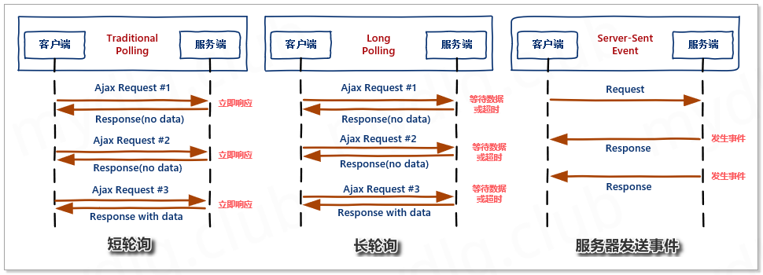
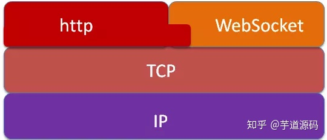

# 概念介绍

[WebSocket 详解教程 - 静默虚空 - 博客园 (cnblogs.com)](https://www.cnblogs.com/jingmoxukong/p/7755643.html)

[SpringBoot 实现 Websocket 通信详解 | 超级小豆丁 (mydlq.club)](http://www.mydlq.club/article/86/#一websocket-简介)

## WebSocket 是什么

[WebSocket](http://websocket.org/) 是一种网络通信协议。[RFC6455](https://tools.ietf.org/html/rfc6455) 定义了它的通信标准。

WebSocket 是 HTML5 开始提供的一种在单个 TCP 连接上进行全双工通讯的协议。


## 为什么需要WebSocket 

了解计算机网络协议的人，应该都知道：**HTTP 协议是一种无状态的、无连接的、单向的应用层协议**。它采用了请求/响应模型。**通信请求只能由客户端发起，服务端对请求做出应答处理**。

这种通信模型有一个弊端：**HTTP 协议无法实现服务器主动向客户端发起消息**。

场景："聊天室"、"消息推送"、"股票信  息实时动态"等需求

这种单向请求的特点，注定了如果服务器有连续的状态变化，客户端要获知就非常麻烦。大多数 Web 应用程序将通过**频繁的异步 JavaScript 和 XML（AJAX）请求实现长轮询**。轮询的效率低，非常浪费资源（因为必须不停连接，或者 HTTP 连接始终打开）。

因此，工程师们一直在思考，有没有更好的方法。WebSocket 就是这样发明的。WebSocket 连接允许客户端和服务器之间进行**全双工通信**，以便任一方都可以通过建立的连接将数据推送到另一端。WebSocket 只需要**建立一次连接，就可以一直保持连接状态**。这相比于轮询方式的不停建立连接显然效率要大大提高。




## WebSocket 如何工作？

Web 浏览器和服务器都必须实现 WebSockets 协议来建立和维护连接。由于 WebSockets 连接长期存在，与典型的 HTTP 连接不同，对服务器有重要的影响。

基于多线程或多进程的服务器无法适用于 WebSockets，因为它旨在打开连接，尽可能快地处理请求，然后关闭连接。任何实际的 WebSockets 服务器端实现都需要一个异步服务器。

## 特点

[WebSocket 详解 - 知乎 (zhihu.com)](https://zhuanlan.zhihu.com/p/97883095)

（1）**建立在 TCP 协议之上**，服务器端的实现比较容易。

（2）与 HTTP 协议有着良好的兼容性。默认端口也是80和443，并且**握手阶段采用 HTTP 协议**，因此握手时不容易屏蔽，能通过各种 HTTP 代理服务器。

（3）数据格式比较轻量，性能开销小，通信高效。

（4）**可以发送文本，也可以发送二进制数据**。

（5）**没有同源限制**，客户端可以与任意服务器通信。

（6）**协议标识符是ws（如果加密，则为wss），服务器网址就是 URL**。

## WebSocket 和 HTTP 的关系

[理清 WebSocket 和 HTTP 的关系 - 知乎 (zhihu.com)](https://zhuanlan.zhihu.com/p/95622141)

基本上但凡提到WebSocket和HTTP的关系都会有以下两条：

1. WebSocket和HTTP都是基于TCP协议的两个不同的协议
2. WebSocket依赖于HTTP连接

作为结论性的总结，直接了当，但是我需要更多的实现细节来解释上述结论。因为都是基于TCP的两个独立的协议，WebSocket按理说可以**和HTTP没有关系**，所以这里面包含两个问题：

1. WebSocket依赖于HTTP连接，那么它如何从连接的HTTP协议转化为WebSocket协议？
2. WebSocket为什么要依赖于HTTP协议的连接？

### 问题一

幸运的是，第一个问题的答案很容易找到。

每个WebSocket连接都始于一个HTTP请求。具体来说，WebSocket协议在第一次握手连接时，通过HTTP协议在传送WebSocket支持的版本号，协议的字版本号，原始地址，主机地址等等一些列字段给服务器端：

```text
GET /chat HTTP/1.1
Host: server.example.com
Upgrade: websocket
Connection: Upgrade
Sec-WebSocket-Key:dGhlIHNhbXBsZSBub25jZQ==
Origin: http://example.com
Sec-WebSocket-Version: 13
```

注意，关键的地方是，这里面有个Upgrade首部，用来把当前的HTTP请求升级到WebSocket协议，这是HTTP协议本身的内容，是为了扩展支持其他的通讯协议。如果服务器支持新的协议，则必须返回101：

```text
HTTP/1.1 101 Switching Protocols
Upgrade: websocket
Connection: Upgrade
Sec-WebSocket-Accept:s3pPLMBiTxaQ9kYGzzhZRbK+xOo=
```

至此，HTTP请求物尽其用，如果成功出发onopen事件，否则触发onerror事件，后面的传输则不再依赖HTTP协议。总结一下，这张图比较贴切：



### 问题二

经过学习和理解，我认为有两点：

第一，WebSocket设计上就是天生为HTTP增强通信（全双工通信等），所以在HTTP协议连接的基础上是很自然的一件事，并因此而能获得HTTP的诸多便利。第二，这诸多便利中有一条很重要，基于HTTP连接将获得最大的一个兼容支持，比如即使服务器不支持WebSocket也能建立HTTP通信，只不过返回的是onerror而已，这显然比服务器无响应要好的多。

# WebSocket 连接流程

**(1)、客户端先用带有 Upgrade:Websocket 请求头的 HTTP 请求，向服务器端发起连接请求，实现握手(HandShake)。**

客户端 **HTTP 请求**的 Header 头信息如下：

```
Connection: Upgrade
Sec-WebSocket-Extensions: permessage-deflate; client_max_window_bits
Sec-WebSocket-Key: IRQYhWINfX5Fh1zdocDl6Q==
Sec-WebSocket-Version: 13
Upgrade: websocket
```

- **Connection：** Upgrade 表示要升级协议。
- **Upgrade：** Websocket 要升级协议到 websocket 协议。
- **Sec-WebSocket-Extensions：** 表示客户端所希望执行的扩展(如消息压缩插件)。
- **Sec-WebSocket-Key：** 主要用于WebSocket协议的校验，对应服务端响应头的 Sec-WebSocket-Accept。
- **Sec-WebSocket-Version：** 表示 websocket 的版本。如果服务端不支持该版本，需要返回一个Sec-WebSocket-Versionheader，里面包含服务端支持的版本号。

**(2)、握手成功后，由 HTTP 协议升级成 Websocket 协议，进行长连接通信，两端相互传递信息。**

```
Connection: upgrade
Sec-Websocket-Accept: TSF8/KitM+yYRbXmjclgl7DwbHk=
Upgrade: websocket
```

- **Connection：** Upgrade 表示要升级协议。
- **Upgrade：** Websocket 要升级协议到 websocket 协议。
- **Sec-Websocket-Accept：** 对应 Sec-WebSocket-Key 生成的值，主要是返回给客户端，让客户端对此值进行校验，证明服务端支持 WebSocket。

## WebSocket 中子协议支持

 WebSocket 确实指定了一种消息传递体系结构，但并不强制使用任何特定的消息传递协议。而且它是 TCP 上的一个非常薄的层，它将字节流转换为消息流（文本或二进制）仅此而已。由应用程序来解释消息的含义。

与 HTTP（它是应用程序级协议）不同，在 WebSocket 协议中，**传入消息中根本没有足够的信息供框架或容器知道如何路由或处理它**。因此，对于非常琐碎的应用程序而言 WebSocket 协议的级别可以说太低了。**可以做到的是引导在其上面再创建一层框架。这就相当于当今大多数 Web 应用程序使用的是 Web 框架，而不直接仅使用 Servlet API 进行编码一样**。

WebSocket RFC 定义了子协议的使用。在握手过程中，客户机和服务器可以使用头 Sec-WebSocket 协议商定子协议，即使不需要使用子协议，而是用更高的应用程序级协议，但应用程序仍需要选择客户端和服务器都可以理解的消息格式。且该格式可以是自定义的、特定于框架的或标准的消息传递协议。

Spring 框架支持使用 STOMP，这是一个简单的消息传递协议，最初创建用于脚本语言，框架灵感来自 HTTP。STOMP 被广泛支持，非常适合在 WebSocket 和 web 上使用。


# 长连接的原理

[ WebSocket 是什么原理？为什么可以实现持久连接？ - 知乎 (zhihu.com)](https://www.zhihu.com/question/20215561)


# WebSocket 客户端

在客户端，没有必要为 WebSockets 使用 JavaScript 库。实现 WebSockets 的 Web **浏览器将通过 WebSockets 对象**公开所有必需的客户端功能（主要指支持 Html5 的浏览器）。

## 客户端 API

以下 API 用于创建 WebSocket 对象。

```js
var Socket = new WebSocket(url, [protocol] );
```

以上代码中的第一个参数 url, 指定连接的 URL。第二个参数 protocol 是可选的，指定了可接受的子协议。

### WebSocket 属性

以下是 WebSocket 对象的属性。假定我们使用了以上代码创建了 Socket 对象：

| 属性                  | 描述                                                         |
| --------------------- | ------------------------------------------------------------ |
| Socket.readyState     | 只读属性 **readyState** 表示连接状态，可以是以下值：0 - 表示连接尚未建立。1 - 表示连接已建立，可以进行通信。2 - 表示连接正在进行关闭。3 - 表示连接已经关闭或者连接不能打开。 |
| Socket.bufferedAmount | 只读属性 **bufferedAmount** 已被 send() 放入正在队列中等待传输，但是还没有发出的 UTF-8 文本字节数。 |

### WebSocket 事件

以下是 WebSocket 对象的相关事件。假定我们使用了以上代码创建了 Socket 对象：

| 事件    | 事件处理程序     | 描述                       |
| ------- | ---------------- | -------------------------- |
| open    | Socket.onopen    | 连接建立时触发             |
| message | Socket.onmessage | 客户端接收服务端数据时触发 |
| error   | Socket.onerror   | 通信发生错误时触发         |
| close   | Socket.onclose   | 连接关闭时触发             |

### WebSocket 方法

以下是 WebSocket 对象的相关方法。假定我们使用了以上代码创建了 Socket 对象：

| 方法           | 描述             |
| -------------- | ---------------- |
| Socket.send()  | 使用连接发送数据 |
| Socket.close() | 关闭连接         |

**示例**

```js
// 初始化一个 WebSocket 对象
var ws = new WebSocket('ws://localhost:9998/echo');

// 建立 web socket 连接成功触发事件
ws.onopen = function() {
  // 使用 send() 方法发送数据
  ws.send('发送数据');
  alert('数据发送中...');
};

// 接收服务端数据时触发事件
ws.onmessage = function(evt) {
  var received_msg = evt.data;
  alert('数据已接收...');
};

// 断开 web socket 连接成功触发事件
ws.onclose = function() {
  alert('连接已关闭...');
};
```

# WebSocket 服务端

WebSocket 在服务端的实现非常丰富。Node.js、Java、C++、Python 等多种语言都有自己的解决方案。

以下，介绍我在学习 WebSocket 过程中接触过的 WebSocket 服务端解决方案。

## Node.js

常用的 Node 实现有以下三种。

- [µWebSockets](https://github.com/uWebSockets/uWebSockets)
- [Socket.IO](http://socket.io/)
- [WebSocket-Node](https://github.com/theturtle32/WebSocket-Node)

## Java

Java 的 web 一般都依托于 servlet 容器。

我使用过的 servlet 容器有：Tomcat、Jetty、Resin。其中 Tomcat7、Jetty7 及以上版本均开始支持 WebSocket（推荐较新的版本，因为随着版本的更迭，对 WebSocket 的支持可能有变更）。

此外，Spring 框架对 WebSocket 也提供了支持。

虽然，以上应用对于 WebSocket 都有各自的实现。但是，它们都遵循[RFC6455](https://tools.ietf.org/html/rfc6455) 的通信标准，并且 Java API 统一遵循 [JSR 356 - JavaTM API for WebSocket ](http://www.jcp.org/en/jsr/detail?id=356)规范。所以，在实际编码中，API 差异不大。

### Spring

Spring 对于 WebSocket 的支持基于下面的 jar 包：

```xml
<dependency>
  <groupId>org.springframework</groupId>
  <artifactId>spring-websocket</artifactId>
  <version>${spring.version}</version>
</dependency>
```

在 Spring 实现 WebSocket 服务器大概分为以下几步：

**创建 WebSocket 处理器**

扩展 `TextWebSocketHandler` 或 `BinaryWebSocketHandler` ，你可以覆写指定的方法。Spring 在收到 WebSocket 事件时，会自动调用事件对应的方法。

```java
import org.springframework.web.socket.WebSocketHandler;
import org.springframework.web.socket.WebSocketSession;
import org.springframework.web.socket.TextMessage;

public class MyHandler extends TextWebSocketHandler {

    @Override
    public void handleTextMessage(WebSocketSession session, TextMessage message) {
        // ...
    }

}
```

`WebSocketHandler` 源码如下，这意味着你的处理器大概可以处理哪些 WebSocket 事件：

```java
public interface WebSocketHandler {

   /**
    * 建立连接后触发的回调
    */
   void afterConnectionEstablished(WebSocketSession session) throws Exception;

   /**
    * 收到消息时触发的回调
    */
   void handleMessage(WebSocketSession session, WebSocketMessage<?> message) throws Exception;

   /**
    * 传输消息出错时触发的回调
    */
   void handleTransportError(WebSocketSession session, Throwable exception) throws Exception;

   /**
    * 断开连接后触发的回调
    */
   void afterConnectionClosed(WebSocketSession session, CloseStatus closeStatus) throws Exception;

   /**
    * 是否处理分片消息
    */
   boolean supportsPartialMessages();

}
```

**配置 WebSocket**

配置有两种方式：注解和 xml 。其作用就是将 WebSocket 处理器添加到注册中心。

```java
import org.springframework.web.socket.config.annotation.EnableWebSocket;
import org.springframework.web.socket.config.annotation.WebSocketConfigurer;
import org.springframework.web.socket.config.annotation.WebSocketHandlerRegistry;

@Configuration
@EnableWebSocket
public class WebSocketConfig implements WebSocketConfigurer {

    @Override
    public void registerWebSocketHandlers(WebSocketHandlerRegistry registry) {
        registry.addHandler(myHandler(), "/myHandler");
    }

    @Bean
    public WebSocketHandler myHandler() {
        return new MyHandler();
    }

}
```

xml 方式:

```xml
<beans xmlns="http://www.springframework.org/schema/beans"
    xmlns:xsi="http://www.w3.org/2001/XMLSchema-instance"
    xmlns:websocket="http://www.springframework.org/schema/websocket"
    xsi:schemaLocation="
        http://www.springframework.org/schema/beans
        http://www.springframework.org/schema/beans/spring-beans.xsd
        http://www.springframework.org/schema/websocket
        http://www.springframework.org/schema/websocket/spring-websocket.xsd">

    <websocket:handlers>
        <websocket:mapping path="/myHandler" handler="myHandler"/>
    </websocket:handlers>

    <bean id="myHandler" class="org.springframework.samples.MyHandler"/>

</beans>
```

更多配置细节可以参考：([Web on Servlet Stack (spring.io)](https://docs.spring.io/spring-framework/docs/current/reference/html/web.html#websocket)

### javax.websocket

如果不想使用 Spring 框架的 WebSocket API，你也可以选择基本的 javax.websocket。

首先，需要引入 API jar 包。

```xml
<!-- To write basic javax.websocket against -->
<dependency>
    <groupId>javax.websocket</groupId>
    <artifactId>javax.websocket-api</artifactId>
    <version>1.0</version>
</dependency>
```

如果使用嵌入式 jetty，你还需要引入它的实现包：

```xml
<!-- To run javax.websocket in embedded server -->
<dependency>
    <groupId>org.eclipse.jetty.websocket</groupId>
    <artifactId>javax-websocket-server-impl</artifactId>
    <version>${jetty-version}</version>
</dependency>
<!-- To run javax.websocket client -->
<dependency>
    <groupId>org.eclipse.jetty.websocket</groupId>
    <artifactId>javax-websocket-client-impl</artifactId>
    <version>${jetty-version}</version>
</dependency>
```

**@ServerEndpoint**

这个注解用来标记一个类是 WebSocket 的处理器。

然后，你可以在这个类中使用下面的注解来表明所修饰的方法是触发事件的回调

```java
// 收到消息触发事件
@OnMessage
public void onMessage(String message, Session session) throws IOException, InterruptedException {
    ...
}

// 打开连接触发事件
@OnOpen
public void onOpen(Session session, EndpointConfig config, @PathParam("id") String id) {
    ...
}

// 关闭连接触发事件
@OnClose
public void onClose(Session session, CloseReason closeReason) {
    ...
}

// 传输消息错误触发事件
@OnError
public void onError(Throwable error) {
    ...
}
```

**ServerEndpointConfig.Configurator**

编写完处理器，你需要扩展 ServerEndpointConfig.Configurator 类完成配置：

```java
public class WebSocketServerConfigurator extends ServerEndpointConfig.Configurator {
    @Override
    public void modifyHandshake(ServerEndpointConfig sec, HandshakeRequest request, HandshakeResponse response) {
        HttpSession httpSession = (HttpSession) request.getHttpSession();
        sec.getUserProperties().put(HttpSession.class.getName(), httpSession);
    }
}
```

然后就没有然后了，就是这么简单。


# WebSocket 代理

如果把 WebSocket 的通信看成是电话连接，Nginx 的角色则像是电话接线员，负责将发起电话连接的电话转接到指定的客服。

Nginx 从 [1.3 版](http://nginx.com/blog/websocket-nginx/)开始正式支持 WebSocket 代理。如果你的 web 应用使用了代理服务器 Nginx，那么你还需要为 Nginx 做一些配置，使得它开启 WebSocket 代理功能。

以下为参考配置：

```nginx
server {
  # this section is specific to the WebSockets proxying
  location /socket.io {
    proxy_pass http://app_server_wsgiapp/socket.io;
    proxy_redirect off;

    proxy_set_header Host $host;
    proxy_set_header X-Real-IP $remote_addr;
    proxy_set_header X-Forwarded-For $proxy_add_x_forwarded_for;

    proxy_http_version 1.1;
    proxy_set_header Upgrade $http_upgrade;
    proxy_set_header Connection "upgrade";
    proxy_read_timeout 600;
  }
}
```

更多配置细节可以参考：[Nginx 官方的 websocket 文档](http://nginx.org/en/docs/http/websocket.html)


# WebSocket协议标准

[rfc6455 (ietf.org)](https://datatracker.ietf.org/doc/html/rfc6455)


# WebSocket和Stomp协议

[WebSocket和Stomp协议 - 简书 (jianshu.com)](https://www.jianshu.com/p/db21502518b9)

## STOMP传输协议介绍

`STOMP` 中文为: 面向消息的简单文本协议

`websocket`定义了两种传输信息类型:**文本信息和二进制信息**。类型虽然被确定，但是他们的传输体是没有规定的。所以，需要用一种简单的文本传输类型来规定传输内容，它可以作为通讯中的文本传输协议。

STOMP是基于帧的协议，客户端和服务器使用STOMP帧流通讯

一个STOMP客户端是一个可以以两种模式运行的用户代理，可能是同时运行两种模式。

- 作为生产者，通过`SEND`框架将消息发送给服务器的某个服务
- 作为消费者，通过`SUBSCRIBE`制定一个目标服务，通过`MESSAGE`框架，从服务器接收消息。

例如：

```
COMMAND
header1:value1
header2:value2

Body^@
```

注：帧以commnand字符串开始，以EOL结束。其中包括可选回车符（13字节），紧接着是换行符（10字节）。command下面是0个或多个`<key>:<value>`格式的header条目, 每个条目由EOL结束。一个空白行（即额外EOL）表示header结束和body开始。body连接着NULL字节。本文档中的例子将使用`^@`代表NULL字节。NULL字节可以选择跟多个EOLs。欲了解更多关于STOMP帧的详细信息，请参阅[STOMP1.2协议规范](https://stomp.github.io/stomp-specification-1.2.html)。

### STOMP 1.2 协议

`STOMP 1.2` clients 必须设置以下headers:

1.`accept-version:` clients支持的STOMP的版本号。

2.`host:`client希望连接的虚拟主机名字

可选择设置以下headers:

> 1.`login:` 用于在server验证的用户id

> 2.`passcode:` 用于在server验证的密码

> 3.`heart-beat:` 心跳设置

`注：`STOMP协议大小写敏感

### 常用Command

- CONNECT
- CONNECTED
- SEND
- SUBSRIBE
- UNSUBSRIBE
- BEGIN
- COMMIT
- ABORT
- ACK
- NACK
- DISCONNECT

#### CONNECT

STOMP客户端通过初始化一个数据流或者TCP链接发送CONNECT帧到服务端，例如：

```
CONNECT

accept-version:1.2
host:stomp.test

^@
```

#### CONNECTED

如果服务端接收了链接意图，它回回复一个CONNECTED帧：

```
CONNECTED

version:1.2

^@
```

正常链接后客户端和服务端就可以正常收发信息了。

#### SEND

客户端主动发送消息到服务器，例如：

```
SEND
destination:/queue/a
content-type:text/plain

I am send body
^@
```

**注：** 必须包含`destination`目标地址，如果没有`content-type`,默认表示传递的二进制.

#### SUBSCRIBE

客户端注册给定的目的地，被订阅的目的地收到的任何消息将通过`MESSAGE` Frame发送给client。 `ACK` 控制着确认模式。

```
SUBSCRIBE
id:0
destination:/queue/foo
ack:client

^@
```

`id:`一个单连接可以对应多个开放的servers订阅,这个id用来客户端和服务端处理与订阅消息和取消订阅相关的动作。

`ack:`可用的值有`auto`, `client`,`client-individual`, 默认为`auto`.

当`ack`为`auto`时，client收到server发来的消息后不需要回复`ACK帧`.server假定消息发出去后client就已经收到。这种模式下可能导致服务端向客户端发送的消息丢失

当`ack`为`client`时, 客户端收到服务端信息之后必须回复`ACK帧`。如果在收到客户端回复的ACK之前连接断开，服务端会认为这个消息没有被处理而改发给其他客户端。客户端回复的`ACK`会被当做累加的处理。这意味着对信息的确认操作不仅仅是确认了这单个的消息，还确认了这个订阅之前发送的所有消息（即接收到一个确认消息就会把之前的消息一起确认掉，批量操作）。

由于client不能处理某些消息，所以client应该发送`NACK帧`去告诉server它不能消费这些消息。

当`ack`模式是`client-individual`，确认操作就跟client模式一样，除了`ACK`和`NACK`不是累加的。这意味着当后来的一个消息得到`ACK`或`NACK`之后，之前的那个消息没有被`ACK`或`NACK`，它需要单独的确认。

#### UNSUBSRIBE

UNSUBSCRIBE用来移除一个已经存在订阅，一旦一个订阅被从连接中取消，那么客户端就再也不会收到来自这个订阅的消息。

```
UNSUBSCRIBE

id:0

^@
```

由于一个连接可以添加多个服务端的订阅，所以id头是`UNSUBSCRIBE`必须包含的，用来唯一标示要取消的是哪一个订阅。`id`的值必须是一个已经存在的订阅的标识。

#### ACK

ACK是用来在`client`和`client-individual`模式下确认已经收到一个订阅消息的操作。在上述模式下任何订阅消息都被认为是没有被处理的，除非客户端通过回复ACK确认。


```css
ACK

id:12345

transaction:tx1

^@
```

ACK中必须包含一个id头，头域内容来自对应的需要确认的MESSAGE的ack头。可以选择的指定一个`transaction`头，标示这个消息确认动作是这个事务内容的一部分。

#### NACK

NACK是ACK的反向，它告诉服务端客户端没有处理该消息。服务端可以选择性的处理该消息，重新发送到另一个客户端或者丢弃它或者把他放到无效消息队列中记录。

`NACK`包含和`ACK`相同的头信息：`id`（必须）和`transaction`（非必须）。

#### BEGIN

BEGIN用于开启一个事务-`transaction`。这种情况下的事务适用于发送消息和确认已经收到的消息。在一个事务期间，任何发送和确认的动作都会被当做事务的一个原子操作。


```css
BEGIN

transaction:tx1

^@
```

帧中`transaction`头是必须的，并且`transaction`的标示会被用在`SEND`、`COMMIT`、`ABORT`、`ACK`和`NACK`中，使之与该事务绑定。同一个链接中的不同事务必须使用不同的标示。
当客户端发送一个`DISCONNECT`或者`TCP`链接由于任何原因断开时，任何打开的但是还没有被提交的事务都会被默认的立即中断。

#### COMMIT

用来提交一个事务到处理队列中,帧中的`transaction`头是必须得，用以标示是哪个事务被提交。


```css
COMMIT

transaction:tx1

^@
```

#### ABORT

`ABORT`用于中止正在执行的事务,帧中的`transaction`头是必须得，用以标示是哪个事务被终止。


```css
ABORT

transaction:tx1

^@
```

#### DISCONNECT

客户端可以通过`DISCONNECT`帧表示正常断开链接

#### MESSAGE

`MESSAGE`用于传输从服务端订阅的消息到客户端。

`MESSAGE`中必须包含`destionation`头，用以表示这个消息应该发送的目标。如果这个消息被使用STOMP发送，那么这个`destionation`应该与相应的`SEND帧`中的目标一样。

`MESSAGE`中必须包含`message-id`头，用来唯一表示发送的是哪一个消息，以及`subscription`头用来表示接受这个消息的订阅的唯一标示。

如果收到的订阅消息明确表示需要确认，那么`MESSAGE`中应该包含一个任意值的ack头，这个值被用来在回复确认时标示这条信息。

`MESSAGE`如果有body内容，则必须包含`content-length`和`content-type`头。


```cpp
MESSAGE

content-length:100

content-type:text/plain

destination:/queue/a

message-id:007

subscription:0

Hello queue a

^@
```

#### ERROR

如果连接过程中出现什么错误，服务端就会发送`ERROR`。在这种情况下，服务端发出`ERROR`之后必须马上断开连接。

#### RECEIPT

每当服务端收到来自客户端的需要`receipt`的帧时发送给客户端

