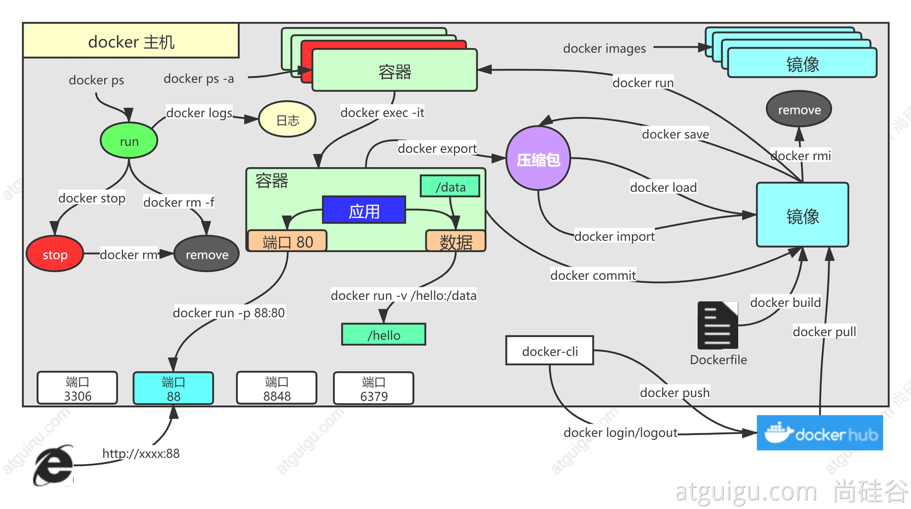

# Docker基本概念

## 1、解决的问题

### 统一标准

●应用构建 
○Java、C++、JavaScript
○打成软件包
○.exe
○docker build ....   镜像
●应用分享
○所有软件的镜像放到一个指定地方  docker hub
○安卓，应用市场
●应用运行
○统一标准的 **镜像**
○docker run
●.......

> 容器化

### 资源隔离

●cpu、memory资源隔离与限制
●访问设备隔离与限制
●网络隔离与限制
●用户、用户组隔离限制
●......

## 架构


●Docker_Host：
	○安装Docker的主机
●Docker Daemon：
	○运行在Docker主机上的Docker后台进程
●Client：
	○操作Docker主机的客户端（命令行、UI等）
●Registry：
	○镜像仓库
	○Docker Hub
●Images：
	○镜像，带环境打包好的程序，可以直接启动运行
●Containers：
	○容器，由镜像启动起来正在运行中的程序

交互逻辑

> 装好Docker，然后去 软件市场 寻找镜像，下载并运行，查看容器状态日志等排错

## 安装

### 1、centos下安装docker

其他系统参照如下文档
https://docs.docker.com/engine/install/centos/

```bash
sudo yum remove docker \
                  docker-client \
                  docker-client-latest \
                  docker-common \
                  docker-latest \
                  docker-latest-logrotate \
                  docker-logrotate \
                  docker-engine
```

### 2、配置yum源

```bash
sudo yum install -y yum-utils
sudo yum-config-manager \
--add-repo \
http://mirrors.aliyun.com/docker-ce/linux/centos/docker-ce.repo
```

### 3、安装docker

```bash
sudo yum install -y docker-ce docker-ce-cli containerd.io


#以下是在安装k8s的时候使用
yum install -y docker-ce-20.10.7 docker-ce-cli-20.10.7  containerd.io-1.4.6
```

### 4、启动

```bash
systemctl enable docker --now
```

### 5、配置加速

这里额外添加了docker的生产环境核心配置cgroup

```bash
sudo mkdir -p /etc/docker
sudo tee /etc/docker/daemon.json <<-'EOF'
{
  "registry-mirrors": ["https://w3wz7xvh.mirror.aliyuncs.com"],
  "exec-opts": ["native.cgroupdriver=systemd"],
  "log-driver": "json-file",
  "log-opts": {
    "max-size": "100m"
  },
  "storage-driver": "overlay2"
}
EOF
sudo systemctl daemon-reload
sudo systemctl restart docker
```

# Docker命令实战

## 常用命令



## 基础实战

### 1、找镜像

去[docker hub](http://hub.docker.com/)，找到nginx镜像

```bash
docker pull nginx  #下载最新版

镜像名:版本名（标签）

docker pull nginx:1.20.1


docker pull redis  #下载最新
docker pull redis:6.2.4

## 下载来的镜像都在本地
docker images  #查看所有镜像

redis = redis:latest

docker rmi 镜像名:版本号/镜像id
```

### 2、启动容器

启动nginx应用容器，并映射88端口，测试的访问

```bash
docker run [OPTIONS] IMAGE [COMMAND] [ARG...]
【docker run  设置项   镜像名  】 镜像启动运行的命令（镜像里面默认有的，一般不会写）

# -d：后台运行
# --restart=always: 开机自启
docker run --name=mynginx   -d  --restart=always -p  88:80   nginx


# 查看正在运行的容器
docker ps
# 查看所有
docker ps -a
# 删除停止的容器
docker rm  容器id/名字
docker rm -f mynginx   #强制删除正在运行中的

#停止容器
docker stop 容器id/名字
#再次启动
docker start 容器id/名字

#应用开机自启
docker update 容器id/名字 --restart=always
```

### 3、修改容器内容

修改默认的index.html 页面

#### 1、进容器内部修改

```bash
# 进入容器内部的系统，修改容器内容
docker exec -it 容器id  /bin/bash
```

