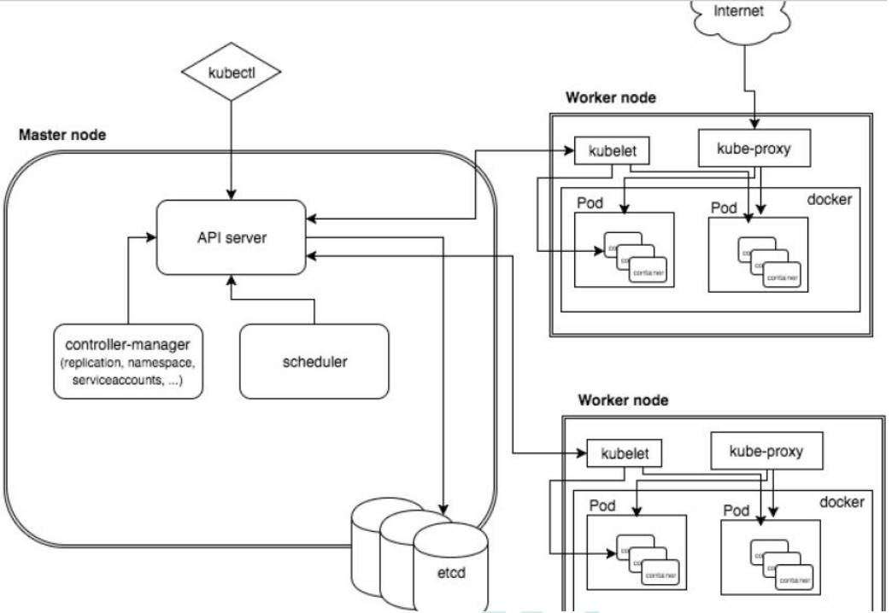
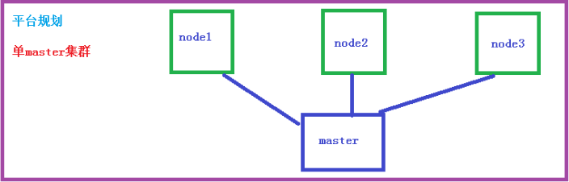
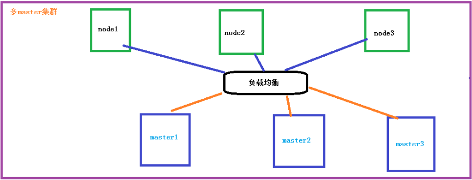
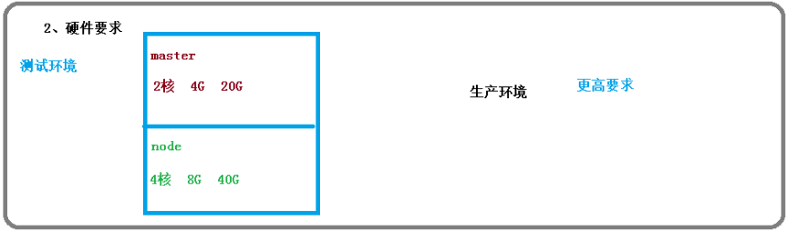
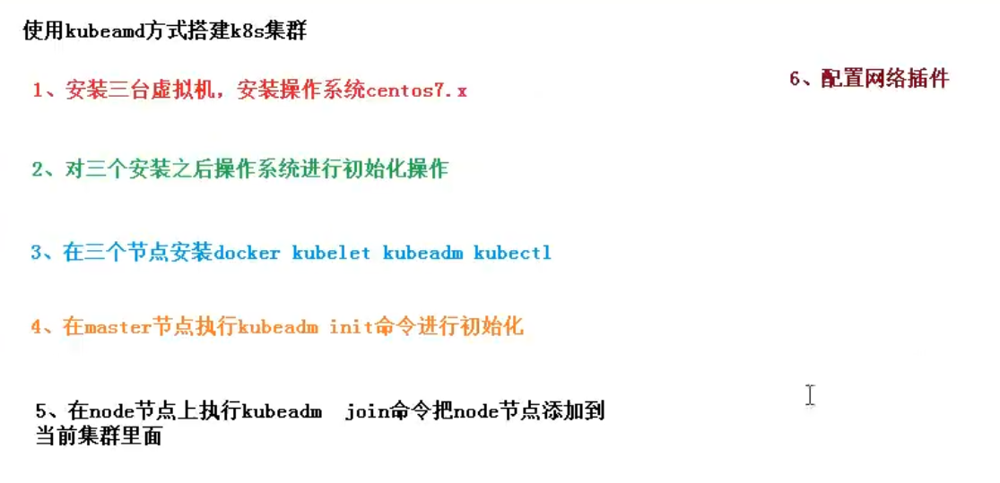

# kubernetes 概述

前置知识：Linux操作、Docker

​		kubernetes，简称 K8s，是用 8 代替 8 个字符“ubernete”而成的缩写。是一个开源
的，用于管理云平台中多个主机上的容器化的应用，Kubernetes 的目标是让部署容器化的
应用简单并且高效（powerful）,Kubernetes 提供了应用部署，规划，更新，维护的一种
机制。

- 2014年由谷歌开源的容器化集群管理系统
- 使用K8S进行容器化部署
- 利于应用的扩展
- 目标：部署容器化应用更加简洁高效

## kubernetes 功能和架构

### 特性

（1）**自动装箱**
基于容器对应用运行环境的资源配置要求自动部署应用容器

（2）**自我修复**(自愈能力)
当容器失败时，会对容器进行重启当所部署的 Node 节点有问题时，会对容器进行重新部署和重新调度。当容器未通过监控检查时，会关闭此容器直到容器正常运行时，才会对外提供服务

（3）**水平扩展**

通过简单的命令、用户 UI 界面或基于 CPU 等资源使用情况，对应用容器进行规模扩大
或规模剪裁
（4）**服务发现**
用户不需使用额外的服务发现机制，就能够基于 Kubernetes 自身能力实现服务发现和
负载均衡
（5）**滚动更新**
可以根据应用的变化，对应用容器运行的应用，进行一次性或批量式更新
（6）**版本回退**
可以根据应用部署情况，对应用容器运行的应用，进行历史版本即时回退
（7）**密钥和配置管理**
在不需要重新构建镜像的情况下，可以部署和更新密钥和应用配置，类似热部署。
（8）**存储编排**
自动实现存储系统挂载及应用，特别对有状态应用实现数据持久化非常重要
存储系统可以来自于本地目录、网络存储(NFS、Gluster、Ceph 等)、公共云存储服务
（9）**批处理**
提供一次性任务，定时任务；满足批量数据处理和分析的场景	


### 应用部署架构分类

(1) 无中心节点架构
GlusterFS
(2) 有中心节点架构
HDFS
K8S

### k8s 集群架构



**节点角色功能**

**Master Node**
k8s 集群控制节点，对集群进行调度管理，接受集群外用户去集群操作请求；
Master Node 组成:

-  API Server 集群统一入口，以restful方式，交给etcd存储

- Scheduler 节点调度，选择node节点应用部署

- ClusterState Store（ETCD 数据库）用于保存集群相关的数据

- Controller MangerServer  处理集群中常规后台任务，一个资源对应一个控制器

**Worker Node**
集群工作节点，运行用户业务应用容器；

组成：

- kubelet   master派到node节点代表，管理本机容器
- kube proxy   提供网络代理，提供负载均衡
- ContainerRuntime；

### 核心概念

- pod
  - 最小部署单元
  - 一组容器的集合
  - 共享网络
  - 生命周期是短暂的
- controller
  - 确保预期的pod副本数量
  - 无状态应用部署
  - 有状态应用部署
  - 确保所有的node运行同一个pod
  - 一次性任务和定时任务
- service
  - 定义一组pod的访问规则

## 集群搭建










# kubernetes 集群搭建(kubeadm 方式)

目前生产部署 Kubernetes 集群主要有两种方式：
（1）kubeadm
Kubeadm 是一个 K8s 部署工具，提供 kubeadm init 和 kubeadm join，用于快速部
署 Kubernetes 集群。
官方地址：https://kubernetes.io/docs/reference/setup-tools/kubeadm/kubeadm/
（2）二进制包
从 github 下载发行版的二进制包，手动部署每个组件，组成 Kubernetes 集群。

k8s官方还有在线集群节点，用于学习，可交互式搭建k8s

https://kubernetes.io/docs/tutorials/kubernetes-basics/create-cluster/cluster-interactive/

Kubeadm 降低部署门槛，但屏蔽了很多细节，遇到问题很难排查。如果想更容易可控，推荐使用二进制包部署 Kubernetes 集群，虽然手动部署麻烦点，期间可以学习很多工作原理，也利于后期维护。

## kubeadm 部署方式介绍

kubeadm 是官方社区推出的一个用于快速部署 kubernetes 集群的工具，这个工具能通
过两条指令完成一个 kubernetes 集群的部署：
第一、创建一个 Master 节点 kubeadm init
第二， 将 Node 节点加入到当前集群中 $ kubeadm join <Master 节点的 IP 和端口 >

**安装要求**

- 一台或多台机器，操作系统 CentOS7.x-86_x64
- 硬件配置：2GB 或更多 RAM，2 个 CPU 或更多 CPU，硬盘 30GB 或更多
- 集群中所有机器之间网络互通
- 可以访问外网，需要拉取镜像
- 禁止 swap 分区

**最终目标**

（1） 在所有节点上安装 Docker 和 kubeadm

（2）部署 Kubernetes Master

（3）部署容器网络插件

（4）部署 Kubernetes Node，将节点加入 Kubernetes 集群中

（5）部署 Dashboard Web 页面，可视化查看 Kubernetes 资源




# kubernetes 集群搭建(二进制方式)

方便起见，这次就搭建2个节点，1主1从

## 安装要求

在开始之前，部署 Kubernetes 集群机器需要满足以下几个条件：

（1）一台或多台机器，操作系统 CentOS7.x-86_x64

（2）硬件配置：2GB 或更多 RAM，2 个 CPU 或更多 CPU，硬盘 30GB 或更多

（3）集群中所有机器之间网络互通

（4）可以访问外网，需要拉取镜像，如果服务器不能上网，需要提前下载镜像并导入节点

（5）禁止 swap 分区

## 准备环境

（1）软件环境：

| 软件       | 版本                   |
| ---------- | ---------------------- |
| 操作系统   | CentOS7.8_x64 （mini） |
| Docker     | 19-ce                  |
| Kubernetes | 1.19                   |

（2）服务器规划：

| 角色       | IP            | 组件                                                         |
| ---------- | ------------- | ------------------------------------------------------------ |
| k8s-master | 192.168.31.71 | kube-apiserver，kube-controller-manager，kube-scheduler，etcd |
| k8s-node1  | 192.168.31.72 | kubelet，kube-proxy，docker etcd                             |
| k8s-node2  | 192.168.31.73 | kubelet，kube-proxy，docker，etcd                            |

## 操作系统初始化配置

```bash
# 关闭防火墙
systemctl stop firewalld #临时
systemctl disable firewalld #永久

# 关闭 selinux
sed -i 's/enforcing/disabled/' /etc/selinux/config # 永久
setenforce 0 # 临时

# 关闭 swap
swapoff -a # 临时
sed -ri 's/.*swap.*/#&/' /etc/fstab  # 永久

# 根据规划设置主机名
hostnamectl set-hostname <hostname>

# 在 master 添加 hosts
cat >> /etc/hosts << EOF
192.168.44.147 m1
192.168.44.148 n1
EOF

# 将桥接的 IPv4 流量传递到 iptables 的链
cat > /etc/sysctl.d/k8s.conf << EOF
net.bridge.bridge-nf-call-ip6tables = 1
net.bridge.bridge-nf-call-iptables = 1
EOF
sysctl --system # 生效

# 时间同步 或者时区都改到上海就行
yum install ntpdate -y
ntpdate time.windows.com
```

## 部署 Etcd 集群

​		Etcd 是一个分布式键值存储系统，Kubernetes 使用 Etcd 进行数据存储，所以先准备
一个 Etcd 数据库，为解决 Etcd 单点故障，应采用集群方式部署，这里使用 3 台组建集
群，可容忍 1 台机器故障，当然，你也可以使用 5 台组建集群，可容忍 2 台机器故障。

| 节点名称 | IP            |
| -------- | ------------- |
| etcd-1   | 192.168.31.71 |
| etcd-2   | 192.168.31.72 |
| etcd-3   | 192.168.31.73 |

注：为了节省机器，这里与 K8s 节点机器复用。也可以独立于 k8s 集群之外部署，只要
apiserver 能连接到就行。

### 准备 cfssl 证书生成工具

​		cfssl 是一个开源的证书管理工具，使用 json 文件生成证书，相比 openssl 更方便使用。
找任意一台服务器操作，这里用 Master 节点。

```bash
wget https://pkg.cfssl.org/R1.2/cfssl_linux-amd64
wget https://pkg.cfssl.org/R1.2/cfssljson_linux-amd64
wget https://pkg.cfssl.org/R1.2/cfssl-certinfo_linux-amd64
chmod +x cfssl_linux-amd64 cfssljson_linux-amd64 cfssl-certinfo_linux-amd64
mv cfssl_linux-amd64 /usr/local/bin/cfssl
mv cfssljson_linux-amd64 /usr/local/bin/cfssljson
mv cfssl-certinfo_linux-amd64 /usr/bin/cfssl-certinfo
```

### 生成 Etcd 证书

（1）自签证书颁发机构（CA）

创建工作目录：

```bash
mkdir -p ~/TLS/{etcd,k8s}
cd TLS/etcd
```

自签 CA：