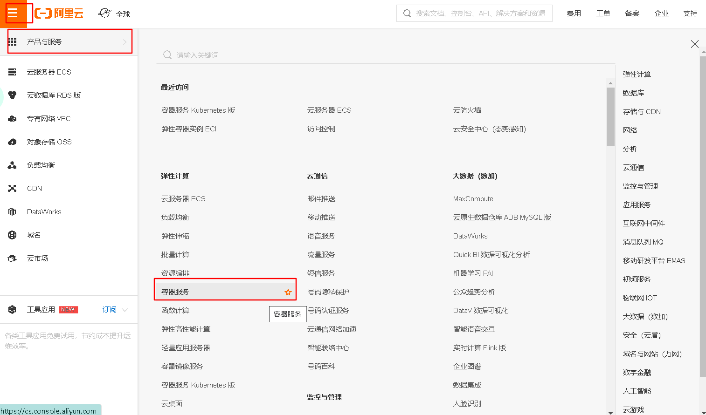
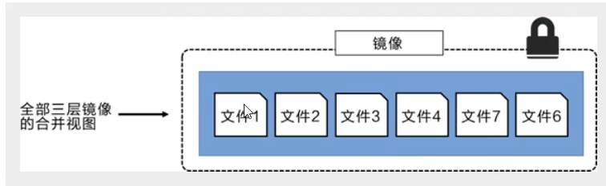

# Docker概述

课程

https://www.bilibili.com/video/BV1og4y1q7M4

## 为什么会出现？

开发-上线，两套环境，配置

发布一个项目（jar+(Redis,MySQL,jdk,ES)）项目能不能带上环境安装包

Java跨平台，环境不跨平台

Docker的解决方案

java--jar(环境)---打包项目带上环境（镜像）--Dockers仓库--下载我们发布的镜像，直接运行即可


Docker思想来源集装箱

JRE--多个应用（端口冲突）--原来都是交叉的

**隔离机制**。打包装箱。每个箱子互相隔离

## Docker历史

2010年，dotCloud   pass云计算服务

容器化技术，命名为Docker

Docker刚刚诞生是，没有引起行业注意，活不下去，开源

2013年开源，越来越多的人发现了Docker优点，每个月都会更新一个版本

2014年Docker1.0发布

为什么这么火？相对于VM虚拟机，它十分轻巧

在容器技术出来之前，都是用虚拟机技术，比如VMware，和真实电脑最接近但是笨重

虚拟机属于虚拟化技术，Docker容器技术也是一种虚拟化技术

```
VMware:Linux centos原生镜像（一个电脑） 隔离，需要开启多个虚拟机，几G，启动几分钟
Docker：隔离：镜像（最核心的环境4M）十分小巧，运行镜像就可以了，几M，启动几秒
```

现在，所有开发人员必须会Docker

用Go语言开发的

Docker官网https://www.docker.com/

Docker文档https://docs.docker.com/  超级详细

Docker仓库http://hub.docker.com/  

## Docker能干嘛

之前的虚拟机技术

缺点：资源占用多，冗余步骤多，启动慢


**容器化技术**

==容器化技术不是模拟的一个完整的操作系统==


不同：

- 传统虚拟机，虚拟出一套硬件，运行一个完整的操作系统，然后在这个操作系统上安装和运行软件
- 容器内的应用直接运行在宿主机的内容，容器是没有自己的内核的，也没有虚拟机的硬件，轻便了
- 每个容器间是相互隔离，每个容器内都有一个属于自己的文件系统，互不影响

## DevOps（开发，运维）

**应用更快捷的交付和部署**

- 传统：一堆帮助文档，安装程序
- Docker：打包镜像发布测试，一键运行

**更便捷的升级和扩缩容**

使用了Docker之后，部署应用就和搭积木一样

SpringBoot Redis Tomcat升级

**更简单的系统运维**

在容器化之后，开发，测试环境都是高度一致

**更高效的计算资源利用**

比如，1核2G可以运行几十个Redis

Docker是内核级别的虚拟化，可以在一个物理机上运行很多的容器示例，服务器性能可以被压榨到极致

# Docker安装

## Docker基本组成

客户端 								服务器				仓库


**镜像image：**

docker镜像好比是一个模板，可以通过这个模板来创建容器服务，tomcat镜像------>run---->tomcat01容器（提供服务器），通过这个进行可以创建多个容器（最终服务运行或者项目运行就是在容器中的）

**容器container：**

独立运行一个或一个组应用，通过镜像来创建

目前，可以把这个容器理解为一个简易的Linux系统

**仓库repository：**

仓库就是存放镜像的地方

仓库分为公有仓库和私有仓库

Docker Hub（默认是国外的，下载慢）

阿里云。。都有容器服务器（配置镜像加速）

## 安装Docker

### 环境准备

- 需要会一点点Linux基础
- Centos 7
- Xshell远程连接

Linux环境查看

```bash
uname -r#系统内核是3.10以上的
3.10.0-1127.13.1.el7.x86_64
```


```bash
[root@HSQ ~]# cat /etc/os-release # 系统版本
NAME="CentOS Linux"
VERSION="7 (Core)"
ID="centos"
ID_LIKE="rhel fedora"
VERSION_ID="7"
PRETTY_NAME="CentOS Linux 7 (Core)"
ANSI_COLOR="0;31"
CPE_NAME="cpe:/o:centos:centos:7"
HOME_URL="https://www.centos.org/"
BUG_REPORT_URL="https://bugs.centos.org/"

CENTOS_MANTISBT_PROJECT="CentOS-7"
CENTOS_MANTISBT_PROJECT_VERSION="7"
REDHAT_SUPPORT_PRODUCT="centos"
REDHAT_SUPPORT_PRODUCT_VERSION="7"
```

### 安装

```bash
#1.卸载旧版本
yum remove docker \
                  docker-client \
                  docker-client-latest \
                  docker-common \
                  docker-latest \
                  docker-latest-logrotate \
                  docker-logrotate \
                  docker-engine

# 2.需要的安装包
 yum install -y yum-utils

#3.设置镜像仓库
yum-config-manager \
    --add-repo \
    https://download.docker.com/linux/centos/docker-ce.repo# 默认是国外的，下载慢
# 推荐阿里云镜像
 yum-config-manager --add-repo http://mirrors.aliyun.com/docker-ce/linux/centos/docker-ce.repo
 #更新yum软件包索引
 yum makecache fast
 
#4.安装docker(docker服务，客户端，容器)
# docker-ce社区版 ee企业版
yum install docker-ce docker-ce-cli containerd.io

#5.启动docker
systemctl start docker
#6.使用docker查看是否安装成功
```


```bash
# 7.hello-world
docker run hello-world
```


```bash
#8.查看一下这个hello-world镜像
[root@HSQ ~]#docker images
REPOSITORY          TAG                 IMAGE ID            CREATED             SIZE
hello-world         latest              bf756fb1ae65        8 months ago        13.3kB
```

卸载Docker

```bash
#卸载依赖 删除资源
yum remove docker-ce docker-ce-cli containerd.io
rm -rf /var/lib/docker

#/var/lib/docker docker的默认工作路径
```

## 阿里云镜像加速

1.登录阿里云，找到容器服务



2.找到镜像加速


3.配置使用

```bash
sudo mkdir -p /etc/docker
sudo tee /etc/docker/daemon.json <<-'EOF'
{
  "registry-mirrors": ["https://w3wz7xvh.mirror.aliyuncs.com"]
}
EOF
sudo systemctl daemon-reload
sudo systemctl restart docker
```

## 回顾helloWorld流程


## 底层原理

Docker是怎么工作的？

Docker是一个Client-Server结构的系统，Docker的守护进程运行在主机上，通过Socket从客户端访问

DockerServer接收到Docker-Client的指令，就会执行这个命令


Docker为什么比虚拟机快，因为

Docker有着比虚拟机更少的抽象层

Docker利用的是宿主机的内核

所以，新建一个容器的时候，docker不需要像虚拟机一样重新加载一个操作系统内核，避免引导，虚拟机是加载Guest OS分钟级别的，而Docker是利用宿主机的操作系统，省略了这个复杂的过程，秒级


之后，学习完所有命令，再回过头来看这段理论，就很清晰

# Docker常用命令

## 帮助命令

```bash
docker version		# 显示docker版本信息
docker info			# 显示docker的系统信息，包括镜像和容器的数量
docker 命令 --help   # 帮助命令
```

帮助文档地址

https://docs.docker.com/

https://docs.docker.com/reference/

## 镜像命令

```bash
docker images 		 # 查看本地的镜像
docker images --help # 查看这条命令的帮助
```


```bash
[root@HSQ ~]# docker images
REPOSITORY          TAG                 IMAGE ID            CREATED             SIZE
hello-world         latest              bf756fb1ae65        8 months ago        13.3kB
# REPOSITORY 镜像的仓库原
# TAG 镜像的标签
# IMAGE ID 镜像的ID
# CREATED  镜像的创建时间
# SIZE 镜像的大小

#可选项
  -a, --all             # 列出所有镜像
  -q, --quiet           # 只显示镜像ID

```

### docker search搜索镜像

用命令和在网站上搜索是一样的https://hub.docker.com/

```bash
docker search mysql
#结果如下
NAME                              DESCRIPTION                                     STARS               OFFICIAL            AUTOMATED
mysql                             MySQL is a widely used, open-source relation…   9954                [OK]                
mariadb                           MariaDB is a community-developed fork of MyS…   3642                [OK]                
mysql/mysql-server                Optimized MySQL Server Docker images. Create…   725                                     [OK]
percona                           Percona Server is a fork of the MySQL relati…   508                 [OK]                
centos/mysql-57-centos7           MySQL 5.7 SQL database server                   83                     # 可选项，通过收藏来过滤
--filter=STARS=3000  搜索出来的镜像就是大于3000的
docker search mysql --filter=STARS=5000
NAME                DESCRIPTION                                     STARS               OFFICIAL            AUTOMATED
mysql               MySQL is a widely used, open-source relation…   9954                [OK]                

```

### docker pull 下载镜像

```bash
# 下载镜像 docker pull 镜像名[:tag] 
[root@HSQ ~]# docker pull mysql
Using default tag: latest   # 如果不写tag，默认就是latest，最新版
latest: Pulling from library/mysql
d121f8d1c412: Pull complete # 分层下载 docker images的核心 联合文件系统
f3cebc0b4691: Pull complete 
1862755a0b37: Pull complete 
489b44f3dbb4: Pull complete 
690874f836db: Pull complete 
baa8be383ffb: Pull complete 
55356608b4ac: Pull complete 
dd35ceccb6eb: Pull complete 
429b35712b19: Pull complete 
162d8291095c: Pull complete 
5e500ef7181b: Pull complete 
af7528e958b6: Pull complete 
Digest: sha256:e1bfe11693ed2052cb3b4e5fa356c65381129e87e38551c6cd6ec532ebe0e808 # 签名
Status: Downloaded newer image for mysql:latest
docker.io/library/mysql:latest # 真实地址

docker pull mysql # 等价于
docker pull mysql docker.io/library/mysql:latest 

#指定版本下载
[root@HSQ ~]# docker pull mysql:5.7
5.7: Pulling from library/mysql
d121f8d1c412: Already exists #上面已经有了，就共用了，不用下载，极大节省空间
f3cebc0b4691: Already exists 
1862755a0b37: Already exists 
489b44f3dbb4: Already exists 
690874f836db: Already exists 
baa8be383ffb: Already exists 
55356608b4ac: Already exists 
277d8f888368: Pull complete # 只需要下载这4个进行
21f2da6feb67: Pull complete 
2c98f818bcb9: Pull complete 
031b0a770162: Pull complete 
Digest: sha256:14fd47ec8724954b63d1a236d2299b8da25c9bbb8eacc739bb88038d82da4919
Status: Downloaded newer image for mysql:5.7
docker.io/library/mysql:5.7

```

### docker rmi删除镜像

rmi:    remove images

```bash
docker rmi -f 镜像id  			  #删除指定的镜像  -f强制删除
docker rmi -f 镜像id 镜像id 镜像id 	# 删除多个镜像
docker rmi -f $(docker images -aq)  # 删除全部镜像
```


```bash
docker rmi ef08065b0a30 #删除指定的容器
 Untagged: mysql:5.7
Untagged: mysql@sha256:14fd47ec8724954b63d1a236d2299b8da25c9bbb8eacc739bb88038d82da4919
Deleted: sha256:ef08065b0a302111b56966aa92c89fa0bacdfc537741cbca88a15b10f14332ca
Deleted: sha256:c8c81ac92392c394197759ca3d50f5f843d85ac1550d8c0bb2b21adc7334100d
Deleted: sha256:2dc86a1b9b92e7c946c684bd349e448d7c4fbb3236686e1a48ddfe5adb86a425
Deleted: sha256:97b541df82456d38e987b630870fcd4e39f05f016717652466b3466841f4162e
Deleted: sha256:aded9a11fc54761c770a9075cfc2d0bb72c72b59171a56cfa4322ab2b2d416e7
```

## 容器命令

前提：我们有了镜像才可以创建容器，下载一个centos进行来测试学习

```bash
docker pull centos
#只有70多M
```

### 新建容器并启动

```bash
docker run [可选参数] imagesid
# 参数说明
--name="Name" 容器名字，tomcat01,tomcat02用来区分容器
-d		后台方式运行
-it		使用交互方式运行，进入容器查看内容
-p		指定容器的端口 -p 8080:8080
	-p ip:主机端口:容器端口
	-p 主机端口:容器端口 (主机端口映射到容器端口，常用)
	-p 容器端口
	容器端口
-P(大写) 随机指定端口

#启动并进入容器
[root@HSQ ~]# docker run -it centos /bin/bash
[root@9fd6868914ff /]# 
[root@9fd6868914ff /]# ls # 查看容器内的centos,基础版本，很多命令不完善
bin  dev  etc  home  lib  lib64  lost+found  media  mnt  opt  proc  root  run  sbin  srv  sys  tmp  usr  var
[root@9fd6868914ff /]# exit #退出
exit

```

### 列出所有运行的容器

```bash
# docker ps命令
	#列出当前正在运行的容器
	-a #列出当前正在运行的容器+带出历史运行过的容器
	-n=? #显示最近创建的容器
	-q #只显示容器的编号
	
[root@HSQ ~]# docker ps
CONTAINER ID        IMAGE               COMMAND             CREATED             STATUS              PORTS               NAMES
[root@HSQ ~]# docker ps -a
CONTAINER ID        IMAGE               COMMAND             CREATED             STATUS                          PORTS               NAMES
9fd6868914ff        centos              "/bin/bash"         5 minutes ago       Exited (0) About a minute ago                       gracious_goldstine
af9a0c217604        hello-world         "/hello"            About an hour ago   Exited (0) About an hour ago                        cool_noether
918afe47bdb2        hello-world         "/hello"            10 days ago         Exited (0) 10 days ago                              modest_banzai

```

### 退出容器

```bash
exit #直接容器停止并退出
Ctrl+P+Q # 容器不停止退出
```


```bash
[root@HSQ ~]# docker run -it centos /bin/bash
[root@6df4a192ab21 /]# [root@HSQ ~]# docker ps
CONTAINER ID        IMAGE               COMMAND             CREATED             STATUS              PORTS               NAMES
6df4a192ab21        centos              "/bin/bash"         33 seconds ago      Up 32 seconds                           nifty_poincare

```

### 删除容器

```bash
docker rm 容器id					#删除指定的容器，不能删除正在运行的容器，rm -f强制删除正在运行的
docker rm -f $(docker ps -aq)	 #删除所有的容器
docker ps -a -q|xargs docker rm  # 删除所有的容器
```

### 启动和停止容器

```bash
docker start 容器id	#启动容器
docker restart 容器id #重启
docker stop 容器id	#停止当前运行的容器
docker kill 容器id	#强制停止当前容器
```

## 常用其他命令

### 后台启动容器

```bash
# docker run -d 镜像名 
[root@HSQ ~]# docker run -d centos
afbdd454949d8fdf7e469439e4ad1433ccac404b410331c45d60f3ae19f54528
# 问题 docker ps 发现 centos 停止了
# 常见的坑，docker 容器使用后台运行，就必须要有一个前台进程，容器发现没有应用了就会自动停止
# nginx，容器启动后，发现自己没有提供服务，就会立刻停止，就没有程序了
```

### 查看日志

```bash
docker logs

参数
-tf				# 显示日志 t时间戳 
--tail number	# 显示的日志条数
docker logs -ft --tail 10 8fd169a357a5
```

### 查看容器中的进程信息

```bash
docker top 容器id

[root@HSQ ~]# docker top 8fd169a357a5 
UID                 PID                 PPID                C                   STIME               TTY                 TIME                CMD
root                2944                2926                0                   21:55               pts/0               00:00:00            /bin/bash

```

### 查看镜像的元数据

```bash
docker inspect 容器id
```

举例：

```bash
[root@HSQ ~]# docker inspect 8fd169a357a5 
[
    {
        "Id": "8fd169a357a5e77c6df90f077ccaf0ac4fa042ea10bc7ee63b4aeea3d842847e",
        "Created": "2020-09-12T13:55:13.040420579Z",
        "Path": "/bin/bash",
        "Args": [],
        "State": {
            "Status": "running",
            "Running": true,
            "Paused": false,
            "Restarting": false,
            "OOMKilled": false,
            "Dead": false,
            "Pid": 2944,
            "ExitCode": 0,
            "Error": "",
            "StartedAt": "2020-09-12T13:55:13.402775463Z",
            "FinishedAt": "0001-01-01T00:00:00Z"
        },
        "Image": "sha256:0d120b6ccaa8c5e149176798b3501d4dd1885f961922497cd0abef155c869566",
        "ResolvConfPath": "/var/lib/docker/containers/8fd169a357a5e77c6df90f077ccaf0ac4fa042ea10bc7ee63b4aeea3d842847e/resolv.conf",
        "HostnamePath": "/var/lib/docker/containers/8fd169a357a5e77c6df90f077ccaf0ac4fa042ea10bc7ee63b4aeea3d842847e/hostname",
        "HostsPath": "/var/lib/docker/containers/8fd169a357a5e77c6df90f077ccaf0ac4fa042ea10bc7ee63b4aeea3d842847e/hosts",
        "LogPath": "/var/lib/docker/containers/8fd169a357a5e77c6df90f077ccaf0ac4fa042ea10bc7ee63b4aeea3d842847e/8fd169a357a5e77c6df90f077ccaf0ac4fa042ea10bc7ee63b4aeea3d842847e-json.log",
        "Name": "/eager_davinci",
        "RestartCount": 0,
        "Driver": "overlay2",
        "Platform": "linux",
        "MountLabel": "",
        "ProcessLabel": "",
        "AppArmorProfile": "",
        "ExecIDs": null,
        "HostConfig": {
            "Binds": null,
            "ContainerIDFile": "",
            "LogConfig": {
                "Type": "json-file",
                "Config": {}
            },
            "NetworkMode": "default",
            "PortBindings": {},
            "RestartPolicy": {
                "Name": "no",
                "MaximumRetryCount": 0
            },
            "AutoRemove": false,
            "VolumeDriver": "",
            "VolumesFrom": null,
            "CapAdd": null,
            "CapDrop": null,
            "Capabilities": null,
            "Dns": [],
            "DnsOptions": [],
            "DnsSearch": [],
            "ExtraHosts": null,
            "GroupAdd": null,
            "IpcMode": "private",
            "Cgroup": "",
            "Links": null,
            "OomScoreAdj": 0,
            "PidMode": "",
            "Privileged": false,
            "PublishAllPorts": false,
            "ReadonlyRootfs": false,
            "SecurityOpt": null,
            "UTSMode": "",
            "UsernsMode": "",
            "ShmSize": 67108864,
            "Runtime": "runc",
            "ConsoleSize": [
                0,
                0
            ],
            "Isolation": "",
            "CpuShares": 0,
            "Memory": 0,
            "NanoCpus": 0,
            "CgroupParent": "",
            "BlkioWeight": 0,
            "BlkioWeightDevice": [],
            "BlkioDeviceReadBps": null,
            "BlkioDeviceWriteBps": null,
            "BlkioDeviceReadIOps": null,
            "BlkioDeviceWriteIOps": null,
            "CpuPeriod": 0,
            "CpuQuota": 0,
            "CpuRealtimePeriod": 0,
            "CpuRealtimeRuntime": 0,
            "CpusetCpus": "",
            "CpusetMems": "",
            "Devices": [],
            "DeviceCgroupRules": null,
            "DeviceRequests": null,
            "KernelMemory": 0,
            "KernelMemoryTCP": 0,
            "MemoryReservation": 0,
            "MemorySwap": 0,
            "MemorySwappiness": null,
            "OomKillDisable": false,
            "PidsLimit": null,
            "Ulimits": null,
            "CpuCount": 0,
            "CpuPercent": 0,
            "IOMaximumIOps": 0,
            "IOMaximumBandwidth": 0,
            "MaskedPaths": [
                "/proc/asound",
                "/proc/acpi",
                "/proc/kcore",
                "/proc/keys",
                "/proc/latency_stats",
                "/proc/timer_list",
                "/proc/timer_stats",
                "/proc/sched_debug",
                "/proc/scsi",
                "/sys/firmware"
            ],
            "ReadonlyPaths": [
                "/proc/bus",
                "/proc/fs",
                "/proc/irq",
                "/proc/sys",
                "/proc/sysrq-trigger"
            ]
        },
        "GraphDriver": {
            "Data": {
                "LowerDir": "/var/lib/docker/overlay2/beaea679cb42d88ddb317a5ba0e7df6a8f31e1a4b42feddaed98c784a4384c60-init/diff:/var/lib/docker/overlay2/3e9d01501f65957eef9a52bcf091c6c9b3d4925f1ea148d917eb6d87e6c8ebec/diff",
                "MergedDir": "/var/lib/docker/overlay2/beaea679cb42d88ddb317a5ba0e7df6a8f31e1a4b42feddaed98c784a4384c60/merged",
                "UpperDir": "/var/lib/docker/overlay2/beaea679cb42d88ddb317a5ba0e7df6a8f31e1a4b42feddaed98c784a4384c60/diff",
                "WorkDir": "/var/lib/docker/overlay2/beaea679cb42d88ddb317a5ba0e7df6a8f31e1a4b42feddaed98c784a4384c60/work"
            },
            "Name": "overlay2"
        },
        "Mounts": [],
        "Config": {
            "Hostname": "8fd169a357a5",
            "Domainname": "",
            "User": "",
            "AttachStdin": true,
            "AttachStdout": true,
            "AttachStderr": true,
            "Tty": true,
            "OpenStdin": true,
            "StdinOnce": true,
            "Env": [
                "PATH=/usr/local/sbin:/usr/local/bin:/usr/sbin:/usr/bin:/sbin:/bin"
            ],
            "Cmd": [
                "/bin/bash"
            ],
            "Image": "centos",
            "Volumes": null,
            "WorkingDir": "",
            "Entrypoint": null,
            "OnBuild": null,
            "Labels": {
                "org.label-schema.build-date": "20200809",
                "org.label-schema.license": "GPLv2",
                "org.label-schema.name": "CentOS Base Image",
                "org.label-schema.schema-version": "1.0",
                "org.label-schema.vendor": "CentOS"
            }
        },
        "NetworkSettings": {
            "Bridge": "",
            "SandboxID": "9c8a13de9338ae9e3e0e814f176b783857d447e9b3f4981d0d5b89b1311db98f",
            "HairpinMode": false,
            "LinkLocalIPv6Address": "",
            "LinkLocalIPv6PrefixLen": 0,
            "Ports": {},
            "SandboxKey": "/var/run/docker/netns/9c8a13de9338",
            "SecondaryIPAddresses": null,
            "SecondaryIPv6Addresses": null,
            "EndpointID": "e2f8857af280e02d68bf8d2d35e8d9677ae25d39e5c3da9102441e0723d31c7c",
            "Gateway": "172.17.0.1",
            "GlobalIPv6Address": "",
            "GlobalIPv6PrefixLen": 0,
            "IPAddress": "172.17.0.2",
            "IPPrefixLen": 16,
            "IPv6Gateway": "",
            "MacAddress": "02:42:ac:11:00:02",
            "Networks": {
                "bridge": {
                    "IPAMConfig": null,
                    "Links": null,
                    "Aliases": null,
                    "NetworkID": "48cef1c229ecfcf12b16200d5b6d35df8fca2d93832751e09155134d09fb3767",
                    "EndpointID": "e2f8857af280e02d68bf8d2d35e8d9677ae25d39e5c3da9102441e0723d31c7c",
                    "Gateway": "172.17.0.1",
                    "IPAddress": "172.17.0.2",
                    "IPPrefixLen": 16,
                    "IPv6Gateway": "",
                    "GlobalIPv6Address": "",
                    "GlobalIPv6PrefixLen": 0,
                    "MacAddress": "02:42:ac:11:00:02",
                    "DriverOpts": null
                }
            }
        }
    }
]
```

### 进入当前正在运行的容器

```bash
# 我们通常容器都是后台运行的，需要进入容器，修改一些配置
# 命令
docker exec 容器id bashshell
# 举例
[root@HSQ ~]# docker exec -it 8fd169a357a5  /bin/bash
[root@8fd169a357a5 /]# ls
bin  dev  etc  home  lib  lib64  lost+found  media  mnt  opt  proc  root  run  sbin  srv  sys  tmp  usr  var
[root@8fd169a357a5 /]# ps -ef
UID        PID  PPID  C STIME TTY          TIME CMD
root         1     0  0 Sep12 pts/0    00:00:00 /bin/bash
root        14     0  0 10:44 pts/1    00:00:00 /bin/bash
root        28    14  0 10:45 pts/1    00:00:00 ps -ef
# 方式二
docker attach 容器id
docker attach  8fd169a357a5
# 正在执行当前的代码。。。

#区别
docker exec #进入容器后打开一个新的终端，可以在里面操作（常用）
docker attach # 进入容器正在打开执行的终端，不会启动新的进程
```

从容器内拷贝文件到主机上

````bash
docker cp 容器id:容器内路径 目的主机路径

[root@HSQ home]# docker run -it centos /bin/bash 
[root@4d489645232a /]# cd /home
[root@4d489645232a home]# ls
[root@4d489645232a home]# touch test.java #在容器内新建文件
[root@4d489645232a home]# exit
exit
[root@HSQ home]# docker ps -a
CONTAINER ID        IMAGE               COMMAND             CREATED             STATUS                       PORTS               NAMES
4d489645232a        centos              "/bin/bash"         45 seconds ago      Exited (0) 6 seconds ago                         trusting_payne
8fd169a357a5        centos              "/bin/bash"         3 days ago          Exited (127) 3 minutes ago                       eager_davinci
afbdd454949d        centos              "/bin/bash"         3 days ago          Exited (0) 3 days ago                            confident_black
9fd6868914ff        centos              "/bin/bash"         3 days ago          Exited (0) 3 days ago                            gracious_goldstine
af9a0c217604        hello-world         "/hello"            3 days ago          Exited (0) 3 days ago                            cool_noether
918afe47bdb2        hello-world         "/hello"            2 weeks ago         Exited (0) 2 weeks ago                           modest_banzai
[root@HSQ home]# docker cp 4d489645232a:/home/test.java /home # 将这个文件拷贝出来到主机上
[root@HSQ home]# ls
apache-tomcat-9.0.37  hsq  kuangshen.java  redis  study.txt  test.java  www

# 拷贝是一个手动过程，未来使用 -v卷的技术，可以实现，自动同步 /home /home

````

将所有命令全部敲一遍

## 小结


docker命令十分多的

## 练习

### docker 安装Nginx

```bash
# 搜索镜像 search 去dockhub上搜索
docker search nginx
# 下载镜像 pull
docker pull nginx
# 运行测试
# -d后台运行 --name 起名字 -p 宿主机:容器内部端口
[root@HSQ home]# docker run -d --name nginx01 -p 3344:80 nginx
8f13b2a14f46fe7165ff3a72953f1012eefc410d3e8c79f279c3173c5bc57af5
[root@HSQ home]# docker ps
CONTAINER ID        IMAGE               COMMAND                  CREATED             STATUS              PORTS                  NAMES
8f13b2a14f46        nginx               "/docker-entrypoint.…"   7 seconds ago       Up 6 seconds        0.0.0.0:3344->80/tcp   nginx01
[root@HSQ home]# curl localhost:3344
<!DOCTYPE html>
<html>
<head>
<title>Welcome to nginx!</title>
<style>
    body {
        width: 35em;
        margin: 0 auto;
        font-family: Tahoma, Verdana, Arial, sans-serif;
    }
</style>
</head>
<body>
<h1>Welcome to nginx!</h1>
<p>If you see this page, the nginx web server is successfully installed and
working. Further configuration is required.</p>

<p>For online documentation and support please refer to
<a href="http://nginx.org/">nginx.org</a>.<br/>
Commercial support is available at
<a href="http://nginx.com/">nginx.com</a>.</p>

<p><em>Thank you for using nginx.</em></p>
</body>
</html>

# 进入容器
[root@HSQ home]# docker exec -it nginx01 /bin/bash
root@8f13b2a14f46:/# ls
bin  boot  dev	docker-entrypoint.d  docker-entrypoint.sh  etc	home  lib  lib64  media  mnt  opt  proc  root  run  sbin  srv  sys  tmp  usr  var
root@8f13b2a14f46:/# whereis nginx
nginx: /usr/sbin/nginx /usr/lib/nginx /etc/nginx /usr/share/nginx
root@8f13b2a14f46:/# cd /etc/nginx/
root@8f13b2a14f46:/etc/nginx# ls
conf.d	fastcgi_params	koi-utf  koi-win  mime.types  modules  nginx.conf  scgi_params	uwsgi_params  win-utf
```

端口暴露的概念


思考：我们每次改动nginx配置文件，都要进入容器内部十分麻烦，我要是可以在容器外部提高一个映射路径，达到在容器修改文件名，容器内部就可以自动修改？ -v数据卷

### docker安装tomcat

```bash
# 官方的使用
docker run -it --rm -p 8888:8080 tomcat:9.0
# 之前的启动都是后台。停止了日期后，容器还是可以查到
# docker run -it --rm  一般用来测试，用完就删

# 下载启动
docker pull tomcat:9.0
# 启动运行
docker run -d -p 3344:8080 --name tomcat01 tomcat
# 测试访问没有问题

# 进入容器
[root@HSQ home]# docker exec -it tomcat01 /bin/bash
root@5a7acdb35a67:/usr/local/tomcat# ls
BUILDING.txt  CONTRIBUTING.md  LICENSE	NOTICE	README.md  RELEASE-NOTES  RUNNING.txt  bin  conf  lib  logs  native-jni-lib  temp  webapps  webapps.dist  work
root@5a7acdb35a67:/usr/local/tomcat# cd webapps
root@5a7acdb35a67:/usr/local/tomcat/webapps# ls
# 发现问题
# 1.linux命令少了，2.没有webapps。阿里云镜像的原因，默认是最小的镜像，所有不必要的都剔除掉了
# 保证最小可运行的环境

```

思考：以后部署项目，如果每次都要进入容器都十分麻烦，容器外，webapps

在外部放置项目，自动同步到内部就好了

### 部署 es+ kibana

```bash
# es 暴露的端口很多
# es耗内存
# es的数据一般需要放到安全目录
# --net somenetwork网络配置
docker run -d --name elasticsearch --net somenetwork -p 9200:9200 -p 9300:9300 -e "discovery.type=single-node" elasticsearch:tag
```

## 可视化

- portiner

  ```bash
  docker run -d -p 8088:9000 \
  --restart=always -v /var/run/docker.sock:/var/run/docker --privileged=true  portainer/portainer
  ```

- Rancher(CI/CD再用)

什么是portiner？

docker的图形话界面管理工具，提高后台面板供我们操作

访问测试：外网地址的8088端口 第一次加载比较慢


选择本地


可视化面板平时用不到

# Docker镜像讲解

## 镜像是什么

镜像是一种轻量級、可执行的独立软件包,用来打包软件运行环境和基于运行环境开发的软件,它包含运行某个软件所需的所有内容,包括**代码、运行时、库、环境变量和配置文件**。

所有的应用，直接打包部署

如何得到镜像

- 从远程仓库下载
- 别人拷贝
- 自己制作一个进行dockerFile

## Docker镜像加载原理

**UnionFS(联合文件系统）**

下载的时候看到的一层层就是这个

UnionFS(联合文件系统）：Union文件系统( Unionfs)是一种分层、轻量级并且高性能的文件系统,它支持对文件系统的修改作为一次提交来一层层的叠加,同时可以将不同目录挂载到同一个虚拟文件系统下 unite several directorvirtufilesystem)。 Union文件系统是 Docker镜像的基础。镜像可以通过分层来进行继承,基于基础镜像(没有父镜像),可以制作各种具体的应用镜像

特性:一次同时加载多个文件系统,但从外面看起来,只能看到一个文件系统,联合加载会把各层文件系统叠加起来,这样最终的文件系统会包含所有底层的文件和目录

**Docker镜像加载原理**

docker的镜像实际上由一层一层的文件系统组成,这种层级的文件系统 Unionfs

boots( boot file system)主要包含 bootload和 kernel, bootloader主要是引导加载 kernel, Linux刚启动时会加载 boots文件系统,在 Docker镜像的最底层是 boots。这一层与我们典型的 Linux/Unix系统是一样的,包含boot加载器和内核。当boot加载完成之后整个内核就都在内存中了,此时内存的使用权已由 boots转交给内核,此时系统也会卸载 boots。

rootfs(root file system),在 boots之上。包含的就是典型Lnux系统中的/dev,/proc,/bin,/etc等标准目录和文件。rot就是各种不同的操作系统发行版,比如 Ubuntu, Centos等等


平时我们安装进虚拟机的centos都是好几个G，为什么Docker这里才200M

对于—个精简的OS, rootfs可以很小,只需要包含最基本的命令,工具和程序库就可以了,因为**底层直接用Host的 kerne**,自己需要提供 rootes就可以了。由此可见对于不同的 linux发行版, boots基本是一致的, rootfs会有差别,因此不同的发行版可以公用boots

## 分层理解

下载镜像时，注意观察下载时的日志输出，可以看到是一层层下载

```bash
[root@HSQ home]# docker pull redis
Using default tag: latest
latest: Pulling from library/redis
d121f8d1c412: Already exists 
2f9874741855: Pull complete 
d92da09ebfd4: Pull complete 
bdfa64b72752: Pull complete 
e748e6f663b9: Pull complete 
eb1c8b66e2a1: Pull complete 
Digest: sha256:1cfb205a988a9dae5f025c57b92e9643ec0e7ccff6e66bc639d8a5f95bba928c
Status: Downloaded newer image for redis:latest
docker.io/library/redis:latest
```

**理解**

所有的 Docker镜像都起始于—个基础镜像层,当进行修改或増加新的内容时,就会在当前镜像层之上,创建新的镜像层举一个简单的例子,假如基于υ buntμinux16.04创建个新的镜像,这就是新镜像的第一层;如果在该镜像中添加 Python包就会在基础镜像层之上创建第二个镜像层;如果继续添加—个安全补丁,就会创建第三个镜像层。该镜像当前已经包含3个镜像层,如下图所示(这只是一个用于演示的很简单的例子)


在添加额外的镜像层的同时,镜像始终保持是当前所有镜像的组合,理解这一点非常重要。下图中举了一个简单的例子,每个镜像层包含3个文件,而镜像包含了来自两个镜像层的6个文


上图中的镜像层跟之前图中的略有区别,主要目的是便于展示文件。下图中展示了一个稍微复杂的三层镜像,在外部看来整个镜像只有6个文件,这是因为最上层中的文件7是文件5的一个更新版


这种情况下,上层镜像层中的文件覆盖了底层镜像层中的文件。这样就使得文件的更新版本作为一个新镜像层添加到镜像当中,Docker通过存储引擎(新版本采用快照机制)的方式来实现镜像层堆栈,并保证多镜像层对外展示为统-的文件系统。Linux上可用的存储引擎有AUFS、 Overlay2、 Device Mapper、 Btrfs以及zFS。顾名思义,每种存储引擎都基于 Linux中对应的文件系统或者块设备技术,并且每种存储引擎都有其独有的性能特点.

Docker在 Windows上仅支持 windowsfilter-种存储引擎,该引擎基于NTFS文件系统之上实现了分层和CoW[1]。下图展示了与系统显示相同的三层镜像。所有镜像层堆叠并合并,对外提供统-的视图



**特点**

Docker镜像都是只读的,当容器启动时,—个新的可写层被加载到镜像的顶部这一层就是我们通常说的容器层,容器之下的都叫镜像层


如何提交自己的镜像

## commit镜像

```bash
docker commit 提交容器成为一个新的副本
# 命令和git原理类似
docker commit -m="提交的描述信息" -a="作者" 容器id 目标镜像名:[TAG]
```

测试

```bash
# 启动一个默认的tomcat

# 没有webapps应用，默认就没有文件

# 我自己拷贝进去了基本的文件

# 提交
docker commit -a="kuangshen" -m="add webapps" 7e119b82cff6 tomcat0.2:1.0
docker images
# 将操作后的容器提交为一个新的镜像，以后就使用这个镜像就可以
# 如果想保存容器的状态就可以这样
```

到了这里才算入门Docker

# 容器数据卷

## 是什么

Docker理念回顾，将应用和环境打包成一个镜像

数据在容器中，容器一删除，数据就会丢失，==需求：数据可以持久化==

MySQL,删除容器相当于删库跑路，==需求：mysql数据可以存储在本地==

容器之间可以有一个数据共享的技术！Docker容器中产生的数据同步到本地！

这就是卷技术！目录的挂载，将容器内的目录挂载在Linux上


**容器的持久化和同步操作，容器间可以数据共享**

## 使用数据卷

方式一：使用命令挂载 -v

```bash
docker run -it -v 主机目录:容器内目录 -p:主机端口:容器内端口
# 目录双向同步

docker run -it -v /home/ceshi:/home centos /bin/bash

docker inspect 89b86636eb65# 查看容器详细信息
# 挂载
```


```bash
# 测试文件的同步
```


再来测试

1.停止容器

2.宿主机上修改文件

3.启动容器

4.容器内数据依旧是同步的


好处：以后修改只需要在本地修改即可，容器内会自动同步

### 实战：MySQL同步数据

思考：MySQL的数据持久化数据

```bash
# 下载镜像
docker pull mysql:5.7
# 运行容器，需要做挂载

#安装启动mysql，需要配置密码的，这是需要注意的

# 官方mysql测试
docker run --name some-mysql -e MYSQL_ROOT_PASSWORD=my-secret-pw -d mysql:tag

# 启动mysql
# -d后台运行
# -p 端口映射
# -v 数据卷挂载
# -e 环境配置，这里是配置mysql密码
# --name 容器名字
docker run -d -p 3306:3306 -v /home/mysql/conf:/etc/mysql/conf.d -v /home/mysql/data:/var/lib/mysql -e MYSQL_ROOT_PASSWORD=root --name mysql01 mysql:5.7

```

启动成功之后，sqlyog连接

地址 端口 密码


在sqlyog里创建数据库，查看映射的路径是否ok,文件都过来了


如果容器被删除了，这个目录下的数据还在，这就实现了容器数据的持久化

### 具名挂载和匿名挂载

```bash
# 匿名挂载
-v 容器内路径   #不写主机目录，就会自动生成
docker run -d -P --name gninx -v /etc/nginx nginx

# 查看所有的卷的情况
docker volume
docker volume ls
#这里发现 ，这种就是匿名挂载
local 9fd38292179faa78a......


```


```bash
-v 卷名：容器内路径
# 查看一下这个卷
```


```bash
docker volume inspect juming-nginx
# 没有指定目录情况时，/var/lib/docker/volumes/xxx/_data
```


通过具名挂载可以方便的找到我们的一个卷，大多数情况，使用这个

```bash
# 如何确定是具名挂载还是匿名挂载，还是指定挂载路径
-v 容器内路径 # 匿名挂载
-v 卷名:容器内路径 # 具名挂载
-v /宿主机路径:容器内路径 # 指定路径挂载
```


```bash
# 读写权限
docker run -d -P --name nginx02 -v juming-nginx:/etc/nginx:ro nginx
# ro 只读
# rw 可读可写，默认
#一旦设定了权限，容器对挂载出来了内容就限定了
# ro 只能通过宿主机操作，容器内部无法操作

```

## 初识DockerFile