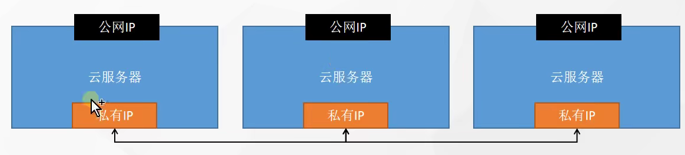
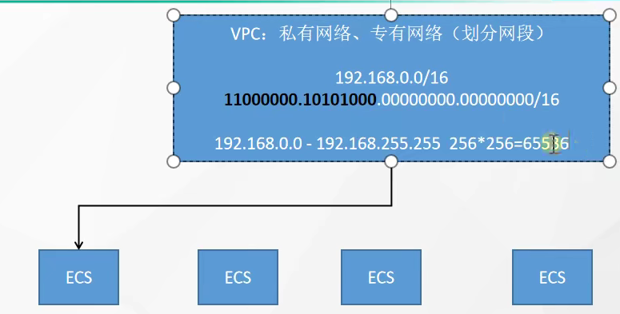
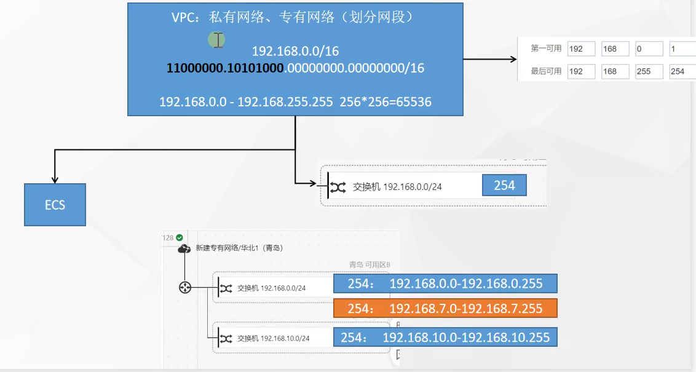

# 云平台核心

## 为什么用云平台

●环境统一
●按需付费 
●即开即用 
●稳定性强

......
国内常见云平台：
●[阿里云](https://promotion.aliyun.com/ntms/act/ambassador/sharetouser.html?userCode=50sid5bu&utm_source=50sid5bu)、百度云、[腾讯云](https://curl.qcloud.com/iyFTRSJb)、[华为云](https://activity.huaweicloud.com/discount_area_v5/index.html?fromacct=d1a6f32e-d6d0-4702-9213-eafe022a0708&utm_source=bGVpZmVuZ3lhbmc==&utm_medium=cps&utm_campaign=201905)、青云......
国外常见云平台：
●亚马逊 AWS、微软 Azure ..

### 公有云

> 购买云服务商提供的公共服务器

公有云是最常见的云计算部署类型。公有云资源（例如服务器和存储空间）由第三方云服务提供商拥有和运营，这些资源通过 Internet 提供。在公有云中，所有硬件、软件和其他支持性基础结构均为云提供商所拥有和管理。Microsoft Azure 是公有云的一个示例。
在公有云中，你与其他组织或云“租户”共享相同的硬件、存储和网络设备，并且你可以使用 Web 浏览器访问服务和管理帐户。公有云部署通常用于提供基于 Web 的电子邮件、网上办公应用、存储以及测试和开发环境。
公有云优势：
●**成本更低**：无需购买硬件或软件，仅对使用的服务付费。
●**无需维护**：维护由服务提供商提供。
●**近乎无限制的缩放性**：提供按需资源，可满足业务需求。
●**高可靠性**：具备众多服务器，确保免受故障影响。
○可用性： N个9   9   全年的故障时间： 365*24*3600*(1-99.9999%)

### 私有云

> 自己搭建云平台，或者购买

私有云由专供一个企业或组织使用的云计算资源构成。私有云可在物理上位于组织的现场数据中心，也可由第三方服务提供商托管。但是，在私有云中，服务和基础结构始终在私有网络上进行维护，硬件和软件专供组织使用。
这样，私有云可使组织更加方便地自定义资源，从而满足特定的 IT 需求。私有云的使用对象通常为政府机构、金融机构以及其他具备业务关键性运营且希望对环境拥有更大控制权的中型到大型组织。
私有云优势：
●**灵活性更强**：组织可自定义云环境以满足特定业务需求。
●**控制力更强**：资源不与其他组织共享，因此能获得更高的控制力以及更高的隐私级别。
●**可伸缩性更强**：与本地基础结构相比，私有云通常具有更强的可伸缩性。

> 没有一种云计算类型适用于所有人。多种不同的云计算模型、类型和服务已得到发展，可以满足组织快速变化的技术需求。

> 部署云计算资源有三种不同的方法：公共云、私有云和混合云。采用的部署方法取决于业务需求。

## 核心构架

### 所需软件

[electerm](https://electerm.github.io/electerm/)：  https://electerm.github.io/electerm/

> https://wwa.lanzoui.com/b016k9bha
> 密码:900h

xshell

注册云平台：
●[阿里云](https://www.aliyun.com/daily-act/ecs/activity_selection?userCode=50sid5bu)   aliyun.com 
●[腾讯云](https://curl.qcloud.com/iyFTRSJb)   cloud.tencent.com
●[华为云](https://activity.huaweicloud.com/discount_area_v5/index.html?fromacct=d1a6f32e-d6d0-4702-9213-eafe022a0708&utm_source=bGVpZmVuZ3lhbmc==&utm_medium=cps&utm_campaign=201905)   cloud.huawei.com
[青云](https://www.qingcloud.com/promotion2021)       qingcloud.com
[百度云](http://cloud.baidu.com/)    cloud.baidu.com
.......

### 基础概念

●云服务器作为应用的最终载体
●VPC为所有云服务器提供网络隔离
●所有云服务器都是绑定某个私有网络
●**安全组**控制每个服务器的防火墙规则
●公网IP使得资源可访问
●端口转发的方式访问到具体服务器

私有IP一般不变，适合搭建集群内部用，按量付费的，下次启动，有可能公网IP就变了。私有IP之间互相访问不算流量费用，也比较快。

**VPC：私有网络、专有网络** 划分网段

VPC提供了一个隔离的

### 实战操作

1、**开通按量付费服务器**
你做完了吗？

2、开通基于VPC的服务器集群
理解VPC了吗？

