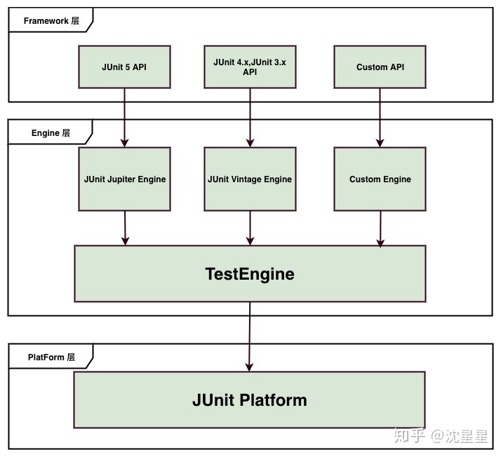

# 基本介绍

```xml
<dependency>
    <groupId>org.junit.jupiter</groupId>
    <artifactId>junit-jupiter-engine</artifactId>
    <version>5.5.8</version>
    <scope>test</scope>
</dependency>
```


参考来源：https://zhuanlan.zhihu.com/p/111706639

JUnit作为目前Java领域内最为流行的单元测试框架已经走过了数十年。而JUnit5在JUnit4停止更新版本的3年后终于也于2017年发布了。

作为最新版本的JUnit框架，JUnit5与之前版本的Junit框架有很大的不同。首先Junit5由来自三个不同子项目的几个不同模块组成。

JUnit 5 = JUnit Platform + JUnit Jupiter + JUnit Vintage

**JUnit Platform**: Junit Platform是在JVM上启动测试框架的基础，不仅支持Junit自制的测试引擎，其他测试引擎也都可以接入。

**JUnit Jupiter**: JUnit Jupiter提供了JUnit5的新的编程模型，是JUnit5新特性的核心。内部 包含了一个测试引擎，用于在Junit Platform上运行。

**JUnit Vintage**: 由于JUint已经发展多年，为了照顾老的项目，JUnit Vintage提供了兼容JUnit4.x,Junit3.x的测试引擎。

通过上述的介绍，不知道有没有发现JUint5似乎已经不再满足于安安静静做一个单元测试框架了，它的野心很大，想通过接入不同测试引擎，来支持各类测试框架的使用，成为一个单元测试的平台。因此它也采用了分层的架构，分成了平台层，引擎层，框架层。下图可以很清晰的体现出来:



只要实现了JUnit的测试引擎接口，任何测试框架都可以在JUnit Platform上运行，这代表着JUnit5将会有着很强的拓展性。

# 基本注解

JUnit5的注解与JUnit4的注解有所变化，以下列出的注解为部分我觉得常用的注解

**@Test :**表示方法是测试方法。但是与JUnit4的@Test不同，他的职责非常单一不能声明任何属性，拓展的测试将会由Jupiter提供额外测试

**@ParameterizedTest :**表示方法是参数化测试，下方会有详细介绍

**@RepeatedTest :**表示方法可重复执行，下方会有详细介绍

**@DisplayName :**为测试类或者测试方法设置展示名称

**@BeforeEach :**表示在每个单元测试之前执行

**@AfterEach :**表示在每个单元测试之后执行

**@BeforeAll :**表示在所有单元测试之前执行

**@AfterAll :**表示在所有单元测试之后执行

**@Tag :**表示单元测试类别，类似于JUnit4中的@Categories

**@Disabled :**表示测试类或测试方法不执行，类似于JUnit4中的@Ignore

**@Timeout :**表示测试方法运行如果超过了指定时间将会返回错误

**@ExtendWith :**为测试类或测试方法提供扩展类引用

# 新的特性

## 更强大的断言

JUnit5使用了新的断言类:org.junit.jupiter.api.Assertions。相比之前的Assert断言类多了许多新的功能，并且大量方法支持Java8的Lambda表达式。

以下为两个与JUnit4不太一样的断言方式:

### 1. 异常断言

在JUnit4时期，想要测试方法的异常情况时，需要用**@Rule**注解的[ExpectedException变量](https://www.zhihu.com/search?q=ExpectedException变量&search_source=Entity&hybrid_search_source=Entity&hybrid_search_extra={"sourceType"%3A"article"%2C"sourceId"%3A111706639})还是比较麻烦的。而JUnit5提供了一种新的断言方式**Assertions.assertThrows()** ,配合函数式编程就可以进行使用。

```java
@Test
@DisplayName("异常测试")
public void exceptionTest() {
    ArithmeticException exception = Assertions.assertThrows(
           //扔出断言异常
            ArithmeticException.class, () -> System.out.println(1 % 0));

}
```

### 2. 超时断言

Junit5还提供了**Assertions.assertTimeout()** 为测试方法设置了超时时间

```java
@Test
@DisplayName("超时测试")
public void timeoutTest() {
    //如果测试方法时间超过1s将会异常
    Assertions.assertTimeout(Duration.ofMillis(1000), () -> Thread.sleep(500));
}
```

## 参数化测试

参数化测试是JUnit5很重要的一个新特性，也是我认为JUnit5最惊艳到我的一个功能。它使得用不同的参数多次运行测试成为了可能，也为我们的单元测试带来许多便利。

### 基础用法

利用**@ValueSource**等注解，指定入参，我们将可以使用不同的参数进行多次单元测试，而不需要每新增一个参数就新增一个单元测试，省去了很多冗余代码。

**@ValueSource**: 为参数化测试指定入参来源，支持八大基础类以及String类型,Class类型

**@NullSource**: 表示为参数化测试提供一个null的入参

**@EnumSource**: 表示为参数化测试提供一个枚举入参

```java
@ParameterizedTest
@ValueSource(strings = {"one", "two", "three"})
@DisplayName("参数化测试1")
public void parameterizedTest1(String string) {
    System.out.println(string);
    Assertions.assertTrue(StringUtils.isNotBlank(string));
}
```

### 进阶用法

当然如果参数化测试仅仅只能做到指定普通的入参还达不到让我觉得惊艳的地步。让我真正感到他的强大之处的地方在于他可以支持外部的各类入参。如:CSV,YML,JSON 文件甚至方法的[返回值](https://www.zhihu.com/search?q=返回值&search_source=Entity&hybrid_search_source=Entity&hybrid_search_extra={"sourceType"%3A"article"%2C"sourceId"%3A111706639})也可以作为入参。只需要去实现**ArgumentsProvider**接口，任何外部文件都可以作为它的入参。

**@CsvFileSource**：表示读取指定CSV文件内容作为参数化测试入参

**@MethodSource**：表示读取指定方法的返回值作为参数化测试入参(注意方法返回需要是一个流)

```java
/**
 * csv文件内容:
 * shawn,24
 * uzi,50
 */
@ParameterizedTest
@CsvFileSource(resources = "/test.csv")  //指定csv文件位置
@DisplayName("参数化测试-csv文件")
public void parameterizedTest2(String name, Integer age) {
    System.out.println("name:" + name + ",age:" + age);
    Assertions.assertNotNull(name);
    Assertions.assertNotNull(age);
}

@ParameterizedTest
@MethodSource("method")    //指定方法名
@DisplayName("方法来源参数")
public void testWithExplicitLocalMethodSource(String name) {
    System.out.println(name);
    Assertions.assertNotNull(name);
}

static Stream<String> method() {
    return Stream.of("apple", "banana");
}
```

### 为什么要用参数化测试?

介绍完参数化测试，可能会觉得这个功能确实强大但是似乎应用场景并不多呀，毕竟我们写的大部分单元测试都不会去复用。其实不然，从外部文件读取入参有一个很大的好处。没错，就是**解耦**，使得测试逻辑与测试参数解耦，未来如果测试的参数改变了，我们不需要去修改测试代码，只需要修改对应的文件。让我们的测试逻辑不会被大量构造测试参数的代码干扰，能更专注于写好测试逻辑。

目前我们公司也有封装自己的**@FileSource**注解，用于从外部Json或Yaml文件中读取入参。单元测试代码的逻辑会非常清晰。相比于之前要自己用代码mock许多测试参数,使用这种方式可以让测试代码逻辑更加清晰。

```java
@DisplayName("创建咨询来源：成功创建")
@ParameterizedTest
@FileSource(resources = "testData/consultconfig_app_service.yaml")
public void testSaveConsultSource_SUCCESS(ConsultConfigAppServiceDTO dto) {
    //获取入参
    ConsultSourceSaveDTO saveDTO = dto.getSaveConsultSourceSuccess();
    //调用测试方法
    ConsultSourceBO consultSourceBO = consultConfigAppService.saveConsultSource(saveDTO);
    //验证
    Assertions.assertEquals("testConsultSourceCmd", consultSourceBO.getConsultChannelName());
}
```

## 内嵌单元测试

JUnit5提供了嵌套单元测试用于更好表示各个单元测试类之间的关系。平时我们写单元测试时一般都是一个类对应一个单元测试类。不过有些互相之间有业务关系的类，他们的单元测试完全是可以写在一起，使用内嵌的方式表示，减少测试类的数量防止类爆炸。

JUnit 5提供了**@Nested** 注解，能够以静态内部成员类的形式对测试用例类进行逻辑分组

```java
public class NestedTestDemo {

    @Test
    @DisplayName("Nested")
    void isInstantiatedWithNew() {
        System.out.println("最一层--内嵌单元测试");
    }

    @Nested
    @DisplayName("Nested2")
    class Nested2 {

        @BeforeEach
        void Nested2_init() {
            System.out.println("Nested2_init");
        }

        @Test
        void Nested2_test() {
            System.out.println("第二层-内嵌单元测试");
        }


        @Nested
        @DisplayName("Nested3")
        class Nested3 {

            @BeforeEach
            void Nested3_init() {
                System.out.println("Nested3_init");
            }

            @Test
            void Nested3_test() {
                System.out.println("第三层-内嵌单元测试");
            }
        }
    }

}
```


## 重复测试

```java
@RepeatedTest(10) //表示重复执行10次
@DisplayName("重复测试")
public void testRepeated() {
    Assertions.assertTrue(1 == 1);
}
```


## 动态测试

JUnit5允许我们动态的创建单元测试,通过**@TestFactory**注解，会在运行时生成单元测试。需要注意的是**@TestFactory**修饰的方法本身并不是单元测试，他只是负责生成单元测试。我们只需要返回 DynamicTest的迭代器甚至是流即可生成不同的单元测试。

```java
@TestFactory
@DisplayName("动态测试")
Iterator<DynamicTest> dynamicTests() {
    return Arrays.asList(
            dynamicTest("第一个动态测试", () -> assertTrue(true)),
            dynamicTest("第二个动态测试", () -> assertEquals(4, 2 * 2))
    ).iterator();
}
```

