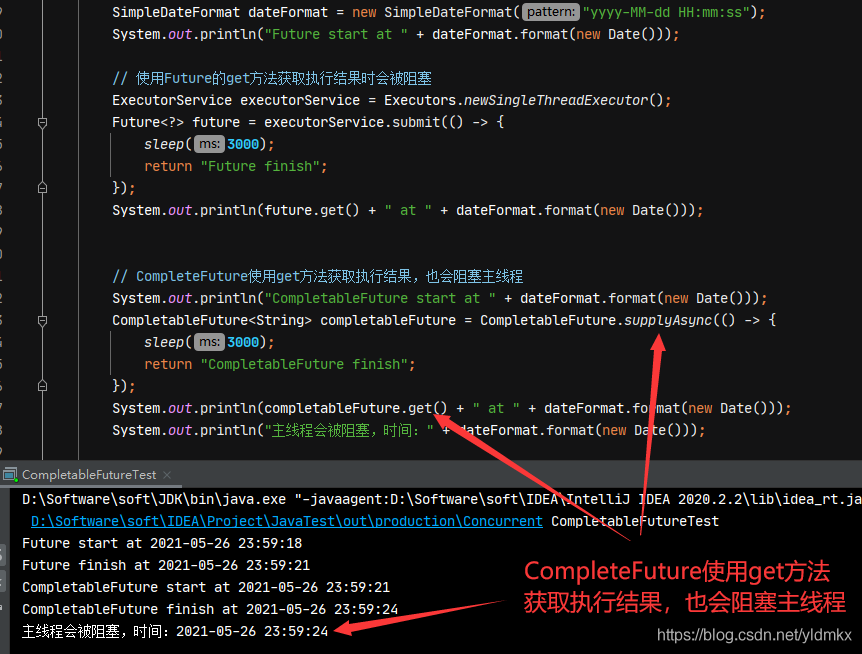
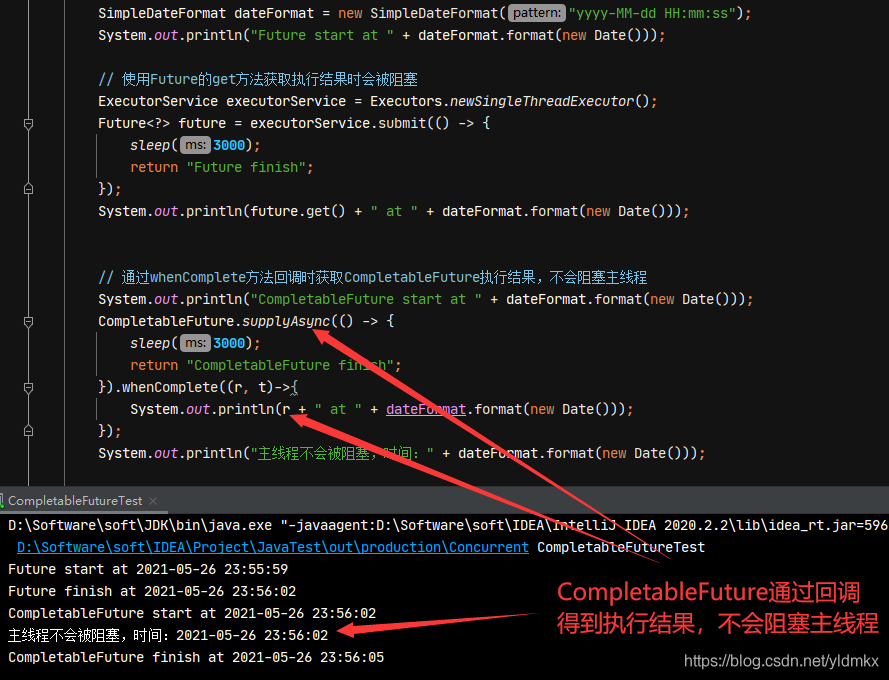
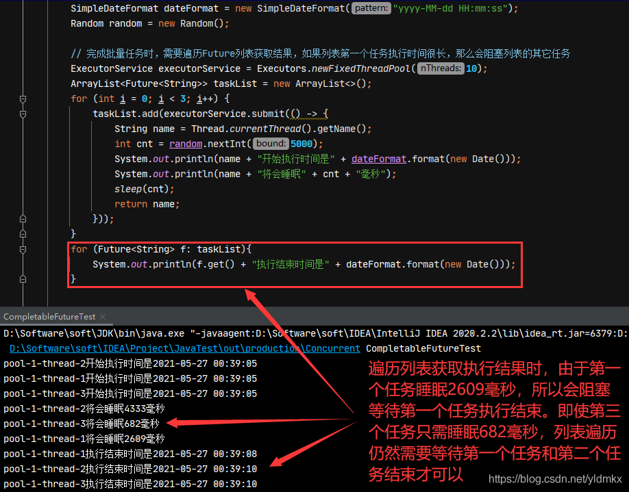
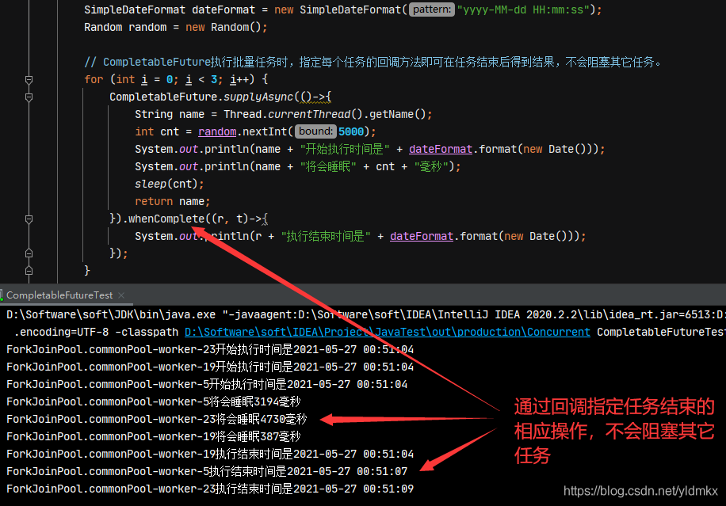
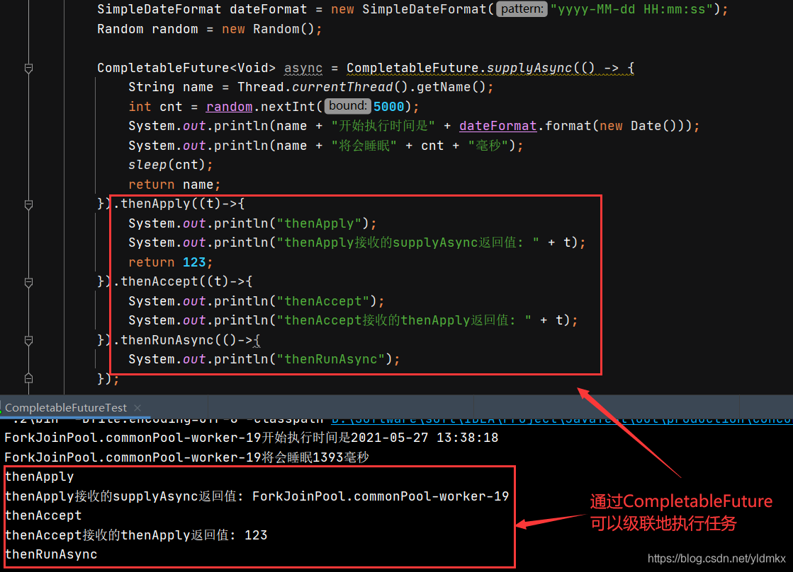
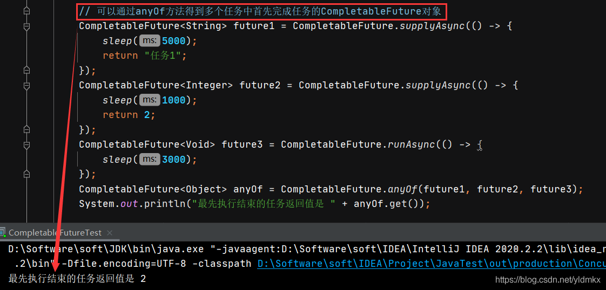

# 其他语言

## C#中async/await

https://www.cnblogs.com/zhaoshujie/p/11192036.html

用`async`来修饰一个方法，表明这个方法是异步的，声明的方法的返回类型必须为：`void`或`Task`或`Task<TResult>`。方法内部必须含有`await`修饰的方法，如果方法内部没有`await`关键字修饰的表达式，哪怕函数被`async`修饰也只能算作同步方法，执行的时候也是同步执行的。

被await修饰的只能是`Task`或者`Task<TResule>`类型，通常情况下是一个返回类型是`Task/Task<TResult>`的方法，当然也可以修饰一个`Task/Task<TResult>`变量，await只能出现在已经用async关键字修饰的异步方法中。上面代码中就是修饰了一个变量`ResultFromTimeConsumingMethod`。

关于被修饰的对象，也就是返回值类型是`Task`和`Task<TResult>`函数或者`Task/Task<TResult>`类型的变量：如果是被修饰对象的前面用`await`修饰，那么返回值实际上是`void`或者`TResult`（示例中`ResultFromTimeConsumingMethod`是`TimeConsumingMethod()`函数的返回值，也就是`Task<string>`类型，当`ResultFromTimeConsumingMethod`在前面加了`await`关键字后 `await ResultFromTimeConsumingMethod`实际上完全等于 `ResultFromTimeConsumingMethod.Result`）。如果没有`await`，返回值就是`Task`或者`Task<TResult>`。

https://blog.csdn.net/weixin_30245867/article/details/96900776

在.NET4.5中，我们可以配合使用async和await两个关键字，来以写同步代码的方式，实现异步的操作。

好处我目前看来有两点：

1.**不会阻塞UI线程**。一旦UI线程不能及时响应，会极大的影响用户体验，这点在手机和平板的APP上尤为重要。

2.代码简洁。

- 相对基于event的异步方式，在多次回调的情况下（比如需要多次调web service，且后续调用基于前次调用的结果）特别明显。可以将多个+=Completed方法合并到一起。
- 相对于Begin/End的异步方式，避免了N重且不能对齐的大括号。

## javascript 中 async/await

https://www.cnblogs.com/lonelyshy/p/13726674.html

https://developer.mozilla.org/zh-CN/docs/Web/JavaScript/Reference/Statements/async_function

`async`和`await`关键字让我们可以用一种更简洁的方式写出基于[`Promise`](https://developer.mozilla.org/zh-CN/docs/Web/JavaScript/Reference/Global_Objects/Promise)的异步行为，而无需刻意地链式调用`promise`。

# java中的异步

原生：线程、线程池

## Future

多线程场景时，一般是实现runnable接口，覆写run方法，返回值是void类型，因此这种情况下不需要线程的返回结果。 
如果需要线程的返回结果，就需要用callable接口来代替了。 
callable用法和runnable一样，只不过覆写的是call方法，该方法有一个泛型返回值类型，可以根据需要指定。 
那么何时到Future呢？当你启动callable线程时，就可以声明一个Future对象，用于接收返回结果。
Futrue可以监视目标线程调用call的情况，当你调用Future的get()方法以获得结果时，调用方的线程就被阻塞，直到目标线程的call方法结束并返回结果。
Future接口，一般都是取回Callable执行的状态用的。其中的主要方法：

cancel，取消Callable的执行，当Callable还没有完成时
get，获得Callable的返回值
isCanceled，判断是否取消了
isDone，判断是否完成

## CompletableFuture

[Future和CompletableFuture的用法和区别_编程南山下的博客-CSDN博客](https://blog.csdn.net/qq_28908085/article/details/108267347)

-  创建异步操作，runAsync（不支持返回值） 和 supplyAsync方法（支持返回值）
- 计算结果完成时的回调方法
     whenComplete：执行完当前任务的线程，继续执行 whenComplete 的任务。
     whenCompleteAsync： 执行完当前任务的线程，把whenCompleteAsync 的任务继续提交给线程池来执行。
     exceptionally：当前任务出现异常时，执行exceptionally中的回调方法。
- thenApply 方法，当一个线程依赖另一个线程时，可以使用 thenApply 方法来把这两个线程串行化。
- handle 方法
  handle 是执行任务完成时对结果的处理。
  handle 方法和 thenApply 方法处理方式基本一样。不同的是 handle 是在任务完成后再执行，还可以处理异常的任务。thenApply 只可以执行正常的任务，任务出现异常则不执行 thenApply 方法。
- thenAccept 消费处理结果，接收任务的处理结果，并消费处理，无返回结果。
- thenRun 方法，跟 thenAccept 方法不一样的是，不关心任务的处理结果。只要上面的任务执行完成，就开始执行 thenAccept 。
- thenCombine 合并任务，thenCombine 会把 两个 CompletionStage 的任务都执行完成后，把两个任务的结果一块交给 thenCombine 来处理。
- thenCompose 方法，thenCompose 方法允许你对两个 CompletionStage 进行流水线操作，第一个操作完成时，将其结果作为参数传递给第二个操作。

## Springboot @Async

https://www.cnblogs.com/huanzi-qch/p/11231041.html

大致步骤：

- 启动类加入@EnableAsync 开启异步调用
- 业务方法返回Future且标注 @Async("asyncTaskExecutor")，asyncTaskExecutor是自定义的线程池
- 配置线程池 asyncTaskExecutor

注意点：https://www.cnblogs.com/baixianlong/p/10661591.html

- 在默认情况下，未设置TaskExecutor时，默认是使用SimpleAsyncTaskExecutor这个线程池，但此线程不是真正意义上的线程池，因为线程不重用，每次调用都会创建一个新的线程。可通过控制台日志输出可以看出，每次输出线程名都是递增的。所以最好我们来自定义一个线程池。
- 调用的异步方法，不能为同一个类的方法（包括同一个类的内部类），简单来说，因为Spring在启动扫描时会为其创建一个代理类，而同类调用时，还是调用本身的代理类的，所以和平常调用是一样的。其他的注解如@Cache等也是一样的道理，说白了，就是Spring的代理机制造成的。所以在开发中，最好把异步服务单独抽出一个类来管理。下面会重点讲述。。

失效的情况：

1. 调用同一个类下注有@Async异步方法：在spring中像@Async和@Transactional、cache等注解本质使用的是动态代理，其实Spring容器在初始化的时候Spring容器会将含有AOP注解的类对象“替换”为代理对象（简单这么理解），那么注解失效的原因就很明显了，就是因为调用方法的是对象本身而不是代理对象，因为没有经过Spring容器，那么解决方法也会沿着这个思路来解决。
2. 调用的是静态(static )方法
3. 调用(private)私有化方法

针对失效1的情况解决：

1. 将要异步执行的方法单独抽取成一个类，原理就是当你把执行异步的方法单独抽取成一个类的时候，这个类肯定是被Spring管理的，其他Spring组件需要调用的时候肯定会注入进去，这时候实际上注入进去的就是代理类了。
2. 其实我们的注入对象都是从Spring容器中给当前Spring组件进行成员变量的赋值，由于某些类使用了AOP注解，那么实际上在Spring容器中实际存在的是它的代理对象。那么我们就可以通过上下文获取自己的代理对象调用异步方法。

## AsyncResult和CompletableFuture

AsyncResult和是CompletableFuture都是Future接口的实现类

CompletableFuture 与 AsyncResult  使用场景相同，都是使用get（）获取返回异步方法返回结果，且会等待异步方法执行结束。

## Future和CompletableFuture的区别

Future在Java5就引入了。

优点：一定程度上让一个线程池内的任务异步执行了
缺点：传统回调最大的问题就是不能将控制流分离到不同的事件处理器中。例如主线程等待各个异步执行的线程返回的结果来做下一步操作，则**必须阻塞在future.get()的地方等待结果返回。这时候又变成同步了**。

CompletableFuture在Java8引入。

实现了Future和CompletionStage接口，保留了Future的优点，并且弥补了其不足。即异步的任务完成后，需要用其结果继续操作时，无需等待。**可以直接通过thenAccept、thenApply、thenCompose等方式将前面异步处理的结果交给另外一个异步事件处理线程来处理**。
可见，这种方式才是我们需要的异步处理。一个控制流的多个异步事件处理能无缝的连接在一起。

[Future和CompletableFuture的区别和对比，以及Future主要的四个缺点——不能回调会阻塞、批量任务处理彼此依赖会阻塞、不能多个任务级联执行、得不到最先完成的任务_走过路过不要错过-CSDN博客_completablefuture和future的区别](https://blog.csdn.net/yldmkx/article/details/117308334)

CompletableFuture内线程池的线程是守护线程，所以主线程执行结束会自动结束

1. **Future在执行结束后没法回调，调用get方法会被阻塞；CompletableFuture调用get方法获取结果也会被阻塞。**

**2. 但是CompletableFuture可以回调，可不通过get方法获取结果。**

**3. Future模式执行批量任务，在完成任务后要想执行其它任务得通过get方法获取结果，在依次遍历Future列表时，各个get方法依赖于Future列表顺序。**

**4. CompletableFuture模式通过回调可以得到执行结果，各自完成任务可以立即执行接下来的任务。**

**5. 通过实现CompletionStage接口，CompletableFuture对象可以级联地执行任务**

**6. 可以通过anyOf方法得到多个任务中首先完成任务的CompletableFuture对象**

