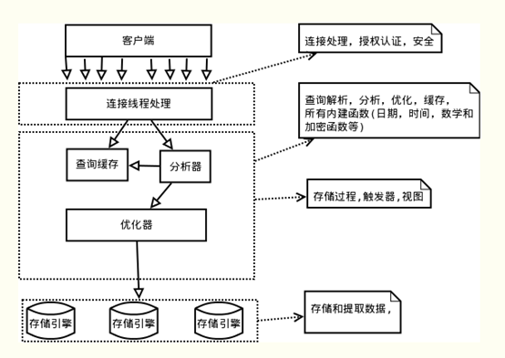
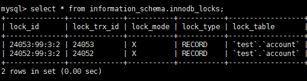
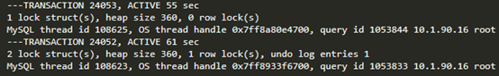

来源：https://www.cnblogs.com/kismetv/p/10331633.html

# 基础概念

## 逻辑架构和存储引擎



如上图所示，MySQL服务器逻辑架构从上往下可以分为三层：

（1）第一层：处理客户端连接、授权认证等。

（2）第二层：服务器层，负责查询语句的解析、优化、缓存以及内置函数的实现、存储过程等。

（3）第三层：存储引擎，负责MySQL中数据的存储和提取。**MySQL****中服务器层不管理事务，事务是由存储引擎实现的。**MySQL支持事务的存储引擎有InnoDB、NDB Cluster等，其中InnoDB的使用最为广泛；其他存储引擎不支持事务，如MyIsam、Memory等。

如无特殊说明，后文中描述的内容都是基于InnoDB。

## 提交和回滚

典型的MySQL事务是如下操作的：

```sql
start transaction;
…… #一条或多条sql语句
commit;
```

其中start transaction标识事务开始，commit提交事务，将执行结果写入到数据库。如果sql语句执行出现问题，会调用rollback，回滚所有已经执行成功的sql语句。当然，也可以在事务中直接使用rollback语句进行回滚。

**自动提交**

MySQL中默认采用的是自动提交（autocommit）模式，如下所示：

在自动提交模式下，如果没有start transaction显式地开始一个事务，那么每个sql语句都会被当做一个事务执行提交操作。

通过如下方式，可以关闭autocommit；需要注意的是，autocommit参数是针对连接的，在一个连接中修改了参数，不会对其他连接产生影响。

如果关闭了autocommit，则所有的sql语句都在一个事务中，直到执行了commit或rollback，该事务结束，同时开始了另外一个事务。

**特殊操作**

在MySQL中，存在一些特殊的命令，如果在事务中执行了这些命令，会马上强制执行commit提交事务；如DDL语句(create table/drop table/alter/table)、lock tables语句等等。

不过，常用的select、insert、update和delete命令，都不会强制提交事务。

## ACID

ACID是衡量事务的四个特性：

- 原子性（Atomicity，或称不可分割性）
- 一致性（Consistency）
- 隔离性（Isolation）
- 持久性（Durability）

按照严格的标准，只有同时满足ACID特性才是事务；但是在各大数据库厂商的实现中，真正满足ACID的事务少之又少。例如MySQL的NDB Cluster事务不满足持久性和隔离性；InnoDB默认事务隔离级别是可重复读，不满足隔离性；Oracle默认的事务隔离级别为READ COMMITTED，不满足隔离性……**因此与其说ACID是事务必须满足的条件，不如说它们是衡量事务的四个维度。**


# 原子性的实现：undo log

原子性是指一个事务是一个不可分割的工作单位，其中的操作要么都做，要么都不做；如果事务中一个sql语句执行失败，则已执行的语句也必须回滚，数据库退回到事务前的状态。

undo log就是把所有**没有COMMIT的事务回滚到事务开始之前的状态(**撤销事务在系统崩溃前可能还没有完成的影响来恢复数据库状态)，对于已经commit的事务不做任何处理。

InnoDB实现回滚，靠的是undo log：当事务对数据库进行修改时，InnoDB会生成对应的undo log；如果事务执行失败或调用了rollback，导致事务需要回滚，便可以利用undo log中的信息将数据回滚到修改之前的样子。

undo log属于逻辑日志，它记录的是sql执行相关的信息。当发生回滚时，**InnoDB会根据undo log的内容做与之前相反的工作**：对于**每个insert，回滚时会执行delete；对于每个delete，回滚时会执行insert；对于每个update，回滚时会执行一个相反的update，把数据改回去**。

以update操作为例：当事务执行update时，其生成的undo log中会包含被修改行的主键(以便知道修改了哪些行)、修改了哪些列、这些列在修改前后的值等信息，回滚时便可以使用这些信息将数据还原到update之前的状态。

# 持久性的实现：redo log

持久性是指事务一旦提交，它对数据库的改变就应该是永久性的。接下来的其他操作或故障不应该对其有任何影响。

InnoDB作为MySQL的存储引擎，数据是存放在磁盘中的，但如果每次读写数据都需要磁盘IO，效率会很低。为此，InnoDB提供了缓存(Buffer Pool)，Buffer Pool中包含了磁盘中部分数据页的映射，作为访问数据库的缓冲：当从数据库读取数据时，会首先从Buffer Pool中读取，如果Buffer Pool中没有，则从磁盘读取后放入Buffer Pool；当向数据库写入数据时，会首先写入Buffer Pool，Buffer Pool中修改的数据会定期刷新到磁盘中（这一过程称为刷脏）。

Buffer Pool的使用大大提高了读写数据的效率，但是也带了新的问题：如果MySQL宕机，而此时Buffer Pool中修改的数据还没有刷新到磁盘，就会导致数据的丢失，事务的持久性无法保证。

于是，redo log被引入来解决这个问题：当数据修改时，除了修改Buffer Pool中的数据，还会在redo log记录这次操作；当事务提交时，会调用fsync接口对redo log进行刷盘。如果MySQL宕机，重启时可以读取redo log中的数据，对数据库进行恢复。redo log采用的是WAL（Write-ahead logging，预写式日志），所有修改先写入日志，再更新到Buffer Pool，保证了数据不会因MySQL宕机而丢失，从而满足了持久性要求。

既然redo log也需要在事务提交时将日志写入磁盘，为什么它比直接将Buffer Pool中修改的数据写入磁盘(即刷脏)要快呢？主要有以下两方面的原因：

（1）刷脏是随机IO，因为每次修改的数据位置随机，但写redo log是追加操作，属于顺序IO。

（2）刷脏是以数据页（Page）为单位的，MySQL默认页大小是16KB，一个Page上一个小修改都要整页写入；而redo log中只包含真正需要写入的部分，无效IO大大减少。

# redo log与binlog

我们知道，在MySQL中还存在binlog(二进制日志)也可以记录写操作并用于数据的恢复，但二者是有着根本的不同的：

（1）作用不同：redo log是用于crash recovery的，保证MySQL宕机也不会影响持久性；binlog是用于point-in-time recovery的，保证服务器可以基于时间点恢复数据，此外binlog还用于主从复制。

（2）层次不同：redo log是InnoDB存储引擎实现的，而binlog是MySQL的服务器层(可以参考文章前面对MySQL逻辑架构的介绍)实现的，同时支持InnoDB和其他存储引擎。

（3）内容不同：redo log是物理日志，内容基于磁盘的Page；binlog的内容是二进制的，根据binlog_format参数的不同，可能基于sql语句、基于数据本身或者二者的混合。

（4）写入时机不同：binlog在事务提交时写入；redo log的写入时机相对多元：

- 前面曾提到：当事务提交时会调用fsync对redo log进行刷盘；这是默认情况下的策略，修改innodb_flush_log_at_trx_commit参数可以改变该策略，但事务的持久性将无法保证。
- 除了事务提交时，还有其他刷盘时机：如master thread每秒刷盘一次redo log等，这样的好处是不一定要等到commit时刷盘，commit速度大大加快。

# 隔离性的实现：锁和MVCC

**隔离性研究的是不同事务之间的相互影响**

隔离性是指，事务内部的操作与其他事务是隔离的，并发执行的各个事务之间不能互相干扰。严格的隔离性，对应了事务隔离级别中的Serializable (可串行化)，但实际应用中出于性能方面的考虑很少会使用可串行化。

隔离性的探讨，主要可以分为两个方面：

- (一个事务)写操作对(另一个事务)写操作的影响：锁机制保证隔离性
- (一个事务)写操作对(另一个事务)读操作的影响：MVCC保证隔离性

## 锁机制

锁机制的基本原理可以概括为：事务在修改数据之前，需要先获得相应的锁；获得锁之后，事务便可以修改数据；该事务操作期间，这部分数据是锁定的，其他事务如果需要修改数据，需要等待当前事务提交或回滚后释放锁。

**行锁与表锁**

按照粒度，锁可以分为表锁、行锁以及其他位于二者之间的锁。表锁在操作数据时会锁定整张表，并发性能较差；行锁则只锁定需要操作的数据，并发性能好。但是由于加锁本身需要消耗资源(获得锁、检查锁、释放锁等都需要消耗资源)，因此在锁定数据较多情况下使用表锁可以节省大量资源。MySQL中不同的存储引擎支持的锁是不一样的，例如MyIsam只支持表锁，而InnoDB同时支持表锁和行锁，且出于性能考虑，绝大多数情况下使用的都是行锁。

**如何查看锁信息**

有多种方法可以查看InnoDB中锁的情况，例如：

```
select` `* ``from` `information_schema.innodb_locks; #锁的概况``show engine innodb status; #InnoDB整体状态，其中包括锁的情况
```

下面来看一个例子：

```
#在事务A中执行：``start ``transaction``;``update` `account ``SET` `balance = 1000 ``where` `id = 1;``#在事务B中执行：``start ``transaction``;``update` `account ``SET` `balance = 2000 ``where` `id = 1;
```

此时查看锁的情况：



show engine innodb status查看锁相关的部分：



通过上述命令可以查看事务24052和24053占用锁的情况；其中lock_type为RECORD，代表锁为行锁(记录锁)；lock_mode为X，代表排它锁(写锁)。

除了排它锁(写锁)之外，MySQL中还有共享锁(读锁)的概念。由于本文重点是MySQL事务的实现原理，因此对锁的介绍到此为止，后续会专门写文章分析MySQL中不同锁的区别、使用场景等，欢迎关注。

 

介绍完写操作之间的相互影响，下面讨论写操作对读操作的影响。

在实际应用中，读未提交在并发时会导致很多问题，而性能相对于其他隔离级别提高却很有限，因此使用较少。可串行化强制事务串行，并发效率很低，只有当对数据一致性要求极高且可以接受没有并发时使用，因此使用也较少。因此在大多数数据库系统中，默认的隔离级别是**读已提交(如Oracle)或可重复读（后文简称RR）**。

InnoDB默认的隔离级别是RR，后文会重点介绍RR。需要注意的是，在SQL标准中，RR是无法避免幻读问题的，但是InnoDB实现的RR避免了幻读问题。

## MVCC

MVCC全称Multi-Version Concurrency Control，即多版本的并发控制协议。

MVCC最大的优点是读不加锁，因此读写不冲突，并发性能好。InnoDB实现MVCC，多个版本的数据可以共存，主要基于以下技术及数据结构：

1）隐藏列：InnoDB中每行数据都有隐藏列，隐藏列中包含了本行数据的事务id、指向undo log的指针等。

2）基于undo log的版本链：前面说到每行数据的隐藏列中包含了指向undo log的指针，而每条undo log也会指向更早版本的undo log，从而形成一条版本链。

3）ReadView：通过隐藏列和版本链，MySQL可以将数据恢复到指定版本；但是具体要恢复到哪个版本，则需要根据ReadView来确定。所谓ReadView，是指事务（记做事务A）在某一时刻给整个事务系统（trx_sys）打快照，之后再进行读操作时，会将读取到的数据中的事务id与trx_sys快照比较，从而判断数据对该ReadView是否可见，即对事务A是否可见。

trx_sys中的主要内容，以及判断可见性的方法如下：

- low_limit_id：表示生成ReadView时系统中应该分配给下一个事务的id。如果数据的事务id大于等于low_limit_id，则对该ReadView不可见。
- up_limit_id：表示生成ReadView时当前系统中活跃的读写事务中最小的事务id。如果数据的事务id小于up_limit_id，则对该ReadView可见。
- rw_trx_ids：表示生成ReadView时当前系统中活跃的读写事务的事务id列表。如果数据的事务id在low_limit_id和up_limit_id之间，则需要判断事务id是否在rw_trx_ids中：如果在，说明生成ReadView时事务仍在活跃中，因此数据对ReadView不可见；如果不在，说明生成ReadView时事务已经提交了，因此数据对ReadView可见。


## 一致性的实现：由其他特性和应用层共同保障

可以说，一致性是事务追求的最终目标：前面提到的原子性、持久性和隔离性，都是为了保证数据库状态的一致性。此外，除了数据库层面的保障，一致性的实现也需要应用层面进行保障。

实现一致性的措施包括：

- 保证原子性、持久性和隔离性，如果这些特性无法保证，事务的一致性也无法保证
- 数据库本身提供保障，例如不允许向整形列插入字符串值、字符串长度不能超过列的限制等
- 应用层面进行保障，例如如果转账操作只扣除转账者的余额，而没有增加接收者的余额，无论数据库实现的多么完美，也无法保证状态的一致